# API Reference

<cite>
**Referenced Files in This Document**
- [audio_manager.h](file://src/audio_manager.h)
- [audio_manager.cpp](file://src/audio_manager.cpp)
- [transcriber.h](file://src/transcriber.h)
- [transcriber.cpp](file://src/transcriber.cpp)
- [overlay.h](file://src/overlay.h)
- [overlay.cpp](file://src/overlay.cpp)
- [dashboard.h](file://src/dashboard.h)
- [dashboard.cpp](file://src/dashboard.cpp)
- [formatter.h](file://src/formatter.h)
- [formatter.cpp](file://src/formatter.cpp)
- [snippet_engine.h](file://src/snippet_engine.h)
- [snippet_engine.cpp](file://src/snippet_engine.cpp)
- [config_manager.h](file://src/config_manager.h)
- [config_manager.cpp](file://src/config_manager.cpp)
- [injector.h](file://src/injector.h)
- [injector.cpp](file://src/injector.cpp)
</cite>

## Table of Contents
1. [Introduction](#introduction)
2. [Project Structure](#project-structure)
3. [Core Components](#core-components)
4. [Architecture Overview](#architecture-overview)
5. [Detailed Component Analysis](#detailed-component-analysis)
6. [Dependency Analysis](#dependency-analysis)
7. [Performance Considerations](#performance-considerations)
8. [Troubleshooting Guide](#troubleshooting-guide)
9. [Conclusion](#conclusion)
10. [Appendices](#appendices)

## Introduction
This document provides a comprehensive API reference for the Flow-On public interfaces and component APIs. It covers:
- Audio Manager API for PCM capture, buffer management, and device configuration
- Transcriber API integrating Whisper, model loading, GPU acceleration, and transcription callbacks
- Overlay API for Direct2D rendering, animations, state management, and visual feedback
- Dashboard API for settings management, history tracking, and UI interactions
- Formatter API for text processing, formatting modes, and context-aware transformations
- Snippet Engine API for text substitution, triggers, and expansion logic
- Configuration Manager API for settings persistence, validation, and runtime updates
- Injector API for text injection, application detection, and fallback mechanisms

Each API section documents method signatures, parameters, return values, usage notes, threading, and integration examples.

## Project Structure
The project is organized around modular components, each exposing a public header with implementation details in a matching .cpp file. Public headers define the APIs documented here.

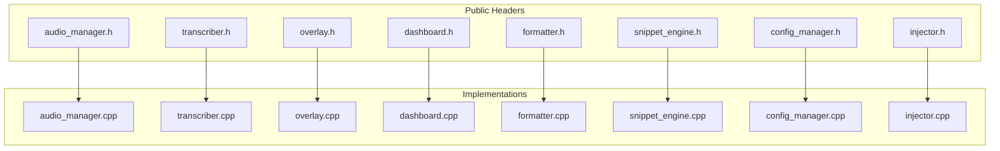

**Diagram sources**
- [audio_manager.h](file://src/audio_manager.h#L1-L42)
- [audio_manager.cpp](file://src/audio_manager.cpp#L1-L122)
- [transcriber.h](file://src/transcriber.h#L1-L29)
- [transcriber.cpp](file://src/transcriber.cpp#L1-L226)
- [overlay.h](file://src/overlay.h#L1-L94)
- [overlay.cpp](file://src/overlay.cpp#L1-L659)
- [dashboard.h](file://src/dashboard.h#L1-L69)
- [dashboard.cpp](file://src/dashboard.cpp#L1-L454)
- [formatter.h](file://src/formatter.h#L1-L14)
- [formatter.cpp](file://src/formatter.cpp#L1-L148)
- [snippet_engine.h](file://src/snippet_engine.h#L1-L26)
- [snippet_engine.cpp](file://src/snippet_engine.cpp#L1-L82)
- [config_manager.h](file://src/config_manager.h#L1-L40)
- [config_manager.cpp](file://src/config_manager.cpp#L1-L108)
- [injector.h](file://src/injector.h#L1-L9)
- [injector.cpp](file://src/injector.cpp#L1-L75)

**Section sources**
- [audio_manager.h](file://src/audio_manager.h#L1-L42)
- [transcriber.h](file://src/transcriber.h#L1-L29)
- [overlay.h](file://src/overlay.h#L1-L94)
- [dashboard.h](file://src/dashboard.h#L1-L69)
- [formatter.h](file://src/formatter.h#L1-L14)
- [snippet_engine.h](file://src/snippet_engine.h#L1-L26)
- [config_manager.h](file://src/config_manager.h#L1-L40)
- [injector.h](file://src/injector.h#L1-L9)

## Core Components
This section summarizes the public APIs and their responsibilities.

- Audio Manager: Initializes and manages a 16 kHz mono PCM capture device, enqueues audio samples into a lock-free ring buffer, exposes RMS energy, and drains buffered PCM for transcription.
- Transcriber: Loads a Whisper model (attempting GPU then falling back to CPU), performs asynchronous transcription, and posts completion messages with results.
- Overlay: Renders a floating Direct2D “pill” overlay with state-driven animations and real-time waveform visualization.
- Dashboard: Manages a modern Direct2D dashboard UI, history entries, and settings change notifications.
- Formatter: Applies a four-pass transformation pipeline to cleaned transcription text, with optional coding-mode transformations.
- Snippet Engine: Performs case-insensitive word-level substitutions based on configured triggers.
- Configuration Manager: Loads/saves JSON settings, applies autostart registry keys, and validates snippet sizes.
- Injector: Injects text into the active application using SendInput for short text or clipboard paste for longer/emoji-rich text.

**Section sources**
- [audio_manager.h](file://src/audio_manager.h#L9-L41)
- [transcriber.h](file://src/transcriber.h#L10-L28)
- [overlay.h](file://src/overlay.h#L18-L93)
- [dashboard.h](file://src/dashboard.h#L36-L68)
- [formatter.h](file://src/formatter.h#L4-L13)
- [snippet_engine.h](file://src/snippet_engine.h#L7-L19)
- [config_manager.h](file://src/config_manager.h#L21-L39)
- [injector.h](file://src/injector.h#L4-L8)

## Architecture Overview
The system integrates audio capture, transcription, formatting, snippet expansion, and UI feedback. The diagram below maps the major components and their interactions.

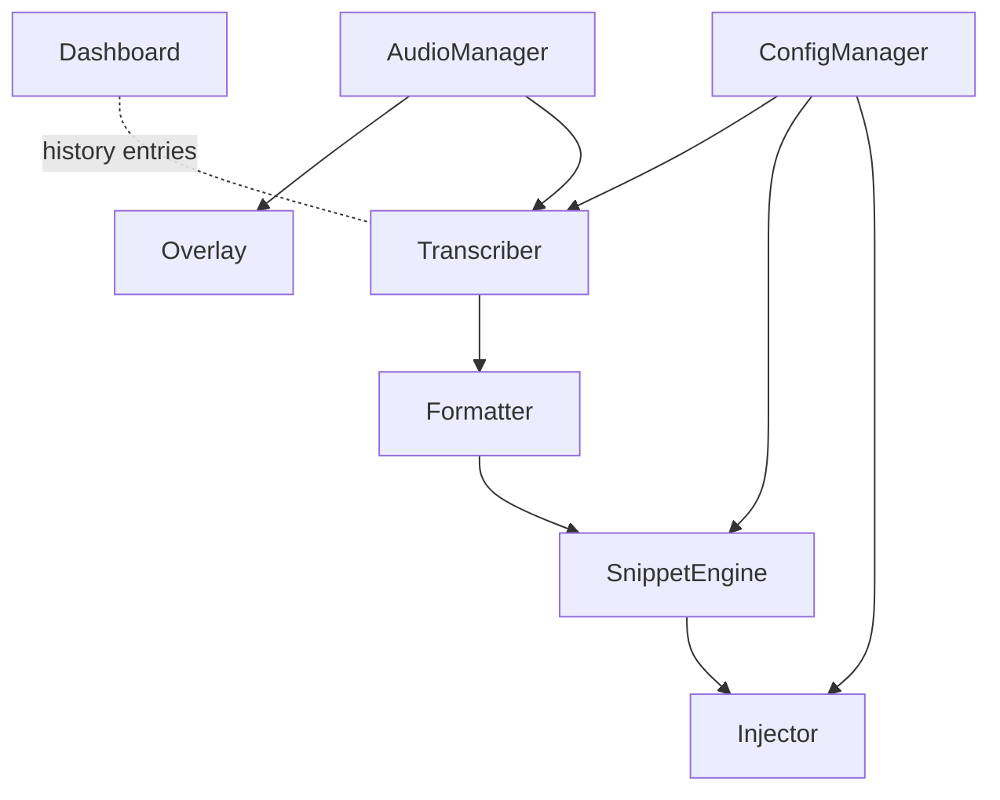

**Diagram sources**
- [audio_manager.h](file://src/audio_manager.h#L9-L41)
- [transcriber.h](file://src/transcriber.h#L10-L28)
- [overlay.h](file://src/overlay.h#L18-L93)
- [dashboard.h](file://src/dashboard.h#L36-L68)
- [formatter.h](file://src/formatter.h#L13)
- [snippet_engine.h](file://src/snippet_engine.h#L15)
- [config_manager.h](file://src/config_manager.h#L29-L34)
- [injector.h](file://src/injector.h#L8)

## Detailed Component Analysis

### Audio Manager API
Responsibilities:
- Initialize microphone capture at 16 kHz mono
- Enqueue PCM samples into a lock-free ring buffer
- Expose RMS energy and dropped-sample count
- Drain buffered PCM for transcription
- Shutdown capture device

Public interface summary:
- init(cb): Opens the microphone and registers a sample callback invoked from the audio thread. Keep callbacks minimal.
- startCapture(): Arms recording and drains stale samples.
- stopCapture(): Stops capture.
- drainBuffer(): Moves buffered samples into a vector for transcription.
- shutdown(): Releases device resources.
- getRMS(), getDroppedSamples(), resetDropCounter(): Thread-safe metrics.
- onAudioData(...): Internal callback; do not call directly.

Threading and synchronization:
- Audio callback runs on a time-critical thread; keep work minimal.
- RMS and dropped counters are atomically accessed.
- Ring buffer is lock-free; dropped samples increment a counter.

Integration example:
- Initialize AudioManager with a callback that forwards PCM to Transcriber.
- On capture start, call startCapture().
- On capture stop, call stopCapture() followed by drainBuffer() on the main thread.
- Use getRMS() for overlay waveform updates.

**Section sources**
- [audio_manager.h](file://src/audio_manager.h#L10-L33)
- [audio_manager.cpp](file://src/audio_manager.cpp#L39-L56)
- [audio_manager.cpp](file://src/audio_manager.cpp#L58-L81)
- [audio_manager.cpp](file://src/audio_manager.cpp#L83-L100)
- [audio_manager.cpp](file://src/audio_manager.cpp#L102-L111)
- [audio_manager.cpp](file://src/audio_manager.cpp#L113-L121)

#### Audio Manager Class Diagram
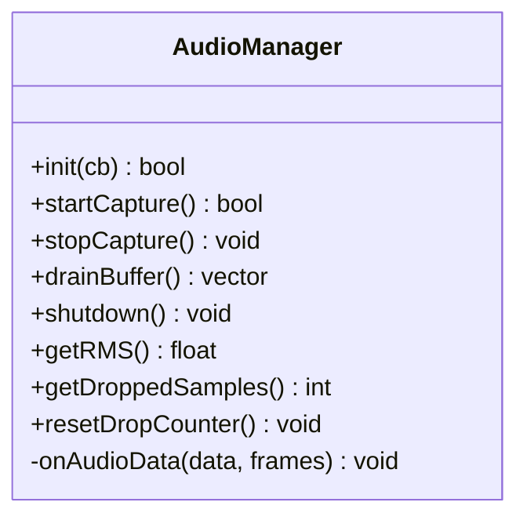

**Diagram sources**
- [audio_manager.h](file://src/audio_manager.h#L9-L41)

### Transcriber API
Responsibilities:
- Load Whisper model with GPU preference and fallback to CPU
- Asynchronously transcribe PCM audio
- Post completion message with result string pointer (heap-allocated; caller deletes)

Public interface summary:
- init(modelPath): Attempts GPU initialization, falls back to CPU if needed.
- shutdown(): Frees Whisper context.
- transcribeAsync(hwnd, pcm, doneMsg): Non-blocking; returns false if already busy.
- isBusy(): Atomically checks transcription state.

Processing logic highlights:
- Trims silence from both ends to reduce compute
- Optimizes decoding parameters for throughput
- Limits audio context based on duration
- Removes hallucinated repetitions post-inference
- Posts WM_TRANSCRIPTION_DONE with a heap-allocated string pointer

Threading and synchronization:
- Uses a worker thread for inference.
- Busy flag uses atomic compare-and-swap for single-flight protection.
- Completion posted via PostMessage to the provided HWND.

Integration example:
- After draining PCM from AudioManager, call transcribeAsync(hwnd, pcm, WM_TRANSCRIPTION_DONE).
- In message handler, delete the received string pointer after use.

**Section sources**
- [transcriber.h](file://src/transcriber.h#L10-L28)
- [transcriber.cpp](file://src/transcriber.cpp#L79-L93)
- [transcriber.cpp](file://src/transcriber.cpp#L103-L117)
- [transcriber.cpp](file://src/transcriber.cpp#L119-L225)

#### Transcriber Sequence Diagram
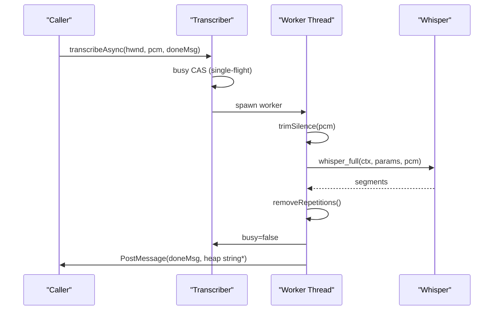

**Diagram sources**
- [transcriber.cpp](file://src/transcriber.cpp#L103-L225)

### Overlay API
Responsibilities:
- Create and manage a layered, always-on-top window
- Render a floating pill with Direct2D and UpdateLayeredWindow
- Drive animations via WM_TIMER (~60 fps)
- Expose state transitions and RMS push for waveform updates

Public interface summary:
- init(hInst): Creates window, resources, and timer.
- shutdown(): Destroys window and releases resources.
- setState(state): Thread-safe state transitions.
- getState(): Thread-safe state accessor.
- pushRMS(rms): Thread-safe RMS update from audio thread.

State machine:
- Hidden, Recording, Processing, Done, Error
- Animations handle appear/dismiss and state-specific visuals

Rendering details:
- Uses ID2D1 DC Render Target with premultiplied alpha
- UpdateLayeredWindow composites a 32-bit DIB
- Waveform bars and spinner with gradient effects

Threading and synchronization:
- Rendering occurs on the main thread via timer.
- Atomic state and RMS fields enable cross-thread updates.

Integration example:
- Initialize Overlay in the main thread.
- Call setState() to reflect transcription progress.
- Push RMS values from the audio callback for live waveform.

**Section sources**
- [overlay.h](file://src/overlay.h#L18-L93)
- [overlay.cpp](file://src/overlay.cpp#L29-L74)
- [overlay.cpp](file://src/overlay.cpp#L140-L158)
- [overlay.cpp](file://src/overlay.cpp#L160-L163)
- [overlay.cpp](file://src/overlay.cpp#L596-L620)

#### Overlay Class Diagram
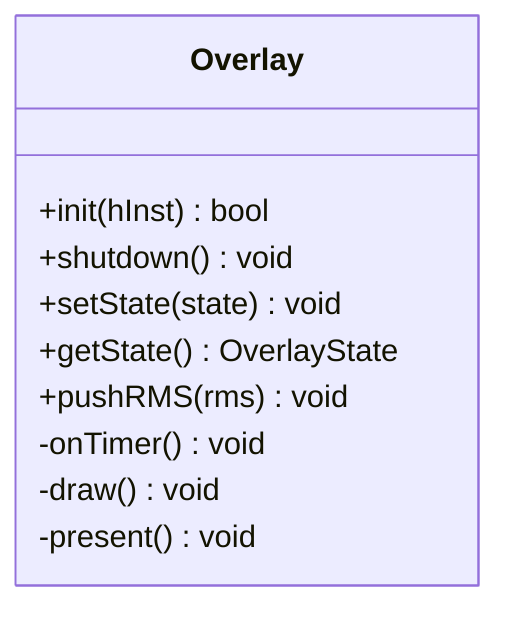

**Diagram sources**
- [overlay.h](file://src/overlay.h#L11-L24)
- [overlay.h](file://src/overlay.h#L18-L93)

### Dashboard API
Responsibilities:
- Bridge to a WinUI 3/Windows App SDK dashboard (optional)
- Provide a modern Direct2D dashboard UI as a fallback
- Manage history entries, snapshot/clear operations
- Notify settings changes via callback

Public interface summary:
- init(hInst, ownerHwnd): One-time initialization; ownerHwnd receives show signals.
- shutdown(): Cleans up UI resources.
- addEntry(entry): Thread-safe addition; updates UI if visible.
- show(): Brings dashboard to foreground safely from any thread.
- snapshotHistory(): Returns a copy of the in-memory history.
- clearHistory(): Clears in-memory history.
- onSettingsChanged: Callback fired on main thread when settings change.

Threading and synchronization:
- History protected by a mutex; snapshot returns a copy.
- show() dispatches internally to the UI thread.

Integration example:
- On transcription completion, add a TranscriptionEntry via addEntry().
- Expose settings via ConfigManager and subscribe to onSettingsChanged.

**Section sources**
- [dashboard.h](file://src/dashboard.h#L36-L68)
- [dashboard.cpp](file://src/dashboard.cpp#L394-L407)
- [dashboard.cpp](file://src/dashboard.cpp#L409-L415)
- [dashboard.cpp](file://src/dashboard.cpp#L417-L426)
- [dashboard.cpp](file://src/dashboard.cpp#L428-L439)
- [dashboard.cpp](file://src/dashboard.cpp#L441-L445)
- [dashboard.cpp](file://src/dashboard.cpp#L447-L451)

#### Dashboard Class Diagram
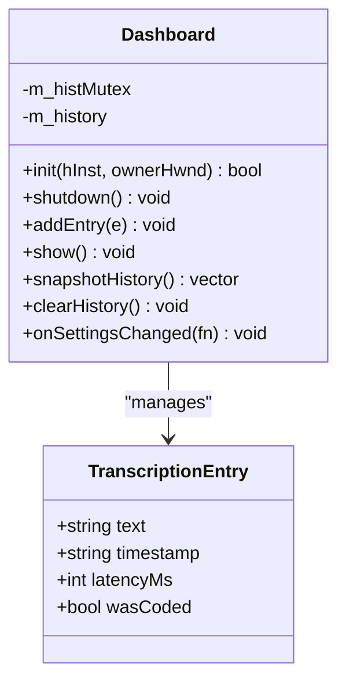

**Diagram sources**
- [dashboard.h](file://src/dashboard.h#L23-L61)
- [dashboard.h](file://src/dashboard.h#L36-L68)

### Formatter API
Responsibilities:
- Apply a four-pass transformation to cleaned transcription text
- Mode-aware transformations for coding contexts

Public interface summary:
- FormatTranscription(raw, mode): Returns cleaned and transformed text
- AppMode: PROSE or CODING

Transformation pipeline:
1. Strip universal fillers (um, uh, etc.)
2. Strip sentence-start fillers (so, well, etc.) only at line starts
3. Whitespace normalization, leading punctuation removal, capitalize first letter
4. Add trailing punctuation if missing
5. Optional coding transforms (camel/snake/all caps) when mode is CODING

Threading and synchronization:
- Pure function; no shared state.

Integration example:
- After transcription, call FormatTranscription(text, DetectModeFromActiveWindow()).

**Section sources**
- [formatter.h](file://src/formatter.h#L4-L13)
- [formatter.cpp](file://src/formatter.cpp#L137-L147)

#### Formatter Flowchart
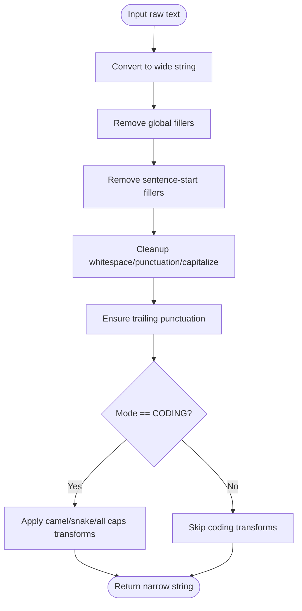

**Diagram sources**
- [formatter.cpp](file://src/formatter.cpp#L65-L91)
- [formatter.cpp](file://src/formatter.cpp#L114-L133)
- [formatter.cpp](file://src/formatter.cpp#L137-L147)

### Snippet Engine API
Responsibilities:
- Maintain a dictionary of trigger phrases to expansion values
- Apply case-insensitive, longest-first replacements
- Detect application mode from the active window

Public interface summary:
- setSnippets(map): Replace internal snippet map
- apply(text): Return transformed text with expansions
- DetectModeFromActiveWindow(): Determine AppMode from foreground process

Threading and synchronization:
- apply() is a const operation on an internal map; thread-safe reads.

Integration example:
- Load snippets from ConfigManager.settings().snippets
- Apply after formatting, before injection

**Section sources**
- [snippet_engine.h](file://src/snippet_engine.h#L7-L19)
- [snippet_engine.cpp](file://src/snippet_engine.cpp#L6-L28)
- [snippet_engine.cpp](file://src/snippet_engine.cpp#L35-L81)

#### Snippet Engine Class Diagram
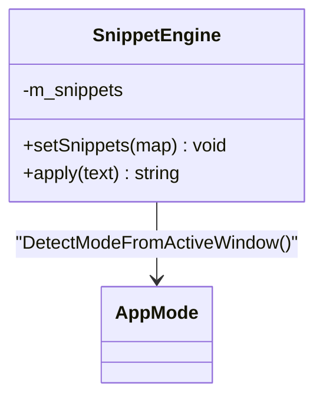

**Diagram sources**
- [snippet_engine.h](file://src/snippet_engine.h#L7-L19)
- [snippet_engine.cpp](file://src/snippet_engine.cpp#L35-L81)

### Configuration Manager API
Responsibilities:
- Load/save JSON settings under %APPDATA%\FLOW-ON\settings.json
- Provide defaults on first run
- Validate snippet values and enforce limits
- Manage autostart via HKCU Run registry key

Public interface summary:
- load(): Reads JSON; on failure or absence, writes defaults
- save(): Writes current settings
- settings(): Access to current AppSettings (const and non-const)
- applyAutostart(exePath), removeAutostart(): Registry manipulation

Data model:
- AppSettings includes hotkey, mode string, model name, GPU toggle, autostart flag, and snippet map

Threading and synchronization:
- No internal synchronization; callers should serialize access if used from multiple threads.

Integration example:
- On startup, load(); on settings change, save()
- Use settings().useGPU to configure Transcriber init

**Section sources**
- [config_manager.h](file://src/config_manager.h#L21-L39)
- [config_manager.cpp](file://src/config_manager.cpp#L24-L58)
- [config_manager.cpp](file://src/config_manager.cpp#L60-L80)
- [config_manager.cpp](file://src/config_manager.cpp#L82-L107)

#### Configuration Manager Class Diagram
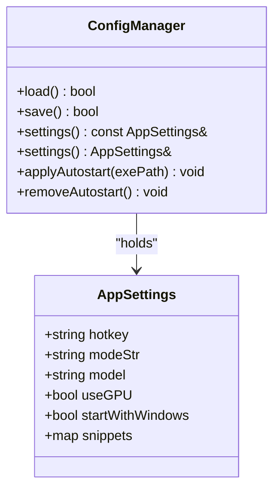

**Diagram sources**
- [config_manager.h](file://src/config_manager.h#L8-L39)
- [config_manager.cpp](file://src/config_manager.cpp#L15-L22)
- [config_manager.cpp](file://src/config_manager.cpp#L24-L80)

### Injector API
Responsibilities:
- Inject text into the currently focused application
- Choose between SendInput (per-character) and clipboard paste depending on length and Unicode content

Public interface summary:
- InjectText(text): Must be called on the main Win32 thread

Behavior:
- If text exceeds 200 characters or contains surrogate code units, uses clipboard paste
- Otherwise synthesizes KEYEVENTF_UNICODE sequences

Threading and synchronization:
- Must be called from the main thread
- Clipboard operations are guarded by OpenClipboard/CloseClipboard

Integration example:
- After formatting and snippet expansion, call InjectText(formattedText)

**Section sources**
- [injector.h](file://src/injector.h#L4-L8)
- [injector.cpp](file://src/injector.cpp#L49-L74)

#### Injector Flowchart
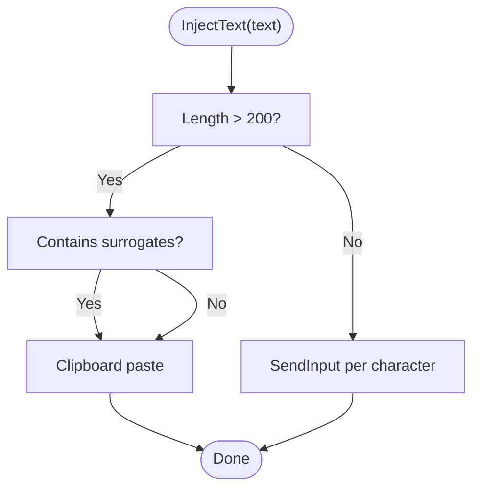

**Diagram sources**
- [injector.cpp](file://src/injector.cpp#L10-L16)
- [injector.cpp](file://src/injector.cpp#L49-L74)

## Dependency Analysis
High-level dependencies among components:

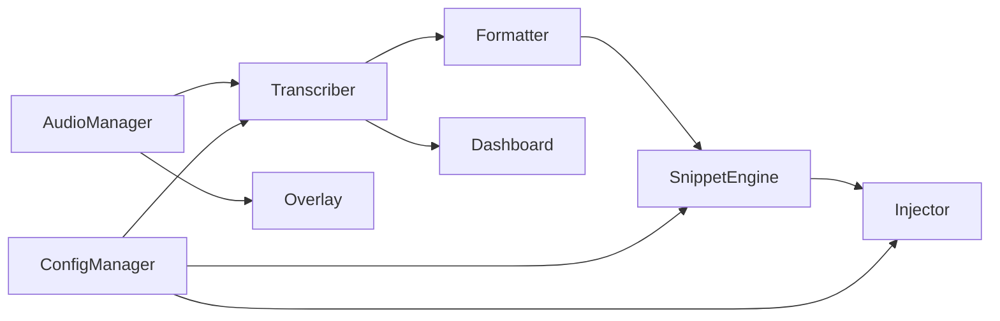

**Diagram sources**
- [audio_manager.h](file://src/audio_manager.h#L9-L41)
- [transcriber.h](file://src/transcriber.h#L10-L28)
- [overlay.h](file://src/overlay.h#L18-L93)
- [dashboard.h](file://src/dashboard.h#L36-L68)
- [formatter.h](file://src/formatter.h#L13)
- [snippet_engine.h](file://src/snippet_engine.h#L15)
- [config_manager.h](file://src/config_manager.h#L29-L34)
- [injector.h](file://src/injector.h#L8)

**Section sources**
- [audio_manager.h](file://src/audio_manager.h#L6-L7)
- [overlay.cpp](file://src/overlay.cpp#L16-L16)
- [transcriber.cpp](file://src/transcriber.cpp#L3-L3)
- [dashboard.cpp](file://src/dashboard.cpp#L9)

## Performance Considerations
- Audio Manager
  - Lock-free ring buffer minimizes contention; ensure callbacks are lightweight.
  - Pre-allocate buffers to avoid per-cycle allocations.
- Transcriber
  - Single-flight busy flag prevents overlapping work.
  - Trimming silence reduces unnecessary compute.
  - Greedy decoding with tuned parameters improves throughput.
  - Audio context scales with duration to balance quality and speed.
- Overlay
  - Timer-driven (~60 Hz) ensures smooth animations without blocking.
  - Premultiplied alpha and UpdateLayeredWindow avoid compositing artifacts.
- Dashboard
  - Offscreen rendering with DIB and BitBlt minimizes flicker.
  - Animated list items use easing and sliding for polish.
- Formatter
  - Regex compilation happens once; avoid constructing inside hot loops.
- Snippet Engine
  - Case-insensitive replacement scans once; longest-first reduces overlap.
- Configuration Manager
  - JSON I/O is serialized; cache settings in memory and batch writes.
- Injector
  - Clipboard path is robust for long/emoji text; avoid frequent clipboard operations.

[No sources needed since this section provides general guidance]

## Troubleshooting Guide
- Transcription returns empty or short text
  - Silence trimming may remove entire clips; ensure minimum duration thresholds are met.
  - Verify busy flag is respected to avoid overlapping calls.
- GPU initialization fails
  - Transcriber attempts CPU fallback; confirm model path and availability.
- Overlay not visible
  - Ensure init() succeeds and window remains on top; check layered window attributes.
- Dashboard not updating
  - addEntry() is thread-safe; ensure UI is shown and timer is running.
- Settings not persisting
  - Confirm settings path under %APPDATA%\FLOW-ON; validate JSON format.
- Injection does not work
  - For long/emoji text, clipboard paste is used; verify clipboard permissions and focus.

**Section sources**
- [transcriber.cpp](file://src/transcriber.cpp#L119-L133)
- [transcriber.cpp](file://src/transcriber.cpp#L82-L91)
- [overlay.cpp](file://src/overlay.cpp#L29-L74)
- [dashboard.cpp](file://src/dashboard.cpp#L428-L439)
- [config_manager.cpp](file://src/config_manager.cpp#L24-L58)
- [injector.cpp](file://src/injector.cpp#L49-L74)

## Conclusion
The Flow-On APIs provide a cohesive pipeline from audio capture to visual feedback and text injection. Each component is designed with thread safety, performance, and extensibility in mind. Integrators can extend functionality by:
- Adding new snippet triggers via ConfigManager
- Switching Whisper models and GPU toggles via settings
- Extending Overlay states and animations
- Hooking into Dashboard callbacks for settings synchronization

[No sources needed since this section summarizes without analyzing specific files]

## Appendices

### Event Handling Patterns and Callbacks
- Transcriber
  - Posts WM_TRANSCRIPTION_DONE with a heap-allocated string pointer; receiver must delete it.
- Overlay
  - Driven by WM_TIMER; drawing and presentation handled internally.
- Dashboard
  - onSettingsChanged fires on the main thread when settings change.
- Audio Manager
  - SampleCallback invoked from the audio thread; keep minimal.

**Section sources**
- [transcriber.h](file://src/transcriber.h#L7-L8)
- [overlay.cpp](file://src/overlay.cpp#L625-L643)
- [dashboard.h](file://src/dashboard.h#L56-L56)
- [audio_manager.h](file://src/audio_manager.h#L11-L11)

### Thread Safety and Synchronization Checklist
- Audio Manager: atomics for RMS/dropped; lock-free ring buffer; callback must be fast.
- Transcriber: atomic busy flag; worker thread for inference; main-thread message posting.
- Overlay: atomic state/RMS; timer-driven rendering on main thread.
- Dashboard: mutex-protected history; snapshot returns copy; show() dispatches internally.
- Formatter/Snippet Engine: const operations on internal maps; pure functions.
- Configuration Manager: no internal locking; serialize access externally.
- Injector: must be called from main thread; clipboard operations guarded.

**Section sources**
- [audio_manager.cpp](file://src/audio_manager.cpp#L39-L56)
- [transcriber.cpp](file://src/transcriber.cpp#L107-L109)
- [overlay.cpp](file://src/overlay.cpp#L596-L620)
- [dashboard.cpp](file://src/dashboard.cpp#L430-L439)
- [injector.cpp](file://src/injector.cpp#L49-L74)