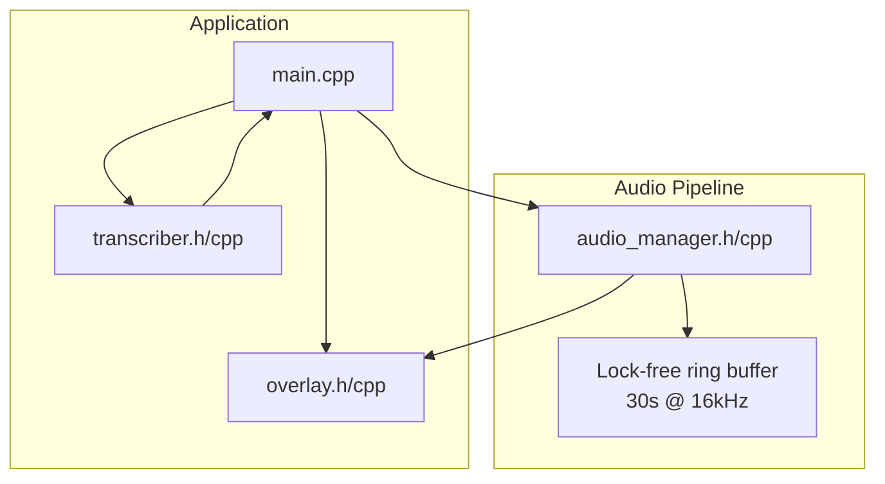
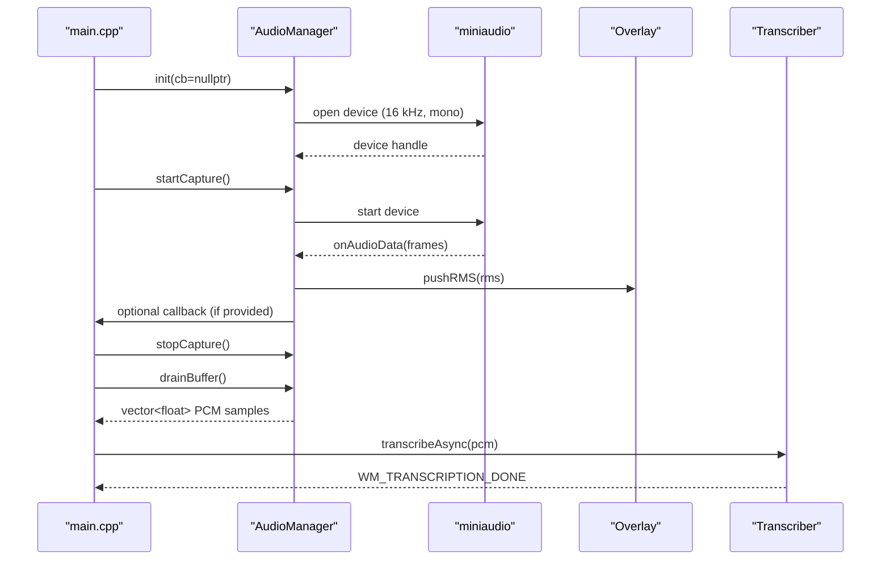
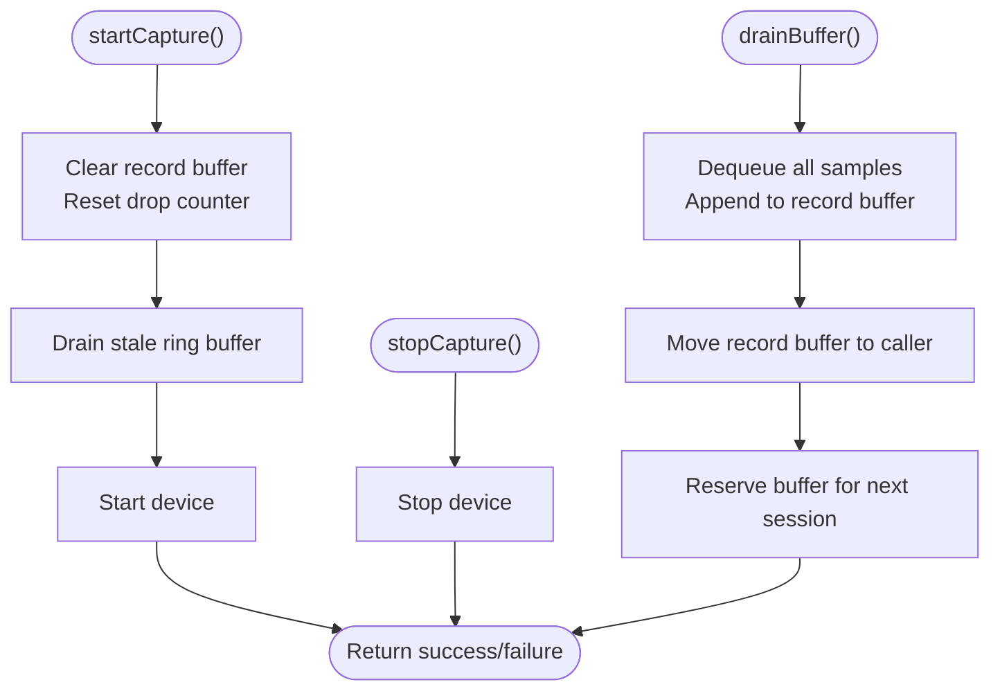
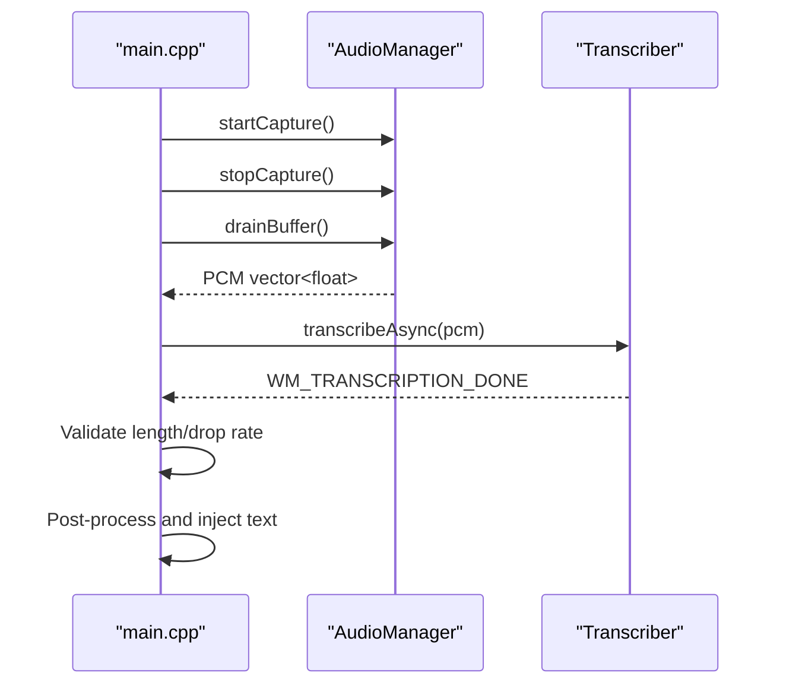
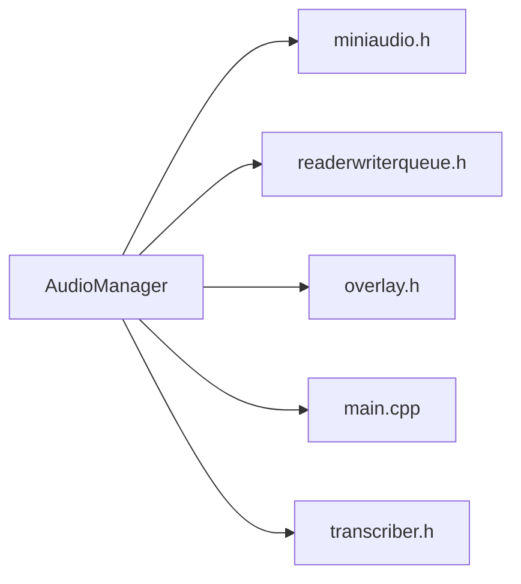

# Audio Manager API

<cite>
**Referenced Files in This Document**
- [audio_manager.h](file://src/audio_manager.h)
- [audio_manager.cpp](file://src/audio_manager.cpp)
- [main.cpp](file://src/main.cpp)
- [overlay.h](file://src/overlay.h)
- [overlay.cpp](file://src/overlay.cpp)
- [transcriber.h](file://src/transcriber.h)
- [transcriber.cpp](file://src/transcriber.cpp)
</cite>

## Table of Contents
1. [Introduction](#introduction)
2. [Project Structure](#project-structure)
3. [Core Components](#core-components)
4. [Architecture Overview](#architecture-overview)
5. [Detailed Component Analysis](#detailed-component-analysis)
6. [Dependency Analysis](#dependency-analysis)
7. [Performance Considerations](#performance-considerations)
8. [Troubleshooting Guide](#troubleshooting-guide)
9. [Conclusion](#conclusion)

## Introduction
This document provides comprehensive API documentation for the AudioManager class interface used in the audio capture and processing pipeline. It covers the constructor and initialization methods, audio capture control, buffer management, metrics accessors, internal callback mechanisms, thread safety, and integration patterns with the broader application.

## Project Structure
The AudioManager is part of a larger Windows desktop application that captures microphone audio, buffers it, and feeds it into a transcription pipeline. The relevant components are organized as follows:
- Audio capture and buffering: AudioManager
- Transcription engine: Transcriber
- Visual feedback: Overlay
- Application orchestration: main.cpp



**Diagram sources**
- [audio_manager.h](file://src/audio_manager.h#L9-L41)
- [audio_manager.cpp](file://src/audio_manager.cpp#L18-L28)
- [main.cpp](file://src/main.cpp#L54-L64)
- [overlay.h](file://src/overlay.h#L18-L93)
- [transcriber.h](file://src/transcriber.h#L10-L28)

**Section sources**
- [audio_manager.h](file://src/audio_manager.h#L1-L42)
- [audio_manager.cpp](file://src/audio_manager.cpp#L1-L122)
- [main.cpp](file://src/main.cpp#L1-L521)

## Core Components
This section documents the AudioManager interface and its role in the audio pipeline.

- Class: AudioManager
  - Purpose: Manages microphone capture, buffering, and delivery of audio samples to downstream components.
  - Key responsibilities:
    - Initialize audio device with 16 kHz mono capture
    - Start/stop recording sessions
    - Drain buffered audio samples to a vector for processing
    - Expose audio quality metrics (RMS, dropped samples)
    - Internal callback for miniaudio integration

- Public API surface:
  - init(cb): Initializes audio capture with a callback for real-time audio data
  - startCapture(): Arms recording and clears stale buffer content
  - stopCapture(): Stops the audio device
  - drainBuffer(): Transfers buffered samples to caller-owned vector
  - shutdown(): Releases audio device resources
  - getRMS(): Returns RMS of the last processed chunk
  - getDroppedSamples(): Returns count of dropped samples
  - resetDropCounter(): Resets the dropped sample counter
  - onAudioData(data, frames): Internal callback invoked by miniaudio

- Buffering:
  - Pre-allocated ring buffer for up to 30 seconds of 16 kHz mono PCM
  - Lock-free enqueue/dequeue for high-performance audio capture
  - Separate record buffer for draining captured audio to the main thread

- Metrics:
  - RMS computed per chunk and stored atomically
  - Dropped sample counter incremented when ring buffer overflows

**Section sources**
- [audio_manager.h](file://src/audio_manager.h#L9-L41)
- [audio_manager.cpp](file://src/audio_manager.cpp#L18-L28)
- [audio_manager.cpp](file://src/audio_manager.cpp#L39-L56)
- [audio_manager.cpp](file://src/audio_manager.cpp#L58-L81)
- [audio_manager.cpp](file://src/audio_manager.cpp#L83-L94)
- [audio_manager.cpp](file://src/audio_manager.cpp#L96-L100)
- [audio_manager.cpp](file://src/audio_manager.cpp#L102-L111)
- [audio_manager.cpp](file://src/audio_manager.cpp#L113-L121)

## Architecture Overview
The AudioManager integrates with the application’s main event loop and the transcription pipeline. The flow below illustrates how audio is captured, buffered, and delivered to the transcription engine.



**Diagram sources**
- [audio_manager.cpp](file://src/audio_manager.cpp#L39-L56)
- [audio_manager.cpp](file://src/audio_manager.cpp#L58-L81)
- [audio_manager.cpp](file://src/audio_manager.cpp#L83-L94)
- [audio_manager.cpp](file://src/audio_manager.cpp#L96-L100)
- [audio_manager.cpp](file://src/audio_manager.cpp#L102-L111)
- [main.cpp](file://src/main.cpp#L116-L128)
- [main.cpp](file://src/main.cpp#L244-L274)
- [overlay.h](file://src/overlay.h#L26-L27)

## Detailed Component Analysis

### AudioManager Class Interface
The AudioManager class encapsulates audio capture and buffering. Below is a class diagram showing the key members and their relationships.

```mermaid
classDiagram
class AudioManager {
+using SampleCallback = std : : function<void(const float*, size_t)>
+init(cb) bool
+startCapture() bool
+stopCapture() void
+drainBuffer() std : : vector<float>
+shutdown() void
+getRMS() float
+getDroppedSamples() int
+resetDropCounter() void
-onAudioData(data, frames) void
-m_device void*
-m_callback SampleCallback
-m_dropped std : : atomic<int>
-m_rms std : : atomic<float>
-m_recordBuffer std : : vector<float>
}
```

**Diagram sources**
- [audio_manager.h](file://src/audio_manager.h#L9-L41)

**Section sources**
- [audio_manager.h](file://src/audio_manager.h#L9-L41)

### Initialization and Device Setup
- init(cb):
  - Sets the callback for real-time audio data
  - Pre-allocates the record buffer to accommodate up to 30 seconds of 16 kHz mono audio
  - Creates a DeviceHolder and initializes a miniaudio capture device configured for 16 kHz, mono, and 100 ms period size
  - Returns true on success, false otherwise

- DeviceHolder:
  - Holds the miniaudio device and a pointer back to the AudioManager owner
  - Used to pass the AudioManager instance to the C-style miniaudio callback

- Callback registration:
  - data_callback forwards audio frames to onAudioData

**Section sources**
- [audio_manager.cpp](file://src/audio_manager.cpp#L58-L81)
- [audio_manager.cpp](file://src/audio_manager.cpp#L24-L28)
- [audio_manager.cpp](file://src/audio_manager.cpp#L30-L35)

### Audio Capture Control
- startCapture():
  - Clears the record buffer and resets the dropped sample counter
  - Drains stale samples from the ring buffer
  - Starts the miniaudio device and returns success/failure

- stopCapture():
  - Stops the miniaudio device if initialized

- drainBuffer():
  - Dequeues all available samples from the ring buffer into the record buffer
  - Moves the record buffer to the caller, avoiding copies of up to ~1.9 MB of PCM data
  - Re-reserves the record buffer for the next session



**Diagram sources**
- [audio_manager.cpp](file://src/audio_manager.cpp#L83-L94)
- [audio_manager.cpp](file://src/audio_manager.cpp#L96-L100)
- [audio_manager.cpp](file://src/audio_manager.cpp#L102-L111)

**Section sources**
- [audio_manager.cpp](file://src/audio_manager.cpp#L83-L111)

### Audio Buffer Management
- Ring buffer:
  - Static lock-free queue sized for 30 seconds of 16 kHz mono PCM
  - Enqueue attempts that fail increment the dropped sample counter atomically
  - Dequeue operations transfer samples to the record buffer

- Record buffer:
  - Pre-allocated once and reused across sessions
  - Uses move semantics to avoid copying large PCM arrays

- Memory management:
  - The record buffer is moved to the caller, who owns the vector
  - On shutdown, the application zeroes the PCM buffer before freeing to mitigate sensitive data exposure

**Section sources**
- [audio_manager.cpp](file://src/audio_manager.cpp#L18-L28)
- [audio_manager.cpp](file://src/audio_manager.cpp#L102-L111)
- [main.cpp](file://src/main.cpp#L507-L512)

### Audio Metrics Accessors
- getRMS():
  - Returns the RMS value of the last processed audio chunk
  - Accessed atomically with relaxed memory ordering

- getDroppedSamples():
  - Returns the number of samples dropped due to ring buffer overflow
  - Accessed atomically with relaxed memory ordering

- resetDropCounter():
  - Resets the dropped sample counter to zero

- Overlay integration:
  - The audio callback pushes RMS values to the overlay for visualization
  - Overlay reads RMS atomically for smooth UI updates

**Section sources**
- [audio_manager.h](file://src/audio_manager.h#L26-L30)
- [audio_manager.cpp](file://src/audio_manager.cpp#L39-L56)
- [overlay.h](file://src/overlay.h#L26-L27)
- [overlay.cpp](file://src/overlay.cpp#L160-L163)

### Internal Callback Mechanism
- onAudioData(data, frames):
  - Computes RMS over the incoming frames
  - Attempts to enqueue each sample into the ring buffer
  - Increments dropped sample counter on failure
  - Updates the RMS metric atomically
  - Pushes RMS to the overlay for UI feedback
  - Invokes the registered callback if provided

- Thread safety:
  - The callback runs on the miniaudio thread
  - All shared metrics are accessed via atomic operations with relaxed ordering
  - Overlay RMS push is a single atomic store, safe from any thread

**Section sources**
- [audio_manager.cpp](file://src/audio_manager.cpp#L39-L56)
- [audio_manager.h](file://src/audio_manager.h#L32-L33)

### Integration Patterns with the Audio Processing Pipeline
- Application orchestration:
  - The main loop starts recording, stops it, drains the buffer, and triggers transcription
  - Validates minimum recording length and drop rate thresholds before proceeding
  - Handles transcription completion and post-processing

- Transcription pipeline:
  - Transcriber receives PCM samples and performs asynchronous transcription
  - Applies silence trimming and repetition removal for improved quality
  - Posts completion messages back to the main thread



**Diagram sources**
- [main.cpp](file://src/main.cpp#L116-L128)
- [main.cpp](file://src/main.cpp#L244-L274)
- [transcriber.cpp](file://src/transcriber.cpp#L103-L225)

**Section sources**
- [main.cpp](file://src/main.cpp#L116-L128)
- [main.cpp](file://src/main.cpp#L244-L274)
- [transcriber.cpp](file://src/transcriber.cpp#L103-L225)

## Dependency Analysis
The AudioManager depends on miniaudio for device I/O and a lock-free queue for buffering. It interacts with the overlay for visual feedback and integrates with the main application and transcription pipeline.



**Diagram sources**
- [audio_manager.cpp](file://src/audio_manager.cpp#L7-L8)
- [audio_manager.h](file://src/audio_manager.h#L6-L7)
- [main.cpp](file://src/main.cpp#L19-L25)
- [overlay.h](file://src/overlay.h#L1-L9)
- [transcriber.h](file://src/transcriber.h#L1-L6)

**Section sources**
- [audio_manager.cpp](file://src/audio_manager.cpp#L7-L8)
- [audio_manager.h](file://src/audio_manager.h#L6-L7)
- [main.cpp](file://src/main.cpp#L19-L25)
- [overlay.h](file://src/overlay.h#L1-L9)
- [transcriber.h](file://src/transcriber.h#L1-L6)

## Performance Considerations
- Buffer sizing:
  - 30 seconds at 16 kHz mono equals approximately 480,000 float samples
  - Lock-free ring buffer minimizes contention and avoids blocking on audio callbacks

- Callback constraints:
  - The callback must remain lightweight to avoid audio glitches
  - Enqueue failures are handled by incrementing a dropped sample counter

- Memory efficiency:
  - Move semantics are used when draining the buffer to avoid large copies
  - Pre-allocation reduces allocation overhead across sessions

- Validation gates:
  - Minimum recording length and drop rate thresholds prevent processing poor-quality audio
  - Transcription is single-flight guarded to avoid overlapping work

[No sources needed since this section provides general guidance]

## Troubleshooting Guide
- Microphone initialization fails:
  - Ensure the microphone is available and permissions are granted
  - The application displays a user-friendly error dialog on initialization failure

- Audio dropouts or gaps:
  - Monitor dropped samples via getDroppedSamples()
  - Consider reducing system load or adjusting the audio period size
  - Verify that the callback remains lightweight

- Transcription errors:
  - The application checks recording length and drop rate before transcription
  - If too short or too droopy, an error state is shown and the session is reset

- Memory safety:
  - The application securely zeros the PCM buffer before shutdown to prevent sensitive data exposure

**Section sources**
- [audio_manager.cpp](file://src/audio_manager.cpp#L74-L77)
- [main.cpp](file://src/main.cpp#L436-L444)
- [main.cpp](file://src/main.cpp#L250-L264)
- [main.cpp](file://src/main.cpp#L507-L512)

## Conclusion
The AudioManager provides a robust, high-performance interface for capturing and buffering microphone audio at 16 kHz mono. Its design emphasizes thread safety, minimal latency, and efficient memory usage, integrating seamlessly with the application’s transcription pipeline and visual feedback systems. By following the documented patterns and constraints, developers can reliably incorporate audio capture into their workflows.