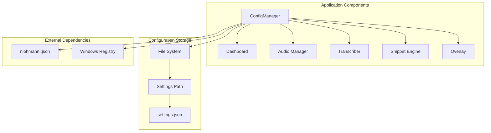
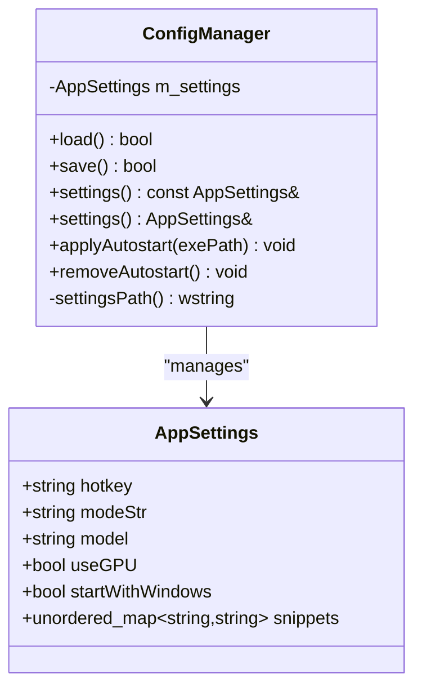
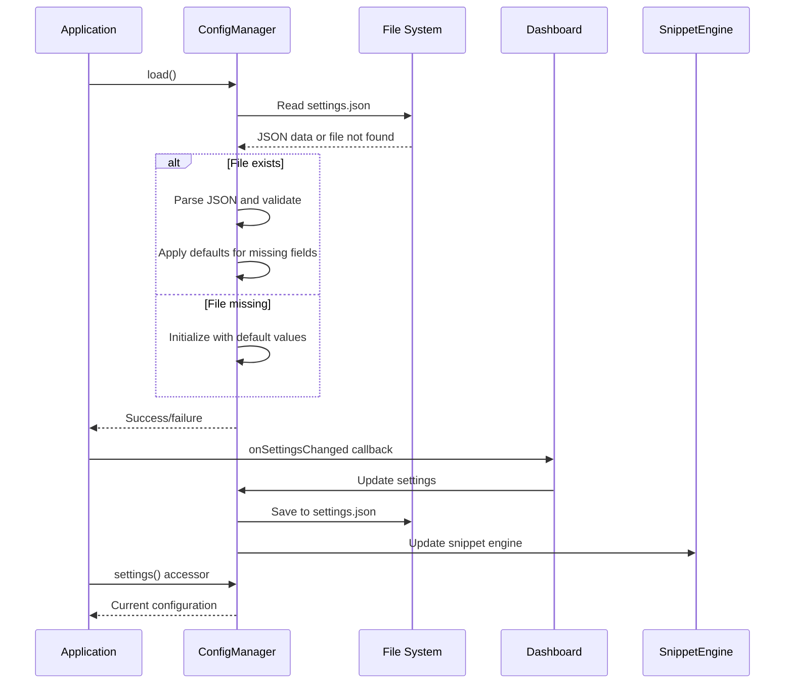
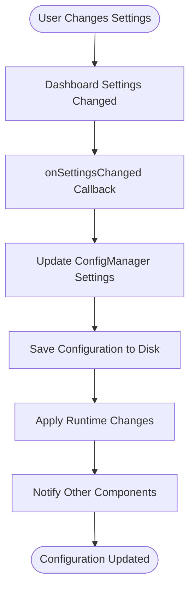
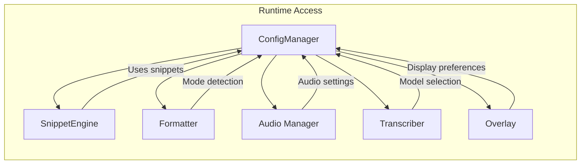
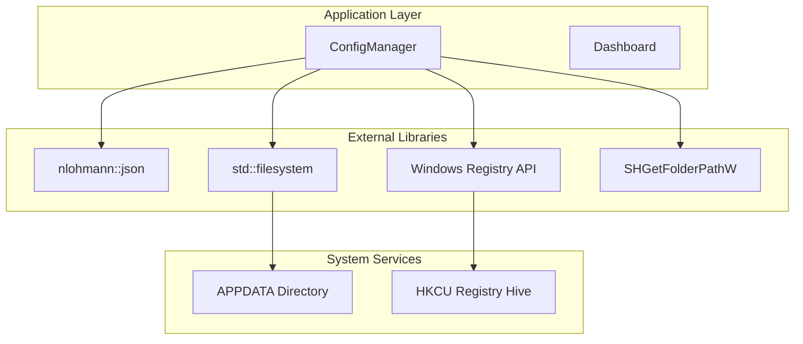
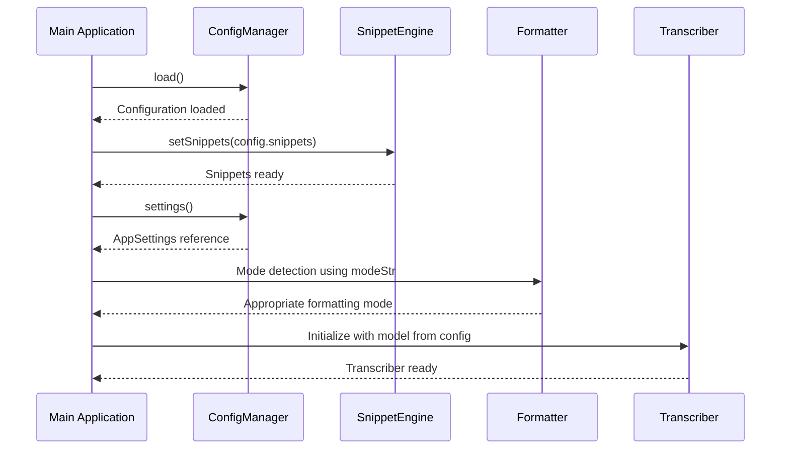

# Configuration Manager API

<cite>
**Referenced Files in This Document**
- [config_manager.h](file://src/config_manager.h)
- [config_manager.cpp](file://src/config_manager.cpp)
- [main.cpp](file://src/main.cpp)
- [dashboard.h](file://src/dashboard.h)
- [dashboard.cpp](file://src/dashboard.cpp)
- [formatter.h](file://src/formatter.h)
- [snippet_engine.h](file://src/snippet_engine.h)
- [settings.default.json](file://assets/settings.default.json)
</cite>

## Table of Contents
1. [Introduction](#introduction)
2. [Project Structure](#project-structure)
3. [Core Components](#core-components)
4. [Architecture Overview](#architecture-overview)
5. [Detailed Component Analysis](#detailed-component-analysis)
6. [Dependency Analysis](#dependency-analysis)
7. [Performance Considerations](#performance-considerations)
8. [Troubleshooting Guide](#troubleshooting-guide)
9. [Conclusion](#conclusion)

## Introduction
This document provides comprehensive API documentation for the ConfigManager class interface, focusing on JSON-based settings persistence, validation, runtime updates, and integration with the broader application architecture. The ConfigManager manages application settings stored in a JSON file located in the user's application data directory, with robust error handling for corrupted files and seamless integration with the dashboard and other components.

## Project Structure
The configuration system is centered around the ConfigManager class and its associated data structures, with integration points across the application:



**Diagram sources**
- [config_manager.h](file://src/config_manager.h#L21-L39)
- [config_manager.cpp](file://src/config_manager.cpp#L15-L22)
- [main.cpp](file://src/main.cpp#L55-L60)

**Section sources**
- [config_manager.h](file://src/config_manager.h#L1-L40)
- [config_manager.cpp](file://src/config_manager.cpp#L1-L108)
- [main.cpp](file://src/main.cpp#L54-L60)

## Core Components
The configuration system consists of two primary components:

### AppSettings Data Structure
The AppSettings structure defines the complete configuration schema with default values and type safety:



**Diagram sources**
- [config_manager.h](file://src/config_manager.h#L8-L19)
- [config_manager.h](file://src/config_manager.h#L21-L39)

### Configuration Schema
The settings schema supports the following configuration keys:

| Setting | Type | Description | Default Value |
|---------|------|-------------|---------------|
| `hotkey` | string | Keyboard shortcut identifier | "Alt+V" |
| `mode` | string | Operation mode ("auto", "prose", "code") | "auto" |
| `model` | string | Whisper model identifier | "tiny.en" |
| `use_gpu` | boolean | GPU acceleration toggle | true |
| `start_with_windows` | boolean | Autostart at Windows startup | true |
| `snippets` | object | Text substitution dictionary | Predefined snippets |

**Section sources**
- [config_manager.h](file://src/config_manager.h#L8-L19)
- [config_manager.cpp](file://src/config_manager.cpp#L37-L51)
- [settings.default.json](file://assets/settings.default.json#L1-L16)

## Architecture Overview
The ConfigManager integrates with the application through several key pathways:



**Diagram sources**
- [config_manager.cpp](file://src/config_manager.cpp#L24-L58)
- [main.cpp](file://src/main.cpp#L480-L493)
- [main.cpp](file://src/main.cpp#L410-L415)

## Detailed Component Analysis

### ConfigManager Class API

#### Constructor and Initialization
The ConfigManager constructor initializes with default values from the AppSettings structure. The class maintains a single instance as a global variable in the main application.

#### load() Method
The load method performs comprehensive JSON parsing with robust error handling:

**Method Signature**: `bool load()`

**Behavior**:
- Resolves the settings file path using the user's APPDATA directory
- Creates the FLOW-ON directory if it doesn't exist
- Attempts to parse existing JSON configuration
- Applies default values for any missing configuration fields
- Handles corrupted JSON by resetting to defaults

**Error Handling**:
- File not found: Automatically creates default configuration
- JSON parsing errors: Resets to AppSettings defaults
- Partial field presence: Merges available data with defaults

**Return Values**:
- `true`: Configuration loaded successfully
- `false`: Critical failure (uncommon)

**Usage Example**: 
```cpp
// Load configuration at application startup
if (!g_config.load()) {
    // Handle initialization failure
    MessageBoxW(nullptr, L"Failed to initialize configuration", L"Error", MB_OK);
}
```

#### save() Method
The save method persists current settings to disk:

**Method Signature**: `bool save() const`

**Behavior**:
- Serializes all configuration fields to JSON format
- Writes to the resolved settings file path
- Uses pretty-print formatting with 2-space indentation

**Validation**:
- Ensures all required fields are present
- Maintains backward compatibility with schema evolution

**Return Values**:
- `true`: Successfully written to disk
- `false`: Write operation failed (insufficient permissions, disk full)

**Usage Example**:
```cpp
// Save configuration after user changes
if (!g_config.save()) {
    // Log error and notify user
    OutputDebugStringA("Failed to save configuration\n");
}
```

#### settings() Accessors
Provides controlled access to the current configuration state:

**Method Signatures**:
- `const AppSettings& settings() const`
- `AppSettings& settings()`

**Behavior**:
- Returns reference to current AppSettings instance
- Allows both read-only and modification access
- No thread safety guarantees - callers must synchronize

**Usage Example**:
```cpp
// Read current configuration
const auto& cfg = g_config.settings();
if (cfg.useGPU) {
    // Enable GPU features
}

// Modify configuration
auto& mutableCfg = g_config.settings();
mutableCfg.modeStr = "prose";
```

#### applyAutostart() and removeAutostart() Methods
Manage Windows startup integration through the registry:

**Method Signatures**:
- `void applyAutostart(const std::wstring& exePath) const`
- `void removeAutostart() const`

**Behavior**:
- `applyAutostart`: Creates registry entry in HKCU for automatic startup
- `removeAutostart`: Removes the registry entry
- Both methods operate on the Current User registry hive

**Security Considerations**:
- Validates executable path and quotes arguments properly
- Uses Windows API for secure registry operations

**Usage Example**:
```cpp
// Enable autostart
wchar_t exePath[MAX_PATH];
GetModuleFileNameW(nullptr, exePath, MAX_PATH);
g_config.applyAutostart(exePath);

// Disable autostart  
g_config.removeAutostart();
```

### Runtime Configuration Updates and Change Notification

#### Dashboard Integration
The dashboard provides a user interface for configuration changes with automatic persistence:



**Diagram sources**
- [dashboard.h](file://src/dashboard.h#L56-L56)
- [main.cpp](file://src/main.cpp#L480-L493)

**Integration Details**:
- Dashboard exposes `onSettingsChanged` callback function
- Main application registers callback to handle setting changes
- Automatic persistence occurs after each change
- Runtime updates propagate to dependent components

#### Component Integration Points
Multiple application components access configuration data:



**Diagram sources**
- [main.cpp](file://src/main.cpp#L300-L304)
- [main.cpp](file://src/main.cpp#L410-L410)
- [snippet_engine.h](file://src/snippet_engine.h#L9-L11)

**Section sources**
- [config_manager.h](file://src/config_manager.h#L21-L39)
- [config_manager.cpp](file://src/config_manager.cpp#L24-L80)
- [main.cpp](file://src/main.cpp#L480-L493)
- [dashboard.h](file://src/dashboard.h#L56-L56)

## Dependency Analysis

### External Dependencies
The configuration system relies on several external libraries and system APIs:



**Diagram sources**
- [config_manager.cpp](file://src/config_manager.cpp#L2-L10)
- [config_manager.cpp](file://src/config_manager.cpp#L15-L22)

### Internal Dependencies
Configuration data flows through multiple application components:



**Diagram sources**
- [main.cpp](file://src/main.cpp#L410-L410)
- [main.cpp](file://src/main.cpp#L300-L304)
- [main.cpp](file://src/main.cpp#L462-L475)

**Section sources**
- [config_manager.cpp](file://src/config_manager.cpp#L1-L10)
- [main.cpp](file://src/main.cpp#L55-L60)

## Performance Considerations

### File I/O Operations
- **Load Operation**: Single JSON parse operation with O(n) complexity relative to file size
- **Save Operation**: Complete serialization with O(n) complexity for all settings
- **Frequency**: Typically performed on application startup, shutdown, and user-initiated changes

### Memory Management
- Configuration data is stored in a single AppSettings instance
- No dynamic allocation during normal operation
- String values are copied when accessed, maintaining data integrity

### Concurrency Considerations
The current implementation does not provide thread safety guarantees. For multi-threaded access:

```cpp
// Recommended pattern for thread-safe access
std::mutex configMutex;
{
    std::lock_guard<std::mutex> lock(configMutex);
    auto& settings = g_config.settings();
    // Access configuration safely
}
```

## Troubleshooting Guide

### Common Issues and Solutions

#### Corrupted Settings File
**Symptoms**: Application resets to default settings on startup
**Cause**: Malformed JSON in settings.json
**Resolution**: 
- The system automatically detects corruption and resets to defaults
- User can manually delete the corrupted file to force regeneration

#### Permission Denied Errors
**Symptoms**: Configuration changes not persisting
**Cause**: Insufficient write permissions to APPDATA directory
**Resolution**:
- Verify user account has write access to `%APPDATA%\FLOW-ON\`
- Run application with appropriate privileges

#### Registry Access Issues
**Symptoms**: Autostart functionality not working
**Cause**: Registry write permissions or antivirus interference
**Resolution**:
- Check Windows Registry permissions for Current User hive
- Temporarily disable antivirus to test registry access

#### Schema Migration
**Behavior**: Newer configuration fields are automatically populated with defaults
**Migration Strategy**:
- Missing fields are ignored during load
- Defaults from AppSettings structure provide backward compatibility
- Future schema evolution maintains backward compatibility

**Section sources**
- [config_manager.cpp](file://src/config_manager.cpp#L52-L56)
- [config_manager.cpp](file://src/config_manager.cpp#L28-L31)

## Conclusion
The ConfigManager class provides a robust, JSON-based configuration system with comprehensive error handling, schema validation, and seamless integration across the application architecture. Its design emphasizes reliability through automatic recovery from corrupted files, backward compatibility through default value management, and efficient persistence through targeted JSON serialization. The integration with the dashboard and other components ensures that configuration changes are immediately reflected throughout the application while maintaining thread safety considerations for future enhancements.

The system's architecture supports future extensibility through the AppSettings structure, allowing for incremental schema evolution without breaking existing installations. The combination of automatic defaults, error recovery, and clean separation of concerns makes the configuration system both user-friendly and developer-accessible.