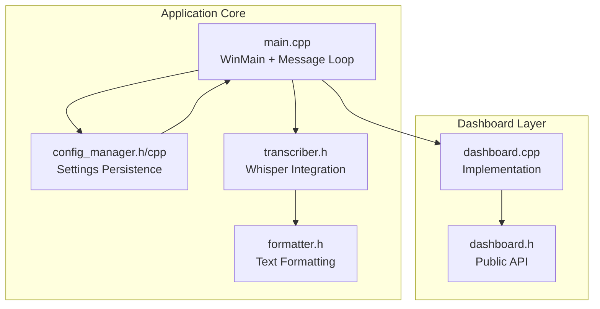
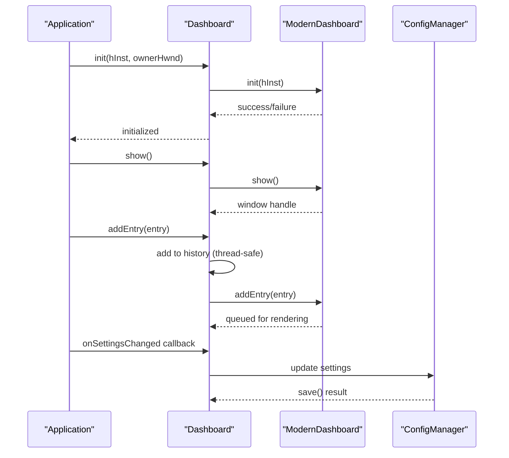
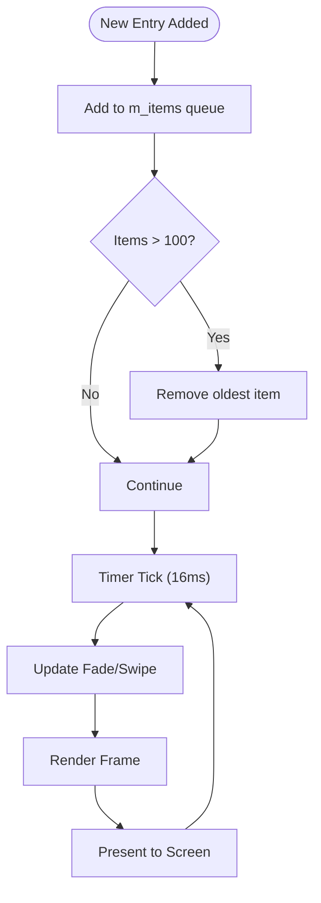
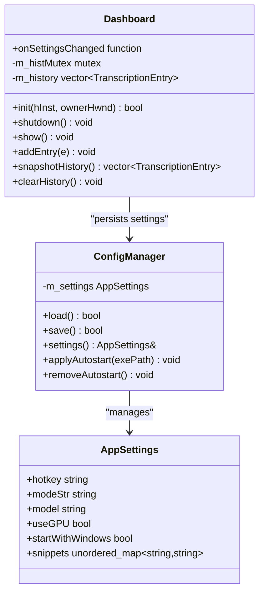
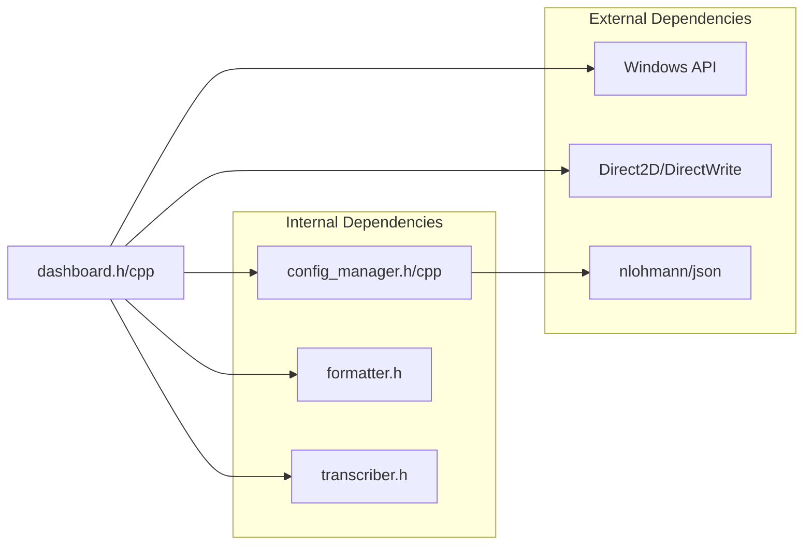

# Dashboard API

<cite>
**Referenced Files in This Document**
- [dashboard.h](file://src/dashboard.h)
- [dashboard.cpp](file://src/dashboard.cpp)
- [main.cpp](file://src/main.cpp)
- [config_manager.h](file://src/config_manager.h)
- [config_manager.cpp](file://src/config_manager.cpp)
- [formatter.h](file://src/formatter.h)
- [transcriber.h](file://src/transcriber.h)
- [CMakeLists.txt](file://CMakeLists.txt)
- [README.md](file://README.md)
- [settings.default.json](file://assets/settings.default.json)
</cite>

## Table of Contents
1. [Introduction](#introduction)
2. [Project Structure](#project-structure)
3. [Core Components](#core-components)
4. [Architecture Overview](#architecture-overview)
5. [Detailed Component Analysis](#detailed-component-analysis)
6. [Dependency Analysis](#dependency-analysis)
7. [Performance Considerations](#performance-considerations)
8. [Troubleshooting Guide](#troubleshooting-guide)
9. [Conclusion](#conclusion)

## Introduction
This document provides comprehensive API documentation for the Dashboard class interface used in the FLOW-ON application. The Dashboard serves as a modern history and settings management UI, featuring a Direct2D-powered Win32 window with optional WinUI 3 integration. It manages transcription history, exposes settings controls, and coordinates with the configuration manager for persistence and validation.

The documentation covers:
- Settings management functionality including configuration loading, validation, and persistence
- History tracking interface for accessing transcription logs and statistics
- WinUI 3 integration patterns and Win32 component interactions
- Settings panel controls, user input handling, and real-time configuration updates
- Event handling mechanisms for settings changes and UI interactions
- Method signatures, parameter descriptions, return values, and usage examples
- UI responsiveness, data binding patterns, and integration with the configuration manager

## Project Structure
The Dashboard API is part of a modular C++ application with clear separation of concerns:
- Core UI and state management in dashboard.h/cpp
- Configuration persistence in config_manager.h/cpp
- Application entry point and integration in main.cpp
- Supporting components for formatting, transcription, and system integration



**Diagram sources**
- [main.cpp](file://src/main.cpp#L362-L521)
- [dashboard.h](file://src/dashboard.h#L36-L68)
- [dashboard.cpp](file://src/dashboard.cpp#L394-L453)
- [config_manager.h](file://src/config_manager.h#L21-L39)

**Section sources**
- [dashboard.h](file://src/dashboard.h#L1-L69)
- [dashboard.cpp](file://src/dashboard.cpp#L1-L454)
- [main.cpp](file://src/main.cpp#L362-L521)

## Core Components
The Dashboard API consists of two primary components:

### Dashboard Class
The main interface class providing thread-safe history management and UI coordination:
- Initialization and shutdown lifecycle
- Thread-safe history operations (add, snapshot, clear)
- Settings change notification mechanism
- Win32 window management

### TranscriptionEntry Structure
Represents individual transcription records with metadata:
- Text content
- Timestamp in HH:MM format
- Latency measurement in milliseconds
- Mode indicator (coding/prose)

### DashboardSettings Structure
Defines configurable options persisted to settings.json:
- GPU acceleration toggle
- Autostart with Windows
- Model selection (tiny.en/base.en)

**Section sources**
- [dashboard.h](file://src/dashboard.h#L23-L68)
- [dashboard.cpp](file://src/dashboard.cpp#L428-L451)

## Architecture Overview
The Dashboard integrates with the main application through Windows message passing and shared state management:



**Diagram sources**
- [main.cpp](file://src/main.cpp#L480-L493)
- [dashboard.cpp](file://src/dashboard.cpp#L394-L426)
- [dashboard.cpp](file://src/dashboard.cpp#L428-L451)

The architecture follows a producer-consumer pattern where the main application produces transcription entries and settings changes, while the Dashboard consumes them to update both in-memory state and the UI.

**Section sources**
- [main.cpp](file://src/main.cpp#L480-L493)
- [dashboard.cpp](file://src/dashboard.cpp#L394-L453)

## Detailed Component Analysis

### Dashboard Class API

#### Public Methods

##### `init(HINSTANCE hInst, HWND ownerHwnd)`
Initializes the Dashboard with the required Windows handles.

**Parameters:**
- `hInst`: Application instance handle
- `ownerHwnd`: Parent window handle that will receive WM_SHOW_DASHBOARD messages

**Returns:** `bool` - True on successful initialization

**Thread Safety:** Single-threaded initialization only

**Usage Example:**
```cpp
// Called from WinMain after creating the hidden message window
g_dashboard.init(hInst, g_hwnd);
```

**Section sources**
- [dashboard.h](file://src/dashboard.h#L39-L40)
- [dashboard.cpp](file://src/dashboard.cpp#L394-L407)

##### `shutdown()`
Performs cleanup of all resources including the underlying ModernDashboard instance.

**Returns:** `void`

**Thread Safety:** Can be called from any thread

**Usage Example:**
```cpp
// Called during application shutdown
g_dashboard.shutdown();
```

**Section sources**
- [dashboard.h](file://src/dashboard.h#L40-L40)
- [dashboard.cpp](file://src/dashboard.cpp#L417-L426)

##### `show()`
Displays the Dashboard window or brings it to the foreground if already visible.

**Returns:** `void`

**Thread Safety:** Thread-safe; internally dispatches to the UI thread

**Usage Example:**
```cpp
// Called from tray menu or hotkey handler
PostMessageW(g_hwnd, WM_SHOW_DASHBOARD, 0, 0);
```

**Section sources**
- [dashboard.h](file://src/dashboard.h#L47-L47)
- [dashboard.cpp](file://src/dashboard.cpp#L409-L415)

##### `addEntry(const TranscriptionEntry& e)`
Thread-safe method to add a new transcription entry to both memory and UI.

**Parameters:**
- `e`: TranscriptionEntry containing text, timestamp, latency, and mode

**Returns:** `void`

**Thread Safety:** Uses mutex protection for history vector

**Behavior:**
- Adds entry to in-memory history (limits to 200 entries)
- Queues entry for UI rendering if dashboard is active
- Automatically trims history to prevent unbounded growth

**Section sources**
- [dashboard.h](file://src/dashboard.h#L43-L43)
- [dashboard.cpp](file://src/dashboard.cpp#L428-L439)

##### `snapshotHistory() const`
Provides a thread-safe snapshot of the current history.

**Returns:** `std::vector<TranscriptionEntry>` - Copy of current history

**Thread Safety:** Uses mutex protection and returns a copy

**Usage Example:**
```cpp
// Used for exporting or displaying history
auto history = g_dashboard.snapshotHistory();
```

**Section sources**
- [dashboard.h](file://src/dashboard.h#L50-L50)
- [dashboard.cpp](file://src/dashboard.cpp#L441-L445)

##### `clearHistory()`
Removes all entries from the in-memory history.

**Returns:** `void`

**Thread Safety:** Uses mutex protection

**Section sources**
- [dashboard.h](file://src/dashboard.h#L53-L53)
- [dashboard.cpp](file://src/dashboard.cpp#L447-L451)

#### Public Members

##### `onSettingsChanged`
Event handler fired on the main thread when user saves settings from the Dashboard UI.

**Type:** `std::function<void(const DashboardSettings&)>`

**Usage Example:**
```cpp
g_dashboard.onSettingsChanged = [](const DashboardSettings& ds) {
    g_config.settings().useGPU = ds.useGPU;
    g_config.settings().startWithWindows = ds.startWithWindows;
    g_config.save();
};
```

**Section sources**
- [dashboard.h](file://src/dashboard.h#L56-L56)
- [dashboard.cpp](file://src/dashboard.cpp#L481-L493)

##### `m_histMutex` and `m_history`
Internal synchronization primitives and storage for thread-safe history management.

**Section sources**
- [dashboard.h](file://src/dashboard.h#L60-L61)
- [dashboard.cpp](file://src/dashboard.cpp#L428-L451)

### ModernDashboard Implementation

The ModernDashboard class provides the actual Win32 window implementation with Direct2D rendering:

#### Key Features:
- **Direct2D Rendering:** Hardware-accelerated drawing with smooth animations
- **Glassmorphism Design:** Modern UI with transparency effects
- **Animation System:** Smooth fade-in and slide-in effects for new entries
- **Timer-based Updates:** 60 FPS rendering cycle using WM_TIMER

#### Animation System
The ModernDashboard implements a sophisticated animation system for list items:



**Diagram sources**
- [dashboard.cpp](file://src/dashboard.cpp#L197-L222)

**Section sources**
- [dashboard.cpp](file://src/dashboard.cpp#L35-L86)
- [dashboard.cpp](file://src/dashboard.cpp#L197-L222)

### Settings Management Integration

The Dashboard integrates tightly with the ConfigManager for persistent settings:



**Diagram sources**
- [dashboard.h](file://src/dashboard.h#L36-L68)
- [config_manager.h](file://src/config_manager.h#L21-L39)
- [config_manager.h](file://src/config_manager.h#L8-L19)

**Section sources**
- [dashboard.cpp](file://src/dashboard.cpp#L481-L493)
- [config_manager.cpp](file://src/config_manager.cpp#L24-L80)

### History Tracking Interface

The Dashboard maintains a comprehensive history of transcription activities:

#### History Storage:
- **Capacity:** Limited to 200 entries to prevent memory bloat
- **Thread Safety:** Protected by mutex for concurrent access
- **Trimming Policy:** Automatic removal of oldest entries when capacity is exceeded

#### Entry Metadata:
- **Text Content:** Formatted transcription text
- **Timestamp:** Local time in HH:MM format
- **Latency:** Processing time in milliseconds
- **Mode:** Coding or prose mode detection

**Section sources**
- [dashboard.cpp](file://src/dashboard.cpp#L428-L451)
- [dashboard.h](file://src/dashboard.h#L23-L28)

### WinUI 3 Integration Patterns

The Dashboard supports optional WinUI 3 integration through conditional compilation:

#### Build Configuration:
- **Conditional Compilation:** ENABLE_WINUI3_DASHBOARD preprocessor definition
- **NuGet Package:** Microsoft.WindowsAppSDK v1.5+ required
- **Fallback:** Win32 Direct2D implementation when WinUI 3 is disabled

#### Integration Approach:
The current implementation focuses on the Win32 Direct2D fallback, with WinUI 3 support indicated as optional. The bridge pattern allows seamless switching between implementations.

**Section sources**
- [dashboard.h](file://src/dashboard.h#L5-L14)
- [CMakeLists.txt](file://CMakeLists.txt#L65-L69)
- [README.md](file://README.md#L81-L92)

### Event Handling Mechanisms

The Dashboard participates in the application's event-driven architecture:

#### Settings Change Events:
- **Trigger:** User saves settings from Dashboard UI
- **Handler:** onSettingsChanged callback
- **Execution:** Main thread only (thread-safe)
- **Persistence:** Automatic saving via ConfigManager

#### UI Interaction Events:
- **Show/Hide:** WM_SHOW_DASHBOARD message handling
- **Timer-based Rendering:** 60 FPS animation updates
- **Window Management:** Proper lifecycle handling

**Section sources**
- [main.cpp](file://src/main.cpp#L237-L239)
- [dashboard.cpp](file://src/dashboard.cpp#L481-L493)

## Dependency Analysis

The Dashboard API has minimal external dependencies, focusing on core Windows APIs and internal components:



**Diagram sources**
- [dashboard.cpp](file://src/dashboard.cpp#L6-L18)
- [config_manager.cpp](file://src/config_manager.cpp#L4-L10)

### Key Dependencies:
- **Windows API:** Core messaging, timers, and window management
- **Direct2D/DirectWrite:** Hardware-accelerated rendering
- **nlohmann/json:** Configuration file parsing and serialization
- **Internal Managers:** ConfigManager for persistence, Transcriber for state

**Section sources**
- [dashboard.cpp](file://src/dashboard.cpp#L6-L18)
- [config_manager.cpp](file://src/config_manager.cpp#L4-L10)

## Performance Considerations

### Rendering Performance:
- **Frame Rate:** 60 FPS (16ms timer interval) for smooth animations
- **Hardware Acceleration:** Direct2D utilizes GPU for rendering
- **Memory Management:** Off-screen bitmap buffer for efficient blitting
- **Animation Efficiency:** Optimized easing functions and minimal redraw regions

### Memory Management:
- **History Limits:** Automatic trimming to 200 entries
- **Entry Limits:** UI queue limited to 100 entries for rendering
- **Resource Cleanup:** Proper release of GDI/Direct2D resources

### Concurrency:
- **Thread-Safe Operations:** Mutex-protected history access
- **Cross-Thread Communication:** Message-based UI updates
- **Atomic State:** Visibility flags for UI state management

**Section sources**
- [dashboard.cpp](file://src/dashboard.cpp#L20-L29)
- [dashboard.cpp](file://src/dashboard.cpp#L428-L451)

## Troubleshooting Guide

### Common Issues and Solutions:

#### Dashboard Fails to Initialize:
- **Symptom:** Dashboard shows as blank or fails to appear
- **Cause:** Direct2D resource creation failure
- **Solution:** Verify graphics driver support for Direct2D

#### Settings Changes Not Persisted:
- **Symptom:** Settings revert after restart
- **Cause:** ConfigManager save failure or corrupted settings.json
- **Solution:** Check file permissions for %APPDATA%\FLOW-ON\settings.json

#### History Not Updating:
- **Symptom:** New transcriptions don't appear in history
- **Cause:** Threading issues or UI not receiving updates
- **Solution:** Ensure addEntry is called from main thread or use provided thread-safe methods

#### Performance Issues:
- **Symptom:** High CPU usage or dropped frames
- **Cause:** Excessive history entries or rendering overhead
- **Solution:** Monitor history size and consider reducing animation complexity

**Section sources**
- [dashboard.cpp](file://src/dashboard.cpp#L90-L113)
- [config_manager.cpp](file://src/config_manager.cpp#L24-L58)

## Conclusion

The Dashboard API provides a robust, thread-safe interface for managing transcription history and settings within the FLOW-ON application. Its integration with the broader application architecture demonstrates clean separation of concerns while maintaining efficient performance through hardware-accelerated rendering and careful resource management.

Key strengths include:
- **Thread Safety:** Comprehensive protection for concurrent access
- **Performance:** Hardware-accelerated rendering with efficient animation
- **Integration:** Seamless coordination with configuration and transcription systems
- **Extensibility:** Clean API design supporting future enhancements like full WinUI 3 integration

The API successfully balances functionality with performance, providing users with an intuitive interface for monitoring transcription activities while maintaining the application's responsive design.