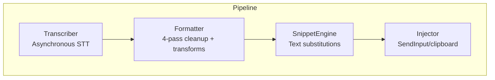
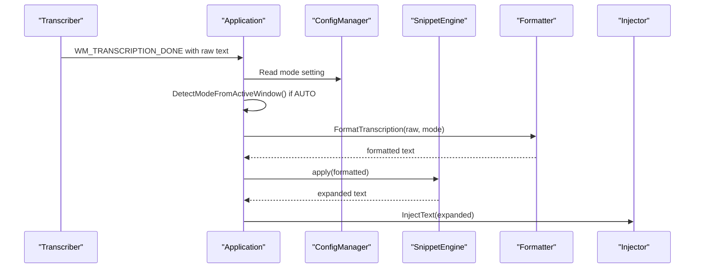
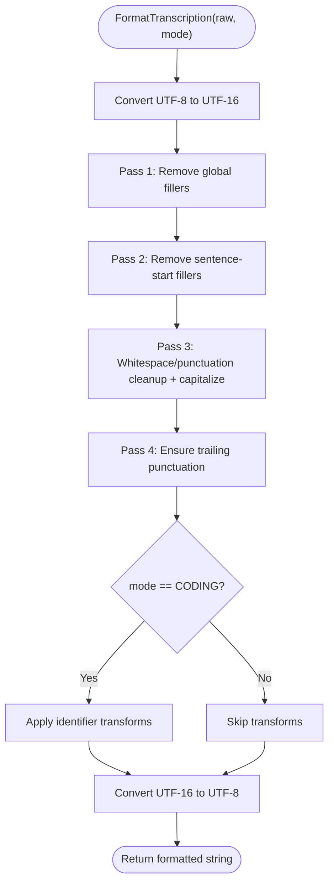
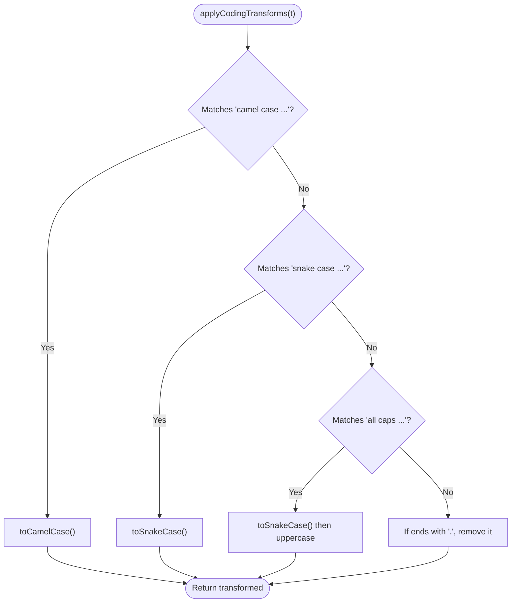
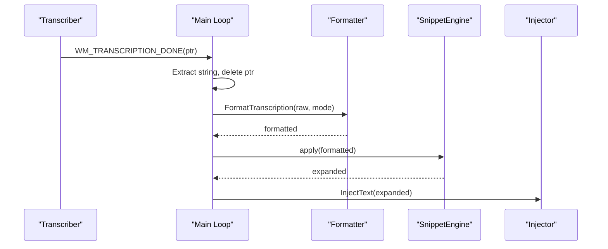
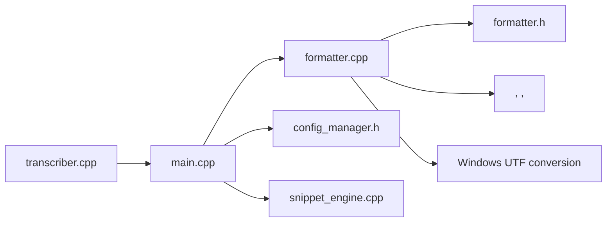

# Formatter API

<cite>
**Referenced Files in This Document**
- [formatter.h](file://src/formatter.h)
- [formatter.cpp](file://src/formatter.cpp)
- [main.cpp](file://src/main.cpp)
- [snippet_engine.cpp](file://src/snippet_engine.cpp)
- [config_manager.h](file://src/config_manager.h)
- [transcriber.h](file://src/transcriber.h)
- [transcriber.cpp](file://src/transcriber.cpp)
</cite>

## Table of Contents
1. [Introduction](#introduction)
2. [Project Structure](#project-structure)
3. [Core Components](#core-components)
4. [Architecture Overview](#architecture-overview)
5. [Detailed Component Analysis](#detailed-component-analysis)
6. [Dependency Analysis](#dependency-analysis)
7. [Performance Considerations](#performance-considerations)
8. [Troubleshooting Guide](#troubleshooting-guide)
9. [Conclusion](#conclusion)
10. [Appendices](#appendices)

## Introduction
This document describes the Formatter API used to transform raw speech-to-text output into polished, context-aware text. It covers the intelligent text formatting pipeline, application detection mechanisms, and integration with the transcriber and snippet engine. The formatter supports two modes:
- Prose mode: cleans fillers and punctuation for natural language
- Coding mode: applies identifier transforms (camelCase, snake_case, ALL_CAPS) and removes trailing punctuation for code identifiers

## Project Structure
The formatter is part of a larger voice-to-text pipeline:
- Transcriber captures audio and runs Whisper asynchronously
- Formatter processes the transcription text
- Snippet engine expands abbreviations and boilerplate
- Injector sends the formatted text to the active application

**Diagram sources**
- [transcriber.cpp](file://src/transcriber.cpp#L103-L225)
- [formatter.cpp](file://src/formatter.cpp#L137-L147)
- [main.cpp](file://src/main.cpp#L280-L342)

**Section sources**
- [transcriber.h](file://src/transcriber.h#L10-L28)
- [formatter.h](file://src/formatter.h#L4-L13)
- [main.cpp](file://src/main.cpp#L280-L342)

## Core Components
- AppMode enumeration defines formatting behavior:
  - PROSE: natural language formatting
  - CODING: identifier transforms and punctuation removal
- FormatTranscription(raw, mode) is the primary API entry point.

Key behaviors:
- Four-pass cleaning pipeline for PROSE
- Additional coding transforms for CODING
- UTF-8/UTF-16 conversion for cross-platform text handling
- Regex-based transforms compiled once for performance

**Section sources**
- [formatter.h](file://src/formatter.h#L4-L13)
- [formatter.cpp](file://src/formatter.cpp#L12-L39)
- [formatter.cpp](file://src/formatter.cpp#L137-L147)

## Architecture Overview
The formatter sits between the transcriber and snippet engine. The application mode is determined by configuration or active window detection, then passed to the formatter.

**Diagram sources**
- [main.cpp](file://src/main.cpp#L280-L342)
- [formatter.cpp](file://src/formatter.cpp#L137-L147)
- [snippet_engine.cpp](file://src/snippet_engine.cpp#L35-L81)
- [config_manager.h](file://src/config_manager.h#L8-L19)

## Detailed Component Analysis

### AppMode and Formatting Modes
- PROSE mode: removes filler words, cleans whitespace, capitalizes sentence starts, adds trailing punctuation.
- CODING mode: applies camelCase, snake_case, or ALL_CAPS transforms to the input; removes trailing punctuation for identifiers.

Mode selection logic:
- If configuration specifies "code" or "prose", use that
- Otherwise, detect the active foreground application and infer mode heuristically

**Section sources**
- [formatter.h](file://src/formatter.h#L4-L5)
- [main.cpp](file://src/main.cpp#L300-L304)
- [config_manager.h](file://src/config_manager.h#L10)

### FormatTranscription API
- Signature: FormatTranscription(const std::string& raw, AppMode mode) -> std::string
- Parameters:
  - raw: UTF-8 encoded transcription text
  - mode: AppMode.PROSE or AppMode.CODING
- Returns: Formatted UTF-8 string
- Behavior:
  - Converts raw to wide string
  - Applies four-pass cleaning pipeline
  - In CODING mode, applies identifier transforms
  - Converts back to narrow string

**Diagram sources**
- [formatter.cpp](file://src/formatter.cpp#L137-L147)
- [formatter.cpp](file://src/formatter.cpp#L65-L91)
- [formatter.cpp](file://src/formatter.cpp#L114-L133)

**Section sources**
- [formatter.h](file://src/formatter.h#L13)
- [formatter.cpp](file://src/formatter.cpp#L137-L147)

### Cleaning Pipeline (PROSE)
- Pass 1: Remove global fillers (e.g., um, uh, er, hmm)
- Pass 2: Remove sentence-start fillers (e.g., so, well, okay) anchored to start-of-line
- Pass 3: Normalize whitespace, trim leading spaces/punctuation, capitalize first letter
- Pass 4: Ensure trailing punctuation (. ? ! :)

Implementation notes:
- Uses precompiled wide regexes for performance
- Sentence-start fillers are only removed at line boundaries

**Section sources**
- [formatter.h](file://src/formatter.h#L7-L11)
- [formatter.cpp](file://src/formatter.cpp#L14-L39)
- [formatter.cpp](file://src/formatter.cpp#L65-L91)

### Coding Transforms (CODING)
- Recognized commands:
  - "camel case ..." -> convert to userName
  - "snake case ..." -> convert to user_name
  - "all caps ..." -> convert to USER_NAME
- Additional behavior:
  - Removes trailing period for identifiers
  - Preserves original text if no command matches

**Diagram sources**
- [formatter.cpp](file://src/formatter.cpp#L114-L133)
- [formatter.cpp](file://src/formatter.cpp#L93-L112)

**Section sources**
- [formatter.cpp](file://src/formatter.cpp#L34-L37)
- [formatter.cpp](file://src/formatter.cpp#L114-L133)
- [formatter.cpp](file://src/formatter.cpp#L93-L112)

### Application Detection Mechanism
Mode selection is performed in the main loop:
- If configuration mode is "code" or "prose", use that
- Else, detect the active foreground window and infer mode based on process executable name

Detection criteria:
- Known code editors and terminals (e.g., VS Code, Cursor, nvim, Windows Terminal, Visual Studio, JetBrains IDEs, PowerShell, cmd, git-bash, mintty)
- If any known code app is detected, mode becomes CODING; otherwise PROSE

**Section sources**
- [main.cpp](file://src/main.cpp#L300-L304)
- [snippet_engine.cpp](file://src/snippet_engine.cpp#L35-L81)

### Integration with Transcriber Output
- Transcriber posts WM_TRANSCRIPTION_DONE with a heap-allocated string pointer
- Main loop retrieves the string, deletes the pointer, and passes it to the formatter
- The formatted text is then processed by the snippet engine and injected

**Diagram sources**
- [transcriber.cpp](file://src/transcriber.cpp#L219-L221)
- [main.cpp](file://src/main.cpp#L280-L342)
- [formatter.cpp](file://src/formatter.cpp#L137-L147)

**Section sources**
- [transcriber.h](file://src/transcriber.h#L7-L8)
- [transcriber.cpp](file://src/transcriber.cpp#L103-L225)
- [main.cpp](file://src/main.cpp#L280-L342)

### Formatting Configuration Options
- Mode selection:
  - "code": force CODING mode
  - "prose": force PROSE mode
  - "auto": detect from active window
- Snippets:
  - Case-insensitive replacement engine
  - Loaded from configuration and applied after formatting

**Section sources**
- [config_manager.h](file://src/config_manager.h#L8-L19)
- [main.cpp](file://src/main.cpp#L300-L304)
- [snippet_engine.h](file://src/snippet_engine.h#L5-L15)

### Method Signatures and Parameters
- AppMode
  - Enumerators: PROSE, CODING
- FormatTranscription
  - Parameters:
    - raw: const std::string& (UTF-8)
    - mode: AppMode
  - Returns: std::string (UTF-8)
  - Throws: None (no exceptions documented)
  - Notes: Performs UTF-8/UTF-16 conversions internally

**Section sources**
- [formatter.h](file://src/formatter.h#L4-L13)
- [formatter.cpp](file://src/formatter.cpp#L137-L147)

### Usage Examples
- Basic usage:
  - Determine mode from configuration or active window
  - Call FormatTranscription(raw, mode)
  - Apply snippet expansions
  - Inject into the active application
- Example flow:
  - Mode = "auto" -> DetectModeFromActiveWindow() -> CODING if VS Code
  - raw = "user name" -> formatted = "userName" (CODING)
  - raw = "hello there" -> formatted = "Hello there." (PROSE)

**Section sources**
- [main.cpp](file://src/main.cpp#L300-L304)
- [formatter.cpp](file://src/formatter.cpp#L137-L147)
- [README.md](file://README.md#L290-L297)

## Dependency Analysis
- Formatter depends on:
  - Windows APIs for UTF conversion
  - Standard library regex for text transforms
  - AppMode enumeration
- Integration points:
  - Transcriber posts raw text via Windows message
  - Main loop selects mode and invokes formatter
  - Snippet engine applies post-processing

**Diagram sources**
- [formatter.cpp](file://src/formatter.cpp#L2-L8)
- [formatter.h](file://src/formatter.h#L1-L5)
- [main.cpp](file://src/main.cpp#L20-L26)
- [transcriber.cpp](file://src/transcriber.cpp#L2-L8)

**Section sources**
- [formatter.cpp](file://src/formatter.cpp#L2-L8)
- [formatter.h](file://src/formatter.h#L1-L5)
- [main.cpp](file://src/main.cpp#L20-L26)
- [transcriber.cpp](file://src/transcriber.cpp#L2-L8)

## Performance Considerations
- Regex compilation:
  - All regex objects are compiled once at module load time
  - Avoid constructing regex inside the hot-path function
- Memory:
  - Converts to wide string for processing, then back to narrow string
  - No dynamic allocations in the main formatting loop
- Throughput:
  - Designed for real-time processing after each transcription
  - Minimal overhead to keep latency low

Best practices:
- Keep regex patterns minimal and anchored where possible
- Avoid repeated conversions between encodings
- Ensure mode detection does not block the main thread

**Section sources**
- [formatter.cpp](file://src/formatter.cpp#L9-L11)
- [formatter.cpp](file://src/formatter.cpp#L137-L147)

## Troubleshooting Guide
- Unexpected mode:
  - Verify configuration mode ("code"/"prose"/"auto")
  - Confirm active window detection matches expected application
- Incorrect transforms:
  - Ensure input matches expected command patterns
  - For identifiers, trailing punctuation is removed automatically
- Performance issues:
  - Confirm regex compilation occurs once
  - Avoid frequent mode switches during a session

**Section sources**
- [main.cpp](file://src/main.cpp#L300-L304)
- [formatter.cpp](file://src/formatter.cpp#L114-L133)

## Conclusion
The Formatter API provides a robust, context-aware text processing pipeline that adapts to both prose and coding scenarios. Its four-pass cleaning and coding transforms, combined with efficient regex usage and application detection, deliver responsive, high-quality text formatting suitable for real-time voice-to-text workflows.

## Appendices

### Extensibility Patterns for Custom Formatters
- New transform categories:
  - Add new regex patterns and transform functions
  - Extend AppMode with new enumerators
  - Integrate new transforms in the main formatting flow
- Custom mode detection:
  - Extend DetectModeFromActiveWindow() with additional heuristics
  - Respect configuration precedence (explicit mode overrides detection)
- Custom snippet engines:
  - Implement a new snippet engine with different matching semantics
  - Apply after formatter and before injection

**Section sources**
- [formatter.cpp](file://src/formatter.cpp#L114-L133)
- [snippet_engine.cpp](file://src/snippet_engine.cpp#L35-L81)
- [config_manager.h](file://src/config_manager.h#L8-L19)