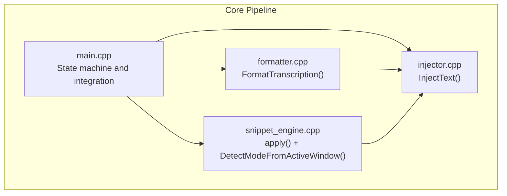
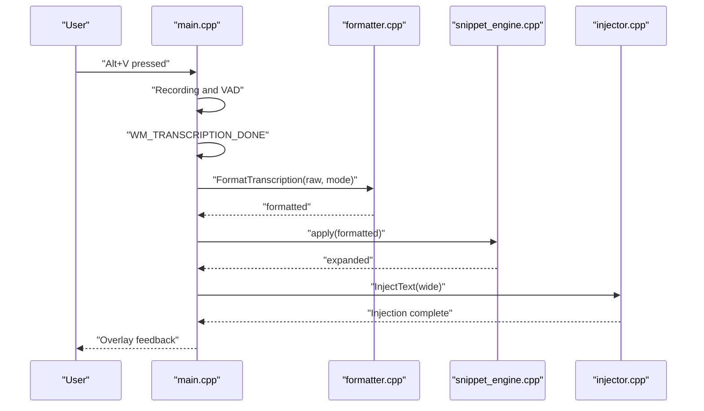
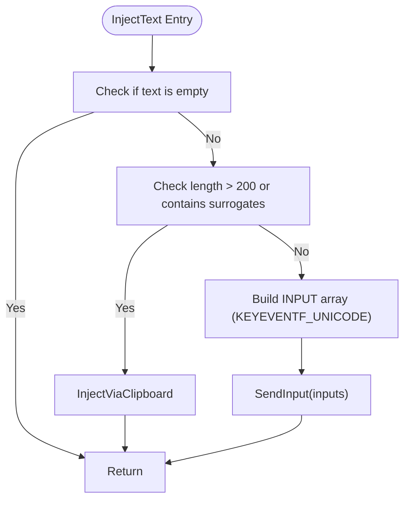
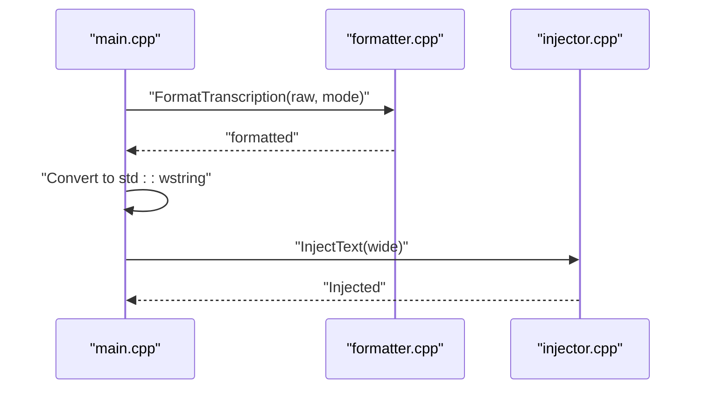
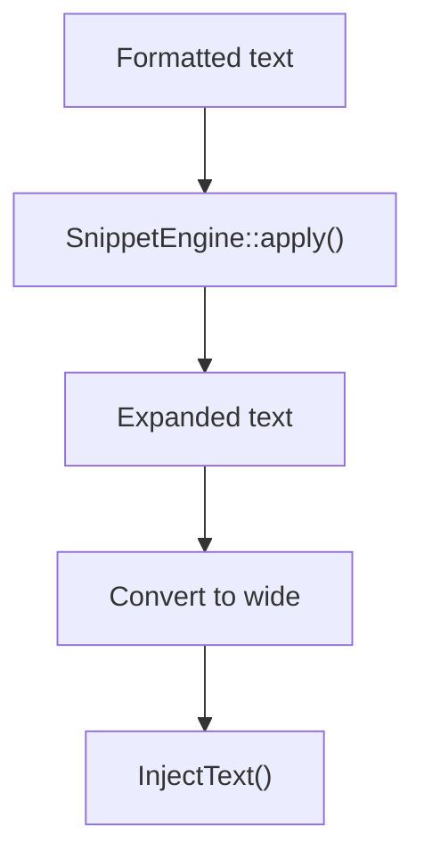
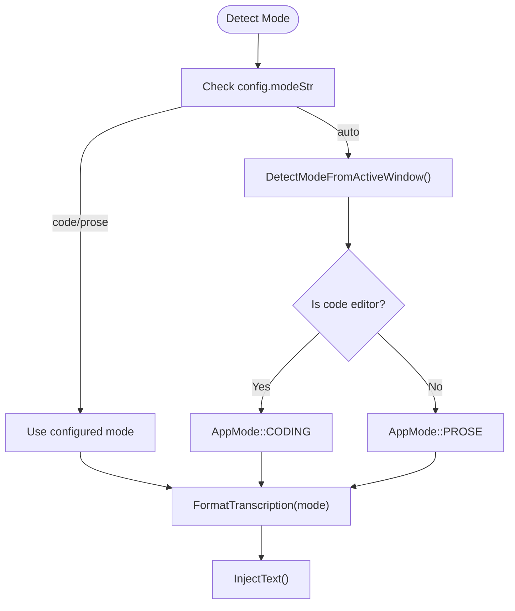
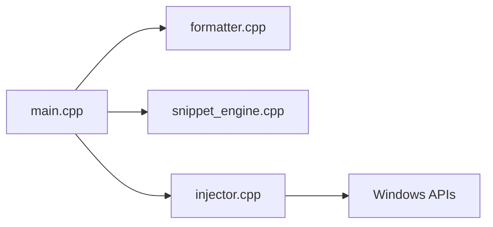

# Injector API

<cite>
**Referenced Files in This Document**
- [injector.h](file://src/injector.h)
- [injector.cpp](file://src/injector.cpp)
- [main.cpp](file://src/main.cpp)
- [formatter.h](file://src/formatter.h)
- [formatter.cpp](file://src/formatter.cpp)
- [snippet_engine.h](file://src/snippet_engine.h)
- [snippet_engine.cpp](file://src/snippet_engine.cpp)
- [config_manager.h](file://src/config_manager.h)
- [README.md](file://README.md)
</cite>

## Table of Contents
1. [Introduction](#introduction)
2. [Project Structure](#project-structure)
3. [Core Components](#core-components)
4. [Architecture Overview](#architecture-overview)
5. [Detailed Component Analysis](#detailed-component-analysis)
6. [Dependency Analysis](#dependency-analysis)
7. [Performance Considerations](#performance-considerations)
8. [Troubleshooting Guide](#troubleshooting-guide)
9. [Conclusion](#conclusion)
10. [Appendices](#appendices)

## Introduction
This document provides API documentation for the Injector class interface responsible for injecting text into the currently focused application on Windows. It covers the text injection functionality, including application detection, input simulation, and fallback mechanisms. It explains the Windows API integration for SendInput operations and keyboard event generation, application context awareness, input method selection, error handling, alternative input strategies, integration with the formatter output and text processing pipeline, method signatures, parameter descriptions, return values, usage examples, security considerations, permission requirements, and compatibility with different application types.

## Project Structure
The Injector API resides in the src directory alongside related components:
- injector.h/cpp: Declares and implements the InjectText API and fallback logic.
- main.cpp: Integrates the text injection into the end-to-end pipeline, including formatting, snippet expansion, and application mode detection.
- formatter.h/cpp: Provides the four-pass text formatter used prior to injection.
- snippet_engine.h/cpp: Applies snippet expansions and detects application modes.
- config_manager.h: Stores user preferences including mode selection and snippets.
- README.md: Describes the overall system and highlights the smart text injection feature.

**Diagram sources**
- [main.cpp](file://src/main.cpp#L276-L342)
- [formatter.cpp](file://src/formatter.cpp#L137-L147)
- [snippet_engine.cpp](file://src/snippet_engine.cpp#L6-L28)
- [injector.cpp](file://src/injector.cpp#L49-L74)

**Section sources**
- [README.md](file://README.md#L69-L124)

## Core Components
- Injector API surface:
  - InjectText(const std::wstring& text): Injects text into the currently focused application. Uses SendInput for short, non-surrogate text; otherwise falls back to clipboard paste via Ctrl+V.
- Formatter:
  - FormatTranscription(const std::string&, AppMode): Performs four-pass cleaning and optional coding transforms.
- Snippet Engine:
  - apply(const std::string&): Applies case-insensitive snippet substitutions.
  - DetectModeFromActiveWindow(): Determines whether the active application is a code editor or prose editor.
- Integration:
  - main.cpp orchestrates the end-to-end flow: transcription → formatting → snippet expansion → mode detection → injection.

Key behaviors:
- Text length threshold: <= 200 characters with no surrogate pairs → SendInput (per-character UNICODE events).
- Surrogate pairs (e.g., emoji) or longer strings → clipboard paste via Ctrl+V.
- Must be called from the main Win32 thread only.

**Section sources**
- [injector.h](file://src/injector.h#L4-L8)
- [injector.cpp](file://src/injector.cpp#L49-L74)
- [formatter.h](file://src/formatter.h#L4-L13)
- [formatter.cpp](file://src/formatter.cpp#L137-L147)
- [snippet_engine.h](file://src/snippet_engine.h#L21-L25)
- [snippet_engine.cpp](file://src/snippet_engine.cpp#L35-L81)
- [main.cpp](file://src/main.cpp#L300-L320)

## Architecture Overview
The Injector API sits at the tail end of the text processing pipeline. After transcription completes, the system:
1. Detects the active application mode (prose or coding).
2. Formats the transcription using the four-pass formatter.
3. Applies snippet expansions.
4. Converts the formatted string to wide characters.
5. Calls InjectText to simulate input or paste into the foreground application.

**Diagram sources**
- [main.cpp](file://src/main.cpp#L276-L342)
- [formatter.cpp](file://src/formatter.cpp#L137-L147)
- [snippet_engine.cpp](file://src/snippet_engine.cpp#L6-L28)
- [injector.cpp](file://src/injector.cpp#L49-L74)

## Detailed Component Analysis

### Injector API
- Method signature: InjectText(const std::wstring& text)
- Description: Injects a UTF-16 string into the currently focused application. Chooses between direct keyboard simulation and clipboard paste depending on text characteristics.
- Parameters:
  - text: A wide string representing the text to inject. Must be non-empty.
- Behavior:
  - If text is empty, the function returns immediately.
  - If text length exceeds 200 characters or contains surrogate pairs (e.g., emoji), the function falls back to clipboard paste.
  - Otherwise, it generates a sequence of keyboard events using SendInput with KEYEVENTF_UNICODE for each character.
- Return value: None (void).
- Threading requirement: Must be called from the main Win32 thread only.
- Windows API integration:
  - Keyboard simulation: Uses SendInput with INPUT_KEYBOARD entries and KEYEVENTF_UNICODE/KEYEVENTF_KEYUP flags.
  - Clipboard fallback: Opens the clipboard, allocates global memory, sets CF_UNICODETEXT, and simulates Ctrl+V keystrokes.

**Diagram sources**
- [injector.cpp](file://src/injector.cpp#L49-L74)

**Section sources**
- [injector.h](file://src/injector.h#L4-L8)
- [injector.cpp](file://src/injector.cpp#L49-L74)

### Formatter Integration
- The formatted output from FormatTranscription is used as input to InjectText.
- AppMode controls whether coding transforms (camelCase, snake_case, all caps) are applied.
- The formatted string is converted to a wide string before injection.

**Diagram sources**
- [main.cpp](file://src/main.cpp#L300-L320)
- [formatter.cpp](file://src/formatter.cpp#L137-L147)
- [injector.cpp](file://src/injector.cpp#L49-L74)

**Section sources**
- [formatter.h](file://src/formatter.h#L4-L13)
- [formatter.cpp](file://src/formatter.cpp#L137-L147)
- [main.cpp](file://src/main.cpp#L300-L320)

### Snippet Engine Integration
- Snippet expansions are applied after formatting and before injection.
- The snippet engine performs case-insensitive, longest-first replacement of trigger phrases.

**Diagram sources**
- [main.cpp](file://src/main.cpp#L305-L319)
- [snippet_engine.cpp](file://src/snippet_engine.cpp#L6-L28)
- [injector.cpp](file://src/injector.cpp#L49-L74)

**Section sources**
- [snippet_engine.h](file://src/snippet_engine.h#L8-L15)
- [snippet_engine.cpp](file://src/snippet_engine.cpp#L6-L28)
- [main.cpp](file://src/main.cpp#L305-L319)

### Application Mode Awareness and Input Method Selection
- Mode detection:
  - If configured mode is "code" or "prose", use that mode.
  - Otherwise, detect the active foreground process and classify it as a code editor or prose editor.
- Input method selection:
  - For prose mode, InjectText sends individual Unicode key events.
  - For coding mode, InjectText also applies camelCase/snake_case/all caps transforms during formatting, then injects the transformed text.

**Diagram sources**
- [main.cpp](file://src/main.cpp#L300-L304)
- [snippet_engine.cpp](file://src/snippet_engine.cpp#L35-L81)
- [formatter.cpp](file://src/formatter.cpp#L137-L147)
- [injector.cpp](file://src/injector.cpp#L49-L74)

**Section sources**
- [config_manager.h](file://src/config_manager.h#L8-L19)
- [main.cpp](file://src/main.cpp#L300-L304)
- [snippet_engine.cpp](file://src/snippet_engine.cpp#L35-L81)
- [formatter.cpp](file://src/formatter.cpp#L137-L147)

### Windows API Integration Details
- Keyboard event generation:
  - Uses INPUT_KEYBOARD with KEYEVENTF_UNICODE for each character.
  - Emits both key-down and key-up events.
- Clipboard fallback:
  - Opens the clipboard, allocates global memory, sets CF_UNICODETEXT, closes clipboard, waits briefly, then simulates Ctrl+V.
- Threading constraint:
  - Must be invoked from the main Win32 thread to ensure correct focus and input synthesis.

**Section sources**
- [injector.cpp](file://src/injector.cpp#L49-L74)

### Error Handling and Alternative Strategies
- Empty input: No-op.
- Surrogate-containing or long text: Fallback to clipboard paste to avoid crashes in legacy applications.
- Clipboard failure: The clipboard path returns early if opening the clipboard fails.
- Injection failures: The current implementation does not expose explicit error codes; callers should assume best-effort injection.

**Section sources**
- [injector.cpp](file://src/injector.cpp#L49-L74)

### Security Considerations and Permissions
- Clipboard manipulation requires the application to own the clipboard during the paste operation.
- Keyboard simulation affects the active application; ensure the application is trusted and runs with appropriate privileges.
- Compatibility: Some applications (e.g., terminal emulators) reject raw Unicode events; the fallback to clipboard paste improves compatibility.

**Section sources**
- [injector.cpp](file://src/injector.cpp#L18-L47)
- [README.md](file://README.md#L10-L11)

## Dependency Analysis
The Injector API depends on:
- Windows APIs for input simulation and clipboard operations.
- The formatter and snippet engine for pre-processing text.
- The main application state machine for orchestrating the pipeline.

**Diagram sources**
- [main.cpp](file://src/main.cpp#L276-L342)
- [formatter.cpp](file://src/formatter.cpp#L137-L147)
- [snippet_engine.cpp](file://src/snippet_engine.cpp#L6-L28)
- [injector.cpp](file://src/injector.cpp#L49-L74)

**Section sources**
- [main.cpp](file://src/main.cpp#L276-L342)
- [injector.cpp](file://src/injector.cpp#L49-L74)

## Performance Considerations
- SendInput is efficient for short, non-surrogate text and avoids clipboard overhead.
- Clipboard fallback introduces a small delay to allow the target application to process clipboard updates.
- Formatting and snippet expansion occur before injection, minimizing the payload size for injection.

[No sources needed since this section provides general guidance]

## Troubleshooting Guide
- Hotkey conflicts: If Alt+V or Alt+Shift+V is taken, the application attempts a fallback hotkey and updates the tray tooltip accordingly.
- Audio capture errors: If the recording is too short or has excessive dropouts, the system reports an error and resets to idle.
- Transcription busy: If Whisper is still processing, the system ignores the duplicate transcription message and resets to idle.
- Injection failures: If injection does not occur, verify that the application is in the main thread and that the target application accepts input.

**Section sources**
- [main.cpp](file://src/main.cpp#L162-L178)
- [main.cpp](file://src/main.cpp#L254-L273)
- [main.cpp](file://src/main.cpp#L280-L292)

## Conclusion
The Injector API provides a robust, adaptive mechanism for injecting text into the active Windows application. By combining direct keyboard simulation for compatible targets with a reliable clipboard fallback for others, it achieves broad compatibility. Integration with the formatter and snippet engine ensures polished, context-aware text delivery, while application mode detection tailors behavior for coding versus prose contexts.

[No sources needed since this section summarizes without analyzing specific files]

## Appendices

### API Reference
- InjectText(const std::wstring& text)
  - Purpose: Injects text into the currently focused application.
  - Parameters:
    - text: Wide string to inject. Must be non-empty.
  - Behavior:
    - For text length <= 200 and no surrogate pairs: SendInput with KEYEVENTF_UNICODE.
    - Otherwise: Clipboard paste via Ctrl+V.
  - Threading: Must be called from the main Win32 thread.
  - Return: None.

**Section sources**
- [injector.h](file://src/injector.h#L4-L8)
- [injector.cpp](file://src/injector.cpp#L49-L74)

### Usage Example
- Typical usage within the application pipeline:
  - After receiving WM_TRANSCRIPTION_DONE, convert formatted text to wide, update state to injecting, and call InjectText.

**Section sources**
- [main.cpp](file://src/main.cpp#L316-L320)

### Compatibility Notes
- Works across modern Windows applications and terminals.
- Surrogate pairs (emoji) and long strings are handled via clipboard fallback to improve compatibility with legacy applications.

**Section sources**
- [injector.cpp](file://src/injector.cpp#L53-L57)
- [README.md](file://README.md#L10-L11)