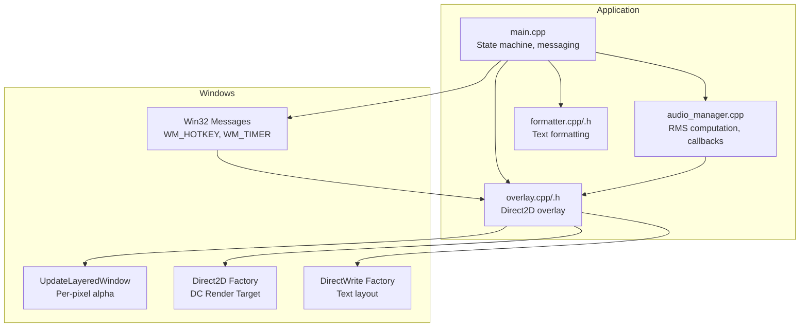
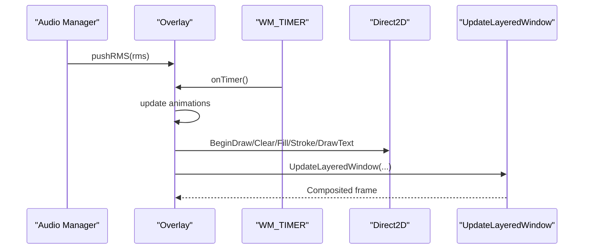
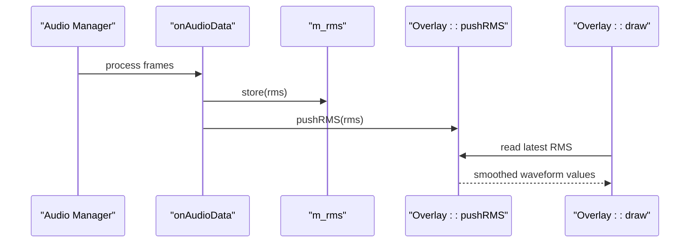
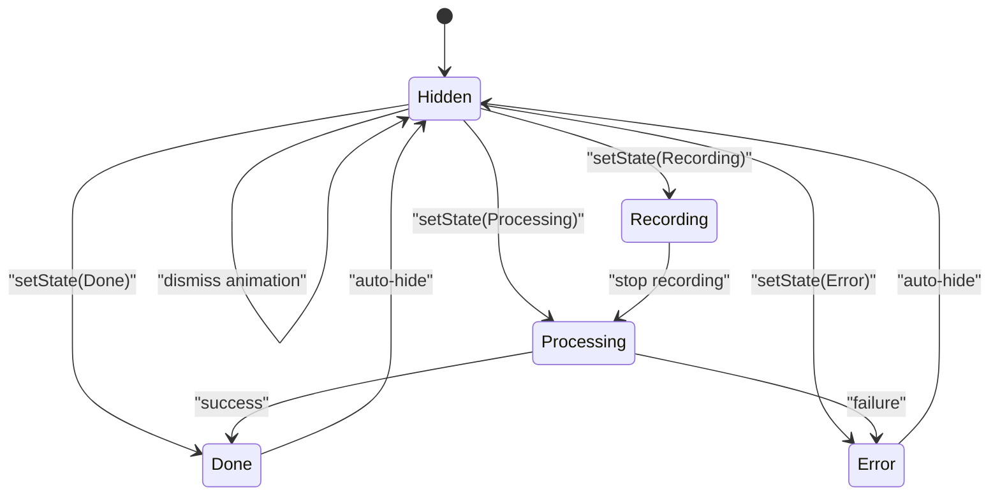
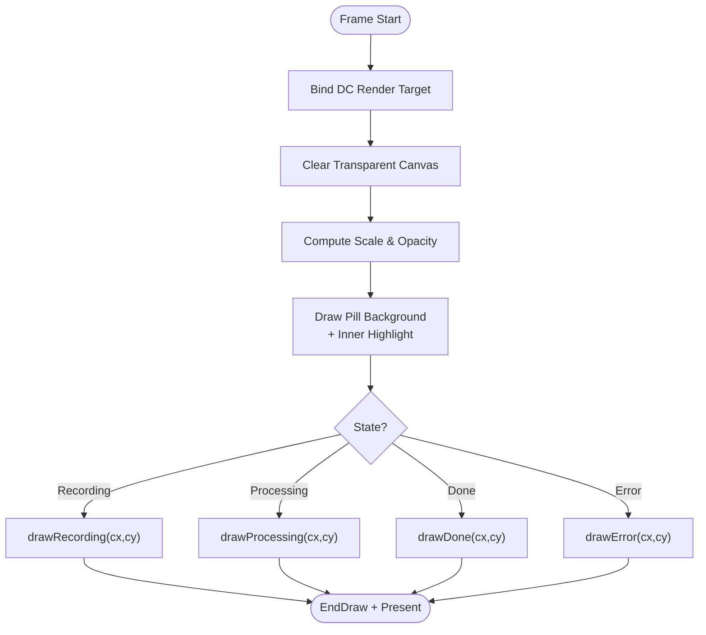
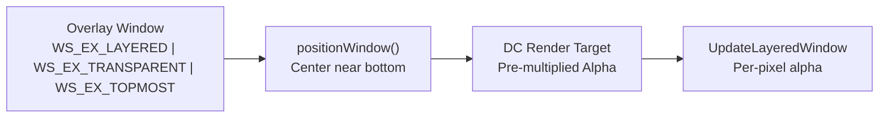
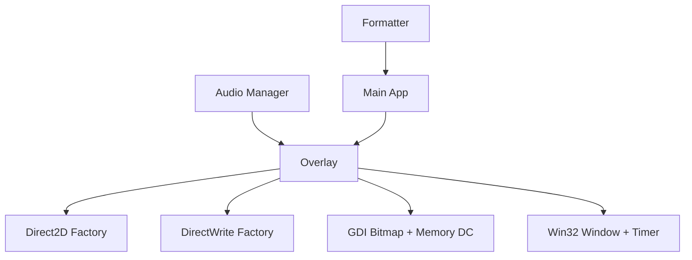

# Overlay API

<cite>
**Referenced Files in This Document**
- [overlay.h](file://src/overlay.h)
- [overlay.cpp](file://src/overlay.cpp)
- [audio_manager.h](file://src/audio_manager.h)
- [audio_manager.cpp](file://src/audio_manager.cpp)
- [formatter.h](file://src/formatter.h)
- [formatter.cpp](file://src/formatter.cpp)
- [main.cpp](file://src/main.cpp)
- [README.md](file://README.md)
</cite>

## Table of Contents
1. [Introduction](#introduction)
2. [Project Structure](#project-structure)
3. [Core Components](#core-components)
4. [Architecture Overview](#architecture-overview)
5. [Detailed Component Analysis](#detailed-component-analysis)
6. [Dependency Analysis](#dependency-analysis)
7. [Performance Considerations](#performance-considerations)
8. [Troubleshooting Guide](#troubleshooting-guide)
9. [Conclusion](#conclusion)

## Introduction
This document provides comprehensive API documentation for the Overlay class, a Direct2D-based floating overlay that displays real-time audio feedback and application state. The overlay renders a pill-shaped UI with:
- Live waveform visualization synchronized to audio RMS
- Animated state indicators for recording, processing, completion, and error
- Smooth animations and transitions at approximately 60 frames per second
- True per-pixel alpha compositing using layered windows

The overlay integrates tightly with the audio manager for RMS-based visual effects and coordinates with the main application to reflect transcription states. It supports window positioning, transparency controls, and is designed to be DPI-aware through the underlying Direct2D/DirectWrite infrastructure.

## Project Structure
The overlay resides in the core application and interacts with several subsystems:
- Audio manager: captures audio, computes RMS, and feeds the overlay
- Main application: manages state machine, triggers overlay state changes, and coordinates UI updates
- Formatter: cleans and formats transcribed text (used by the main app to decide overlay state)
- Windows APIs: layered windows, timers, and message handling

**Diagram sources**
- [overlay.cpp](file://src/overlay.cpp#L29-L74)
- [audio_manager.cpp](file://src/audio_manager.cpp#L39-L56)
- [main.cpp](file://src/main.cpp#L185-L203)

**Section sources**
- [overlay.h](file://src/overlay.h#L1-L94)
- [overlay.cpp](file://src/overlay.cpp#L29-L74)
- [audio_manager.h](file://src/audio_manager.h#L1-L42)
- [audio_manager.cpp](file://src/audio_manager.cpp#L39-L56)
- [formatter.h](file://src/formatter.h#L1-L14)
- [formatter.cpp](file://src/formatter.cpp#L137-L147)
- [main.cpp](file://src/main.cpp#L185-L203)

## Core Components
- Overlay class: encapsulates Direct2D rendering, window management, animation state, and RMS-driven waveform visualization
- Audio manager: provides RMS samples to the overlay via a thread-safe callback
- Main application: drives overlay state transitions and coordinates with the formatter

Key responsibilities:
- Initialization and resource creation (D2D factory, DirectWrite, GDI resources)
- Window lifecycle (creation, positioning, visibility, destruction)
- Rendering pipeline (frame composition, brush creation, geometry drawing)
- Animation control (appearance/disappearance, state flashes, waveform smoothing)
- Integration with audio manager for RMS updates and with the main app for state transitions

**Section sources**
- [overlay.h](file://src/overlay.h#L18-L94)
- [overlay.cpp](file://src/overlay.cpp#L29-L121)
- [audio_manager.h](file://src/audio_manager.h#L9-L42)
- [audio_manager.cpp](file://src/audio_manager.cpp#L39-L56)
- [main.cpp](file://src/main.cpp#L185-L203)

## Architecture Overview
The overlay operates on the main thread using a timer-driven loop. It receives RMS updates from the audio callback and renders a smooth, GPU-accelerated UI composed of:
- A rounded pill background with subtle gradients and borders
- Animated waveform bars for recording
- A rotating spinner with gradient fade for processing
- State-specific visuals (green circle/checkmark for done, red circle/X for error)
- Text labels rendered via DirectWrite

**Diagram sources**
- [overlay.cpp](file://src/overlay.cpp#L596-L620)
- [overlay.cpp](file://src/overlay.cpp#L184-L256)
- [overlay.cpp](file://src/overlay.cpp#L261-L269)
- [audio_manager.cpp](file://src/audio_manager.cpp#L51-L52)

## Detailed Component Analysis

### Overlay Class API Reference
The Overlay class exposes a compact public interface for initialization, state management, and rendering control.

- Constructor and lifecycle
  - init(hInst): Initializes Direct2D and DirectWrite factories, creates window class and window, allocates GDI resources, sets up a timer, and positions the overlay near the bottom center of the primary monitor.
  - shutdown(): Destroys the window, releases timers, and cleans up Direct2D and DirectWrite resources along with GDI resources.

- State management
  - setState(state): Atomically transitions overlay state and triggers animations. Hidden state initiates dismissal; Done/Error states show a flash and schedule auto-hide.
  - getState(): Returns the current overlay state atomically.

- Audio integration
  - pushRMS(rms): Thread-safe RMS update from the audio callback. Used to drive waveform visualization.

- Rendering internals (private)
  - draw(): Renders a single frame, binds the DC render target, clears the background, computes appearance scale and opacity, draws the pill background and inner highlight, and dispatches state-specific drawing routines.
  - onTimer(): Updates animation progress, handles auto-hide timing, and triggers draw().
  - present(): Blits the DIB to the screen using UpdateLayeredWindow with per-pixel alpha.
  - positionWindow(): Centers the overlay near the bottom of the primary monitor and keeps it on top.

- Drawing helpers
  - fillRect/ strokeRect: Convenience wrappers to create brushes, fill or stroke rounded rectangles, and release brushes.

- State-specific drawing
  - drawRecording(cx, cy): Renders a pulsing red dot, a trailing glow effect, and a series of waveform bars with exponential smoothing and idle sine motion at silence.
  - drawProcessing(cx, cy): Draws a sweeping gradient arc spinner with a bright tip dot and a centered label.
  - drawDone(cx, cy): Renders a growing green circle with a progressive checkmark.
  - drawError(cx, cy): Renders a growing red circle with an X symbol.

- Window procedure
  - WndProc(hwnd, msg, wp, lp): Handles WM_TIMER to call onTimer() and suppresses default painting since UpdateLayeredWindow manages compositing.

- Constants and animation parameters
  - Layout: pill width/height, corner radius, number of waveform samples, timer ID.
  - Animation speeds: appearance, dismissal, and state flash rates.
  - Window metrics: X/Y offsets and sizes.

Usage examples (conceptual):
- Initialize overlay in the main application after audio and transcriber initialization.
- Transition overlay state in response to hotkey events and transcription completion.
- Ensure RMS updates are passed from the audio callback to the overlay.

**Section sources**
- [overlay.h](file://src/overlay.h#L18-L94)
- [overlay.cpp](file://src/overlay.cpp#L29-L74)
- [overlay.cpp](file://src/overlay.cpp#L126-L158)
- [overlay.cpp](file://src/overlay.cpp#L160-L163)
- [overlay.cpp](file://src/overlay.cpp#L184-L256)
- [overlay.cpp](file://src/overlay.cpp#L261-L269)
- [overlay.cpp](file://src/overlay.cpp#L274-L372)
- [overlay.cpp](file://src/overlay.cpp#L377-L466)
- [overlay.cpp](file://src/overlay.cpp#L471-L537)
- [overlay.cpp](file://src/overlay.cpp#L542-L591)
- [overlay.cpp](file://src/overlay.cpp#L596-L620)
- [overlay.cpp](file://src/overlay.cpp#L625-L643)

### Audio Manager Integration
The audio manager computes RMS from captured PCM data and forwards it to the overlay via a thread-safe callback. The overlay stores the latest RMS value atomically and uses it to drive waveform visualization.

Integration highlights:
- Audio callback computes RMS and stores it atomically.
- If an overlay instance exists, RMS is forwarded to the overlay’s pushRMS method.
- The overlay reads the latest RMS value on each frame to update the waveform.

**Diagram sources**
- [audio_manager.cpp](file://src/audio_manager.cpp#L39-L56)
- [overlay.cpp](file://src/overlay.cpp#L160-L163)
- [overlay.cpp](file://src/overlay.cpp#L274-L372)

**Section sources**
- [audio_manager.h](file://src/audio_manager.h#L26-L33)
- [audio_manager.cpp](file://src/audio_manager.cpp#L39-L56)
- [overlay.cpp](file://src/overlay.cpp#L160-L163)

### State Management and UI Coordination
The main application controls overlay state transitions based on user actions and transcription outcomes. The overlay responds to state changes by triggering animations and coordinating window visibility.

Key transitions:
- Recording: overlay becomes visible with appearance animation and starts waveform rendering.
- Processing: overlay switches to processing mode with spinner and label.
- Done: overlay shows a green flash and schedules auto-hide after a brief period.
- Error: overlay shows a red flash and schedules auto-hide after a brief period.
- Hidden: overlay initiates dismissal animation and hides the window when complete.

**Diagram sources**
- [overlay.cpp](file://src/overlay.cpp#L140-L158)
- [overlay.cpp](file://src/overlay.cpp#L596-L620)
- [main.cpp](file://src/main.cpp#L185-L203)
- [main.cpp](file://src/main.cpp#L244-L274)
- [main.cpp](file://src/main.cpp#L280-L342)

**Section sources**
- [overlay.cpp](file://src/overlay.cpp#L140-L158)
- [overlay.cpp](file://src/overlay.cpp#L596-L620)
- [main.cpp](file://src/main.cpp#L185-L203)
- [main.cpp](file://src/main.cpp#L244-L274)
- [main.cpp](file://src/main.cpp#L280-L342)

### Rendering Pipeline and Visual Feedback
The overlay’s rendering pipeline performs the following steps each frame:
- Bind the DC render target to the in-memory bitmap
- Clear the background to transparent
- Compute scale and opacity for appearance/dismiss animations
- Draw the pill background with rounded corners and a subtle inner highlight
- Render state-specific content:
  - Recording: pulsing red dot, radial glow, waveform bars with exponential smoothing and idle sine motion
  - Processing: sweeping gradient spinner with a bright tip dot and centered label
  - Done: growing green circle with a progressive checkmark
  - Error: growing red circle with an X symbol
- Present the frame via UpdateLayeredWindow with per-pixel alpha

**Diagram sources**
- [overlay.cpp](file://src/overlay.cpp#L184-L256)
- [overlay.cpp](file://src/overlay.cpp#L274-L372)
- [overlay.cpp](file://src/overlay.cpp#L377-L466)
- [overlay.cpp](file://src/overlay.cpp#L471-L537)
- [overlay.cpp](file://src/overlay.cpp#L542-L591)
- [overlay.cpp](file://src/overlay.cpp#L261-L269)

**Section sources**
- [overlay.cpp](file://src/overlay.cpp#L184-L256)
- [overlay.cpp](file://src/overlay.cpp#L274-L372)
- [overlay.cpp](file://src/overlay.cpp#L377-L466)
- [overlay.cpp](file://src/overlay.cpp#L471-L537)
- [overlay.cpp](file://src/overlay.cpp#L542-L591)
- [overlay.cpp](file://src/overlay.cpp#L261-L269)

### Window Positioning, Transparency, and Display Coordination
- Window creation: The overlay uses a layered, click-through, always-on-top popup style with no background brush to avoid GDI painting overhead.
- Positioning: The overlay centers itself near the bottom of the primary monitor and remains on top of other windows.
- Transparency: Per-pixel alpha compositing is achieved via UpdateLayeredWindow with a blend function configured for alpha blending.
- Display coordination: The overlay does not rely on DPI awareness attributes; it uses a fixed render target pixel format and relies on the OS to composite the bitmap onto the screen.

**Diagram sources**
- [overlay.cpp](file://src/overlay.cpp#L60-L67)
- [overlay.cpp](file://src/overlay.cpp#L126-L135)
- [overlay.cpp](file://src/overlay.cpp#L115-L121)
- [overlay.cpp](file://src/overlay.cpp#L261-L269)

**Section sources**
- [overlay.cpp](file://src/overlay.cpp#L60-L67)
- [overlay.cpp](file://src/overlay.cpp#L126-L135)
- [overlay.cpp](file://src/overlay.cpp#L115-L121)
- [overlay.cpp](file://src/overlay.cpp#L261-L269)

### Integration with Formatter for Text Display
While the overlay itself does not directly format text, the main application uses the formatter to clean and transform transcribed text before injecting it into the active window. The overlay reflects the outcome of this process through state transitions:
- Success leads to the Done state with a green flash
- Failure leads to the Error state with a red flash

The formatter’s behavior depends on the detected application mode (prose or coding), which influences transformations such as camelCase, snake_case, and all caps.

**Section sources**
- [formatter.h](file://src/formatter.h#L1-L14)
- [formatter.cpp](file://src/formatter.cpp#L137-L147)
- [main.cpp](file://src/main.cpp#L280-L342)

## Dependency Analysis
The overlay has minimal direct dependencies and relies on Windows APIs and Direct2D/DirectWrite for rendering. Its primary external integration is with the audio manager for RMS updates and with the main application for state transitions.

**Diagram sources**
- [overlay.h](file://src/overlay.h#L3-L11)
- [overlay.cpp](file://src/overlay.cpp#L31-L48)
- [overlay.cpp](file://src/overlay.cpp#L79-L100)
- [overlay.cpp](file://src/overlay.cpp#L111-L121)
- [audio_manager.cpp](file://src/audio_manager.cpp#L51-L52)
- [main.cpp](file://src/main.cpp#L185-L203)

**Section sources**
- [overlay.h](file://src/overlay.h#L3-L11)
- [overlay.cpp](file://src/overlay.cpp#L31-L48)
- [overlay.cpp](file://src/overlay.cpp#L79-L100)
- [overlay.cpp](file://src/overlay.cpp#L111-L121)
- [audio_manager.cpp](file://src/audio_manager.cpp#L51-L52)
- [main.cpp](file://src/main.cpp#L185-L203)

## Performance Considerations
- Rendering throughput: The overlay targets approximately 60 frames per second using a 16 ms timer interval. Rendering is GPU-accelerated via Direct2D.
- Memory and resources: The overlay uses a 32-bit DIB with premultiplied alpha and a dedicated memory DC for efficient blitting. Brush and geometry objects are created per-frame and released promptly.
- Audio integration: RMS updates are atomically stored in the audio callback and read on the main thread each frame, avoiding synchronization overhead.
- Cross-monitor compatibility: The overlay centers itself on the primary monitor and does not query per-monitor DPI. If DPI scaling is required, consider adding DPI awareness and scaling calculations for window placement and render target metrics.
- GPU fallback: The overlay uses Direct2D hardware acceleration; ensure the system supports Direct2D to avoid fallback to software rendering.

[No sources needed since this section provides general guidance]

## Troubleshooting Guide
Common issues and resolutions:
- Overlay fails to initialize: Ensure Direct2D and DirectWrite are available on the system. The main application handles initialization errors gracefully by continuing without the overlay.
- No audio feedback: Verify that the audio callback is forwarding RMS to the overlay and that the overlay is visible in the Recording state.
- Window not visible: Confirm that the overlay is not in the Hidden state and that the dismiss animation has not completed. Check that the window is positioned and shown.
- Incorrect window placement: The overlay centers itself on the primary monitor. If you need custom positioning, adjust the positionWindow logic to read saved coordinates from settings.
- Performance degradation: Ensure the overlay remains on the main thread and avoid heavy operations in the audio callback. Keep the overlay drawing lightweight.

**Section sources**
- [overlay.cpp](file://src/overlay.cpp#L29-L74)
- [overlay.cpp](file://src/overlay.cpp#L126-L135)
- [overlay.cpp](file://src/overlay.cpp#L596-L620)
- [audio_manager.cpp](file://src/audio_manager.cpp#L51-L52)
- [README.md](file://README.md#L305-L325)

## Conclusion
The Overlay class provides a robust, GPU-accelerated floating UI for real-time audio feedback and application state indication. Its tight integration with the audio manager and main application enables smooth, responsive visual feedback during recording, processing, and completion phases. The implementation emphasizes performance, simplicity, and correctness through atomic state management, per-pixel alpha compositing, and a straightforward rendering pipeline.

[No sources needed since this section summarizes without analyzing specific files]