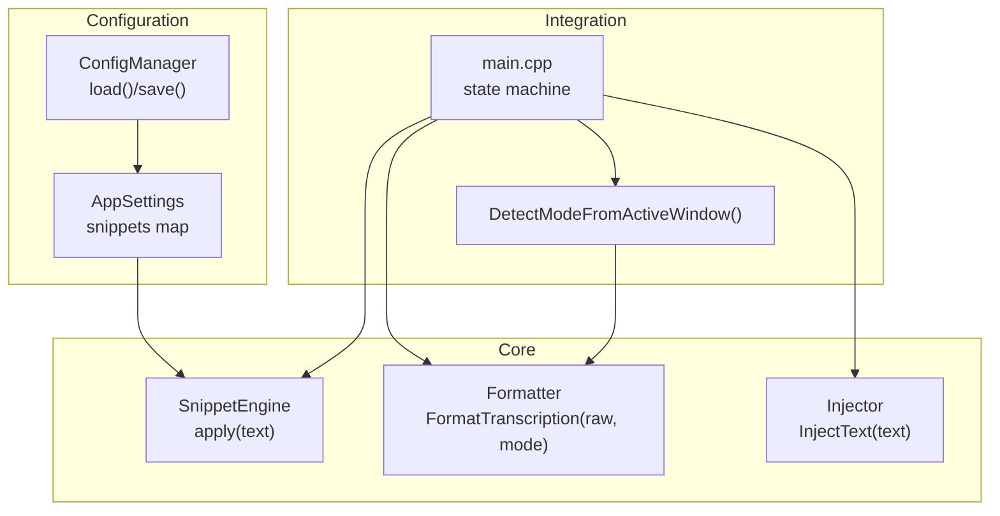
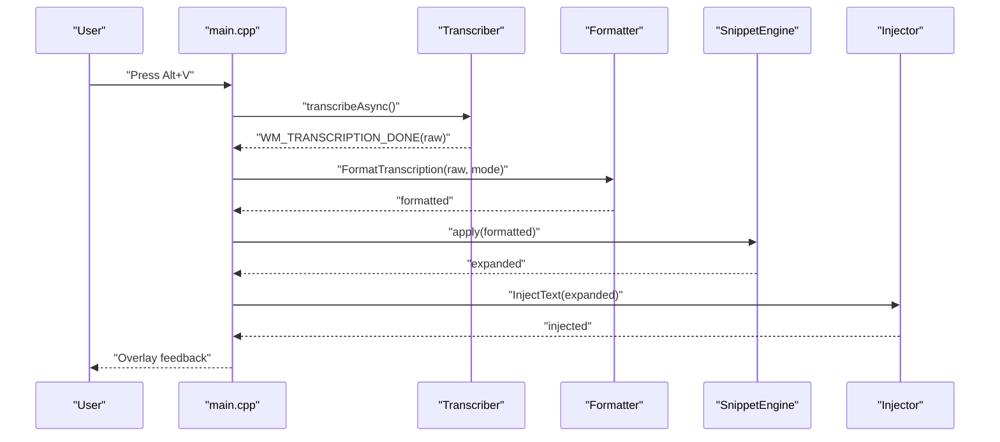
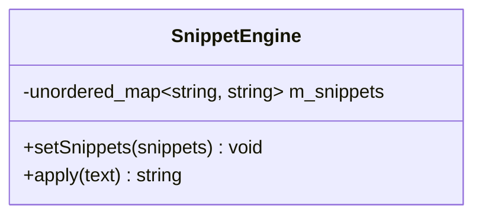
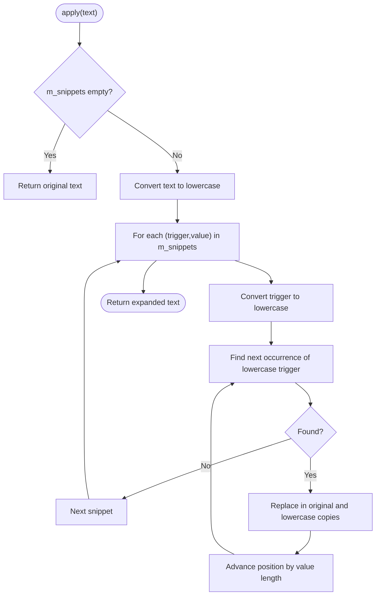
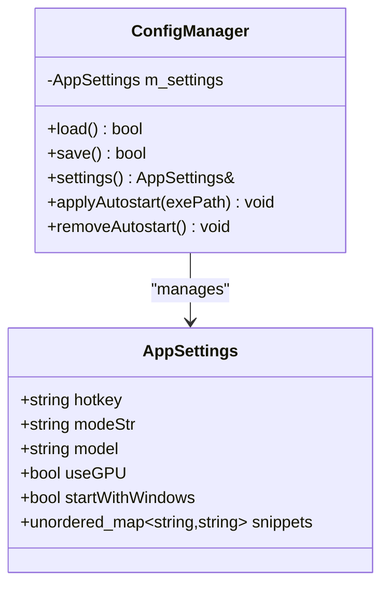
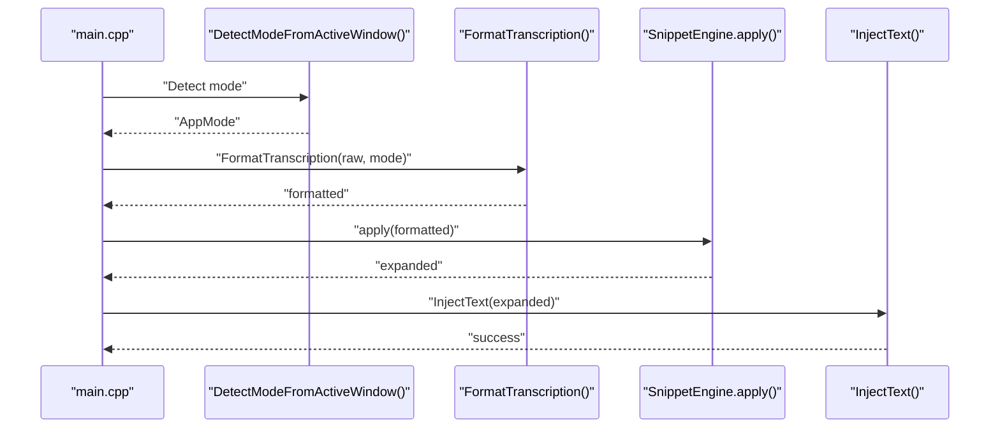
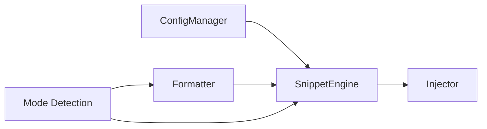

# Snippet Engine API

<cite>
**Referenced Files in This Document**
- [snippet_engine.h](file://src/snippet_engine.h)
- [snippet_engine.cpp](file://src/snippet_engine.cpp)
- [formatter.h](file://src/formatter.h)
- [formatter.cpp](file://src/formatter.cpp)
- [injector.h](file://src/injector.h)
- [injector.cpp](file://src/injector.cpp)
- [config_manager.h](file://src/config_manager.h)
- [config_manager.cpp](file://src/config_manager.cpp)
- [main.cpp](file://src/main.cpp)
- [README.md](file://README.md)
</cite>

## Table of Contents
1. [Introduction](#introduction)
2. [Project Structure](#project-structure)
3. [Core Components](#core-components)
4. [Architecture Overview](#architecture-overview)
5. [Detailed Component Analysis](#detailed-component-analysis)
6. [Dependency Analysis](#dependency-analysis)
7. [Performance Considerations](#performance-considerations)
8. [Troubleshooting Guide](#troubleshooting-guide)
9. [Conclusion](#conclusion)
10. [Appendices](#appendices)

## Introduction
This document provides API documentation for the SnippetEngine class interface, focusing on text substitution functionality. It covers trigger management, expansion logic, snippet definition handling, snippet matching algorithms, priority resolution mechanisms, configuration system integration, and integration with the formatter and text injection pipeline. It also documents the snippet lifecycle, performance optimization strategies, method signatures, parameter descriptions, return values, usage examples, and extensibility patterns for adding new snippet types and custom expansion logic.

## Project Structure
The SnippetEngine resides in the core text processing pipeline alongside the formatter and injector. It is configured via the ConfigManager and integrated into the main application state machine.

**Diagram sources**
- [snippet_engine.h](file://src/snippet_engine.h#L7-L19)
- [formatter.h](file://src/formatter.h#L4-L13)
- [injector.h](file://src/injector.h#L4-L8)
- [config_manager.h](file://src/config_manager.h#L8-L19)
- [main.cpp](file://src/main.cpp#L29-L61)
- [snippet_engine.cpp](file://src/snippet_engine.cpp#L35-L81)

**Section sources**
- [README.md](file://README.md#L69-L123)
- [main.cpp](file://src/main.cpp#L409-L415)

## Core Components
- SnippetEngine: Provides case-insensitive word-level text substitution using a map of trigger phrases to expansion values.
- Formatter: Applies four-pass cleaning and optional coding transforms (camelCase, snake_case, ALL_CAPS) based on AppMode.
- Injector: Injects formatted text into the currently focused application using SendInput or clipboard fallback.
- ConfigManager: Loads and persists settings including snippets, with security constraints on snippet values.
- Mode Detection: Determines AppMode (PROSE or CODING) based on the active window process.

**Section sources**
- [snippet_engine.h](file://src/snippet_engine.h#L7-L19)
- [formatter.h](file://src/formatter.h#L4-L13)
- [injector.h](file://src/injector.h#L4-L8)
- [config_manager.h](file://src/config_manager.h#L8-L19)
- [snippet_engine.cpp](file://src/snippet_engine.cpp#L35-L81)

## Architecture Overview
The text processing pipeline integrates the SnippetEngine after transcription and formatting, then injects the result into the active application.

**Diagram sources**
- [main.cpp](file://src/main.cpp#L280-L320)
- [formatter.cpp](file://src/formatter.cpp#L137-L147)
- [snippet_engine.cpp](file://src/snippet_engine.cpp#L6-L28)
- [injector.cpp](file://src/injector.cpp#L49-L74)

## Detailed Component Analysis

### SnippetEngine API
- Class: SnippetEngine
- Purpose: Case-insensitive word-level text substitution engine.
- Key Methods:
  - setSnippets(snippets): Sets the internal snippet map.
  - apply(text): Returns a copy of text with all trigger phrases replaced by their expansion values. Matching is case-insensitive and longest-first.

Implementation highlights:
- Uses an unordered_map<string, string> for O(1) average-case lookups.
- Converts both input text and triggers to lowercase for case-insensitive matching.
- Iterates through all snippets and replaces occurrences using find/replace loops.
- Lowercase replacement string is used to avoid overlapping matches during replacement.

**Diagram sources**
- [snippet_engine.h](file://src/snippet_engine.h#L7-L19)

**Section sources**
- [snippet_engine.h](file://src/snippet_engine.h#L7-L19)
- [snippet_engine.cpp](file://src/snippet_engine.cpp#L6-L28)

### Snippet Matching and Expansion Logic
- Matching Algorithm:
  - Converts the entire input text to lowercase for scanning.
  - For each snippet, converts the trigger to lowercase.
  - Uses find to locate all occurrences of the trigger in the lowercase text.
  - Performs replacement in both original and lowercase copies to avoid overlapping matches.
  - Continues replacing until no more occurrences are found.
- Priority Resolution:
  - The algorithm iterates through all snippets in insertion order of the unordered_map.
  - Since the map does not guarantee ordering, there is no explicit longest-first priority among multiple triggers.
  - The current implementation replaces all occurrences of each trigger before moving to the next, which can lead to later triggers overriding earlier ones if they overlap.

**Diagram sources**
- [snippet_engine.cpp](file://src/snippet_engine.cpp#L6-L28)

**Section sources**
- [snippet_engine.cpp](file://src/snippet_engine.cpp#L6-L28)

### Configuration System for Custom Snippets
- AppSettings:
  - Contains a snippets map of string to string.
  - Defaults include common triggers like email address and todo markers.
- ConfigManager:
  - Loads settings from %APPDATA%\FLOW-ON\settings.json.
  - Saves settings back to disk.
  - Enforces a maximum snippet value length (500 characters) for security.
  - Integrates with the main application by setting snippets into the SnippetEngine instance.

**Diagram sources**
- [config_manager.h](file://src/config_manager.h#L8-L19)
- [config_manager.cpp](file://src/config_manager.cpp#L24-L80)

**Section sources**
- [config_manager.h](file://src/config_manager.h#L8-L19)
- [config_manager.cpp](file://src/config_manager.cpp#L24-L80)

### Integration with Formatter and Text Injection Pipeline
- Mode Detection:
  - DetectModeFromActiveWindow inspects the foreground process path to determine if the active application is a known code editor or terminal.
  - Returns AppMode::CODING for editors like VS Code, Cursor, nvim, Windows Terminal, etc.; otherwise AppMode::PROSE.
- Formatter Integration:
  - After transcription, the system detects the mode and formats the text accordingly.
  - In CODING mode, the formatter applies camelCase, snake_case, and ALL_CAPS transforms.
- SnippetEngine Integration:
  - The formatted text is passed to SnippetEngine.apply to perform substitutions.
- Injector Integration:
  - The expanded text is injected into the focused application using InjectText, which prefers SendInput for short strings and falls back to clipboard for longer strings or those containing surrogate pairs.

**Diagram sources**
- [main.cpp](file://src/main.cpp#L300-L320)
- [snippet_engine.cpp](file://src/snippet_engine.cpp#L35-L81)
- [formatter.cpp](file://src/formatter.cpp#L137-L147)
- [injector.cpp](file://src/injector.cpp#L49-L74)

**Section sources**
- [main.cpp](file://src/main.cpp#L300-L320)
- [snippet_engine.cpp](file://src/snippet_engine.cpp#L35-L81)
- [formatter.cpp](file://src/formatter.cpp#L137-L147)
- [injector.cpp](file://src/injector.cpp#L49-L74)

### Method Signatures, Parameters, and Return Values
- SnippetEngine::setSnippets
  - Parameters: const unordered_map<string, string>& snippets
  - Returns: void
  - Description: Assigns the internal snippet map used for expansions.
- SnippetEngine::apply
  - Parameters: const string& text
  - Returns: string (copy of text with expansions applied)
  - Description: Performs case-insensitive word-level replacements using the internal snippet map.
- DetectModeFromActiveWindow
  - Parameters: none
  - Returns: AppMode (PROSE or CODING)
  - Description: Determines application mode based on the active window’s process path.
- FormatTranscription
  - Parameters: const string& raw, AppMode mode
  - Returns: string (formatted text)
  - Description: Applies four-pass cleaning and optional coding transforms.
- InjectText
  - Parameters: const wstring& text
  - Returns: void
  - Description: Injects text into the focused application using SendInput or clipboard fallback.

**Section sources**
- [snippet_engine.h](file://src/snippet_engine.h#L9-L15)
- [snippet_engine.cpp](file://src/snippet_engine.cpp#L35-L81)
- [formatter.h](file://src/formatter.h#L13)
- [injector.h](file://src/injector.h#L8)

### Usage Examples
- Loading and applying snippets:
  - Load settings from ConfigManager.
  - Call SnippetEngine.setSnippets(settings.snippets).
  - After formatting, call SnippetEngine.apply(formatted) to expand text.
- Mode-aware formatting and injection:
  - Determine AppMode via DetectModeFromActiveWindow or settings.
  - Format text with FormatTranscription(raw, mode).
  - Expand snippets with SnippetEngine.apply(formatted).
  - Inject the result with InjectText(expanded).

**Section sources**
- [main.cpp](file://src/main.cpp#L409-L415)
- [main.cpp](file://src/main.cpp#L300-L320)

### Extensibility Patterns
- Adding New Snippet Types:
  - Extend AppSettings.snippets to include new trigger/value pairs.
  - Ensure values are within the enforced length limit.
- Custom Expansion Logic:
  - The current implementation performs simple find-and-replace. To add custom expansion logic, subclass SnippetEngine or introduce a plugin interface that allows registering custom expansion handlers keyed by trigger patterns or categories.
- Priority Resolution:
  - To implement longest-first or custom priority, modify the iteration order or introduce a priority queue of triggers sorted by length or custom weight before performing replacements.
- Mode-Specific Expansions:
  - Introduce mode-aware snippet maps or categories within the snippets map to enable different expansions for PROSE and CODING modes.

**Section sources**
- [config_manager.h](file://src/config_manager.h#L8-L19)
- [config_manager.cpp](file://src/config_manager.cpp#L43-L51)
- [snippet_engine.cpp](file://src/snippet_engine.cpp#L6-L28)

## Dependency Analysis
- SnippetEngine depends on:
  - STL containers for storage and transformations.
  - No external dependencies beyond standard headers.
- Integration points:
  - ConfigManager supplies snippet definitions.
  - Formatter provides pre-expanded text with mode-appropriate transforms.
  - Injector consumes the final expanded text.
  - Mode detection influences formatting and subsequent snippet behavior.

**Diagram sources**
- [config_manager.cpp](file://src/config_manager.cpp#L24-L80)
- [snippet_engine.cpp](file://src/snippet_engine.cpp#L6-L28)
- [formatter.cpp](file://src/formatter.cpp#L137-L147)
- [injector.cpp](file://src/injector.cpp#L49-L74)
- [snippet_engine.cpp](file://src/snippet_engine.cpp#L35-L81)

**Section sources**
- [main.cpp](file://src/main.cpp#L409-L415)
- [main.cpp](file://src/main.cpp#L300-L320)

## Performance Considerations
- Time Complexity:
  - Current implementation: O(T * N * M) where T is the number of snippets, N is the length of the text, and M is the average number of occurrences per snippet. This is due to repeated find/replace operations.
- Space Complexity:
  - O(N + S) where N is the length of the text and S is the total size of snippet values.
- Optimization Strategies:
  - Precompute lowercase keys and indices for triggers to reduce repeated conversions.
  - Use a trie or Aho-Corasick automaton for multi-pattern matching to achieve linear time complexity relative to input length.
  - Implement longest-first priority by sorting triggers by descending length before replacement.
  - Batch replacements to minimize string reallocations.
  - Limit snippet value sizes and enforce maximum lengths at load time (already enforced by ConfigManager).
- Threading:
  - SnippetEngine.apply is a pure function and can be safely invoked on the main thread after formatting and before injection.

[No sources needed since this section provides general guidance]

## Troubleshooting Guide
- Snippets not expanding:
  - Verify snippets are loaded via ConfigManager and set into SnippetEngine.
  - Ensure triggers are present in the formatted text (case-insensitive matching).
- Overlapping expansions:
  - The current algorithm replaces all occurrences of each trigger before moving to the next. If multiple triggers overlap, later triggers may override earlier ones. Consider implementing longest-first priority.
- Mode detection issues:
  - If the active window process path does not match known code editors, the system falls back to PROSE mode. Confirm the process name is included in the detection list.
- Injection failures:
  - For long strings or text containing surrogate pairs, the injector falls back to clipboard. If injection does not occur, check clipboard permissions and target application compatibility.

**Section sources**
- [config_manager.cpp](file://src/config_manager.cpp#L43-L51)
- [snippet_engine.cpp](file://src/snippet_engine.cpp#L6-L28)
- [snippet_engine.cpp](file://src/snippet_engine.cpp#L35-L81)
- [injector.cpp](file://src/injector.cpp#L49-L74)

## Conclusion
The SnippetEngine provides a straightforward, case-insensitive text substitution mechanism integrated into the transcription pipeline. While the current implementation is efficient for small snippet sets, performance can be improved with advanced matching algorithms and priority handling. The configuration system enables easy customization of snippet definitions, and integration with the formatter and injector completes the voice-to-text workflow.

[No sources needed since this section summarizes without analyzing specific files]

## Appendices

### API Reference Summary
- SnippetEngine
  - setSnippets(snippets): Assign snippet map.
  - apply(text): Return text with expansions applied.
- DetectModeFromActiveWindow(): Return AppMode.
- FormatTranscription(raw, mode): Return formatted text.
- InjectText(text): Inject text into focused application.

**Section sources**
- [snippet_engine.h](file://src/snippet_engine.h#L9-L15)
- [formatter.h](file://src/formatter.h#L13)
- [injector.h](file://src/injector.h#L8)