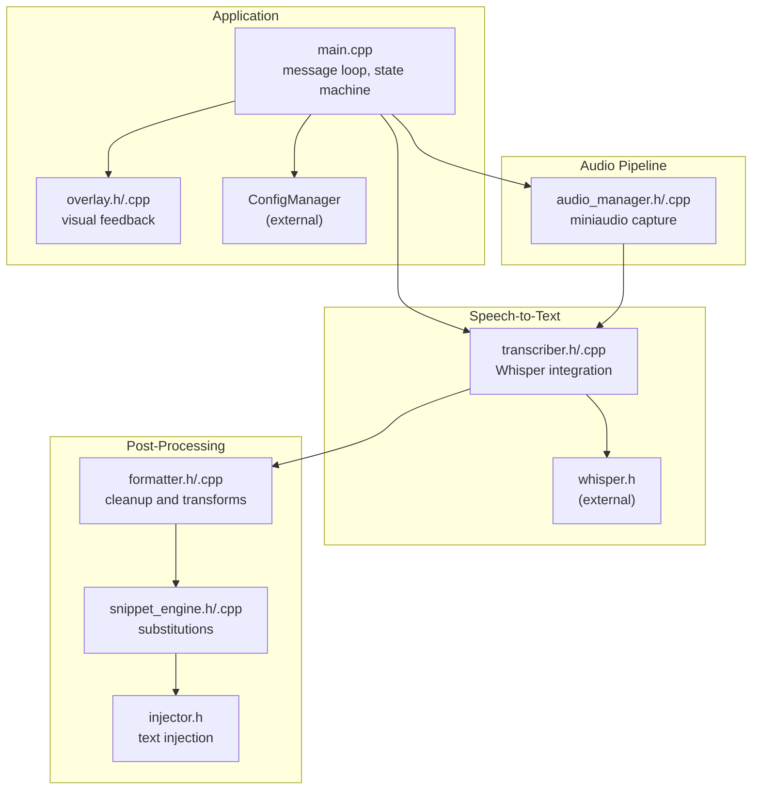
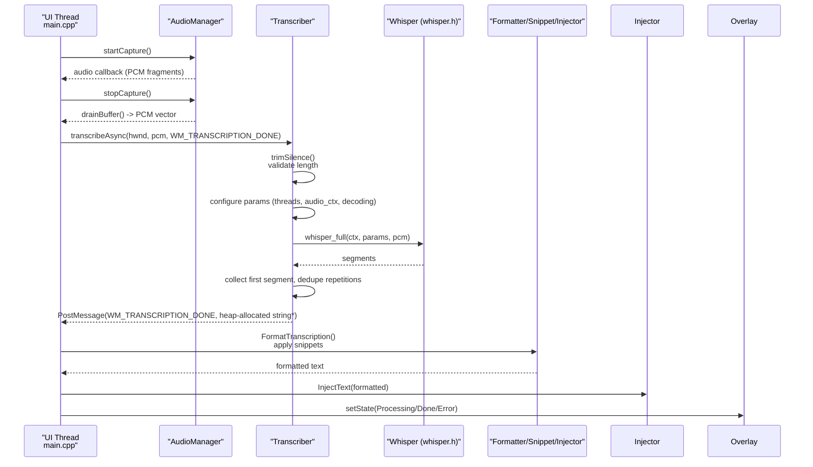
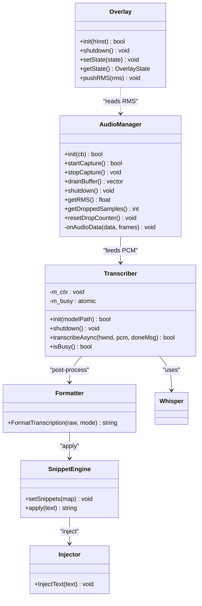

# Transcriber API

<cite>
**Referenced Files in This Document**
- [transcriber.h](file://src/transcriber.h)
- [transcriber.cpp](file://src/transcriber.cpp)
- [audio_manager.h](file://src/audio_manager.h)
- [audio_manager.cpp](file://src/audio_manager.cpp)
- [main.cpp](file://src/main.cpp)
- [overlay.h](file://src/overlay.h)
- [overlay.cpp](file://src/overlay.cpp)
- [formatter.h](file://src/formatter.h)
- [formatter.cpp](file://src/formatter.cpp)
- [snippet_engine.h](file://src/snippet_engine.h)
- [snippet_engine.cpp](file://src/snippet_engine.cpp)
- [injector.h](file://src/injector.h)
</cite>

## Table of Contents
1. [Introduction](#introduction)
2. [Project Structure](#project-structure)
3. [Core Components](#core-components)
4. [Architecture Overview](#architecture-overview)
5. [Detailed Component Analysis](#detailed-component-analysis)
6. [Dependency Analysis](#dependency-analysis)
7. [Performance Considerations](#performance-considerations)
8. [Troubleshooting Guide](#troubleshooting-guide)
9. [Conclusion](#conclusion)
10. [Appendices](#appendices)

## Introduction
This document describes the Transcriber class API and its integration with the rest of the system. It covers model loading, GPU acceleration, asynchronous transcription, audio pipeline integration, configuration options, error handling, and performance tuning. It also explains the transcription workflow, callback mechanism, threading considerations, and memory management strategies used for real-time transcription.

## Project Structure
The Transcriber sits at the center of the transcription pipeline, coordinating audio capture, preprocessing, inference, post-processing, and text injection. The surrounding subsystems include the audio manager, overlay, formatter, snippet engine, and injector.

**Diagram sources**
- [main.cpp](file://src/main.cpp#L149-L357)
- [audio_manager.h](file://src/audio_manager.h#L9-L42)
- [audio_manager.cpp](file://src/audio_manager.cpp#L58-L122)
- [transcriber.h](file://src/transcriber.h#L10-L28)
- [transcriber.cpp](file://src/transcriber.cpp#L79-L226)
- [overlay.h](file://src/overlay.h#L18-L94)
- [overlay.cpp](file://src/overlay.cpp#L29-L158)
- [formatter.h](file://src/formatter.h#L4-L14)
- [formatter.cpp](file://src/formatter.cpp#L137-L148)
- [snippet_engine.h](file://src/snippet_engine.h#L7-L26)
- [snippet_engine.cpp](file://src/snippet_engine.cpp#L6-L28)
- [injector.h](file://src/injector.h#L4-L8)

**Section sources**
- [main.cpp](file://src/main.cpp#L149-L357)
- [transcriber.h](file://src/transcriber.h#L10-L28)
- [transcriber.cpp](file://src/transcriber.cpp#L79-L226)
- [audio_manager.h](file://src/audio_manager.h#L9-L42)
- [audio_manager.cpp](file://src/audio_manager.cpp#L58-L122)
- [overlay.h](file://src/overlay.h#L18-L94)
- [overlay.cpp](file://src/overlay.cpp#L29-L158)
- [formatter.h](file://src/formatter.h#L4-L14)
- [formatter.cpp](file://src/formatter.cpp#L137-L148)
- [snippet_engine.h](file://src/snippet_engine.h#L7-L26)
- [snippet_engine.cpp](file://src/snippet_engine.cpp#L6-L28)
- [injector.h](file://src/injector.h#L4-L8)

## Core Components
- Transcriber: Initializes Whisper, manages GPU/CPU fallback, performs asynchronous transcription, and posts results back to the UI thread.
- AudioManager: Captures 16 kHz mono PCM via miniaudio, maintains a lock-free ring buffer, and exposes RMS and drop counters.
- Formatter: Cleans up raw transcription text and applies mode-specific transforms.
- SnippetEngine: Applies user-configured word-level substitutions.
- Injector: Injects formatted text into the active application.
- Overlay: Provides visual feedback during recording and processing.

**Section sources**
- [transcriber.h](file://src/transcriber.h#L10-L28)
- [transcriber.cpp](file://src/transcriber.cpp#L79-L226)
- [audio_manager.h](file://src/audio_manager.h#L9-L42)
- [audio_manager.cpp](file://src/audio_manager.cpp#L58-L122)
- [formatter.h](file://src/formatter.h#L4-L14)
- [formatter.cpp](file://src/formatter.cpp#L137-L148)
- [snippet_engine.h](file://src/snippet_engine.h#L7-L26)
- [snippet_engine.cpp](file://src/snippet_engine.cpp#L6-L28)
- [injector.h](file://src/injector.h#L4-L8)
- [overlay.h](file://src/overlay.h#L18-L94)
- [overlay.cpp](file://src/overlay.cpp#L29-L158)

## Architecture Overview
The system uses a message-driven architecture with a dedicated UI thread. Audio is captured asynchronously, then handed off to the Transcriber for inference. Results are posted back to the UI thread, processed, injected, and visualized.

**Diagram sources**
- [main.cpp](file://src/main.cpp#L244-L342)
- [transcriber.cpp](file://src/transcriber.cpp#L103-L226)
- [audio_manager.cpp](file://src/audio_manager.cpp#L83-L111)
- [formatter.cpp](file://src/formatter.cpp#L137-L148)
- [snippet_engine.cpp](file://src/snippet_engine.cpp#L6-L28)
- [injector.h](file://src/injector.h#L4-L8)
- [overlay.h](file://src/overlay.h#L18-L94)

## Detailed Component Analysis

### Transcriber API Reference
- Purpose: Initialize Whisper model, manage GPU/CPU fallback, run non-blocking transcription, and report results via Windows messages.
- Threading: Uses a worker thread for inference; the public API is thread-safe for single-flight control; callbacks occur on the UI thread.

Public interface summary:
- Method: init(modelPath)
  - Description: Initializes Whisper with GPU enabled first, falling back to CPU silently.
  - Parameters:
    - modelPath: const char* to model file (relative to current working directory or absolute).
  - Returns: bool indicating success.
  - Notes: On failure, the caller should handle UI messaging and model availability.
  - Section sources
    - [transcriber.h](file://src/transcriber.h#L12-L14)
    - [transcriber.cpp](file://src/transcriber.cpp#L79-L93)

- Method: shutdown()
  - Description: Frees Whisper context.
  - Parameters: none.
  - Returns: void.
  - Section sources
    - [transcriber.h](file://src/transcriber.h#L15)
    - [transcriber.cpp](file://src/transcriber.cpp#L95-L101)

- Method: transcribeAsync(hwnd, pcm, doneMsg)
  - Description: Starts asynchronous transcription. Prevents re-entry using an atomic flag. Trims silence, validates minimum length, configures decoding parameters, runs inference, collects the first segment, removes repetitions, and posts a heap-allocated string to the UI thread.
  - Parameters:
    - hwnd: HWND to receive the completion message.
    - pcm: std::vector<float> containing mono PCM at 16 kHz.
    - doneMsg: UINT identifying the message to post upon completion.
  - Returns: bool indicating whether transcription was accepted (false if already busy).
  - Notes:
    - The receiver must delete the heap-allocated std::string* passed in lParam.
    - If pcm is empty or too short, a sentinel empty string is posted.
  - Section sources
    - [transcriber.h](file://src/transcriber.h#L17-L21)
    - [transcriber.cpp](file://src/transcriber.cpp#L103-L226)

- Method: isBusy()
  - Description: Returns true if transcription is currently in progress.
  - Parameters: none.
  - Returns: bool.
  - Section sources
    - [transcriber.h](file://src/transcriber.h#L23)
    - [transcriber.cpp](file://src/transcriber.cpp#L107-L109)

- Private members:
  - m_ctx: Opaque Whisper context pointer.
  - m_busy: Atomic flag guarding single-flight.
  - Section sources
    - [transcriber.h](file://src/transcriber.h#L26-L27)

Implementation highlights:
- GPU/CPU fallback:
  - Attempts initialization with GPU enabled; if it fails, retries with GPU disabled.
  - Section sources
    - [transcriber.cpp](file://src/transcriber.cpp#L81-L91)

- Asynchronous transcription:
  - Uses compare-and-swap to ensure single-flight.
  - Validates PCM length and posts a sentinel result if invalid.
  - Section sources
    - [transcriber.cpp](file://src/transcriber.cpp#L105-L117)

- Preprocessing:
  - trimSilence: Removes leading/trailing silence below a threshold and adds a small guard window.
  - Section sources
    - [transcriber.cpp](file://src/transcriber.cpp#L53-L77)

- Decoding configuration:
  - Greedy decoding with single best candidate.
  - Adaptive audio context sized by duration.
  - Suppress blanks and non-speech tokens.
  - Limits maximum tokens for short dictation.
  - Section sources
    - [transcriber.cpp](file://src/transcriber.cpp#L138-L182)

- Result collection and safety:
  - Collects only the first segment; logs unexpected multiple segments.
  - removeRepetitions: Detects and collapses repeated units to mitigate greedy-loop hallucinations.
  - Section sources
    - [transcriber.cpp](file://src/transcriber.cpp#L186-L216)

- Callback posting:
  - Posts WM_TRANSCRIPTION_DONE with a heap-allocated std::string*; the receiver deletes it.
  - Section sources
    - [transcriber.h](file://src/transcriber.h#L7-L8)
    - [transcriber.cpp](file://src/transcriber.cpp#L220-L221)

Usage example (conceptual):
- Initialize Transcriber with a model path.
- Start audio capture and stop to drain PCM.
- Call transcribeAsync with the UI window handle and a custom message ID.
- In the UI message handler, read the result string, delete the lParam payload, and proceed with formatting and injection.

**Section sources**
- [transcriber.h](file://src/transcriber.h#L10-L28)
- [transcriber.cpp](file://src/transcriber.cpp#L53-L226)

### Audio Manager Integration
- Purpose: Captures 16 kHz mono PCM via miniaudio, maintains a lock-free ring buffer, and exposes RMS and drop counters.
- Integration with Transcriber:
  - The UI thread calls drainBuffer() after stopping capture to obtain the recorded PCM.
  - The Transcriber receives PCM and runs inference on a worker thread.
- Key behaviors:
  - Ring buffer capacity supports up to 30 seconds at 16 kHz.
  - Drops are tracked and surfaced to the UI.
  - RMS is computed per callback and stored atomically for overlay rendering.
- Section sources
  - [audio_manager.h](file://src/audio_manager.h#L9-L42)
  - [audio_manager.cpp](file://src/audio_manager.cpp#L58-L122)
  - [main.cpp](file://src/main.cpp#L244-L274)

### Post-Processing and Injection
- Formatter:
  - Four-pass cleanup: global fillers, sentence-start fillers, whitespace/capitalization, punctuation.
  - Optional coding transforms (camel/snake/all caps) when in code mode.
  - Section sources
    - [formatter.h](file://src/formatter.h#L4-L14)
    - [formatter.cpp](file://src/formatter.cpp#L137-L148)

- Snippet Engine:
  - Case-insensitive word-level substitutions, longest-first replacement.
  - Section sources
    - [snippet_engine.h](file://src/snippet_engine.h#L7-L26)
    - [snippet_engine.cpp](file://src/snippet_engine.cpp#L6-L28)

- Injector:
  - Injects text into the active application; uses per-character input for short text or clipboard paste for longer text.
  - Must be called from the UI thread.
  - Section sources
    - [injector.h](file://src/injector.h#L4-L8)

### Overlay Feedback
- Provides visual states: Hidden, Recording, Processing, Done, Error.
- Pushes RMS updates from the audio thread; UI thread animates the overlay.
- Section sources
  - [overlay.h](file://src/overlay.h#L18-L94)
  - [overlay.cpp](file://src/overlay.cpp#L29-L158)

## Dependency Analysis

**Diagram sources**
- [transcriber.h](file://src/transcriber.h#L10-L28)
- [transcriber.cpp](file://src/transcriber.cpp#L79-L226)
- [audio_manager.h](file://src/audio_manager.h#L9-L42)
- [audio_manager.cpp](file://src/audio_manager.cpp#L58-L122)
- [overlay.h](file://src/overlay.h#L18-L94)
- [overlay.cpp](file://src/overlay.cpp#L29-L158)
- [formatter.h](file://src/formatter.h#L4-L14)
- [formatter.cpp](file://src/formatter.cpp#L137-L148)
- [snippet_engine.h](file://src/snippet_engine.h#L7-L26)
- [snippet_engine.cpp](file://src/snippet_engine.cpp#L6-L28)
- [injector.h](file://src/injector.h#L4-L8)

**Section sources**
- [transcriber.h](file://src/transcriber.h#L10-L28)
- [transcriber.cpp](file://src/transcriber.cpp#L79-L226)
- [audio_manager.h](file://src/audio_manager.h#L9-L42)
- [audio_manager.cpp](file://src/audio_manager.cpp#L58-L122)
- [overlay.h](file://src/overlay.h#L18-L94)
- [overlay.cpp](file://src/overlay.cpp#L29-L158)
- [formatter.h](file://src/formatter.h#L4-L14)
- [formatter.cpp](file://src/formatter.cpp#L137-L148)
- [snippet_engine.h](file://src/snippet_engine.h#L7-L26)
- [snippet_engine.cpp](file://src/snippet_engine.cpp#L6-L28)
- [injector.h](file://src/injector.h#L4-L8)

## Performance Considerations
- GPU acceleration:
  - Enabled by default; falls back to CPU silently on failure.
  - Section sources
    - [transcriber.cpp](file://src/transcriber.cpp#L81-L91)

- Decoding optimizations:
  - Greedy decoding with single best candidate reduces latency.
  - Temperature and entropy thresholds enable fallback sampling when repetition is detected.
  - Section sources
    - [transcriber.cpp](file://src/transcriber.cpp#L165-L171)

- Audio context scaling:
  - audio_ctx increases with recording duration to balance accuracy and speed.
  - Section sources
    - [transcriber.cpp](file://src/transcriber.cpp#L158-L163)

- Thread allocation:
  - Reserves one hardware thread for UI/OS; uses remaining threads for Whisper.
  - Section sources
    - [transcriber.cpp](file://src/transcriber.cpp#L140-L142)

- Memory management:
  - PCM buffer zeroed before freeing to avoid sensitive data lingering in memory.
  - Section sources
    - [main.cpp](file://src/main.cpp#L507-L512)

- Real-time constraints:
  - Miniaudio period size tuned to 100 ms chunks.
  - Lock-free ring buffer prevents blocking audio callbacks.
  - Section sources
    - [audio_manager.cpp](file://src/audio_manager.cpp#L66-L72)
    - [audio_manager.cpp](file://src/audio_manager.cpp#L22)

## Troubleshooting Guide
- Model not found:
  - The application expects a specific model file in the models directory. If initialization fails, the UI displays an error with download instructions.
  - Section sources
    - [main.cpp](file://src/main.cpp#L462-L475)

- Transcription busy:
  - If transcribeAsync returns false, the previous transcription is still in progress. The UI resets to idle and informs the user.
  - Section sources
    - [main.cpp](file://src/main.cpp#L266-L272)

- Too short or corrupted audio:
  - The UI gates on minimum length and drop count. If insufficient, it shows an error and resets.
  - Section sources
    - [main.cpp](file://src/main.cpp#L250-L264)

- Duplicate completion messages:
  - The UI guards against duplicates within a short interval and logs a debug message.
  - Section sources
    - [main.cpp](file://src/main.cpp#L280-L291)

- Whisper bug mitigation:
  - If multiple segments are returned unexpectedly, the code logs a message and uses the first segment.
  - Section sources
    - [transcriber.cpp](file://src/transcriber.cpp#L195-L207)

- Callback ownership:
  - The Transcriber heap-allocates the result string and posts it to the UI thread; the UI must delete it to avoid leaks.
  - Section sources
    - [transcriber.h](file://src/transcriber.h#L7-L8)
    - [transcriber.cpp](file://src/transcriber.cpp#L220-L221)

**Section sources**
- [main.cpp](file://src/main.cpp#L250-L272)
- [main.cpp](file://src/main.cpp#L280-L291)
- [transcriber.cpp](file://src/transcriber.cpp#L195-L207)
- [transcriber.h](file://src/transcriber.h#L7-L8)

## Conclusion
The Transcriber API provides a concise, high-throughput interface for real-time speech-to-text. It integrates seamlessly with the audio pipeline, applies performance-focused decoding strategies, and delivers robust error handling and visual feedback. By combining GPU acceleration, adaptive context sizing, and careful memory management, it achieves responsive transcription suitable for interactive scenarios.

## Appendices

### API Method Signatures and Descriptions
- init(modelPath)
  - Initializes Whisper with GPU enabled, falling back to CPU on failure.
  - Returns success/failure.
  - Section sources
    - [transcriber.h](file://src/transcriber.h#L12-L14)
    - [transcriber.cpp](file://src/transcriber.cpp#L79-L93)

- shutdown()
  - Frees the Whisper context.
  - Section sources
    - [transcriber.h](file://src/transcriber.h#L15)
    - [transcriber.cpp](file://src/transcriber.cpp#L95-L101)

- transcribeAsync(hwnd, pcm, doneMsg)
  - Starts non-blocking transcription; returns false if already busy.
  - Posts WM_TRANSCRIPTION_DONE with a heap-allocated result string.
  - Section sources
    - [transcriber.h](file://src/transcriber.h#L17-L21)
    - [transcriber.cpp](file://src/transcriber.cpp#L103-L226)

- isBusy()
  - Indicates whether transcription is in progress.
  - Section sources
    - [transcriber.h](file://src/transcriber.h#L23)

### Configuration Options
- Model selection:
  - The application constructs a model path relative to the executable directory and loads a specific English model by default.
  - Section sources
    - [main.cpp](file://src/main.cpp#L133-L144)

- Language and translation:
  - Default language is set to English; translation is disabled.
  - Section sources
    - [transcriber.cpp](file://src/transcriber.cpp#L144-L145)

- Performance tuning parameters:
  - Threads: hardware concurrency minus one.
  - Audio context: scales with duration.
  - Decoding: greedy best-of-1 with fallback sampling thresholds.
  - Suppression: blank and non-speech token suppression.
  - Maximum tokens: capped for short dictation.
  - Section sources
    - [transcriber.cpp](file://src/transcriber.cpp#L140-L182)

### Threading and Memory Management
- Threading:
  - Worker thread runs inference; UI thread handles audio callbacks and message processing.
  - Section sources
    - [transcriber.cpp](file://src/transcriber.cpp#L119-L222)
    - [audio_manager.cpp](file://src/audio_manager.cpp#L39-L56)

- Memory:
  - PCM buffer zeroed before freeing.
  - Heap-allocated result string ownership transferred to UI thread.
  - Section sources
    - [main.cpp](file://src/main.cpp#L507-L512)
    - [transcriber.h](file://src/transcriber.h#L7-L8)
    - [transcriber.cpp](file://src/transcriber.cpp#L220-L221)

### Data Flow Patterns
- Audio capture to inference:
  - Miniaudio captures PCM; UI drains buffer; Transcriber trims and validates; Whisper runs inference; result posted back.
  - Section sources
    - [audio_manager.cpp](file://src/audio_manager.cpp#L83-L111)
    - [main.cpp](file://src/main.cpp#L244-L274)
    - [transcriber.cpp](file://src/transcriber.cpp#L125-L133)
    - [transcriber.cpp](file://src/transcriber.cpp#L186-L216)

- Post-processing and injection:
  - Formatter cleans and transforms; SnippetEngine applies substitutions; Injector inserts into active application.
  - Section sources
    - [formatter.cpp](file://src/formatter.cpp#L137-L148)
    - [snippet_engine.cpp](file://src/snippet_engine.cpp#L6-L28)
    - [injector.h](file://src/injector.h#L4-L8)