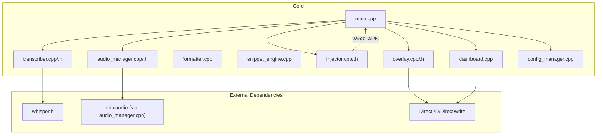
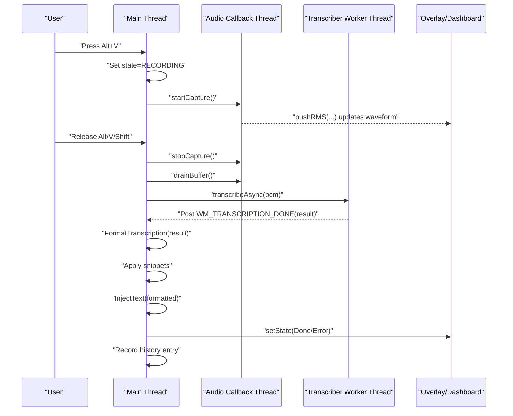
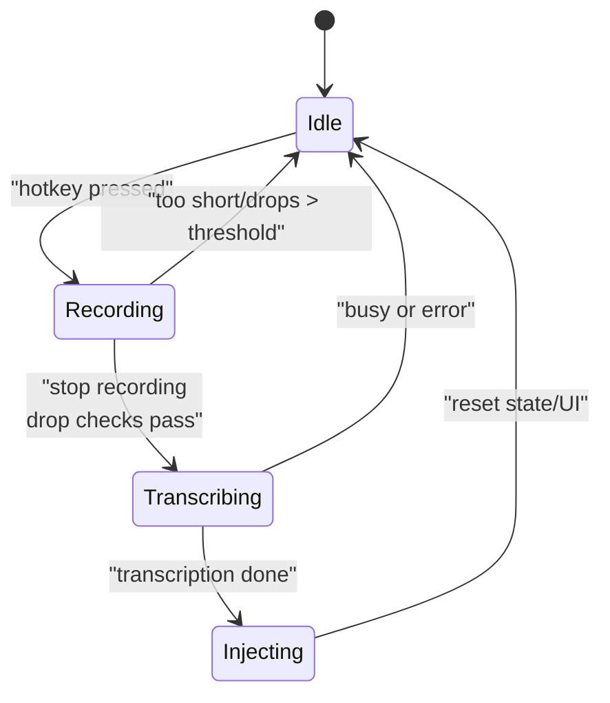
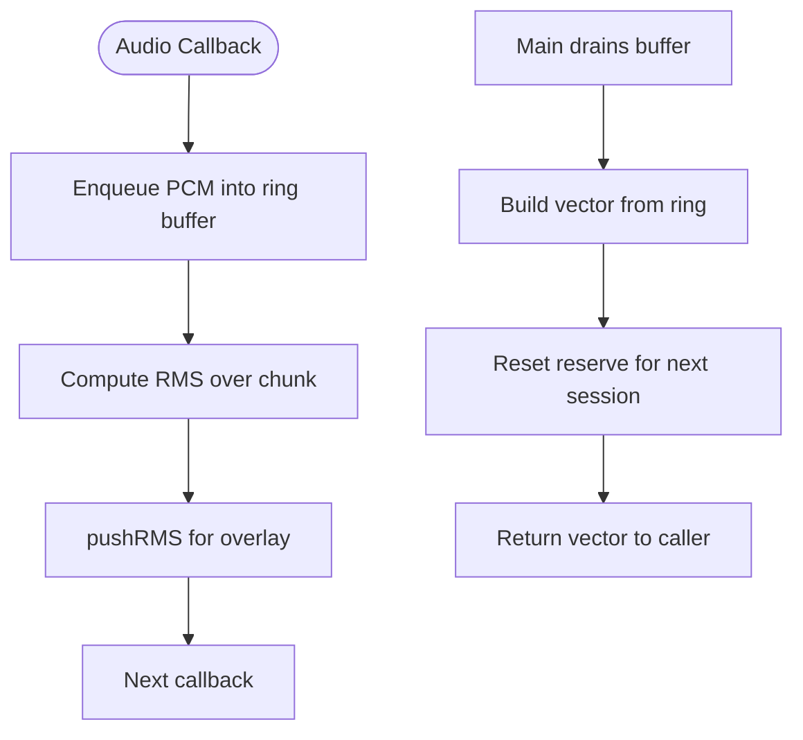
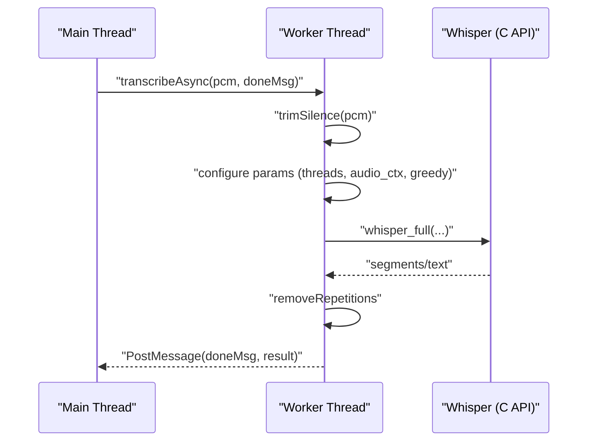
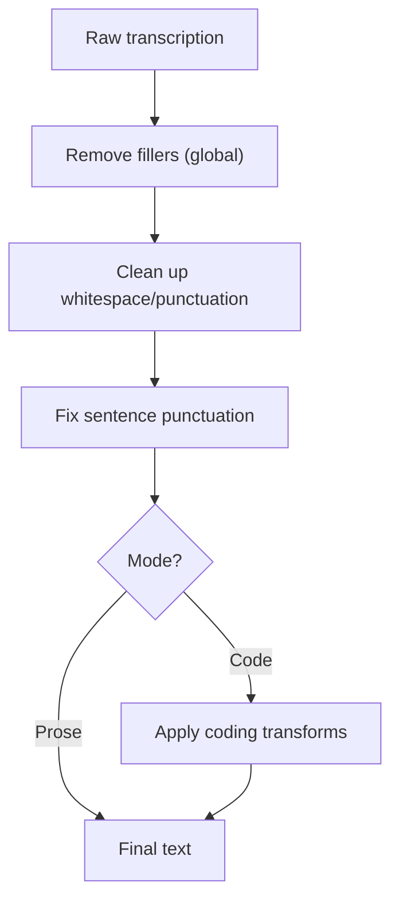
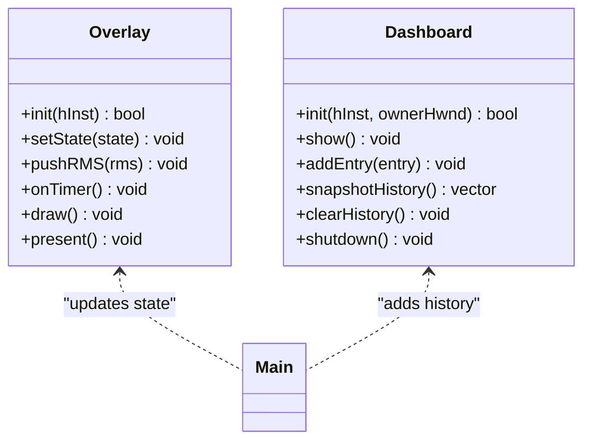
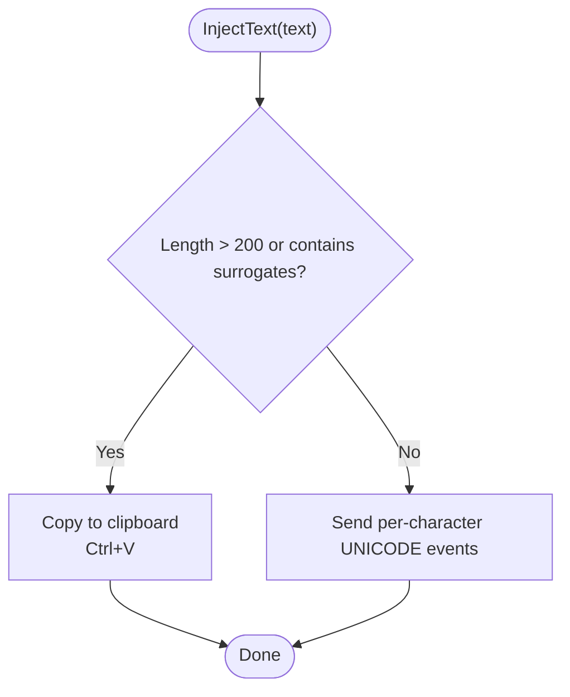
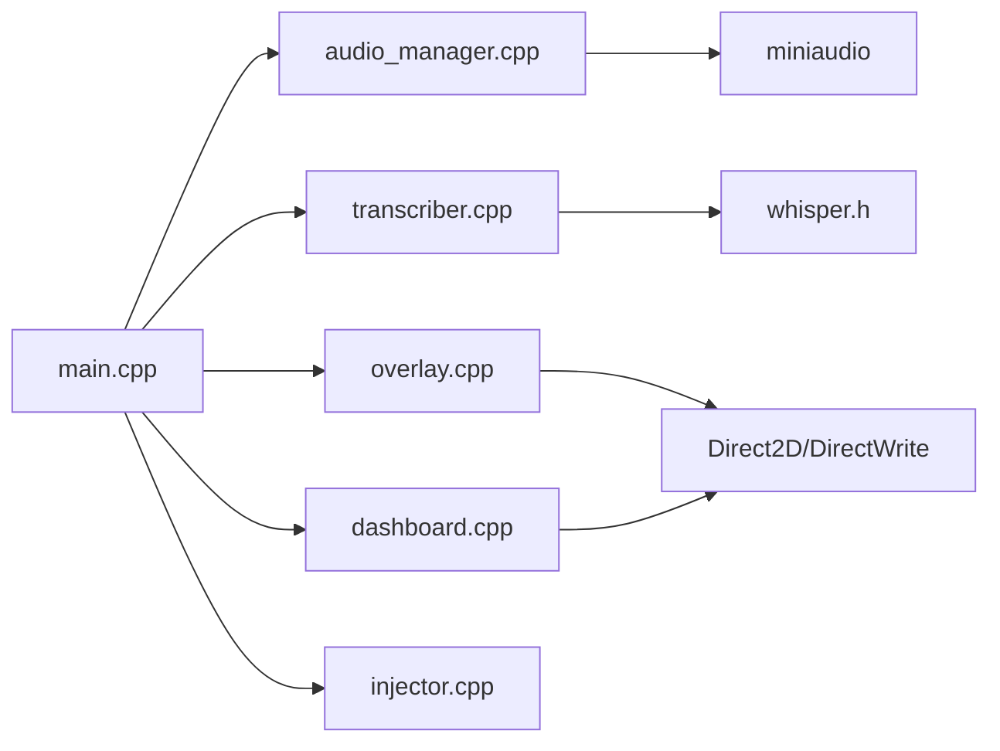

# Architecture Overview

<cite>
**Referenced Files in This Document**
- [main.cpp](file://src/main.cpp)
- [audio_manager.cpp](file://src/audio_manager.cpp)
- [audio_manager.h](file://src/audio_manager.h)
- [transcriber.cpp](file://src/transcriber.cpp)
- [transcriber.h](file://src/transcriber.h)
- [formatter.cpp](file://src/formatter.cpp)
- [injector.cpp](file://src/injector.cpp)
- [injector.h](file://src/injector.h)
- [overlay.cpp](file://src/overlay.cpp)
- [overlay.h](file://src/overlay.h)
- [dashboard.cpp](file://src/dashboard.cpp)
- [snippet_engine.cpp](file://src/snippet_engine.cpp)
- [config_manager.cpp](file://src/config_manager.cpp)
- [whisper.h](file://external/whisper.cpp/include/whisper.h)
</cite>

## Table of Contents
1. [Introduction](#introduction)
2. [Project Structure](#project-structure)
3. [Core Components](#core-components)
4. [Architecture Overview](#architecture-overview)
5. [Detailed Component Analysis](#detailed-component-analysis)
6. [Dependency Analysis](#dependency-analysis)
7. [Performance Considerations](#performance-considerations)
8. [Troubleshooting Guide](#troubleshooting-guide)
9. [Conclusion](#conclusion)

## Introduction
This document describes the Flow-On system architecture, focusing on the integration of audio capture, AI transcription, visual feedback, and text injection. It explains the finite state machine governing recording, transcription, and injection phases, the thread model separating audio capture, AI processing, UI rendering, and text injection, and the data flow from audio input through PCM capture, buffer management, asynchronous Whisper processing, text formatting, and final text injection. Architectural patterns such as Observer for event-driven communication, Factory for component initialization, and Command for thread-safe operations are highlighted. System boundaries and external dependencies (whisper.cpp, miniaudio, Direct2D/DirectWrite) are documented, along with cross-cutting concerns including performance optimization, memory management, and error handling.

## Project Structure
The system is organized around a small set of core modules:
- Entry point and orchestration: main.cpp
- Audio pipeline: audio_manager.cpp/.h
- AI transcription: transcriber.cpp/.h, whisper.h
- Visual feedback: overlay.cpp/.h, dashboard.cpp
- Text formatting and expansion: formatter.cpp, snippet_engine.cpp
- Text injection: injector.cpp/.h
- Configuration: config_manager.cpp

**Diagram sources**
- [main.cpp](file://src/main.cpp#L362-L520)
- [audio_manager.cpp](file://src/audio_manager.cpp#L58-L121)
- [transcriber.cpp](file://src/transcriber.cpp#L79-L225)
- [overlay.cpp](file://src/overlay.cpp#L29-L74)
- [dashboard.cpp](file://src/dashboard.cpp#L394-L453)
- [config_manager.cpp](file://src/config_manager.cpp#L24-L107)
- [injector.cpp](file://src/injector.cpp#L49-L74)
- [whisper.h](file://external/whisper.cpp/include/whisper.h#L48-L78)

**Section sources**
- [main.cpp](file://src/main.cpp#L362-L520)
- [audio_manager.cpp](file://src/audio_manager.cpp#L58-L121)
- [transcriber.cpp](file://src/transcriber.cpp#L79-L225)
- [overlay.cpp](file://src/overlay.cpp#L29-L74)
- [dashboard.cpp](file://src/dashboard.cpp#L394-L453)
- [config_manager.cpp](file://src/config_manager.cpp#L24-L107)
- [injector.cpp](file://src/injector.cpp#L49-L74)
- [whisper.h](file://external/whisper.cpp/include/whisper.h#L48-L78)

## Core Components
- Application state and message loop: Orchestrates hotkey handling, recording lifecycle, transcription handoff, and UI updates.
- Audio Manager: Captures 16 kHz mono PCM via miniaudio, maintains a lock-free ring buffer, computes RMS, and exposes a drain buffer operation.
- Transcriber: Initializes Whisper (GPU-first, CPU fallback), trims silence, configures decoding parameters for throughput, runs inference on a worker thread, and posts completion to the main thread.
- Formatter: Applies four-pass transformations to clean and normalize raw transcription text.
- Snippet Engine: Expands user-defined triggers into richer text.
- Overlay: Real-time Direct2D overlay with layered window compositing and animated states.
- Dashboard: Modern Direct2D history viewer with animations and persistence.
- Injector: Thread-safe text injection into the active application using either SendInput or clipboard paste.
- Config Manager: Loads/saves settings and manages autostart registry entries.

**Section sources**
- [main.cpp](file://src/main.cpp#L67-L128)
- [audio_manager.h](file://src/audio_manager.h#L9-L41)
- [transcriber.h](file://src/transcriber.h#L10-L28)
- [overlay.h](file://src/overlay.h#L18-L93)
- [dashboard.cpp](file://src/dashboard.cpp#L394-L453)
- [injector.h](file://src/injector.h#L4-L8)
- [config_manager.cpp](file://src/config_manager.cpp#L24-L107)

## Architecture Overview
The system follows a message-pump architecture with explicit separation of concerns:
- Main thread: message loop, UI, hotkey handling, state transitions, and posting work to worker threads.
- Audio callback thread: miniaudio invokes a callback that writes PCM samples into a lock-free ring buffer and updates RMS for the overlay.
- Worker thread: runs Whisper transcription asynchronously and posts completion to the main thread.
- Rendering threads: Overlay and Dashboard render on timers; Overlay uses a layered window with Direct2D; Dashboard uses a DC render target and timer-based animation.
- Injection thread: text injection occurs on the main thread to ensure proper focus and keyboard input semantics.

**Diagram sources**
- [main.cpp](file://src/main.cpp#L185-L341)
- [audio_manager.cpp](file://src/audio_manager.cpp#L83-L111)
- [transcriber.cpp](file://src/transcriber.cpp#L103-L225)
- [overlay.cpp](file://src/overlay.cpp#L140-L158)
- [dashboard.cpp](file://src/dashboard.cpp#L197-L206)
- [injector.cpp](file://src/injector.cpp#L49-L74)

## Detailed Component Analysis

### Finite State Machine Pattern
The application enforces a strict state machine to coordinate recording, transcription, and injection:
- States: Idle, Recording, Transcribing, Injecting
- Transitions:
  - Idle → Recording on hotkey press
  - Recording → Transcribing on hotkey release (with drop checks)
  - Transcribing → Injecting on successful transcription
  - Injecting → Idle after injection and UI reset
- Atomic state variables and single-flight guards prevent race conditions.

**Diagram sources**
- [main.cpp](file://src/main.cpp#L67-L128)
- [main.cpp](file://src/main.cpp#L244-L274)
- [main.cpp](file://src/main.cpp#L280-L341)

**Section sources**
- [main.cpp](file://src/main.cpp#L67-L128)
- [main.cpp](file://src/main.cpp#L244-L274)
- [main.cpp](file://src/main.cpp#L280-L341)

### Audio Pipeline and Buffer Management
- Initialization: Opens a 16 kHz mono device with a 100 ms period via miniaudio.
- Capture: Audio callback enqueues PCM samples into a lock-free ring buffer and updates RMS.
- Drain: Main thread drains the ring buffer into a vector for transcription.
- Drop detection: Tracks dropped samples to gate invalid transcriptions.

**Diagram sources**
- [audio_manager.cpp](file://src/audio_manager.cpp#L39-L56)
- [audio_manager.cpp](file://src/audio_manager.cpp#L102-L111)
- [audio_manager.h](file://src/audio_manager.h#L20-L34)

**Section sources**
- [audio_manager.cpp](file://src/audio_manager.cpp#L58-L121)
- [audio_manager.h](file://src/audio_manager.h#L9-L41)

### Asynchronous Whisper Processing
- Initialization: Attempts GPU acceleration; falls back to CPU silently.
- Worker thread: Trims silence, configures greedy decoding parameters, selects audio context size based on duration, and runs inference.
- Completion: Posts result to the main thread; duplicates are guarded against.

**Diagram sources**
- [transcriber.cpp](file://src/transcriber.cpp#L103-L225)
- [whisper.h](file://external/whisper.cpp/include/whisper.h#L48-L78)

**Section sources**
- [transcriber.cpp](file://src/transcriber.cpp#L79-L225)
- [transcriber.h](file://src/transcriber.h#L10-L28)
- [whisper.h](file://external/whisper.cpp/include/whisper.h#L48-L78)

### Text Formatting and Expansion
- Four-pass formatting: filler removal, cleanup, punctuation normalization, and optional coding transforms.
- Snippet expansion: Case-insensitive replacement of triggers with values, with safety limits.

**Diagram sources**
- [formatter.cpp](file://src/formatter.cpp#L137-L147)
- [snippet_engine.cpp](file://src/snippet_engine.cpp#L6-L28)

**Section sources**
- [formatter.cpp](file://src/formatter.cpp#L137-L147)
- [snippet_engine.cpp](file://src/snippet_engine.cpp#L6-L28)

### Visual Feedback and History
- Overlay: Layered window with Direct2D DC render target; animates recording, processing, done/error states; uses UpdateLayeredWindow for per-pixel alpha compositing.
- Dashboard: Timer-driven Direct2D UI with list animations; persists history and supports clearing.

**Diagram sources**
- [overlay.h](file://src/overlay.h#L18-L93)
- [dashboard.cpp](file://src/dashboard.cpp#L394-L453)
- [main.cpp](file://src/main.cpp#L316-L341)

**Section sources**
- [overlay.cpp](file://src/overlay.cpp#L29-L74)
- [overlay.h](file://src/overlay.h#L18-L93)
- [dashboard.cpp](file://src/dashboard.cpp#L394-L453)

### Text Injection
- Uses SendInput for short, pure BMP text; falls back to clipboard paste for long strings or surrogate-containing text to maximize compatibility.

**Diagram sources**
- [injector.cpp](file://src/injector.cpp#L49-L74)
- [injector.h](file://src/injector.h#L4-L8)

**Section sources**
- [injector.cpp](file://src/injector.cpp#L49-L74)
- [injector.h](file://src/injector.h#L4-L8)

### Configuration and Settings
- Persists settings under AppData; supports hotkey, mode, model path, GPU toggle, autostart, and snippets.
- Applies autostart via registry.

**Section sources**
- [config_manager.cpp](file://src/config_manager.cpp#L24-L107)

## Dependency Analysis
- Internal dependencies:
  - main.cpp depends on audio_manager, transcriber, overlay, dashboard, snippet_engine, config_manager, and injector.
  - transcriber depends on whisper.h (C API).
  - audio_manager depends on miniaudio (implementation included).
  - overlay and dashboard depend on Direct2D/DirectWrite.
- External dependencies:
  - whisper.cpp: C API for speech-to-text.
  - miniaudio: Cross-platform audio capture.
  - Direct2D/DirectWrite: Hardware-accelerated 2D graphics and text.

**Diagram sources**
- [main.cpp](file://src/main.cpp#L19-L26)
- [transcriber.cpp](file://src/transcriber.cpp#L2-L3)
- [audio_manager.cpp](file://src/audio_manager.cpp#L7)
- [overlay.cpp](file://src/overlay.cpp#L10-L15)
- [dashboard.cpp](file://src/dashboard.cpp#L6-L9)
- [whisper.h](file://external/whisper.cpp/include/whisper.h#L48-L78)

**Section sources**
- [main.cpp](file://src/main.cpp#L19-L26)
- [transcriber.cpp](file://src/transcriber.cpp#L2-L3)
- [audio_manager.cpp](file://src/audio_manager.cpp#L7)
- [overlay.cpp](file://src/overlay.cpp#L10-L15)
- [dashboard.cpp](file://src/dashboard.cpp#L6-L9)
- [whisper.h](file://external/whisper.cpp/include/whisper.h#L48-L78)

## Performance Considerations
- Throughput-focused Whisper configuration:
  - Greedy decoding with single candidate reduces runtime.
  - Reduced audio context sizing based on clip duration.
  - Disable timestamps and progress logging to minimize overhead.
  - Reserve one logical core for UI responsiveness.
- Audio pipeline:
  - Lock-free ring buffer avoids contention.
  - Periodic callbacks reduce latency spikes.
  - Silence trimming drastically reduces compute for quiet segments.
- Rendering:
  - Overlay timer-driven (~60 Hz) with easing and minimal redraws.
  - Dashboard uses a timer and off-screen buffer blitting.
- Memory:
  - Pre-allocated buffers and move semantics for PCM vectors.
  - Zeroing PCM buffer on shutdown to mitigate sensitive data exposure.
- GPU/CPU fallback:
  - Automatic GPU initialization with silent CPU fallback.

[No sources needed since this section provides general guidance]

## Troubleshooting Guide
- Microphone access denied:
  - Audio initialization failure dialog suggests checking permissions and device availability.
- Whisper model missing:
  - Failure to load model dialog instructs downloading the expected model file.
- Overlay initialization:
  - Direct2D initialization failure is non-fatal; overlay disabled but app continues.
- Duplicate transcription notifications:
  - Duplicate guard ignores duplicate WM_TRANSCRIPTION_DONE within a short interval.
- Audio dropouts:
  - If too few samples or excessive drops are detected, the system reports an error and resets to Idle.

**Section sources**
- [main.cpp](file://src/main.cpp#L436-L475)
- [main.cpp](file://src/main.cpp#L254-L272)
- [main.cpp](file://src/main.cpp#L280-L292)
- [overlay.cpp](file://src/overlay.cpp#L29-L74)

## Conclusion
Flow-On integrates audio capture, AI transcription, visual feedback, and text injection into a cohesive pipeline. The finite state machine ensures deterministic control flow, while a clear thread model isolates time-critical operations. Event-driven communication via Windows messages coordinates asynchronous tasks, and architectural patterns like Observer, Factory, and Command support modularity and thread safety. External dependencies are encapsulated behind thin interfaces, enabling portability and maintainability. Performance and reliability are prioritized through targeted optimizations and robust error handling.