# Component Interactions

<cite>
**Referenced Files in This Document**
- [main.cpp](file://src/main.cpp)
- [audio_manager.cpp](file://src/audio_manager.cpp)
- [audio_manager.h](file://src/audio_manager.h)
- [transcriber.cpp](file://src/transcriber.cpp)
- [transcriber.h](file://src/transcriber.h)
- [overlay.cpp](file://src/overlay.cpp)
- [overlay.h](file://src/overlay.h)
- [dashboard.cpp](file://src/dashboard.cpp)
- [dashboard.h](file://src/dashboard.h)
- [injector.cpp](file://src/injector.cpp)
- [config_manager.cpp](file://src/config_manager.cpp)
- [config_manager.h](file://src/config_manager.h)
- [snippet_engine.cpp](file://src/snippet_engine.cpp)
- [snippet_engine.h](file://src/snippet_engine.h)
- [formatter.cpp](file://src/formatter.cpp)
- [formatter.h](file://src/formatter.h)
</cite>

## Table of Contents
1. [Introduction](#introduction)
2. [Project Structure](#project-structure)
3. [Core Components](#core-components)
4. [Architecture Overview](#architecture-overview)
5. [Detailed Component Analysis](#detailed-component-analysis)
6. [Dependency Analysis](#dependency-analysis)
7. [Performance Considerations](#performance-considerations)
8. [Troubleshooting Guide](#troubleshooting-guide)
9. [Conclusion](#conclusion)

## Introduction
This document explains the component interaction patterns in Flow-On, focusing on:
- Observer pattern via Windows message handling and event-driven subsystem coordination
- Factory-style initialization and dependency wiring
- Command-like message posting for thread-safe operations and queuing
- The main message loop’s role in delegating to subsystems
- Data flow from audio capture through PCM buffering to asynchronous transcription and injection
- Integration points: audio callbacks, transcriber completion, overlay state synchronization
- Configuration management from UI changes to persistent storage
- Error propagation and failure handling across components

## Project Structure
Flow-On is a Windows desktop application composed of several subsystems initialized and orchestrated from the WinMain entry point. The subsystems include:
- Audio capture and buffering
- Transcription engine
- Overlay UI
- Dashboard UI
- Text injection
- Configuration persistence
- Formatting and snippet expansion

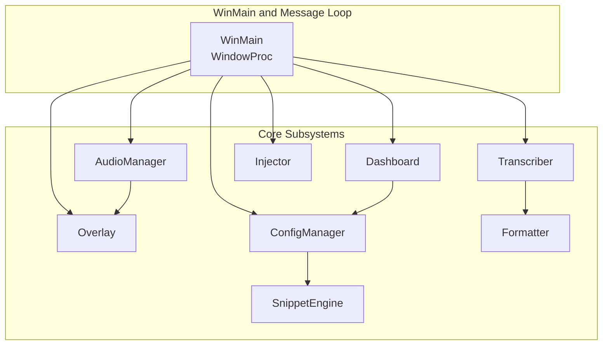

**Diagram sources**
- [main.cpp](file://src/main.cpp#L362-L520)
- [audio_manager.cpp](file://src/audio_manager.cpp#L58-L121)
- [transcriber.cpp](file://src/transcriber.cpp#L79-L225)
- [overlay.cpp](file://src/overlay.cpp#L29-L74)
- [dashboard.cpp](file://src/dashboard.cpp#L394-L453)
- [injector.cpp](file://src/injector.cpp#L49-L74)
- [config_manager.cpp](file://src/config_manager.cpp#L24-L80)
- [snippet_engine.cpp](file://src/snippet_engine.cpp#L6-L28)
- [formatter.cpp](file://src/formatter.cpp#L137-L147)

**Section sources**
- [main.cpp](file://src/main.cpp#L362-L520)

## Core Components
- WindowManager and Message Loop: Owns a hidden window, registers hotkeys, timers, and system tray; coordinates subsystems via application-defined messages.
- AudioManager: Captures 16 kHz mono PCM via miniaudio, enqueues samples into a lock-free ring buffer, computes RMS, and notifies Overlay and optional callbacks.
- Transcriber: Asynchronously runs Whisper inference on a worker thread, posts completion messages back to the main thread, and performs post-processing.
- Overlay: Renders a floating Direct2D overlay synchronized with state transitions and audio RMS.
- Dashboard: Maintains a history of transcriptions and exposes a settings change callback to persist configuration.
- Injector: Injects formatted text into the active application using either Unicode key events or clipboard/Ctrl+V.
- ConfigManager: Loads/saves settings to a JSON file under AppData and manages autostart registry entries.
- SnippetEngine: Applies configurable keyword-to-text expansions.
- Formatter: Applies normalization, punctuation, and code-specific transformations.

**Section sources**
- [main.cpp](file://src/main.cpp#L149-L357)
- [audio_manager.h](file://src/audio_manager.h#L9-L41)
- [transcriber.h](file://src/transcriber.h#L10-L28)
- [overlay.h](file://src/overlay.h#L18-L93)
- [dashboard.h](file://src/dashboard.h#L36-L68)
- [injector.cpp](file://src/injector.cpp#L49-L74)
- [config_manager.h](file://src/config_manager.h#L21-L39)
- [snippet_engine.h](file://src/snippet_engine.h#L7-L19)
- [formatter.cpp](file://src/formatter.cpp#L137-L147)

## Architecture Overview
Flow-On uses a hybrid event/message loop architecture:
- A hidden message-only window owns the tray icon, hotkeys, timers, and subsystems.
- Subsystems are initialized early in WinMain and wired together via lambdas and globals.
- The main message loop dispatches application-defined messages to coordinate state transitions and operations.
- Cross-thread communication occurs via PostMessage with application-defined WM_* messages and heap-allocated payloads.

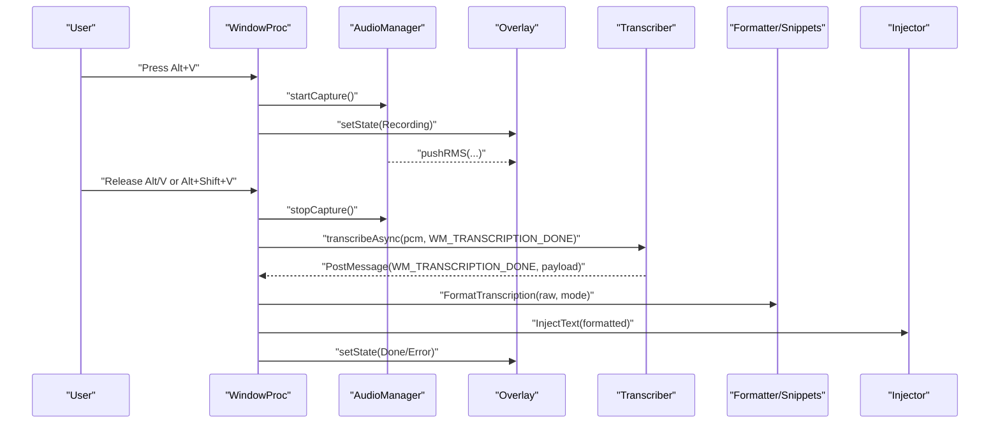

**Diagram sources**
- [main.cpp](file://src/main.cpp#L185-L341)
- [audio_manager.cpp](file://src/audio_manager.cpp#L83-L100)
- [overlay.cpp](file://src/overlay.cpp#L140-L158)
- [transcriber.cpp](file://src/transcriber.cpp#L103-L225)
- [formatter.cpp](file://src/formatter.cpp#L137-L147)
- [injector.cpp](file://src/injector.cpp#L49-L74)

## Detailed Component Analysis

### Observer Pattern via Windows Messages and Event-Driven Coordination
- Overlay subscribes to audio RMS updates via a thread-safe pushRMS method invoked from the audio callback. This is a simple observer relationship: the audio subsystem publishes RMS samples; the overlay consumes them.
- The main message loop acts as a central dispatcher. Subsystems post application-defined messages to communicate:
  - Tray icon interactions, hotkey events, timers, and transcription completion.
- The audio subsystem optionally invokes a callback from the audio thread, enabling decoupled observers.

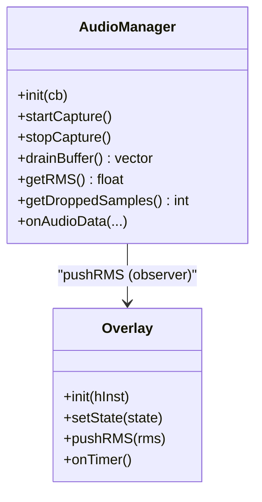

**Diagram sources**
- [audio_manager.h](file://src/audio_manager.h#L9-L41)
- [overlay.h](file://src/overlay.h#L18-L93)
- [audio_manager.cpp](file://src/audio_manager.cpp#L39-L56)
- [overlay.cpp](file://src/overlay.cpp#L160-L163)

**Section sources**
- [audio_manager.cpp](file://src/audio_manager.cpp#L39-L56)
- [overlay.cpp](file://src/overlay.cpp#L160-L163)

### Factory Pattern for Initialization and Dependency Injection
- WinMain initializes subsystems in a deterministic order and wires them together:
  - ConfigManager loads settings and applies autostart.
  - AudioManager initializes the microphone.
  - Overlay initializes Direct2D resources and sets a global pointer for audio callbacks.
  - Transcriber initializes the Whisper model (with GPU fallback).
  - Dashboard initializes UI and registers a settings-change callback that updates ConfigManager and applies changes.
- This resembles a factory pattern where WinMain constructs and wires components, injecting dependencies and callbacks.

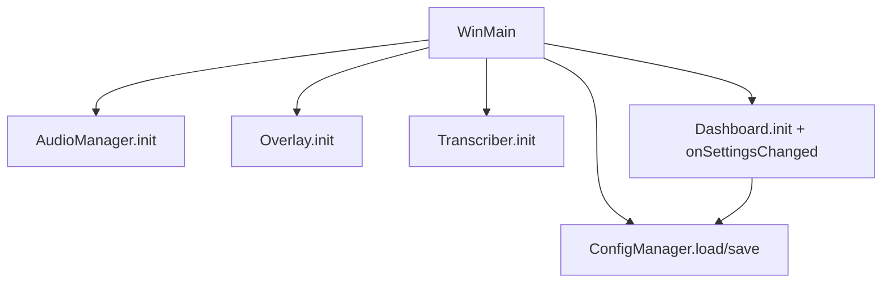

**Diagram sources**
- [main.cpp](file://src/main.cpp#L409-L493)
- [config_manager.cpp](file://src/config_manager.cpp#L24-L80)
- [audio_manager.cpp](file://src/audio_manager.cpp#L58-L81)
- [overlay.cpp](file://src/overlay.cpp#L29-L74)
- [transcriber.cpp](file://src/transcriber.cpp#L79-L93)
- [dashboard.cpp](file://src/dashboard.cpp#L394-L407)

**Section sources**
- [main.cpp](file://src/main.cpp#L409-L493)

### Command Pattern for Thread-Safe Messaging and Operation Queuing
- Transcriber exposes transcribeAsync, which posts a completion message upon finishing. The caller passes the destination window and message, implementing a command-like invocation.
- The main message loop processes these messages, performing formatting, snippet expansion, injection, and UI updates.
- This pattern isolates long-running work (inference) on a worker thread while keeping UI updates and state transitions on the main thread.

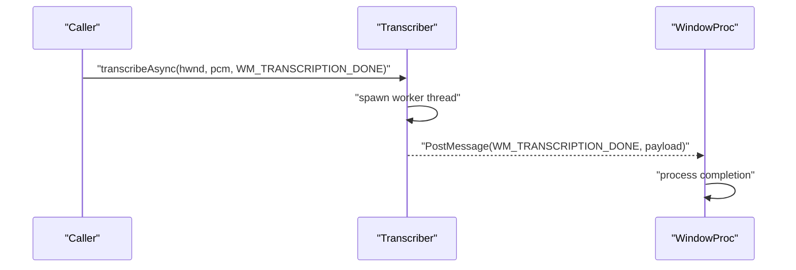

**Diagram sources**
- [transcriber.h](file://src/transcriber.h#L17-L21)
- [transcriber.cpp](file://src/transcriber.cpp#L103-L225)
- [main.cpp](file://src/main.cpp#L244-L274)

**Section sources**
- [transcriber.cpp](file://src/transcriber.cpp#L103-L225)
- [transcriber.h](file://src/transcriber.h#L17-L21)

### Main Message Loop Coordination and WindowProc Delegation
- WindowProc handles:
  - Tray icon and hotkey registration
  - Recording start/stop and timer polling for release detection
  - Starting transcription and processing completion
  - Tray menu actions and dashboard opening
  - Cleanup on destroy
- It delegates to subsystems using atomic state machines and PostMessage to maintain thread safety.

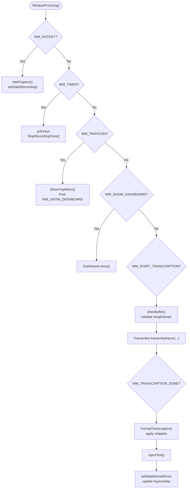

**Diagram sources**
- [main.cpp](file://src/main.cpp#L149-L357)

**Section sources**
- [main.cpp](file://src/main.cpp#L149-L357)

### Data Flow: Audio Capture to Asynchronous Transcription and Injection
- Audio capture:
  - miniaudio captures 16 kHz mono PCM; samples are enqueued into a lock-free ring buffer and drained into a vector for transcription.
  - RMS is computed and pushed to the overlay for visualization.
- Transcription:
  - A worker thread trims silence, configures decoding parameters, runs inference, and posts completion.
- Formatting and injection:
  - The main thread formats the result, applies snippets, detects mode, measures latency, and injects text into the active application.

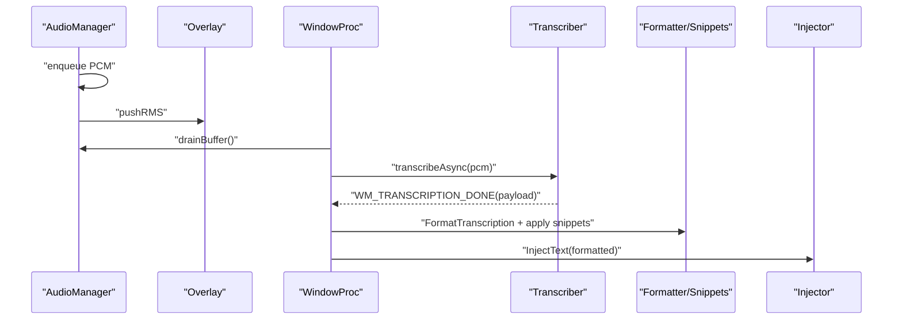

**Diagram sources**
- [audio_manager.cpp](file://src/audio_manager.cpp#L39-L111)
- [overlay.cpp](file://src/overlay.cpp#L160-L163)
- [main.cpp](file://src/main.cpp#L244-L341)
- [transcriber.cpp](file://src/transcriber.cpp#L103-L225)
- [formatter.cpp](file://src/formatter.cpp#L137-L147)
- [injector.cpp](file://src/injector.cpp#L49-L74)

**Section sources**
- [audio_manager.cpp](file://src/audio_manager.cpp#L39-L111)
- [transcriber.cpp](file://src/transcriber.cpp#L103-L225)
- [main.cpp](file://src/main.cpp#L244-L341)

### Integration Points
- Audio Manager callback mechanism:
  - Optional callback invoked from the audio thread; RMS also published via pushRMS for the overlay.
- Transcriber completion notifications:
  - Completion posted back to the owner window with a heap-allocated payload; main thread deletes it.
- Overlay state synchronization:
  - Overlay state updated on hotkey, timer, and completion messages; RMS updates occur independently.

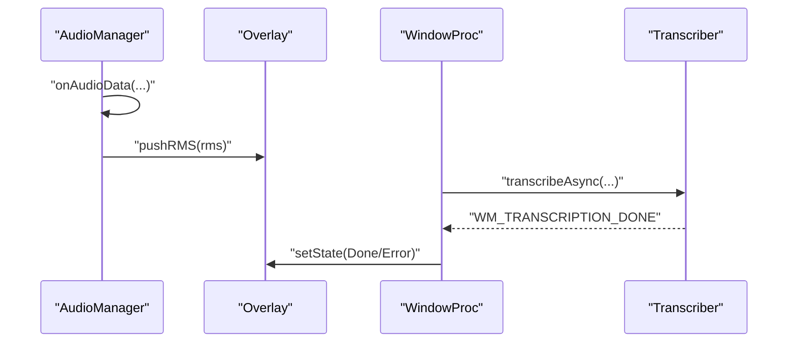

**Diagram sources**
- [audio_manager.cpp](file://src/audio_manager.cpp#L39-L56)
- [overlay.cpp](file://src/overlay.cpp#L140-L158)
- [main.cpp](file://src/main.cpp#L280-L341)
- [transcriber.cpp](file://src/transcriber.cpp#L103-L225)

**Section sources**
- [audio_manager.cpp](file://src/audio_manager.cpp#L39-L56)
- [overlay.cpp](file://src/overlay.cpp#L140-L158)
- [main.cpp](file://src/main.cpp#L280-L341)

### Configuration Management Flow
- Dashboard settings changes are forwarded to ConfigManager via a lambda registered in WinMain.
- ConfigManager persists settings to JSON and applies autostart registry changes.
- On startup, ConfigManager loads settings and applies autostart if enabled.

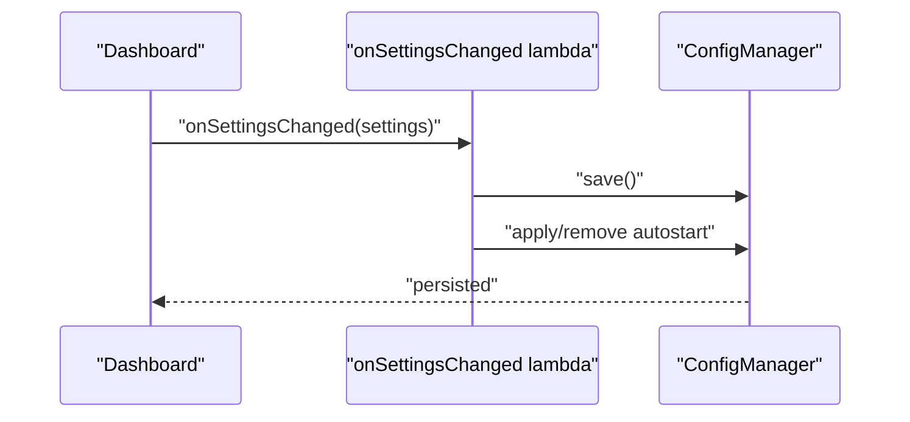

**Diagram sources**
- [dashboard.cpp](file://src/dashboard.cpp#L480-L493)
- [config_manager.cpp](file://src/config_manager.cpp#L60-L80)
- [main.cpp](file://src/main.cpp#L480-L493)

**Section sources**
- [dashboard.cpp](file://src/dashboard.cpp#L480-L493)
- [config_manager.cpp](file://src/config_manager.cpp#L24-L80)
- [main.cpp](file://src/main.cpp#L480-L493)

### Error Propagation Mechanisms
- Audio capture errors:
  - If the recording is too short or has excessive dropped samples, the system sets an error state, resets state, and updates the tray tooltip.
- Transcriber busy state:
  - If the transcriber is already busy, the call is dropped and the system resets to idle with a “busy” tooltip.
- Initialization failures:
  - Audio, overlay, and model initialization failures are handled with user-facing dialogs and graceful shutdown paths.

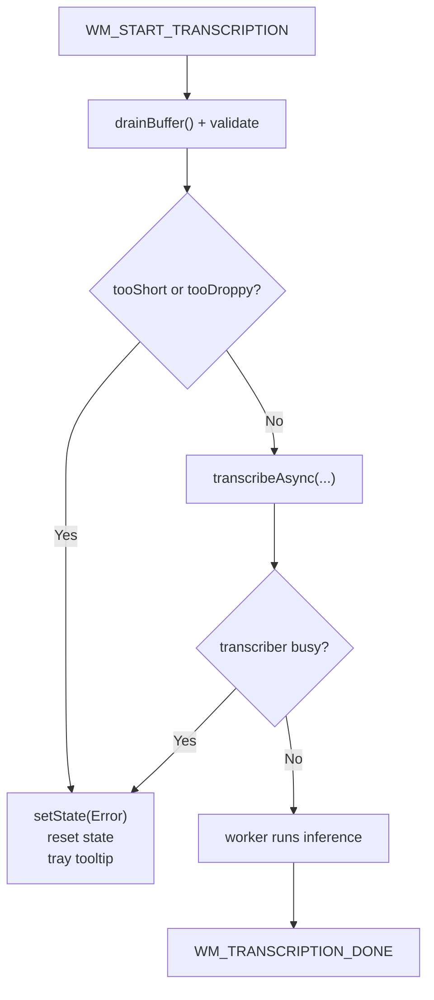

**Diagram sources**
- [main.cpp](file://src/main.cpp#L244-L274)
- [transcriber.cpp](file://src/transcriber.cpp#L103-L117)

**Section sources**
- [main.cpp](file://src/main.cpp#L244-L274)
- [transcriber.cpp](file://src/transcriber.cpp#L103-L117)

## Dependency Analysis
- Coupling:
  - Overlay depends on audio RMS via pushRMS and state via setState.
  - Transcriber depends on Whisper and posts back to the owner window.
  - Dashboard depends on ConfigManager for settings and maintains a history list.
  - Injector depends on the active window and clipboard/keyboard APIs.
- Cohesion:
  - Each subsystem encapsulates a single responsibility: capture, transcribe, render, inject, configure, format, and snippet expansion.
- External dependencies:
  - miniaudio for audio capture
  - Direct2D/DirectWrite for overlay rendering
  - Whisper for transcription
  - Windows APIs for hotkeys, tray, timers, clipboard, and registry

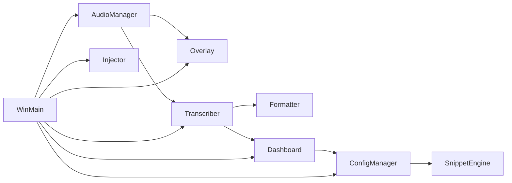

**Diagram sources**
- [main.cpp](file://src/main.cpp#L409-L493)
- [audio_manager.cpp](file://src/audio_manager.cpp#L58-L121)
- [overlay.cpp](file://src/overlay.cpp#L29-L74)
- [transcriber.cpp](file://src/transcriber.cpp#L79-L225)
- [dashboard.cpp](file://src/dashboard.cpp#L394-L453)
- [config_manager.cpp](file://src/config_manager.cpp#L24-L80)
- [snippet_engine.cpp](file://src/snippet_engine.cpp#L6-L28)
- [injector.cpp](file://src/injector.cpp#L49-L74)
- [formatter.cpp](file://src/formatter.cpp#L137-L147)

**Section sources**
- [main.cpp](file://src/main.cpp#L409-L493)

## Performance Considerations
- Lock-free PCM buffering:
  - A lock-free queue reduces contention during audio capture; overflow increments a drop counter.
- Asynchronous transcription:
  - Inference runs on a worker thread; the main thread remains responsive.
- Rendering:
  - Overlay uses a timer-driven animation loop with easing and pre-multiplied alpha compositing.
- Formatting:
  - Regex compilation happens once; formatting is optimized for the hot path.
- Memory:
  - PCM buffers are moved rather than copied; sensitive buffers are zeroed before shutdown.

[No sources needed since this section provides general guidance]

## Troubleshooting Guide
- Microphone access denied:
  - Initialization failure dialog suggests checking privacy settings.
- Overlay initialization:
  - Direct2D initialization failure is non-fatal; overlay continues without rendering.
- Model loading:
  - Whisper model not found dialog provides download instructions.
- Duplicate completion messages:
  - A guard ignores duplicate WM_TRANSCRIPTION_DONE within a short interval and ensures payload deletion to avoid leaks.
- Audio quality issues:
  - Excessive drops or very short recordings are treated as errors; the system resets state and updates the tray tooltip.

**Section sources**
- [main.cpp](file://src/main.cpp#L436-L475)
- [overlay.cpp](file://src/overlay.cpp#L409-L426)
- [transcriber.cpp](file://src/transcriber.cpp#L280-L296)
- [main.cpp](file://src/main.cpp#L254-L272)

## Conclusion
Flow-On orchestrates a set of specialized subsystems around a central message loop and application-defined Windows messages. The design leverages:
- Observer-style callbacks for audio-to-overlay updates
- Factory-style initialization and wiring in WinMain
- Command-like asynchronous invocations for transcription
- Robust error handling and graceful degradation paths
This architecture balances responsiveness, modularity, and reliability across audio capture, transcription, formatting, injection, and UI.