# Data Flow Architecture

<cite>
**Referenced Files in This Document**
- [main.cpp](file://src/main.cpp)
- [audio_manager.cpp](file://src/audio_manager.cpp)
- [audio_manager.h](file://src/audio_manager.h)
- [transcriber.cpp](file://src/transcriber.cpp)
- [transcriber.h](file://src/transcriber.h)
- [formatter.cpp](file://src/formatter.cpp)
- [formatter.h](file://src/formatter.h)
- [injector.cpp](file://src/injector.cpp)
- [injector.h](file://src/injector.h)
- [dashboard.h](file://src/dashboard.h)
- [snippet_engine.cpp](file://src/snippet_engine.cpp)
- [snippet_engine.h](file://src/snippet_engine.h)
- [overlay.h](file://src/overlay.h)
- [config_manager.h](file://src/config_manager.h)
</cite>

## Table of Contents
1. [Introduction](#introduction)
2. [Project Structure](#project-structure)
3. [Core Components](#core-components)
4. [Architecture Overview](#architecture-overview)
5. [Detailed Component Analysis](#detailed-component-analysis)
6. [Dependency Analysis](#dependency-analysis)
7. [Performance Considerations](#performance-considerations)
8. [Troubleshooting Guide](#troubleshooting-guide)
9. [Conclusion](#conclusion)
10. [Appendices](#appendices)

## Introduction
This document describes the end-to-end data flow architecture of Flow-On, from audio capture through PCM buffering, asynchronous Whisper transcription, text formatting and snippet expansion, to final text injection and dashboard history logging. It explains the circular buffer design for audio sample storage, the drain-buffer mechanism for efficient data transfer, the asynchronous transcription pipeline, latency measurement, error handling, memory protection, and dashboard history collection.

## Project Structure
Flow-On is organized around a small set of focused modules:
- Audio capture and buffering: [audio_manager.cpp](file://src/audio_manager.cpp), [audio_manager.h](file://src/audio_manager.h)
- Transcription engine: [transcriber.cpp](file://src/transcriber.cpp), [transcriber.h](file://src/transcriber.h)
- Text formatting and mode detection: [formatter.cpp](file://src/formatter.cpp), [formatter.h](file://src/formatter.h)
- Snippet expansion: [snippet_engine.cpp](file://src/snippet_engine.cpp), [snippet_engine.h](file://src/snippet_engine.h)
- Text injection: [injector.cpp](file://src/injector.cpp), [injector.h](file://src/injector.h)
- Dashboard history: [dashboard.h](file://src/dashboard.h)
- UI overlay: [overlay.h](file://src/overlay.h)
- Configuration: [config_manager.h](file://src/config_manager.h)
- Application entry point and orchestration: [main.cpp](file://src/main.cpp)

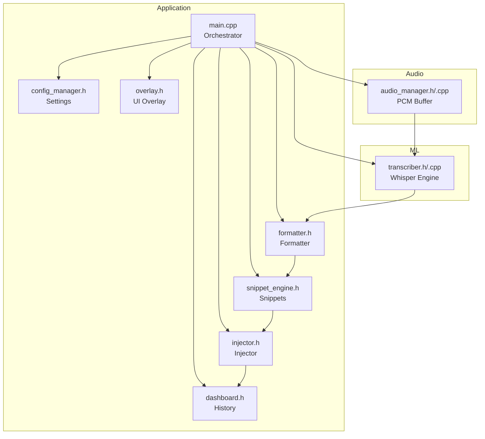

**Diagram sources**
- [main.cpp](file://src/main.cpp#L54-L61)
- [audio_manager.h](file://src/audio_manager.h#L9-L42)
- [transcriber.h](file://src/transcriber.h#L10-L29)
- [formatter.h](file://src/formatter.h#L4-L14)
- [snippet_engine.h](file://src/snippet_engine.h#L7-L26)
- [injector.h](file://src/injector.h#L4-L9)
- [dashboard.h](file://src/dashboard.h#L23-L69)
- [overlay.h](file://src/overlay.h#L11-L94)
- [config_manager.h](file://src/config_manager.h#L8-L39)

**Section sources**
- [main.cpp](file://src/main.cpp#L54-L61)
- [audio_manager.h](file://src/audio_manager.h#L9-L42)
- [transcriber.h](file://src/transcriber.h#L10-L29)
- [formatter.h](file://src/formatter.h#L4-L14)
- [snippet_engine.h](file://src/snippet_engine.h#L7-L26)
- [injector.h](file://src/injector.h#L4-L9)
- [dashboard.h](file://src/dashboard.h#L23-L69)
- [overlay.h](file://src/overlay.h#L11-L94)
- [config_manager.h](file://src/config_manager.h#L8-L39)

## Core Components
- Audio Manager: Captures 16 kHz mono PCM, enqueues samples into a lock-free ring buffer, tracks dropped samples, and drains buffered PCM to the main thread.
- Transcriber: Asynchronously runs Whisper inference on trimmed PCM, applies decoding heuristics, and posts completion to the main thread.
- Formatter: Applies four-pass text cleaning and punctuation normalization; applies coding transforms in code mode.
- Snippet Engine: Performs case-insensitive, longest-first snippet expansion.
- Injector: Injects formatted text into the active application via keyboard events or clipboard paste.
- Dashboard: Stores processed entries with metadata and exposes a thread-safe history API.
- Overlay: Visual feedback for recording, processing, done, and error states.
- Config Manager: Loads and persists user settings including snippets and GPU preferences.

**Section sources**
- [audio_manager.cpp](file://src/audio_manager.cpp#L39-L56)
- [transcriber.cpp](file://src/transcriber.cpp#L103-L225)
- [formatter.cpp](file://src/formatter.cpp#L137-L147)
- [snippet_engine.cpp](file://src/snippet_engine.cpp#L6-L28)
- [injector.cpp](file://src/injector.cpp#L49-L74)
- [dashboard.h](file://src/dashboard.h#L23-L69)
- [overlay.h](file://src/overlay.h#L11-L94)
- [config_manager.h](file://src/config_manager.h#L8-L39)

## Architecture Overview
The system follows a producer-consumer pattern:
- The audio callback runs on a real-time thread and enqueues PCM samples into a lock-free ring buffer.
- On stop, the main thread drains the ring buffer into a vector and initiates asynchronous transcription.
- The transcription worker trims silence, configures Whisper parameters for throughput, runs inference, removes hallucinated repetitions, and posts results back to the main thread.
- The main thread formats text, expands snippets, measures latency, injects text, updates overlay state, and logs to the dashboard.

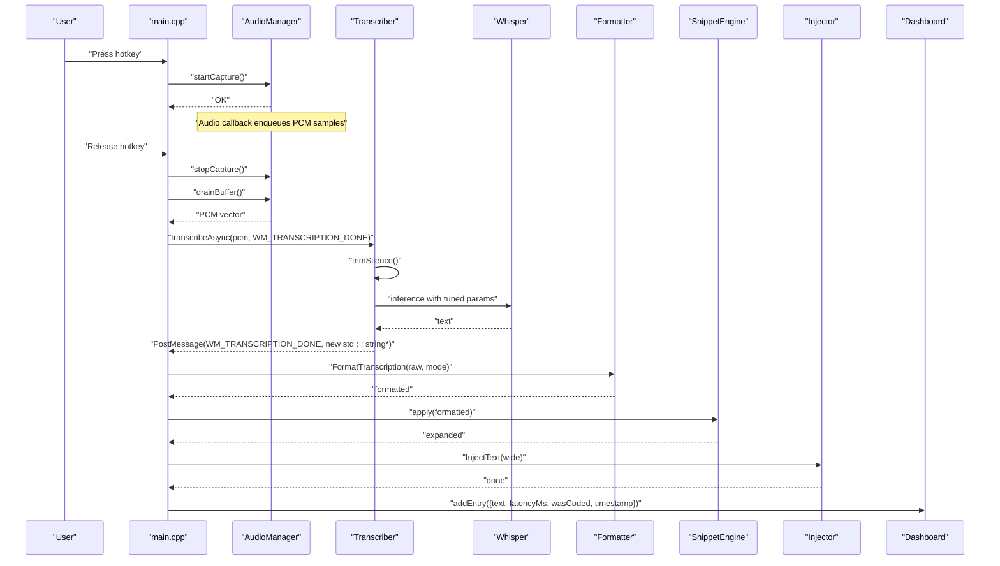

**Diagram sources**
- [main.cpp](file://src/main.cpp#L185-L342)
- [audio_manager.cpp](file://src/audio_manager.cpp#L83-L111)
- [transcriber.cpp](file://src/transcriber.cpp#L103-L225)
- [formatter.cpp](file://src/formatter.cpp#L137-L147)
- [snippet_engine.cpp](file://src/snippet_engine.cpp#L6-L28)
- [injector.cpp](file://src/injector.cpp#L49-L74)
- [dashboard.h](file://src/dashboard.h#L23-L69)

## Detailed Component Analysis

### Audio Capture and Circular Buffer
- Sampling: 16 kHz mono, 32-bit float; configured via miniaudio.
- Buffer: Static lock-free ring buffer sized for 30 seconds of audio at 16 kHz.
- Producer path: Audio callback enqueues samples; increments a dropped counter when enqueue fails.
- Drain path: Main thread drains the ring buffer into a pre-reserved vector and resets capacity for reuse.
- Drop detection: Exposed via a getter; reset after draining.

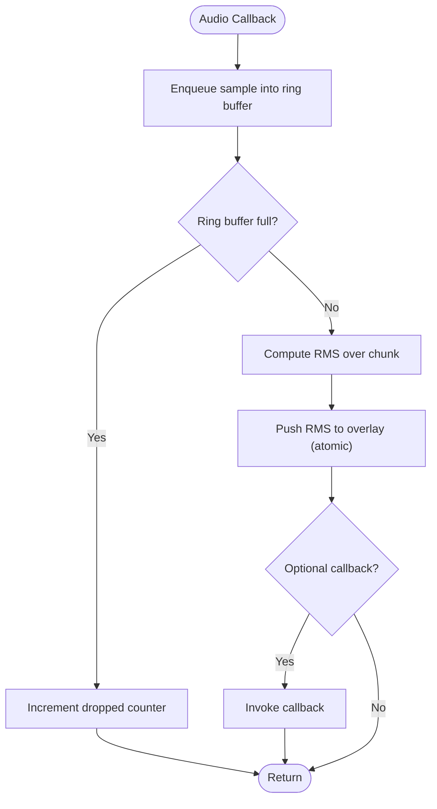

**Diagram sources**
- [audio_manager.cpp](file://src/audio_manager.cpp#L39-L56)

**Section sources**
- [audio_manager.cpp](file://src/audio_manager.cpp#L18-L22)
- [audio_manager.cpp](file://src/audio_manager.cpp#L39-L56)
- [audio_manager.cpp](file://src/audio_manager.cpp#L83-L111)
- [audio_manager.h](file://src/audio_manager.h#L26-L30)

### Drain-Buffer Mechanism
- Purpose: Efficiently transfer ownership of buffered PCM from the audio thread to the main thread without copying large buffers.
- Implementation: Drain loop transfers samples from the ring buffer into a pre-allocated vector; the vector is moved to the caller, and the internal buffer capacity is preserved for subsequent sessions.

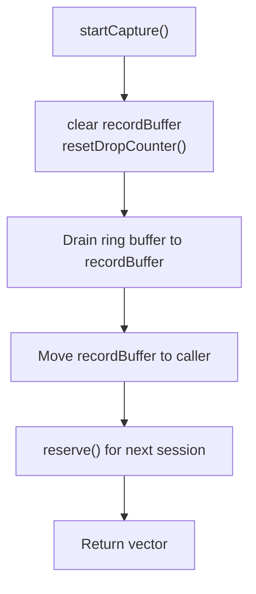

**Diagram sources**
- [audio_manager.cpp](file://src/audio_manager.cpp#L83-L111)

**Section sources**
- [audio_manager.cpp](file://src/audio_manager.cpp#L83-L111)

### Asynchronous Transcription Pipeline
- Single-flight guard prevents overlapping transcription requests.
- Preprocessing: Silence trimming reduces compute and improves quality for short clips.
- Parameter tuning: Greedy decoding, reduced audio context based on duration, single-segment inference, and suppressed blank tokens.
- Inference: Runs on a detached worker thread; upon completion, constructs a result string and posts it back to the main thread.
- Post-processing: Repetition removal and duplicate message filtering.

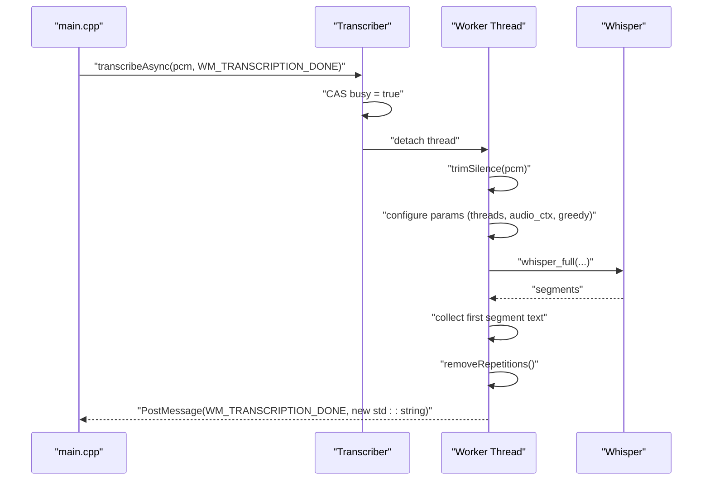

**Diagram sources**
- [transcriber.cpp](file://src/transcriber.cpp#L103-L225)

**Section sources**
- [transcriber.cpp](file://src/transcriber.cpp#L103-L225)
- [transcriber.h](file://src/transcriber.h#L17-L23)

### Text Formatting and Mode Detection
- Mode detection: Automatically selects code vs prose mode based on the active foreground application; falls back to user-configured mode.
- Formatting pipeline:
  1) Strip global fillers (um, uh, etc.).
  2) Strip sentence-start fillers (so, well, etc.) only at sentence boundaries.
  3) Normalize spacing, trim, and remove leading punctuation.
  4) Capitalize first letter and ensure trailing punctuation.
  5) In code mode, apply camel/snake/all caps transforms and strip trailing period for identifiers.

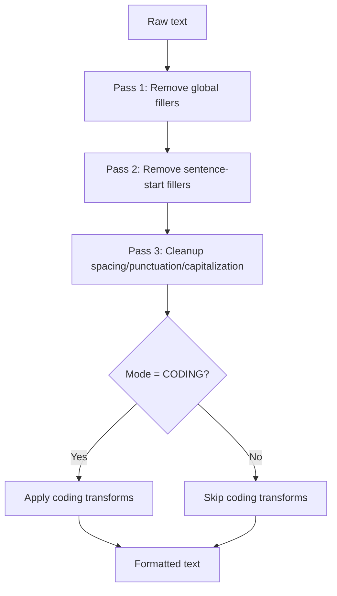

**Diagram sources**
- [formatter.cpp](file://src/formatter.cpp#L137-L147)

**Section sources**
- [formatter.cpp](file://src/formatter.cpp#L137-L147)
- [snippet_engine.cpp](file://src/snippet_engine.cpp#L35-L81)
- [config_manager.h](file://src/config_manager.h#L8-L19)

### Snippet Expansion
- Case-insensitive replacement with longest-first precedence.
- Applied after formatting and before injection.

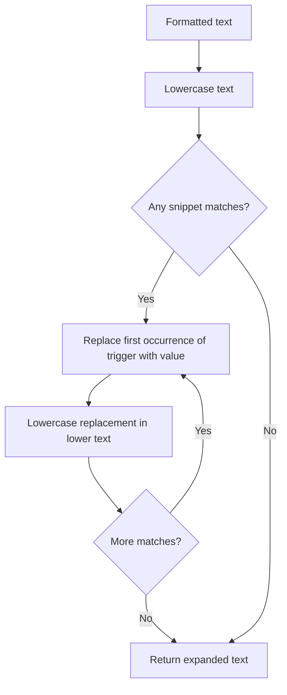

**Diagram sources**
- [snippet_engine.cpp](file://src/snippet_engine.cpp#L6-L28)

**Section sources**
- [snippet_engine.cpp](file://src/snippet_engine.cpp#L6-L28)

### Text Injection
- For short text without surrogate code units, injects via per-character Unicode key events.
- For long text or text containing surrogate pairs, copies to clipboard and simulates Ctrl+V.

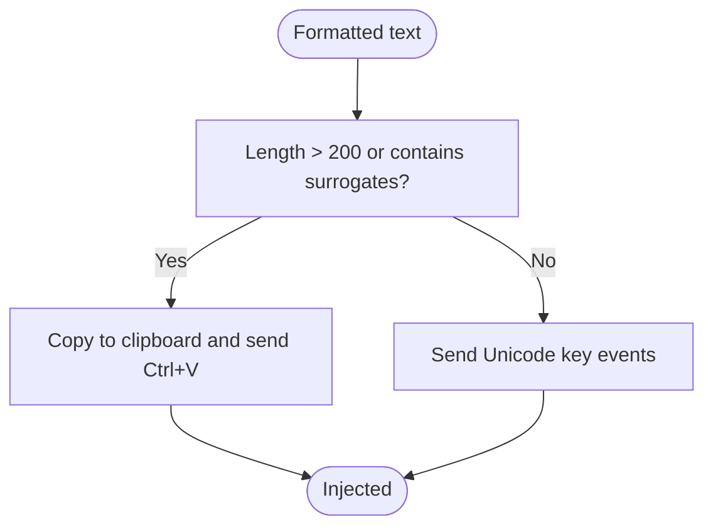

**Diagram sources**
- [injector.cpp](file://src/injector.cpp#L49-L74)

**Section sources**
- [injector.cpp](file://src/injector.cpp#L49-L74)

### Dashboard History Collection
- Each processed entry includes the formatted text, latency in milliseconds, whether code mode was active, and a local timestamp.
- Thread-safe history maintained internally; snapshot and clear APIs exposed.

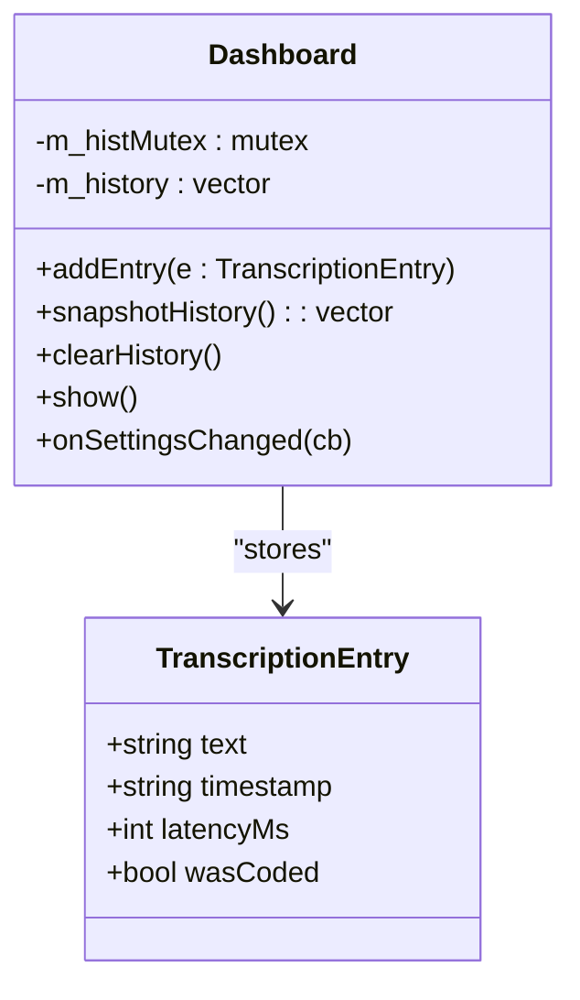

**Diagram sources**
- [dashboard.h](file://src/dashboard.h#L23-L69)

**Section sources**
- [dashboard.h](file://src/dashboard.h#L23-L69)
- [main.cpp](file://src/main.cpp#L326-L338)

### Latency Measurement
- Start time is captured at hotkey press.
- At completion, the difference between current steady clock time and start time yields latency in milliseconds.
- Logged to debug output and stored in the dashboard entry.

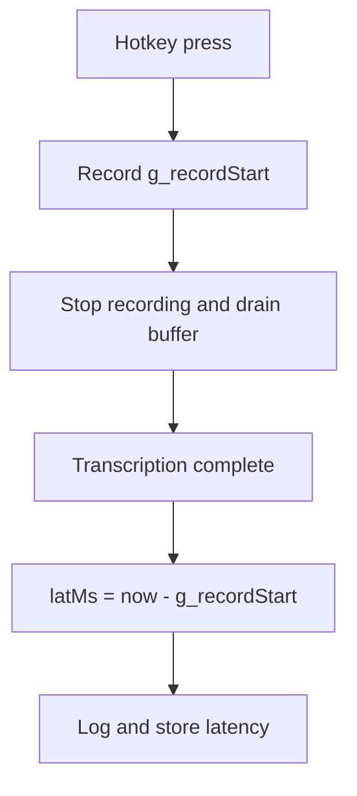

**Diagram sources**
- [main.cpp](file://src/main.cpp#L193-L194)
- [main.cpp](file://src/main.cpp#L310-L314)
- [main.cpp](file://src/main.cpp#L340-L340)

**Section sources**
- [main.cpp](file://src/main.cpp#L74-L74)
- [main.cpp](file://src/main.cpp#L193-L194)
- [main.cpp](file://src/main.cpp#L310-L314)
- [main.cpp](file://src/main.cpp#L340-L340)

### Error Handling in the Data Flow
- Audio capture errors: If the recording is too short or the drop rate exceeds a threshold, the system reports an error state and resets.
- Transcription busy: If the transcriber is already busy, the request is dropped and the system resets.
- Duplicate completion messages: A 500 ms guard prevents duplicate processing.
- Whisper inference: Empty or too-short inputs are handled gracefully; inference failure is treated as empty output.

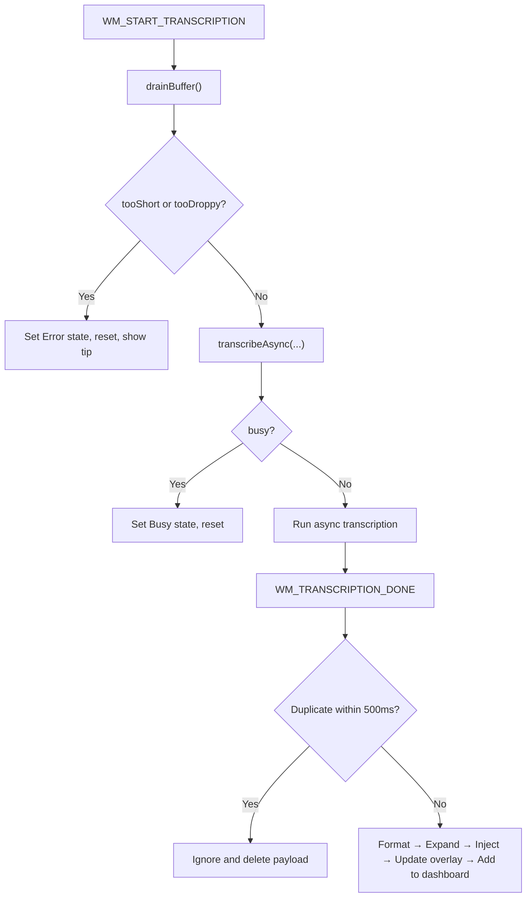

**Diagram sources**
- [main.cpp](file://src/main.cpp#L244-L274)
- [main.cpp](file://src/main.cpp#L280-L292)
- [main.cpp](file://src/main.cpp#L294-L342)
- [transcriber.cpp](file://src/transcriber.cpp#L103-L117)

**Section sources**
- [main.cpp](file://src/main.cpp#L250-L272)
- [main.cpp](file://src/main.cpp#L280-L292)
- [transcriber.cpp](file://src/transcriber.cpp#L103-L117)

### Memory Management and Security
- During shutdown, the PCM buffer is zeroed before being freed to prevent sensitive data from persisting in memory.
- The audio drain path moves the buffer to avoid extra copies.

**Section sources**
- [main.cpp](file://src/main.cpp#L507-L512)
- [audio_manager.cpp](file://src/audio_manager.cpp#L102-L111)

## Dependency Analysis
- Coupling: The main orchestrator depends on audio, transcriber, formatter, snippet engine, injector, dashboard, overlay, and config manager.
- Cohesion: Each module encapsulates a single responsibility (capture, ML, formatting, injection, persistence, UI).
- External dependencies: miniaudio for audio capture, whisper.cpp for transcription, Direct2D/DirectWrite for overlay, Windows clipboard and input APIs for injection.

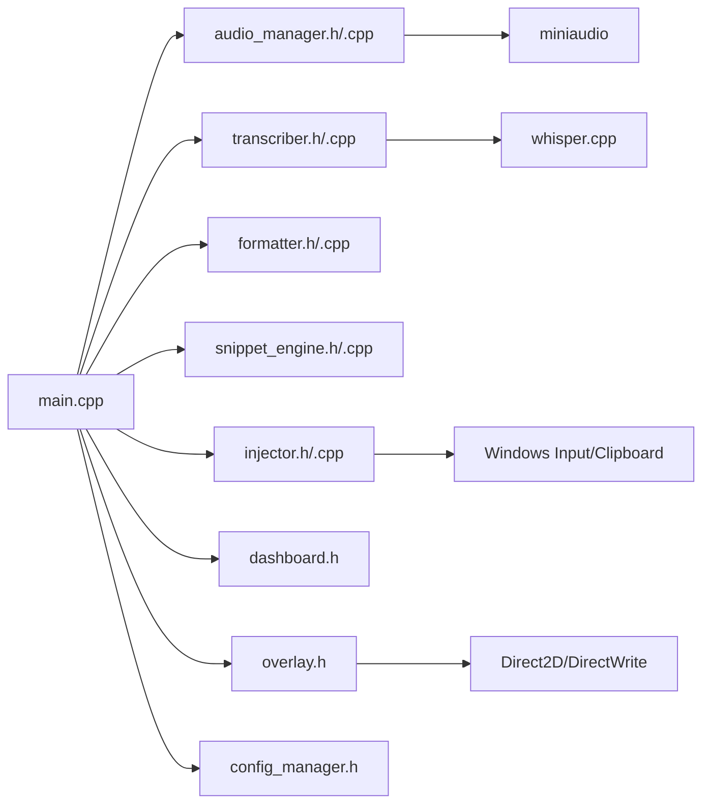

**Diagram sources**
- [main.cpp](file://src/main.cpp#L19-L26)
- [audio_manager.cpp](file://src/audio_manager.cpp#L7-L7)
- [transcriber.cpp](file://src/transcriber.cpp#L3-L3)
- [overlay.h](file://src/overlay.h#L3-L9)
- [injector.cpp](file://src/injector.cpp#L2-L4)

**Section sources**
- [main.cpp](file://src/main.cpp#L19-L26)
- [audio_manager.cpp](file://src/audio_manager.cpp#L7-L7)
- [transcriber.cpp](file://src/transcriber.cpp#L3-L3)
- [overlay.h](file://src/overlay.h#L3-L9)
- [injector.cpp](file://src/injector.cpp#L2-L4)

## Performance Considerations
- Throughput-oriented Whisper configuration: greedy decoding, reduced audio context scaling, single-segment inference, and suppressed blanks.
- Silence trimming reduces unnecessary compute.
- Lock-free ring buffer minimizes contention between audio and main threads.
- Pre-reserved vectors and move semantics reduce allocations and copies.
- Overlay rendering runs at ~60 Hz on the main thread; RMS updates are atomic.

[No sources needed since this section provides general guidance]

## Troubleshooting Guide
- Microphone access denied: Initialization failure displays a user-facing dialog; ensure permissions allow microphone access.
- Whisper model missing: Initialization failure displays a dialog with download instructions; ensure the model file exists at the expected path.
- Audio capture errors: If too short or excessive drops are detected, the system shows an error state and resets.
- Transcription busy: If the transcriber is busy, the system resets and suggests retrying.
- Duplicate completion messages: The system ignores duplicates within a short interval to prevent re-injection.

**Section sources**
- [main.cpp](file://src/main.cpp#L436-L444)
- [main.cpp](file://src/main.cpp#L462-L475)
- [main.cpp](file://src/main.cpp#L254-L264)
- [main.cpp](file://src/main.cpp#L266-L272)
- [main.cpp](file://src/main.cpp#L285-L291)

## Conclusion
Flow-On’s data flow is designed for responsiveness and reliability: a lock-free audio buffer captures PCM efficiently, asynchronous Whisper processing maximizes throughput, and a robust post-processing pipeline ensures high-quality text injection. The system includes careful error handling, latency measurement, memory protection, and persistent history for transparency and diagnostics.

[No sources needed since this section summarizes without analyzing specific files]

## Appendices

### Data Model: TranscriptionEntry
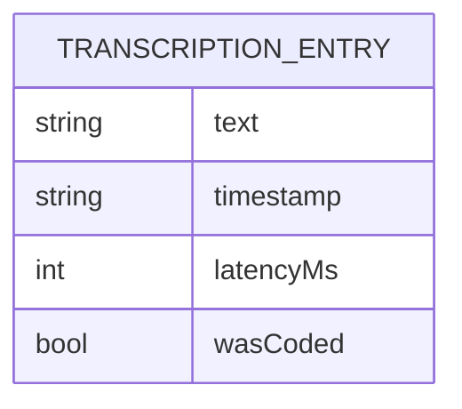

**Diagram sources**
- [dashboard.h](file://src/dashboard.h#L23-L28)