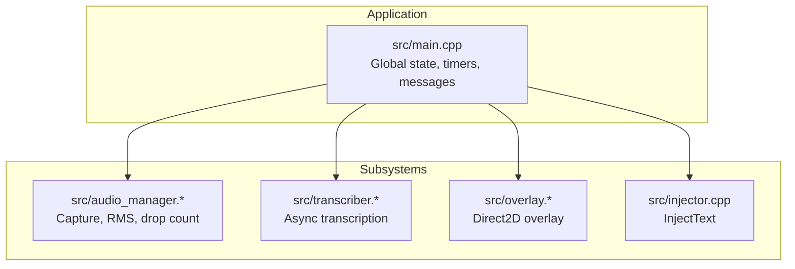
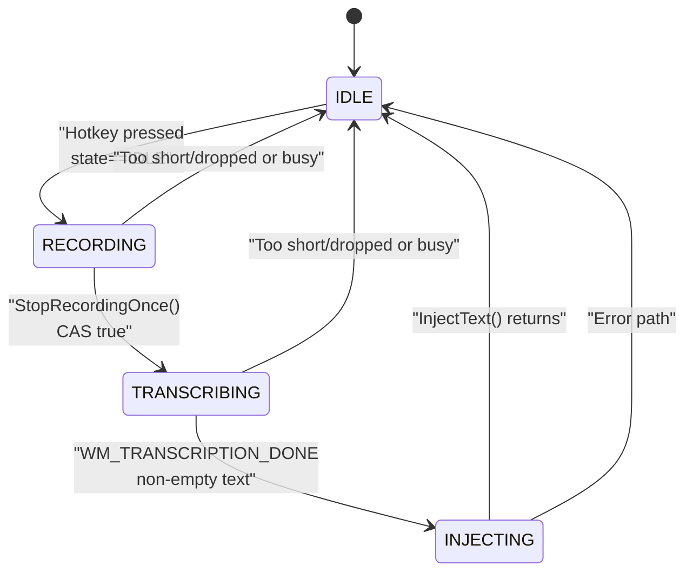
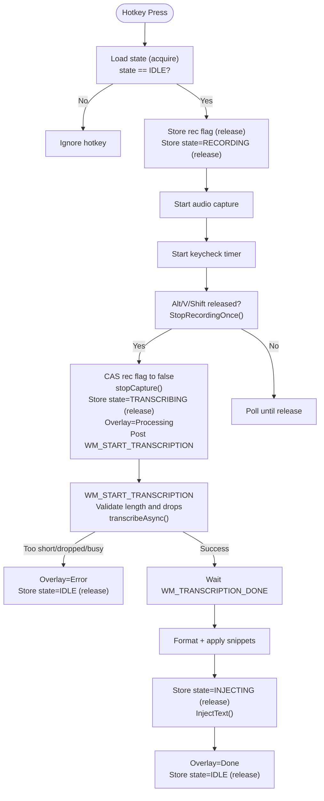
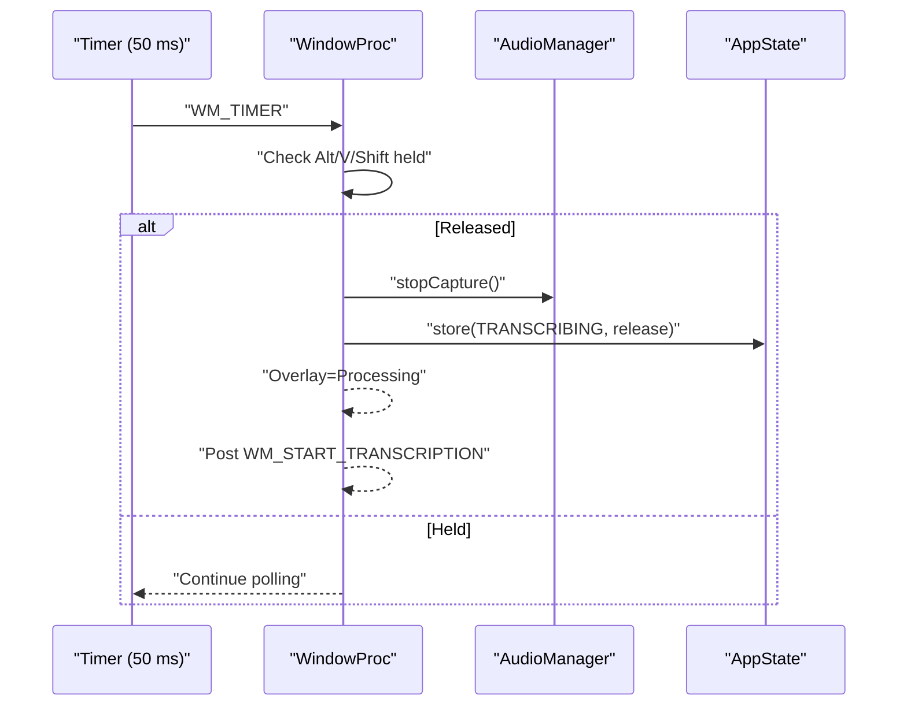
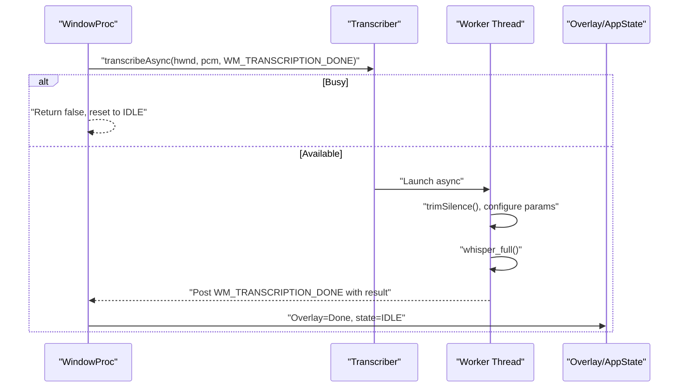
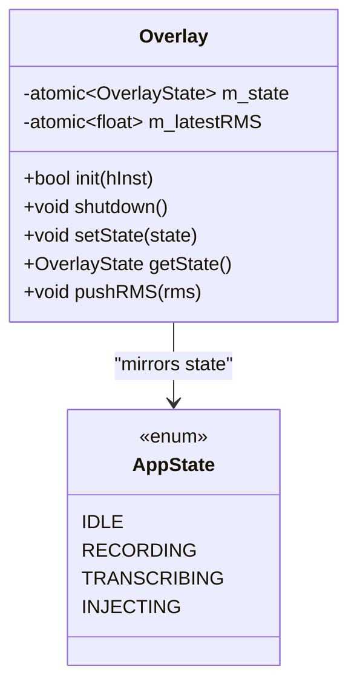
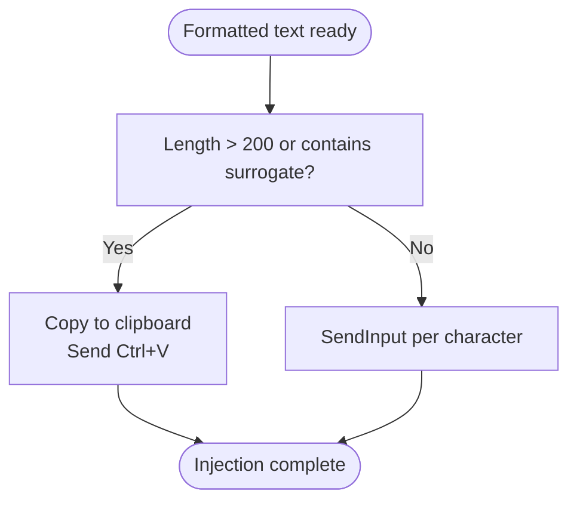
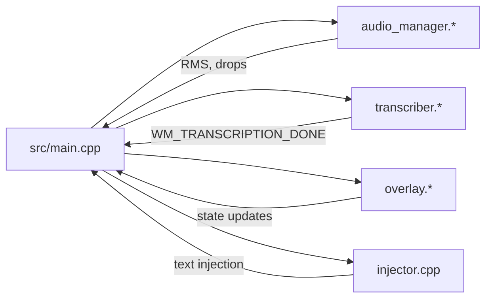

# State Machine Design

<cite>
**Referenced Files in This Document**
- [main.cpp](file://src/main.cpp)
- [overlay.h](file://src/overlay.h)
- [overlay.cpp](file://src/overlay.cpp)
- [audio_manager.h](file://src/audio_manager.h)
- [audio_manager.cpp](file://src/audio_manager.cpp)
- [transcriber.h](file://src/transcriber.h)
- [transcriber.cpp](file://src/transcriber.cpp)
- [injector.cpp](file://src/injector.cpp)
</cite>

## Table of Contents
1. [Introduction](#introduction)
2. [Project Structure](#project-structure)
3. [Core Components](#core-components)
4. [Architecture Overview](#architecture-overview)
5. [Detailed Component Analysis](#detailed-component-analysis)
6. [Dependency Analysis](#dependency-analysis)
7. [Performance Considerations](#performance-considerations)
8. [Troubleshooting Guide](#troubleshooting-guide)
9. [Conclusion](#conclusion)

## Introduction
This document explains the Flow-On finite state machine architecture that coordinates the end-to-end transcription workflow. The system is designed around a four-state model: IDLE, RECORDING, TRANSCRIBING, and INJECTING. Atomic operations and strict memory ordering guarantee thread-safe state transitions among audio capture, transcription, formatting, snippet expansion, and text injection. The global state variable orchestrates UI updates, system tray icon changes, and overlay animations. The design prevents race conditions during hotkey processing, audio capture, and text injection, and ensures robust error handling that returns the system to IDLE from any intermediate state.

## Project Structure
The state machine is implemented in the application’s main entry point and integrates with subsystems for audio capture, transcription, overlay rendering, formatting, snippet expansion, and text injection. The subsystems are initialized early and interact through well-defined message and state transitions.

**Diagram sources**
- [main.cpp](file://src/main.cpp#L49-L68)
- [audio_manager.h](file://src/audio_manager.h#L9-L41)
- [transcriber.h](file://src/transcriber.h#L10-L28)
- [overlay.h](file://src/overlay.h#L18-L93)
- [injector.cpp](file://src/injector.cpp#L49-L74)

**Section sources**
- [main.cpp](file://src/main.cpp#L362-L520)

## Core Components
- Global state machine
  - Enumerated states: IDLE, RECORDING, TRANSCRIBING, INJECTING
  - Atomic state variable for lock-free coordination
  - Atomic flag to gate concurrent recording attempts
- Audio capture
  - Microphone capture at 16 kHz mono into a lock-free ring buffer
  - RMS calculation and drop counter for quality gating
- Transcription
  - Asynchronous transcription with single-flight guard
  - Optimized decoding parameters for speed and accuracy
- Overlay
  - Direct2D layered window with smooth animations
  - Separate state machine for UI feedback (Hidden, Recording, Processing, Done, Error)
- Text injection
  - Robust injection path supporting long text and emoji via clipboard fallback

**Section sources**
- [main.cpp](file://src/main.cpp#L67-L75)
- [audio_manager.h](file://src/audio_manager.h#L9-L41)
- [transcriber.h](file://src/transcriber.h#L10-L28)
- [overlay.h](file://src/overlay.h#L11-L11)
- [injector.cpp](file://src/injector.cpp#L49-L74)

## Architecture Overview
The state machine is driven by Windows messages and timers. The global state variable enforces atomic transitions and visibility across threads. The overlay mirrors the global state for UI feedback, while the audio and transcription subsystems provide gating and validation checks before advancing to the next phase.

**Diagram sources**
- [main.cpp](file://src/main.cpp#L185-L203)
- [main.cpp](file://src/main.cpp#L116-L128)
- [main.cpp](file://src/main.cpp#L244-L274)
- [main.cpp](file://src/main.cpp#L280-L342)

## Detailed Component Analysis

### Global State Machine and Atomic Operations
- State variable and flags
  - Atomic state: guarded transitions and UI updates
  - Atomic recording flag: single-flight recording gate
  - Hotkey state: prevents re-triggering during a session
- Memory ordering
  - Release-acquire fences ensure proper ordering between producer/consumer threads
  - Relaxed loads are used for UI polling and counters where ordering is not required
- Error handling
  - Any failure path resets to IDLE with appropriate UI feedback

**Diagram sources**
- [main.cpp](file://src/main.cpp#L185-L203)
- [main.cpp](file://src/main.cpp#L116-L128)
- [main.cpp](file://src/main.cpp#L244-L274)
- [main.cpp](file://src/main.cpp#L280-L342)

**Section sources**
- [main.cpp](file://src/main.cpp#L67-L75)
- [main.cpp](file://src/main.cpp#L185-L203)
- [main.cpp](file://src/main.cpp#L116-L128)
- [main.cpp](file://src/main.cpp#L244-L274)
- [main.cpp](file://src/main.cpp#L280-L342)

### Audio Capture and Quality Gating
- Capture pipeline
  - Microphone opened at 16 kHz mono; data callback enqueues PCM into a lock-free ring buffer
  - RMS computed per chunk and exposed for UI
  - Drop counter incremented when the ring buffer overflows
- Session management
  - Pre-session drain of stale samples
  - Buffer drained once after stopping capture for transcription
- Validation gates
  - Minimum length check and drop-rate threshold before starting transcription
  - Failure returns to IDLE with error overlay and tray tip

**Diagram sources**
- [main.cpp](file://src/main.cpp#L208-L222)
- [audio_manager.cpp](file://src/audio_manager.cpp#L96-L100)

**Section sources**
- [audio_manager.cpp](file://src/audio_manager.cpp#L39-L56)
- [audio_manager.cpp](file://src/audio_manager.cpp#L83-L100)
- [audio_manager.h](file://src/audio_manager.h#L26-L30)

### Transcription Engine and Single-Flight Guard
- Async transcription
  - Single-flight guard prevents overlapping transcription requests
  - Worker thread performs silence trimming, sets optimized parameters, and runs inference
- Result handling
  - Posts WM_TRANSCRIPTION_DONE with heap-allocated string payload
  - Deduplicates hallucinated repetitions
- Error handling
  - If busy or invalid input, returns to IDLE with appropriate UI feedback

**Diagram sources**
- [transcriber.cpp](file://src/transcriber.cpp#L103-L117)
- [transcriber.cpp](file://src/transcriber.cpp#L119-L225)
- [main.cpp](file://src/main.cpp#L244-L274)

**Section sources**
- [transcriber.h](file://src/transcriber.h#L17-L23)
- [transcriber.cpp](file://src/transcriber.cpp#L103-L117)
- [transcriber.cpp](file://src/transcriber.cpp#L119-L225)

### Overlay Rendering and UI Feedback
- Overlay state machine
  - Mirrors global state with Hidden, Recording, Processing, Done, Error
  - Uses acquire-release semantics for state transitions and relaxed for RMS/UI polling
- Animations
  - Smooth appearance/disappearance and state-specific visuals (waveform, spinner, success/error)
- Integration
  - Overlay state updated upon entering TRANSCRIBING and after INJECTING/Done/Error

**Diagram sources**
- [overlay.h](file://src/overlay.h#L18-L93)
- [overlay.cpp](file://src/overlay.cpp#L140-L158)
- [main.cpp](file://src/main.cpp#L123-L125)

**Section sources**
- [overlay.h](file://src/overlay.h#L11-L11)
- [overlay.h](file://src/overlay.h#L49-L51)
- [overlay.cpp](file://src/overlay.cpp#L140-L158)

### Text Injection and Fallback Paths
- Injection strategy
  - Short text without surrogate code units injected via SendInput with per-character KEYEVENTF_UNICODE
  - Long text or text containing surrogates injected via clipboard paste (Ctrl+V)
- Threading requirement
  - Must be invoked from the main Win32 thread

**Diagram sources**
- [injector.cpp](file://src/injector.cpp#L49-L74)

**Section sources**
- [injector.cpp](file://src/injector.cpp#L49-L74)

## Dependency Analysis
The state machine depends on subsystems for audio capture, transcription, UI rendering, and text injection. The main loop coordinates transitions via Windows messages and timers, ensuring that each subsystem is only engaged when the global state permits.

**Diagram sources**
- [main.cpp](file://src/main.cpp#L49-L68)
- [audio_manager.cpp](file://src/audio_manager.cpp#L39-L56)
- [transcriber.cpp](file://src/transcriber.cpp#L119-L225)
- [overlay.cpp](file://src/overlay.cpp#L140-L158)
- [injector.cpp](file://src/injector.cpp#L49-L74)

**Section sources**
- [main.cpp](file://src/main.cpp#L49-L68)

## Performance Considerations
- Latency measurement
  - Start time captured at hotkey press; elapsed time recorded when transcription completes
- Throughput optimizations
  - Transcriber reduces compute by trimming silence, using greedy decoding with reduced context, disabling timestamps, and limiting tokens
- UI responsiveness
  - Overlay runs at ~60 Hz via WM_TIMER; RMS updates are atomic and non-blocking
- Memory safety
  - PCM buffer zeroed before shutdown to avoid sensitive data lingering in memory

**Section sources**
- [main.cpp](file://src/main.cpp#L193-L193)
- [main.cpp](file://src/main.cpp#L310-L315)
- [transcriber.cpp](file://src/transcriber.cpp#L53-L77)
- [transcriber.cpp](file://src/transcriber.cpp#L138-L178)
- [overlay.cpp](file://src/overlay.cpp#L17-L17)
- [main.cpp](file://src/main.cpp#L507-L512)

## Troubleshooting Guide
- Hotkey conflicts
  - If Alt+V is taken, the system attempts Alt+Shift+V and updates tray tip accordingly
- Audio errors
  - Initialization failures show a dialog; overlay is non-fatal and continues without UI
- Transcription busy or invalid input
  - Duplicate or too-short recordings reset to IDLE with appropriate tray tip and error overlay
- Duplicate message guard
  - A deduplication mechanism ignores duplicate WM_TRANSCRIPTION_DONE within a short interval

**Section sources**
- [main.cpp](file://src/main.cpp#L162-L178)
- [main.cpp](file://src/main.cpp#L436-L444)
- [main.cpp](file://src/main.cpp#L449-L457)
- [main.cpp](file://src/main.cpp#L254-L272)
- [main.cpp](file://src/main.cpp#L280-L292)

## Conclusion
The Flow-On state machine coordinates a responsive, race-free transcription pipeline. Atomic state transitions, strict memory ordering, and quality gates ensure reliability across audio capture, transcription, formatting, snippet expansion, and text injection. The global state variable synchronizes UI updates, tray icons, and overlay animations, while error handling guarantees recovery to IDLE from any intermediate state. The design balances performance with correctness, delivering a smooth user experience across diverse environments.