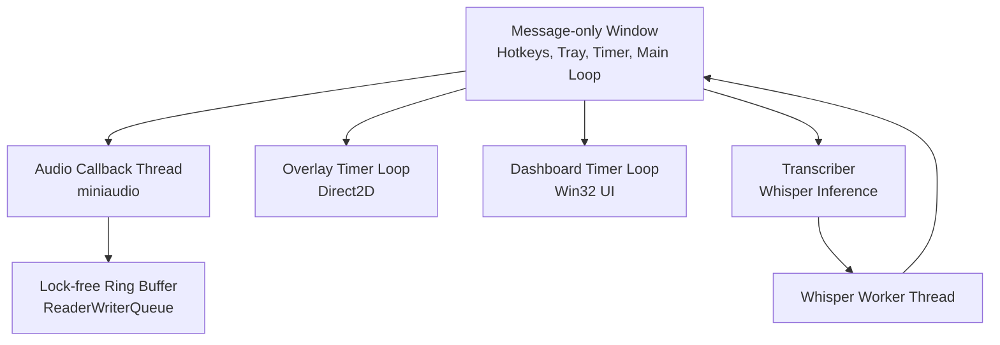
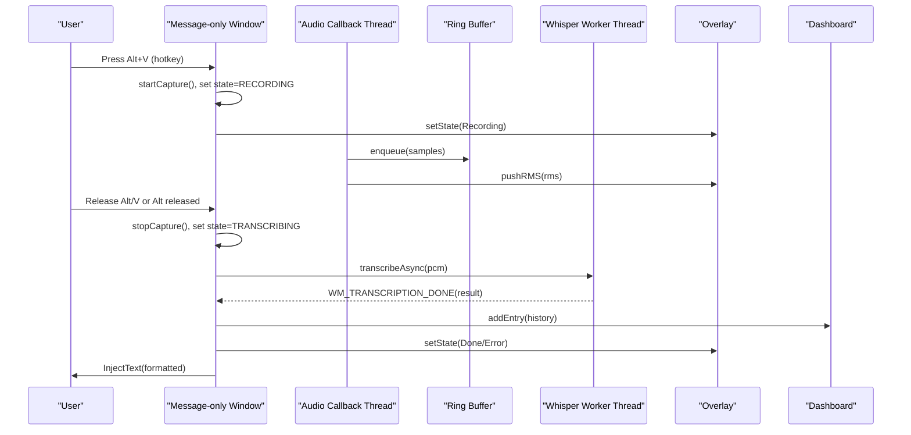
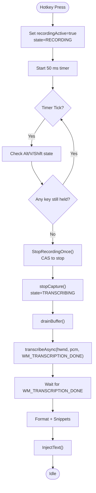
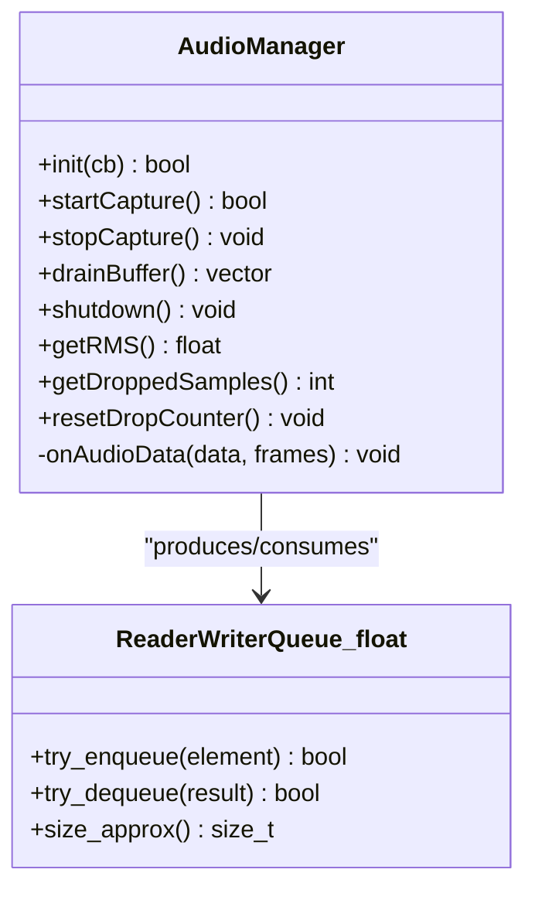
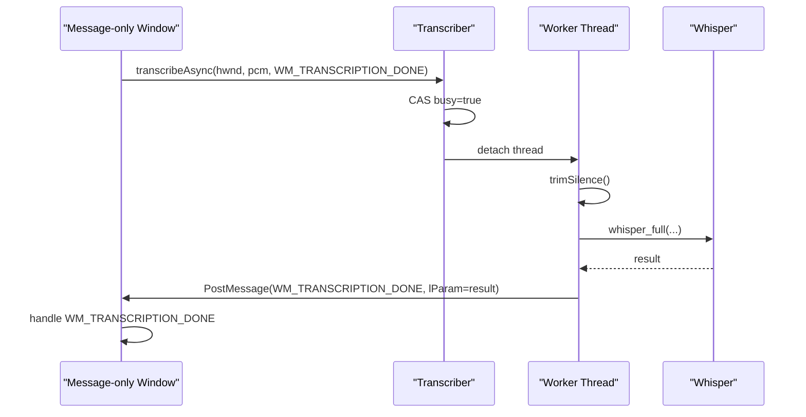
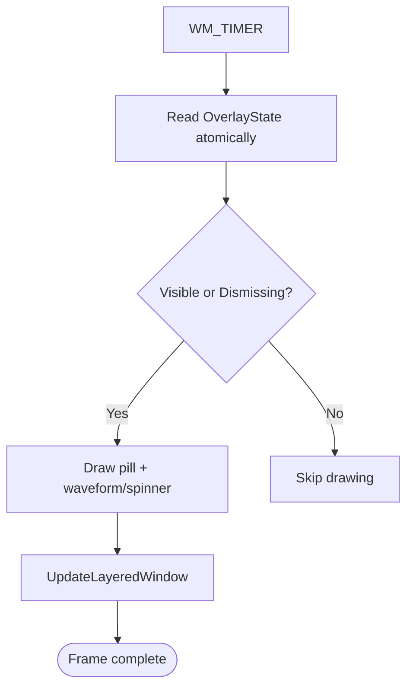
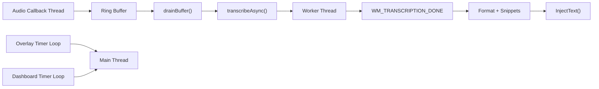

# Threading Model

<cite>
**Referenced Files in This Document**
- [main.cpp](file://src/main.cpp)
- [audio_manager.cpp](file://src/audio_manager.cpp)
- [audio_manager.h](file://src/audio_manager.h)
- [transcriber.cpp](file://src/transcriber.cpp)
- [transcriber.h](file://src/transcriber.h)
- [overlay.cpp](file://src/overlay.cpp)
- [overlay.h](file://src/overlay.h)
- [dashboard.cpp](file://src/dashboard.cpp)
- [dashboard.h](file://src/dashboard.h)
- [injector.cpp](file://src/injector.cpp)
- [formatter.cpp](file://src/formatter.cpp)
- [snippet_engine.cpp](file://src/snippet_engine.cpp)
- [readerwriterqueue.h](file://external/readerwriterqueue.h)
- [atomicops.h](file://external/atomicops.h)
</cite>

## Table of Contents
1. [Introduction](#introduction)
2. [Project Structure](#project-structure)
3. [Core Components](#core-components)
4. [Architecture Overview](#architecture-overview)
5. [Detailed Component Analysis](#detailed-component-analysis)
6. [Dependency Analysis](#dependency-analysis)
7. [Performance Considerations](#performance-considerations)
8. [Troubleshooting Guide](#troubleshooting-guide)
9. [Conclusion](#conclusion)

## Introduction
This document explains the Flow-On threading architecture. The application is structured around a single, hidden Windows message-only window that owns the tray icon, hotkeys, timers, and the main message loop. Real-time audio capture is handled by a dedicated audio callback thread that writes PCM samples into a lock-free ring buffer. A worker thread performs Whisper transcription asynchronously. The UI is driven by a Direct2D overlay window that renders on a timer-driven loop on the main thread. Text formatting, snippet expansion, and injection occur on the main thread after transcription completion. Thread synchronization relies on atomic variables, lock-free queues, and Windows message posting. The design minimizes contention and ensures real-time responsiveness while maintaining correctness.

## Project Structure
The threading model spans several modules:
- Message-only window and main loop: owns hotkeys, tray icon, timers, and orchestrates state transitions.
- Audio subsystem: captures audio on a time-critical thread and enqueues PCM into a lock-free queue.
- Transcriber: runs Whisper inference on a detached worker thread and posts results back to the main thread.
- Overlay: Direct2D rendering on a timer-driven loop on the main thread.
- Dashboard: Win32 UI with a timer-driven loop on the main thread; maintains history safely with a mutex.
- Formatter and snippet engine: pure CPU transformations invoked on the main thread.
- Injector: synthesizes input events or uses clipboard injection on the main thread.

**Diagram sources**
- [main.cpp](file://src/main.cpp#L387-L520)
- [audio_manager.cpp](file://src/audio_manager.cpp#L30-L56)
- [readerwriterqueue.h](file://external/readerwriterqueue.h#L75-L161)
- [transcriber.cpp](file://src/transcriber.cpp#L103-L225)
- [overlay.cpp](file://src/overlay.cpp#L29-L74)
- [dashboard.cpp](file://src/dashboard.cpp#L90-L113)

**Section sources**
- [main.cpp](file://src/main.cpp#L387-L520)
- [audio_manager.cpp](file://src/audio_manager.cpp#L18-L56)
- [transcriber.cpp](file://src/transcriber.cpp#L103-L225)
- [overlay.cpp](file://src/overlay.cpp#L29-L74)
- [dashboard.cpp](file://src/dashboard.cpp#L90-L113)

## Core Components
- Message-only window thread
  - Registers hotkeys, owns tray icon, drives the main message loop, and coordinates state transitions.
  - Uses a polling timer to reliably detect hotkey release during recording.
  - Posts application-defined messages to itself to hand off work to other subsystems.
- Audio callback thread
  - Receives PCM data from miniaudio; enqueues samples into a lock-free ring buffer.
  - Updates RMS and pushes it to the overlay for visualization.
- Transcriber worker thread
  - Performs Whisper inference asynchronously; posts results back to the message-only window.
- Overlay and Dashboard timer loops
  - Drive UI rendering on the main thread via WM_TIMER handlers.
- Formatter, snippet engine, and injector
  - Pure CPU operations executed on the main thread after transcription completion.

**Section sources**
- [main.cpp](file://src/main.cpp#L149-L357)
- [audio_manager.cpp](file://src/audio_manager.cpp#L30-L56)
- [transcriber.cpp](file://src/transcriber.cpp#L103-L225)
- [overlay.cpp](file://src/overlay.cpp#L596-L620)
- [dashboard.cpp](file://src/dashboard.cpp#L208-L222)

## Architecture Overview
The threading model centers on a strict separation of concerns:
- Real-time audio capture occurs on a dedicated callback thread; all UI and heavy computation occur on the main thread.
- Inter-thread communication is achieved via:
  - Lock-free ring buffer for audio samples.
  - Atomic state flags and counters.
  - Windows message posting for cross-thread coordination.
  - A single-flight guard to prevent overlapping transcription requests.

**Diagram sources**
- [main.cpp](file://src/main.cpp#L185-L274)
- [audio_manager.cpp](file://src/audio_manager.cpp#L39-L56)
- [readerwriterqueue.h](file://external/readerwriterqueue.h#L234-L245)
- [transcriber.cpp](file://src/transcriber.cpp#L103-L225)
- [overlay.cpp](file://src/overlay.cpp#L140-L158)
- [dashboard.cpp](file://src/dashboard.cpp#L428-L439)

## Detailed Component Analysis

### Message-only Window Thread
Responsibilities:
- Owns the tray icon, registers hotkeys, and handles tray menu actions.
- Manages application state using atomic flags and a finite-state machine.
- Drives a polling timer to detect hotkey release during recording.
- Posts messages to itself to coordinate audio capture, transcription, formatting, and injection.

Key mechanisms:
- Atomic state flags for state machine and recording activity.
- Polling timer (WM_TIMER) checks modifier keys and triggers stop logic.
- Message posting to itself to hand off PCM to the transcriber and to post results back.

Thread safety:
- Uses compare-and-swap to ensure only one stop path executes.
- Uses atomic loads/stores with appropriate memory ordering for state transitions.

**Diagram sources**
- [main.cpp](file://src/main.cpp#L185-L274)

**Section sources**
- [main.cpp](file://src/main.cpp#L67-L71)
- [main.cpp](file://src/main.cpp#L116-L128)
- [main.cpp](file://src/main.cpp#L208-L222)
- [main.cpp](file://src/main.cpp#L244-L274)

### Audio Callback Thread and Circular Buffer
Responsibilities:
- Captures audio at 16 kHz mono and feeds PCM samples to a lock-free ring buffer.
- Computes RMS energy per chunk and pushes it to the overlay.
- Provides a drain operation to transfer buffered samples to the main thread.

Key mechanisms:
- Lock-free ring buffer using a single-producer/single-consumer queue.
- Atomic counters for dropped samples and RMS.
- Periodic frames (100 ms) from miniaudio callback.

Thread safety:
- Producer-only access to enqueue; consumer-only access to dequeue.
- Atomic counters and relaxed memory ordering for non-critical metrics.
- Overlay RMS is pushed via an atomic store for safe consumption from the main thread.

**Diagram sources**
- [audio_manager.cpp](file://src/audio_manager.cpp#L39-L56)
- [readerwriterqueue.h](file://external/readerwriterqueue.h#L234-L245)

**Section sources**
- [audio_manager.cpp](file://src/audio_manager.cpp#L18-L28)
- [audio_manager.cpp](file://src/audio_manager.cpp#L39-L56)
- [audio_manager.h](file://src/audio_manager.h#L26-L30)
- [readerwriterqueue.h](file://external/readerwriterqueue.h#L234-L245)

### Transcriber Worker Thread Model
Responsibilities:
- Asynchronously runs Whisper inference on a detached worker thread.
- Applies preprocessing (silence trimming) and tuning for throughput.
- Posts results back to the message-only window via a Windows message.

Key mechanisms:
- Single-flight guard using compare-and-swap to prevent overlapping transcription.
- Detached worker thread; result posted back to the main thread.
- Preprocessing and parameter tuning to optimize runtime and accuracy.

**Diagram sources**
- [transcriber.cpp](file://src/transcriber.cpp#L103-L225)
- [main.cpp](file://src/main.cpp#L244-L274)

**Section sources**
- [transcriber.cpp](file://src/transcriber.cpp#L103-L225)
- [transcriber.h](file://src/transcriber.h#L17-L23)

### Overlay Timer Loop (UI Rendering)
Responsibilities:
- Drives Direct2D rendering on a timer loop on the main thread.
- Reads overlay state and RMS atomically for visual feedback.
- Manages animations and fades for recording, processing, done, and error states.

Key mechanisms:
- WM_TIMER handler updates animation state and triggers redraw.
- Uses atomic state and RMS for thread-safe UI updates.

**Diagram sources**
- [overlay.cpp](file://src/overlay.cpp#L596-L620)
- [overlay.h](file://src/overlay.h#L23-L27)

**Section sources**
- [overlay.cpp](file://src/overlay.cpp#L29-L74)
- [overlay.cpp](file://src/overlay.cpp#L596-L620)
- [overlay.h](file://src/overlay.h#L23-L27)

### Dashboard Timer Loop (History UI)
Responsibilities:
- Maintains a Win32 UI with a timer-driven loop on the main thread.
- Safely updates history with a mutex-guarded container.
- Renders recent transcriptions with animations and fades.

Key mechanisms:
- WM_TIMER advances animations and invalidates window for repaint.
- History updates guarded by a mutex; UI updates posted to the window.

**Section sources**
- [dashboard.cpp](file://src/dashboard.cpp#L90-L113)
- [dashboard.cpp](file://src/dashboard.cpp#L208-L222)
- [dashboard.h](file://src/dashboard.h#L58-L61)

### Text Formatting, Snippet Expansion, and Injection
Responsibilities:
- Format transcription using a four-pass pipeline.
- Expand snippets using a case-insensitive map.
- Inject formatted text into the active application using keyboard events or clipboard.

Key mechanisms:
- Formatter and snippet engine operate on the main thread after transcription.
- Injector chooses between raw Unicode events and clipboard injection depending on content.

**Section sources**
- [formatter.cpp](file://src/formatter.cpp#L137-L147)
- [snippet_engine.cpp](file://src/snippet_engine.cpp#L6-L28)
- [injector.cpp](file://src/injector.cpp#L49-L74)

## Dependency Analysis
Inter-thread dependencies and synchronization points:
- Audio callback thread produces to the ring buffer; main thread consumes via drain.
- Transcriber worker thread is protected by a single-flight guard; results posted back to main thread.
- Overlay and Dashboard run on the main thread and read atomic state/counters.
- Formatter, snippet engine, and injector run on the main thread after receiving results.

**Diagram sources**
- [audio_manager.cpp](file://src/audio_manager.cpp#L102-L111)
- [transcriber.cpp](file://src/transcriber.cpp#L103-L225)
- [overlay.cpp](file://src/overlay.cpp#L596-L620)
- [dashboard.cpp](file://src/dashboard.cpp#L208-L222)

**Section sources**
- [audio_manager.cpp](file://src/audio_manager.cpp#L102-L111)
- [transcriber.cpp](file://src/transcriber.cpp#L103-L225)
- [overlay.cpp](file://src/overlay.cpp#L596-L620)
- [dashboard.cpp](file://src/dashboard.cpp#L208-L222)

## Performance Considerations
- Lock-free ring buffer minimizes contention between audio callback and main thread.
- Whisper worker thread is detached; main thread remains responsive.
- Overlay and Dashboard timer intervals (~16 ms) balance smoothness and CPU usage.
- Preprocessing (trimming silence) reduces unnecessary compute and improves latency.
- Memory barriers and atomic operations ensure correctness without expensive synchronization.

[No sources needed since this section provides general guidance]

## Troubleshooting Guide
Common issues and mitigations:
- Duplicate transcription notifications: the main thread guards against duplicates with a time gate.
- Audio dropouts: the audio subsystem tracks dropped samples; the main thread filters short/lossy recordings.
- Shutdown memory safety: the main thread zeroes the PCM buffer before freeing to prevent sensitive data leakage.

**Section sources**
- [main.cpp](file://src/main.cpp#L280-L292)
- [main.cpp](file://src/main.cpp#L250-L264)
- [main.cpp](file://src/main.cpp#L507-L512)

## Conclusion
Flow-On employs a robust, single-window, multi-threaded architecture:
- Real-time audio capture on a dedicated callback thread.
- Asynchronous Whisper processing on a worker thread.
- UI rendering on timer-driven loops on the main thread.
- Strict inter-thread communication via lock-free queues, atomic variables, and Windows messages.
This design achieves low-latency transcription, smooth UI, and safe resource management.