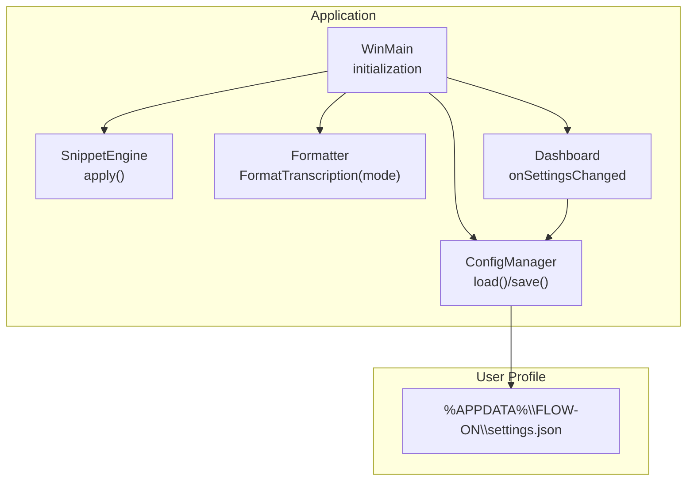
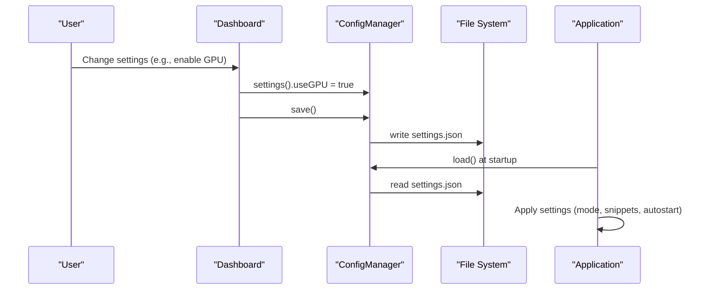
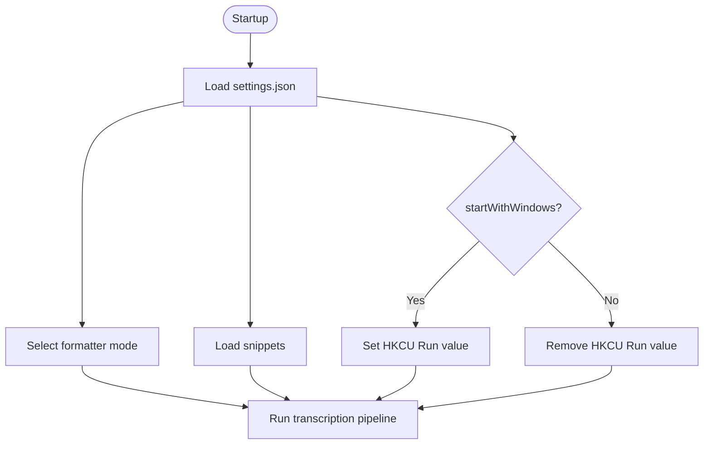
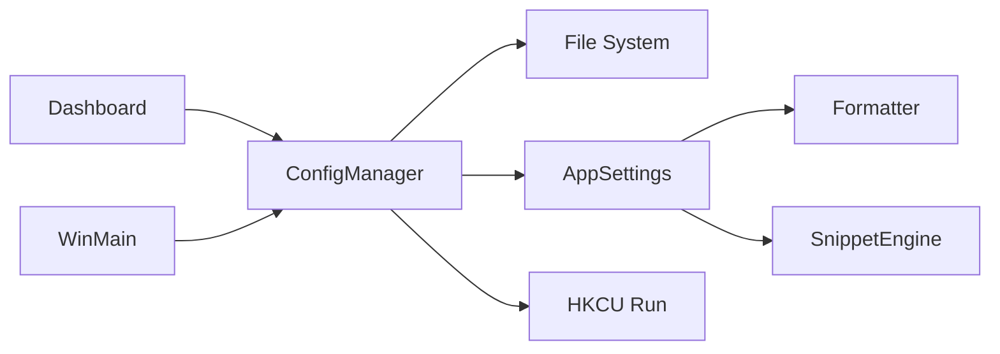

# Configuration Management

<cite>
**Referenced Files in This Document**
- [config_manager.h](file://src/config_manager.h)
- [config_manager.cpp](file://src/config_manager.cpp)
- [settings.default.json](file://assets/settings.default.json)
- [main.cpp](file://src/main.cpp)
- [formatter.h](file://src/formatter.h)
- [formatter.cpp](file://src/formatter.cpp)
- [snippet_engine.h](file://src/snippet_engine.h)
- [snippet_engine.cpp](file://src/snippet_engine.cpp)
- [dashboard.h](file://src/dashboard.h)
- [README.md](file://README.md)
</cite>

## Table of Contents
1. [Introduction](#introduction)
2. [Project Structure](#project-structure)
3. [Core Components](#core-components)
4. [Architecture Overview](#architecture-overview)
5. [Detailed Component Analysis](#detailed-component-analysis)
6. [Dependency Analysis](#dependency-analysis)
7. [Performance Considerations](#performance-considerations)
8. [Troubleshooting Guide](#troubleshooting-guide)
9. [Conclusion](#conclusion)
10. [Appendices](#appendices)

## Introduction
This document explains Flow-On’s configuration management system. It covers the JSON configuration schema, persistence mechanism, validation and error handling, default templates, runtime updates, and how configuration changes influence application behavior. It also provides practical examples, backup and migration guidance, and troubleshooting steps.

## Project Structure
Flow-On stores settings in a JSON file located under the Windows user profile directory and loads them at startup. The configuration is consumed by several subsystems: hotkey handling, transcription mode selection, snippet expansion, and autostart behavior.

**Diagram sources**
- [config_manager.cpp](file://src/config_manager.cpp#L24-L80)
- [main.cpp](file://src/main.cpp#L409-L493)
- [snippet_engine.h](file://src/snippet_engine.h#L7-L19)
- [formatter.h](file://src/formatter.h#L4-L5)
- [dashboard.h](file://src/dashboard.h#L30-L34)

**Section sources**
- [config_manager.cpp](file://src/config_manager.cpp#L15-L22)
- [README.md](file://README.md#L161-L194)

## Core Components
- AppSettings: in-memory representation of persisted settings.
- ConfigManager: loads, validates, and persists settings; manages autostart registry entries.
- Default template: a reference JSON file shipped with the project.
- Runtime integration: settings are read during startup and updated via the dashboard.

Key responsibilities:
- Persistence: JSON file in %APPDATA%\FLOW-ON\settings.json.
- Defaults: created on first run if missing.
- Validation: malformed JSON resets to defaults.
- Runtime updates: dashboard callbacks update in-memory settings and persist to disk.

**Section sources**
- [config_manager.h](file://src/config_manager.h#L8-L19)
- [config_manager.cpp](file://src/config_manager.cpp#L24-L80)
- [settings.default.json](file://assets/settings.default.json#L1-L16)
- [main.cpp](file://src/main.cpp#L409-L493)

## Architecture Overview
The configuration lifecycle spans initialization, runtime updates, and persistence.

**Diagram sources**
- [main.cpp](file://src/main.cpp#L409-L493)
- [config_manager.cpp](file://src/config_manager.cpp#L24-L80)

## Detailed Component Analysis

### JSON Schema and Supported Settings
The configuration file supports the following categories and keys:

- Hotkey configuration
  - hotkey: string representing the default hotkey combination.
- Formatting modes
  - mode: string controlling transcription mode selection ("auto", "prose", "code").
- Model selection
  - model: string indicating the Whisper model identifier.
- GPU acceleration
  - useGPU: boolean toggling GPU usage for transcription.
- Autostart
  - startWithWindows: boolean to enable startup with Windows.
- Snippets
  - snippets: object mapping trigger phrases to expansions.

Notes:
- The in-memory AppSettings structure defines default values and the subset of keys persisted to disk.
- The shipped default template includes additional snippet entries compared to the in-memory defaults.

Practical implications:
- Changing mode influences formatter behavior and snippet expansion timing.
- Enabling GPU accelerates transcription when supported by the environment.
- Autostart modifies the Windows Registry Run key for the current user.

**Section sources**
- [config_manager.h](file://src/config_manager.h#L8-L19)
- [config_manager.cpp](file://src/config_manager.cpp#L37-L51)
- [settings.default.json](file://assets/settings.default.json#L1-L16)
- [formatter.h](file://src/formatter.h#L4-L5)

### Settings Persistence Mechanism
- Location: %APPDATA%\FLOW-ON\settings.json.
- First-run behavior: If the file does not exist, defaults are written and returned.
- Load process:
  - Attempts to open the file.
  - If missing, invokes save() to create defaults.
  - If present, parses JSON and merges supported keys into AppSettings.
- Save process:
  - Serializes AppSettings to JSON and writes to disk with indentation.
- Autostart:
  - applyAutostart(): writes a Run registry value for the executable path.
  - removeAutostart(): deletes the Run registry value.

Runtime updates:
- The dashboard’s onSettingsChanged callback updates in-memory settings and persists them.
- Autostart is applied or removed based on the updated flag.

**Section sources**
- [config_manager.cpp](file://src/config_manager.cpp#L15-L22)
- [config_manager.cpp](file://src/config_manager.cpp#L24-L58)
- [config_manager.cpp](file://src/config_manager.cpp#L60-L80)
- [config_manager.cpp](file://src/config_manager.cpp#L82-L107)
- [main.cpp](file://src/main.cpp#L409-L493)

### Configuration Validation and Error Handling
- Malformed JSON:
  - On parse failure, the manager resets AppSettings to defaults and writes a fresh settings.json.
- Snippet safety:
  - Values exceeding a maximum length are truncated to a safe limit before storage.
- Missing keys:
  - Only recognized keys are merged; unknown keys are ignored.

These behaviors ensure robust operation even if the settings file becomes corrupted or outdated.

**Section sources**
- [config_manager.cpp](file://src/config_manager.cpp#L52-L56)
- [config_manager.cpp](file://src/config_manager.cpp#L46-L49)

### Relationship Between Runtime Configuration and Behavior
- Mode selection:
  - The application chooses the formatter mode based on settings, falling back to active-window detection when set to "auto".
- Snippet expansion:
  - Snippets are loaded into the snippet engine at startup and applied after formatting.
- Autostart:
  - Applied immediately upon saving when enabled; removed when disabled.

**Diagram sources**
- [main.cpp](file://src/main.cpp#L409-L493)
- [formatter.h](file://src/formatter.h#L4-L5)
- [snippet_engine.h](file://src/snippet_engine.h#L7-L19)

**Section sources**
- [main.cpp](file://src/main.cpp#L300-L306)
- [main.cpp](file://src/main.cpp#L409-L493)
- [formatter.h](file://src/formatter.h#L4-L5)
- [snippet_engine.h](file://src/snippet_engine.h#L7-L19)

### Practical Configuration Scenarios
- Customize hotkeys:
  - Modify the hotkey string to a supported combination recognized by the application’s hotkey registration logic.
- Adjust model:
  - Change the model identifier to select a different Whisper model variant.
- Enable GPU acceleration:
  - Set useGPU to true to prefer GPU-backed transcription; the transcriber falls back to CPU if unavailable.
- Add custom snippets:
  - Extend the snippets object with new trigger phrases and expansions; values are truncated if too long.

Note: The shipped default template demonstrates additional snippet entries beyond the in-memory defaults.

**Section sources**
- [config_manager.cpp](file://src/config_manager.cpp#L37-L51)
- [settings.default.json](file://assets/settings.default.json#L7-L14)
- [transcriber.cpp](file://src/transcriber.cpp#L79-L93)

### Backup and Migration Strategies
- Backup:
  - Copy %APPDATA%\FLOW-ON\settings.json to a safe location before major updates.
- Migration:
  - New keys introduced in future versions are ignored by the loader; existing keys remain unaffected.
  - If corruption occurs, the loader restores defaults; restore from your backup afterward.

**Section sources**
- [config_manager.cpp](file://src/config_manager.cpp#L52-L56)

### Integration Between Configuration and Component Initialization
- Startup:
  - ConfigManager::load() is called early in WinMain.
  - SnippetEngine is seeded with loaded snippets.
  - Autostart is applied conditionally based on settings.
- Dashboard:
  - onSettingsChanged updates in-memory settings and persists them; autostart is applied or removed accordingly.

**Section sources**
- [main.cpp](file://src/main.cpp#L409-L493)

## Dependency Analysis
The configuration system interacts with multiple subsystems. The diagram below highlights key dependencies.

**Diagram sources**
- [config_manager.cpp](file://src/config_manager.cpp#L24-L80)
- [main.cpp](file://src/main.cpp#L409-L493)
- [formatter.h](file://src/formatter.h#L4-L5)
- [snippet_engine.h](file://src/snippet_engine.h#L7-L19)
- [dashboard.h](file://src/dashboard.h#L56-L56)

**Section sources**
- [config_manager.cpp](file://src/config_manager.cpp#L24-L80)
- [main.cpp](file://src/main.cpp#L409-L493)

## Performance Considerations
- Persisting settings is lightweight; JSON serialization/deserialization occurs infrequently.
- Trimming snippet expansions reduces memory footprint and avoids excessive replacements.
- GPU acceleration for transcription improves throughput when available; otherwise CPU fallback remains functional.

[No sources needed since this section provides general guidance]

## Troubleshooting Guide
- Settings file not found:
  - Expected path: %APPDATA%\FLOW-ON\settings.json. On first run, it is auto-created.
- Settings file is corrupted:
  - Symptoms: unexpected defaults or errors on load.
  - Resolution: delete the file; it will be recreated with defaults. Restore from a backup if available.
- Hotkey conflicts:
  - If the primary hotkey cannot be registered, the application attempts an alternate combination and updates the tray tooltip accordingly.
- Autostart not working:
  - Verify the Run registry value exists for the current user and matches the executable path.
- Snippet not expanding:
  - Ensure the trigger phrase is present in the snippets object and the expansion length is within limits.

**Section sources**
- [config_manager.cpp](file://src/config_manager.cpp#L24-L58)
- [config_manager.cpp](file://src/config_manager.cpp#L82-L107)
- [main.cpp](file://src/main.cpp#L162-L178)

## Conclusion
Flow-On’s configuration system is designed for simplicity and resilience. Settings are stored in a straightforward JSON file, validated carefully, and applied consistently across components. Defaults are created on first run, and runtime updates are propagated immediately. By following the backup and migration guidance, users can safely evolve their configuration over time.

[No sources needed since this section summarizes without analyzing specific files]

## Appendices

### Appendix A: Default Settings Template
The shipped default template demonstrates a broader set of snippet entries than the in-memory defaults. Use it as a reference for customizing snippets and verifying key presence.

**Section sources**
- [settings.default.json](file://assets/settings.default.json#L1-L16)

### Appendix B: Configuration Keys Reference
- hotkey: string; default hotkey combination.
- mode: string; "auto" | "prose" | "code".
- model: string; Whisper model identifier.
- useGPU: boolean; enable GPU acceleration for transcription.
- startWithWindows: boolean; enable autostart with Windows.
- snippets: object; mapping trigger phrases to expansions.

**Section sources**
- [config_manager.h](file://src/config_manager.h#L8-L19)
- [config_manager.cpp](file://src/config_manager.cpp#L37-L51)
- [settings.default.json](file://assets/settings.default.json#L1-L16)