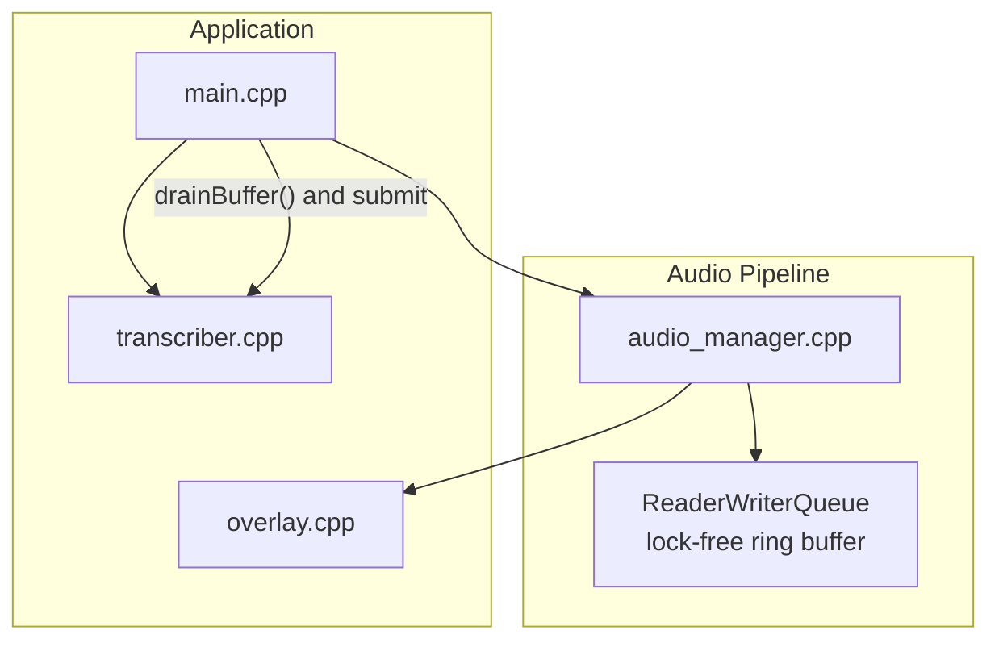
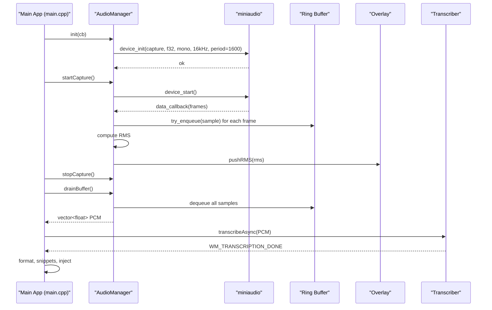
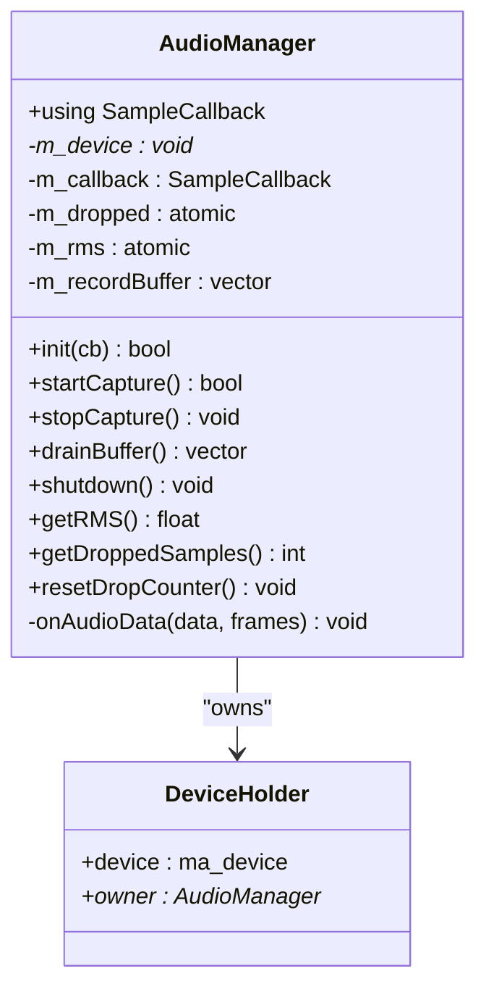
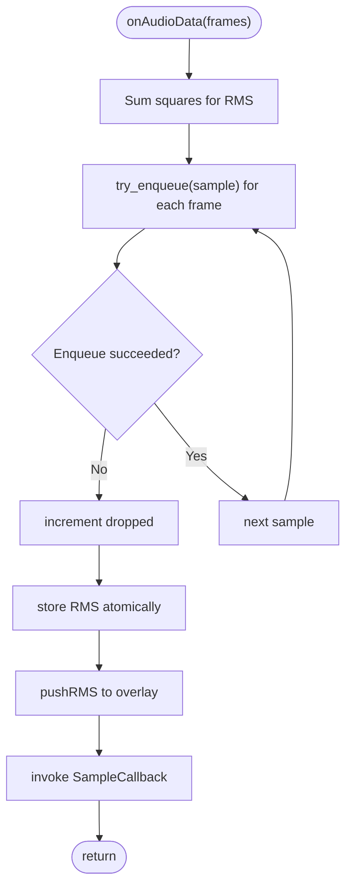
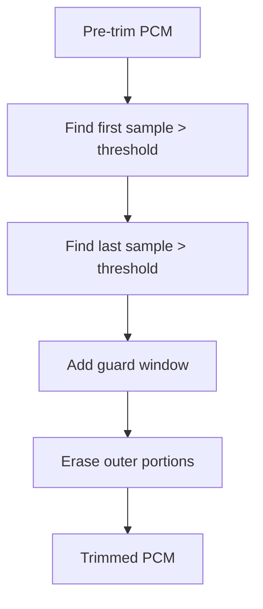
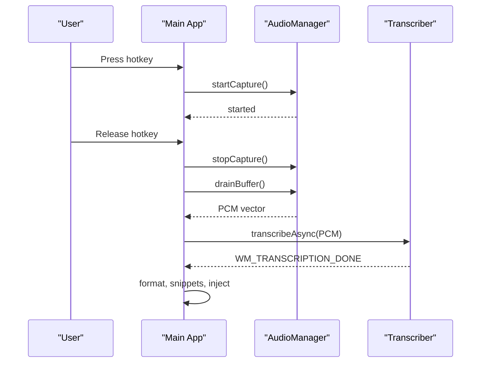
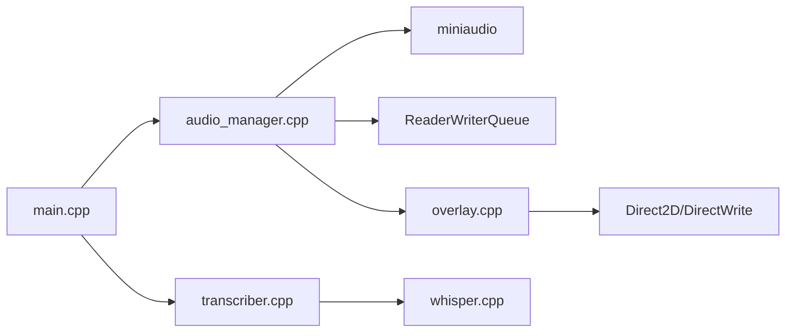

# Audio Manager

<cite>
**Referenced Files in This Document**
- [audio_manager.h](file://src/audio_manager.h)
- [audio_manager.cpp](file://src/audio_manager.cpp)
- [main.cpp](file://src/main.cpp)
- [transcriber.h](file://src/transcriber.h)
- [transcriber.cpp](file://src/transcriber.cpp)
- [overlay.h](file://src/overlay.h)
- [overlay.cpp](file://src/overlay.cpp)
- [CMakeLists.txt](file://CMakeLists.txt)
</cite>

## Table of Contents
1. [Introduction](#introduction)
2. [Project Structure](#project-structure)
3. [Core Components](#core-components)
4. [Architecture Overview](#architecture-overview)
5. [Detailed Component Analysis](#detailed-component-analysis)
6. [Dependency Analysis](#dependency-analysis)
7. [Performance Considerations](#performance-considerations)
8. [Troubleshooting Guide](#troubleshooting-guide)
9. [Conclusion](#conclusion)
10. [Appendices](#appendices)

## Introduction
This document explains the Audio Manager component responsible for PCM audio capture using the miniaudio library. It covers device initialization at 16 kHz mono sampling rate, a lock-free circular buffer for up to 30 seconds of audio storage, buffer draining mechanisms, and audio data transfer between threads. It also documents noise reduction techniques, RMS calculation for audio level monitoring, dropped sample detection, the callback-based architecture, thread safety considerations, performance optimization strategies, and practical integration with the transcription pipeline. Error handling, device enumeration, and fallback mechanisms for different audio hardware configurations are included.

## Project Structure
The Audio Manager is part of a Windows desktop application integrating audio capture, real-time overlay feedback, and asynchronous transcription. The relevant modules are:
- Audio Manager: captures microphone PCM, maintains a ring buffer, and exposes callbacks and metrics.
- Transcriber: performs offline transcription using whisper.cpp with performance tuning.
- Overlay: displays real-time audio level visualization and state transitions.
- Main application: orchestrates hotkey-driven recording, buffer draining, and transcription submission.

**Diagram sources**
- [audio_manager.cpp](file://src/audio_manager.cpp#L1-L122)
- [main.cpp](file://src/main.cpp#L149-L357)
- [overlay.cpp](file://src/overlay.cpp#L1-L659)
- [transcriber.cpp](file://src/transcriber.cpp#L1-L226)

**Section sources**
- [audio_manager.h](file://src/audio_manager.h#L1-L42)
- [audio_manager.cpp](file://src/audio_manager.cpp#L1-L122)
- [main.cpp](file://src/main.cpp#L1-L521)
- [overlay.h](file://src/overlay.h#L1-L94)
- [overlay.cpp](file://src/overlay.cpp#L1-L659)
- [transcriber.h](file://src/transcriber.h#L1-L29)
- [transcriber.cpp](file://src/transcriber.cpp#L1-L226)

## Core Components
- Audio Manager: Initializes the microphone at 16 kHz mono, manages a lock-free ring buffer, computes RMS, tracks dropped samples, and exposes a callback for immediate audio data delivery.
- Ring Buffer: A lock-free queue holding up to 480,000 float samples (30 seconds at 16 kHz), enabling efficient producer-consumer transfer from the audio thread to the main thread.
- Overlay: Receives RMS updates from the audio thread and renders a dynamic waveform visualization.
- Transcriber: Performs asynchronous transcription with performance optimizations and post-processing.

Key responsibilities:
- Initialize miniaudio capture device with specific format and period size.
- Enqueue PCM samples into the ring buffer and compute RMS per callback.
- Provide a drain operation to move buffered samples to the main thread for transcription.
- Expose metrics (RMS, dropped samples) for UI and gating logic.

**Section sources**
- [audio_manager.h](file://src/audio_manager.h#L9-L42)
- [audio_manager.cpp](file://src/audio_manager.cpp#L18-L122)
- [overlay.h](file://src/overlay.h#L18-L94)
- [overlay.cpp](file://src/overlay.cpp#L160-L163)
- [transcriber.h](file://src/transcriber.h#L10-L29)

## Architecture Overview
The audio capture pipeline is time-critical and thread-safe:
- The audio thread invokes a miniaudio callback that enqueues PCM samples into a lock-free queue and updates RMS.
- The main thread starts/stops capture, drains the ring buffer, and submits PCM to the transcriber.
- The overlay thread periodically renders the RMS waveform.

**Diagram sources**
- [audio_manager.cpp](file://src/audio_manager.cpp#L30-L56)
- [audio_manager.cpp](file://src/audio_manager.cpp#L58-L81)
- [audio_manager.cpp](file://src/audio_manager.cpp#L83-L100)
- [audio_manager.cpp](file://src/audio_manager.cpp#L102-L111)
- [main.cpp](file://src/main.cpp#L185-L274)
- [overlay.cpp](file://src/overlay.cpp#L160-L163)
- [transcriber.cpp](file://src/transcriber.cpp#L103-L225)

## Detailed Component Analysis

### Audio Manager Implementation
- Device Initialization:
  - Uses miniaudio capture device configured for float PCM, mono channel, 16 kHz sample rate, and a 1600-frame period (~100 ms).
  - Stores a DeviceHolder with a pointer to the AudioManager instance for callback routing.
- Callback-Based Architecture:
  - The miniaudio callback forwards to onAudioData, which:
    - Enqueues each sample into the lock-free ring buffer.
    - Increments a dropped sample counter when enqueue fails.
    - Computes RMS across the callback’s frames and stores it atomically.
    - Pushes RMS to the overlay for visualization.
    - Invokes the registered SampleCallback for immediate consumption.
- Buffer Management:
  - Pre-allocates a vector for up to 30 seconds of PCM to avoid frequent allocations.
  - startCapture clears the vector and resets the drop counter, and drains stale samples from the ring buffer.
  - drainBuffer transfers all queued samples into the pre-allocated vector and returns it to the caller.
- Metrics:
  - getRMS and getDroppedSamples are safe to read from any thread using relaxed atomics.
  - resetDropCounter allows resetting the drop counter after draining.

**Diagram sources**
- [audio_manager.h](file://src/audio_manager.h#L9-L42)
- [audio_manager.cpp](file://src/audio_manager.cpp#L24-L35)
- [audio_manager.cpp](file://src/audio_manager.cpp#L39-L56)

**Section sources**
- [audio_manager.h](file://src/audio_manager.h#L9-L42)
- [audio_manager.cpp](file://src/audio_manager.cpp#L18-L122)

### Circular Buffer Management
- Lock-Free Queue:
  - A static ReaderWriterQueue holds up to 480,000 float samples (16 kHz × 30 seconds).
  - Enqueue/dequeue operations are non-blocking; failures increment the dropped sample counter.
- Buffer Draining:
  - drainBuffer empties the queue into the pre-allocated vector and returns it.
  - The vector is reserved for the next session to minimize reallocation overhead.
- Thread Safety:
  - The audio thread enqueues from the miniaudio callback.
  - The main thread drains from the ring buffer and submits PCM to the transcriber.
  - Atomic counters and relaxed loads ensure safe cross-thread access to metrics.

**Diagram sources**
- [audio_manager.cpp](file://src/audio_manager.cpp#L39-L56)

**Section sources**
- [audio_manager.cpp](file://src/audio_manager.cpp#L18-L122)

### Noise Reduction and Audio Level Monitoring
- RMS Calculation:
  - The audio callback computes RMS across the captured frames and stores it atomically.
  - The overlay reads the RMS value to render a dynamic waveform visualization.
- Silence Trimming (Post-Capture):
  - The transcriber trims leading/trailing silence below a threshold and adds a guard window to avoid clipping onsets.
  - This reduces wasted computation and improves transcription quality for short utterances.

**Diagram sources**
- [transcriber.cpp](file://src/transcriber.cpp#L53-L77)

**Section sources**
- [audio_manager.cpp](file://src/audio_manager.cpp#L48-L52)
- [overlay.cpp](file://src/overlay.cpp#L274-L372)
- [transcriber.cpp](file://src/transcriber.cpp#L53-L77)

### Dropped Sample Detection
- Mechanism:
  - Each enqueue failure increments a relaxed atomic counter.
  - The main thread checks dropped samples after draining and gates transcription based on thresholds.
- Thresholds:
  - Minimum meaningful length and maximum allowable drop rate are used to decide whether to proceed with transcription.

**Section sources**
- [audio_manager.cpp](file://src/audio_manager.cpp#L44-L46)
- [main.cpp](file://src/main.cpp#L250-L264)

### Callback-Based Architecture and Thread Safety
- Callback Contract:
  - The SampleCallback is invoked from the miniaudio thread; keep it minimal and fast.
  - The audio thread also pushes RMS to the overlay and stores metrics atomically.
- Thread Safety:
  - Atomic variables for RMS and dropped samples enable relaxed reads from any thread.
  - The ring buffer is lock-free; the audio thread enqueues, the main thread dequeues.
  - Overlay uses atomic stores for RMS and a dedicated timer-driven render loop.

**Section sources**
- [audio_manager.h](file://src/audio_manager.h#L11-L15)
- [audio_manager.cpp](file://src/audio_manager.cpp#L39-L56)
- [overlay.h](file://src/overlay.h#L26-L27)
- [overlay.cpp](file://src/overlay.cpp#L160-L163)

### Integration with Transcription Pipeline
- Recording Lifecycle:
  - Hotkey triggers startCapture, recording continues until stopCapture is invoked.
  - The main thread drains the ring buffer and gates transcription based on length and drop count.
- Asynchronous Transcription:
  - The transcriber runs inference on a worker thread and posts completion via a window message.
  - The main thread formats output, applies snippets, and injects text into the active application.

**Diagram sources**
- [main.cpp](file://src/main.cpp#L185-L274)
- [audio_manager.cpp](file://src/audio_manager.cpp#L83-L111)
- [transcriber.cpp](file://src/transcriber.cpp#L103-L225)

**Section sources**
- [main.cpp](file://src/main.cpp#L185-L274)
- [audio_manager.cpp](file://src/audio_manager.cpp#L83-L111)
- [transcriber.cpp](file://src/transcriber.cpp#L103-L225)

### Practical Examples
- Audio Capture Setup:
  - Initialize the AudioManager with a SampleCallback and start capturing.
  - Use startCapture to arm recording and clear stale data; stopCapture to halt capture.
- Buffer Management:
  - After stopping, call drainBuffer to obtain the PCM vector for transcription.
  - The returned vector is moved to avoid copying large buffers.
- Integration with Transcription:
  - Submit the drained PCM to transcribeAsync; handle WM_TRANSCRIPTION_DONE to format and inject results.

**Section sources**
- [audio_manager.cpp](file://src/audio_manager.cpp#L58-L81)
- [audio_manager.cpp](file://src/audio_manager.cpp#L83-L111)
- [main.cpp](file://src/main.cpp#L244-L274)
- [transcriber.cpp](file://src/transcriber.cpp#L103-L225)

### Error Handling, Device Enumeration, and Fallbacks
- Device Initialization Failure:
  - If miniaudio device initialization fails, the init method returns false; the application displays an error dialog advising microphone connection and permissions.
- Overlay Initialization:
  - Overlay initialization failure is non-fatal; the application continues without overlay visuals.
- Model Loading:
  - Whisper model loading attempts GPU first, falling back to CPU silently if GPU initialization fails.
- Hotkey Fallback:
  - If the preferred hotkey Alt+V is unavailable, the application tries Alt+Shift+V and updates the tray tooltip accordingly.

**Section sources**
- [audio_manager.cpp](file://src/audio_manager.cpp#L74-L77)
- [main.cpp](file://src/main.cpp#L436-L444)
- [main.cpp](file://src/main.cpp#L449-L457)
- [main.cpp](file://src/main.cpp#L462-L475)
- [main.cpp](file://src/main.cpp#L162-L178)

## Dependency Analysis
- External Libraries:
  - miniaudio: audio capture backend.
  - whisper.cpp: transcription engine.
  - Direct2D/DirectWrite: overlay rendering.
- Internal Dependencies:
  - audio_manager depends on miniaudio and a lock-free queue.
  - main coordinates audio, overlay, and transcription.
  - overlay consumes RMS updates from audio_manager.
  - transcriber depends on whisper.cpp.

**Diagram sources**
- [audio_manager.cpp](file://src/audio_manager.cpp#L7-L8)
- [main.cpp](file://src/main.cpp#L19-L26)
- [overlay.cpp](file://src/overlay.cpp#L1-L15)
- [transcriber.cpp](file://src/transcriber.cpp#L3)
- [CMakeLists.txt](file://CMakeLists.txt#L84-L94)

**Section sources**
- [CMakeLists.txt](file://CMakeLists.txt#L32-L51)
- [CMakeLists.txt](file://CMakeLists.txt#L84-L94)

## Performance Considerations
- Miniaudio Period Size:
  - 1600 frames (~100 ms) balances latency and CPU usage.
- Lock-Free Ring Buffer:
  - Avoids mutex contention; enqueues/dequeues are non-blocking.
- Pre-allocated Vector:
  - Reduces allocation churn for up to 30 seconds of PCM.
- Transcription Optimizations:
  - Single-threaded decoding with greedy parameters, reduced audio context based on duration, and trimming silence to reduce compute.
- GPU/CPU Fallback:
  - Attempts GPU acceleration first, falling back to CPU silently.

**Section sources**
- [audio_manager.cpp](file://src/audio_manager.cpp#L72-L72)
- [audio_manager.cpp](file://src/audio_manager.cpp#L61-L61)
- [transcriber.cpp](file://src/transcriber.cpp#L138-L178)
- [transcriber.cpp](file://src/transcriber.cpp#L82-L91)

## Troubleshooting Guide
- Microphone Access Denied:
  - Ensure microphone is connected and privacy settings allow the application access.
- Audio Initialization Failure:
  - Verify device availability and permissions; the application displays an error dialog on failure.
- Low Transcription Quality:
  - Check for excessive dropped samples; if too many drops occur, transcription is gated.
  - Ensure sufficient recording length; very short recordings are ignored.
- Overlay Issues:
  - Overlay initialization failure is non-fatal; the application continues without visuals.
- GPU Model Load Failure:
  - The transcriber falls back to CPU if GPU initialization fails.

**Section sources**
- [main.cpp](file://src/main.cpp#L436-L444)
- [main.cpp](file://src/main.cpp#L449-L457)
- [main.cpp](file://src/main.cpp#L462-L475)
- [main.cpp](file://src/main.cpp#L250-L264)

## Conclusion
The Audio Manager provides a robust, time-critical PCM capture pipeline at 16 kHz mono using miniaudio. Its lock-free ring buffer efficiently transfers audio data between threads, while RMS computation and dropped sample detection support real-time feedback and gating logic. Integrated with the overlay and transcription pipeline, it delivers a responsive and performant speech-to-text experience with sensible fallbacks and optimizations.

## Appendices

### API Summary
- AudioManager
  - init(cb): Opens the microphone at 16 kHz mono; registers a callback invoked from the audio thread.
  - startCapture(): Arms recording and drains stale ring buffer samples.
  - stopCapture(): Stops the device.
  - drainBuffer(): Moves buffered samples into a vector for transcription.
  - getRMS()/getDroppedSamples()/resetDropCounter(): Access metrics safely from any thread.
  - shutdown(): Releases the device and cleans up.

**Section sources**
- [audio_manager.h](file://src/audio_manager.h#L11-L33)
- [audio_manager.cpp](file://src/audio_manager.cpp#L58-L122)