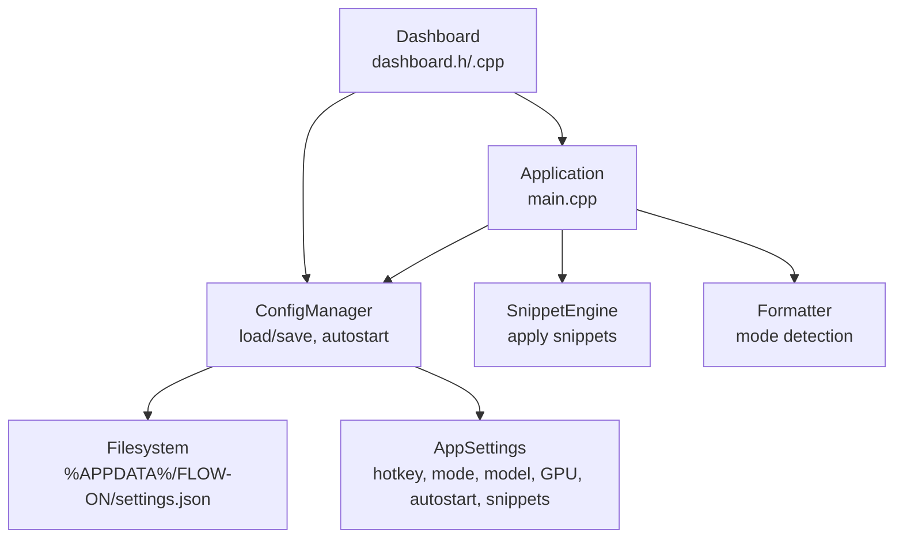
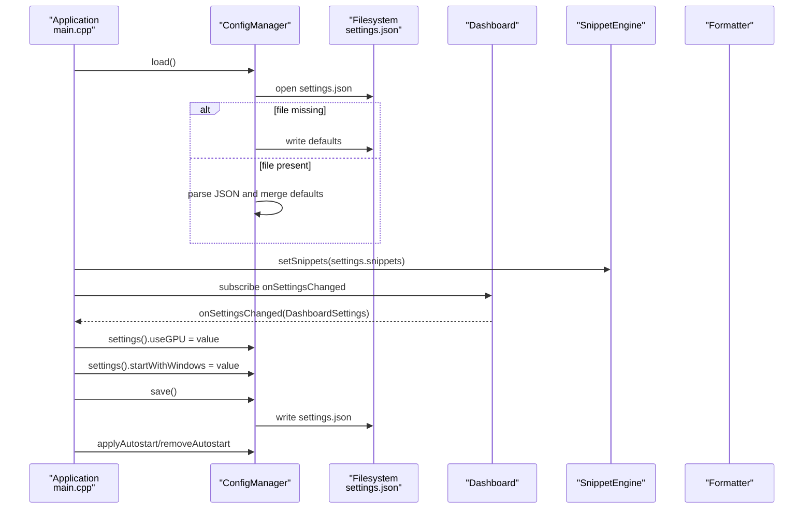
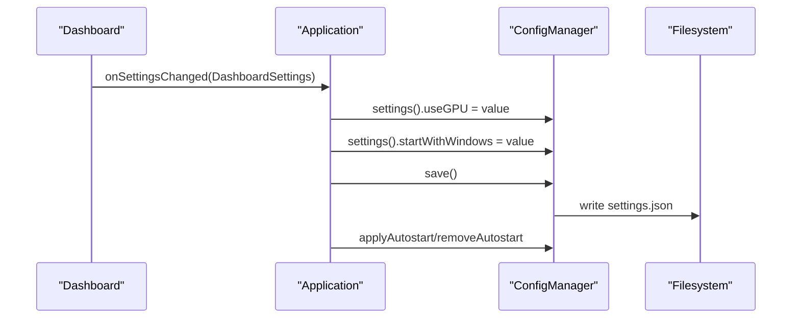
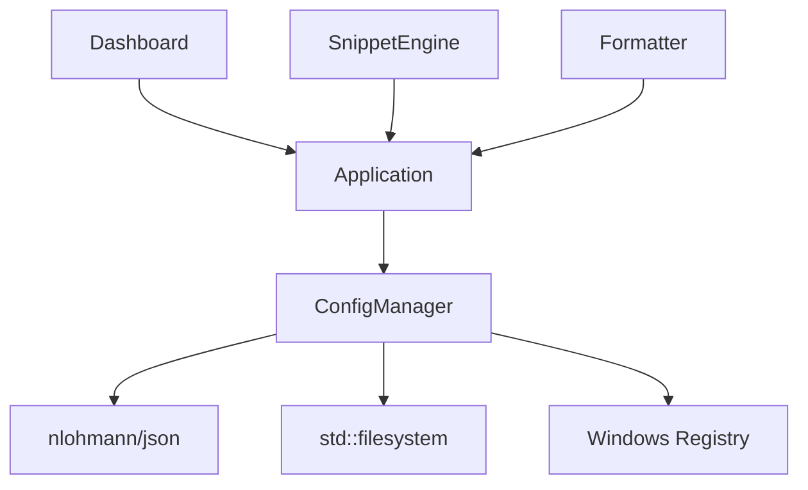

# Configuration Manager

<cite>
**Referenced Files in This Document**
- [config_manager.h](file://src/config_manager.h)
- [config_manager.cpp](file://src/config_manager.cpp)
- [main.cpp](file://src/main.cpp)
- [dashboard.h](file://src/dashboard.h)
- [dashboard.cpp](file://src/dashboard.cpp)
- [formatter.h](file://src/formatter.h)
- [snippet_engine.h](file://src/snippet_engine.h)
- [snippet_engine.cpp](file://src/snippet_engine.cpp)
- [settings.default.json](file://assets/settings.default.json)
- [README.md](file://README.md)
- [PERFORMANCE.md](file://PERFORMANCE.md)
</cite>

## Table of Contents
1. [Introduction](#introduction)
2. [Project Structure](#project-structure)
3. [Core Components](#core-components)
4. [Architecture Overview](#architecture-overview)
5. [Detailed Component Analysis](#detailed-component-analysis)
6. [Dependency Analysis](#dependency-analysis)
7. [Performance Considerations](#performance-considerations)
8. [Troubleshooting Guide](#troubleshooting-guide)
9. [Conclusion](#conclusion)
10. [Appendices](#appendices)

## Introduction
This document provides a comprehensive guide to the Configuration Manager component responsible for JSON-based settings persistence, runtime updates, and integration with the dashboard and application subsystems. It covers schema handling, default value management, migration behavior, change notifications, atomic updates, and consistency guarantees. It also documents settings categories (hotkey preferences, model selection, text formatting options, and performance tuning parameters), integration with the dashboard, synchronization mechanisms, and user preference management. Practical examples for loading, modifying, and backing up/restoring configuration are included, along with security considerations for sensitive settings and cross-user compatibility.

## Project Structure
The Configuration Manager is implemented as a standalone component with clear boundaries:
- Settings data model and persistence logic are encapsulated in a dedicated class.
- The application loads settings at startup, applies them to subsystems, and persists changes when the dashboard requests updates.
- The dashboard exposes a settings change event that the application subscribes to, enabling synchronized updates.

**Diagram sources**
- [config_manager.h](file://src/config_manager.h#L21-L39)
- [config_manager.cpp](file://src/config_manager.cpp#L24-L80)
- [main.cpp](file://src/main.cpp#L60-L60)
- [dashboard.h](file://src/dashboard.h#L36-L68)
- [dashboard.cpp](file://src/dashboard.cpp#L481-L493)

**Section sources**
- [config_manager.h](file://src/config_manager.h#L1-L40)
- [config_manager.cpp](file://src/config_manager.cpp#L1-L108)
- [main.cpp](file://src/main.cpp#L409-L493)
- [dashboard.h](file://src/dashboard.h#L36-L68)
- [dashboard.cpp](file://src/dashboard.cpp#L481-L493)

## Core Components
- AppSettings: The in-memory representation of persisted settings, including hotkey string, mode string, model identifier, GPU toggle, autostart toggle, and a snippet map.
- ConfigManager: Encapsulates loading, saving, and applying autostart registry entries. It manages the settings file path and performs safe JSON serialization/deserialization.

Key responsibilities:
- Load settings from %APPDATA%\FLOW-ON\settings.json, creating defaults if missing.
- Save settings back to disk atomically via JSON serialization.
- Apply or remove HKCU Run registry keys for autostart behavior.
- Provide thread-safe accessors to the settings object.

**Section sources**
- [config_manager.h](file://src/config_manager.h#L8-L19)
- [config_manager.h](file://src/config_manager.h#L21-L39)
- [config_manager.cpp](file://src/config_manager.cpp#L24-L80)
- [config_manager.cpp](file://src/config_manager.cpp#L82-L107)

## Architecture Overview
The configuration lifecycle spans application startup, runtime updates, and persistence:

**Diagram sources**
- [main.cpp](file://src/main.cpp#L409-L415)
- [main.cpp](file://src/main.cpp#L410-L410)
- [main.cpp](file://src/main.cpp#L481-L493)
- [config_manager.cpp](file://src/config_manager.cpp#L24-L58)
- [config_manager.cpp](file://src/config_manager.cpp#L60-L80)
- [config_manager.cpp](file://src/config_manager.cpp#L82-L107)

## Detailed Component Analysis

### JSON Schema Validation and Default Value Management
- Schema handling: The loader reads known keys and ignores unknown keys. If the file is missing or corrupted, defaults are written and loaded.
- Default values: Defaults are defined in the AppSettings struct and in the default template file.
- Migration behavior: The loader merges persisted values with defaults, preserving unknown keys and ignoring invalid types.

Validation and defaults:
- Keys checked: hotkey, mode, model, use_gpu, start_with_windows, snippets.
- Unknown keys are ignored; no explicit schema enforcement is performed.
- Default template: The default JSON template defines initial values for hotkey, mode, model, GPU toggle, autostart, and snippets.

Security considerations:
- Snippet values are sanitized to a maximum length to mitigate potential abuse.

**Section sources**
- [config_manager.cpp](file://src/config_manager.cpp#L33-L56)
- [config_manager.h](file://src/config_manager.h#L8-L19)
- [settings.default.json](file://assets/settings.default.json#L1-L16)

### Runtime Configuration Updates and Consistency Guarantees
- Change notifications: The dashboard exposes an onSettingsChanged callback. The application subscribes to it and updates in-memory settings immediately.
- Atomic updates: The save operation writes a complete JSON document to disk. While the code does not implement a separate temporary file and rename strategy, the single-file write minimizes partial writes.
- Consistency guarantees: The application updates settings in memory first, then persists to disk. Autostart changes are applied immediately after saving.

**Diagram sources**
- [dashboard.h](file://src/dashboard.h#L56-L56)
- [dashboard.cpp](file://src/dashboard.cpp#L481-L493)
- [config_manager.cpp](file://src/config_manager.cpp#L60-L80)
- [config_manager.cpp](file://src/config_manager.cpp#L82-L107)

**Section sources**
- [dashboard.h](file://src/dashboard.h#L56-L56)
- [dashboard.cpp](file://src/dashboard.cpp#L481-L493)
- [config_manager.cpp](file://src/config_manager.cpp#L60-L80)
- [config_manager.cpp](file://src/config_manager.cpp#L82-L107)

### Settings Categories

#### Hotkey Preferences
- Hotkey string: A string representation of the hotkey used by the application’s hotkey registration.
- Behavior: The hotkey is registered at startup; conflicts are handled by falling back to an alternate combination.

Integration:
- The hotkey string is used by the application’s hotkey registration logic.

**Section sources**
- [config_manager.h](file://src/config_manager.h#L9-L9)
- [main.cpp](file://src/main.cpp#L162-L178)

#### Model Selection
- Model identifier: A string identifying the selected Whisper model.
- GPU toggle: A boolean controlling GPU acceleration availability.
- Integration: The model path is constructed at runtime and passed to the transcriber.

**Section sources**
- [config_manager.h](file://src/config_manager.h#L10-L12)
- [main.cpp](file://src/main.cpp#L133-L144)

#### Text Formatting Options
- Mode string: Determines formatting behavior (auto/prose/code).
- Integration: The mode string influences formatter behavior and snippet application.

**Section sources**
- [config_manager.h](file://src/config_manager.h#L10-L10)
- [formatter.h](file://src/formatter.h#L5-L5)
- [main.cpp](file://src/main.cpp#L301-L303)

#### Performance Tuning Parameters
- GPU toggle: Controls GPU acceleration availability.
- Autostart toggle: Controls whether the application starts with Windows.
- Additional performance parameters are tuned in the transcriber and documented separately.

**Section sources**
- [config_manager.h](file://src/config_manager.h#L12-L13)
- [PERFORMANCE.md](file://PERFORMANCE.md#L1-L196)

### Integration with the Dashboard Interface
- Settings synchronization: The dashboard exposes onSettingsChanged, which the application subscribes to. On receiving a settings update, the application updates in-memory settings, persists them, and applies autostart changes.
- User preference management: The dashboard UI controls useGPU and startWithWindows; these values are propagated to the configuration manager and saved.

**Section sources**
- [dashboard.h](file://src/dashboard.h#L56-L56)
- [dashboard.cpp](file://src/dashboard.cpp#L481-L493)
- [main.cpp](file://src/main.cpp#L481-L493)

### Snippet Engine Integration
- Snippet storage: Snippets are stored as a map in settings and applied after transcription formatting.
- Application: At startup, snippets are loaded into the snippet engine. During runtime, dashboard updates propagate to the configuration manager, which persists them.

**Section sources**
- [config_manager.h](file://src/config_manager.h#L14-L18)
- [config_manager.cpp](file://src/config_manager.cpp#L43-L51)
- [main.cpp](file://src/main.cpp#L410-L410)
- [snippet_engine.h](file://src/snippet_engine.h#L9-L11)
- [snippet_engine.cpp](file://src/snippet_engine.cpp#L6-L28)

### Practical Examples

#### Loading Configuration at Startup
- The application loads settings, initializes snippets, and applies autostart if enabled.

Example path:
- [main.cpp](file://src/main.cpp#L409-L415)

**Section sources**
- [main.cpp](file://src/main.cpp#L409-L415)

#### Modifying Settings via Dashboard
- The dashboard emits onSettingsChanged with DashboardSettings. The application updates in-memory settings, saves, and applies autostart changes.

Example path:
- [dashboard.cpp](file://src/dashboard.cpp#L481-L493)
- [main.cpp](file://src/main.cpp#L481-L493)

#### Backup and Restore Procedures
- Backup: Copy %APPDATA%\FLOW-ON\settings.json to another location.
- Restore: Replace settings.json with the backed-up file and restart the application.

Example path:
- [config_manager.cpp](file://src/config_manager.cpp#L15-L22)

**Section sources**
- [config_manager.cpp](file://src/config_manager.cpp#L15-L22)

### Security Considerations
- Sensitive settings: None of the current settings are marked as sensitive. The configuration file contains only user preferences and identifiers.
- Encryption: There is no encryption of stored data in the configuration file.
- Permissions: The settings file resides in the user profile directory (%APPDATA%\FLOW-ON). Cross-user compatibility is not supported; each user maintains their own settings.
- Input sanitization: Snippet values are truncated to a maximum length to mitigate potential abuse.

**Section sources**
- [config_manager.cpp](file://src/config_manager.cpp#L46-L49)
- [README.md](file://README.md#L161-L194)

## Dependency Analysis
The Configuration Manager depends on:
- JSON library for serialization/deserialization.
- Windows APIs for filesystem and registry operations.
- The application’s subsystems for applying settings (autostart, snippets, formatter).

**Diagram sources**
- [config_manager.cpp](file://src/config_manager.cpp#L2-L10)
- [main.cpp](file://src/main.cpp#L26-L26)
- [dashboard.cpp](file://src/dashboard.cpp#L481-L493)

**Section sources**
- [config_manager.cpp](file://src/config_manager.cpp#L2-L10)
- [main.cpp](file://src/main.cpp#L26-L26)
- [dashboard.cpp](file://src/dashboard.cpp#L481-L493)

## Performance Considerations
- Persistence cost: Settings are saved synchronously on each change. This is lightweight given the small JSON size.
- Autostart operations: Registry writes occur on demand (after save) and are infrequent.
- Snippet processing: Snippet replacement occurs after transcription formatting and is bounded by snippet count and text length.

[No sources needed since this section provides general guidance]

## Troubleshooting Guide
- Settings file not found: On first run, the file is created with defaults. If missing later, restore from backup or reinstall.
- Corrupted settings: On JSON parse failure, defaults are restored and saved.
- Autostart not working: Verify registry key presence and permissions; ensure the application path is correct.
- Snippet issues: Ensure snippet values are within the allowed length; verify snippet triggers are correctly defined.

**Section sources**
- [config_manager.cpp](file://src/config_manager.cpp#L28-L31)
- [config_manager.cpp](file://src/config_manager.cpp#L52-L56)
- [config_manager.cpp](file://src/config_manager.cpp#L82-L107)
- [config_manager.cpp](file://src/config_manager.cpp#L46-L49)

## Conclusion
The Configuration Manager provides a robust, JSON-based persistence layer with sensible defaults, graceful error handling, and seamless integration with the dashboard and application subsystems. While the current implementation does not enforce strict schema validation or encrypt sensitive data, it offers a clear path for future enhancements, including schema validation, migration hooks, and optional encryption. The component’s design supports atomic updates, runtime synchronization, and cross-user isolation.

[No sources needed since this section summarizes without analyzing specific files]

## Appendices

### Settings Categories Reference
- Hotkey preferences: hotkey string used for registration.
- Model selection: model identifier and GPU toggle.
- Text formatting options: mode string influencing formatter behavior.
- Performance tuning parameters: GPU toggle and autostart toggle.
- Snippets: key-value pairs for text substitution.

**Section sources**
- [config_manager.h](file://src/config_manager.h#L8-L19)
- [PERFORMANCE.md](file://PERFORMANCE.md#L1-L196)

### Configuration File Location and Permissions
- Location: %APPDATA%\FLOW-ON\settings.json
- Permissions: Controlled by user profile; cross-user compatibility is not supported.

**Section sources**
- [config_manager.cpp](file://src/config_manager.cpp#L15-L22)