# Core Components

<cite>
**Referenced Files in This Document**
- [main.cpp](file://src/main.cpp)
- [audio_manager.h](file://src/audio_manager.h)
- [audio_manager.cpp](file://src/audio_manager.cpp)
- [transcriber.h](file://src/transcriber.h)
- [transcriber.cpp](file://src/transcriber.cpp)
- [overlay.h](file://src/overlay.h)
- [overlay.cpp](file://src/overlay.cpp)
- [formatter.h](file://src/formatter.h)
- [formatter.cpp](file://src/formatter.cpp)
- [injector.h](file://src/injector.h)
- [injector.cpp](file://src/injector.cpp)
- [dashboard.h](file://src/dashboard.h)
- [dashboard.cpp](file://src/dashboard.cpp)
- [snippet_engine.h](file://src/snippet_engine.cpp)
- [snippet_engine.cpp](file://src/snippet_engine.cpp)
- [config_manager.h](file://src/config_manager.cpp)
- [config_manager.cpp](file://src/config_manager.cpp)
</cite>

## Table of Contents
1. [Introduction](#introduction)
2. [Project Structure](#project-structure)
3. [Core Components](#core-components)
4. [Architecture Overview](#architecture-overview)
5. [Detailed Component Analysis](#detailed-component-analysis)
6. [Dependency Analysis](#dependency-analysis)
7. [Performance Considerations](#performance-considerations)
8. [Troubleshooting Guide](#troubleshooting-guide)
9. [Conclusion](#conclusion)

## Introduction
This document explains the core functional modules that make up Flow-On. It focuses on how each component fulfills its role, how they integrate, and how data flows through the system. The components covered include:
- Audio Manager: PCM capture, buffer management, and RMS-driven overlay feedback
- Transcriber: Whisper integration, GPU acceleration setup, and asynchronous processing
- Overlay: Direct2D rendering, layered window compositing, and animation framework
- Formatter: Regex-based text cleaning and context-aware formatting
- Injector: Text injection via SendInput with clipboard fallback
- Dashboard: Win32 and WinUI 3 integration for settings and history
- Snippet Engine: Case-insensitive substitution and expansion
- Configuration Manager: JSON-based settings persistence and runtime updates

## Project Structure
Flow-On is a Win32 application with modular subsystems. The main entry point coordinates initialization, lifecycle, and inter-module communication via Windows messages and shared state.

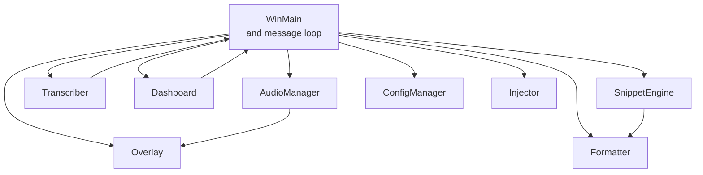

**Diagram sources**
- [main.cpp](file://src/main.cpp#L362-L520)
- [audio_manager.cpp](file://src/audio_manager.cpp#L58-L81)
- [transcriber.cpp](file://src/transcriber.cpp#L79-L93)
- [overlay.cpp](file://src/overlay.cpp#L29-L74)
- [dashboard.cpp](file://src/dashboard.cpp#L394-L407)
- [snippet_engine.cpp](file://src/snippet_engine.cpp#L6-L28)
- [config_manager.cpp](file://src/config_manager.cpp#L24-L58)
- [injector.cpp](file://src/injector.cpp#L49-L74)
- [formatter.cpp](file://src/formatter.cpp#L137-L147)

**Section sources**
- [main.cpp](file://src/main.cpp#L362-L520)

## Core Components
This section documents each core component’s purpose, implementation approach, and integration points.

- Audio Manager
  - Purpose: Capture 16 kHz mono PCM via miniaudio, maintain a lock-free ring buffer, compute RMS, and feed overlay visuals.
  - Implementation: Device initialization, enqueueing samples into a bounded queue, RMS computation, and draining buffered PCM on demand.
  - Integration: Exposes callbacks and metrics consumed by Overlay and Transcriber; integrates with main loop via hotkey and timers.

- Transcriber
  - Purpose: Asynchronously transcribe PCM to text using whisper.cpp with performance tuning and GPU acceleration.
  - Implementation: Single-flight async processing, trimming silence, configuring decoding parameters, and deduplicating hallucinated repetitions.
  - Integration: Receives PCM from Audio Manager, posts completion message to main loop, and returns results to Formatter.

- Overlay
  - Purpose: Provide a floating, always-on-top Direct2D pill overlay with layered window compositing and smooth animations.
  - Implementation: Timer-driven drawing, layered window presentation, and state-driven animations (recording, processing, done/error).
  - Integration: Consumes RMS from Audio Manager; main loop sets state transitions.

- Formatter
  - Purpose: Clean and normalize transcription text with regex passes and context-aware transforms.
  - Implementation: Four-pass pipeline (fillers, cleanup, punctuation, coding transforms) with mode detection.
  - Integration: Applied after transcription; feeds Injector and Dashboard.

- Injector
  - Purpose: Inject processed text into the active application using SendInput when safe; otherwise use clipboard fallback.
  - Implementation: Surrogate detection, clipboard setup, and synthesized Ctrl+V.
  - Integration: Called from main loop after formatting and snippet expansion.

- Dashboard
  - Purpose: Display recent transcriptions with latency badges and settings management; supports WinUI 3 integration path.
  - Implementation: Direct2D window with animated list, history snapshot/clear APIs, and settings change handler.
  - Integration: Receives entries from main loop; settings changes propagate to ConfigManager.

- Snippet Engine
  - Purpose: Expand user-defined triggers into values with case-insensitive matching.
  - Implementation: Lowercased search and replacement across the input.
  - Integration: Runs after formatting; precedes injection.

- Configuration Manager
  - Purpose: Persist and load settings to/from JSON; manage autostart registry entries.
  - Implementation: Settings path resolution, JSON serialization/deserialization, and registry manipulation.
  - Integration: Loaded at startup; settings propagated to other modules; saved on changes.

**Section sources**
- [audio_manager.h](file://src/audio_manager.h#L9-L41)
- [audio_manager.cpp](file://src/audio_manager.cpp#L58-L122)
- [transcriber.h](file://src/transcriber.h#L10-L28)
- [transcriber.cpp](file://src/transcriber.cpp#L79-L226)
- [overlay.h](file://src/overlay.h#L18-L93)
- [overlay.cpp](file://src/overlay.cpp#L29-L659)
- [formatter.h](file://src/formatter.h#L4-L13)
- [formatter.cpp](file://src/formatter.cpp#L137-L148)
- [injector.h](file://src/injector.h#L4-L8)
- [injector.cpp](file://src/injector.cpp#L49-L74)
- [dashboard.h](file://src/dashboard.h#L36-L68)
- [dashboard.cpp](file://src/dashboard.cpp#L394-L454)
- [snippet_engine.cpp](file://src/snippet_engine.cpp#L6-L82)
- [config_manager.cpp](file://src/config_manager.cpp#L24-L108)

## Architecture Overview
The system follows a message-driven Win32 architecture with a finite state machine controlling capture, transcription, formatting, injection, and UI feedback.

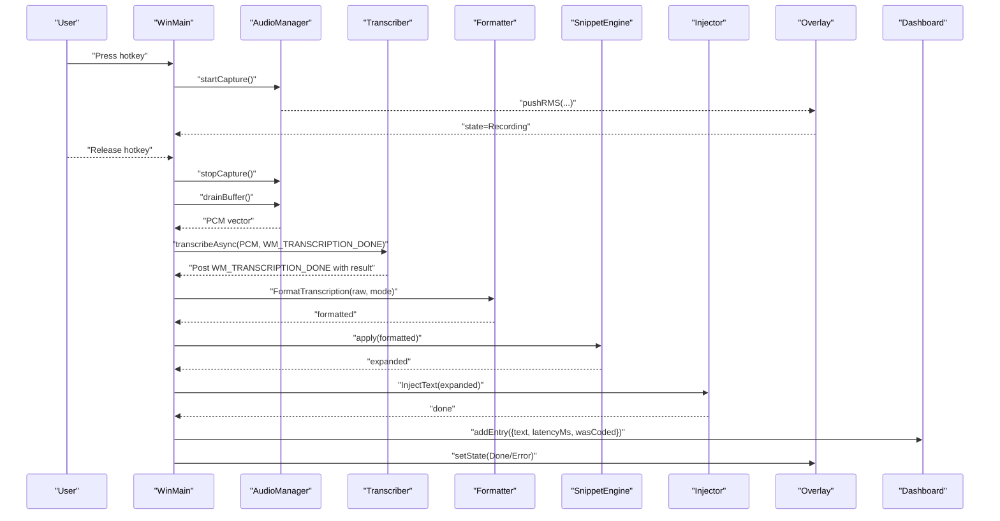

**Diagram sources**
- [main.cpp](file://src/main.cpp#L185-L342)
- [audio_manager.cpp](file://src/audio_manager.cpp#L83-L111)
- [transcriber.cpp](file://src/transcriber.cpp#L103-L225)
- [formatter.cpp](file://src/formatter.cpp#L137-L147)
- [snippet_engine.cpp](file://src/snippet_engine.cpp#L6-L28)
- [injector.cpp](file://src/injector.cpp#L49-L74)
- [overlay.cpp](file://src/overlay.cpp#L140-L158)
- [dashboard.cpp](file://src/dashboard.cpp#L428-L439)

## Detailed Component Analysis

### Audio Manager
- Role: Captures PCM at 16 kHz mono, maintains a lock-free ring buffer, computes RMS, and exposes a drain method for downstream consumers.
- Key behaviors:
  - Initialization with miniaudio capture device and periodic callbacks.
  - Enqueues samples into a bounded queue; tracks dropped samples.
  - Computes RMS per callback and pushes it to Overlay.
  - Drains buffered PCM to the caller for transcription.
- Integration points:
  - Overlay reads RMS atomically.
  - Transcriber consumes drained PCM.
  - Main loop coordinates start/stop and timing.

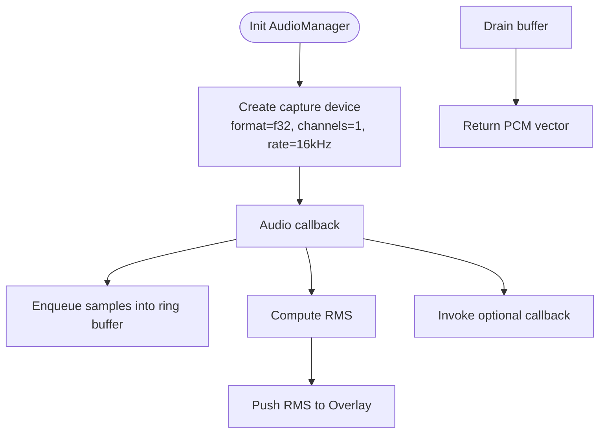

**Diagram sources**
- [audio_manager.cpp](file://src/audio_manager.cpp#L58-L111)
- [overlay.cpp](file://src/overlay.cpp#L160-L163)

**Section sources**
- [audio_manager.h](file://src/audio_manager.h#L9-L41)
- [audio_manager.cpp](file://src/audio_manager.cpp#L58-L122)

### Transcriber
- Role: Asynchronously transcribes PCM to text using whisper.cpp with aggressive performance tuning and GPU fallback.
- Key behaviors:
  - Initializes whisper context with GPU enabled; falls back to CPU if needed.
  - Single-flight guard prevents overlapping transcription.
  - Trims silence to reduce compute and improve quality.
  - Configures decoding parameters for speed and minimal context.
  - Deduplicates hallucinated repetitions post-inference.
  - Posts completion message with result string pointer (caller deletes).
- Integration points:
  - Receives PCM from Audio Manager.
  - Communicates completion to main loop via message.
  - Produces normalized text for Formatter.

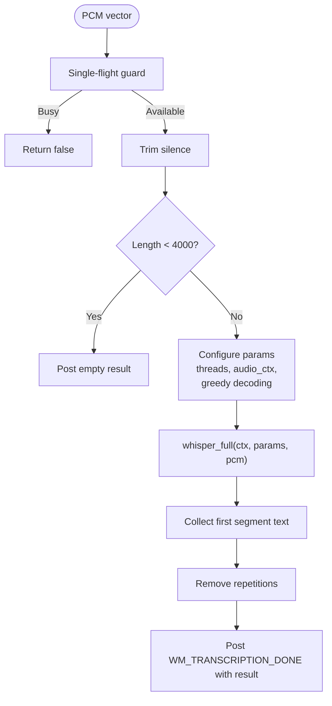

**Diagram sources**
- [transcriber.cpp](file://src/transcriber.cpp#L103-L225)

**Section sources**
- [transcriber.h](file://src/transcriber.h#L10-L28)
- [transcriber.cpp](file://src/transcriber.cpp#L79-L226)

### Overlay
- Role: Renders a floating pill overlay with Direct2D and UpdateLayeredWindow, driven by a timer.
- Key behaviors:
  - Creates GDI DIB and DC render target; binds each frame.
  - Maintains state machine (Hidden, Recording, Processing, Done, Error).
  - Implements smooth animations: appear/disappear, recording waveform, processing spinner, done/error icons.
  - Presents via UpdateLayeredWindow with per-pixel alpha.
- Integration points:
  - Consumes RMS from Audio Manager.
  - Main loop updates state based on system actions.

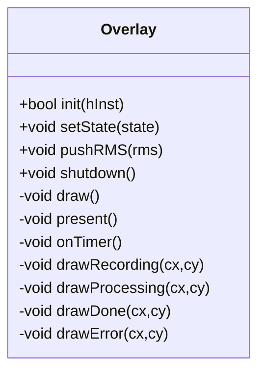

**Diagram sources**
- [overlay.h](file://src/overlay.h#L18-L93)
- [overlay.cpp](file://src/overlay.cpp#L29-L659)

**Section sources**
- [overlay.h](file://src/overlay.h#L18-L93)
- [overlay.cpp](file://src/overlay.cpp#L29-L659)

### Formatter
- Role: Cleans and normalizes transcription text using regex passes and mode-specific transforms.
- Key behaviors:
  - Pass 1: Strip universal fillers globally.
  - Pass 2: Strip sentence-start fillers with anchoring.
  - Pass 3: Normalize spacing, trim, remove leading punctuation, capitalize first letter.
  - Pass 4: Add trailing punctuation if missing.
  - Mode-dependent transforms (coding mode): camelCase, snake_case, ALL_CAPS.
- Integration points:
  - Receives raw or formatted text and returns cleaned text.
  - Used by main loop prior to snippet expansion and injection.

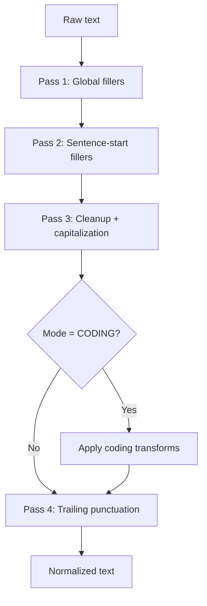

**Diagram sources**
- [formatter.cpp](file://src/formatter.cpp#L137-L147)

**Section sources**
- [formatter.h](file://src/formatter.h#L4-L13)
- [formatter.cpp](file://src/formatter.cpp#L137-L148)

### Injector
- Role: Injects processed text into the active application using SendInput when feasible; otherwise uses clipboard fallback.
- Key behaviors:
  - Detects surrogate pairs and long strings to choose fallback path.
  - Uses clipboard data and synthetic Ctrl+V for broad compatibility.
  - Sends Unicode key events for short, pure BMP text.
- Integration points:
  - Called from main loop after formatting and snippet expansion.

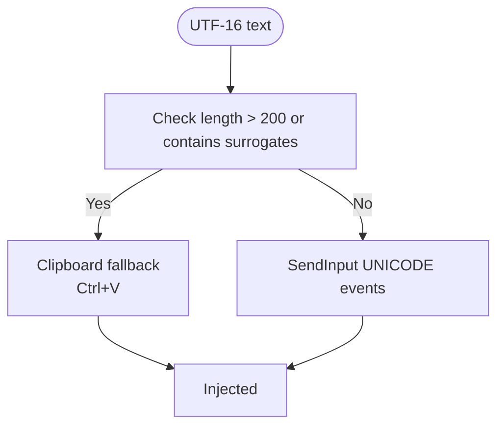

**Diagram sources**
- [injector.cpp](file://src/injector.cpp#L49-L74)

**Section sources**
- [injector.h](file://src/injector.h#L4-L8)
- [injector.cpp](file://src/injector.cpp#L49-L74)

### Dashboard
- Role: Displays recent transcriptions with latency badges and manages settings; supports WinUI 3 integration path.
- Key behaviors:
  - Direct2D window with animated list and glass-like styling.
  - History snapshot/clear APIs; thread-safe addition of entries.
  - Settings change handler updates runtime configuration and persists to disk.
- Integration points:
  - Receives entries from main loop; settings changes propagate to ConfigManager.

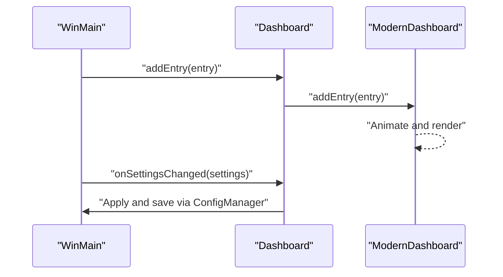

**Diagram sources**
- [dashboard.cpp](file://src/dashboard.cpp#L394-L454)
- [main.cpp](file://src/main.cpp#L481-L493)

**Section sources**
- [dashboard.h](file://src/dashboard.h#L36-L68)
- [dashboard.cpp](file://src/dashboard.cpp#L394-L454)

### Snippet Engine
- Role: Expands user-defined triggers into values with case-insensitive matching.
- Key behaviors:
  - Lowercases input and triggers for comparison.
  - Replaces all occurrences of triggers with values.
  - Updates lowercased index to avoid overlapping matches.
- Integration points:
  - Runs after formatting; precedes injection.

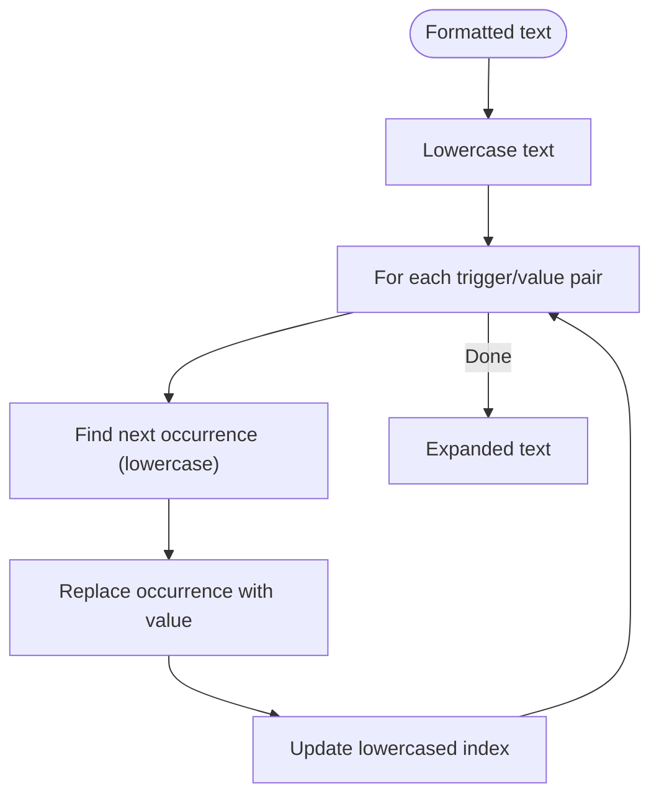

**Diagram sources**
- [snippet_engine.cpp](file://src/snippet_engine.cpp#L6-L28)

**Section sources**
- [snippet_engine.cpp](file://src/snippet_engine.cpp#L6-L82)

### Configuration Manager
- Role: Persists and loads application settings to/from JSON; manages autostart registry entries.
- Key behaviors:
  - Resolves settings path under APPDATA/FLOW-ON.
  - Loads existing JSON or writes defaults on first run.
  - Applies and removes autostart entries via registry.
- Integration points:
  - Loaded at startup; settings propagated to other modules; saved on changes.

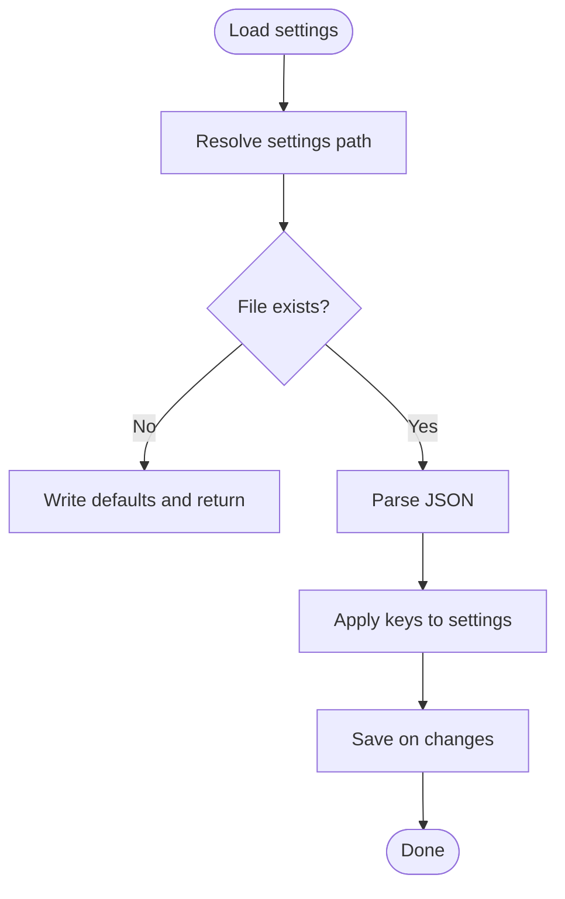

**Diagram sources**
- [config_manager.cpp](file://src/config_manager.cpp#L24-L80)

**Section sources**
- [config_manager.cpp](file://src/config_manager.cpp#L24-L108)

## Dependency Analysis
Inter-component dependencies and coupling:

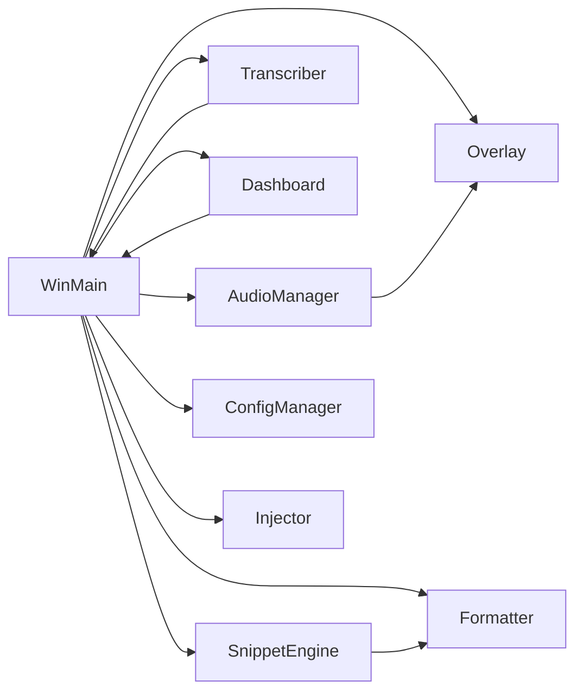

**Diagram sources**
- [main.cpp](file://src/main.cpp#L55-L64)
- [audio_manager.cpp](file://src/audio_manager.cpp#L16-L16)
- [overlay.cpp](file://src/overlay.cpp#L16-L16)
- [transcriber.cpp](file://src/transcriber.cpp#L1-L10)
- [formatter.cpp](file://src/formatter.cpp#L1-L10)
- [injector.cpp](file://src/injector.cpp#L1-L5)
- [dashboard.cpp](file://src/dashboard.cpp#L1-L19)
- [snippet_engine.cpp](file://src/snippet_engine.cpp#L1-L5)
- [config_manager.cpp](file://src/config_manager.cpp#L1-L10)

**Section sources**
- [main.cpp](file://src/main.cpp#L55-L64)

## Performance Considerations
- Audio capture:
  - 16 kHz, f32, mono reduces bandwidth and simplifies processing.
  - Lock-free ring buffer avoids contention; dropping samples is logged.
- Transcription:
  - GPU enabled by default with silent CPU fallback.
  - Greedy decoding with reduced context improves throughput.
  - Silence trimming reduces unnecessary compute.
- Rendering:
  - Direct2D DC render target with UpdateLayeredWindow minimizes overdraw.
  - Timer-driven (~60 Hz) animations balance responsiveness and CPU usage.
- Injection:
  - Short text and BMP-only text use SendInput for speed; clipboard fallback ensures compatibility.

[No sources needed since this section provides general guidance]

## Troubleshooting Guide
- Audio errors:
  - Microphone initialization failures lead to an error dialog; ensure permissions and device availability.
  - Excessive dropped samples indicate capture overrun; consider reducing UI load or adjusting buffer sizes.
- Transcription errors:
  - Model loading failures require the ggml model file; ensure it is downloaded and placed correctly.
  - Busy state indicates concurrent transcription; the system drops overlapping requests.
- Overlay errors:
  - Direct2D initialization failure shows a warning; overlay continues without visual feedback.
- Injection issues:
  - Surrogate-containing or long text falls back to clipboard; ensure clipboard availability.
- Settings persistence:
  - JSON parse errors reset to defaults; verify file integrity.

**Section sources**
- [main.cpp](file://src/main.cpp#L436-L475)
- [audio_manager.cpp](file://src/audio_manager.cpp#L74-L80)
- [transcriber.cpp](file://src/transcriber.cpp#L86-L92)
- [overlay.cpp](file://src/overlay.cpp#L32-L33)
- [injector.cpp](file://src/injector.cpp#L10-L16)
- [config_manager.cpp](file://src/config_manager.cpp#L52-L56)

## Conclusion
Flow-On’s core components form a cohesive pipeline: audio capture, asynchronous transcription, text normalization and expansion, injection, and rich UI feedback. Each module is designed for reliability, performance, and clear integration points, enabling straightforward extension and maintenance.