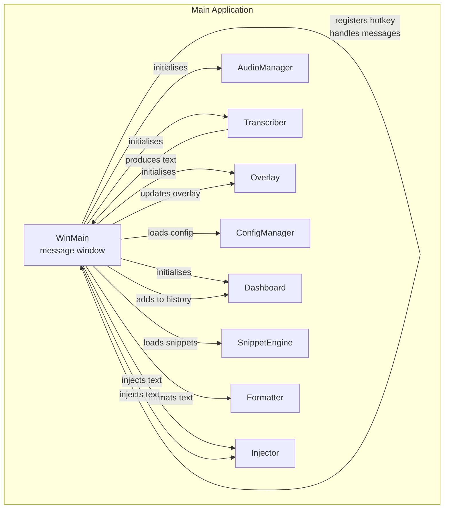
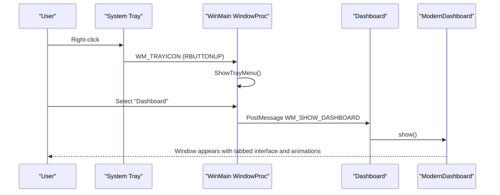
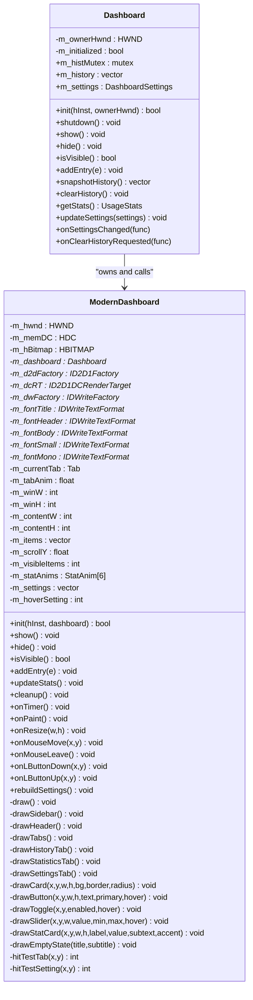
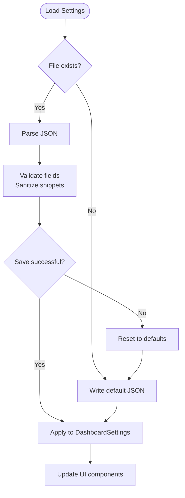
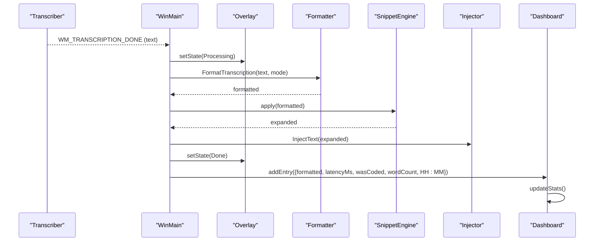
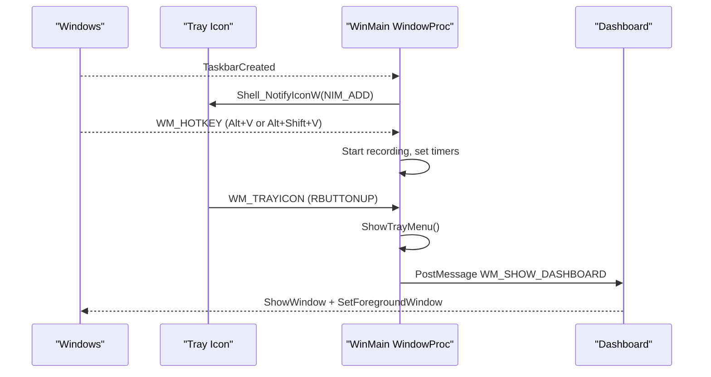
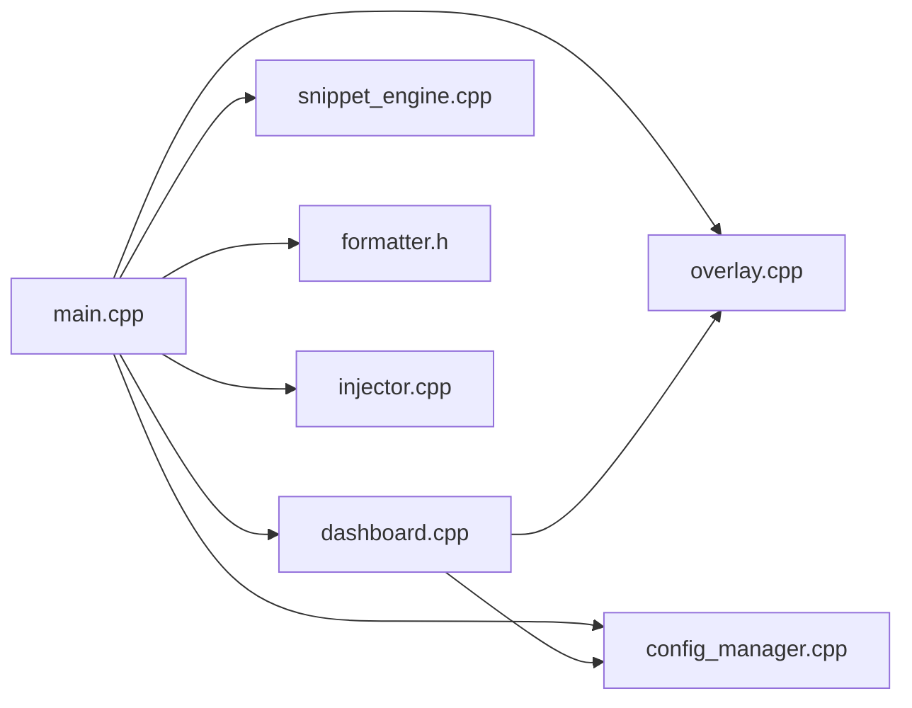

# Dashboard Interface

<cite>
**Referenced Files in This Document**
- [dashboard.h](file://src/dashboard.h)
- [dashboard.cpp](file://src/dashboard.cpp)
- [dashboard_old.cpp](file://src/dashboard_old.cpp)
- [main.cpp](file://src/main.cpp)
- [config_manager.h](file://src/config_manager.h)
- [config_manager.cpp](file://src/config_manager.cpp)
- [settings.default.json](file://assets/settings.default.json)
- [overlay.h](file://src/overlay.h)
- [overlay.cpp](file://src/overlay.cpp)
- [injector.h](file://src/injector.h)
- [injector.cpp](file://src/injector.cpp)
- [snippet_engine.h](file://src/snippet_engine.h)
- [snippet_engine.cpp](file://src/snippet_engine.cpp)
- [formatter.h](file://src/formatter.h)
</cite>

## Update Summary
**Changes Made**
- Complete rewrite of dashboard with modern Direct2D-based tabbed interface featuring glassmorphism design
- Added three distinct tabs: History, Statistics, and Settings
- Implemented advanced UI components including cards, buttons, toggle switches, and sliders
- Enhanced settings management system with comprehensive configuration options
- Added smooth animations, responsive design, and modern dark theme
- Replaced old Win32 ListBox with sophisticated animated Direct2D UI

## Table of Contents
1. [Introduction](#introduction)
2. [Project Structure](#project-structure)
3. [Core Components](#core-components)
4. [Architecture Overview](#architecture-overview)
5. [Detailed Component Analysis](#detailed-component-analysis)
6. [Dependency Analysis](#dependency-analysis)
7. [Performance Considerations](#performance-considerations)
8. [Troubleshooting Guide](#troubleshooting-guide)
9. [Conclusion](#conclusion)
10. [Appendices](#appendices)

## Introduction
This document describes the Dashboard Interface component and its modern hybrid Win32/WinUI 3 architecture. The dashboard has been completely rewritten with a sophisticated tabbed interface featuring glassmorphism design, smooth animations, and three distinct functional areas: transcription history, usage statistics, and comprehensive settings management. It explains window management, message handling, UI event processing, settings management, transcription history tracking, system tray integration, hotkey configuration, and autostart functionality. It also covers responsive design considerations, theme support, accessibility, cross-platform compatibility, performance optimization, and user experience best practices.

## Project Structure
The Dashboard is implemented as a modern Win32 window using Direct2D/DirectWrite for hardware-accelerated rendering with a sophisticated tabbed interface. The main application integrates the dashboard with audio capture, transcription, overlay feedback, snippet expansion, and system tray controls. The new implementation features three distinct tabs with advanced UI components and smooth animations.

**Diagram sources**
- [main.cpp](file://src/main.cpp#L374-L544)
- [dashboard.cpp](file://src/dashboard.cpp#L1409-L1509)
- [overlay.cpp](file://src/overlay.cpp#L29-L74)
- [config_manager.cpp](file://src/config_manager.cpp#L24-L80)
- [snippet_engine.cpp](file://src/snippet_engine.cpp#L6-L28)
- [injector.cpp](file://src/injector.cpp#L49-L75)

**Section sources**
- [main.cpp](file://src/main.cpp#L374-L544)
- [dashboard.h](file://src/dashboard.h#L45-L88)
- [dashboard.cpp](file://src/dashboard.cpp#L1409-L1509)

## Core Components
- **Dashboard**: Manages the modern Direct2D window with tabbed interface, history list, and UI animations. Exposes thread-safe APIs to add entries, snapshot history, clear history, and show the window.
- **ModernDashboard**: The sophisticated UI class implementing the tabbed interface with glassmorphism design, smooth animations, and interactive components.
- **ConfigManager**: Loads and persists application settings to a JSON file under the user's AppData directory, including hotkey, mode, model, GPU usage, autostart, and snippets.
- **Overlay**: Provides a floating, always-on-top Direct2D overlay with layered window compositing and animated feedback states.
- **Injector**: Injects formatted text into the active application using either SendInput or clipboard paste depending on content characteristics.
- **SnippetEngine**: Applies case-insensitive, longest-first snippet substitutions to transcription output.
- **Formatter**: Applies four-pass cleaning and formatting; applies coding-specific transforms in code mode.

**Section sources**
- [dashboard.h](file://src/dashboard.h#L45-L88)
- [dashboard.cpp](file://src/dashboard.cpp#L69-L185)
- [config_manager.h](file://src/config_manager.h#L8-L39)
- [config_manager.cpp](file://src/config_manager.cpp#L24-L80)
- [overlay.h](file://src/overlay.h#L18-L93)
- [overlay.cpp](file://src/overlay.cpp#L29-L74)
- [injector.h](file://src/injector.h#L4-L8)
- [injector.cpp](file://src/injector.cpp#L49-L75)
- [snippet_engine.h](file://src/snippet_engine.h#L7-L19)
- [snippet_engine.cpp](file://src/snippet_engine.cpp#L6-L28)
- [formatter.h](file://src/formatter.h#L7-L13)

## Architecture Overview
The Dashboard is a sophisticated hybrid Win32 window using Direct2D for hardware-accelerated drawing with a timer-driven animation loop. The new implementation features a modern glassmorphism design with three distinct tabs: History, Statistics, and Settings. The main application coordinates hotkeys, audio capture, transcription, overlay states, snippet expansion, and text injection, then records history entries for the dashboard.

**Diagram sources**
- [main.cpp](file://src/main.cpp#L91-L110)
- [main.cpp](file://src/main.cpp#L227-L239)
- [dashboard.cpp](file://src/dashboard.cpp#L347-L356)
- [dashboard.cpp](file://src/dashboard.cpp#L1338-L1403)

## Detailed Component Analysis

### Dashboard: Modern Tabbed Interface Implementation
- **Initialization**: Creates a hidden message window, initializes the ModernDashboard window class with glassmorphism design, registers a timer, and binds Direct2D/DirectWrite resources.
- **Rendering Pipeline**: Uses a GDI off-screen DIB with a Direct2D DC render target, draws header, sidebar, tabs, and content areas with fade/slide animations, and blits to the window via BitBlt.
- **History Management**: Thread-safe vector protected by a mutex; supports adding entries, snapshotting, and clearing. The ModernDashboard mirrors recent entries for live animation.
- **Window Lifecycle**: Handles WM_TIMER for animation, WM_PAINT for blitting, and WM_CLOSE/WM_DESTROY for hiding/cleanup.
- **Tab System**: Implements three distinct tabs (History, Statistics, Settings) with smooth transitions and individual content rendering.

**Diagram sources**
- [dashboard.h](file://src/dashboard.h#L45-L88)
- [dashboard.cpp](file://src/dashboard.cpp#L69-L185)
- [dashboard.cpp](file://src/dashboard.cpp#L1409-L1509)

**Section sources**
- [dashboard.h](file://src/dashboard.h#L45-L88)
- [dashboard.cpp](file://src/dashboard.cpp#L270-L312)
- [dashboard.cpp](file://src/dashboard.cpp#L383-L404)
- [dashboard.cpp](file://src/dashboard.cpp#L410-L475)
- [dashboard.cpp](file://src/dashboard.cpp#L1338-L1403)

### ModernDashboard: Advanced UI Implementation
- **Glassmorphism Design**: Features deep navy blue background with translucent surfaces, subtle borders, and modern color scheme using indigo accents.
- **Animation System**: Implements smooth easing functions (easeOutCubic, easeOutBack) for fluid transitions between states and items.
- **Tab Navigation**: Three distinct tabs with hover effects, active indicators, and smooth tab switching animations.
- **Interactive Components**: Cards with rounded corners, buttons with hover states, toggle switches with smooth transitions, and sliders with visual feedback.
- **Layout System**: Fixed dimensions (900x640) with responsive content areas, sidebar navigation, and content padding.

**Section sources**
- [dashboard.cpp](file://src/dashboard.cpp#L31-L45)
- [dashboard.cpp](file://src/dashboard.cpp#L48-L55)
- [dashboard.cpp](file://src/dashboard.cpp#L106-L120)
- [dashboard.cpp](file://src/dashboard.cpp#L160-L184)

### Settings Management System
- **Persistence**: Settings are stored as JSON in %APPDATA%\FLOW-ON\settings.json. Defaults are loaded from assets/settings.default.json on first run.
- **Validation and sanitization**: Snippet values are truncated to a maximum length; malformed JSON resets to defaults.
- **Real-time updates**: The main application subscribes to DashboardSettings changes and immediately applies them to ConfigManager, saving to disk and updating autostart registry keys.
- **Autostart**: Uses HKCU Run registry key to start with Windows; removal clears the value.
- **Comprehensive Settings**: Supports GPU acceleration, startup preferences, overlay visibility, and model selection.

**Diagram sources**
- [config_manager.cpp](file://src/config_manager.cpp#L24-L58)
- [settings.default.json](file://assets/settings.default.json#L1-L16)
- [dashboard.cpp](file://src/dashboard.cpp#L494-L511)

**Section sources**
- [config_manager.h](file://src/config_manager.h#L8-L39)
- [config_manager.cpp](file://src/config_manager.cpp#L24-L80)
- [settings.default.json](file://assets/settings.default.json#L1-L16)
- [main.cpp](file://src/main.cpp#L494-L511)
- [dashboard.cpp](file://src/dashboard.cpp#L314-L341)

### Transcription History Tracking
- **Data model**: Each entry includes text, timestamp ("HH:MM"), latency in milliseconds, coding mode flag, and word count.
- **Storage**: In-memory vectors in both the main application and Dashboard; bounded growth to cap memory usage (200 entries).
- **Filtering and display**: The ModernDashboard renders only visible items with fade-in and slide-in animations; empty-state messaging is shown when history is empty.
- **Timestamping**: Local time is captured at transcription completion for display.
- **Statistics**: Comprehensive usage statistics including total transcriptions, words, characters, average latency, and daily/session counts.

**Diagram sources**
- [main.cpp](file://src/main.cpp#L280-L354)
- [overlay.cpp](file://src/overlay.cpp#L140-L158)
- [injector.cpp](file://src/injector.cpp#L49-L75)
- [dashboard.cpp](file://src/dashboard.cpp#L383-L391)
- [dashboard.cpp](file://src/dashboard.cpp#L393-L404)

**Section sources**
- [dashboard.h](file://src/dashboard.h#L19-L25)
- [dashboard.cpp](file://src/dashboard.cpp#L129-L137)
- [dashboard.cpp](file://src/dashboard.cpp#L383-L404)
- [main.cpp](file://src/main.cpp#L326-L350)

### System Tray, Hotkey, and Autostart Integration
- **System tray**: A hidden message window owns the tray icon; right-click opens a menu with "Dashboard" and "Exit"; double-clicking opens the dashboard.
- **Hotkey**: Registers Alt+V; falls back to Alt+Shift+V if unavailable. A polling timer detects key release to stop recording reliably.
- **Autostart**: On startup, reads the setting and applies/removes HKCU Run value accordingly.
- **Window management**: Uses dark title bar styling and glass effect for modern appearance.

**Diagram sources**
- [main.cpp](file://src/main.cpp#L151-L155)
- [main.cpp](file://src/main.cpp#L162-L180)
- [main.cpp](file://src/main.cpp#L185-L203)
- [main.cpp](file://src/main.cpp#L227-L239)
- [main.cpp](file://src/main.cpp#L419-L431)
- [main.cpp](file://src/main.cpp#L481-L493)

**Section sources**
- [main.cpp](file://src/main.cpp#L35-L45)
- [main.cpp](file://src/main.cpp#L79-L86)
- [main.cpp](file://src/main.cpp#L91-L110)
- [main.cpp](file://src/main.cpp#L162-L180)
- [main.cpp](file://src/main.cpp#L227-L239)
- [main.cpp](file://src/main.cpp#L419-L431)
- [main.cpp](file://src/main.cpp#L481-L493)

### Practical Examples
- **Dashboard initialization**: Called from WinMain after subsystems are ready; sets up the ModernDashboard with glassmorphism design and wires onSettingsChanged to persist and apply changes.
- **Settings binding**: The lambda updates ConfigManager fields and toggles autostart via registry, supporting GPU acceleration and startup preferences.
- **Custom UI extensions**: The ModernDashboard class encapsulates rendering and animation; extending it involves adding new UI layers, adjusting draw routines, and implementing new tab content.

**Section sources**
- [main.cpp](file://src/main.cpp#L492-L511)
- [dashboard.cpp](file://src/dashboard.cpp#L1409-L1422)
- [dashboard.cpp](file://src/dashboard.cpp#L1338-L1403)

### Responsive Design, Theme, and Accessibility
- **Responsive design**: Fixed window dimensions (900x640) with adaptive content areas; sidebar navigation with collapsible sections.
- **Theme**: Sophisticated dark theme with glassmorphism effects, indigo accents, and modern color palette using deep navy blues and translucent surfaces.
- **Accessibility**: Uses DirectWrite text formats with proper font weights and sizes; consider adding high contrast modes and keyboard navigation support.
- **Animations**: Smooth easing functions (easeOutCubic, easeOutBack) for fluid transitions; configurable animation timing for performance optimization.

### Cross-Platform Compatibility
- The Dashboard and surrounding components are Windows-only (Win32, Direct2D, DirectWrite, Shell NotifyIcon). There is no cross-platform implementation in the provided code.
- WinUI 3 integration is supported but optional, indicated by comments in the codebase.

## Dependency Analysis
The Dashboard depends on the main application for initialization, settings updates, and history entries. The main application orchestrates audio capture, transcription, overlay, snippet expansion, and text injection.

**Diagram sources**
- [main.cpp](file://src/main.cpp#L374-L544)
- [dashboard.cpp](file://src/dashboard.cpp#L1409-L1509)
- [overlay.cpp](file://src/overlay.cpp#L29-L74)
- [config_manager.cpp](file://src/config_manager.cpp#L24-L80)
- [snippet_engine.cpp](file://src/snippet_engine.cpp#L6-L28)
- [injector.cpp](file://src/injector.cpp#L49-L75)

**Section sources**
- [main.cpp](file://src/main.cpp#L374-L544)
- [dashboard.cpp](file://src/dashboard.cpp#L1409-L1509)

## Performance Considerations
- **Rendering**: Direct2D DC render target with a 32-bit premultiplied alpha DIB minimizes composition overhead; BitBlt blits the off-screen buffer to the window.
- **Animation**: Fixed 16 ms timer (~62.5 fps) keeps UI smooth without excessive CPU usage; easing functions optimize performance with mathematical calculations.
- **Memory**: History lists are capped to 200 entries to limit memory growth; snippet values are truncated to prevent oversized expansions.
- **Audio/transcription**: Short recordings below a threshold are rejected to avoid unnecessary processing; dropped samples are monitored to maintain quality.
- **GPU Acceleration**: Optional GPU acceleration for faster transcription processing when available.

## Troubleshooting Guide
- **Dashboard fails to show**: Verify ModernDashboard initialization and timer registration; ensure the window handle is valid and visible.
- **Settings not applied**: Confirm onSettingsChanged handler updates ConfigManager and writes to disk; check registry permissions for autostart.
- **Overlay not visible**: Ensure Direct2D/DirectWrite initialization succeeds and the layered window is positioned correctly.
- **Injection failures**: For long strings or text with surrogate pairs, clipboard injection is used; verify clipboard access and focus.
- **Animation issues**: Check timer registration and animation loop; verify Direct2D resources are properly created and destroyed.
- **Glassmorphism rendering**: Ensure Windows version supports DWM glass effects; verify dark mode attributes are applied correctly.

**Section sources**
- [dashboard.cpp](file://src/dashboard.cpp#L270-L312)
- [dashboard.cpp](file://src/dashboard.cpp#L347-L377)
- [overlay.cpp](file://src/overlay.cpp#L29-L74)
- [overlay.cpp](file://src/overlay.cpp#L126-L135)
- [injector.cpp](file://src/injector.cpp#L49-L75)

## Conclusion
The Dashboard Interface provides a modern, animated, and efficient transcription history viewer built on Win32 and Direct2D with a sophisticated tabbed interface. The complete rewrite introduces glassmorphism design, smooth animations, three distinct functional tabs, and comprehensive settings management. It integrates tightly with the main application to deliver a cohesive user experience, including system tray controls, hotkeys, autostart, and robust settings management. The modular design allows for future enhancements such as WinUI 3 integration and cross-platform adaptations.

## Appendices

### Appendix A: Settings Schema
- **hotkey**: string (default: "Alt+V")
- **mode**: string ("auto" | "prose" | "code")
- **model**: string (default model identifier)
- **use_gpu**: boolean (default: true)
- **start_with_windows**: boolean (default: true)
- **snippets**: object (key-value pairs; values are truncated to 500 characters)
- **enable_overlay**: boolean (default: true)
- **audio_threshold**: integer (0-100, default: 8)

**Section sources**
- [config_manager.h](file://src/config_manager.h#L8-L19)
- [config_manager.cpp](file://src/config_manager.cpp#L43-L51)
- [settings.default.json](file://assets/settings.default.json#L1-L16)
- [dashboard.cpp](file://src/dashboard.cpp#L27-L33)

### Appendix B: Dashboard Features
- **Glassmorphism Design**: Deep navy blue background with translucent surfaces and indigo accents
- **Smooth Animations**: Easing functions for fluid transitions between states and items
- **Tabbed Interface**: Three distinct tabs (History, Statistics, Settings) with hover effects
- **Interactive Components**: Cards, buttons, toggle switches, and sliders with visual feedback
- **Responsive Layout**: Fixed dimensions with adaptive content areas and sidebar navigation
- **Modern Color Scheme**: Sophisticated dark theme with proper contrast ratios and accessibility considerations

**Section sources**
- [dashboard.cpp](file://src/dashboard.cpp#L31-L45)
- [dashboard.cpp](file://src/dashboard.cpp#L48-L55)
- [dashboard.cpp](file://src/dashboard.cpp#L812-L893)
- [dashboard.cpp](file://src/dashboard.cpp#L1126-L1240)