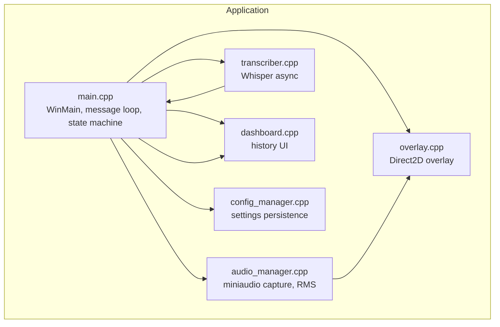
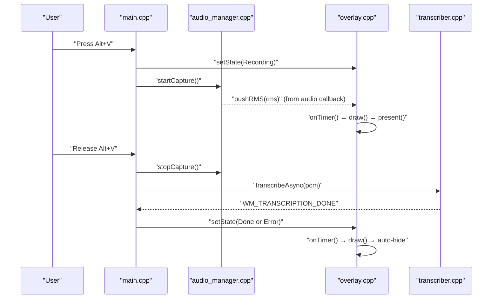
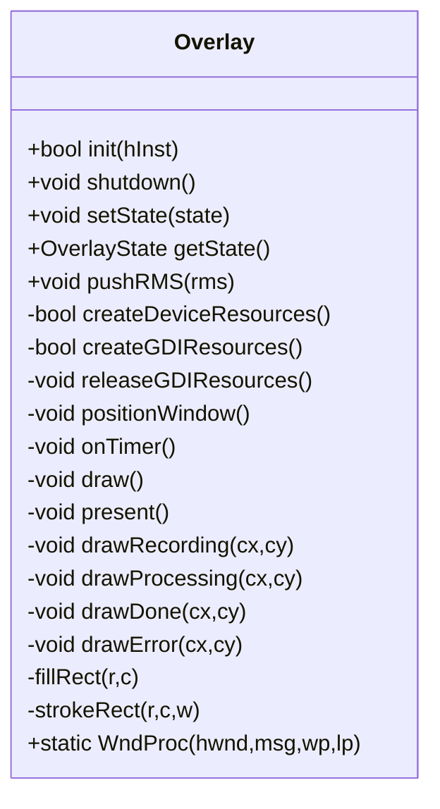
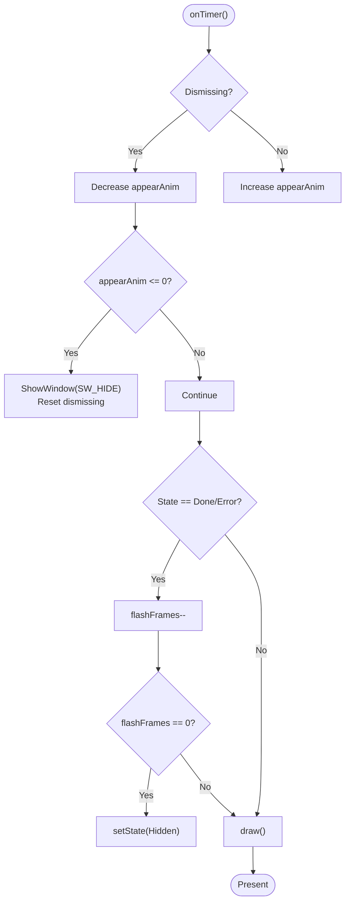
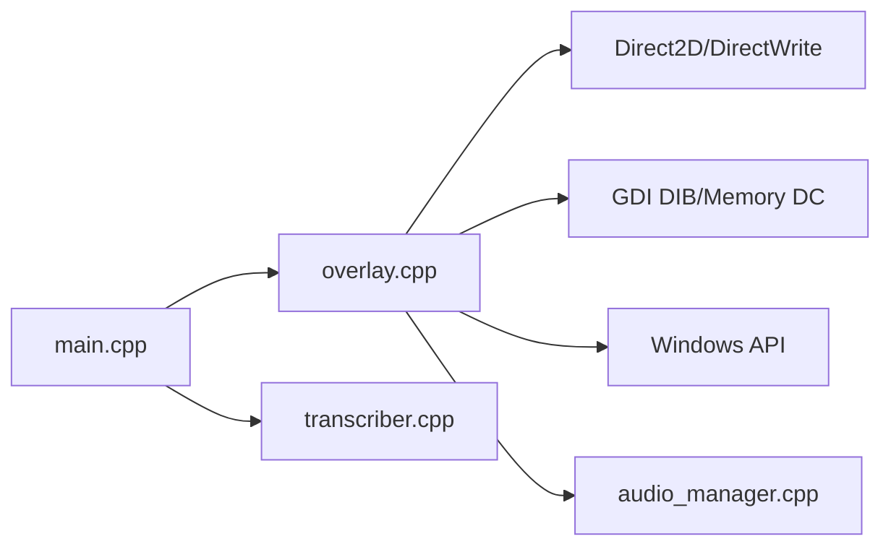

# Overlay System

<cite>
**Referenced Files in This Document**
- [overlay.h](file://src/overlay.h)
- [overlay.cpp](file://src/overlay.cpp)
- [main.cpp](file://src/main.cpp)
- [audio_manager.h](file://src/audio_manager.h)
- [audio_manager.cpp](file://src/audio_manager.cpp)
- [transcriber.h](file://src/transcriber.h)
- [transcriber.cpp](file://src/transcriber.cpp)
- [dashboard.h](file://src/dashboard.h)
- [dashboard.cpp](file://src/dashboard.cpp)
- [config_manager.h](file://src/config_manager.h)
- [config_manager.cpp](file://src/config_manager.cpp)
- [Resource.h](file://Resource.h)
- [README.md](file://README.md)
</cite>

## Table of Contents
1. [Introduction](#introduction)
2. [Project Structure](#project-structure)
3. [Core Components](#core-components)
4. [Architecture Overview](#architecture-overview)
5. [Detailed Component Analysis](#detailed-component-analysis)
6. [Dependency Analysis](#dependency-analysis)
7. [Performance Considerations](#performance-considerations)
8. [Troubleshooting Guide](#troubleshooting-guide)
9. [Conclusion](#conclusion)
10. [Appendices](#appendices)

## Introduction
The Overlay System is a Direct2D-based floating UI element that displays real-time audio visualization and state transitions for the application. It renders a pill-shaped overlay with rounded corners, animated waveform bars during recording, a spinning progress arc during transcription, and animated success/error indicators upon completion. The overlay is implemented as a layered, click-through, always-on-top window that composes a 32-bit per-pixel alpha bitmap using UpdateLayeredWindow for pixel-perfect transparency and zero bleed around the pill shape.

The overlay integrates tightly with the main application’s finite state machine (IDLE → RECORDING → TRANSCRIBING → INJECTING) and receives audio RMS updates from the audio manager. It drives a 60 FPS animation loop via a WM_TIMER handler and presents itself on the primary monitor near the bottom center.

## Project Structure
The overlay resides in the core application alongside audio capture, transcription, formatting, injection, dashboard, and configuration modules. The main entry point initializes the overlay and coordinates state transitions through Windows messages.

**Diagram sources**
- [main.cpp](file://src/main.cpp#L362-L521)
- [overlay.cpp](file://src/overlay.cpp#L29-L74)
- [audio_manager.cpp](file://src/audio_manager.cpp#L39-L56)
- [transcriber.cpp](file://src/transcriber.cpp#L103-L225)
- [dashboard.cpp](file://src/dashboard.cpp#L394-L453)
- [config_manager.cpp](file://src/config_manager.cpp#L24-L80)

**Section sources**
- [README.md](file://README.md#L69-L123)
- [main.cpp](file://src/main.cpp#L362-L521)

## Core Components
- Overlay class: Implements window creation, Direct2D device and GDI resources, animation state machine, drawing routines, and presentation via UpdateLayeredWindow.
- Audio Manager: Streams 16 kHz mono PCM, computes RMS, and pushes it to the overlay via an atomic store.
- Transcriber: Performs asynchronous speech-to-text with GPU fallback and posts completion messages back to the main thread.
- Main application: Orchestrates state transitions, manages timers, and coordinates overlay visibility and state.

Key overlay capabilities:
- Window creation with layered, transparent, topmost, and click-through styles.
- Direct2D DC render target with premultiplied alpha format.
- GDI DIB section for UpdateLayeredWindow compositing.
- Timer-driven 60 FPS animation loop.
- Animated visuals for recording (waveform bars and pulsing dot), processing (spinning arc), and terminal states (green check or red X).
- Auto-positioning near the bottom of the primary monitor.

**Section sources**
- [overlay.h](file://src/overlay.h#L18-L94)
- [overlay.cpp](file://src/overlay.cpp#L29-L74)
- [audio_manager.h](file://src/audio_manager.h#L26-L33)
- [audio_manager.cpp](file://src/audio_manager.cpp#L39-L56)
- [transcriber.h](file://src/transcriber.h#L10-L28)
- [transcriber.cpp](file://src/transcriber.cpp#L103-L225)
- [main.cpp](file://src/main.cpp#L116-L128)

## Architecture Overview
The overlay participates in the application’s state machine. The main thread controls overlay visibility and state transitions, while the audio callback continuously updates the overlay with RMS energy values. The overlay’s timer ticks drive animation updates and rendering.

**Diagram sources**
- [main.cpp](file://src/main.cpp#L185-L222)
- [audio_manager.cpp](file://src/audio_manager.cpp#L39-L56)
- [overlay.cpp](file://src/overlay.cpp#L596-L620)
- [transcriber.cpp](file://src/transcriber.cpp#L103-L225)

## Detailed Component Analysis

### Overlay Class Design
The Overlay class encapsulates:
- Window lifecycle: creation, timer setup, layered composition, and destruction.
- Rendering pipeline: Direct2D DC render target, GDI DIB, and UpdateLayeredWindow presentation.
- Animation state machine: appear/disappear scales, state-specific animations, and auto-hide timers.
- Visual rendering: recording waveform, processing spinner, and terminal state indicators.

**Diagram sources**
- [overlay.h](file://src/overlay.h#L18-L94)
- [overlay.cpp](file://src/overlay.cpp#L29-L74)

**Section sources**
- [overlay.h](file://src/overlay.h#L18-L94)
- [overlay.cpp](file://src/overlay.cpp#L29-L74)

### Window Creation and Transparency
- Window class: Registered with no background brush to avoid GDI painting; layered, transparent, topmost, and click-through flags ensure it overlays other windows without intercepting input.
- Timer: Created with a ~16 ms interval (~62.5 FPS) to approximate 60 FPS rendering.
- GDI resources: A 32-bit DIB section is created with top-down scanlines and bound to a memory DC for Direct2D rendering.
- Presentation: UpdateLayeredWindow composites the DIB using per-pixel alpha, eliminating “boxed outline” artifacts compared to legacy alpha attributes.

Practical implications:
- The overlay does not steal focus or block input.
- Per-pixel alpha ensures crisp edges around the pill shape.
- The window remains on top of all other windows.

**Section sources**
- [overlay.cpp](file://src/overlay.cpp#L50-L74)
- [overlay.cpp](file://src/overlay.cpp#L79-L106)
- [overlay.cpp](file://src/overlay.cpp#L111-L121)
- [overlay.cpp](file://src/overlay.cpp#L261-L269)

### Screen Positioning Logic
- Primary monitor: Uses system metrics to compute screen width and height.
- Centered horizontally and positioned near the bottom with a fixed vertical offset.
- Always-on-top placement ensures visibility during recording and transcription.

Customization:
- The overlay’s horizontal and vertical offsets can be adjusted by modifying the computed position values.

**Section sources**
- [overlay.cpp](file://src/overlay.cpp#L126-L135)

### Animation Framework and State Transitions
States:
- Hidden: Fully transparent and hidden; triggers dismissal animation when transitioning from Hidden.
- Recording: Displays animated waveform bars and a pulsing red dot.
- Processing: Spinning gradient arc with a bright tip and a label.
- Done: Scale-in green circle with a two-segment checkmark.
- Error: Scale-in red circle with an X symbol.

Animation mechanics:
- Appear/dismiss: Smooth easing curve applied to scale and opacity.
- Frame timing: 60 FPS via WM_TIMER; speeds tuned per effect.
- Auto-hide: After Done/Error, a countdown hides the overlay after a fixed number of frames.

Timing functions:
- Ease-out cubic for smooth transitions.
- Clamp helpers to constrain values to [0,1].
- Trigonometric functions for spinner angles and idle sine waves.

State management:
- setState updates the atomic state and resets or starts animations accordingly.
- onTimer updates animation variables, handles auto-hide, and triggers draw.

**Diagram sources**
- [overlay.cpp](file://src/overlay.cpp#L596-L620)

**Section sources**
- [overlay.h](file://src/overlay.h#L11-L11)
- [overlay.cpp](file://src/overlay.cpp#L140-L158)
- [overlay.cpp](file://src/overlay.cpp#L596-L620)

### Waveform Visualization and Audio Level Display
- RMS ingestion: The audio callback atomically stores the latest RMS value; the overlay reads it each frame.
- Ring buffer: A fixed-size circular buffer accumulates recent RMS samples for the waveform.
- Smoothing: Exponential smoothing per bar plus a subtle idle sine wave at silence to reduce visual noise.
- Bars: Rounded rectangles sized by smoothed RMS values, with edge fade envelopes and color gradients from violet to blue.
- Pulsing dot: A small red dot pulses near the left edge during recording.

Dynamic updates:
- The overlay updates every ~16 ms, reflecting real-time audio energy.

**Section sources**
- [audio_manager.cpp](file://src/audio_manager.cpp#L39-L56)
- [overlay.cpp](file://src/overlay.cpp#L274-L372)

### Integration with Main Application State Machine
- Recording start: Main thread sets overlay state to Recording and starts audio capture.
- Recording stop: Main thread stops audio capture and transitions to TRANSCRIBING, setting overlay state to Processing.
- Completion: On transcription completion, main thread sets overlay state to Done or Error depending on outcome.
- Auto-hide: Overlay auto-hides after a brief flash for Done/Error states.

Message handling:
- WM_HOTKEY triggers recording start/stop logic.
- WM_TIMER polls for hotkey release and drives overlay animation.
- WM_TRANSCRIPTION_DONE triggers Done/Error state and updates tray icon.

Z-order management:
- Overlay uses WS_EX_TOPMOST and layered composition to remain above other windows.
- The main hidden window coordinates tray icon and hotkeys.

**Section sources**
- [main.cpp](file://src/main.cpp#L185-L222)
- [main.cpp](file://src/main.cpp#L244-L342)
- [overlay.cpp](file://src/overlay.cpp#L140-L158)

### Practical Examples

- Overlay initialization:
  - Initialize Direct2D and DirectWrite factories.
  - Create window class and window with layered flags.
  - Allocate GDI DIB and memory DC.
  - Create DC render target with premultiplied alpha.
  - Set a timer for ~60 FPS.

- State management:
  - setState(Recording) centers the overlay and starts appear animation.
  - setState(Processing) begins the spinner animation.
  - setState(Done) triggers green circle and checkmark.
  - setState(Error) triggers red circle and X.
  - setState(Hidden) initiates dismiss animation and hides the window.

- Custom styling options:
  - Modify colors and opacities in drawing routines.
  - Adjust corner radius, pill dimensions, and bar geometry.
  - Change animation speeds by tuning APPEAR_SPD, DISMISS_SPD, STATE_SPD.

- Multi-monitor and DPI considerations:
  - Current implementation positions on the primary monitor using system metrics.
  - DPI scaling is handled implicitly by the render target’s DPI settings; no explicit per-monitor scaling logic is present.

- Accessibility:
  - The overlay is click-through and does not capture input.
  - No keyboard or screen-reader hooks are implemented.

**Section sources**
- [overlay.cpp](file://src/overlay.cpp#L29-L74)
- [overlay.cpp](file://src/overlay.cpp#L126-L135)
- [overlay.cpp](file://src/overlay.cpp#L274-L372)
- [overlay.cpp](file://src/overlay.cpp#L377-L466)
- [overlay.cpp](file://src/overlay.cpp#L471-L591)

## Dependency Analysis
The overlay depends on:
- Windows APIs for window creation, timers, layered composition, and GDI DIB.
- Direct2D and DirectWrite for GPU-accelerated rendering and text layout.
- The audio manager for RMS updates.
- The main application for state transitions and message coordination.

**Diagram sources**
- [overlay.cpp](file://src/overlay.cpp#L10-L15)
- [overlay.cpp](file://src/overlay.cpp#L29-L74)
- [audio_manager.cpp](file://src/audio_manager.cpp#L39-L56)
- [main.cpp](file://src/main.cpp#L116-L128)
- [transcriber.cpp](file://src/transcriber.cpp#L103-L225)

**Section sources**
- [overlay.cpp](file://src/overlay.cpp#L10-L15)
- [overlay.cpp](file://src/overlay.cpp#L29-L74)
- [audio_manager.cpp](file://src/audio_manager.cpp#L39-L56)
- [main.cpp](file://src/main.cpp#L116-L128)
- [transcriber.cpp](file://src/transcriber.cpp#L103-L225)

## Performance Considerations
- Continuous rendering:
  - 60 FPS via WM_TIMER reduces input lag and provides smooth animations.
  - Each frame binds the DC render target to the DIB, clears to transparent, draws UI, and presents via UpdateLayeredWindow.

- GPU acceleration:
  - Direct2D DC render targets leverage GPU acceleration when available.
  - Premultiplied alpha format minimizes blending overhead.

- Battery optimization:
  - The overlay is lightweight and only active during recording and post-processing.
  - Avoid heavy per-frame allocations; the overlay reuses brushes and geometries per frame.

- Audio integration:
  - The audio callback performs minimal work, storing RMS atomically for the overlay to consume.

- Potential improvements:
  - Implement a single-threaded Direct2D factory and reuse resources to minimize allocations.
  - Consider throttling rendering when the overlay is fully hidden to conserve power.

**Section sources**
- [overlay.cpp](file://src/overlay.cpp#L17-L24)
- [overlay.cpp](file://src/overlay.cpp#L196-L255)
- [overlay.cpp](file://src/overlay.cpp#L261-L269)
- [audio_manager.cpp](file://src/audio_manager.cpp#L39-L56)

## Troubleshooting Guide
- Overlay fails to initialize:
  - Direct2D factory creation or DC render target creation failure leads to initialization failure. The main thread continues without overlay.

- No audio visualization:
  - Ensure the audio callback is running and pushing RMS values. The overlay reads the latest RMS atomically.

- Overlay not visible:
  - Confirm the window is shown and positioned near the bottom of the primary monitor. Check for errors in window creation and timer setup.

- Rendering artifacts:
  - Ensure UpdateLayeredWindow uses ULW_ALPHA with AC_SRC_ALPHA. The overlay uses premultiplied alpha in the render target.

- Multi-monitor behavior:
  - The overlay currently targets the primary monitor. If you need multi-monitor support, adjust the position calculation to target the active monitor.

- DPI scaling:
  - The render target is created with a fixed DPI. If DPI changes occur, consider recreating the render target with updated DPI.

**Section sources**
- [overlay.cpp](file://src/overlay.cpp#L31-L33)
- [overlay.cpp](file://src/overlay.cpp#L115-L121)
- [overlay.cpp](file://src/overlay.cpp#L126-L135)
- [overlay.cpp](file://src/overlay.cpp#L261-L269)
- [overlay.cpp](file://src/overlay.cpp#L126-L135)

## Conclusion
The Overlay System delivers a responsive, GPU-accelerated floating UI that clearly communicates application state and audio activity. Its Direct2D-based rendering, layered window composition, and tight integration with the main state machine provide a polished user experience. While the current implementation focuses on the primary monitor and basic styling, future enhancements can include multi-monitor awareness, DPI scaling, and richer customization options.

## Appendices

### Appendix A: State Transition Reference
- IDLE → RECORDING: Start audio capture and show overlay.
- RECORDING → TRANSCRIBING: Stop audio capture and set Processing state.
- TRANSCRIBING → DONE: Successful transcription; set Done state.
- TRANSCRIBING → ERROR: Failure conditions; set Error state.
- DONE/ERROR → Hidden: Auto-hide after a brief flash.

**Section sources**
- [main.cpp](file://src/main.cpp#L185-L222)
- [main.cpp](file://src/main.cpp#L244-L342)
- [overlay.cpp](file://src/overlay.cpp#L140-L158)

### Appendix B: Visual Elements Reference
- Recording: Waveform bars with edge fade and color gradient; pulsing red dot.
- Processing: Spinning arc with gradient fade and bright tip; label text.
- Done: Green circle with outer glow and animated checkmark.
- Error: Red circle with outer glow and X symbol.

**Section sources**
- [overlay.cpp](file://src/overlay.cpp#L274-L372)
- [overlay.cpp](file://src/overlay.cpp#L377-L466)
- [overlay.cpp](file://src/overlay.cpp#L471-L591)