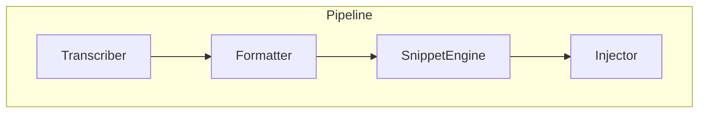
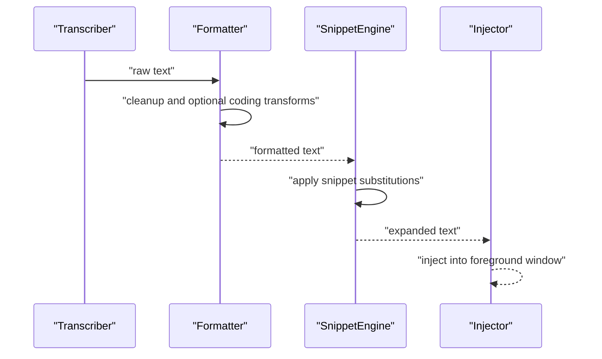
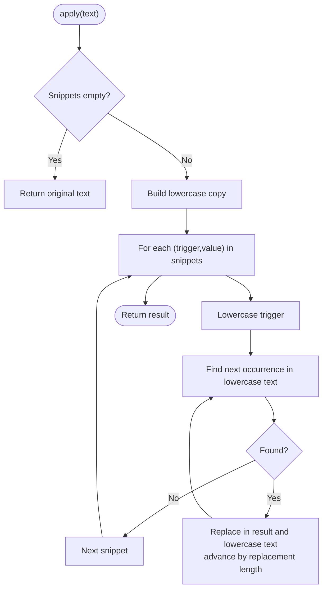
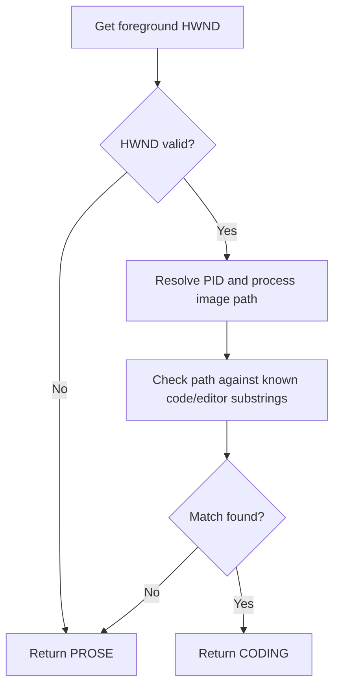
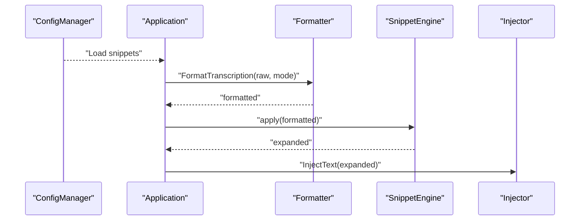
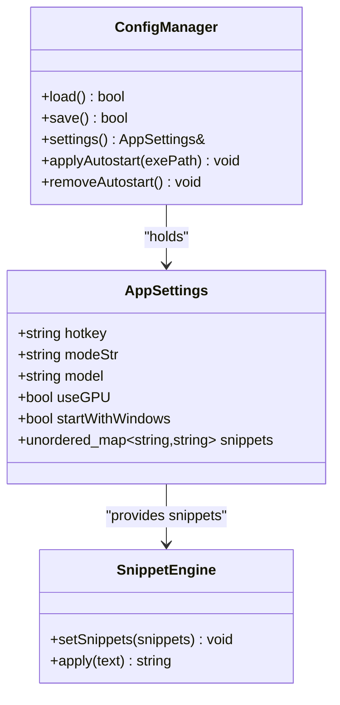
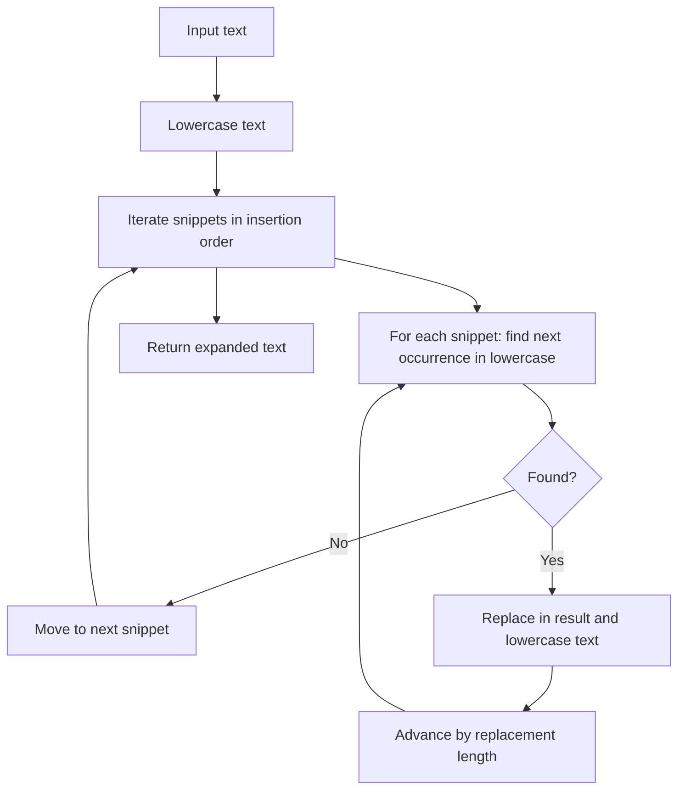
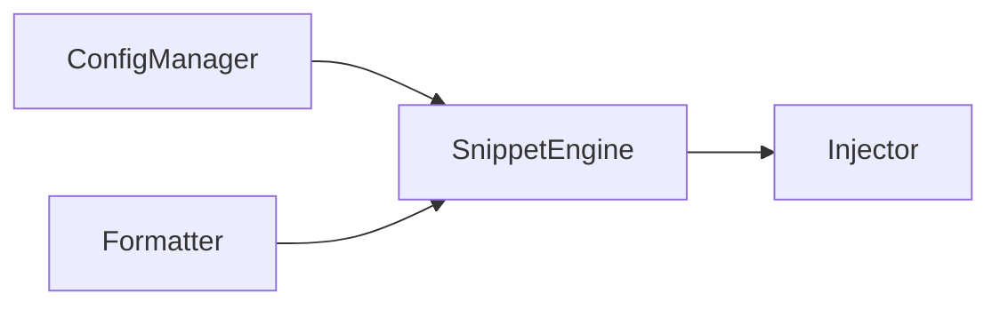

# Snippet Engine

<cite>
**Referenced Files in This Document**
- [snippet_engine.h](file://src/snippet_engine.h)
- [snippet_engine.cpp](file://src/snippet_engine.cpp)
- [formatter.h](file://src/formatter.h)
- [formatter.cpp](file://src/formatter.cpp)
- [config_manager.h](file://src/config_manager.h)
- [config_manager.cpp](file://src/config_manager.cpp)
- [main.cpp](file://src/main.cpp)
- [injector.h](file://src/injector.h)
- [injector.cpp](file://src/injector.cpp)
- [README.md](file://README.md)
</cite>

## Table of Contents
1. [Introduction](#introduction)
2. [Project Structure](#project-structure)
3. [Core Components](#core-components)
4. [Architecture Overview](#architecture-overview)
5. [Detailed Component Analysis](#detailed-component-analysis)
6. [Dependency Analysis](#dependency-analysis)
7. [Performance Considerations](#performance-considerations)
8. [Security Considerations](#security-considerations)
9. [Troubleshooting Guide](#troubleshooting-guide)
10. [Conclusion](#conclusion)
11. [Appendices](#appendices)

## Introduction
This document explains the Snippet Engine component that performs case-insensitive, word-level text substitution on transcribed speech. It covers trigger word detection, pattern matching, replacement logic, configuration format, context-aware triggering, integration with the text formatting pipeline, timing of expansions, conflict resolution strategies, snippet database management, performance implications, and security considerations.

## Project Structure
The Snippet Engine is part of the end-to-end voice-to-text pipeline:
- Transcription produces raw text.
- Formatting cleans and normalizes text, optionally applying coding transforms.
- Snippet expansion runs after formatting.
- Injected text is sent to the active application window.

**Diagram sources**
- [main.cpp](file://src/main.cpp#L300-L320)
- [formatter.h](file://src/formatter.h#L1-L14)
- [snippet_engine.h](file://src/snippet_engine.h#L1-L26)
- [injector.h](file://src/injector.h#L1-L9)

**Section sources**
- [README.md](file://README.md#L69-L124)
- [main.cpp](file://src/main.cpp#L300-L320)

## Core Components
- SnippetEngine: Holds a map of trigger words to replacement values and applies substitutions case-insensitively.
- Formatter: Cleans and normalizes text; in CODING mode, applies camelCase/snake_case/all caps transforms.
- ConfigManager: Loads and persists snippet definitions from settings.json.
- Injector: Sends the final formatted and expanded text to the foreground application.

Key responsibilities:
- Trigger detection: Case-insensitive substring match at word boundaries.
- Replacement logic: Replace matched triggers with configured values.
- Ordering: Longest-first replacement to avoid partial overlaps.
- Mode detection: Automatically detects code editors and terminals for context-aware behavior.

**Section sources**
- [snippet_engine.h](file://src/snippet_engine.h#L5-L19)
- [snippet_engine.cpp](file://src/snippet_engine.cpp#L6-L28)
- [formatter.h](file://src/formatter.h#L4-L13)
- [formatter.cpp](file://src/formatter.cpp#L137-L147)
- [config_manager.h](file://src/config_manager.h#L8-L19)
- [config_manager.cpp](file://src/config_manager.cpp#L43-L51)
- [main.cpp](file://src/main.cpp#L300-L320)

## Architecture Overview
The Snippet Engine sits between the formatter and the injector. It receives normalized text and expands triggers according to user-defined snippets.

**Diagram sources**
- [main.cpp](file://src/main.cpp#L300-L320)
- [formatter.cpp](file://src/formatter.cpp#L137-L147)
- [snippet_engine.cpp](file://src/snippet_engine.cpp#L6-L28)
- [injector.cpp](file://src/injector.cpp#L49-L74)

## Detailed Component Analysis

### SnippetEngine
- Data model: unordered map from trigger string to replacement string.
- Matching: Case-insensitive search across the entire text.
- Replacement: Longest-first ordering via iteration order; replaces all occurrences.
- Behavior: No word boundary enforcement; longest match wins due to iteration order.

**Diagram sources**
- [snippet_engine.cpp](file://src/snippet_engine.cpp#L6-L28)

**Section sources**
- [snippet_engine.h](file://src/snippet_engine.h#L7-L19)
- [snippet_engine.cpp](file://src/snippet_engine.cpp#L6-L28)

### Mode Detection and Context-Aware Triggering
- DetectModeFromActiveWindow inspects the foreground process executable path to detect code editors and terminals.
- The formatter uses the detected mode to decide whether to apply coding transforms.
- The SnippetEngine itself does not depend on mode; it operates purely on text.

**Diagram sources**
- [snippet_engine.cpp](file://src/snippet_engine.cpp#L35-L81)
- [formatter.h](file://src/formatter.h#L4-L5)

**Section sources**
- [snippet_engine.cpp](file://src/snippet_engine.cpp#L35-L81)
- [formatter.h](file://src/formatter.h#L4-L5)

### Integration with the Text Formatting Pipeline
- Formatting occurs first, cleaning fillers, whitespace, punctuation, and optionally transforming identifiers.
- Snippet expansion follows formatting.
- The final text is injected into the active window.

**Diagram sources**
- [main.cpp](file://src/main.cpp#L300-L320)
- [formatter.cpp](file://src/formatter.cpp#L137-L147)
- [snippet_engine.cpp](file://src/snippet_engine.cpp#L6-L28)
- [injector.cpp](file://src/injector.cpp#L49-L74)

**Section sources**
- [main.cpp](file://src/main.cpp#L300-L320)
- [formatter.cpp](file://src/formatter.cpp#L137-L147)

### Snippet Configuration Format and Management
- Storage: settings.json under the snippets object.
- Schema: key-value pairs where keys are triggers and values are replacements.
- Validation and limits:
  - Values are truncated to a maximum length during load to prevent oversized expansions.
  - Corrupted JSON resets to defaults.
- Runtime modification:
  - The application loads snippets at startup and sets them into the SnippetEngine.
  - The dashboard UI can update settings; changes are persisted immediately.

**Diagram sources**
- [config_manager.h](file://src/config_manager.h#L8-L19)
- [config_manager.cpp](file://src/config_manager.cpp#L24-L57)
- [snippet_engine.h](file://src/snippet_engine.h#L9-L11)

**Section sources**
- [config_manager.h](file://src/config_manager.h#L8-L19)
- [config_manager.cpp](file://src/config_manager.cpp#L24-L57)
- [README.md](file://README.md#L161-L194)

### Expansion Rules and Conflict Resolution
- Case-insensitive matching across the entire text.
- Longest-first replacement: the order of iteration determines precedence; longer triggers take precedence over shorter ones that are substrings.
- Overlapping matches: later matches are adjusted by replacing the lowercase marker to skip previously replaced regions.
- Word boundaries: not enforced; adjacent matches are resolved by advancing by the replacement length.

**Diagram sources**
- [snippet_engine.cpp](file://src/snippet_engine.cpp#L6-L28)

**Section sources**
- [snippet_engine.cpp](file://src/snippet_engine.cpp#L6-L28)

### Practical Examples
- Example snippet definitions (from settings.json):
  - Trigger: "email" -> Replacement: "your.email@example.com"
  - Trigger: "todo" -> Replacement: "TODO: "
  - Trigger: "fixme" -> Replacement: "FIXME: "
- Example expansion:
  - Input: "Please send the email to todo fixme"
  - Output: "Please send the your.email@example.com to TODO: FIXME: "

Note: The exact configuration is loaded from settings.json at runtime.

**Section sources**
- [README.md](file://README.md#L183-L187)
- [config_manager.cpp](file://src/config_manager.cpp#L43-L51)

## Dependency Analysis
- SnippetEngine depends on:
  - std::unordered_map for O(1) average-case lookup.
  - std::transform for case conversion.
  - std::string::find and replace for scanning and substitution.
- Integration points:
  - ConfigManager supplies the snippet map.
  - Formatter runs before SnippetEngine.
  - Injector consumes the expanded text.

**Diagram sources**
- [main.cpp](file://src/main.cpp#L300-L320)
- [config_manager.cpp](file://src/config_manager.cpp#L43-L51)
- [snippet_engine.h](file://src/snippet_engine.h#L1-L19)

**Section sources**
- [main.cpp](file://src/main.cpp#L300-L320)
- [snippet_engine.h](file://src/snippet_engine.h#L1-L19)

## Performance Considerations
- Pattern matching complexity:
  - Current implementation uses linear scans with case conversion and repeated find/replace.
  - Time complexity is approximately O(T × S) for T characters and S snippets, with potential for quadratic behavior if many overlapping triggers exist.
- Memory usage:
  - Two copies of the string are maintained during processing: the original and a lowercase version.
  - Additional memory proportional to the number of snippets for trigger normalization.
- Optimizations:
  - Prefer fewer, longer triggers to reduce the number of passes.
  - Avoid highly overlapping triggers to minimize repeated scanning.
  - Consider precomputing sorted trigger lengths and iterating longest-first explicitly if the snippet set grows large.
- Large snippet databases:
  - The current unordered_map lookup is efficient, but the nested find/replace loops can become costly.
  - Consider a trie-based prefix search or a single-pass multi-needle search algorithm for very large databases.

[No sources needed since this section provides general guidance]

## Security Considerations
- Sanitization of expanded content:
  - The SnippetEngine does not sanitize content; it performs literal replacements.
  - The Injector sends text to the active application. For long strings or text containing surrogate pairs, the clipboard fallback is used to improve compatibility.
- User-defined snippet safety:
  - The ConfigManager truncates snippet values to a maximum length during load to mitigate excessive memory or injection overhead.
  - Corrupted settings.json resets to defaults to avoid loading malicious configurations.
- Recommendations:
  - Avoid embedding executable or command sequences in snippets.
  - Keep snippet values concise and review for sensitive data.
  - Monitor clipboard fallback usage, as clipboard content is shared system-wide.

**Section sources**
- [config_manager.cpp](file://src/config_manager.cpp#L46-L49)
- [injector.cpp](file://src/injector.cpp#L49-L74)

## Troubleshooting Guide
- Snippets not expanding:
  - Verify snippets are loaded from settings.json and set into the SnippetEngine at startup.
  - Confirm the text contains the trigger phrase (case-insensitive).
- Unexpected replacements:
  - Check for overlapping triggers; longer triggers take precedence.
  - Review the order of snippets in the configuration; later entries may overwrite earlier matches.
- Mode detection issues:
  - If the active window path does not match known code/editor substrings, the mode falls back to prose.
- Injector failures:
  - For long strings or emoji, the system falls back to clipboard injection. Ensure clipboard access is permitted.

**Section sources**
- [main.cpp](file://src/main.cpp#L409-L410)
- [main.cpp](file://src/main.cpp#L300-L320)
- [snippet_engine.cpp](file://src/snippet_engine.cpp#L35-L81)
- [injector.cpp](file://src/injector.cpp#L49-L74)

## Conclusion
The Snippet Engine provides a lightweight, case-insensitive, word-level substitution mechanism integrated into the post-processing pipeline. It complements the formatter and injector to deliver a polished, context-appropriate result. While simple and effective, careful configuration and awareness of performance characteristics are recommended for larger snippet sets.

[No sources needed since this section summarizes without analyzing specific files]

## Appendices

### API Summary
- SnippetEngine
  - setSnippets(snippets): Assign the snippet map.
  - apply(text): Return text with all triggers expanded.
- ConfigManager
  - load(): Load settings.json; populate snippets with truncation.
  - save(): Persist current settings.
- Formatter
  - FormatTranscription(raw, mode): Clean and normalize text; apply coding transforms in CODING mode.
- Injector
  - InjectText(text): Send text to the foreground application using keyboard events or clipboard.

**Section sources**
- [snippet_engine.h](file://src/snippet_engine.h#L9-L15)
- [config_manager.cpp](file://src/config_manager.cpp#L24-L57)
- [formatter.h](file://src/formatter.h#L13-L13)
- [injector.h](file://src/injector.h#L8-L8)