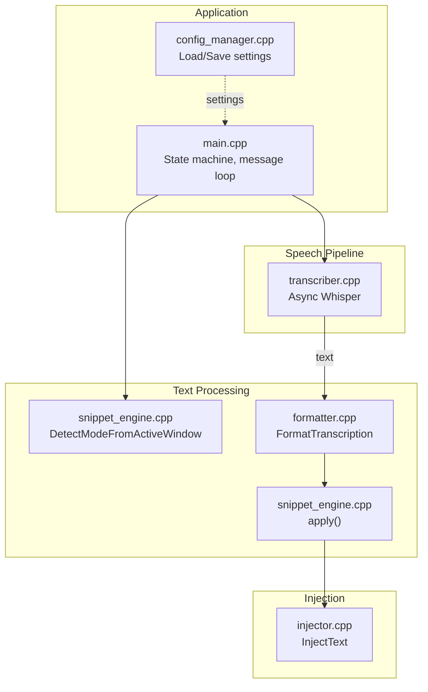
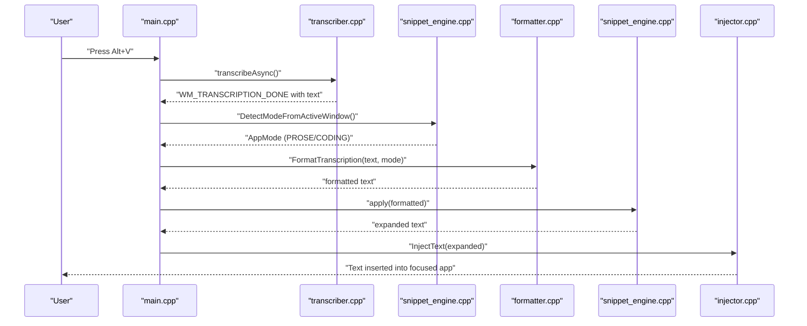
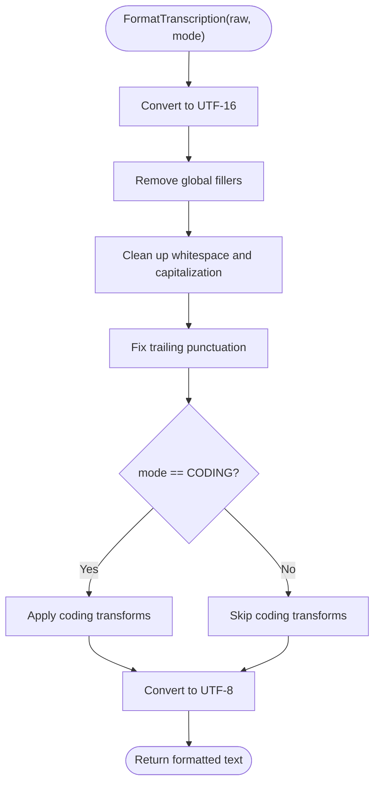
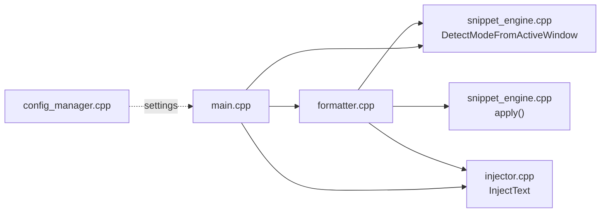

# Text Formatter

<cite>
**Referenced Files in This Document**
- [formatter.h](file://src/formatter.h)
- [formatter.cpp](file://src/formatter.cpp)
- [snippet_engine.h](file://src/snippet_engine.h)
- [snippet_engine.cpp](file://src/snippet_engine.cpp)
- [injector.h](file://src/injector.h)
- [injector.cpp](file://src/injector.cpp)
- [main.cpp](file://src/main.cpp)
- [transcriber.h](file://src/transcriber.h)
- [transcriber.cpp](file://src/transcriber.cpp)
- [config_manager.h](file://src/config_manager.h)
- [config_manager.cpp](file://src/config_manager.cpp)
- [settings.default.json](file://assets/settings.default.json)
- [README.md](file://README.md)
</cite>

## Table of Contents
1. [Introduction](#introduction)
2. [Project Structure](#project-structure)
3. [Core Components](#core-components)
4. [Architecture Overview](#architecture-overview)
5. [Detailed Component Analysis](#detailed-component-analysis)
6. [Dependency Analysis](#dependency-analysis)
7. [Performance Considerations](#performance-considerations)
8. [Troubleshooting Guide](#troubleshooting-guide)
9. [Conclusion](#conclusion)
10. [Appendices](#appendices)

## Introduction
This document explains the Text Formatter component that powers intelligent text processing in the application. It covers the four-pass transcription pipeline, context-aware formatting for prose and code, regex-based transformations, punctuation and capitalization rules, spacing normalization, and integration with application mode detection, snippet expansion, and text injection. Practical guidance is provided for configuring formatter behavior, extending rules, and optimizing performance.

## Project Structure
The formatter lives alongside related components that handle mode detection, snippet expansion, and text injection. The main application orchestrates the end-to-end flow from recording to injection.

**Diagram sources**
- [main.cpp](file://src/main.cpp#L244-L342)
- [transcriber.cpp](file://src/transcriber.cpp#L103-L225)
- [snippet_engine.cpp](file://src/snippet_engine.cpp#L35-L81)
- [formatter.cpp](file://src/formatter.cpp#L137-L147)
- [injector.cpp](file://src/injector.cpp#L49-L74)

**Section sources**
- [README.md](file://README.md#L69-L123)

## Core Components
- AppMode: Determines formatter behavior and coding transforms.
- Four-pass formatter:
  - Pass 1: Strip universal fillers (um, uh, …)
  - Pass 2: Strip sentence-start fillers (so, well, …) anchored to start-of-line
  - Pass 3: Normalize whitespace, trim leading punctuation, capitalize first letter
  - Pass 4: Ensure trailing punctuation
  - Pass 5 (CODING only): Apply camelCase, snake_case, or ALL_CAPS transforms
- Mode detection: Heuristically detect code editor/terminal contexts.
- Snippet engine: Case-insensitive word-level replacement after formatting.
- Text injection: SendInput for short text; clipboard fallback for long text or emoji.

**Section sources**
- [formatter.h](file://src/formatter.h#L4-L13)
- [formatter.cpp](file://src/formatter.cpp#L137-L147)
- [snippet_engine.h](file://src/snippet_engine.h#L5-L25)
- [snippet_engine.cpp](file://src/snippet_engine.cpp#L35-L81)
- [injector.h](file://src/injector.h#L4-L8)
- [injector.cpp](file://src/injector.cpp#L49-L74)

## Architecture Overview
The formatter sits between transcription and injection. It receives raw text, applies context-aware transformations, expands snippets, and produces final text ready for injection.

**Diagram sources**
- [main.cpp](file://src/main.cpp#L244-L342)
- [transcriber.cpp](file://src/transcriber.cpp#L103-L225)
- [snippet_engine.cpp](file://src/snippet_engine.cpp#L35-L81)
- [formatter.cpp](file://src/formatter.cpp#L137-L147)
- [injector.cpp](file://src/injector.cpp#L49-L74)

## Detailed Component Analysis

### Four-Pass Formatter
The formatter operates on UTF-8 input by converting to UTF-16, applying passes, then converting back to UTF-8. Regex objects are compiled once for performance.

- Pass 1: Universal fillers removed globally (e.g., um, uh, er, hmm).
- Pass 2: Sentence-start fillers removed only at line start (e.g., so, well, okay).
- Pass 3: Collapse multiple spaces, trim leading/trailing whitespace, remove leading punctuation, uppercase first character.
- Pass 4: Ensure trailing punctuation (. ? ! :).
- Pass 5 (CODING only): Transform identifiers based on voice commands:
  - camel case transform
  - snake case transform
  - ALL CAPS transform
  - Remove trailing period for identifiers

**Diagram sources**
- [formatter.cpp](file://src/formatter.cpp#L137-L147)
- [formatter.cpp](file://src/formatter.cpp#L65-L91)
- [formatter.cpp](file://src/formatter.cpp#L114-L133)

**Section sources**
- [formatter.h](file://src/formatter.h#L7-L13)
- [formatter.cpp](file://src/formatter.cpp#L137-L147)
- [formatter.cpp](file://src/formatter.cpp#L65-L91)
- [formatter.cpp](file://src/formatter.cpp#L114-L133)

### Regex-Based Transformation System
- Fillers are defined as word-boundary regex patterns and applied globally or anchored to start-of-line.
- Whitespace normalization uses a multi-space collapse and trimming regex.
- Leading punctuation removal removes commas, semicolons, and colons at the start of a token.
- Coding transforms use anchored patterns to match voice commands and extract the identifier portion.

Key patterns and behaviors:
- Global fillers: um, uh, ah, er, hmm, you know.
- Sentence-start fillers: so, well, okay, ok, like, basically, kind of, sort of, right, alright, now then.
- Whitespace: collapse multiple spaces to one, trim leading/trailing.
- Capitalization: uppercase first character after cleanup.
- Trailing punctuation: append period, question mark, exclamation mark, or colon if missing.
- Coding transforms:
  - camel case: “camel case …” → convert to userName
  - snake case: “snake case …” → convert to user_name
  - all caps: “all caps …” → convert to USER_NAME and uppercase
  - identifiers: remove trailing period for code identifiers

**Section sources**
- [formatter.cpp](file://src/formatter.cpp#L14-L38)
- [formatter.cpp](file://src/formatter.cpp#L74-L91)
- [formatter.cpp](file://src/formatter.cpp#L114-L133)

### Application Context Detection and Mode Selection
The formatter’s behavior depends on AppMode:
- PROSE: Standard punctuation and capitalization cleanup.
- CODING: Additional transforms for identifiers and removal of trailing periods for code.

Mode selection occurs in two ways:
- Explicit configuration: settings.json mode field.
- Automatic detection: heuristically detect code editors and terminals by inspecting the foreground process path.

Automatic detection matches known code editor and terminal executables by substring.

**Section sources**
- [formatter.h](file://src/formatter.h#L4-L5)
- [main.cpp](file://src/main.cpp#L300-L303)
- [snippet_engine.cpp](file://src/snippet_engine.cpp#L35-L81)
- [config_manager.h](file://src/config_manager.h#L8-L19)
- [config_manager.cpp](file://src/config_manager.cpp#L24-L57)
- [settings.default.json](file://assets/settings.default.json#L1-L16)

### Snippet Engine Integration
After formatting, the snippet engine performs case-insensitive word-level replacements. It:
- Converts input to lowercase for matching.
- Applies longest-first replacement to avoid partial matches interfering with others.
- Enforces a maximum snippet length to prevent abuse.

This runs after the formatter and before injection, allowing both prose and code text to be expanded with predefined triggers.

**Section sources**
- [snippet_engine.h](file://src/snippet_engine.h#L5-L19)
- [snippet_engine.cpp](file://src/snippet_engine.cpp#L6-L28)

### Text Injection Timing and Strategy
Text injection occurs immediately after formatting and snippet expansion. The injector:
- Uses SendInput for short text (<= 200 characters) with no surrogate pairs.
- Falls back to clipboard paste (Ctrl+V) for longer text or text containing surrogate pairs (emoji, some CJK).
- Ensures compatibility across applications, including terminals that reject raw Unicode input.

**Section sources**
- [injector.h](file://src/injector.h#L4-L8)
- [injector.cpp](file://src/injector.cpp#L49-L74)

### Formatting Rules by Scenario
- Code blocks and identifiers:
  - Voice commands trigger transforms; trailing periods are removed for identifiers.
  - CamelCase, snake_case, and ALL CAPS transforms are supported.
- Natural language:
  - Fillers are stripped, punctuation normalized, and capitalization corrected.
- URLs and special characters:
  - URLs are treated as plain text; no special URL normalization is performed.
  - Special characters are preserved; spacing normalization cleans up excessive whitespace.

**Section sources**
- [formatter.cpp](file://src/formatter.cpp#L114-L133)
- [formatter.cpp](file://src/formatter.cpp#L74-L91)

### Practical Examples and Configuration
- Configure mode:
  - Set mode to auto, prose, or code in settings.json. When set to auto, the application attempts to detect code editors and terminals.
- Define snippets:
  - Add trigger → expansion pairs in settings.json. The snippet engine replaces them case-insensitively.
- Example snippet entries:
  - Email address, boilerplate code, TODO/FIXME markers, dates, and links.

**Section sources**
- [config_manager.cpp](file://src/config_manager.cpp#L43-L51)
- [settings.default.json](file://assets/settings.default.json#L7-L14)

### Custom Rule Implementation
Extending the formatter involves adding new regex patterns and transformations:
- Add new global or sentence-start filler patterns in the pass-1 and pass-2 lists.
- Introduce new coding transforms by adding new anchored patterns and corresponding conversion functions.
- Ensure all regex objects are compiled once (outside the hot path) and use wide-character regex for Unicode correctness.

Best practices:
- Keep regex patterns minimal and anchored where appropriate.
- Preserve original semantics when transforming identifiers.
- Test with various Unicode inputs and emoji to ensure robustness.

**Section sources**
- [formatter.cpp](file://src/formatter.cpp#L14-L38)
- [formatter.cpp](file://src/formatter.cpp#L114-L133)

### Relationship with Transcriber and Error Recovery
- The transcriber runs asynchronously and posts a completion message with the raw text.
- The formatter is invoked upon receipt of the completion message.
- Duplicate messages are guarded against with a time-based filter to avoid reprocessing stale results.
- Repetition detection in the transcriber helps reduce hallucinations before formatting.

**Section sources**
- [transcriber.cpp](file://src/transcriber.cpp#L103-L225)
- [main.cpp](file://src/main.cpp#L280-L292)
- [transcriber.cpp](file://src/transcriber.cpp#L17-L46)

## Dependency Analysis
The formatter depends on:
- Windows APIs for UTF-8/UTF-16 conversions.
- Regex-based cleanup and transforms.
- Mode detection for context-aware behavior.
- Snippet engine for post-processing.
- Injector for final delivery.

**Diagram sources**
- [formatter.cpp](file://src/formatter.cpp#L137-L147)
- [snippet_engine.cpp](file://src/snippet_engine.cpp#L35-L81)
- [injector.cpp](file://src/injector.cpp#L49-L74)
- [main.cpp](file://src/main.cpp#L244-L342)
- [config_manager.cpp](file://src/config_manager.cpp#L24-L57)

**Section sources**
- [formatter.cpp](file://src/formatter.cpp#L137-L147)
- [main.cpp](file://src/main.cpp#L244-L342)

## Performance Considerations
- Regex compilation cost is amortized by pre-compiling regex objects once at module load time.
- UTF-8/UTF-16 conversions are performed only once per pass.
- The snippet engine uses case-insensitive matching with longest-first replacement to minimize redundant replacements.
- Injection uses SendInput for short text and clipboard fallback for long text or emoji to avoid application-specific issues.
- The transcriber applies aggressive optimizations (single segment, reduced audio context, greedy decoding) to keep latency low.

[No sources needed since this section provides general guidance]

## Troubleshooting Guide
- Incorrect mode:
  - If automatic detection does not match your editor, set mode explicitly in settings.json.
- Snippet not expanding:
  - Ensure the trigger is present in the formatted text and not masked by later transformations.
- Emoji or surrogate pairs not injected:
  - Long text or emoji trigger clipboard fallback; this is expected behavior.
- Unexpected punctuation:
  - Verify that the trailing punctuation pass is not conflicting with intended output; adjust voice commands accordingly.
- Repetitive transcription:
  - The transcriber includes repetition detection; if still occurring, consider adjusting voice command clarity.

**Section sources**
- [main.cpp](file://src/main.cpp#L300-L303)
- [injector.cpp](file://src/injector.cpp#L53-L57)
- [transcriber.cpp](file://src/transcriber.cpp#L17-L46)

## Conclusion
The Text Formatter provides a robust, context-aware pipeline that cleans and enriches transcribed speech for both prose and code contexts. Its modular design integrates seamlessly with mode detection, snippet expansion, and injection, while maintaining performance and reliability across diverse applications and input types.

[No sources needed since this section summarizes without analyzing specific files]

## Appendices

### Unicode and Internationalization Notes
- The formatter converts to UTF-16 for processing to support Unicode and wide-character operations.
- Regex patterns operate on wide characters, enabling correct handling of international characters.
- Surrogate pairs (emoji, some CJK) are detected to ensure compatibility with older applications by falling back to clipboard injection.

**Section sources**
- [formatter.cpp](file://src/formatter.cpp#L43-L63)
- [injector.cpp](file://src/injector.cpp#L10-L16)