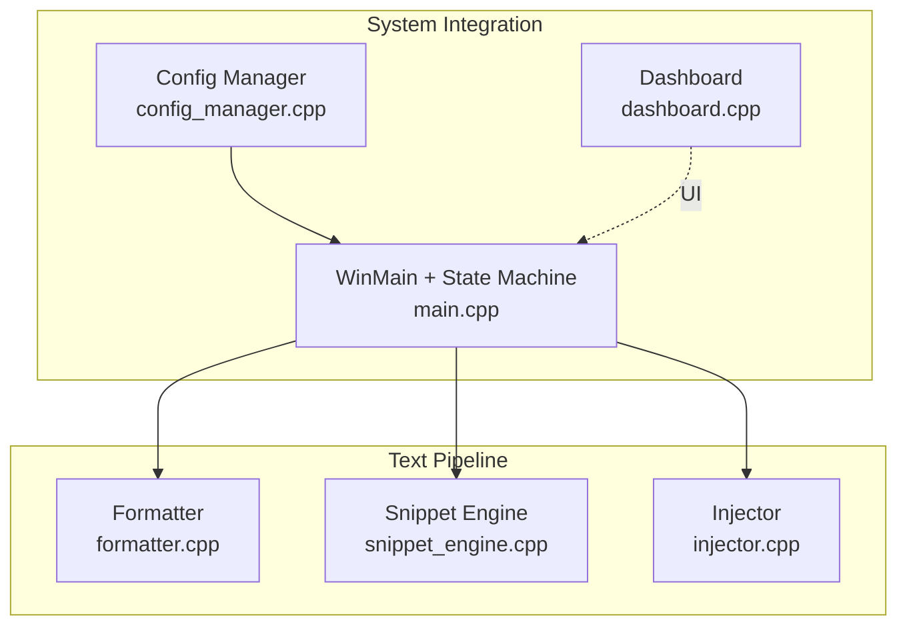
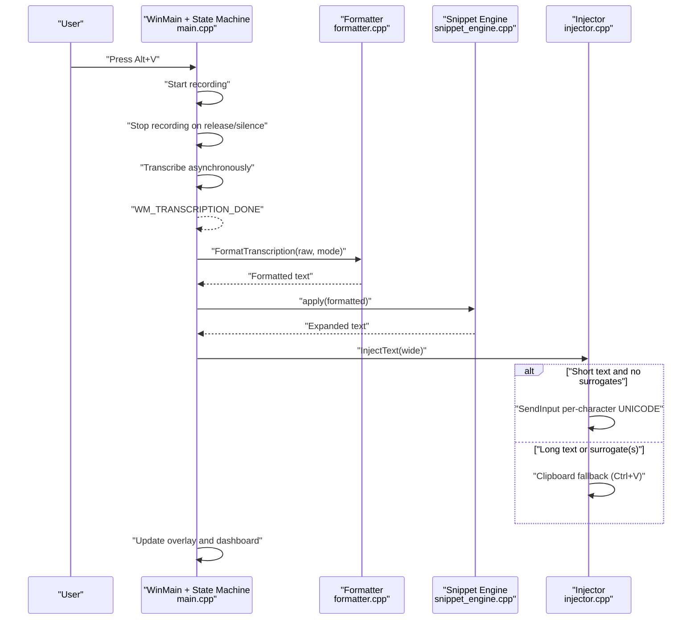
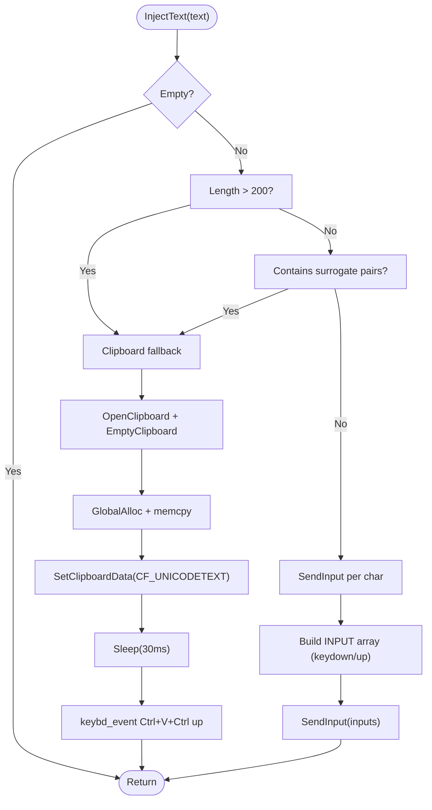
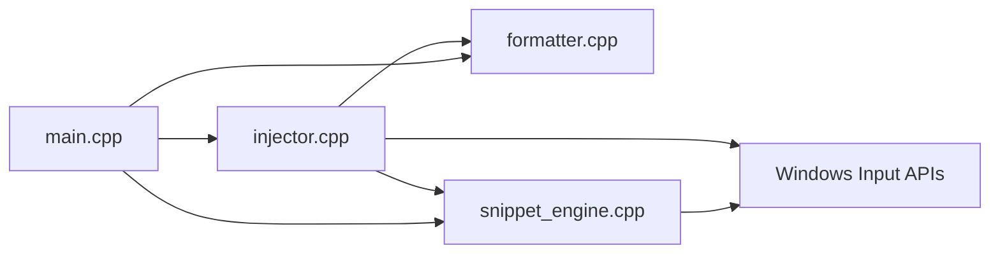

# Text Injector

<cite>
**Referenced Files in This Document**
- [injector.h](file://src/injector.h)
- [injector.cpp](file://src/injector.cpp)
- [main.cpp](file://src/main.cpp)
- [formatter.h](file://src/formatter.h)
- [formatter.cpp](file://src/formatter.cpp)
- [snippet_engine.h](file://src/snippet_engine.h)
- [snippet_engine.cpp](file://src/snippet_engine.cpp)
- [config_manager.h](file://src/config_manager.h)
- [config_manager.cpp](file://src/config_manager.cpp)
- [dashboard.h](file://src/dashboard.h)
- [dashboard.cpp](file://src/dashboard.cpp)
- [README.md](file://README.md)
</cite>

## Table of Contents
1. [Introduction](#introduction)
2. [Project Structure](#project-structure)
3. [Core Components](#core-components)
4. [Architecture Overview](#architecture-overview)
5. [Detailed Component Analysis](#detailed-component-analysis)
6. [Dependency Analysis](#dependency-analysis)
7. [Performance Considerations](#performance-considerations)
8. [Troubleshooting Guide](#troubleshooting-guide)
9. [Security and Accessibility Considerations](#security-and-accessibility-considerations)
10. [Conclusion](#conclusion)

## Introduction
This document explains the Text Injector component responsible for injecting transcribed text into the currently focused application. It covers:
- The Windows SendInput API strategy for direct text injection
- Virtual key mapping and keyboard state management
- Input synthesis techniques for Unicode text
- Clipboard fallback for applications that reject direct input
- Focus detection and application compatibility handling
- Timing synchronization with text formatting and validation
- Error recovery and practical troubleshooting
- Security and accessibility considerations

## Project Structure
The Text Injector is part of the broader FLOW-ON voice-to-text pipeline. The relevant modules are:
- Text injection: injector.h, injector.cpp
- Formatting and snippet expansion: formatter.h, formatter.cpp, snippet_engine.h, snippet_engine.cpp
- Active window detection: snippet_engine.cpp (DetectModeFromActiveWindow)
- Integration and state machine: main.cpp
- Settings and configuration: config_manager.h, config_manager.cpp
- Dashboard UI: dashboard.h, dashboard.cpp

**Diagram sources**
- [injector.cpp](file://src/injector.cpp#L1-L75)
- [formatter.cpp](file://src/formatter.cpp#L1-L148)
- [snippet_engine.cpp](file://src/snippet_engine.cpp#L1-L82)
- [main.cpp](file://src/main.cpp#L149-L342)
- [config_manager.cpp](file://src/config_manager.cpp#L1-L108)
- [dashboard.cpp](file://src/dashboard.cpp#L1-L454)

**Section sources**
- [README.md](file://README.md#L69-L124)
- [main.cpp](file://src/main.cpp#L149-L342)

## Core Components
- Injector: Implements the injection strategy and clipboard fallback.
- Formatter: Applies four-pass cleanup and punctuation normalization.
- Snippet Engine: Performs case-insensitive word-level substitutions.
- Active Window Detector: Determines whether the foreground application is a code editor.
- State Machine: Orchestrates the end-to-end flow from hotkey to injection.

**Section sources**
- [injector.h](file://src/injector.h#L1-L9)
- [injector.cpp](file://src/injector.cpp#L1-L75)
- [formatter.h](file://src/formatter.h#L1-L14)
- [formatter.cpp](file://src/formatter.cpp#L1-L148)
- [snippet_engine.h](file://src/snippet_engine.h#L1-L26)
- [snippet_engine.cpp](file://src/snippet_engine.cpp#L1-L82)
- [main.cpp](file://src/main.cpp#L149-L342)

## Architecture Overview
The injection pipeline is triggered by the hotkey state machine. After transcription completes, the formatted and snippet-expanded text is converted to wide characters and injected either via SendInput or clipboard paste.

**Diagram sources**
- [main.cpp](file://src/main.cpp#L149-L342)
- [formatter.cpp](file://src/formatter.cpp#L137-L147)
- [snippet_engine.cpp](file://src/snippet_engine.cpp#L6-L28)
- [injector.cpp](file://src/injector.cpp#L49-L74)

## Detailed Component Analysis

### Text Injection Strategy
The injector selects between two paths:
- Direct injection using Windows SendInput with per-character KEYEVENTF_UNICODE input events.
- Clipboard fallback using OpenClipboard, SetClipboardData, and synthesized Ctrl+V keystrokes.

Key behaviors:
- Surrogate pair detection: Characters outside BMP (e.g., emoji) are detected and force clipboard fallback.
- Threshold-based selection: Strings longer than 200 characters trigger clipboard fallback.
- Input synthesis: Each character is sent as a pair of keydown and keyup events using wScan and KEYEVENTF_UNICODE.
- Clipboard fallback: Places a wide-string null-terminated buffer into CF_UNICODETEXT, waits briefly, then sends Ctrl+V.

**Diagram sources**
- [injector.cpp](file://src/injector.cpp#L10-L16)
- [injector.cpp](file://src/injector.cpp#L21-L47)
- [injector.cpp](file://src/injector.cpp#L49-L74)

**Section sources**
- [injector.h](file://src/injector.h#L4-L8)
- [injector.cpp](file://src/injector.cpp#L10-L16)
- [injector.cpp](file://src/injector.cpp#L21-L47)
- [injector.cpp](file://src/injector.cpp#L49-L74)

### Virtual Key Mapping and Keyboard State Management
- Per-character injection uses wScan with KEYEVENTF_UNICODE to synthesize typed characters directly.
- Clipboard fallback simulates Ctrl+V using legacy keybd_event calls for the V key and Control modifier.
- The system relies on the current foreground window receiving input; focus detection is handled upstream by DetectModeFromActiveWindow.

Notes:
- KEYEVENTF_UNICODE does not require a physical keyboard layout mapping; the OS converts wScan to the target application’s input method.
- The fallback path uses legacy APIs for compatibility with applications that reject raw Unicode input.

**Section sources**
- [injector.cpp](file://src/injector.cpp#L59-L71)
- [injector.cpp](file://src/injector.cpp#L43-L46)

### Clipboard Fallback Mechanism
The clipboard fallback ensures broad compatibility:
- Opens the clipboard and empties it.
- Allocates global memory sized for a wide string plus terminator.
- Copies the wide string into allocated memory and sets CF_UNICODETEXT.
- Waits briefly to allow the target to process WM_DRAWCLIPBOARD before sending paste keys.
- Sends Ctrl+V and releases modifiers.

Safety and ownership:
- After SetClipboardData, the OS owns the HGLOBAL; do not free it manually.

**Section sources**
- [injector.cpp](file://src/injector.cpp#L21-L47)

### Focus Detection and Application Compatibility
The system detects the active application to select the appropriate formatting mode:
- Retrieves the foreground window handle and process ID.
- Queries the process image name to determine if it matches known code editors or terminals.
- Returns AppMode::CODING for editors/terminals; otherwise AppMode::PROSE.

This influences downstream formatting (e.g., camelCase/snake_case transforms) but does not alter the injection strategy itself.

**Section sources**
- [snippet_engine.cpp](file://src/snippet_engine.cpp#L35-L81)
- [formatter.h](file://src/formatter.h#L4-L6)

### Timing Synchronization and Validation
- The state machine transitions through IDLE → RECORDING → TRANSCRIBING → INJECTING → IDLE.
- The hotkey release detection polls GetAsyncKeyState every 50 ms to reliably stop recording.
- After transcription completion, the system measures latency from recording start to injection finish.
- Duplicate message guards prevent reprocessing of the same transcription event.

Formatting and snippet expansion occur before injection, ensuring the final text is ready for input synthesis.

**Section sources**
- [main.cpp](file://src/main.cpp#L185-L222)
- [main.cpp](file://src/main.cpp#L280-L342)
- [formatter.cpp](file://src/formatter.cpp#L137-L147)
- [snippet_engine.cpp](file://src/snippet_engine.cpp#L6-L28)

### Practical Examples and Setup
- Typical injection setup:
  - Register hotkey Alt+V (Alt+Shift+V fallback if needed).
  - On release or silence, transcribe audio and format text.
  - Expand snippets and inject into the active window.
- Application-specific handling:
  - Code editors and terminals: CODING mode enables camelCase/snake_case transforms.
  - General text areas: PROSE mode cleans fillers and punctuation.
- Troubleshooting:
  - If injection fails, verify the active window accepts keyboard input and is not protected by modal dialogs.
  - For applications rejecting Unicode input, the fallback path should still work via clipboard paste.

**Section sources**
- [main.cpp](file://src/main.cpp#L162-L178)
- [main.cpp](file://src/main.cpp#L300-L320)
- [formatter.cpp](file://src/formatter.cpp#L114-L133)
- [injector.cpp](file://src/injector.cpp#L21-L47)

## Dependency Analysis
The injector depends on:
- Windows input APIs for SendInput and clipboard operations.
- Upstream formatting and snippet expansion for preprocessed text.
- Active window detection to infer mode.

**Diagram sources**
- [injector.cpp](file://src/injector.cpp#L1-L75)
- [formatter.cpp](file://src/formatter.cpp#L1-L148)
- [snippet_engine.cpp](file://src/snippet_engine.cpp#L1-L82)
- [main.cpp](file://src/main.cpp#L149-L342)

**Section sources**
- [injector.cpp](file://src/injector.cpp#L1-L75)
- [main.cpp](file://src/main.cpp#L149-L342)

## Performance Considerations
- Direct injection via SendInput is efficient for short texts and avoids clipboard overhead.
- Clipboard fallback introduces a small delay (sleep) to allow the target to process clipboard notifications.
- The 200-character threshold balances compatibility with performance.
- Surrogate pair detection prevents older applications from crashing on raw Unicode events.

[No sources needed since this section provides general guidance]

## Troubleshooting Guide
Common issues and remedies:
- Injection does nothing:
  - Ensure the active window accepts keyboard input (not modal dialog).
  - Try clipboard fallback by adding emoji or exceeding 200 characters.
- Garbled or missing characters:
  - Confirm the target application supports Unicode input.
  - Some terminals may require the clipboard fallback path.
- Hotkey conflicts:
  - The system attempts Alt+V; if taken, falls back to Alt+Shift+V and updates the tray tooltip.
- Duplicate processing:
  - The system ignores duplicate WM_TRANSCRIPTION_DONE within 500 ms.

**Section sources**
- [injector.cpp](file://src/injector.cpp#L10-L16)
- [injector.cpp](file://src/injector.cpp#L21-L47)
- [main.cpp](file://src/main.cpp#L162-L178)
- [main.cpp](file://src/main.cpp#L280-L292)

## Security and Accessibility Considerations
- Clipboard safety:
  - Clipboard data is freed by the OS after SetClipboardData; do not free it manually.
  - Snippet values are sanitized to a maximum length to prevent abuse.
- Permissions:
  - Requires standard desktop privileges to access the clipboard and simulate input.
  - Does not require elevated permissions.
- Accessibility:
  - Uses standard Windows input APIs; does not rely on UI automation.
  - Respects the active window’s input focus; does not inject into non-focused windows.
- Internationalization:
  - Uses Unicode (wide strings) and KEYEVENTF_UNICODE; works with various keyboard layouts.
  - Surrogate pairs are detected and routed to clipboard fallback to avoid application crashes.

**Section sources**
- [injector.cpp](file://src/injector.cpp#L21-L47)
- [config_manager.cpp](file://src/config_manager.cpp#L46-L48)

## Conclusion
The Text Injector provides robust, cross-application text injection using a hybrid strategy:
- Prefer direct injection via SendInput for short, non-surrogate text.
- Fall back to clipboard paste for long text or Unicode beyond BMP.
- Seamlessly integrated with formatting, snippet expansion, and active window detection to tailor behavior to the target application.

[No sources needed since this section summarizes without analyzing specific files]