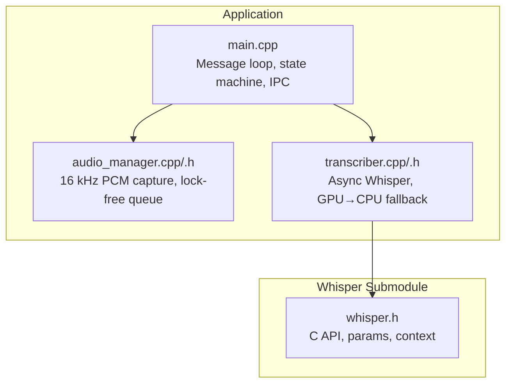
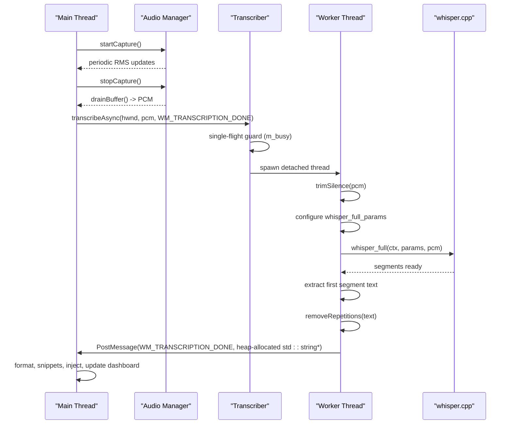
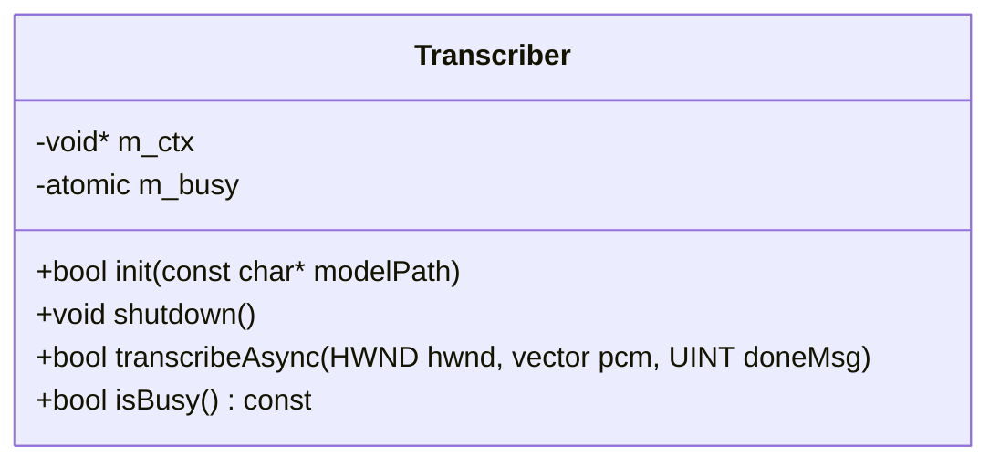
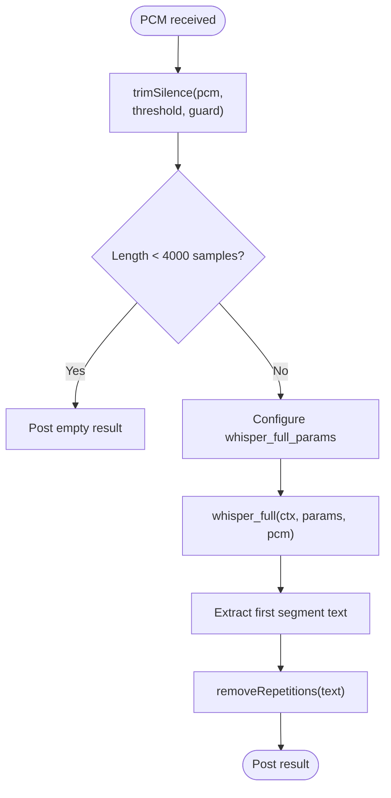
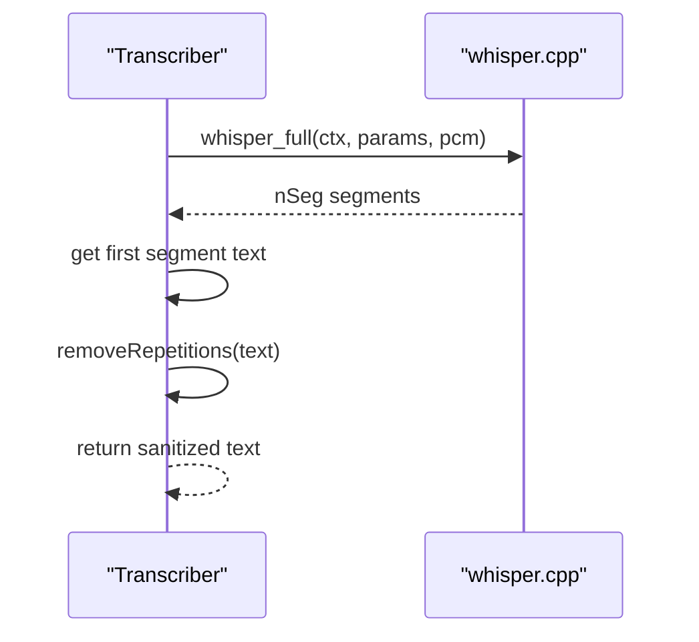
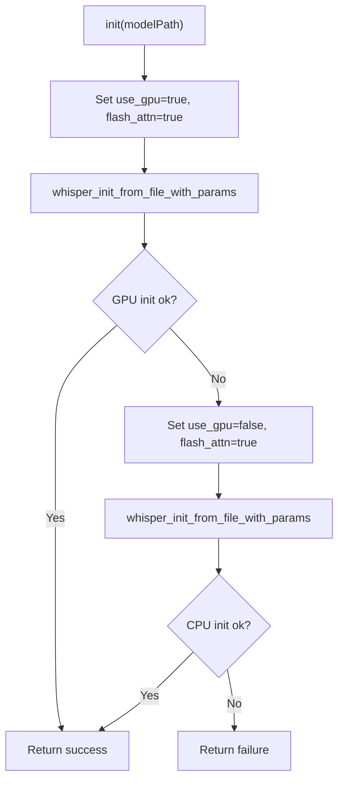
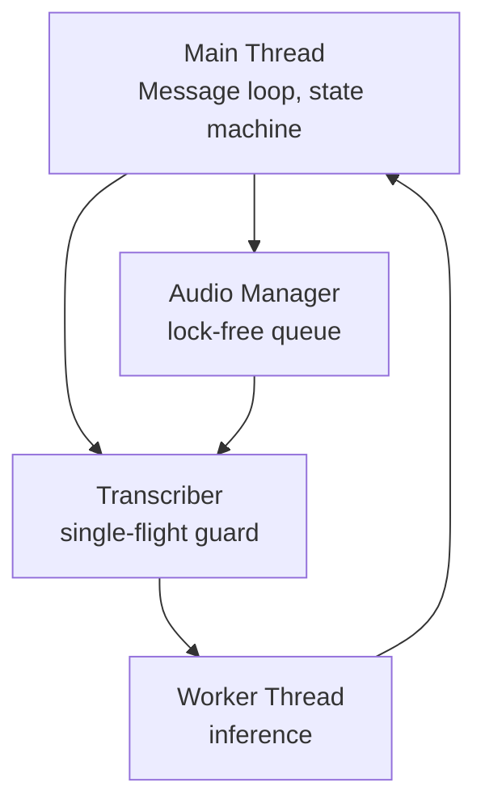
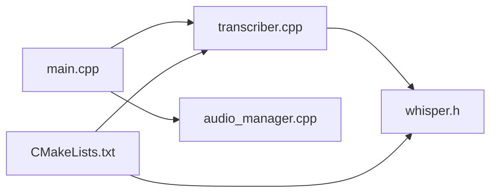

# Transcriber

<cite>
**Referenced Files in This Document**
- [transcriber.h](file://src/transcriber.h)
- [transcriber.cpp](file://src/transcriber.cpp)
- [whisper.h](file://external/whisper.cpp/include/whisper.h)
- [main.cpp](file://src/main.cpp)
- [CMakeLists.txt](file://CMakeLists.txt)
- [PERFORMANCE.md](file://PERFORMANCE.md)
- [README.md](file://README.md)
- [audio_manager.h](file://src/audio_manager.h)
- [audio_manager.cpp](file://src/audio_manager.cpp)
- [settings.default.json](file://assets/settings.default.json)
</cite>

## Table of Contents
1. [Introduction](#introduction)
2. [Project Structure](#project-structure)
3. [Core Components](#core-components)
4. [Architecture Overview](#architecture-overview)
5. [Detailed Component Analysis](#detailed-component-analysis)
6. [Dependency Analysis](#dependency-analysis)
7. [Performance Considerations](#performance-considerations)
8. [Troubleshooting Guide](#troubleshooting-guide)
9. [Conclusion](#conclusion)
10. [Appendices](#appendices)

## Introduction
This document explains the Transcriber component that powers offline speech-to-text using whisper.cpp. It covers model loading and quantized model management, GPU acceleration configuration with CUDA support and CPU fallback, the asynchronous transcription pipeline, threading architecture, inter-thread communication, audio preprocessing, feature extraction, and text generation. Practical examples demonstrate initialization, execution, and result handling, along with configuration options for model quality, language settings, and performance tuning. Memory management, model caching, and resource cleanup are also addressed.

## Project Structure
The Transcriber resides in the src directory and integrates with the whisper.cpp submodule. The main application orchestrates audio capture, state transitions, and transcription completion callbacks. Build configuration enables AVX2 and optional CUDA for performance.

**Diagram sources**
- [main.cpp](file://src/main.cpp#L1-L521)
- [audio_manager.cpp](file://src/audio_manager.cpp#L1-L122)
- [transcriber.cpp](file://src/transcriber.cpp#L1-L226)
- [whisper.h](file://external/whisper.cpp/include/whisper.h#L1-L742)

**Section sources**
- [README.md](file://README.md#L69-L124)
- [CMakeLists.txt](file://CMakeLists.txt#L30-L51)

## Core Components
- Transcriber: Asynchronous transcription with GPU acceleration and CPU fallback, single-flight concurrency control, and result delivery via Windows messages.
- whisper.cpp: C API for model loading, context configuration, and inference.
- Audio Manager: Lock-free ring buffer for 16 kHz PCM capture and RMS computation.
- Main application: Orchestrates state machine, IPC, and post-processing.

Key responsibilities:
- Model lifecycle: Initialize context with GPU enabled, fall back to CPU if GPU init fails.
- Inference pipeline: Preprocess audio, configure decoding parameters for throughput, run inference, extract first segment text, and sanitize repetitive outputs.
- Concurrency: Single-flight guard prevents overlapping transcriptions; worker thread runs inference; UI remains responsive.

**Section sources**
- [transcriber.h](file://src/transcriber.h#L10-L28)
- [transcriber.cpp](file://src/transcriber.cpp#L79-L101)
- [whisper.h](file://external/whisper.cpp/include/whisper.h#L116-L129)
- [audio_manager.h](file://src/audio_manager.h#L9-L41)
- [audio_manager.cpp](file://src/audio_manager.cpp#L58-L122)
- [main.cpp](file://src/main.cpp#L462-L475)

## Architecture Overview
The Transcriber sits between the audio capture layer and the whisper.cpp backend. The main thread manages the UI, hotkey state, and transcription completion. The Transcriber spawns a worker thread to perform inference, posting a completion message back to the main thread.

**Diagram sources**
- [main.cpp](file://src/main.cpp#L244-L342)
- [transcriber.cpp](file://src/transcriber.cpp#L103-L225)
- [whisper.h](file://external/whisper.cpp/include/whisper.h#L603-L607)

## Detailed Component Analysis

### Transcriber Class
The Transcriber encapsulates model context, single-flight concurrency, and asynchronous inference. It exposes init, shutdown, and transcribeAsync methods and uses an atomic flag to guard against concurrent invocations.

**Diagram sources**
- [transcriber.h](file://src/transcriber.h#L10-L28)

Key behaviors:
- Model loading: Attempts GPU initialization with flash attention enabled; falls back to CPU if GPU init fails.
- Single-flight: Uses compare-and-swap to ensure only one transcription runs at a time.
- Worker thread: Detached thread performs preprocessing, inference, and result packaging.
- Completion: Posts a Windows message with a heap-allocated string pointer; caller must delete it.

**Section sources**
- [transcriber.cpp](file://src/transcriber.cpp#L79-L101)
- [transcriber.cpp](file://src/transcriber.cpp#L103-L225)
- [transcriber.h](file://src/transcriber.h#L7-L8)

### Audio Preprocessing and Feature Extraction
Preprocessing focuses on trimming silence and ensuring minimal compute on unvoiced regions. The Transcriber trims silent edges and guards against extremely short clips. Feature extraction is handled internally by whisper.cpp after PCM is prepared.

**Diagram sources**
- [transcriber.cpp](file://src/transcriber.cpp#L17-L77)
- [transcriber.cpp](file://src/transcriber.cpp#L125-L133)
- [transcriber.cpp](file://src/transcriber.cpp#L138-L186)
- [transcriber.cpp](file://src/transcriber.cpp#L192-L216)

Implementation highlights:
- Silence trimming: Finds first and last sample above threshold, adds guard windows, and erases silent tails.
- Minimum length check: Drops clips shorter than ~0.25 seconds.
- Parameter tuning: Greedy decoding, reduced audio context, single segment, disabled timestamps and token timestamps for throughput.

**Section sources**
- [transcriber.cpp](file://src/transcriber.cpp#L17-L77)
- [transcriber.cpp](file://src/transcriber.cpp#L138-L186)

### Inference Pipeline and Text Generation
The pipeline sets decoding parameters optimized for speed, runs inference, extracts the first segment, and sanitizes repetitive outputs. The Transcriber logs unexpected multiple segments and applies a deduplication heuristic.

**Diagram sources**
- [transcriber.cpp](file://src/transcriber.cpp#L186-L216)
- [whisper.h](file://external/whisper.cpp/include/whisper.h#L603-L607)

**Section sources**
- [transcriber.cpp](file://src/transcriber.cpp#L186-L216)
- [whisper.h](file://external/whisper.cpp/include/whisper.h#L628-L652)

### GPU Acceleration Configuration and CPU Fallback
The Transcriber attempts GPU initialization with flash attention enabled. If initialization fails, it retries with GPU disabled. Build configuration supports enabling CUDA via CMake flags.

**Diagram sources**
- [transcriber.cpp](file://src/transcriber.cpp#L79-L92)
- [whisper.h](file://external/whisper.cpp/include/whisper.h#L206-L208)
- [CMakeLists.txt](file://CMakeLists.txt#L48-L50)

**Section sources**
- [transcriber.cpp](file://src/transcriber.cpp#L79-L92)
- [CMakeLists.txt](file://CMakeLists.txt#L48-L50)

### Asynchronous Processing Model and Threading Architecture
The Transcriber uses a single-flight guard and a detached worker thread to run inference. The main thread remains responsive and receives results via a Windows message. The audio manager uses a lock-free queue to stream PCM data.

**Diagram sources**
- [main.cpp](file://src/main.cpp#L149-L357)
- [transcriber.cpp](file://src/transcriber.cpp#L103-L225)
- [audio_manager.cpp](file://src/audio_manager.cpp#L22-L56)

**Section sources**
- [transcriber.cpp](file://src/transcriber.cpp#L103-L225)
- [audio_manager.cpp](file://src/audio_manager.cpp#L22-L56)
- [main.cpp](file://src/main.cpp#L149-L357)

### Inter-Thread Communication Patterns
- Single-flight guard: Atomic compare-and-swap prevents concurrent transcriptions.
- Windows messages: The Transcriber posts WM_TRANSCRIPTION_DONE with a heap-allocated string pointer; the main thread deletes it after use.
- Lock-free queue: Audio manager enqueues PCM samples from the audio callback thread; main thread drains on demand.

**Section sources**
- [transcriber.cpp](file://src/transcriber.cpp#L106-L109)
- [transcriber.cpp](file://src/transcriber.cpp#L220-L221)
- [main.cpp](file://src/main.cpp#L280-L296)
- [audio_manager.cpp](file://src/audio_manager.cpp#L44-L45)

### Practical Examples

- Model initialization
  - Build with CUDA enabled (optional) and initialize the Transcriber with a model path.
  - Example invocation path: [main.cpp](file://src/main.cpp#L462-L475)

- Transcription execution
  - Start audio capture, stop on hotkey release, drain buffer, and call transcribeAsync.
  - Example invocation path: [main.cpp](file://src/main.cpp#L244-L274)

- Result handling
  - Receive WM_TRANSCRIPTION_DONE, format and apply snippets, inject text, and update dashboard.
  - Example handling path: [main.cpp](file://src/main.cpp#L280-L342)

- Configuration options
  - Settings template shows model selection and GPU toggle.
  - Example path: [settings.default.json](file://assets/settings.default.json#L1-L16)

**Section sources**
- [main.cpp](file://src/main.cpp#L462-L475)
- [main.cpp](file://src/main.cpp#L244-L274)
- [main.cpp](file://src/main.cpp#L280-L342)
- [settings.default.json](file://assets/settings.default.json#L1-L16)

## Dependency Analysis
The Transcriber depends on the whisper.cpp C API and integrates with the main application’s message loop and audio manager. Build configuration controls AVX2 and CUDA availability.

**Diagram sources**
- [main.cpp](file://src/main.cpp#L19-L26)
- [transcriber.cpp](file://src/transcriber.cpp#L2-L3)
- [whisper.h](file://external/whisper.cpp/include/whisper.h#L1-L10)
- [CMakeLists.txt](file://CMakeLists.txt#L30-L51)

**Section sources**
- [main.cpp](file://src/main.cpp#L19-L26)
- [transcriber.cpp](file://src/transcriber.cpp#L2-L3)
- [whisper.h](file://external/whisper.cpp/include/whisper.h#L1-L10)
- [CMakeLists.txt](file://CMakeLists.txt#L30-L51)

## Performance Considerations
- Model choice and quantization: The tiny.en model balances speed and accuracy; multilingual variants are available.
- GPU acceleration: Enabling CUDA via CMake yields 5–10× speedup on supported hardware.
- Decoding parameters: Greedy decoding, single segment, disabled timestamps, reduced audio context, and limited token limits improve throughput.
- CPU utilization: All available cores are used during transcription; adjust thread count for UI responsiveness.
- Audio context scaling: Context size adapts to clip duration to optimize speed-quality trade-offs.

Practical tuning references:
- Model switching and performance expectations: [PERFORMANCE.md](file://PERFORMANCE.md#L32-L88)
- Parameter tuning for speed/quality: [PERFORMANCE.md](file://PERFORMANCE.md#L90-L127)
- Build flags and CUDA enablement: [CMakeLists.txt](file://CMakeLists.txt#L48-L50)

**Section sources**
- [PERFORMANCE.md](file://PERFORMANCE.md#L32-L88)
- [PERFORMANCE.md](file://PERFORMANCE.md#L90-L127)
- [CMakeLists.txt](file://CMakeLists.txt#L48-L50)

## Troubleshooting Guide
- Model not found
  - Ensure the model file exists in the expected location relative to the executable.
  - Reference path building and error handling: [main.cpp](file://src/main.cpp#L133-L144), [main.cpp](file://src/main.cpp#L462-L475)

- GPU init fails
  - The Transcriber automatically falls back to CPU; verify CUDA availability and build flags if GPU is desired.
  - Initialization and fallback logic: [transcriber.cpp](file://src/transcriber.cpp#L79-L92), [CMakeLists.txt](file://CMakeLists.txt#L48-L50)

- Slow transcription
  - Confirm AVX2 support, adequate CPU cores, and absence of background interference.
  - Tune parameters and consider GPU acceleration.
  - References: [PERFORMANCE.md](file://PERFORMANCE.md#L143-L168), [PERFORMANCE.md](file://PERFORMANCE.md#L90-L127)

- Duplicate completion messages
  - The main thread guards against duplicates within a short interval and deletes extraneous pointers.
  - Reference: [main.cpp](file://src/main.cpp#L280-L296)

**Section sources**
- [main.cpp](file://src/main.cpp#L133-L144)
- [main.cpp](file://src/main.cpp#L462-L475)
- [transcriber.cpp](file://src/transcriber.cpp#L79-L92)
- [CMakeLists.txt](file://CMakeLists.txt#L48-L50)
- [PERFORMANCE.md](file://PERFORMANCE.md#L143-L168)
- [main.cpp](file://src/main.cpp#L280-L296)

## Conclusion
The Transcriber provides a robust, high-throughput, offline speech-to-text pipeline built on whisper.cpp. It integrates seamlessly with the application’s state machine and audio capture layer, offering GPU acceleration with CPU fallback, aggressive performance tuning, and safe asynchronous execution. Proper configuration of models, decoding parameters, and build flags yields significant speed improvements, while careful memory management and single-flight concurrency ensure reliability.

## Appendices

### Configuration Options Summary
- Model selection: tiny.en (default), base.en, multilingual tiny, etc.
- Language: defaults to English; configurable via parameters.
- GPU toggle: controlled by build flags and runtime settings.
- Performance tuning: decoding strategy, audio context, timestamps, segment mode, thread count.

References:
- Settings template: [settings.default.json](file://assets/settings.default.json#L1-L16)
- Parameter defaults and tuning: [transcriber.cpp](file://src/transcriber.cpp#L138-L186)
- Build flags and CUDA: [CMakeLists.txt](file://CMakeLists.txt#L48-L50)

**Section sources**
- [settings.default.json](file://assets/settings.default.json#L1-L16)
- [transcriber.cpp](file://src/transcriber.cpp#L138-L186)
- [CMakeLists.txt](file://CMakeLists.txt#L48-L50)