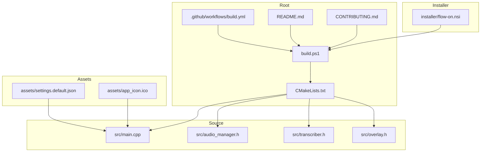
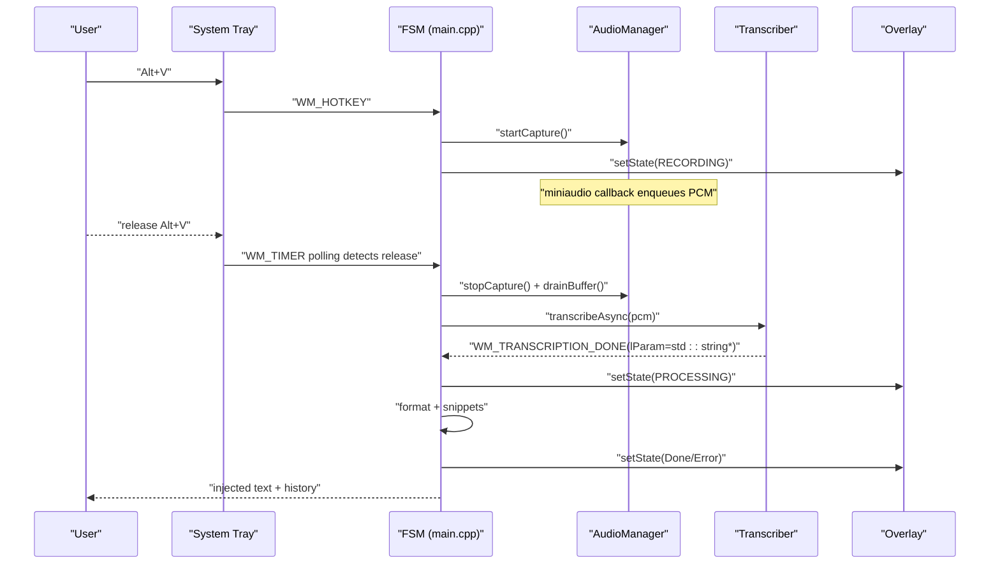
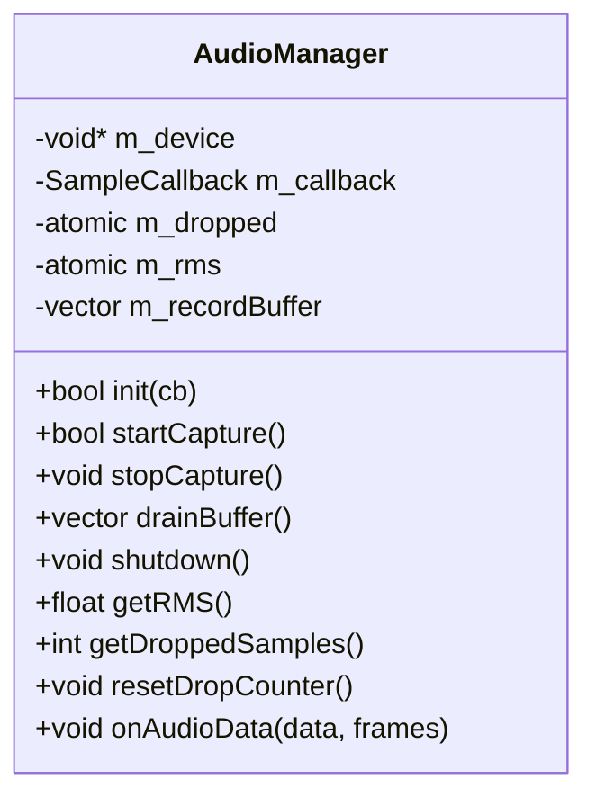
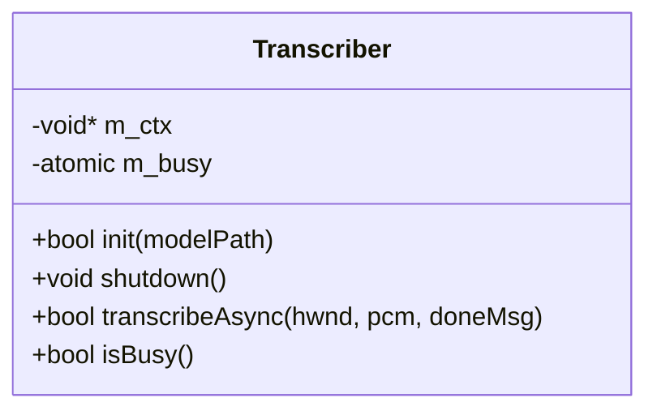
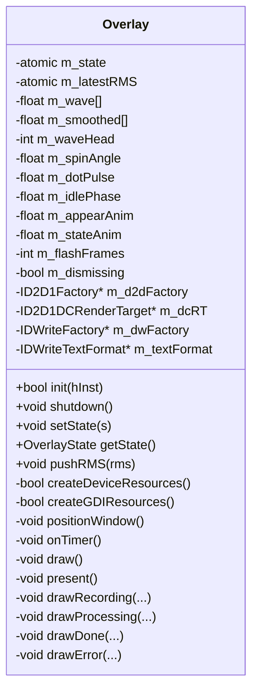
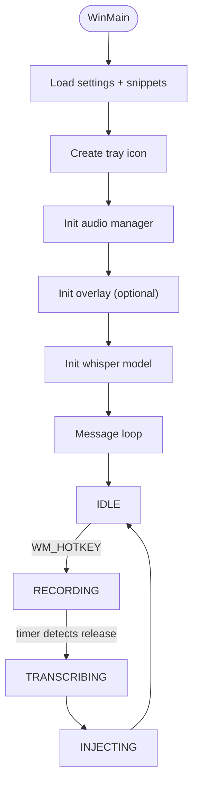
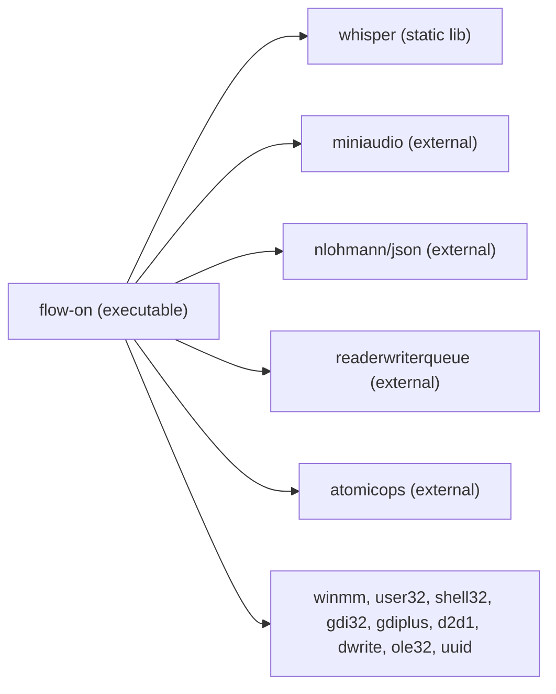
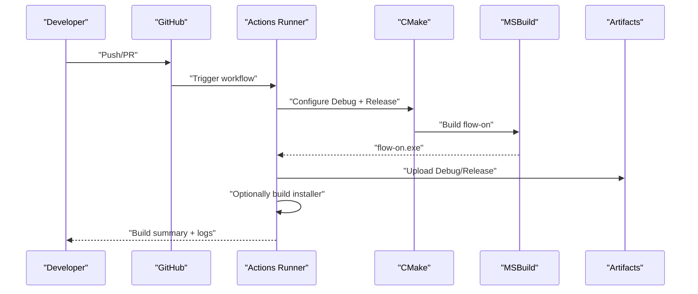
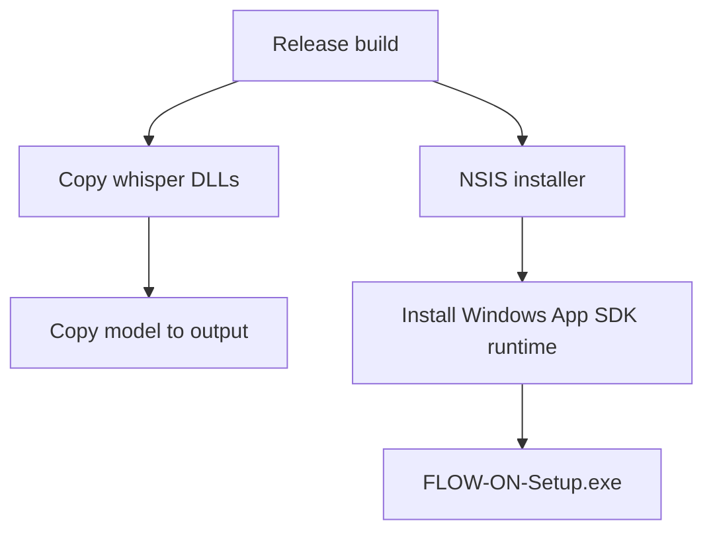

# Development Guide

<cite>
**Referenced Files in This Document**
- [README.md](file://README.md)
- [CONTRIBUTING.md](file://CONTRIBUTING.md)
- [CMakeLists.txt](file://CMakeLists.txt)
- [build.ps1](file://build.ps1)
- [setup-github.ps1](file://setup-github.ps1)
- [.github/workflows/build.yml](file://.github/workflows/build.yml)
- [src/main.cpp](file://src/main.cpp)
- [src/audio_manager.h](file://src/audio_manager.h)
- [src/transcriber.h](file://src/transcriber.h)
- [src/overlay.h](file://src/overlay.h)
- [installer/flow-on.nsi](file://installer/flow-on.nsi)
- [PERFORMANCE.md](file://PERFORMANCE.md)
- [assets/settings.default.json](file://assets/settings.default.json)
- [.gitignore](file://.gitignore)
</cite>

## Table of Contents
1. [Introduction](#introduction)
2. [Project Structure](#project-structure)
3. [Core Components](#core-components)
4. [Architecture Overview](#architecture-overview)
5. [Detailed Component Analysis](#detailed-component-analysis)
6. [Dependency Analysis](#dependency-analysis)
7. [Performance Considerations](#performance-considerations)
8. [Troubleshooting Guide](#troubleshooting-guide)
9. [Contribution Workflow](#contribution-workflow)
10. [Testing and Debugging](#testing-and-debugging)
11. [Continuous Integration](#continuous-integration)
12. [Build System Configuration](#build-system-configuration)
13. [Code Review and Quality Standards](#code-review-and-quality-standards)
14. [Extending Functionality](#extending-functionality)
15. [Release and Packaging](#release-and-packaging)
16. [Conclusion](#conclusion)

## Introduction
This development guide explains how to set up a Windows development environment for Flow-On, build the project, contribute changes, and maintain quality and performance. It covers prerequisites, build system configuration, dependency management, coding conventions, testing and debugging, CI/CD, and packaging for distribution.

## Project Structure
Flow-On is a Windows desktop application written in C++20 with a modular architecture. The repository is organized into:
- src/: Core application modules (audio, transcription, formatting, injection, overlay, dashboard, configuration)
- external/: Third-party dependencies (whisper.cpp, miniaudio, JSON parser, lock-free queue)
- assets/: Icons and default settings
- installer/: NSIS installer definition
- models/: Whisper model binaries (ignored by Git)
- redist/: Windows App SDK runtime redistributable (ignored by Git)
- .github/workflows/: GitHub Actions CI pipeline
- Top-level build scripts and configuration

**Diagram sources**
- [CMakeLists.txt](file://CMakeLists.txt#L1-L133)
- [build.ps1](file://build.ps1#L1-L89)
- [.github/workflows/build.yml](file://.github/workflows/build.yml#L1-L212)
- [README.md](file://README.md#L201-L232)
- [src/main.cpp](file://src/main.cpp#L1-L521)
- [src/audio_manager.h](file://src/audio_manager.h#L1-L42)
- [src/transcriber.h](file://src/transcriber.h#L1-L29)
- [src/overlay.h](file://src/overlay.h#L1-L94)
- [assets/settings.default.json](file://assets/settings.default.json#L1-L16)
- [installer/flow-on.nsi](file://installer/flow-on.nsi#L1-L157)

**Section sources**
- [README.md](file://README.md#L201-L232)
- [CMakeLists.txt](file://CMakeLists.txt#L56-L71)
- [build.ps1](file://build.ps1#L1-L89)

## Core Components
- Audio capture and buffering: miniaudio-based PCM capture, RMS computation, lock-free ring buffer
- Transcription backend: whisper.cpp with GPU/CPU fallback and OpenMP multi-threading
- Formatting and injection: regex-based cleanup and SendInput/clipboard injection
- Overlay: Direct2D floating pill with waveform visualization and state animations
- Dashboard: Win32 listbox UI (with optional WinUI 3)
- Configuration: JSON settings persisted under %APPDATA%\FLOW-ON

**Section sources**
- [README.md](file://README.md#L69-L123)
- [src/main.cpp](file://src/main.cpp#L66-L72)
- [src/audio_manager.h](file://src/audio_manager.h#L9-L42)
- [src/transcriber.h](file://src/transcriber.h#L10-L29)
- [src/overlay.h](file://src/overlay.h#L18-L94)

## Architecture Overview
The application uses a message-loop-driven WinMain with a finite state machine controlling the recording, transcription, and injection phases. Audio is captured asynchronously and enqueued into a lock-free buffer. Transcription runs on a worker thread with a single-flight guard. UI updates are handled by Direct2D overlay and Win32 dashboard.

**Diagram sources**
- [src/main.cpp](file://src/main.cpp#L185-L342)
- [src/audio_manager.h](file://src/audio_manager.h#L13-L24)
- [src/transcriber.h](file://src/transcriber.h#L17-L23)
- [src/overlay.h](file://src/overlay.h#L23-L24)

**Section sources**
- [README.md](file://README.md#L125-L155)
- [src/main.cpp](file://src/main.cpp#L66-L72)

## Detailed Component Analysis

### Audio Manager
- Initializes miniaudio device at 16 kHz, computes RMS, and enqueues samples into a pre-allocated buffer
- Exposes drainBuffer() for the main thread to transfer captured PCM after stopCapture()

**Diagram sources**
- [src/audio_manager.h](file://src/audio_manager.h#L9-L42)

**Section sources**
- [src/audio_manager.h](file://src/audio_manager.h#L9-L42)

### Transcriber
- Initializes whisper context, attempts GPU then falls back to CPU
- Provides transcribeAsync() with single-flight guard to prevent concurrent transcriptions

**Diagram sources**
- [src/transcriber.h](file://src/transcriber.h#L10-L29)

**Section sources**
- [src/transcriber.h](file://src/transcriber.h#L10-L29)

### Overlay (Direct2D)
- Floating layered window with Direct2D rendering
- Maintains OverlayState and animates visuals based on audio RMS and processing events

**Diagram sources**
- [src/overlay.h](file://src/overlay.h#L18-L94)

**Section sources**
- [src/overlay.h](file://src/overlay.h#L11-L94)

### Main Application Loop and State Machine
- WinMain creates a hidden message window, initializes subsystems, registers tray icon and hotkey
- Implements atomic FSM: IDLE → RECORDING → TRANSCRIBING → INJECTING
- Uses timers and Windows messages for responsive UI and audio coordination

**Diagram sources**
- [src/main.cpp](file://src/main.cpp#L362-L521)
- [src/main.cpp](file://src/main.cpp#L66-L72)

**Section sources**
- [src/main.cpp](file://src/main.cpp#L362-L521)

## Dependency Analysis
- CMake defines global compile flags and preprocessor definitions
- whisper.cpp is integrated as a static library with configurable optimizations (AVX2, FMA, OpenMP, optional CUDA)
- Link-time dependencies include Windows multimedia and UI libraries (winmm, user32, shell32, gdi32, gdiplus, d2d1, dwrite, ole32, oleaut32, uuid)

**Diagram sources**
- [CMakeLists.txt](file://CMakeLists.txt#L84-L94)
- [CMakeLists.txt](file://CMakeLists.txt#L33-L51)

**Section sources**
- [CMakeLists.txt](file://CMakeLists.txt#L33-L51)
- [CMakeLists.txt](file://CMakeLists.txt#L84-L94)

## Performance Considerations
- Release flags emphasize speed: AVX2, /O2, /Oi, /Ot, /fp:fast, /GL with LTCG
- Debug enables /fp:fast for vectorization compatibility
- Whisper optimizations include single-segment mode, disabled timestamps, reduced audio context, and OpenMP multi-threading
- Optional CUDA acceleration can yield 5–10x speedup on supported NVIDIA GPUs

**Section sources**
- [CMakeLists.txt](file://CMakeLists.txt#L10-L28)
- [PERFORMANCE.md](file://PERFORMANCE.md#L7-L31)
- [PERFORMANCE.md](file://PERFORMANCE.md#L74-L88)

## Troubleshooting Guide
- Hotkey conflicts: Try Alt+Shift+V if Alt+V is taken; verify no other app intercepts the combination
- Audio device issues: Ensure microphone is available and Windows audio service is healthy
- Model not found: Confirm model file presence in models/; build script can download it
- Installer failures: Ensure NSIS is installed and makensis is in PATH; verify Windows App SDK runtime is available

**Section sources**
- [README.md](file://README.md#L326-L346)
- [build.ps1](file://build.ps1#L22-L32)
- [setup-github.ps1](file://setup-github.ps1#L39-L46)

## Contribution Workflow
- Fork the repository and create a feature branch
- Follow conventional commit types and scopes
- Keep commits focused and test both Debug and Release builds
- Submit PR with clear problem statement, solution, and verification steps
- Address review feedback and update commits accordingly

**Section sources**
- [CONTRIBUTING.md](file://CONTRIBUTING.md#L66-L121)
- [CONTRIBUTING.md](file://CONTRIBUTING.md#L263-L276)

## Testing and Debugging
- Build and smoke-test: Debug and Release configurations via CMake or build.ps1
- Visual Studio debugging: Generate solution with CMake and attach debugger
- Output logging: Rebuild with ENABLE_DEBUG_LOG to enable debug prints
- Common issues: Audio starvation, transcription hangs, overlay flickering, injection failures

**Section sources**
- [CONTRIBUTING.md](file://CONTRIBUTING.md#L122-L164)
- [README.md](file://README.md#L326-L346)

## Continuous Integration
- GitHub Actions builds Debug and Release on pushes and pull requests
- Caches Whisper model to speed up subsequent runs
- Uploads build artifacts and optionally builds NSIS installer on main/master

**Diagram sources**
- [.github/workflows/build.yml](file://.github/workflows/build.yml#L19-L124)
- [.github/workflows/build.yml](file://.github/workflows/build.yml#L163-L212)

**Section sources**
- [.github/workflows/build.yml](file://.github/workflows/build.yml#L1-L212)

## Build System Configuration
- CMake minimum version 3.20, C++20 standard
- Global defines: WIN32_LEAN_AND_MEAN, NOMINMAX, UNICODE, _UNICODE
- Compiler flags:
  - Release: /arch:AVX2, /O2, /Oi, /Ot, /fp:fast, /GL, /LTCG
  - Debug: /arch:AVX2, /fp:fast
- whisper.cpp configuration:
  - GGML_NATIVE, GGML_FMA, WHISPER_FLASH_ATTN
  - Optional: WHISPER_CUBLAS and GGML_CUDA for GPU acceleration
- Post-build steps:
  - Copy model into output directory
  - Copy whisper DLLs alongside the executable
- IDE grouping for Visual Studio

**Section sources**
- [CMakeLists.txt](file://CMakeLists.txt#L1-L28)
- [CMakeLists.txt](file://CMakeLists.txt#L33-L51)
- [CMakeLists.txt](file://CMakeLists.txt#L99-L125)

## Code Review and Quality Standards
- Conventional commits: feat, fix, perf, refactor, docs, ci, test
- Scopes: audio, transcriber, formatter, injector, overlay, dashboard, snippets, config, main, build, installer, docs
- Code style: C++20 modern patterns, RAII, atomic over volatile, UTF-16 for Windows APIs, thread-safety comments, minimal “why” comments
- ADRs: Lock-free queue, Direct2D rendering, atomic FSM, async Whisper with single-flight guard

**Section sources**
- [CONTRIBUTING.md](file://CONTRIBUTING.md#L66-L121)
- [CONTRIBUTING.md](file://CONTRIBUTING.md#L277-L350)
- [CONTRIBUTING.md](file://CONTRIBUTING.md#L165-L230)

## Extending Functionality
- Add new features by implementing a new module in src/ following the established patterns
- Respect loose coupling: each phase is independently testable
- Maintain backward compatibility: avoid breaking changes to public APIs and settings schema
- Update CMakeLists.txt to include new sources and adjust link libraries if needed
- Add tests and document changes in README/CONTRIBUTING as appropriate

**Section sources**
- [CONTRIBUTING.md](file://CONTRIBUTING.md#L28-L64)
- [README.md](file://README.md#L69-L96)

## Release and Packaging
- NSIS installer bundles the application, model (~75 MB), runtime, icons, and creates shortcuts
- Installer sets registry entries for Add/Remove Programs and Start Menu
- Build script can generate installer when makensis is available
- CI can build installer artifacts on main/master

**Diagram sources**
- [CMakeLists.txt](file://CMakeLists.txt#L99-L125)
- [installer/flow-on.nsi](file://installer/flow-on.nsi#L66-L124)
- [.github/workflows/build.yml](file://.github/workflows/build.yml#L163-L212)

**Section sources**
- [installer/flow-on.nsi](file://installer/flow-on.nsi#L1-L157)
- [build.ps1](file://build.ps1#L62-L85)
- [.github/workflows/build.yml](file://.github/workflows/build.yml#L163-L212)

## Conclusion
This guide consolidates the essential steps to develop, test, and package Flow-On. By following the build system configuration, coding conventions, and CI/CD practices outlined here, contributors can reliably add features, maintain performance, and ship high-quality releases.