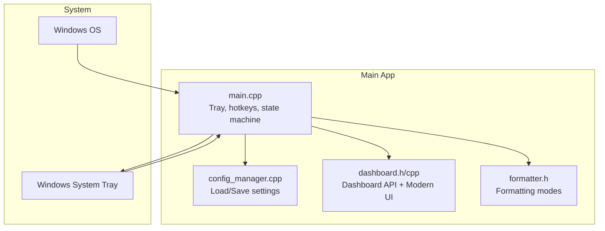
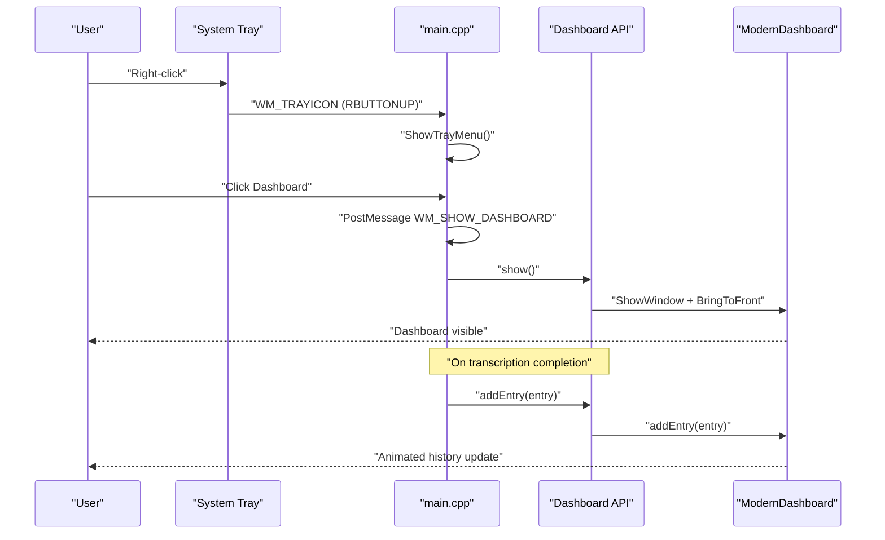
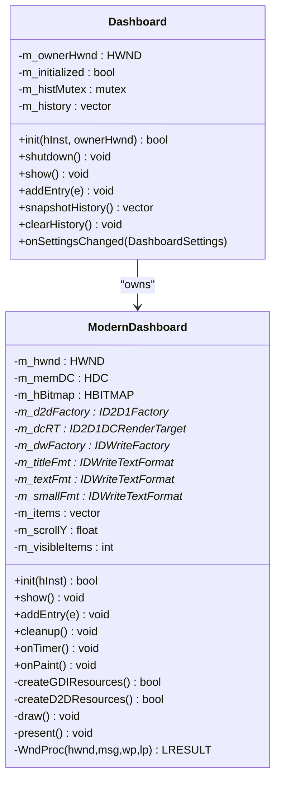
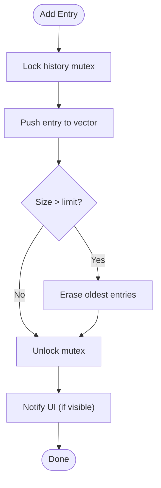
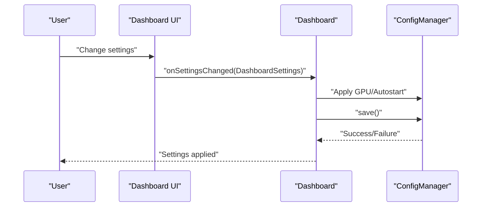
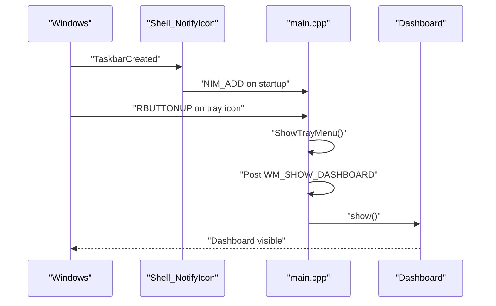
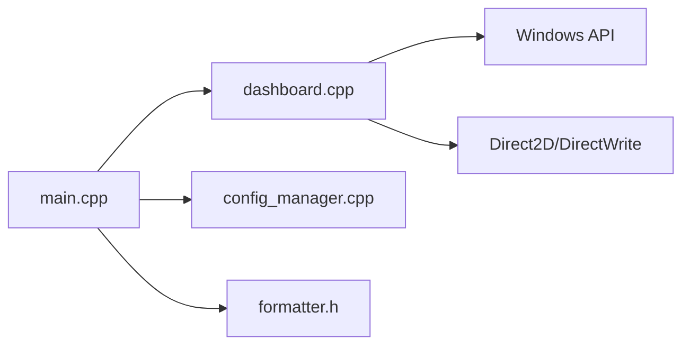

# Dashboard Interface

<cite>
**Referenced Files in This Document**
- [dashboard.h](file://src/dashboard.h)
- [dashboard.cpp](file://src/dashboard.cpp)
- [main.cpp](file://src/main.cpp)
- [config_manager.h](file://src/config_manager.h)
- [config_manager.cpp](file://src/config_manager.cpp)
- [formatter.h](file://src/formatter.h)
- [CMakeLists.txt](file://CMakeLists.txt)
- [settings.default.json](file://assets/settings.default.json)
- [README.md](file://README.md)
- [installer/flow-on.nsi](file://installer/flow-on.nsi)
</cite>

## Table of Contents
1. [Introduction](#introduction)
2. [Project Structure](#project-structure)
3. [Core Components](#core-components)
4. [Architecture Overview](#architecture-overview)
5. [Detailed Component Analysis](#detailed-component-analysis)
6. [Dependency Analysis](#dependency-analysis)
7. [Performance Considerations](#performance-considerations)
8. [Troubleshooting Guide](#troubleshooting-guide)
9. [Conclusion](#conclusion)
10. [Appendices](#appendices)

## Introduction
This document describes the Win32-based dashboard interface and its integration with the system tray. It covers the modern Direct2D history panel, settings management, and the optional WinUI 3 dashboard path. It also documents the Win32 listbox fallback, window management, system tray integration, and the WinUI 3 optional dependency behavior.

## Project Structure
The dashboard is implemented as a modern Direct2D window with a polished history list. It integrates with the main application via a small API surface and a settings callback. The system tray is managed by the main application and launches the dashboard on demand.

**Diagram sources**
- [main.cpp](file://src/main.cpp#L362-L521)
- [dashboard.h](file://src/dashboard.h#L36-L68)
- [dashboard.cpp](file://src/dashboard.cpp#L394-L454)
- [config_manager.cpp](file://src/config_manager.cpp#L24-L80)
- [formatter.h](file://src/formatter.h#L4-L14)

**Section sources**
- [main.cpp](file://src/main.cpp#L362-L521)
- [dashboard.h](file://src/dashboard.h#L1-L69)
- [dashboard.cpp](file://src/dashboard.cpp#L1-L454)
- [config_manager.h](file://src/config_manager.h#L1-L40)
- [config_manager.cpp](file://src/config_manager.cpp#L1-L108)
- [formatter.h](file://src/formatter.h#L1-L14)

## Core Components
- Dashboard API: Provides initialization, visibility control, history management, and settings change callbacks.
- Modern Direct2D UI: Renders a glassmorphism history panel with smooth animations.
- Settings Manager: Persists and loads user preferences to/from JSON.
- Formatter: Applies formatting modes (prose/code/auto) to transcriptions.
- System Tray: Hosts the application icon and context menu; launches the dashboard.

**Section sources**
- [dashboard.h](file://src/dashboard.h#L36-L68)
- [dashboard.cpp](file://src/dashboard.cpp#L35-L86)
- [config_manager.h](file://src/config_manager.h#L21-L40)
- [config_manager.cpp](file://src/config_manager.cpp#L24-L80)
- [formatter.h](file://src/formatter.h#L4-L14)
- [main.cpp](file://src/main.cpp#L88-L110)

## Architecture Overview
The dashboard is launched by the main application through a dedicated message. The main app manages the system tray and hotkeys, and on transcription completion, it records entries into the dashboard history. The dashboard maintains an in-memory history and renders it with animations.

**Diagram sources**
- [main.cpp](file://src/main.cpp#L88-L110)
- [main.cpp](file://src/main.cpp#L227-L239)
- [dashboard.cpp](file://src/dashboard.cpp#L409-L415)
- [dashboard.cpp](file://src/dashboard.cpp#L197-L206)

## Detailed Component Analysis

### Dashboard API and Modern UI
The Dashboard class exposes a minimal API for lifecycle and history operations. Internally, it owns a ModernDashboard instance that handles rendering with Direct2D and GDI off-screen buffering.

Key responsibilities:
- Initialization and shutdown of the UI component.
- Thread-safe addition of history entries.
- Snapshot and clear operations for history.
- Settings change callback invoked by the UI.

Rendering highlights:
- Smooth fade-in and slide-in animations for new entries.
- Dark theme with rounded rectangles and subtle borders.
- Efficient off-screen rendering with a memory DC and Direct2D render target.
- Timer-driven animation loop at a fixed frame interval.

**Diagram sources**
- [dashboard.h](file://src/dashboard.h#L36-L68)
- [dashboard.cpp](file://src/dashboard.cpp#L35-L86)
- [dashboard.cpp](file://src/dashboard.cpp#L394-L454)

**Section sources**
- [dashboard.h](file://src/dashboard.h#L36-L68)
- [dashboard.cpp](file://src/dashboard.cpp#L35-L86)
- [dashboard.cpp](file://src/dashboard.cpp#L90-L195)
- [dashboard.cpp](file://src/dashboard.cpp#L208-L335)
- [dashboard.cpp](file://src/dashboard.cpp#L337-L388)
- [dashboard.cpp](file://src/dashboard.cpp#L394-L454)

### History Panel Functionality
The history panel displays recent transcriptions with:
- Text preview (truncated to fit).
- Timestamps in HH:MM format.
- Optional latency badge for recent entries.
- Smooth animations for new items.

Operations:
- Add entries from the main app after transcription completion.
- Snapshot the current history for external use.
- Clear the in-memory history.

**Diagram sources**
- [dashboard.cpp](file://src/dashboard.cpp#L428-L439)
- [dashboard.cpp](file://src/dashboard.cpp#L441-L451)

**Section sources**
- [dashboard.cpp](file://src/dashboard.cpp#L197-L206)
- [dashboard.cpp](file://src/dashboard.cpp#L224-L325)
- [dashboard.cpp](file://src/dashboard.cpp#L428-L451)

### Settings Management Interface
The settings are persisted in a JSON file under the user’s AppData directory. The ConfigManager loads defaults if the file does not exist and enforces safe limits for snippet values.

Supported settings:
- Hotkey string (displayed to the user).
- Formatting mode: auto, prose, code.
- Model selection string.
- GPU usage toggle.
- Autostart on Windows.
- Snippets map with enforced maximum length.

The main app wires the dashboard settings callback to update the ConfigManager and apply autostart changes.

**Diagram sources**
- [dashboard.h](file://src/dashboard.h#L56-L56)
- [main.cpp](file://src/main.cpp#L481-L493)
- [config_manager.cpp](file://src/config_manager.cpp#L60-L80)

**Section sources**
- [config_manager.h](file://src/config_manager.h#L8-L19)
- [config_manager.cpp](file://src/config_manager.cpp#L24-L80)
- [main.cpp](file://src/main.cpp#L481-L493)
- [settings.default.json](file://assets/settings.default.json#L1-L16)

### WinUI 3 Integration Option and Conditional Compilation
The dashboard supports a modern UI path via WinUI 3 (Windows App SDK). The repository indicates:
- The dashboard module requires the Microsoft.WindowsAppSDK NuGet package.
- To enable the WinUI 3 dashboard, define the preprocessor flag and install the runtime.
- The CMake configuration notes the fallback Win32 listbox behavior by default and the optional WinUI 3 path.

Runtime dependency:
- Installer metadata indicates the Windows App SDK runtime is required for the WinUI 3 dashboard.

Fallback behavior:
- The current build uses the Direct2D ModernDashboard implementation as the primary UI.
- If WinUI 3 is enabled and available, the dashboard would switch to the WinUI 3 UI; otherwise, it falls back to the Direct2D implementation.

**Section sources**
- [dashboard.h](file://src/dashboard.h#L5-L14)
- [CMakeLists.txt](file://CMakeLists.txt#L65-L69)
- [installer/flow-on.nsi](file://installer/flow-on.nsi#L62-L62)
- [README.md](file://README.md#L81-L91)

### Win32 ListBox Implementation and Window Management
The dashboard uses a custom Direct2D window with:
- Off-screen bitmap rendering for smooth presentation.
- Timer-based animation loop.
- Minimal window procedure handling for paint and close events.
- Window sizing and layout constants for the history list.

Window management:
- Visibility toggled via ShowWindow and SetForegroundWindow.
- Close minimizes to hidden state; destroy cleans up resources.

**Section sources**
- [dashboard.cpp](file://src/dashboard.cpp#L90-L113)
- [dashboard.cpp](file://src/dashboard.cpp#L337-L343)
- [dashboard.cpp](file://src/dashboard.cpp#L345-L388)

### System Tray Integration
The system tray integrates with the main application:
- Adds an icon with tooltip and message callback.
- Right-click opens a context menu with “Dashboard” and “Exit”.
- Double-clicking the tray icon also opens the dashboard.
- The dashboard is shown via a dedicated message posted from the tray handler.

**Diagram sources**
- [main.cpp](file://src/main.cpp#L420-L431)
- [main.cpp](file://src/main.cpp#L227-L232)
- [main.cpp](file://src/main.cpp#L237-L239)

**Section sources**
- [main.cpp](file://src/main.cpp#L49-L110)
- [main.cpp](file://src/main.cpp#L227-L239)

### Usage Examples and Screenshots
Note: The repository does not include screenshots. The following describe typical UI states and actions.

- Opening the dashboard:
  - Right-click the tray icon and select “Dashboard”.
  - Or double-click the tray icon.
  - Expected: Dashboard window appears and comes to foreground.

- Viewing recent transcriptions:
  - After a successful transcription, the history panel shows the formatted text with a timestamp and latency badge if available.
  - Scroll to navigate older entries.

- Copying results:
  - The history panel is a static UI; copy is performed by selecting and copying from the active application window.

- Clearing history:
  - Use the dashboard UI controls to clear history (if exposed by the UI).
  - Alternatively, trigger a clear operation via the main app’s settings or API.

- Settings management:
  - Access the dashboard settings panel to adjust GPU usage and autostart behavior.
  - Changes are saved to the settings file and applied immediately.

[No sources needed since this section describes usage without analyzing specific files]

## Dependency Analysis
The dashboard depends on:
- Windows APIs for windowing, timers, and tray integration.
- Direct2D/DirectWrite for rendering.
- The main application for lifecycle and event coordination.

**Diagram sources**
- [dashboard.cpp](file://src/dashboard.cpp#L6-L18)
- [main.cpp](file://src/main.cpp#L11-L27)

**Section sources**
- [dashboard.cpp](file://src/dashboard.cpp#L6-L18)
- [main.cpp](file://src/main.cpp#L11-L27)

## Performance Considerations
- Rendering loop runs at a fixed interval to maintain smooth animations.
- Off-screen rendering minimizes flicker and improves frame pacing.
- History trimming keeps memory usage bounded.
- GPU usage setting is exposed in the dashboard settings and applied to the underlying transcriber.

[No sources needed since this section provides general guidance]

## Troubleshooting Guide
- Dashboard fails to initialize:
  - Ensure the Direct2D overlay initialization succeeds; the main app continues without the overlay if initialization fails.
  - Verify the Windows App SDK runtime is installed if attempting to use the WinUI 3 dashboard.

- Tray icon issues:
  - On Explorer restart, the tray icon is re-added automatically via the registered TaskbarCreated message.

- Hotkey conflicts:
  - If Alt+V is unavailable, the app attempts Alt+Shift+V and updates the tray tooltip accordingly.

- Settings not applying:
  - Confirm the settings callback updates the ConfigManager and persists changes to disk.

**Section sources**
- [main.cpp](file://src/main.cpp#L449-L457)
- [main.cpp](file://src/main.cpp#L152-L155)
- [main.cpp](file://src/main.cpp#L162-L178)
- [main.cpp](file://src/main.cpp#L481-L493)

## Conclusion
The dashboard provides a modern, animated history panel backed by Direct2D and integrates tightly with the system tray and main application state machine. Settings are persisted safely and applied dynamically. The WinUI 3 path is supported conditionally via the Windows App SDK, with a clear fallback to the Direct2D implementation.

[No sources needed since this section summarizes without analyzing specific files]

## Appendices

### Settings Reference
- hotkey: String representation of the global hotkey.
- mode: Formatting mode (auto, prose, code).
- model: Model identifier string.
- use_gpu: Boolean enabling GPU acceleration.
- start_with_windows: Boolean enabling autostart via registry.
- snippets: Map of snippet keys to values with enforced length limits.

**Section sources**
- [config_manager.h](file://src/config_manager.h#L8-L19)
- [config_manager.cpp](file://src/config_manager.cpp#L33-L51)
- [settings.default.json](file://assets/settings.default.json#L1-L16)