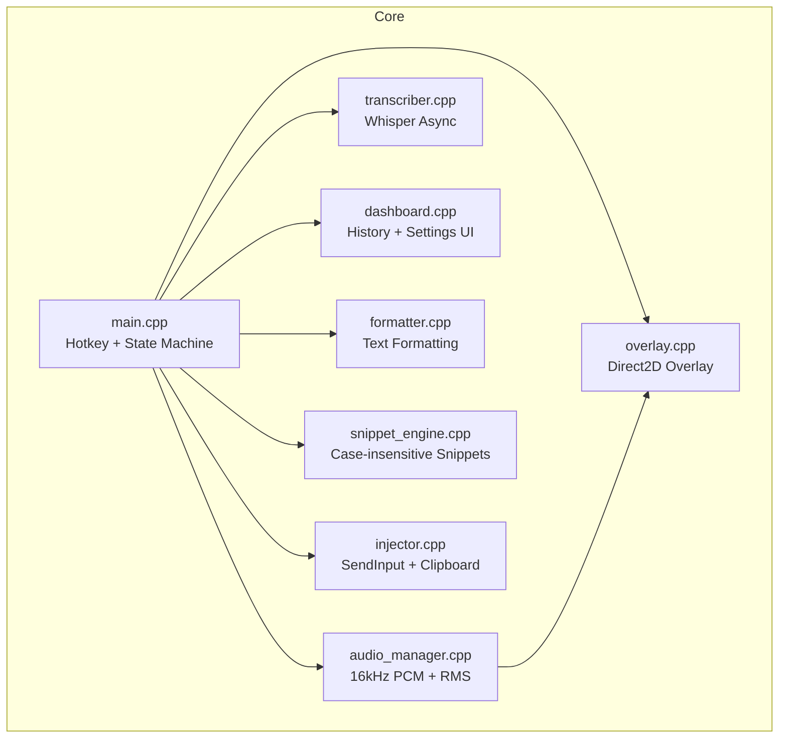
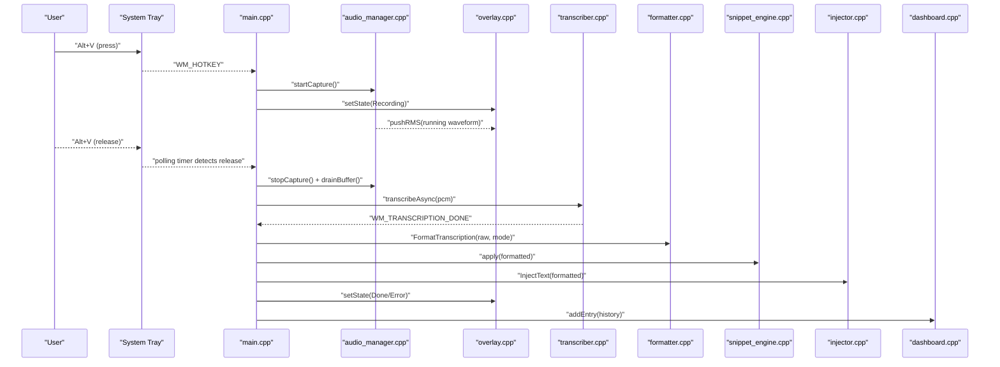
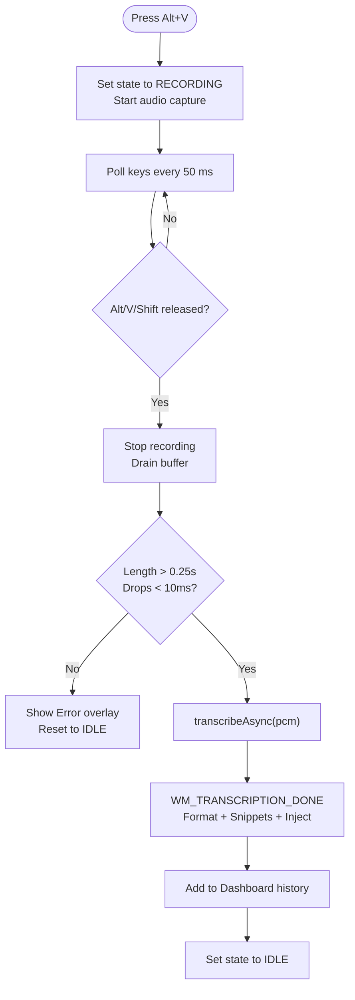
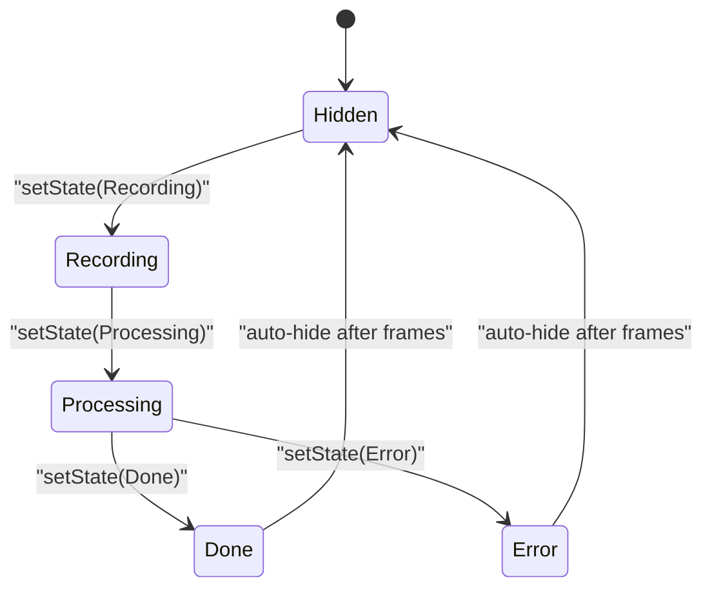
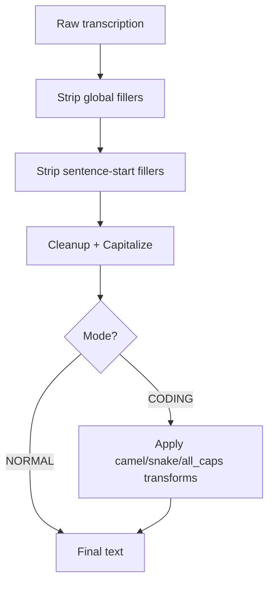
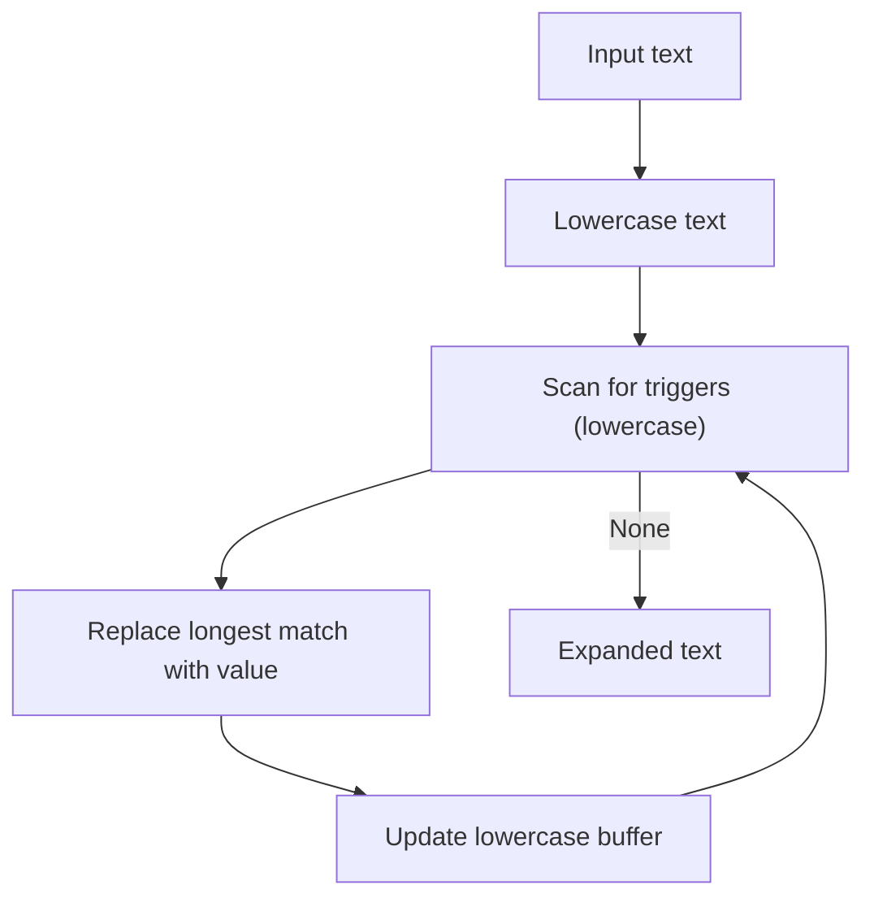
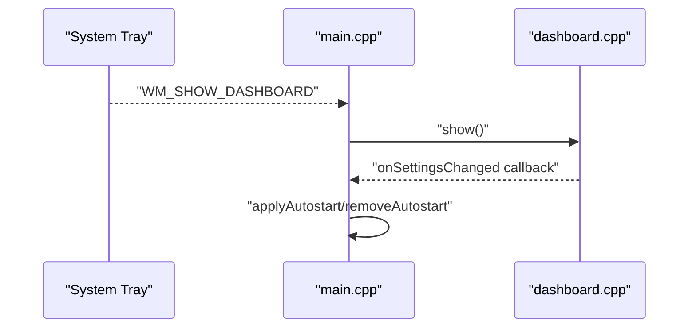
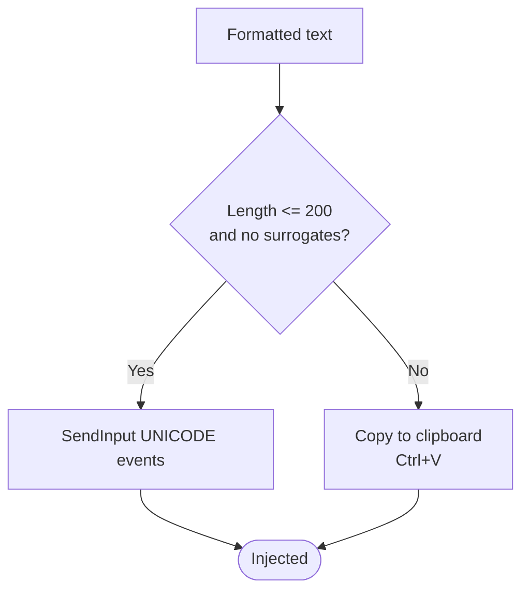
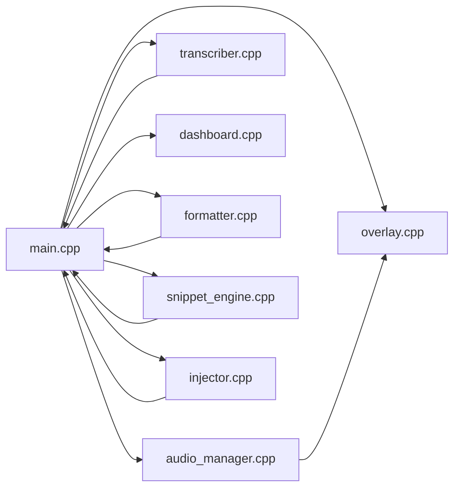

# Features and Usage

<cite>
**Referenced Files in This Document**
- [README.md](file://README.md)
- [main.cpp](file://src/main.cpp)
- [overlay.cpp](file://src/overlay.cpp)
- [overlay.h](file://src/overlay.h)
- [audio_manager.cpp](file://src/audio_manager.cpp)
- [audio_manager.h](file://src/audio_manager.h)
- [transcriber.cpp](file://src/transcriber.cpp)
- [transcriber.h](file://src/transcriber.h)
- [formatter.cpp](file://src/formatter.cpp)
- [formatter.h](file://src/formatter.h)
- [snippet_engine.cpp](file://src/snippet_engine.cpp)
- [snippet_engine.h](file://src/snippet_engine.h)
- [injector.cpp](file://src/injector.cpp)
- [injector.h](file://src/injector.h)
- [dashboard.cpp](file://src/dashboard.cpp)
- [dashboard.h](file://src/dashboard.h)
</cite>

## Table of Contents
1. [Introduction](#introduction)
2. [Project Structure](#project-structure)
3. [Core Components](#core-components)
4. [Architecture Overview](#architecture-overview)
5. [Detailed Component Analysis](#detailed-component-analysis)
6. [Dependency Analysis](#dependency-analysis)
7. [Performance Considerations](#performance-considerations)
8. [Troubleshooting Guide](#troubleshooting-guide)
9. [Conclusion](#conclusion)
10. [Appendices](#appendices)

## Introduction
This document explains the user-facing features and usage of Flow-On, a local-first Windows voice-to-text tool. It covers the Alt+V hotkey system, real-time visual feedback, intelligent text formatting modes, snippet engine, dashboard, system tray integration, and text injection. It also includes usage scenarios, troubleshooting, performance tips, and configuration guidance.

## Project Structure
Flow-On is organized around a small set of focused modules:
- Hotkey, state machine, and message loop in the main entrypoint
- Audio capture and waveform rendering
- Speech-to-text backend with GPU fallback
- Text formatting and coding-aware transformations
- Snippet engine for case-insensitive substitutions
- Overlay UI and system tray integration
- Dashboard for history and settings
- Text injection with robust fallbacks

**Diagram sources**
- [main.cpp](file://src/main.cpp#L149-L357)
- [overlay.cpp](file://src/overlay.cpp#L29-L74)
- [audio_manager.cpp](file://src/audio_manager.cpp#L58-L81)
- [transcriber.cpp](file://src/transcriber.cpp#L79-L93)
- [formatter.cpp](file://src/formatter.cpp#L137-L147)
- [snippet_engine.cpp](file://src/snippet_engine.cpp#L6-L28)
- [injector.cpp](file://src/injector.cpp#L49-L74)
- [dashboard.cpp](file://src/dashboard.cpp#L394-L426)

**Section sources**
- [README.md](file://README.md#L201-L232)
- [main.cpp](file://src/main.cpp#L362-L520)

## Core Components
- Alt+V hotkey system: Starts recording on press, polls for release to stop, triggers transcription, and injects formatted text.
- Visual feedback: GPU-accelerated Direct2D overlay shows waveform bars during recording, a spinner during transcription, and success/error animations.
- Intelligent formatting: Normal, Coding, and Auto modes with regex-based cleanup and coding-specific transforms.
- Snippet engine: Case-insensitive, longest-first replacement for triggers like email addresses, TODO items, and boilerplate text.
- Dashboard: History list with latency badges and settings toggles; optional WinUI 3 integration.
- System tray: Context menu, double-click to open dashboard, autostart support.
- Text injection: SendInput for short text; clipboard fallback for long text and emoji/surrogate pairs.

**Section sources**
- [README.md](file://README.md#L5-L14)
- [main.cpp](file://src/main.cpp#L185-L342)
- [overlay.cpp](file://src/overlay.cpp#L140-L158)
- [formatter.cpp](file://src/formatter.cpp#L137-L147)
- [snippet_engine.cpp](file://src/snippet_engine.cpp#L6-L28)
- [dashboard.cpp](file://src/dashboard.cpp#L394-L453)
- [injector.cpp](file://src/injector.cpp#L49-L74)

## Architecture Overview
The application runs a message loop with a hidden window owning the tray icon, hotkey, timers, and IPC messages. Audio capture runs on a dedicated callback thread feeding a lock-free ring buffer. Transcription runs asynchronously with single-flight protection. The UI updates via a Direct2D overlay and a separate dashboard window.

**Diagram sources**
- [main.cpp](file://src/main.cpp#L185-L342)
- [audio_manager.cpp](file://src/audio_manager.cpp#L83-L111)
- [overlay.cpp](file://src/overlay.cpp#L140-L158)
- [transcriber.cpp](file://src/transcriber.cpp#L103-L225)
- [formatter.cpp](file://src/formatter.cpp#L137-L147)
- [snippet_engine.cpp](file://src/snippet_engine.cpp#L6-L28)
- [injector.cpp](file://src/injector.cpp#L49-L74)
- [dashboard.cpp](file://src/dashboard.cpp#L428-L439)

## Detailed Component Analysis

### Alt+V Hotkey System
- Registration: Attempts Alt+V; if taken, tries Alt+Shift+V and updates tray tooltip.
- Activation: On WM_HOTKEY, sets state to RECORDING, starts audio capture, and begins a polling timer to detect release.
- Release detection: Uses GetAsyncKeyState on Alt/V/Shift to reliably detect release even if the window is hidden.
- Single-flight: Ensures only one recording path wins via an atomic compare-and-swap gate.
- Transcription: Drains audio buffer, validates length and drop count, then starts Whisper transcription asynchronously.
- Completion: Receives WM_TRANSCRIPTION_DONE, formats text, expands snippets, injects, records history, and resets state.

**Diagram sources**
- [main.cpp](file://src/main.cpp#L162-L222)
- [main.cpp](file://src/main.cpp#L244-L274)
- [main.cpp](file://src/main.cpp#L280-L342)

**Section sources**
- [main.cpp](file://src/main.cpp#L162-L222)
- [main.cpp](file://src/main.cpp#L244-L274)
- [main.cpp](file://src/main.cpp#L280-L342)

### Visual Feedback System (Overlay)
- States: Hidden, Recording, Processing, Done, Error.
- Recording: Animated waveform bars derived from RMS values; a pulsing red dot indicates recording.
- Processing: Sweeping gradient spinner with “transcribing…” label.
- Done/Error: Scale-in circle with checkmark or X; held briefly then auto-hides.
- Rendering: Direct2D DC render target with UpdateLayeredWindow for per-pixel alpha; layered, always-on-top, click-through window.
- Auto-positioning: Centered near bottom of primary monitor; animates appearance/disappearance.

**Diagram sources**
- [overlay.h](file://src/overlay.h#L11-L11)
- [overlay.cpp](file://src/overlay.cpp#L140-L158)
- [overlay.cpp](file://src/overlay.cpp#L274-L372)
- [overlay.cpp](file://src/overlay.cpp#L377-L466)
- [overlay.cpp](file://src/overlay.cpp#L471-L537)
- [overlay.cpp](file://src/overlay.cpp#L542-L591)

**Section sources**
- [overlay.h](file://src/overlay.h#L11-L94)
- [overlay.cpp](file://src/overlay.cpp#L29-L74)
- [overlay.cpp](file://src/overlay.cpp#L140-L158)
- [overlay.cpp](file://src/overlay.cpp#L184-L256)
- [overlay.cpp](file://src/overlay.cpp#L274-L372)
- [overlay.cpp](file://src/overlay.cpp#L377-L466)
- [overlay.cpp](file://src/overlay.cpp#L471-L537)
- [overlay.cpp](file://src/overlay.cpp#L542-L591)

### Intelligent Text Formatting Modes
Flow-On applies a four-pass formatter and optional coding transforms:
- Pass 1: Strip global fillers (um, uh, er, hmm).
- Pass 2: Strip sentence-start fillers only at the beginning of sentences.
- Pass 3: Collapse multiple spaces, trim, remove leading punctuation, capitalize first letter.
- Pass 4 (CODING only): Transform free-form commands into identifiers:
  - “camel case …” → camelCase
  - “snake case …” → snake_case
  - “all caps …” → SNAKE_CASE
- Mode detection: AUTO detects code editors/terminals; otherwise NORMAL or explicit mode selection.

**Diagram sources**
- [formatter.cpp](file://src/formatter.cpp#L65-L82)
- [formatter.cpp](file://src/formatter.cpp#L137-L147)
- [formatter.cpp](file://src/formatter.cpp#L114-L133)

**Section sources**
- [formatter.cpp](file://src/formatter.cpp#L137-L147)
- [formatter.h](file://src/formatter.h#L4-L14)
- [main.cpp](file://src/main.cpp#L300-L304)

### Snippet Engine
- Behavior: Case-insensitive, longest-first replacement across the entire text. Lowercase match buffer is updated after each replacement to avoid overlapping matches.
- Triggers: Loaded from configuration (e.g., email, todo, fixme). Applied after formatting and before injection.
- Example triggers (from configuration):
  - email: your.email@example.com
  - todo: TODO:
  - fixme: FIXME:

**Diagram sources**
- [snippet_engine.cpp](file://src/snippet_engine.cpp#L6-L28)

**Section sources**
- [snippet_engine.cpp](file://src/snippet_engine.cpp#L6-L28)
- [snippet_engine.h](file://src/snippet_engine.h#L5-L26)
- [README.md](file://README.md#L183-L187)

### Dashboard Interface
- Opens via tray double-click or “Dashboard” menu item.
- Displays recent transcriptions with latency badges and timestamps.
- Settings panel (when compiled with WinUI 3) allows toggling GPU and autostart; changes saved to configuration and applied immediately.

**Diagram sources**
- [main.cpp](file://src/main.cpp#L237-L239)
- [main.cpp](file://src/main.cpp#L481-L493)
- [dashboard.cpp](file://src/dashboard.cpp#L394-L426)

**Section sources**
- [dashboard.cpp](file://src/dashboard.cpp#L394-L453)
- [dashboard.h](file://src/dashboard.h#L23-L68)
- [main.cpp](file://src/main.cpp#L481-L493)

### System Tray Integration
- Right-click menu: Dashboard, Exit.
- Double-click: Open Dashboard.
- Autostart: Optional startup with Windows; toggled via dashboard settings.
- Taskbar recovery: Registers a message for Explorer restart and re-adds the icon.

**Section sources**
- [main.cpp](file://src/main.cpp#L91-L110)
- [main.cpp](file://src/main.cpp#L411-L415)
- [main.cpp](file://src/main.cpp#L151-L155)

### Text Injection Mechanism
- Strategy:
  - Short strings (<200 chars) without surrogate pairs: SendInput with KEYEVENTF_UNICODE.
  - Long strings or surrogate pairs (emoji/CJK): Place text on clipboard and simulate Ctrl+V.
- Robustness: Clipboard fallback works in terminals and legacy applications that reject raw Unicode input.

**Diagram sources**
- [injector.cpp](file://src/injector.cpp#L49-L74)

**Section sources**
- [injector.cpp](file://src/injector.cpp#L49-L74)
- [injector.h](file://src/injector.h#L4-L9)

### Usage Scenarios and Workflows
- Developer typing in VS Code/Cursor: AUTO mode detects editor and applies camel/snake/all_caps transforms; use “camel case foo bar”, “snake case foo bar”, or “all caps foo bar” voice commands.
- General writing: NORMAL mode cleans fillers and punctuation; use Alt+V to record, wait for Done flash, and continue typing.
- Rapid note-taking: Use snippets like “todo” and “fixme” to insert boilerplate placeholders quickly.
- Terminal/CLI work: Injection uses clipboard fallback to paste into terminals.

[No sources needed since this section aggregates usage without analyzing specific files]

## Dependency Analysis
High-level dependencies among major components:

**Diagram sources**
- [main.cpp](file://src/main.cpp#L54-L61)
- [overlay.cpp](file://src/overlay.cpp#L29-L74)
- [audio_manager.cpp](file://src/audio_manager.cpp#L58-L81)
- [transcriber.cpp](file://src/transcriber.cpp#L79-L93)
- [formatter.cpp](file://src/formatter.cpp#L137-L147)
- [snippet_engine.cpp](file://src/snippet_engine.cpp#L6-L28)
- [injector.cpp](file://src/injector.cpp#L49-L74)
- [dashboard.cpp](file://src/dashboard.cpp#L394-L426)

**Section sources**
- [main.cpp](file://src/main.cpp#L54-L61)

## Performance Considerations
- Audio latency: ~100 ms via miniaudio callback; waveform bars update at ~60 Hz.
- Transcription: ~12–18s for 30s audio using tiny.en model on CPU with AVX2; single-threaded decode with greedy best-of-1; reduced audio context and single-segment mode improve throughput.
- Rendering: Direct2D GPU-accelerated overlay; 60 FPS timer; auto-recovery from D2D target recreation.
- Memory: Whisper model loaded into RAM (~400 MB); PCM buffer cleared on shutdown.
- Recommendations:
  - Prefer tiny.en for speed; switch to base.en for quality.
  - Use AUTO/CODING modes to reduce post-processing.
  - Keep text concise to avoid clipboard fallback.
  - On systems with discrete GPU, enable CUDA support for faster decoding.

**Section sources**
- [README.md](file://README.md#L305-L325)
- [transcriber.cpp](file://src/transcriber.cpp#L138-L178)
- [overlay.cpp](file://src/overlay.cpp#L17-L24)

## Troubleshooting Guide
- Hotkey not working:
  - Verify settings.json hotkey modifiers/VK code.
  - Another app may have claimed Alt+V; try Alt+Shift+V fallback.
- No audio device:
  - Ensure microphone is plugged in and accessible.
  - Restart Windows audio service if needed.
- Whisper model missing:
  - Expected path: models/ggml-tiny.en.bin; download or rebuild installer.
- Installer fails:
  - Ensure NSIS 3.x is installed and makensis is in PATH.
- Transcription too short or drops:
  - Ensure sustained speech; drops indicate buffer starvation or device issues.
- Overlay fails to initialize:
  - Confirm Direct2D support; continue without overlay if needed.

**Section sources**
- [README.md](file://README.md#L326-L346)
- [main.cpp](file://src/main.cpp#L436-L444)
- [main.cpp](file://src/main.cpp#L462-L475)
- [overlay.cpp](file://src/overlay.cpp#L29-L74)

## Conclusion
Flow-On delivers a streamlined voice-to-text workflow on Windows with a minimal footprint. Its Alt+V hotkey, real-time overlay, offline transcription, intelligent formatting, snippet engine, and robust injection make it suitable for both everyday dictation and developer workflows. The dashboard and system tray integrate seamlessly for quick access and configuration.

[No sources needed since this section summarizes without analyzing specific files]

## Appendices

### Configuration Examples and Customization
- Settings location: %APPDATA%\FLOW-ON\settings.json
- Hotkey: modifiers and VK code
- Audio: device name and buffer length
- Transcription: model, language, GPU enablement
- Formatting: mode (AUTO/NORMAL/CODING)
- Snippets: key-value pairs for triggers and expansions
- UI: overlay position and autostart toggle

**Section sources**
- [README.md](file://README.md#L161-L194)
- [main.cpp](file://src/main.cpp#L411-L415)