# Hotkey System

<cite>
**Referenced Files in This Document**
- [main.cpp](file://src/main.cpp)
- [audio_manager.cpp](file://src/audio_manager.cpp)
- [audio_manager.h](file://src/audio_manager.h)
- [transcriber.cpp](file://src/transcriber.cpp)
- [transcriber.h](file://src/transcriber.h)
- [injector.cpp](file://src/injector.cpp)
- [injector.h](file://src/injector.h)
- [overlay.cpp](file://src/overlay.cpp)
- [overlay.h](file://src/overlay.h)
- [dashboard.cpp](file://src/dashboard.cpp)
- [dashboard.h](file://src/dashboard.h)
- [config_manager.cpp](file://src/config_manager.cpp)
- [settings.default.json](file://assets/settings.default.json)
- [Resource.h](file://Resource.h)
</cite>

## Table of Contents
1. [Introduction](#introduction)
2. [Project Structure](#project-structure)
3. [Core Components](#core-components)
4. [Architecture Overview](#architecture-overview)
5. [Detailed Component Analysis](#detailed-component-analysis)
6. [Dependency Analysis](#dependency-analysis)
7. [Performance Considerations](#performance-considerations)
8. [Troubleshooting Guide](#troubleshooting-guide)
9. [Conclusion](#conclusion)
10. [Appendices](#appendices)

## Introduction
This document explains the Alt+V hotkey system end-to-end, including the four-phase state machine (IDLE → RECORDING → TRANSCRIBING → INJECTING), atomic guards preventing race conditions, hotkey registration and fallback, modifier key handling, VK code configuration, visual feedback, auto-hide behavior, and troubleshooting guidance. It also documents configuration options for customizing the hotkey combination and modifiers.

## Project Structure
The hotkey system spans several modules:
- State machine and message handling in the main application window
- Audio capture and RMS feeding to the overlay
- Whisper-based transcription with a single-flight guard
- Text injection into the active application
- Overlay rendering for visual feedback
- Dashboard history and latency reporting
- Configuration persistence for hotkey and other settings

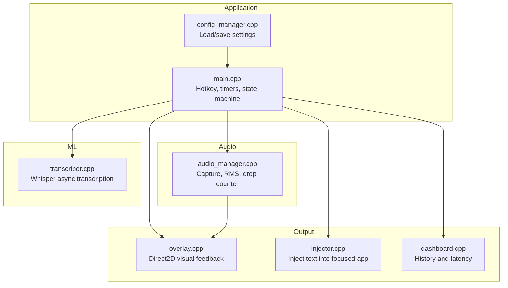

**Diagram sources**
- [main.cpp](file://src/main.cpp#L40-L72)
- [audio_manager.cpp](file://src/audio_manager.cpp#L58-L122)
- [transcriber.cpp](file://src/transcriber.cpp#L103-L226)
- [overlay.cpp](file://src/overlay.cpp#L137-L158)
- [injector.cpp](file://src/injector.cpp#L49-L75)
- [dashboard.cpp](file://src/dashboard.cpp#L394-L454)
- [config_manager.cpp](file://src/config_manager.cpp#L24-L80)

**Section sources**
- [main.cpp](file://src/main.cpp#L40-L72)
- [config_manager.cpp](file://src/config_manager.cpp#L24-L80)

## Core Components
- State machine: atomic AppState with transitions guarded by atomic checks and single-flight mechanisms.
- Hotkey registration: attempts Alt+V; falls back to Alt+Shift+V if unavailable.
- Atomic stop guard: compare-and-swap ensures only one path (hotkey release or silence) triggers transcription.
- Visual feedback: overlay states for recording, processing, done, error; auto-hide after completion.
- Injection: text injection with clipboard fallback for long or emoji-heavy content.
- Configuration: hotkey string and other settings persisted to disk.

**Section sources**
- [main.cpp](file://src/main.cpp#L67-L128)
- [overlay.h](file://src/overlay.h#L11-L11)
- [overlay.cpp](file://src/overlay.cpp#L137-L158)
- [injector.h](file://src/injector.h#L1-L9)
- [config_manager.cpp](file://src/config_manager.cpp#L24-L80)

## Architecture Overview
The hotkey lifecycle is driven by a Windows message loop. The system registers a global hotkey, starts audio capture, polls for modifier key release, triggers transcription asynchronously, and finally injects the formatted text into the active application.

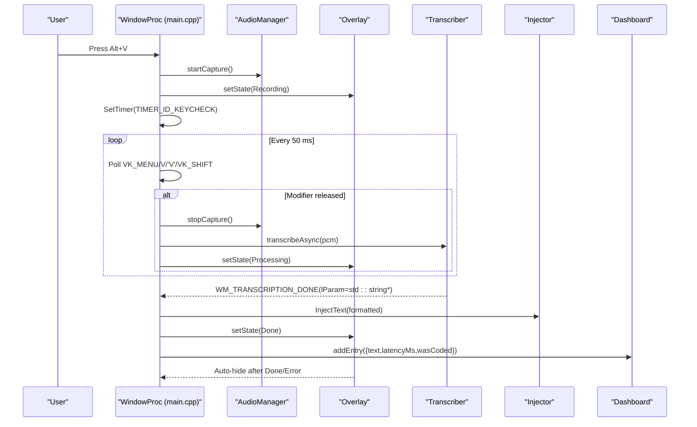

**Diagram sources**
- [main.cpp](file://src/main.cpp#L162-L222)
- [audio_manager.cpp](file://src/audio_manager.cpp#L83-L100)
- [overlay.cpp](file://src/overlay.cpp#L137-L158)
- [transcriber.cpp](file://src/transcriber.cpp#L103-L226)
- [injector.cpp](file://src/injector.cpp#L49-L75)
- [dashboard.cpp](file://src/dashboard.cpp#L428-L439)

## Detailed Component Analysis

### State Machine and Atomic Guards
- States: IDLE, RECORDING, TRANSCRIBING, INJECTING.
- Guards:
  - Hotkey press gate: checks g_state and g_hotkeyDown to avoid concurrent starts.
  - Stop guard: StopRecordingOnce uses compare-and-swap to ensure only one stop path wins.
  - Transcription single-flight: Transcriber::transcribeAsync uses atomic busy flag to prevent re-entry.
  - Duplicate message guard: WM_TRANSCRIPTION_DONE ignores duplicates within a brief window.

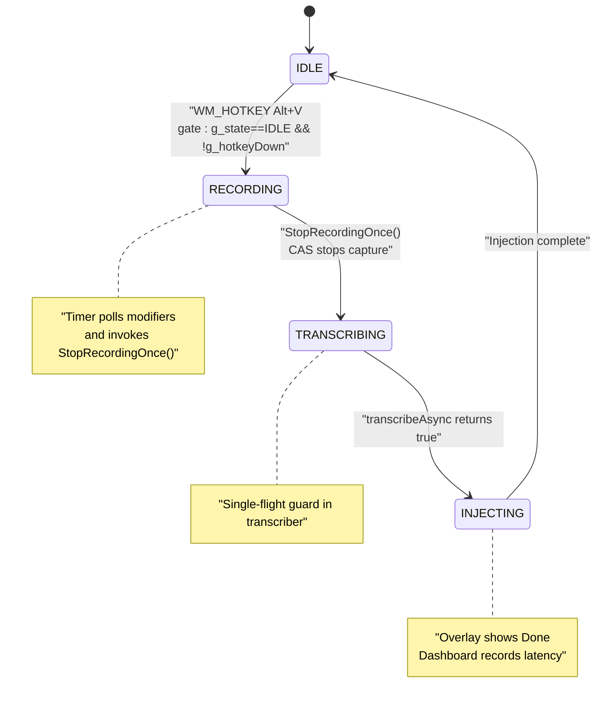

**Diagram sources**
- [main.cpp](file://src/main.cpp#L67-L128)
- [main.cpp](file://src/main.cpp#L185-L222)
- [transcriber.cpp](file://src/transcriber.cpp#L103-L117)

**Section sources**
- [main.cpp](file://src/main.cpp#L67-L128)
- [transcriber.cpp](file://src/transcriber.cpp#L103-L117)

### Hotkey Registration and Fallback
- Registration: Attempt MOD_ALT | MOD_NOREPEAT | 'V'.
- Fallback: If registration fails, try MOD_ALT | MOD_SHIFT | MOD_NOREPEAT | 'V'.
- UI feedback: Tray tooltip indicates fallback; icon updated accordingly.
- Unregister on destroy to avoid leaks.

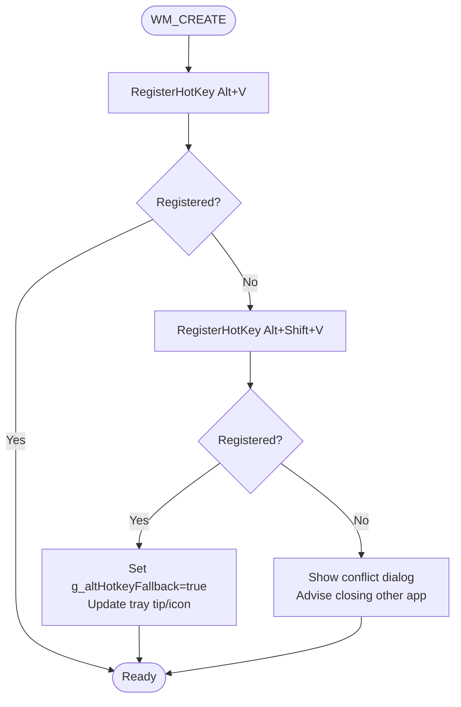

**Diagram sources**
- [main.cpp](file://src/main.cpp#L162-L179)
- [Resource.h](file://Resource.h#L13-L20)

**Section sources**
- [main.cpp](file://src/main.cpp#L162-L179)
- [Resource.h](file://Resource.h#L13-L20)

### Modifier Key Handling and VK Code Configuration
- During recording, a timer polls:
  - VK_MENU (Alt)
  - 'V' (character code)
  - VK_SHIFT (only when fallback is active)
- If any modifier is released, StopRecordingOnce is invoked to finalize capture.

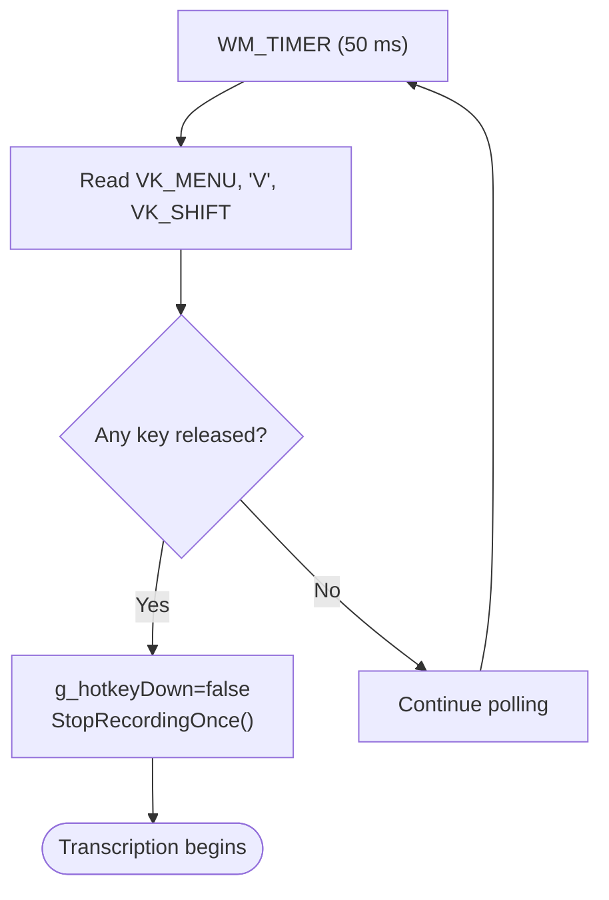

**Diagram sources**
- [main.cpp](file://src/main.cpp#L208-L222)

**Section sources**
- [main.cpp](file://src/main.cpp#L208-L222)

### Audio Capture and RMS Pipeline
- Starts capture on hotkey press and drains stale samples.
- Audio callback computes RMS per chunk and pushes it to the overlay.
- Overlay uses RMS to animate waveform bars during recording.

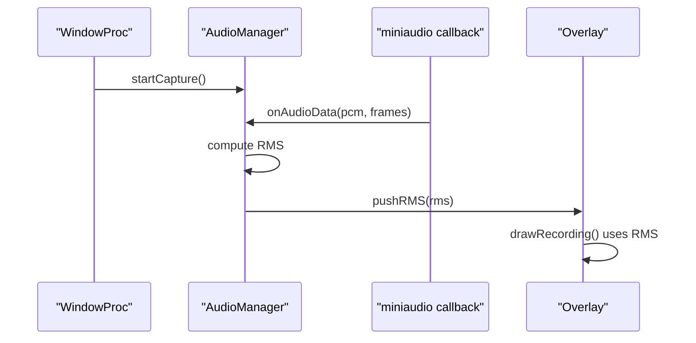

**Diagram sources**
- [main.cpp](file://src/main.cpp#L197-L198)
- [audio_manager.cpp](file://src/audio_manager.cpp#L39-L56)
- [overlay.cpp](file://src/overlay.cpp#L274-L372)

**Section sources**
- [audio_manager.cpp](file://src/audio_manager.cpp#L39-L56)
- [overlay.cpp](file://src/overlay.cpp#L274-L372)

### Transcription Pipeline and Single-Flight Guard
- Validates minimum length and drop count before transcription.
- Uses transcribeAsync to run Whisper in a detached thread.
- Prevents re-entry with atomic busy flag; returns false if already busy.

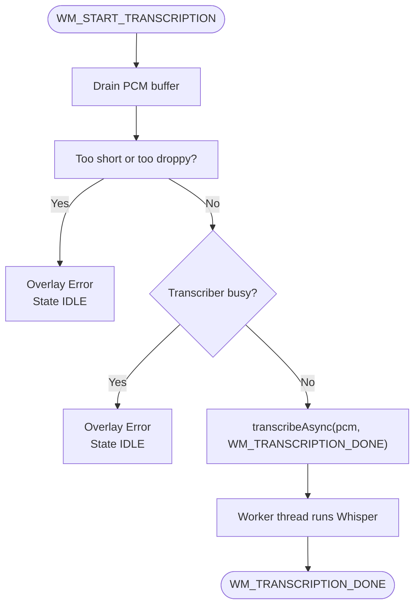

**Diagram sources**
- [main.cpp](file://src/main.cpp#L244-L274)
- [transcriber.cpp](file://src/transcriber.cpp#L103-L226)

**Section sources**
- [main.cpp](file://src/main.cpp#L244-L274)
- [transcriber.cpp](file://src/transcriber.cpp#L103-L226)

### Injection and Clipboard Fallback
- InjectText chooses between raw Unicode events or clipboard paste depending on length and surrogate presence.
- Clipboard path sends Ctrl+V to paste.

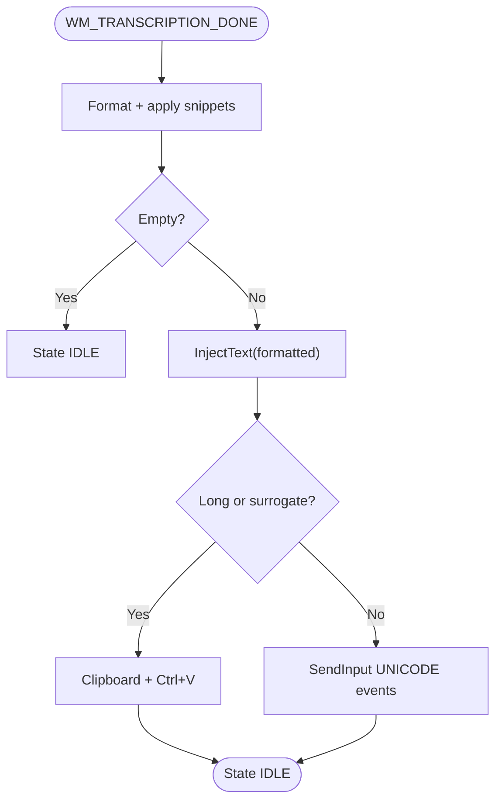

**Diagram sources**
- [main.cpp](file://src/main.cpp#L316-L324)
- [injector.cpp](file://src/injector.cpp#L49-L75)

**Section sources**
- [injector.cpp](file://src/injector.cpp#L49-L75)

### Visual Feedback System
- Overlay states:
  - Recording: animated waveform bars and pulsing red dot.
  - Processing: spinning arc with gradient fade and “transcribing…” label.
  - Done: green flash with checkmark.
  - Error: red flash with X.
- Auto-hide: after Done/Error, overlay counts down frames then hides.

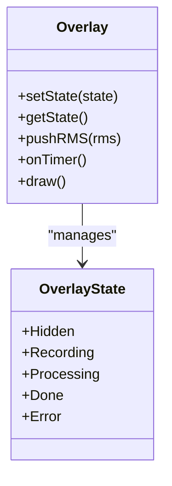

**Diagram sources**
- [overlay.h](file://src/overlay.h#L11-L11)
- [overlay.cpp](file://src/overlay.cpp#L137-L158)

**Section sources**
- [overlay.cpp](file://src/overlay.cpp#L137-L158)
- [overlay.cpp](file://src/overlay.cpp#L274-L372)
- [overlay.cpp](file://src/overlay.cpp#L377-L466)
- [overlay.cpp](file://src/overlay.cpp#L471-L537)
- [overlay.cpp](file://src/overlay.cpp#L542-L591)
- [overlay.cpp](file://src/overlay.cpp#L596-L620)

### Configuration and Customization
- Settings file persists hotkey string and other preferences.
- The hotkey string is loaded and can be changed; the application registers the configured combination at startup.
- Autostart and GPU toggles are also configurable.

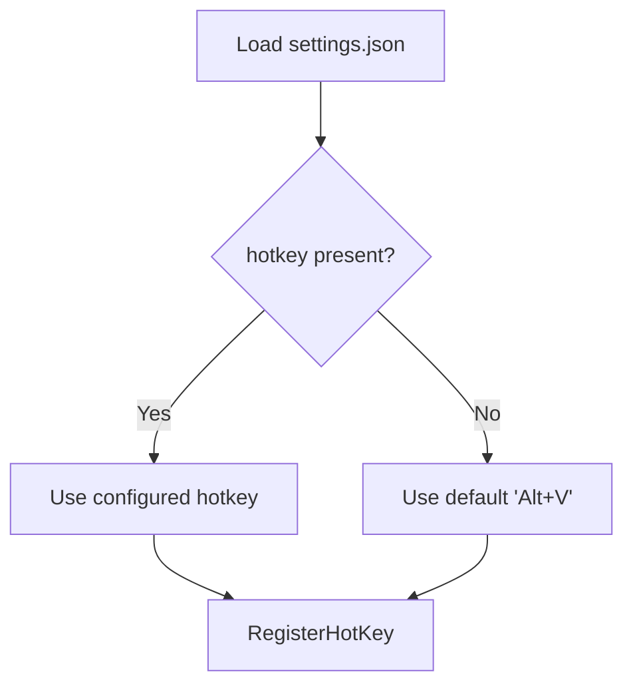

**Diagram sources**
- [config_manager.cpp](file://src/config_manager.cpp#L24-L58)
- [settings.default.json](file://assets/settings.default.json#L1-L16)

**Section sources**
- [config_manager.cpp](file://src/config_manager.cpp#L24-L80)
- [settings.default.json](file://assets/settings.default.json#L1-L16)

## Dependency Analysis
- main.cpp depends on audio_manager, transcriber, overlay, dashboard, snippet engine, and config_manager.
- overlay depends on Direct2D/DirectWrite and receives RMS from audio_manager.
- transcriber depends on whisper library and uses a worker thread.
- injector depends on Windows input APIs and clipboard.

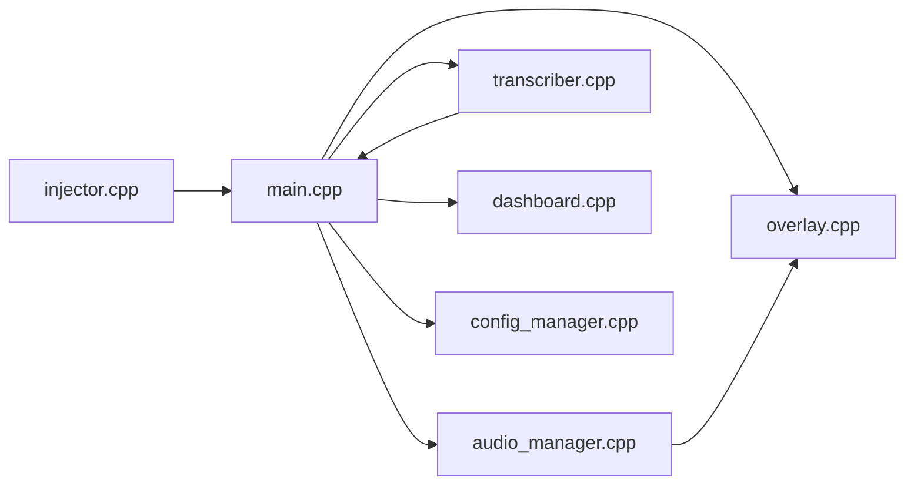

**Diagram sources**
- [main.cpp](file://src/main.cpp#L19-L61)
- [audio_manager.cpp](file://src/audio_manager.cpp#L1-L122)
- [transcriber.cpp](file://src/transcriber.cpp#L1-L226)
- [overlay.cpp](file://src/overlay.cpp#L1-L659)
- [injector.cpp](file://src/injector.cpp#L1-L75)
- [dashboard.cpp](file://src/dashboard.cpp#L1-L454)
- [config_manager.cpp](file://src/config_manager.cpp#L1-L108)

**Section sources**
- [main.cpp](file://src/main.cpp#L19-L61)

## Performance Considerations
- Audio capture runs at 16 kHz mono with periodic callbacks; RMS computed per chunk and pushed atomically to overlay.
- Transcription uses a dedicated worker thread and a single-flight guard to avoid overlapping work.
- Overlay refresh runs at ~60 Hz via WM_TIMER; drawing is minimized by Direct2D DC render targets.
- Clipboard injection is used for long text or emoji to avoid legacy input API limitations.

[No sources needed since this section provides general guidance]

## Troubleshooting Guide
- Hotkey registration fails:
  - The system attempts Alt+V, then Alt+Shift+V. If both fail, a warning dialog suggests closing the conflicting application.
  - Verify no other application has registered the same hotkeys.
- Microphone access denied:
  - The app reports an audio error and exits early if the microphone cannot be opened.
  - Ensure privacy settings allow the app to access the microphone.
- Overlay initialization failure:
  - The app warns if Direct2D overlay cannot be initialized but continues without overlay.
- Transcription busy or too short:
  - If the transcriber is busy, the system shows an error and resets to IDLE.
  - Very short recordings or high drop rates trigger an error state and reset to IDLE.
- Injection issues:
  - For long text or emoji, the system falls back to clipboard paste. If clipboard fails, injection is skipped.

**Section sources**
- [main.cpp](file://src/main.cpp#L162-L179)
- [main.cpp](file://src/main.cpp#L436-L444)
- [main.cpp](file://src/main.cpp#L449-L457)
- [main.cpp](file://src/main.cpp#L266-L272)
- [main.cpp](file://src/main.cpp#L254-L264)
- [injector.cpp](file://src/injector.cpp#L21-L47)

## Conclusion
The Alt+V hotkey system integrates a robust state machine, atomic guards against race conditions, and a responsive visual feedback loop. It balances reliability (single-flight transcription, duplicate message gating) with user experience (waveform visualization, spinner, green/red flashes, auto-hide). Configuration support allows customization of the hotkey combination and other features.

[No sources needed since this section summarizes without analyzing specific files]

## Appendices

### Four-Phase State Transition Details
- IDLE: Initial state; ready for hotkey press.
- RECORDING: Audio capture started; overlay shows waveform; timer polls modifiers.
- TRANSCRIBING: Capture stopped, PCM drained, transcription queued; overlay shows spinner.
- INJECTING: Formatted text injected; overlay shows Done; dashboard records latency.

**Section sources**
- [main.cpp](file://src/main.cpp#L67-L128)
- [overlay.cpp](file://src/overlay.cpp#L137-L158)
- [dashboard.cpp](file://src/dashboard.cpp#L428-L439)

### Visual Feedback Descriptions
- Blue waveform bars: during RECORDING, overlay animates bars based on RMS values.
- Spinner arc: during TRANSCRIBING, a gradient-fade arc sweeps with a bright tip and label.
- Green flash: during INJECTING completion, a growing green circle with a checkmark appears.
- Red flash: on errors, a red circle with an X appears; overlay auto-hides after a short period.

**Section sources**
- [overlay.cpp](file://src/overlay.cpp#L274-L372)
- [overlay.cpp](file://src/overlay.cpp#L377-L466)
- [overlay.cpp](file://src/overlay.cpp#L471-L537)
- [overlay.cpp](file://src/overlay.cpp#L542-L591)
- [overlay.cpp](file://src/overlay.cpp#L596-L620)

### Auto-Hide Behavior
- After Done or Error, the overlay counts down frames and then dismisses the window.
- The overlay’s timer updates animations and triggers dismissal when the countdown reaches zero.

**Section sources**
- [overlay.cpp](file://src/overlay.cpp#L154-L157)
- [overlay.cpp](file://src/overlay.cpp#L610-L617)

### Configuration Examples
- Hotkey customization:
  - Modify the hotkey field in settings.json to change the combination.
  - Supported modifiers: Alt, Shift, Control, NoRepeat is applied to the combination.
- Other settings:
  - mode: auto, code, or prose.
  - model: tiny.en or base.en.
  - use_gpu: enable/disable GPU acceleration.
  - start_with_windows: toggle autostart.
  - snippets: key-value pairs for text expansion.

**Section sources**
- [config_manager.cpp](file://src/config_manager.cpp#L24-L80)
- [settings.default.json](file://assets/settings.default.json#L1-L16)