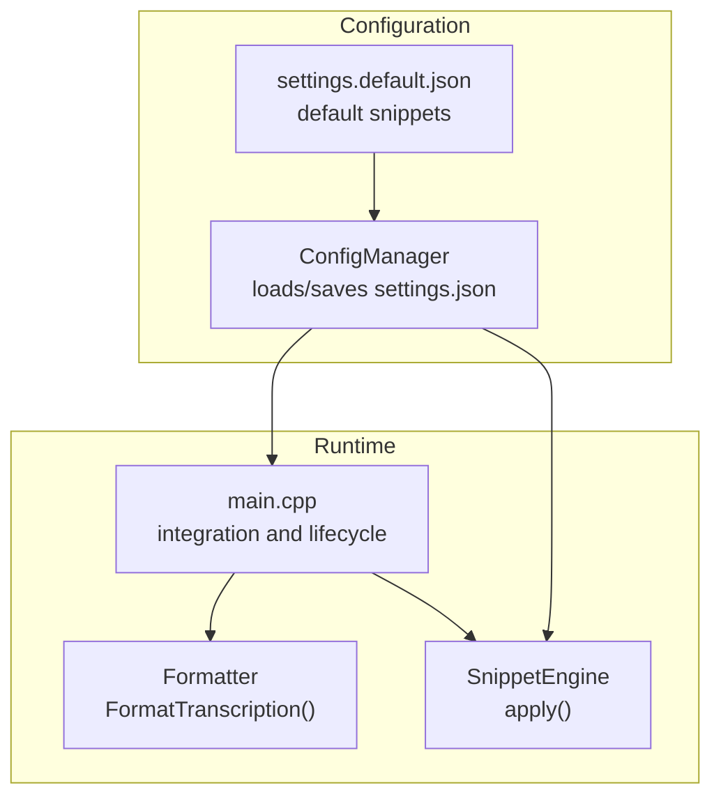
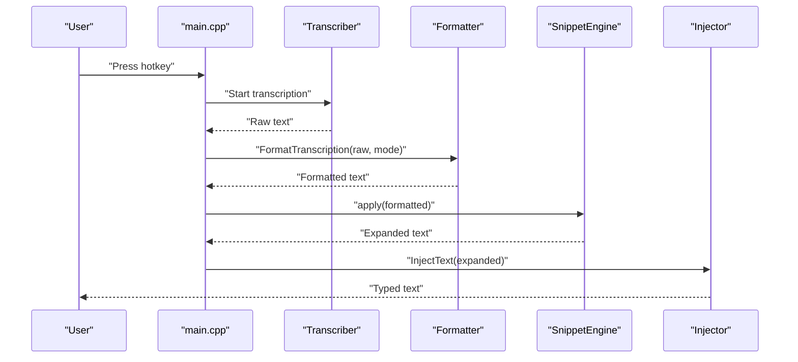
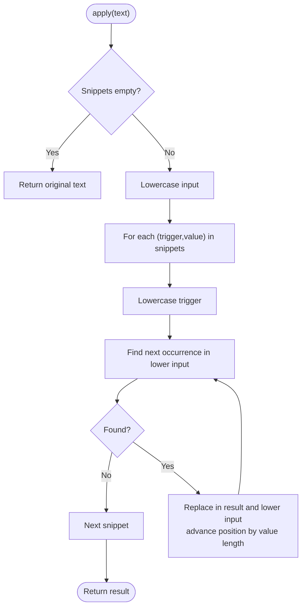
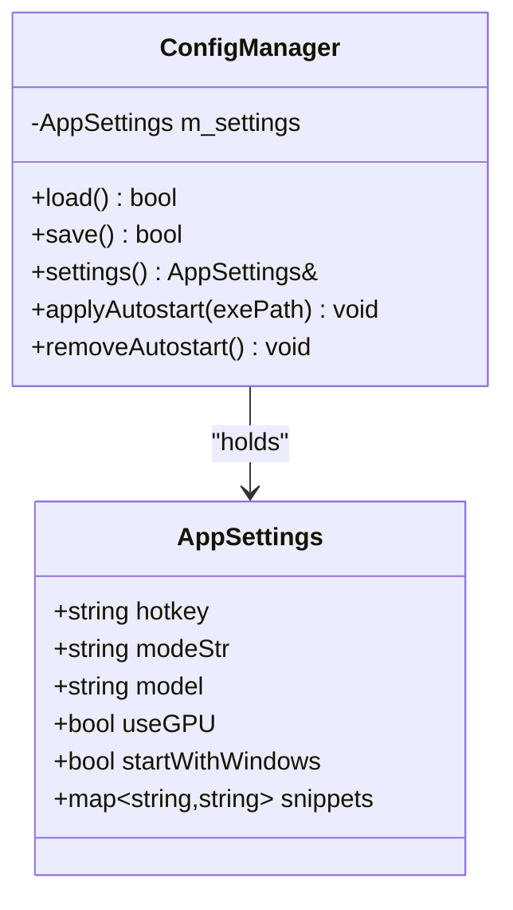
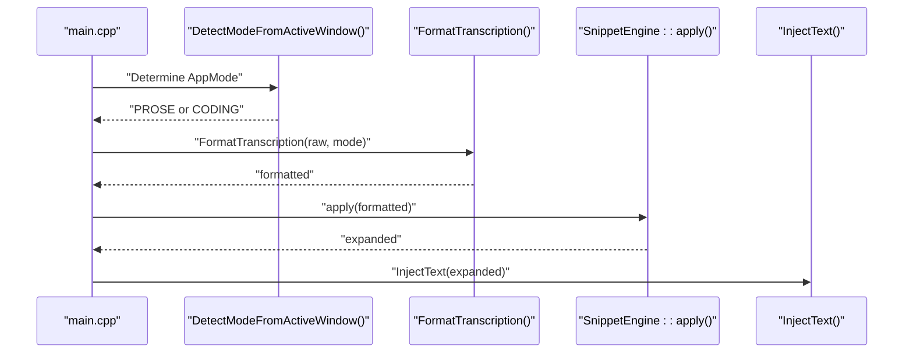
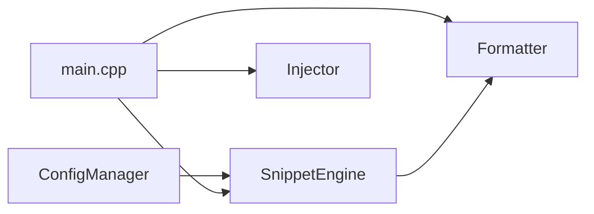

# Snippet Engine

<cite>
**Referenced Files in This Document**
- [snippet_engine.h](file://src/snippet_engine.h)
- [snippet_engine.cpp](file://src/snippet_engine.cpp)
- [formatter.h](file://src/formatter.h)
- [formatter.cpp](file://src/formatter.cpp)
- [config_manager.h](file://src/config_manager.h)
- [config_manager.cpp](file://src/config_manager.cpp)
- [settings.default.json](file://assets/settings.default.json)
- [main.cpp](file://src/main.cpp)
- [CMakeLists.txt](file://CMakeLists.txt)
</cite>

## Table of Contents
1. [Introduction](#introduction)
2. [Project Structure](#project-structure)
3. [Core Components](#core-components)
4. [Architecture Overview](#architecture-overview)
5. [Detailed Component Analysis](#detailed-component-analysis)
6. [Dependency Analysis](#dependency-analysis)
7. [Performance Considerations](#performance-considerations)
8. [Troubleshooting Guide](#troubleshooting-guide)
9. [Conclusion](#conclusion)
10. [Appendices](#appendices)

## Introduction
This document describes the case-insensitive text substitution engine that powers snippet definition and expansion in the application. It explains how snippets are configured, how the matching and replacement algorithm works, how snippet triggers are detected during transcription, and how the snippet system integrates with the text formatting pipeline. It also covers snippet management (adding, modifying, removing), precedence rules, and performance considerations.

## Project Structure
The snippet engine is implemented as a small, focused component that sits between transcription and text injection. It relies on configuration persistence and integrates with the formatter to produce final text for injection.

**Diagram sources**
- [main.cpp](file://src/main.cpp#L408-L415)
- [config_manager.cpp](file://src/config_manager.cpp#L24-L58)
- [settings.default.json](file://assets/settings.default.json#L7-L14)
- [formatter.cpp](file://src/formatter.cpp#L137-L147)
- [snippet_engine.cpp](file://src/snippet_engine.cpp#L6-L28)

**Section sources**
- [main.cpp](file://src/main.cpp#L408-L415)
- [config_manager.cpp](file://src/config_manager.cpp#L24-L58)
- [settings.default.json](file://assets/settings.default.json#L7-L14)
- [formatter.cpp](file://src/formatter.cpp#L137-L147)
- [snippet_engine.cpp](file://src/snippet_engine.cpp#L6-L28)

## Core Components
- SnippetEngine: Holds a map of trigger phrases to expansions and applies replacements in a case-insensitive manner.
- Formatter: Applies four passes of cleaning and normalization to transcription output; optionally applies coding transforms in code mode.
- ConfigManager: Loads and persists application settings, including the snippet dictionary.
- Integration: The main loop loads configuration, formats transcription, applies snippets, and injects the result.

Key behaviors:
- Snippet matching is case-insensitive and longest-first.
- Snippet replacement is performed after formatting and before injection.
- Mode detection influences downstream formatting; snippet expansion occurs regardless of mode.

**Section sources**
- [snippet_engine.h](file://src/snippet_engine.h#L7-L19)
- [snippet_engine.cpp](file://src/snippet_engine.cpp#L6-L28)
- [formatter.h](file://src/formatter.h#L4-L13)
- [formatter.cpp](file://src/formatter.cpp#L137-L147)
- [config_manager.h](file://src/config_manager.h#L8-L19)
- [config_manager.cpp](file://src/config_manager.cpp#L24-L58)
- [main.cpp](file://src/main.cpp#L300-L320)

## Architecture Overview
The snippet engine participates in the post-processing pipeline after transcription and before text injection. It operates on the formatted text and replaces any occurrences of configured triggers with their expansions.

**Diagram sources**
- [main.cpp](file://src/main.cpp#L276-L320)
- [formatter.cpp](file://src/formatter.cpp#L137-L147)
- [snippet_engine.cpp](file://src/snippet_engine.cpp#L6-L28)

## Detailed Component Analysis

### SnippetEngine
The snippet engine provides a single public method to apply all configured substitutions to an input string. It performs case-insensitive matching and longest-first replacement.

Implementation highlights:
- Maintains an internal unordered_map of trigger -> expansion pairs.
- Converts both the input and each trigger to lowercase for comparison.
- Iterates through all snippets and replaces all occurrences using a rolling search-and-replace approach.
- Uses a secondary lowercased working string to track positions and avoid overlapping matches.

**Diagram sources**
- [snippet_engine.cpp](file://src/snippet_engine.cpp#L6-L28)

**Section sources**
- [snippet_engine.h](file://src/snippet_engine.h#L7-L19)
- [snippet_engine.cpp](file://src/snippet_engine.cpp#L6-L28)

### Configuration and Settings
Snippets are stored in the application settings under a dedicated object. On load, the system validates snippet values and enforces a maximum length per expansion. Defaults are provided and merged with persisted settings.

Key points:
- Settings are stored in a JSON file under the user’s AppData directory.
- The snippet dictionary is represented as a map of strings to strings.
- On load, snippet values are truncated to a maximum length to prevent oversized expansions.
- The default configuration includes several ready-to-use snippets for common use cases.

**Diagram sources**
- [config_manager.h](file://src/config_manager.h#L8-L19)
- [config_manager.cpp](file://src/config_manager.cpp#L24-L80)
- [settings.default.json](file://assets/settings.default.json#L7-L14)

**Section sources**
- [config_manager.h](file://src/config_manager.h#L8-L19)
- [config_manager.cpp](file://src/config_manager.cpp#L24-L80)
- [settings.default.json](file://assets/settings.default.json#L7-L14)

### Integration with Formatting Pipeline
The snippet engine runs after the formatter and before text injection. The mode of operation (prose vs. code) is determined either from explicit settings or by inspecting the active foreground process. The formatter applies four passes of cleaning and optional coding transforms in code mode.

Important integration points:
- Mode detection influences formatting but not snippet expansion.
- Snippet expansion is applied uniformly after formatting.
- The expanded text is then injected into the active application.

**Diagram sources**
- [main.cpp](file://src/main.cpp#L300-L320)
- [snippet_engine.cpp](file://src/snippet_engine.cpp#L6-L28)
- [formatter.cpp](file://src/formatter.cpp#L137-L147)
- [snippet_engine.cpp](file://src/snippet_engine.cpp#L35-L81)

**Section sources**
- [main.cpp](file://src/main.cpp#L300-L320)
- [formatter.cpp](file://src/formatter.cpp#L137-L147)
- [snippet_engine.cpp](file://src/snippet_engine.cpp#L35-L81)

### Mode Detection
The system attempts to infer whether the active application is a code editor or terminal by inspecting the foreground process image name. If the process name matches a known set of code-related applications, the mode is treated as code; otherwise, it is prose.

Behavior:
- Uses Windows APIs to query the foreground process and extract its executable name.
- Compares the executable name against a curated list of code editors and terminals.
- Falls back to prose mode if detection fails.

**Section sources**
- [snippet_engine.cpp](file://src/snippet_engine.cpp#L35-L81)

### Snippet Management
The snippet dictionary is managed through the configuration system:
- Adding: Extend the snippets object in settings.json with new keys and values.
- Modifying: Update existing keys in settings.json.
- Removing: Delete entries from the snippets object in settings.json.
- Persistence: Changes are saved to disk and take effect on subsequent runs.

Notes:
- Values are validated and truncated to a maximum length during load.
- Defaults are written if the settings file does not exist.

**Section sources**
- [config_manager.cpp](file://src/config_manager.cpp#L24-L80)
- [settings.default.json](file://assets/settings.default.json#L7-L14)

### Predefined Snippets
The default configuration includes several commonly used snippets:
- Email address insertion
- Boilerplate code template
- TODO and FIXME markers
- Date placeholder
- GitHub profile link

These demonstrate typical use cases for quick insertion of frequently used text.

**Section sources**
- [settings.default.json](file://assets/settings.default.json#L7-L14)

### Practical Use Cases
Common scenarios supported by the snippet engine:
- Contact information insertion (email, phone number, address)
- Standard phrases and boilerplate text
- Development templates (e.g., React component scaffolding)
- Task tracking markers (TODO, FIXME)
- Timestamps and placeholders

These use cases leverage the case-insensitive matching and longest-first replacement to ensure predictable behavior across varied voice commands.

**Section sources**
- [settings.default.json](file://assets/settings.default.json#L7-L14)
- [snippet_engine.cpp](file://src/snippet_engine.cpp#L6-L28)

## Dependency Analysis
The snippet engine depends on the configuration manager for its snippet dictionary and integrates with the formatter and injector in the main pipeline.

**Diagram sources**
- [main.cpp](file://src/main.cpp#L408-L415)
- [config_manager.cpp](file://src/config_manager.cpp#L24-L58)
- [snippet_engine.cpp](file://src/snippet_engine.cpp#L6-L28)
- [formatter.cpp](file://src/formatter.cpp#L137-L147)

**Section sources**
- [main.cpp](file://src/main.cpp#L408-L415)
- [config_manager.cpp](file://src/config_manager.cpp#L24-L58)
- [snippet_engine.cpp](file://src/snippet_engine.cpp#L6-L28)
- [formatter.cpp](file://src/formatter.cpp#L137-L147)

## Performance Considerations
- Matching algorithm: The engine iterates through all snippets and performs repeated find-and-replace operations on the entire text. This is straightforward but can be O(n × m × k) in the worst case, where n is the number of snippets, m is average occurrences per snippet, and k is the average length of the text.
- Case-insensitivity: Converting both the input and triggers to lowercase adds overhead proportional to the input length.
- Longest-first replacement: The current implementation replaces all occurrences of each trigger in order; the order of snippet iteration is not explicitly sorted by trigger length. If performance becomes a concern, consider sorting triggers by descending length to ensure longest-first semantics without repeated rescans.
- Memory: The engine maintains copies of the input and a lowercase version. For very long texts, consider streaming or in-place replacement strategies if needed.
- I/O: Loading and saving settings is infrequent and bounded by the size of the snippet dictionary.

Recommendations:
- Normalize snippet triggers to lowercase once during load to avoid repeated conversions.
- Sort triggers by descending length to guarantee longest-first behavior and reduce redundant checks.
- Consider using a trie or Aho-Corasick automaton for multi-pattern matching if the snippet count grows substantially.

[No sources needed since this section provides general guidance]

## Troubleshooting Guide
- No snippets inserted:
  - Verify that the snippets object exists in settings.json and contains entries.
  - Confirm that the configuration is loaded successfully and the snippet dictionary is populated.
- Unexpected casing:
  - The engine performs case-insensitive matching; ensure the trigger spelling aligns with intended voice commands.
- Overlapping or partial matches:
  - The engine replaces all occurrences found by searching the lowercase text. If multiple snippets share substrings, consider adjusting triggers to be distinct or ordering them intentionally.
- Mode confusion:
  - Mode detection relies on the active window’s executable name. If detection fails, the system falls back to prose mode, which may affect downstream formatting but not snippet expansion.

**Section sources**
- [config_manager.cpp](file://src/config_manager.cpp#L24-L58)
- [snippet_engine.cpp](file://src/snippet_engine.cpp#L6-L28)
- [main.cpp](file://src/main.cpp#L300-L320)

## Conclusion
The snippet engine provides a lightweight, case-insensitive substitution mechanism that integrates seamlessly into the transcription pipeline. By leveraging configuration persistence and a clear application order (formatting followed by snippet expansion), it enables efficient insertion of frequently used text across various contexts. With modest enhancements—such as longest-first sorting and optimized multi-pattern matching—the system can scale to larger snippet sets while maintaining responsiveness.

[No sources needed since this section summarizes without analyzing specific files]

## Appendices

### Settings Schema Reference
- hotkey: String representing the global hotkey combination.
- mode: String indicating mode selection ("auto", "prose", "code").
- model: String identifying the selected Whisper model.
- use_gpu: Boolean enabling GPU acceleration.
- start_with_windows: Boolean controlling autostart behavior.
- snippets: Object mapping trigger phrases to expansion strings.

**Section sources**
- [config_manager.h](file://src/config_manager.h#L8-L19)
- [config_manager.cpp](file://src/config_manager.cpp#L60-L80)
- [settings.default.json](file://assets/settings.default.json#L1-L16)

### Build Notes
- The dashboard module can compile in Win32 fallback mode by default; WinUI 3 support requires additional setup.
- The snippet engine is included in the main executable and linked with system libraries.

**Section sources**
- [CMakeLists.txt](file://CMakeLists.txt#L64-L69)