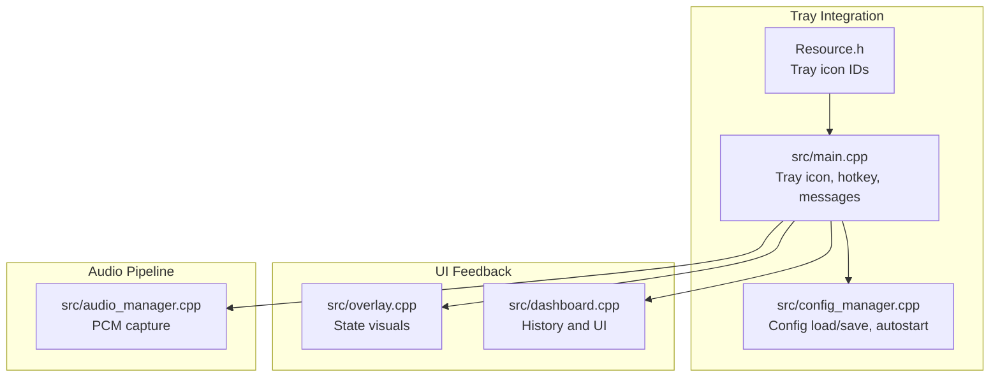
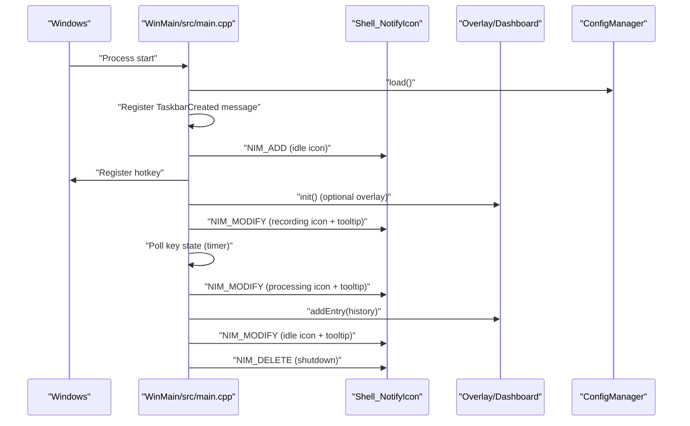
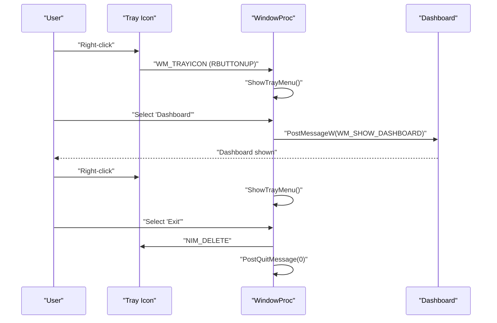
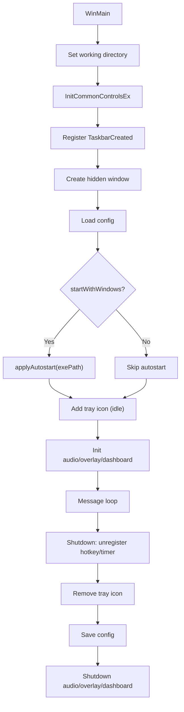
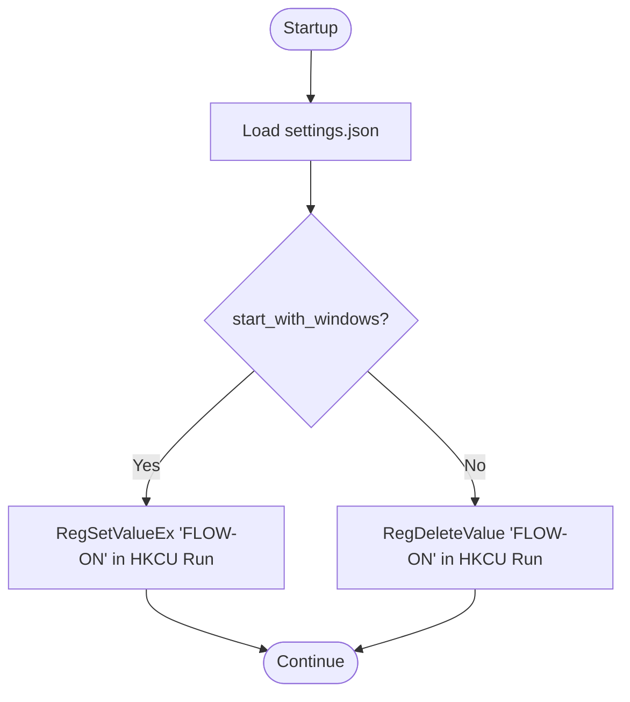
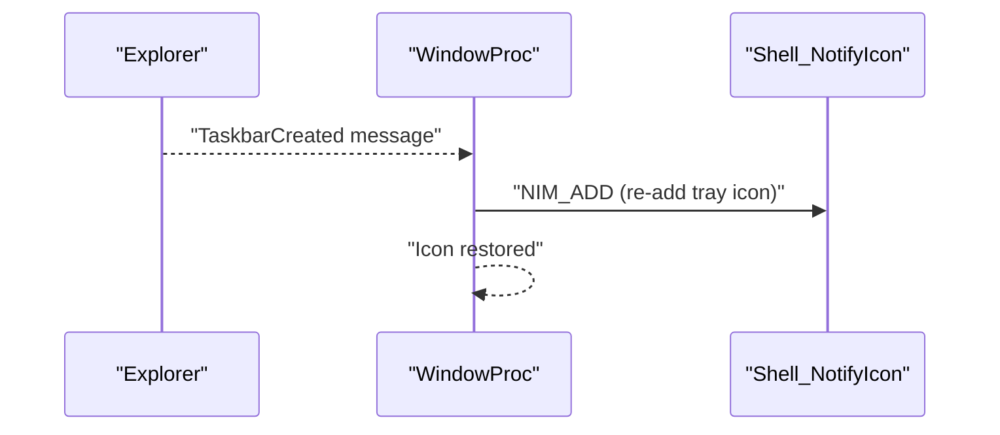
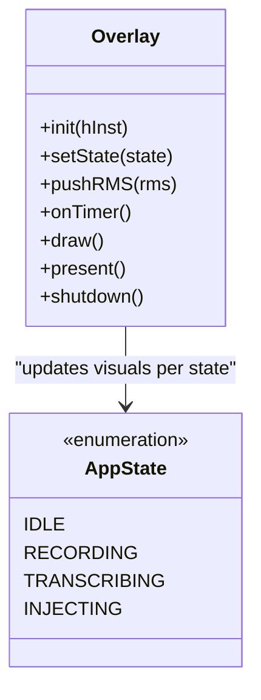
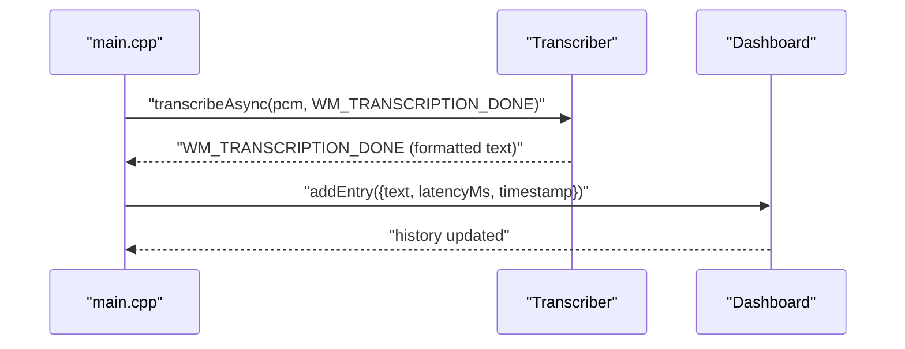
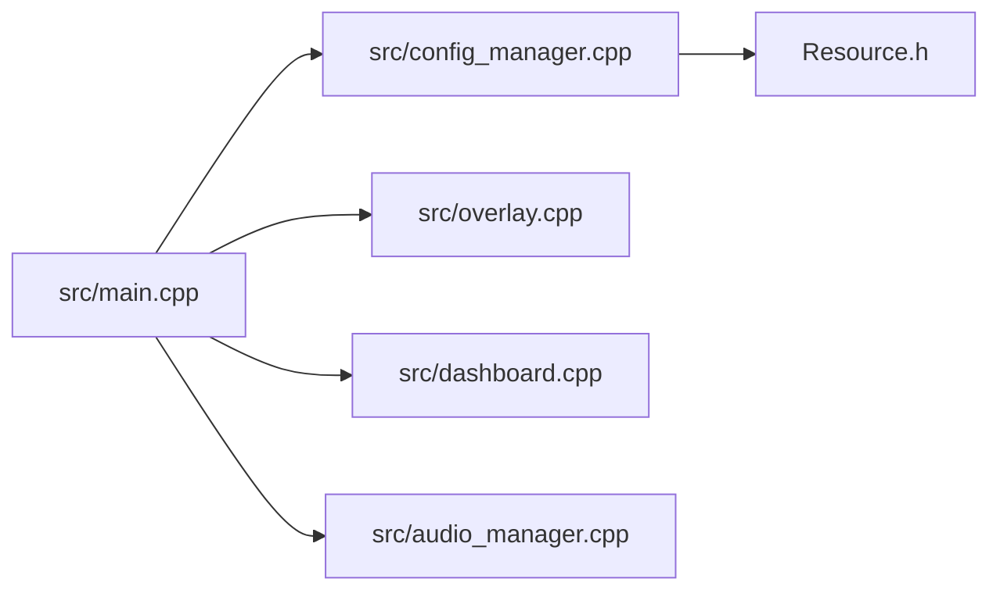

# System Tray Integration

<cite>
**Referenced Files in This Document**
- [main.cpp](file://src/main.cpp)
- [config_manager.cpp](file://src/config_manager.cpp)
- [config_manager.h](file://src/config_manager.h)
- [dashboard.cpp](file://src/dashboard.cpp)
- [dashboard.h](file://src/dashboard.h)
- [audio_manager.cpp](file://src/audio_manager.cpp)
- [overlay.cpp](file://src/overlay.cpp)
- [Resource.h](file://Resource.h)
- [settings.default.json](file://assets/settings.default.json)
</cite>

## Table of Contents
1. [Introduction](#introduction)
2. [Project Structure](#project-structure)
3. [Core Components](#core-components)
4. [Architecture Overview](#architecture-overview)
5. [Detailed Component Analysis](#detailed-component-analysis)
6. [Dependency Analysis](#dependency-analysis)
7. [Performance Considerations](#performance-considerations)
8. [Troubleshooting Guide](#troubleshooting-guide)
9. [Conclusion](#conclusion)

## Introduction
This document explains the system tray integration for the application, focusing on tray icon management, context menu behavior, and application lifecycle. It covers:
- Tray icon state indication and hover tooltips
- Context menu options and actions
- Autostart configuration persistence and Windows startup registration
- Explorer crash recovery and robustness
- Application lifecycle: startup, shutdown, and restart
- Integration with the Windows notification area and icon animation for state
- Troubleshooting guidance for tray icon visibility and startup issues
- Configuration storage location under %APPDATA%\FLOW-ON\settings.json

## Project Structure
The tray integration is implemented in a dedicated entry point and supporting subsystems:
- Tray icon, hotkey, and message handling live in the main application entry point
- Configuration persistence and autostart logic are encapsulated in a configuration manager
- Dashboard and overlay provide UI feedback for state transitions
- Audio capture feeds real-time metrics to the overlay



**Diagram sources**
- [main.cpp](file://src/main.cpp#L362-L521)
- [config_manager.cpp](file://src/config_manager.cpp#L24-L108)
- [overlay.cpp](file://src/overlay.cpp#L29-L74)
- [dashboard.cpp](file://src/dashboard.cpp#L394-L454)
- [audio_manager.cpp](file://src/audio_manager.cpp#L58-L122)
- [Resource.h](file://Resource.h#L13-L20)

**Section sources**
- [main.cpp](file://src/main.cpp#L362-L521)
- [config_manager.cpp](file://src/config_manager.cpp#L24-L108)
- [overlay.cpp](file://src/overlay.cpp#L29-L74)
- [dashboard.cpp](file://src/dashboard.cpp#L394-L454)
- [audio_manager.cpp](file://src/audio_manager.cpp#L58-L122)
- [Resource.h](file://Resource.h#L13-L20)

## Core Components
- Tray icon and state management: Adds the icon to the notification area, updates the icon and tooltip based on state, and restores the icon after Explorer restarts.
- Context menu: Provides quick actions for opening the dashboard and exiting the application.
- Hotkey and timers: Registers a global hotkey and polls for key release to end recording.
- Configuration and autostart: Loads/saves settings and manages Windows Startup via the registry.
- Dashboard and overlay: Provide visual feedback for recording, processing, and completion/error states.

**Section sources**
- [main.cpp](file://src/main.cpp#L79-L128)
- [main.cpp](file://src/main.cpp#L91-L110)
- [main.cpp](file://src/main.cpp#L150-L155)
- [config_manager.cpp](file://src/config_manager.cpp#L82-L107)
- [overlay.cpp](file://src/overlay.cpp#L140-L158)
- [dashboard.cpp](file://src/dashboard.cpp#L409-L415)

## Architecture Overview
The tray integration centers around a hidden message-only window that owns the tray icon, hotkey, and inter-subsystem messaging. The main flow:
- On startup, the application registers a message for TaskbarCreated to restore the tray icon after Explorer restarts.
- The tray icon is added with initial state and tooltip.
- Hotkey events trigger recording, which updates the tray icon and overlay visuals.
- Transcription completion updates the tray icon and adds entries to the dashboard history.
- Shutdown removes the tray icon and cleans up resources.



**Diagram sources**
- [main.cpp](file://src/main.cpp#L362-L521)
- [main.cpp](file://src/main.cpp#L418-L431)
- [main.cpp](file://src/main.cpp#L185-L222)
- [main.cpp](file://src/main.cpp#L244-L342)
- [overlay.cpp](file://src/overlay.cpp#L29-L74)
- [dashboard.cpp](file://src/dashboard.cpp#L428-L439)
- [config_manager.cpp](file://src/config_manager.cpp#L24-L58)

## Detailed Component Analysis

### Tray Icon Management and State Indication
- Icon and tooltip updates: The application loads icon resources and updates the tray icon and tooltip based on state transitions (idle, recording, processing).
- Tooltip messaging: Tooltips reflect current state and transient conditions (e.g., “Too short,” “Audio capture error,” “Busy, try again”).
- Explorer crash recovery: A registered TaskbarCreated message ensures the icon is re-added after Explorer restarts.

```mermaid
flowchart TD
Start(["State Change"]) --> Idle["Idle"]
Start --> Recording["Recording"]
Start --> Processing["Processing"]
Start --> Error["Error"]
Idle --> |SetTrayIcon(IDI_IDLE_ICON, "Idle...")| TrayIdle["Tray: Idle Icon"]
Recording --> |SetTrayIcon(IDI_RECORDING_ICON, "Recording...")| TrayRec["Tray: Recording Icon"]
Processing --> |SetTrayIcon(IDI_IDLE_ICON, "Processing...")| TrayProc["Tray: Idle Icon"]
Error --> |SetTrayIcon(IDI_IDLE_ICON, "Error message")| TrayErr["Tray: Idle Icon"]
TrayIdle --> TooltipIdle["Tooltip: Idle"]
TrayRec --> TooltipRec["Tooltip: Recording"]
TrayProc --> TooltipProc["Tooltip: Processing"]
TrayErr --> TooltipErr["Tooltip: Error"]
```

**Diagram sources**
- [main.cpp](file://src/main.cpp#L79-L86)
- [main.cpp](file://src/main.cpp#L185-L222)
- [main.cpp](file://src/main.cpp#L244-L342)
- [Resource.h](file://Resource.h#L13-L20)

**Section sources**
- [main.cpp](file://src/main.cpp#L79-L86)
- [main.cpp](file://src/main.cpp#L150-L155)
- [main.cpp](file://src/main.cpp#L185-L222)
- [main.cpp](file://src/main.cpp#L244-L342)
- [Resource.h](file://Resource.h#L13-L20)

### Context Menu and Actions
- Right-click tray icon opens a context menu with:
  - Dashboard: Opens the dashboard window
  - Exit: Removes the tray icon and posts a quit message
- Double-click tray icon opens the dashboard.



**Diagram sources**
- [main.cpp](file://src/main.cpp#L91-L110)
- [main.cpp](file://src/main.cpp#L227-L232)
- [main.cpp](file://src/main.cpp#L237-L239)
- [dashboard.cpp](file://src/dashboard.cpp#L409-L415)

**Section sources**
- [main.cpp](file://src/main.cpp#L91-L110)
- [main.cpp](file://src/main.cpp#L227-L239)
- [dashboard.cpp](file://src/dashboard.cpp#L409-L415)

### Application Lifecycle Management
- Startup:
  - Sets working directory to executable location
  - Initializes common controls
  - Registers TaskbarCreated message
  - Creates a hidden message-only window
  - Loads configuration and applies autostart if enabled
  - Adds the tray icon with initial state
  - Initializes audio, overlay, and dashboard
- Running:
  - Handles hotkey, timers, and transcription pipeline
  - Updates tray icon and overlay visuals
  - Records history entries in the dashboard
- Shutdown:
  - Stops timers and hotkeys
  - Removes tray icon
  - Saves configuration
  - Shuts down audio, overlay, and dashboard



**Diagram sources**
- [main.cpp](file://src/main.cpp#L362-L521)
- [config_manager.cpp](file://src/config_manager.cpp#L82-L107)

**Section sources**
- [main.cpp](file://src/main.cpp#L362-L521)
- [config_manager.cpp](file://src/config_manager.cpp#L82-L107)

### Autostart Functionality
- Configuration persistence:
  - Settings are stored in JSON at %APPDATA%\FLOW-ON\settings.json
  - Keys include start_with_windows, use_gpu, model, mode, hotkey, and snippets
- Windows startup registration:
  - When enabled, the application writes a Run registry value under Current User
  - When disabled, the value is removed



**Diagram sources**
- [config_manager.cpp](file://src/config_manager.cpp#L24-L58)
- [config_manager.cpp](file://src/config_manager.cpp#L82-L107)
- [settings.default.json](file://assets/settings.default.json#L1-L16)

**Section sources**
- [config_manager.cpp](file://src/config_manager.cpp#L24-L58)
- [config_manager.cpp](file://src/config_manager.cpp#L82-L107)
- [settings.default.json](file://assets/settings.default.json#L1-L16)

### Explorer Crash Recovery Mechanism
- The application registers a message named “TaskbarCreated”
- Upon receiving this message, the application re-adds the tray icon to restore visibility after Explorer restarts



**Diagram sources**
- [main.cpp](file://src/main.cpp#L382-L382)
- [main.cpp](file://src/main.cpp#L150-L155)

**Section sources**
- [main.cpp](file://src/main.cpp#L382-L382)
- [main.cpp](file://src/main.cpp#L150-L155)

### Icon Animation and State Feedback
- Overlay visuals:
  - Recording: animated waveform and pulsing dot
  - Processing: sweeping spinner with label
  - Done/Error: animated checkmark/X with glow effects
- Tray icon animation:
  - The tray icon switches between idle and recording states
  - Tooltips reflect current state and transient errors



**Diagram sources**
- [overlay.cpp](file://src/overlay.cpp#L29-L74)
- [overlay.cpp](file://src/overlay.cpp#L140-L158)
- [overlay.cpp](file://src/overlay.cpp#L596-L620)
- [main.cpp](file://src/main.cpp#L67-L71)

**Section sources**
- [overlay.cpp](file://src/overlay.cpp#L29-L74)
- [overlay.cpp](file://src/overlay.cpp#L140-L158)
- [overlay.cpp](file://src/overlay.cpp#L596-L620)
- [main.cpp](file://src/main.cpp#L67-L71)

### Dashboard Integration
- The dashboard displays recent transcriptions with timestamps and latency
- On transcription completion, the main loop adds entries to the dashboard history
- The dashboard UI is a modern Direct2D window with smooth animations



**Diagram sources**
- [main.cpp](file://src/main.cpp#L244-L342)
- [dashboard.cpp](file://src/dashboard.cpp#L428-L439)

**Section sources**
- [main.cpp](file://src/main.cpp#L244-L342)
- [dashboard.cpp](file://src/dashboard.cpp#L428-L439)

## Dependency Analysis
- Tray icon ownership and callbacks:
  - The hidden window owns the tray icon and processes tray-related messages
  - The window procedure handles TaskbarCreated, hotkey, timers, and tray icon interactions
- Configuration dependency:
  - ConfigManager provides settings and autostart control
  - Settings include start_with_windows, which influences startup behavior
- UI feedback dependency:
  - Overlay depends on Direct2D/DirectWrite and a layered window
  - Dashboard depends on Direct2D/DirectWrite and a separate window class



**Diagram sources**
- [main.cpp](file://src/main.cpp#L362-L521)
- [config_manager.cpp](file://src/config_manager.cpp#L24-L107)
- [overlay.cpp](file://src/overlay.cpp#L29-L74)
- [dashboard.cpp](file://src/dashboard.cpp#L394-L454)
- [audio_manager.cpp](file://src/audio_manager.cpp#L58-L122)
- [Resource.h](file://Resource.h#L13-L20)

**Section sources**
- [main.cpp](file://src/main.cpp#L362-L521)
- [config_manager.cpp](file://src/config_manager.cpp#L24-L107)
- [overlay.cpp](file://src/overlay.cpp#L29-L74)
- [dashboard.cpp](file://src/dashboard.cpp#L394-L454)
- [audio_manager.cpp](file://src/audio_manager.cpp#L58-L122)
- [Resource.h](file://Resource.h#L13-L20)

## Performance Considerations
- Tray icon updates are lightweight and occur only on state changes
- Overlay rendering uses efficient Direct2D primitives and a timer-driven loop
- Audio capture uses a lock-free queue to minimize contention
- Transcription is initiated asynchronously to keep the UI responsive

[No sources needed since this section provides general guidance]

## Troubleshooting Guide
- Tray icon not visible:
  - Ensure Explorer is running normally; the application restores the icon upon receiving the TaskbarCreated message
  - Verify the hidden window is created successfully during startup
- Hotkey conflicts:
  - The application attempts to register Alt+V; if unavailable, it tries Alt+Shift+V and updates the tooltip accordingly
  - If both fail, the user is prompted to close the conflicting application and restart
- Audio initialization failures:
  - If microphone access fails, the application shows an error dialog and exits gracefully
- Dashboard not opening:
  - Confirm the dashboard window initializes successfully and is brought to the foreground
- Autostart not working:
  - Check that the Run registry value exists under Current User and matches the executable path
  - Verify the settings.json start_with_windows flag is enabled

**Section sources**
- [main.cpp](file://src/main.cpp#L162-L178)
- [main.cpp](file://src/main.cpp#L436-L444)
- [config_manager.cpp](file://src/config_manager.cpp#L82-L107)
- [dashboard.cpp](file://src/dashboard.cpp#L394-L415)

## Conclusion
The system tray integration provides a robust, state-aware interface with immediate visual feedback and seamless Explorer crash recovery. Configuration persistence and autostart support enable consistent user experience across sessions. The modular design keeps tray logic cohesive while delegating UI and pipeline concerns to specialized components.