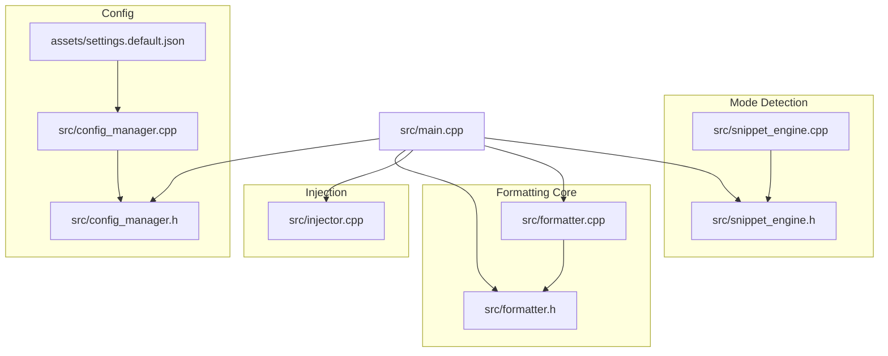
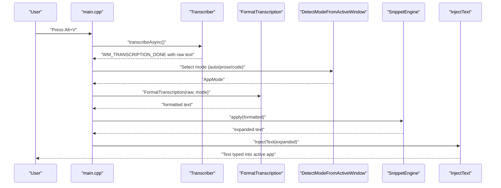
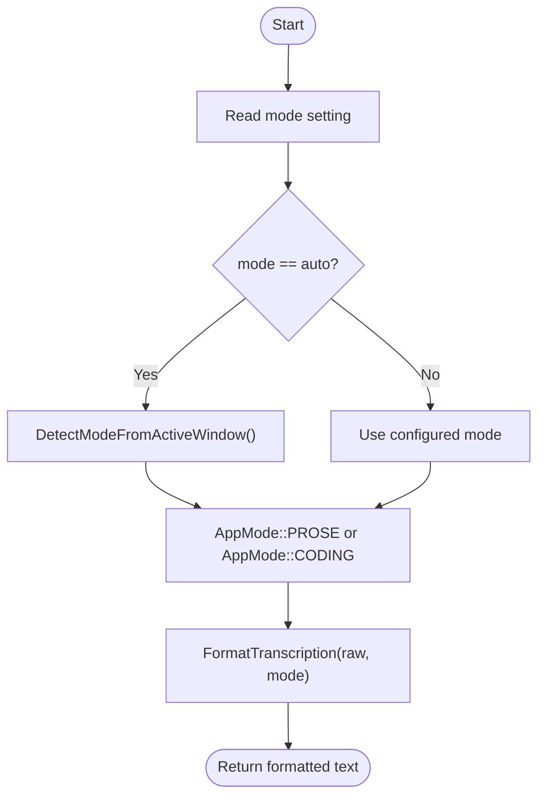
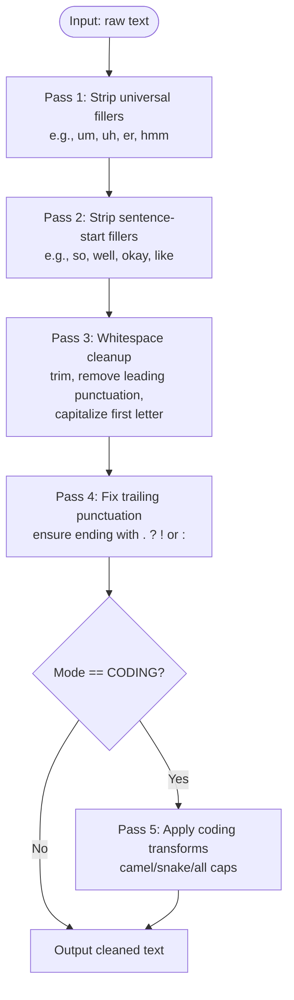
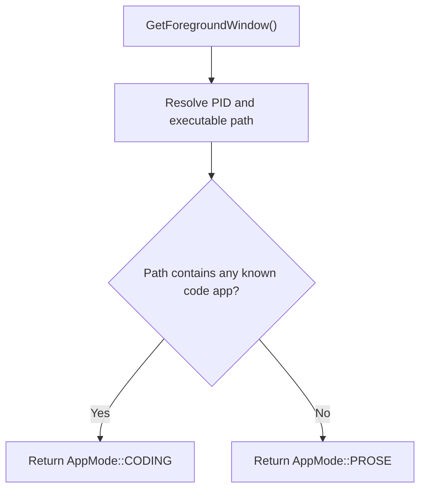
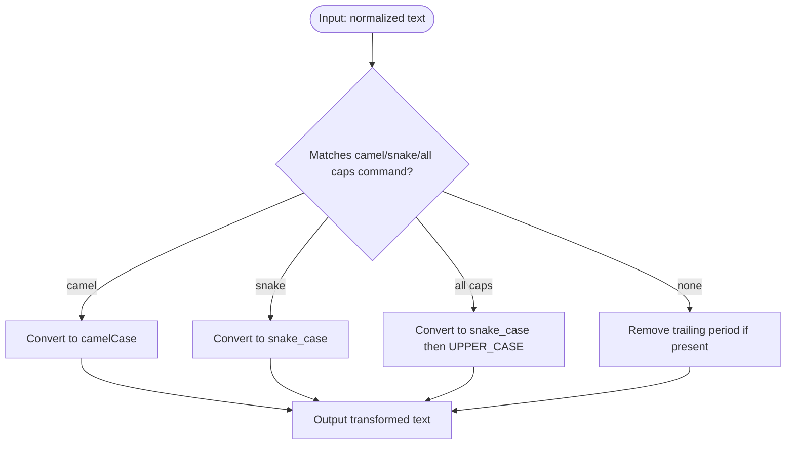
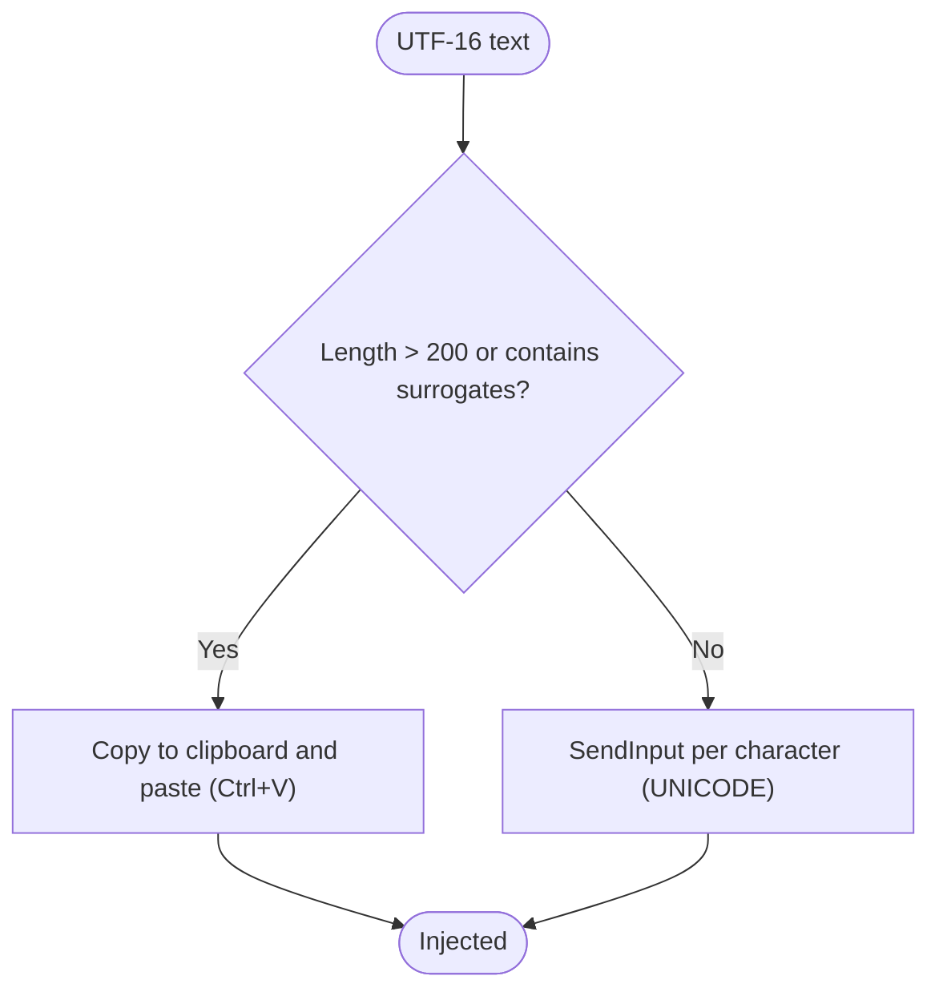
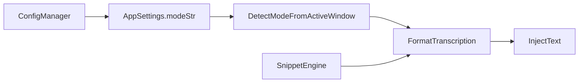

# Text Formatting and Modes

<cite>
**Referenced Files in This Document**
- [formatter.h](file://src/formatter.h)
- [formatter.cpp](file://src/formatter.cpp)
- [main.cpp](file://src/main.cpp)
- [config_manager.h](file://src/config_manager.h)
- [config_manager.cpp](file://src/config_manager.cpp)
- [snippet_engine.h](file://src/snippet_engine.h)
- [snippet_engine.cpp](file://src/snippet_engine.cpp)
- [injector.cpp](file://src/injector.cpp)
- [settings.default.json](file://assets/settings.default.json)
</cite>

## Table of Contents
1. [Introduction](#introduction)
2. [Project Structure](#project-structure)
3. [Core Components](#core-components)
4. [Architecture Overview](#architecture-overview)
5. [Detailed Component Analysis](#detailed-component-analysis)
6. [Dependency Analysis](#dependency-analysis)
7. [Performance Considerations](#performance-considerations)
8. [Troubleshooting Guide](#troubleshooting-guide)
9. [Conclusion](#conclusion)
10. [Appendices](#appendices)

## Introduction
This document explains the intelligent text formatting system that transforms raw speech-to-text output into polished prose or developer-ready identifiers and snippets. It covers the three operation modes, the four-pass cleaning pipeline, UTF-16-aware injection, and the automatic mode detection for editors and terminals. Practical examples illustrate before/after transformations, and configuration options show how to customize behavior.

## Project Structure
The formatting system lives in the core C++ modules under src/, with configuration persisted to JSON and integrated into the main application lifecycle.

**Diagram sources**
- [formatter.h](file://src/formatter.h#L1-L14)
- [formatter.cpp](file://src/formatter.cpp#L1-L148)
- [snippet_engine.h](file://src/snippet_engine.h#L1-L26)
- [snippet_engine.cpp](file://src/snippet_engine.cpp#L1-L82)
- [config_manager.h](file://src/config_manager.h#L1-L40)
- [config_manager.cpp](file://src/config_manager.cpp#L1-L108)
- [settings.default.json](file://assets/settings.default.json#L1-L16)
- [injector.cpp](file://src/injector.cpp#L1-L75)
- [main.cpp](file://src/main.cpp#L1-L521)

**Section sources**
- [formatter.h](file://src/formatter.h#L1-L14)
- [formatter.cpp](file://src/formatter.cpp#L1-L148)
- [main.cpp](file://src/main.cpp#L280-L342)
- [config_manager.h](file://src/config_manager.h#L1-L40)
- [config_manager.cpp](file://src/config_manager.cpp#L24-L58)
- [settings.default.json](file://assets/settings.default.json#L1-L16)
- [snippet_engine.h](file://src/snippet_engine.h#L21-L26)
- [snippet_engine.cpp](file://src/snippet_engine.cpp#L35-L81)
- [injector.cpp](file://src/injector.cpp#L49-L75)

## Core Components
- AppMode: Determines formatting behavior and coding transforms.
- Four-pass formatter: universal fillers → sentence-start fillers → whitespace/punctuation/capitalization → trailing punctuation → (CODING only) camel/snake/all caps transforms.
- Mode detection: Auto-detects code editors and terminals to select AppMode::CODING automatically.
- UTF-16-aware injection: Uses SendInput for short text and clipboard fallback for emoji/surrogate pairs.

**Section sources**
- [formatter.h](file://src/formatter.h#L4-L13)
- [formatter.cpp](file://src/formatter.cpp#L137-L148)
- [main.cpp](file://src/main.cpp#L300-L304)
- [snippet_engine.cpp](file://src/snippet_engine.cpp#L35-L81)
- [injector.cpp](file://src/injector.cpp#L49-L75)

## Architecture Overview
End-to-end flow from recording to injected text, including formatting and mode selection.

**Diagram sources**
- [main.cpp](file://src/main.cpp#L244-L342)
- [formatter.cpp](file://src/formatter.cpp#L137-L148)
- [snippet_engine.cpp](file://src/snippet_engine.cpp#L6-L28)
- [injector.cpp](file://src/injector.cpp#L49-L75)

## Detailed Component Analysis

### Operation Modes and Mode Selection
- PROSE mode: Cleans speech artifacts and punctuation for readable text.
- CODING mode: Applies camelCase, snake_case, or UPPER_CASE_WITH_UNDERSCORES transforms to identifiers and code snippets.
- AUTO mode: Automatically selects PROSE or CODING based on the active foreground application.

**Diagram sources**
- [main.cpp](file://src/main.cpp#L300-L304)
- [snippet_engine.cpp](file://src/snippet_engine.cpp#L35-L81)
- [formatter.cpp](file://src/formatter.cpp#L137-L148)

**Section sources**
- [formatter.h](file://src/formatter.h#L4-L5)
- [main.cpp](file://src/main.cpp#L300-L304)
- [snippet_engine.cpp](file://src/snippet_engine.cpp#L35-L81)
- [config_manager.h](file://src/config_manager.h#L8-L19)
- [config_manager.cpp](file://src/config_manager.cpp#L24-L58)
- [settings.default.json](file://assets/settings.default.json#L1-L16)

### Four-Pass Cleaning Pipeline
The formatter applies a deterministic sequence of passes to normalize raw transcription output.

**Diagram sources**
- [formatter.cpp](file://src/formatter.cpp#L14-L91)
- [formatter.cpp](file://src/formatter.cpp#L114-L133)
- [formatter.cpp](file://src/formatter.cpp#L137-L148)

**Section sources**
- [formatter.h](file://src/formatter.h#L7-L12)
- [formatter.cpp](file://src/formatter.cpp#L14-L91)
- [formatter.cpp](file://src/formatter.cpp#L114-L133)
- [formatter.cpp](file://src/formatter.cpp#L137-L148)

### Automatic Mode Detection for Editors and Terminals
The system inspects the foreground process executable path to decide whether to treat input as code or prose.

**Diagram sources**
- [snippet_engine.cpp](file://src/snippet_engine.cpp#L35-L81)

**Section sources**
- [snippet_engine.h](file://src/snippet_engine.h#L21-L26)
- [snippet_engine.cpp](file://src/snippet_engine.cpp#L35-L81)

### Coding Mode Transformations
CODING mode recognizes explicit voice commands and converts free-form text into identifiers and constants.

- camelCase: Matches a command pattern and converts the remainder to camelCase.
- snake_case: Converts the remainder to snake_case.
- UPPER_CASE_WITH_UNDERSCORES: Converts to snake_case then uppercases.

**Diagram sources**
- [formatter.cpp](file://src/formatter.cpp#L34-L38)
- [formatter.cpp](file://src/formatter.cpp#L114-L133)

**Section sources**
- [formatter.cpp](file://src/formatter.cpp#L34-L38)
- [formatter.cpp](file://src/formatter.cpp#L114-L133)

### UTF-16 Awareness and Injection Strategy
The injector handles international characters robustly:
- Short strings without surrogate pairs: SendInput with per-character KEYEVENTF_UNICODE.
- Long strings or strings containing surrogate pairs (emoji/CJK): Clipboard paste via Ctrl+V.

**Diagram sources**
- [injector.cpp](file://src/injector.cpp#L10-L16)
- [injector.cpp](file://src/injector.cpp#L49-L75)

**Section sources**
- [injector.cpp](file://src/injector.cpp#L10-L16)
- [injector.cpp](file://src/injector.cpp#L49-L75)

### Practical Examples

- PROSE cleaning
  - Before: “um, right, so like, the function er, it’s not working.”
  - After: “The function is not working.”

- CODING identifier conversion
  - Before: “user name”
  - Command: “camel case user name”
  - After: “userName”

- CODING constant conversion
  - Before: “HTTP method”
  - Command: “all caps HTTP method”
  - After: “HTTP_METHOD”

- CODING snippet trimming
  - Before: “api response.”
  - After: “api_response” (period removed in CODING mode)

Note: Commands are recognized by the CODING pass and stripped from the final output.

**Section sources**
- [formatter.cpp](file://src/formatter.cpp#L14-L91)
- [formatter.cpp](file://src/formatter.cpp#L114-L133)

## Dependency Analysis
The formatting pipeline depends on mode detection and configuration, while injection depends on UTF-16 handling.

**Diagram sources**
- [main.cpp](file://src/main.cpp#L300-L304)
- [formatter.cpp](file://src/formatter.cpp#L137-L148)
- [snippet_engine.cpp](file://src/snippet_engine.cpp#L6-L28)
- [injector.cpp](file://src/injector.cpp#L49-L75)

**Section sources**
- [main.cpp](file://src/main.cpp#L300-L304)
- [formatter.cpp](file://src/formatter.cpp#L137-L148)
- [snippet_engine.cpp](file://src/snippet_engine.cpp#L6-L28)
- [injector.cpp](file://src/injector.cpp#L49-L75)

## Performance Considerations
- Regex compilation occurs once per module load to avoid runtime overhead on the hot path.
- The formatter operates on wide strings internally to support international characters and then converts back to narrow strings.
- The injector avoids expensive clipboard operations for short, ASCII-like text and falls back only when needed.

[No sources needed since this section provides general guidance]

## Troubleshooting Guide
- Mode not switching as expected
  - Verify the active window executable path contains one of the known code applications.
  - Check configuration for mode overrides.

- Incorrect transformations in CODING mode
  - Ensure the voice command pattern is recognized by the transform regexes.
  - Confirm trailing punctuation is handled (periods are stripped for identifiers).

- Characters not typing correctly (emoji/CJK)
  - The injector automatically uses clipboard fallback for surrogate-containing text; confirm clipboard permissions.

**Section sources**
- [snippet_engine.cpp](file://src/snippet_engine.cpp#L35-L81)
- [formatter.cpp](file://src/formatter.cpp#L34-L38)
- [injector.cpp](file://src/injector.cpp#L49-L75)

## Conclusion
The formatting system provides a robust, configurable pipeline that cleans speech artifacts for prose and converts natural language into idiomatic identifiers and constants for code. Automatic mode detection aligns behavior with the user’s environment, while UTF-16-aware injection ensures reliable text insertion across applications.

[No sources needed since this section summarizes without analyzing specific files]

## Appendices

### Configuration Options
- hotkey: Global hotkey string (default: “Alt+V”).
- mode: “auto”, “prose”, or “code”.
- model: Whisper model name (default: “tiny.en”).
- use_gpu: Whether to enable GPU acceleration.
- start_with_windows: Launch at Windows startup.
- snippets: Named expansions applied after formatting.

**Section sources**
- [config_manager.h](file://src/config_manager.h#L8-L19)
- [config_manager.cpp](file://src/config_manager.cpp#L24-L58)
- [settings.default.json](file://assets/settings.default.json#L1-L16)