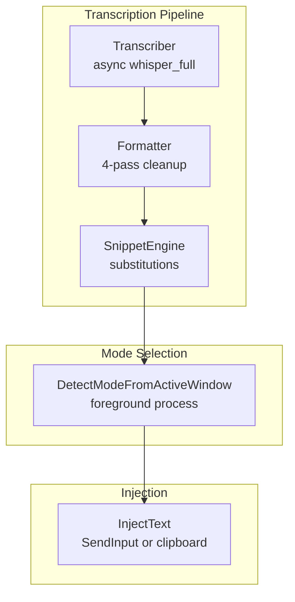
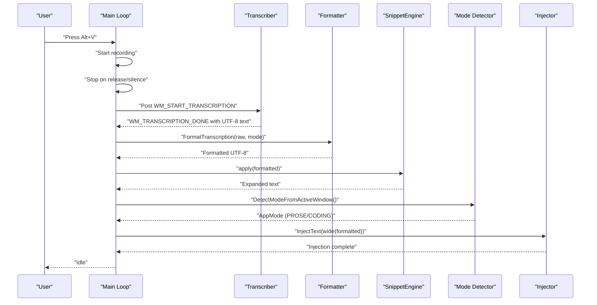
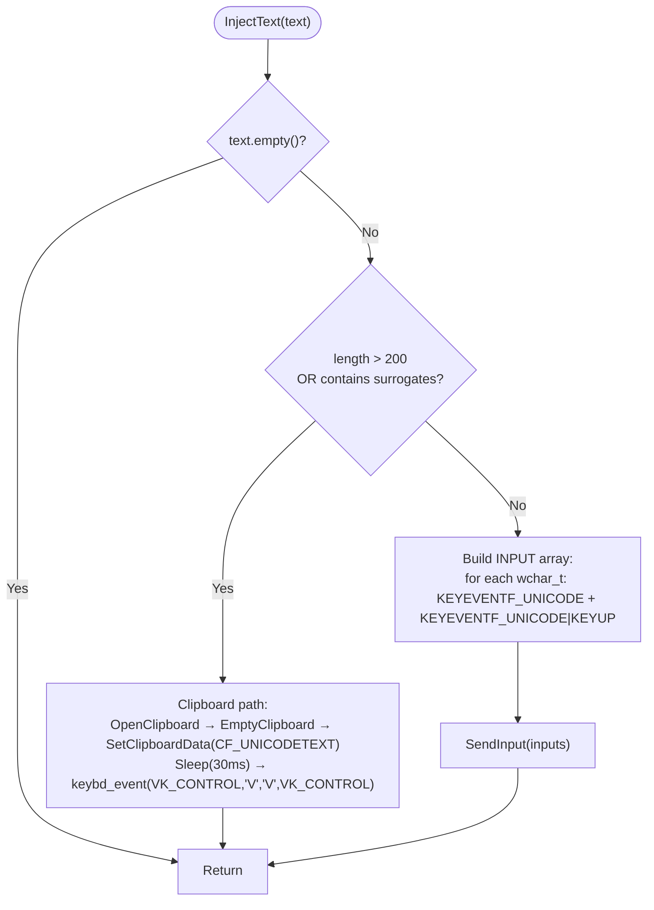
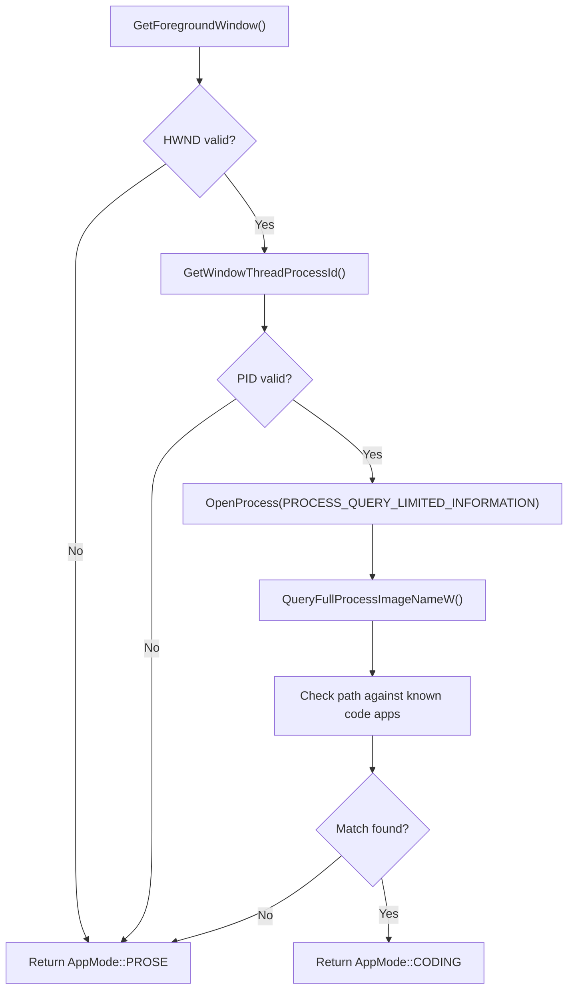
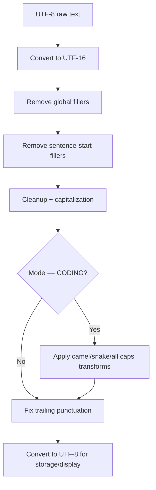
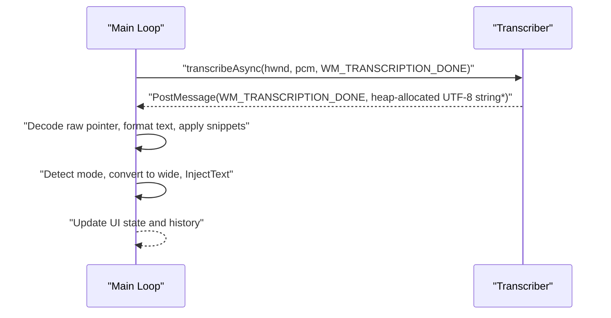
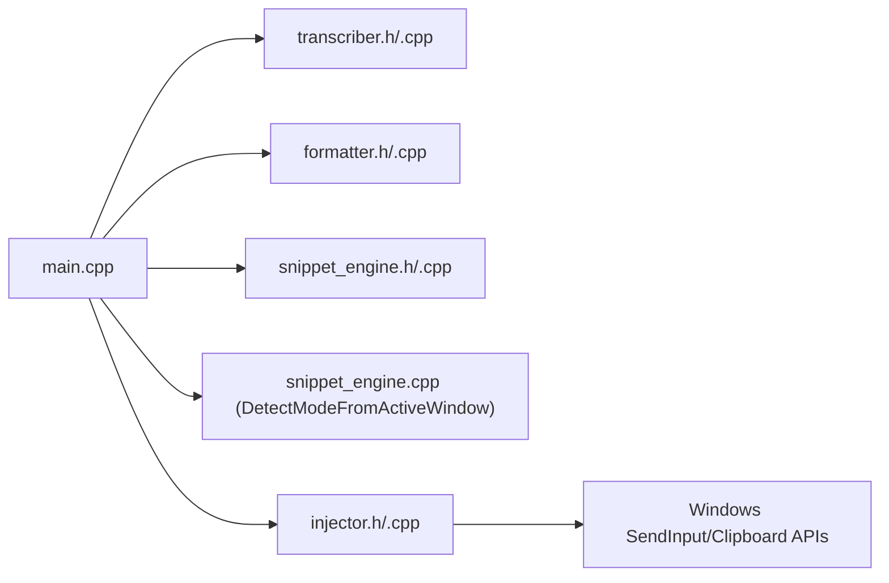

# Text Injection System

<cite>
**Referenced Files in This Document**
- [injector.cpp](file://src/injector.cpp)
- [injector.h](file://src/injector.h)
- [main.cpp](file://src/main.cpp)
- [formatter.cpp](file://src/formatter.cpp)
- [formatter.h](file://src/formatter.h)
- [snippet_engine.cpp](file://src/snippet_engine.cpp)
- [snippet_engine.h](file://src/snippet_engine.h)
- [config_manager.cpp](file://src/config_manager.cpp)
- [config_manager.h](file://src/config_manager.h)
- [README.md](file://README.md)
</cite>

## Table of Contents
1. [Introduction](#introduction)
2. [Project Structure](#project-structure)
3. [Core Components](#core-components)
4. [Architecture Overview](#architecture-overview)
5. [Detailed Component Analysis](#detailed-component-analysis)
6. [Dependency Analysis](#dependency-analysis)
7. [Performance Considerations](#performance-considerations)
8. [Troubleshooting Guide](#troubleshooting-guide)
9. [Security Considerations](#security-considerations)
10. [Examples and Failure Cases](#examples-and-failure-cases)
11. [Conclusion](#conclusion)

## Introduction
This document explains the text injection system that delivers transcribed speech into the active Windows application. It covers:
- Integration with the SendInput API for direct keyboard event injection
- Fallback strategy using the clipboard and Ctrl+V for special characters and emoji
- Active window detection to select appropriate formatting modes
- Text encoding handling for UTF-16 and international characters
- Injection timing synchronized with transcription completion
- Compatibility across browsers, editors, terminals, and games
- Troubleshooting and security considerations

## Project Structure
The text injection pipeline spans several modules:
- Transcription and formatting produce a formatted UTF-8 string
- Mode detection selects prose or coding behavior
- Snippet expansion applies user-defined substitutions
- Injection converts the result to UTF-16 and sends keyboard events or falls back to clipboard paste

**Diagram sources**
- [main.cpp](file://src/main.cpp#L244-L342)
- [formatter.cpp](file://src/formatter.cpp#L137-L147)
- [snippet_engine.cpp](file://src/snippet_engine.cpp#L6-L28)
- [snippet_engine.cpp](file://src/snippet_engine.cpp#L35-L81)
- [injector.cpp](file://src/injector.cpp#L49-L74)

**Section sources**
- [README.md](file://README.md#L69-L123)
- [main.cpp](file://src/main.cpp#L244-L342)

## Core Components
- Injector: Converts a wide string to keyboard events or uses clipboard + Ctrl+V for fallback.
- Formatter: Cleans and normalizes text; optionally applies coding transforms.
- SnippetEngine: Applies case-insensitive keyword substitutions.
- Mode detector: Determines whether the foreground application is a code editor or prose editor.
- Main loop: Orchestrates transcription, formatting, snippet expansion, mode selection, and injection.

Key responsibilities:
- UTF-8 to UTF-16 conversion for injection
- Surrogate pair detection to decide fallback strategy
- Synchronization with transcription completion via Windows messages

**Section sources**
- [injector.h](file://src/injector.h#L4-L8)
- [injector.cpp](file://src/injector.cpp#L49-L74)
- [formatter.h](file://src/formatter.h#L4-L13)
- [formatter.cpp](file://src/formatter.cpp#L137-L147)
- [snippet_engine.h](file://src/snippet_engine.h#L5-L19)
- [snippet_engine.cpp](file://src/snippet_engine.cpp#L6-L28)
- [main.cpp](file://src/main.cpp#L300-L320)

## Architecture Overview
The system follows a deterministic state machine. Injection occurs immediately after transcription completion, ensuring minimal latency and correct synchronization.

**Diagram sources**
- [main.cpp](file://src/main.cpp#L185-L222)
- [main.cpp](file://src/main.cpp#L244-L342)
- [transcriber.h](file://src/transcriber.h#L17-L21)
- [formatter.cpp](file://src/formatter.cpp#L137-L147)
- [snippet_engine.cpp](file://src/snippet_engine.cpp#L6-L28)
- [snippet_engine.cpp](file://src/snippet_engine.cpp#L35-L81)
- [injector.cpp](file://src/injector.cpp#L49-L74)

## Detailed Component Analysis

### Injector: SendInput and Clipboard Fallback
The injector decides between two strategies:
- Direct injection using SendInput with KEYEVENTF_UNICODE for each character
- Clipboard + Ctrl+V fallback for long strings or text containing surrogate pairs (emoji, extended CJK)

Implementation highlights:
- Surrogate detection: Characters in the range U+D800..U+DFFF indicate surrogate pairs requiring fallback.
- Long-string fallback: Strings longer than a threshold trigger clipboard injection.
- Clipboard path: Places UTF-16 text on the clipboard and simulates Ctrl+V.
- Timing: A brief delay allows the target to process clipboard updates before injecting keystrokes.

**Diagram sources**
- [injector.cpp](file://src/injector.cpp#L10-L16)
- [injector.cpp](file://src/injector.cpp#L21-L47)
- [injector.cpp](file://src/injector.cpp#L49-L74)

**Section sources**
- [injector.cpp](file://src/injector.cpp#L10-L16)
- [injector.cpp](file://src/injector.cpp#L21-L47)
- [injector.cpp](file://src/injector.cpp#L49-L74)
- [injector.h](file://src/injector.h#L4-L8)

### Active Window Detection and Mode Selection
The system detects the active foreground window and infers whether it is a code editor or a prose editor. This determines formatting behavior (e.g., camelCase/snake_case transforms).

Mechanism:
- Retrieves the foreground window handle and process ID
- Opens the process to query the executable path
- Matches known code editor and terminal executables by substring presence in the path
- Defaults to prose mode otherwise

**Diagram sources**
- [snippet_engine.cpp](file://src/snippet_engine.cpp#L35-L81)

**Section sources**
- [snippet_engine.cpp](file://src/snippet_engine.cpp#L35-L81)
- [main.cpp](file://src/main.cpp#L300-L303)

### Text Formatting and Encoding Handling
Formatting is performed in four passes:
1. Strip global fillers (um, uh, etc.)
2. Strip sentence-start fillers
3. Clean whitespace, trim, and capitalize first letter
4. Fix punctuation and apply coding transforms in code mode

Encoding:
- Input from Whisper is UTF-8; converted to UTF-16 for injection
- Output remains UTF-8 for persistence and display
- International characters are preserved through UTF-8/UTF-16 conversions

**Diagram sources**
- [formatter.cpp](file://src/formatter.cpp#L43-L63)
- [formatter.cpp](file://src/formatter.cpp#L65-L82)
- [formatter.cpp](file://src/formatter.cpp#L84-L91)
- [formatter.cpp](file://src/formatter.cpp#L114-L133)
- [formatter.cpp](file://src/formatter.cpp#L137-L147)

**Section sources**
- [formatter.cpp](file://src/formatter.cpp#L137-L147)
- [formatter.h](file://src/formatter.h#L4-L13)

### Snippet Expansion
The snippet engine performs case-insensitive, longest-first replacement of keywords with expansions. It operates on the formatted text before injection.

Behavior:
- Lowercases both text and triggers to match case-insensitively
- Replaces occurrences iteratively to avoid overlapping matches causing infinite loops
- Enforces a maximum expansion length per snippet for safety

**Section sources**
- [snippet_engine.cpp](file://src/snippet_engine.cpp#L6-L28)
- [config_manager.cpp](file://src/config_manager.cpp#L43-L51)

### Synchronization with Transcription Completion
The main loop posts a custom Windows message to start transcription and later receives a completion message. Injection occurs synchronously upon receipt of the completion message, ensuring correctness and minimizing latency.

**Diagram sources**
- [main.cpp](file://src/main.cpp#L244-L342)
- [transcriber.h](file://src/transcriber.h#L17-L21)

**Section sources**
- [main.cpp](file://src/main.cpp#L244-L342)
- [transcriber.h](file://src/transcriber.h#L7-L9)

## Dependency Analysis
The injection system depends on:
- Windows APIs for input simulation and clipboard manipulation
- Whisper for transcription
- Formatter and SnippetEngine for text processing
- Mode detection for behavior selection

**Diagram sources**
- [main.cpp](file://src/main.cpp#L20-L26)
- [injector.cpp](file://src/injector.cpp#L1-L4)
- [README.md](file://README.md#L86-L96)

**Section sources**
- [README.md](file://README.md#L86-L96)
- [main.cpp](file://src/main.cpp#L20-L26)

## Performance Considerations
- Injection latency is bounded by the time to build INPUT arrays and call SendInput, or by clipboard round-trip plus keystroke synthesis.
- Surrogate-containing or long strings force clipboard fallback, which adds a small delay but improves compatibility.
- The system avoids blocking the UI thread; injection happens synchronously after the transcription completion message is processed.

[No sources needed since this section provides general guidance]

## Troubleshooting Guide
Common issues and resolutions:
- Injection does nothing or inserts garbled text
  - Cause: Target application rejects Unicode events or has special input handling
  - Resolution: The system automatically falls back to clipboard + Ctrl+V for surrogate-containing or long strings
- Emoji or extended characters appear as replacement glyphs
  - Cause: Some legacy applications do not render supplementary planes properly
  - Resolution: Rely on the fallback path; ensure the target supports the character set
- Special characters not inserted
  - Cause: Applications that intercept or filter keyboard events
  - Resolution: Use the fallback clipboard path; verify the target accepts clipboard pastes
- Injection timing feels delayed
  - Cause: Clipboard fallback introduces a small delay
  - Resolution: Keep text short and free of surrogate pairs to use direct SendInput
- Mode detection misidentifies the application
  - Cause: Executable path not matching known code editors
  - Resolution: Manually set mode in settings; the detector falls back to prose mode otherwise
- Clipboard conflicts
  - Cause: Another application modifies the clipboard rapidly
  - Resolution: Retry injection; the system waits briefly before sending keystrokes

**Section sources**
- [injector.cpp](file://src/injector.cpp#L18-L47)
- [injector.cpp](file://src/injector.cpp#L53-L57)
- [snippet_engine.cpp](file://src/snippet_engine.cpp#L35-L81)
- [README.md](file://README.md#L326-L346)

## Security Considerations
- Permissions: The injector uses Windows input APIs; no elevated privileges are required for typical desktop applications.
- Clipboard safety: The clipboard is cleared and owned by the OS after SetClipboardData; the system does not retain sensitive text beyond the injection window.
- Input synthesis: Keyboard events are synthesized for the currently focused window; ensure the target is trusted.
- Snippet limits: Expansions are truncated to a maximum length to prevent abuse.

**Section sources**
- [injector.cpp](file://src/injector.cpp#L23-L37)
- [config_manager.cpp](file://src/config_manager.cpp#L46-L49)

## Examples and Failure Cases
Successful injection scenarios:
- Short, ASCII-friendly text in a browser or prose editor
  - Strategy: Direct SendInput with KEYEVENTF_UNICODE
  - Outcome: Immediate, accurate insertion
- Mixed scripts and punctuation in a modern editor
  - Strategy: UTF-8 → UTF-16 conversion followed by SendInput
  - Outcome: Correct rendering of international characters
- Long phrase with emoji or extended characters
  - Strategy: Clipboard + Ctrl+V fallback
  - Outcome: Reliable insertion even in terminals that reject Unicode events

Common failure cases:
- Game input handlers intercept or block synthetic keystrokes
  - Mitigation: Use the fallback path; if unsupported, consider alternative input methods
- Terminal emulators rejecting Unicode events
  - Mitigation: Rely on clipboard fallback; ensure the terminal supports pasting
- Very long transcription exceeding the internal threshold
  - Mitigation: The system automatically switches to clipboard fallback

[No sources needed since this section provides general guidance]

## Conclusion
The text injection system combines efficient direct input via SendInput with a robust clipboard fallback to maximize compatibility across diverse Windows applications. Active window detection and text formatting tailor the output to the context, while careful encoding handling preserves international characters. The design ensures synchronization with transcription completion and provides clear troubleshooting pathways for common issues.

[No sources needed since this section summarizes without analyzing specific files]