# Visual Feedback System

<cite>
**Referenced Files in This Document**
- [overlay.h](file://src/overlay.h)
- [overlay.cpp](file://src/overlay.cpp)
- [main.cpp](file://src/main.cpp)
- [audio_manager.h](file://src/audio_manager.h)
- [audio_manager.cpp](file://src/audio_manager.cpp)
- [transcriber.h](file://src/transcriber.h)
- [transcriber.cpp](file://src/transcriber.cpp)
- [config_manager.h](file://src/config_manager.h)
- [config_manager.cpp](file://src/config_manager.cpp)
- [dashboard.h](file://src/dashboard.h)
- [dashboard.cpp](file://src/dashboard.cpp)
- [Resource.h](file://Resource.h)
</cite>

## Table of Contents
1. [Introduction](#introduction)
2. [Project Structure](#project-structure)
3. [Core Components](#core-components)
4. [Architecture Overview](#architecture-overview)
5. [Detailed Component Analysis](#detailed-component-analysis)
6. [Dependency Analysis](#dependency-analysis)
7. [Performance Considerations](#performance-considerations)
8. [Troubleshooting Guide](#troubleshooting-guide)
9. [Conclusion](#conclusion)
10. [Appendices](#appendices)

## Introduction
This document describes the Direct2D-based visual feedback system that presents a floating, always-on-top overlay during speech-to-text operations. It covers the GPU-accelerated waveform visualization with real-time audio level display using pill-shaped bars, state indicator animations (spinner arc for transcription processing and color-coded status flashes), overlay positioning, the 60fps rendering loop driven by WM_TIMER messages, overlay lifecycle, customization options, and performance considerations for smooth rendering during transcription processing.

## Project Structure
The visual feedback system is implemented primarily in two modules:
- Overlay: a floating window with Direct2D drawing and UpdateLayeredWindow composition
- Audio Manager: captures microphone audio, computes RMS, and feeds the overlay in real time

Integration points:
- Main application manages state transitions and posts messages to drive overlay state
- Transcriber performs inference asynchronously and posts completion messages
- Dashboard and configuration are separate subsystems unrelated to overlay rendering

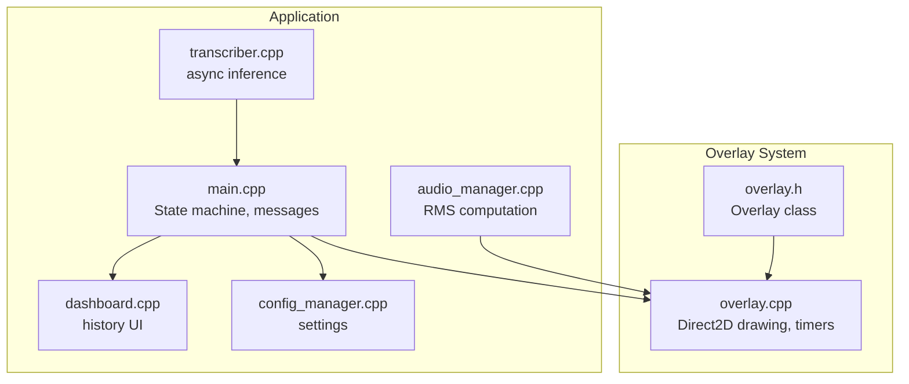

**Diagram sources**
- [overlay.h](file://src/overlay.h#L18-L94)
- [overlay.cpp](file://src/overlay.cpp#L29-L74)
- [main.cpp](file://src/main.cpp#L149-L357)
- [audio_manager.cpp](file://src/audio_manager.cpp#L39-L56)
- [transcriber.cpp](file://src/transcriber.cpp#L103-L225)
- [dashboard.cpp](file://src/dashboard.cpp#L90-L113)
- [config_manager.cpp](file://src/config_manager.cpp#L24-L58)

**Section sources**
- [overlay.h](file://src/overlay.h#L1-L94)
- [overlay.cpp](file://src/overlay.cpp#L29-L74)
- [main.cpp](file://src/main.cpp#L149-L357)
- [audio_manager.cpp](file://src/audio_manager.cpp#L39-L56)
- [transcriber.cpp](file://src/transcriber.cpp#L103-L225)
- [dashboard.cpp](file://src/dashboard.cpp#L90-L113)
- [config_manager.cpp](file://src/config_manager.cpp#L24-L58)

## Core Components
- Overlay class: encapsulates window creation, layered presentation, Direct2D device resources, timer-driven rendering, and state-specific drawing routines
- Audio Manager: captures audio, maintains a ring buffer, computes RMS, and atomically exposes the latest value for the overlay
- Main application: orchestrates recording, transcription, and overlay state transitions
- Transcriber: asynchronous inference with GPU acceleration fallback

Key responsibilities:
- Overlay: GPU-accelerated drawing, per-pixel alpha compositing, 60fps animation loop, state animations, and automatic hiding
- Audio Manager: minimal-callback audio processing and RMS exposure
- Main: message-driven state machine and overlay state updates
- Transcriber: efficient inference configuration and async execution

**Section sources**
- [overlay.h](file://src/overlay.h#L18-L94)
- [overlay.cpp](file://src/overlay.cpp#L29-L74)
- [audio_manager.h](file://src/audio_manager.h#L9-L42)
- [audio_manager.cpp](file://src/audio_manager.cpp#L39-L56)
- [main.cpp](file://src/main.cpp#L149-L357)
- [transcriber.cpp](file://src/transcriber.cpp#L103-L225)

## Architecture Overview
The overlay is a layered, always-on-top window that renders off-screen using a Direct2D DC render target and presents via UpdateLayeredWindow. Rendering is driven by a WM_TIMER at approximately 60fps. The overlay reacts to state changes initiated by the main application and displays:
- Recording: animated waveform bars and a pulsing red dot
- Processing: a sweeping spinner arc with a label
- Done: a green expanding circle with a checkmark
- Error: a red expanding circle with an X

```mermaid
sequenceDiagram
participant User as "User"
participant Main as "main.cpp"
participant Audio as "audio_manager.cpp"
participant Overlay as "overlay.cpp"
participant Timer as "WM_TIMER"
participant D2D as "Direct2D"
User->>Main : "Press hotkey"
Main->>Overlay : "setState(Recording)"
Main->>Audio : "startCapture()"
Audio-->>Overlay : "pushRMS(rms)" (from audio thread)
Timer->>Overlay : "onTimer()"
Overlay->>D2D : "drawRecording()/drawProcessing()/etc."
Overlay->>Overlay : "present() via UpdateLayeredWindow"
Main->>Overlay : "setState(Processing)"
Main->>Main : "PostMessage(WM_START_TRANSCRIPTION)"
Main->>Main : "WM_TRANSCRIPTION_DONE (success/error)"
Main->>Overlay : "setState(Done/Error)"
Overlay->>Overlay : "auto-hide after flash frames"
```

**Diagram sources**
- [overlay.cpp](file://src/overlay.cpp#L596-L620)
- [overlay.cpp](file://src/overlay.cpp#L274-L372)
- [overlay.cpp](file://src/overlay.cpp#L377-L466)
- [overlay.cpp](file://src/overlay.cpp#L471-L537)
- [overlay.cpp](file://src/overlay.cpp#L542-L591)
- [overlay.cpp](file://src/overlay.cpp#L261-L269)
- [main.cpp](file://src/main.cpp#L195-L196)
- [main.cpp](file://src/main.cpp#L244-L274)
- [main.cpp](file://src/main.cpp#L280-L342)

## Detailed Component Analysis

### Overlay: Floating Pill with Direct2D
The overlay is a layered, transparent window that renders a pill-shaped UI with GPU-accelerated Direct2D. It uses a DC render target bound to a 32-bit DIB for per-pixel alpha compositing with UpdateLayeredWindow.

Rendering pipeline:
- Device resources: Direct2D factory and DC render target with premultiplied alpha
- Off-screen buffer: 32-bit DIB memory DC
- Timer: ~60fps WM_TIMER drives animation updates and redraw
- Drawing: state-specific routines for recording, processing, done, and error
- Presentation: UpdateLayeredWindow blits the DIB to screen at configured coordinates

State machine and animations:
- Appear/dismiss scaling with easing
- Recording: exponential smoothing of waveform samples, idle sine at silence, pulsing red dot, gradient-colored pill-shaped bars
- Processing: spinner arc with gradient fade and a leading radial glow dot, plus a label
- Done/Error: expanding circles with green/red radial glows and checkmark/X symbols
- Auto-hide: after a fixed number of frames when in Done/Error state

Positioning:
- Centered horizontally near the bottom of the primary monitor by default
- Position recalculated when transitioning from Hidden to Visible

Customization:
- Appearance constants are embedded in the overlay class (colors, radii, bar sizes, fonts)
- No runtime configuration for overlay geometry or colors is exposed in code

Lifecycle:
- Creation: init registers window class, creates layered window, GDI/D2D resources, and starts timer
- Updates: setState updates state and triggers animations; onTimer updates progress and draws
- Destruction: shutdown releases all resources and destroys the window

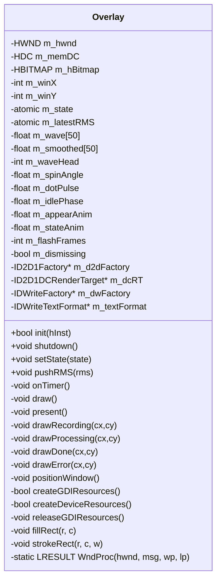

**Diagram sources**
- [overlay.h](file://src/overlay.h#L18-L94)
- [overlay.cpp](file://src/overlay.cpp#L29-L74)

**Section sources**
- [overlay.h](file://src/overlay.h#L18-L94)
- [overlay.cpp](file://src/overlay.cpp#L29-L74)
- [overlay.cpp](file://src/overlay.cpp#L126-L135)
- [overlay.cpp](file://src/overlay.cpp#L140-L158)
- [overlay.cpp](file://src/overlay.cpp#L184-L256)
- [overlay.cpp](file://src/overlay.cpp#L261-L269)
- [overlay.cpp](file://src/overlay.cpp#L274-L372)
- [overlay.cpp](file://src/overlay.cpp#L377-L466)
- [overlay.cpp](file://src/overlay.cpp#L471-L537)
- [overlay.cpp](file://src/overlay.cpp#L542-L591)
- [overlay.cpp](file://src/overlay.cpp#L596-L620)
- [overlay.cpp](file://src/overlay.cpp#L625-L643)
- [overlay.cpp](file://src/overlay.cpp#L648-L656)

### Audio Manager: Real-Time RMS Feeding
The audio manager captures microphone data at 16 kHz mono, maintains a lock-free ring buffer, computes RMS for the latest chunk, and exposes it atomically. The overlay reads this value to drive the waveform visualization.

Key points:
- Callback runs on a time-critical thread; RMS is stored atomically for safe access from the overlay thread
- The overlay’s pushRMS is a single atomic store from the audio thread
- The audio thread may also forward captured frames to a registered callback

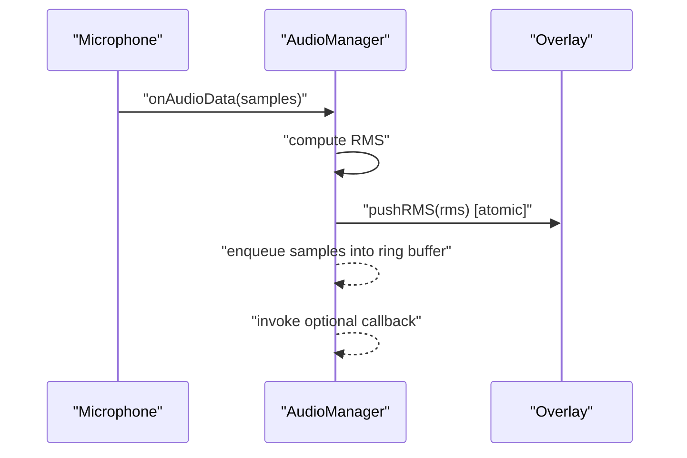

**Diagram sources**
- [audio_manager.cpp](file://src/audio_manager.cpp#L39-L56)
- [audio_manager.cpp](file://src/audio_manager.cpp#L58-L81)
- [overlay.cpp](file://src/overlay.cpp#L160-L163)

**Section sources**
- [audio_manager.h](file://src/audio_manager.h#L9-L42)
- [audio_manager.cpp](file://src/audio_manager.cpp#L39-L56)
- [audio_manager.cpp](file://src/audio_manager.cpp#L58-L81)
- [overlay.cpp](file://src/overlay.cpp#L160-L163)

### Main Application: State Machine and Message Flow
The main application controls the overlay state transitions:
- Recording: overlay switches to Recording and starts capturing audio
- Processing: overlay switches to Processing after stopping capture
- Done/Error: overlay switches to Done or Error depending on transcription outcome

Messages:
- WM_START_TRANSCRIPTION: triggers transcription after recording stops
- WM_TRANSCRIPTION_DONE: posted by transcriber when inference completes

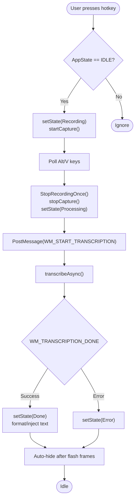

**Diagram sources**
- [main.cpp](file://src/main.cpp#L185-L222)
- [main.cpp](file://src/main.cpp#L244-L274)
- [main.cpp](file://src/main.cpp#L280-L342)
- [overlay.cpp](file://src/overlay.cpp#L140-L158)
- [overlay.cpp](file://src/overlay.cpp#L610-L620)

**Section sources**
- [main.cpp](file://src/main.cpp#L185-L222)
- [main.cpp](file://src/main.cpp#L244-L274)
- [main.cpp](file://src/main.cpp#L280-L342)
- [overlay.cpp](file://src/overlay.cpp#L140-L158)
- [overlay.cpp](file://src/overlay.cpp#L610-L620)

### Transcriber: Asynchronous Inference
The transcriber initializes Whisper with GPU preference and falls back to CPU if needed. It runs inference on a dedicated thread and posts completion messages to the main window.

Highlights:
- Single-flight guard prevents overlapping transcriptions
- Preprocessing: silence trimming and minimal post-processing
- Optimizations: thread count, audio context sizing, greedy decoding parameters
- Completion: posts WM_TRANSCRIPTION_DONE with a heap-allocated string payload

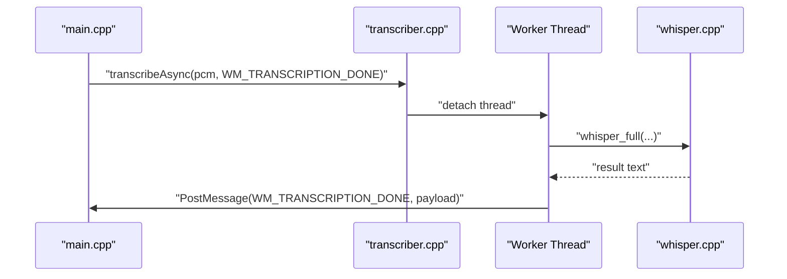

**Diagram sources**
- [transcriber.cpp](file://src/transcriber.cpp#L103-L225)
- [main.cpp](file://src/main.cpp#L244-L274)
- [main.cpp](file://src/main.cpp#L280-L342)

**Section sources**
- [transcriber.h](file://src/transcriber.h#L10-L28)
- [transcriber.cpp](file://src/transcriber.cpp#L79-L93)
- [transcriber.cpp](file://src/transcriber.cpp#L103-L225)
- [main.cpp](file://src/main.cpp#L244-L274)
- [main.cpp](file://src/main.cpp#L280-L342)

### Waveform Visualization: GPU-Accelerated Bars
The recording state draws a series of pill-shaped bars representing RMS levels over time. The visualization includes:
- Ring-buffer of recent RMS samples
- Exponential smoothing per bar
- Idle sine animation at silence
- Edge fade envelope and gradient color mixing
- Pulsing red dot on the left

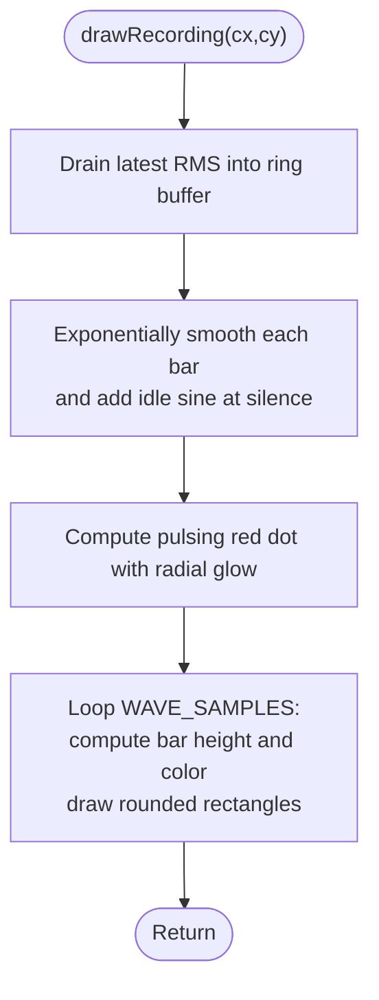

**Diagram sources**
- [overlay.cpp](file://src/overlay.cpp#L274-L372)

**Section sources**
- [overlay.cpp](file://src/overlay.cpp#L274-L372)

### State Indicator Animations
- Processing: spinner arc composed of many small segments with quadratic fade from tail to head; leading edge has a bright radial dot
- Done: green expanding circle with a two-segment checkmark drawn progressively
- Error: red expanding circle with an X symbol

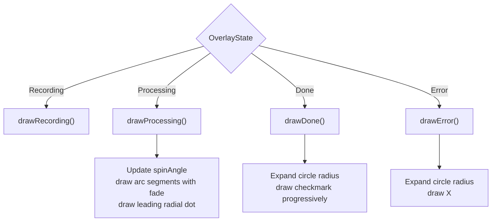

**Diagram sources**
- [overlay.cpp](file://src/overlay.cpp#L247-L252)
- [overlay.cpp](file://src/overlay.cpp#L377-L466)
- [overlay.cpp](file://src/overlay.cpp#L471-L537)
- [overlay.cpp](file://src/overlay.cpp#L542-L591)

**Section sources**
- [overlay.cpp](file://src/overlay.cpp#L377-L466)
- [overlay.cpp](file://src/overlay.cpp#L471-L537)
- [overlay.cpp](file://src/overlay.cpp#L542-L591)

### Overlay Positioning and Automatic Placement
- Default placement centers the overlay horizontally and positions it near the bottom of the primary monitor
- The position is recalculated whenever the overlay becomes visible (transitioning from Hidden)
- There is no explicit X/Y configuration in code; the position is computed from screen metrics

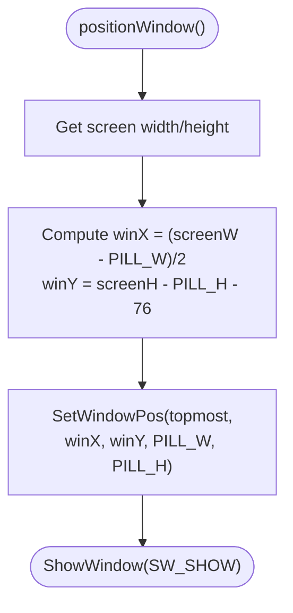

**Diagram sources**
- [overlay.cpp](file://src/overlay.cpp#L126-L135)

**Section sources**
- [overlay.cpp](file://src/overlay.cpp#L126-L135)

### 60fps Rendering Loop and Target Recreation
- Timer interval: approximately 16 ms (~62.5 fps) to approximate 60fps
- WM_TIMER handler calls onTimer, which updates animations, checks auto-hide, and invokes draw
- draw binds the DC render target to the memory DC each frame, clears to transparent, and presents via UpdateLayeredWindow
- Device resources are created with premultiplied alpha format; no special handling for display changes is implemented in the overlay code

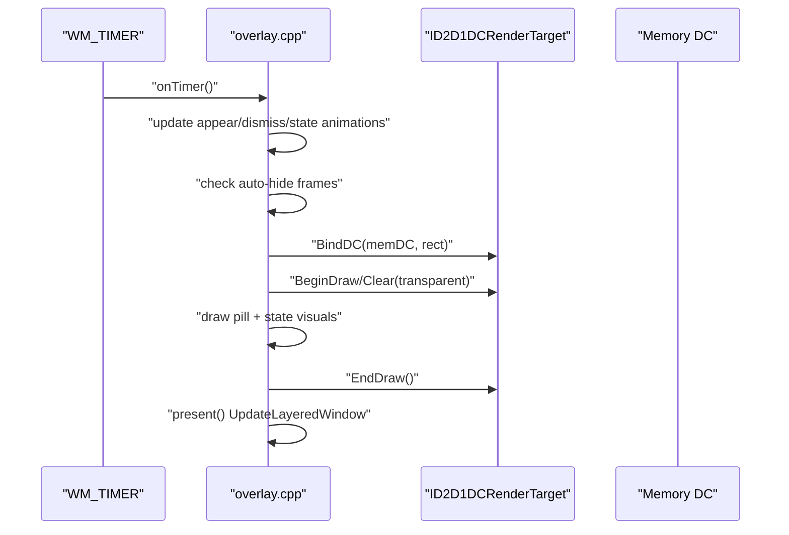

**Diagram sources**
- [overlay.cpp](file://src/overlay.cpp#L17)
- [overlay.cpp](file://src/overlay.cpp#L72)
- [overlay.cpp](file://src/overlay.cpp#L596-L620)
- [overlay.cpp](file://src/overlay.cpp#L192-L194)
- [overlay.cpp](file://src/overlay.cpp#L196-L254)
- [overlay.cpp](file://src/overlay.cpp#L261-L269)

**Section sources**
- [overlay.cpp](file://src/overlay.cpp#L17)
- [overlay.cpp](file://src/overlay.cpp#L72)
- [overlay.cpp](file://src/overlay.cpp#L596-L620)
- [overlay.cpp](file://src/overlay.cpp#L192-L194)
- [overlay.cpp](file://src/overlay.cpp#L196-L254)
- [overlay.cpp](file://src/overlay.cpp#L261-L269)

### Overlay Lifecycle: Creation, Updates, and Auto-Hide
- Creation: init registers window class, creates layered window, GDI and D2D resources, and starts the timer
- Updates: setState toggles appear/dismiss animations and resets state-specific counters; onTimer advances animations and draws
- Auto-hide: Done/Error states trigger a frame counter; when reached, setState transitions to Hidden and hides the window

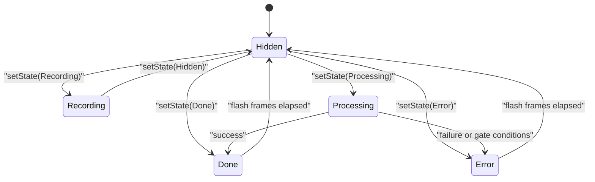

**Diagram sources**
- [overlay.cpp](file://src/overlay.cpp#L140-L158)
- [overlay.cpp](file://src/overlay.cpp#L610-L620)
- [overlay.cpp](file://src/overlay.cpp#L606-L620)

**Section sources**
- [overlay.cpp](file://src/overlay.cpp#L29-L74)
- [overlay.cpp](file://src/overlay.cpp#L140-L158)
- [overlay.cpp](file://src/overlay.cpp#L610-L620)

### Customization Options
- Appearance: colors, radii, bar dimensions, and font are defined as compile-time constants within the overlay class
- Positioning: default centered near the bottom; no runtime configuration for X/Y coordinates
- No runtime settings for overlay geometry or colors are exposed in the configuration subsystem

**Section sources**
- [overlay.h](file://src/overlay.h#L30-L71)
- [overlay.cpp](file://src/overlay.cpp#L126-L135)
- [config_manager.h](file://src/config_manager.h#L8-L19)
- [config_manager.cpp](file://src/config_manager.cpp#L24-L58)

## Dependency Analysis
- Overlay depends on Direct2D and DirectWrite libraries and uses UpdateLayeredWindow for presentation
- Audio Manager depends on miniaudio and a lock-free queue for buffering
- Main application integrates Overlay, Audio Manager, and Transcriber via window messages
- Dashboard and configuration are separate subsystems with no overlay dependencies

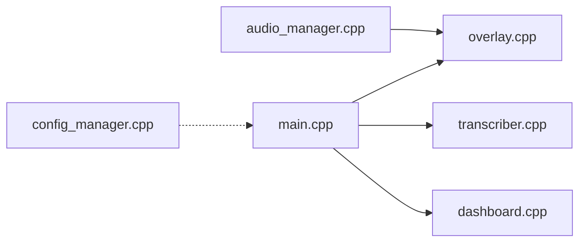

**Diagram sources**
- [overlay.cpp](file://src/overlay.cpp#L29-L74)
- [audio_manager.cpp](file://src/audio_manager.cpp#L39-L56)
- [main.cpp](file://src/main.cpp#L149-L357)
- [transcriber.cpp](file://src/transcriber.cpp#L103-L225)
- [dashboard.cpp](file://src/dashboard.cpp#L90-L113)
- [config_manager.cpp](file://src/config_manager.cpp#L24-L58)

**Section sources**
- [overlay.cpp](file://src/overlay.cpp#L29-L74)
- [audio_manager.cpp](file://src/audio_manager.cpp#L39-L56)
- [main.cpp](file://src/main.cpp#L149-L357)
- [transcriber.cpp](file://src/transcriber.cpp#L103-L225)
- [dashboard.cpp](file://src/dashboard.cpp#L90-L113)
- [config_manager.cpp](file://src/config_manager.cpp#L24-L58)

## Performance Considerations
- Rendering cadence: ~60fps via WM_TIMER at ~16 ms intervals
- GPU acceleration: Direct2D DC render target leverages GPU; premultiplied alpha reduces blending overhead
- Minimal work per frame: overlay draws only when visible or dismissing; clears to transparent and draws state visuals
- Audio thread safety: RMS updates are atomic stores; overlay reads are relaxed loads
- Transcription performance: transcriber configures threading and decoding parameters to maximize throughput; GPU fallback is supported
- Potential improvements: batching Direct2D brush creation, caching text layouts, and deferring heavy gradients when unnecessary

[No sources needed since this section provides general guidance]

## Troubleshooting Guide
- Overlay fails to initialize: ensure Direct2D support and proper window class registration; overlay initialization returns failure when Direct2D factory or resources fail
- No audio levels: verify microphone permissions and that Audio Manager initialized successfully; RMS is exposed atomically for the overlay
- Transcription errors: check for dropped samples and minimum recording length gates; overlay switches to Error state accordingly
- Tray icon and messages: ensure the hidden message window is created and hotkeys are registered; tray icon reflects current state

**Section sources**
- [overlay.cpp](file://src/overlay.cpp#L29-L74)
- [audio_manager.cpp](file://src/audio_manager.cpp#L58-L81)
- [main.cpp](file://src/main.cpp#L436-L444)
- [main.cpp](file://src/main.cpp#L254-L264)

## Conclusion
The visual feedback system delivers a responsive, GPU-accelerated overlay with smooth animations and accurate real-time audio visualization. Its design centers on a lightweight rendering loop, atomic state updates, and clear separation of concerns between audio capture, inference, and presentation. While customization is limited to compile-time constants, the system provides a robust foundation for consistent user feedback during speech-to-text workflows.

[No sources needed since this section summarizes without analyzing specific files]

## Appendices

### Appendix A: Icons and Resources
- Tray icons are defined for idle and recording states; loaded dynamically by the main application
- These resources are used to reflect overlay state in the system tray

**Section sources**
- [Resource.h](file://Resource.h#L13-L19)
- [main.cpp](file://src/main.cpp#L79-L86)
- [main.cpp](file://src/main.cpp#L425-L431)