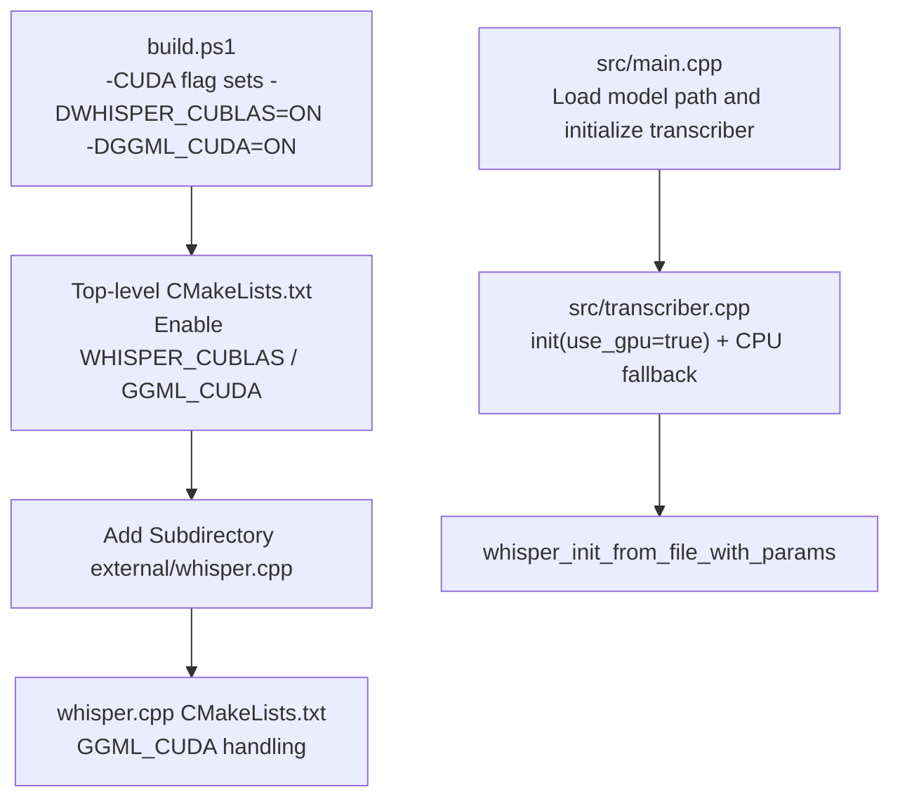
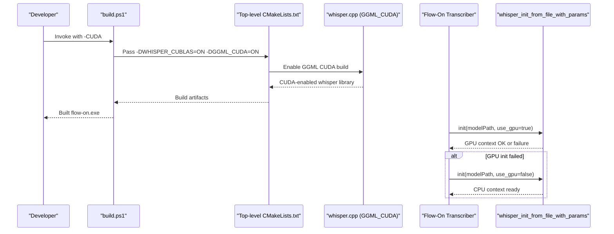
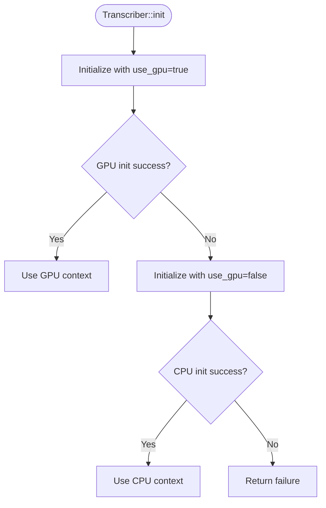
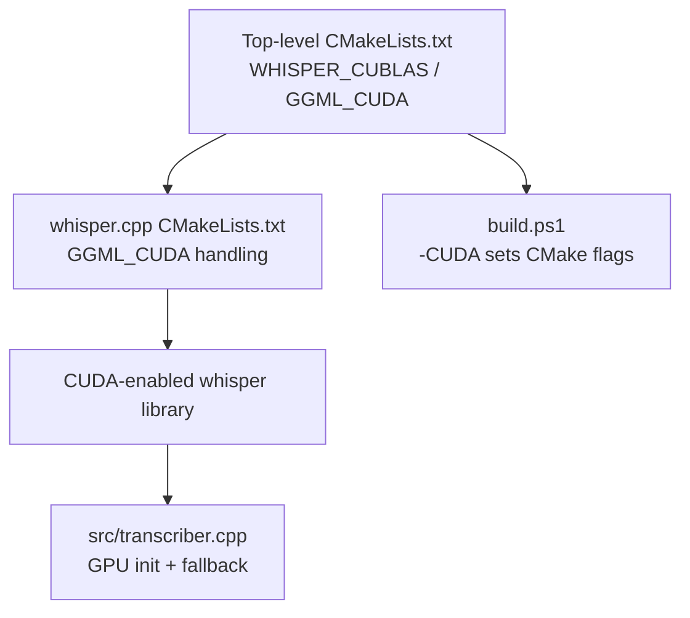

# GPU Acceleration

<cite>
**Referenced Files in This Document**
- [CMakeLists.txt](file://CMakeLists.txt)
- [build.ps1](file://build.ps1)
- [README.md](file://README.md)
- [PERFORMANCE.md](file://PERFORMANCE.md)
- [src/transcriber.cpp](file://src/transcriber.cpp)
- [src/transcriber.h](file://src/transcriber.h)
- [src/main.cpp](file://src/main.cpp)
- [external/whisper.cpp/CMakeLists.txt](file://external/whisper.cpp/CMakeLists.txt)
- [external/whisper.cpp/examples/cli/cli.cpp](file://external/whisper.cpp/examples/cli/cli.cpp)
</cite>

## Table of Contents
1. [Introduction](#introduction)
2. [Project Structure](#project-structure)
3. [Core Components](#core-components)
4. [Architecture Overview](#architecture-overview)
5. [Detailed Component Analysis](#detailed-component-analysis)
6. [Dependency Analysis](#dependency-analysis)
7. [Performance Considerations](#performance-considerations)
8. [Troubleshooting Guide](#troubleshooting-guide)
9. [Conclusion](#conclusion)
10. [Appendices](#appendices)

## Introduction
This document explains how Flow-On integrates GPU acceleration using NVIDIA CUDA with the whisper.cpp backend. It covers hardware requirements, CUDA setup, cuBLAS integration, memory management between CPU and GPU, automatic fallback to CPU, performance expectations, and troubleshooting guidance. The goal is to help users enable and validate GPU acceleration for faster transcription on supported NVIDIA GPUs.

## Project Structure
Flow-On’s GPU acceleration relies on:
- Top-level CMake configuration enabling CUDA flags for whisper.cpp
- A build orchestration script that passes CUDA flags to CMake
- The Transcriber component initializing Whisper with GPU enabled and falling back to CPU if needed
- The whisper.cpp submodule supporting CUDA via GGML and cuBLAS

**Diagram sources**
- [CMakeLists.txt](file://CMakeLists.txt#L48-L51)
- [external/whisper.cpp/CMakeLists.txt](file://external/whisper.cpp/CMakeLists.txt#L112-L128)
- [build.ps1](file://build.ps1#L44-L52)
- [src/transcriber.cpp](file://src/transcriber.cpp#L79-L93)
- [src/main.cpp](file://src/main.cpp#L462-L475)

**Section sources**
- [CMakeLists.txt](file://CMakeLists.txt#L48-L51)
- [build.ps1](file://build.ps1#L44-L52)
- [src/transcriber.cpp](file://src/transcriber.cpp#L79-L93)
- [src/main.cpp](file://src/main.cpp#L462-L475)

## Core Components
- CMake configuration toggles CUDA flags for the whisper.cpp build.
- The build script conditionally enables CUDA via CMake generator options.
- The Transcriber initializes Whisper with GPU enabled and retries on CPU if initialization fails.
- The CLI example demonstrates GPU usage and device selection.

Key implementation references:
- Enabling CUDA flags in top-level CMake: [CMakeLists.txt](file://CMakeLists.txt#L48-L51)
- Build script passing CUDA flags: [build.ps1](file://build.ps1#L44-L52)
- Transcriber GPU initialization and fallback: [src/transcriber.cpp](file://src/transcriber.cpp#L79-L93)
- CLI GPU toggle and device selection: [external/whisper.cpp/examples/cli/cli.cpp](file://external/whisper.cpp/examples/cli/cli.cpp#L78-L80), [external/whisper.cpp/examples/cli/cli.cpp](file://external/whisper.cpp/examples/cli/cli.cpp#L202-L205)

**Section sources**
- [CMakeLists.txt](file://CMakeLists.txt#L48-L51)
- [build.ps1](file://build.ps1#L44-L52)
- [src/transcriber.cpp](file://src/transcriber.cpp#L79-L93)
- [external/whisper.cpp/examples/cli/cli.cpp](file://external/whisper.cpp/examples/cli/cli.cpp#L78-L80)
- [external/whisper.cpp/examples/cli/cli.cpp](file://external/whisper.cpp/examples/cli/cli.cpp#L202-L205)

## Architecture Overview
The GPU acceleration pipeline integrates at build time and runtime:

**Diagram sources**
- [build.ps1](file://build.ps1#L44-L52)
- [CMakeLists.txt](file://CMakeLists.txt#L48-L51)
- [external/whisper.cpp/CMakeLists.txt](file://external/whisper.cpp/CMakeLists.txt#L112-L128)
- [src/transcriber.cpp](file://src/transcriber.cpp#L79-L93)

## Detailed Component Analysis

### Hardware Requirements
- Minimum GPU: NVIDIA RTX 3060 or better recommended for significant speedup.
- Software prerequisites:
  - CUDA Toolkit 12.x installed on the development machine.
  - Visual Studio 2022 with CMake and PowerShell as per project prerequisites.

References:
- Performance guidance mentions RTX 3060 or better: [PERFORMANCE.md](file://PERFORMANCE.md#L138-L141)
- Project prerequisites include Visual Studio 2022 and CMake: [README.md](file://README.md#L17-L21)

**Section sources**
- [PERFORMANCE.md](file://PERFORMANCE.md#L138-L141)
- [README.md](file://README.md#L17-L21)

### CUDA Setup Process
- Install CUDA Toolkit 12.x from NVIDIA.
- Enable CUDA flags in the top-level CMake configuration by uncommenting the relevant lines.
- Rebuild using the build script with the -CUDA flag.

References:
- CUDA setup steps and expected performance: [PERFORMANCE.md](file://PERFORMANCE.md#L78-L88)
- Top-level CMake flags for CUDA: [CMakeLists.txt](file://CMakeLists.txt#L48-L51)
- Build script -CUDA flag handling: [build.ps1](file://build.ps1#L13-L52)

**Section sources**
- [PERFORMANCE.md](file://PERFORMANCE.md#L78-L88)
- [CMakeLists.txt](file://CMakeLists.txt#L48-L51)
- [build.ps1](file://build.ps1#L13-L52)

### cuBLAS Integration and Memory Management
- cuBLAS integration is enabled via GGML CUDA flags passed to the whisper.cpp build.
- The Transcriber initializes Whisper with GPU enabled and falls back to CPU if GPU initialization fails.
- Whisper manages GPU memory internally; Flow-On passes PCM audio from CPU memory to the Whisper context for processing.

References:
- GGML CUDA flags and deprecation handling: [external/whisper.cpp/CMakeLists.txt](file://external/whisper.cpp/CMakeLists.txt#L112-L128)
- Transcriber GPU init and fallback: [src/transcriber.cpp](file://src/transcriber.cpp#L79-L93)

**Section sources**
- [external/whisper.cpp/CMakeLists.txt](file://external/whisper.cpp/CMakeLists.txt#L112-L128)
- [src/transcriber.cpp](file://src/transcriber.cpp#L79-L93)

### Automatic Fallback to CPU
- The Transcriber attempts GPU initialization first; if it fails, it retries with GPU disabled (CPU).
- This behavior ensures robust operation across diverse environments.

**Diagram sources**
- [src/transcriber.cpp](file://src/transcriber.cpp#L79-L93)

**Section sources**
- [src/transcriber.cpp](file://src/transcriber.cpp#L79-L93)

### Runtime GPU Control and Device Selection
- The CLI example demonstrates enabling/disabling GPU and selecting a GPU device via command-line options.
- These patterns illustrate how GPU usage and device selection are exposed in the underlying library.

References:
- Default GPU enablement and device selection in CLI: [external/whisper.cpp/examples/cli/cli.cpp](file://external/whisper.cpp/examples/cli/cli.cpp#L78-L80)
- Disabling GPU via CLI flag: [external/whisper.cpp/examples/cli/cli.cpp](file://external/whisper.cpp/examples/cli/cli.cpp#L202-L205)

**Section sources**
- [external/whisper.cpp/examples/cli/cli.cpp](file://external/whisper.cpp/examples/cli/cli.cpp#L78-L80)
- [external/whisper.cpp/examples/cli/cli.cpp](file://external/whisper.cpp/examples/cli/cli.cpp#L202-L205)

## Dependency Analysis
The GPU acceleration depends on:
- Top-level CMake flags enabling GGML CUDA and cuBLAS.
- The whisper.cpp submodule honoring these flags.
- The Transcriber component invoking GPU-capable Whisper APIs and handling failures.

**Diagram sources**
- [CMakeLists.txt](file://CMakeLists.txt#L48-L51)
- [external/whisper.cpp/CMakeLists.txt](file://external/whisper.cpp/CMakeLists.txt#L112-L128)
- [build.ps1](file://build.ps1#L44-L52)
- [src/transcriber.cpp](file://src/transcriber.cpp#L79-L93)

**Section sources**
- [CMakeLists.txt](file://CMakeLists.txt#L48-L51)
- [external/whisper.cpp/CMakeLists.txt](file://external/whisper.cpp/CMakeLists.txt#L112-L128)
- [build.ps1](file://build.ps1#L44-L52)
- [src/transcriber.cpp](file://src/transcriber.cpp#L79-L93)

## Performance Considerations
- Expected speedup: 5–10x with NVIDIA RTX 3060 or better using the base.en model.
- Typical transcription time: 3–5 seconds for 30 seconds of audio with base.en on GPU.
- The Transcriber is tuned for throughput with reduced context, disabled timestamps, and greedy decoding to maximize speed.

References:
- Performance expectations and model sizes: [PERFORMANCE.md](file://PERFORMANCE.md#L67-L88)
- Transcriber optimizations impacting speed: [src/transcriber.cpp](file://src/transcriber.cpp#L138-L178)

**Section sources**
- [PERFORMANCE.md](file://PERFORMANCE.md#L67-L88)
- [src/transcriber.cpp](file://src/transcriber.cpp#L138-L178)

## Troubleshooting Guide
Common issues and resolutions:
- CUDA Toolkit not installed or incompatible:
  - Ensure CUDA Toolkit 12.x is installed and visible to the build environment.
  - Re-run the build with the -CUDA flag after installation.
- Driver compatibility:
  - Confirm GPU drivers support the CUDA version used for building.
- GPU not detected or initialization fails:
  - The Transcriber automatically falls back to CPU; check logs or UI feedback.
  - Verify the model file exists and is accessible.
- Performance verification:
  - Use the benchmarking guidance to measure transcription time and real-time factor.
  - Adjust model size or threading if needed.

References:
- Build script -CUDA flag and CMake flag propagation: [build.ps1](file://build.ps1#L44-L52)
- Transcriber fallback behavior: [src/transcriber.cpp](file://src/transcriber.cpp#L87-L91)
- Model presence and download guidance: [README.md](file://README.md#L25-L37)
- Benchmarking guidance: [PERFORMANCE.md](file://PERFORMANCE.md#L170-L182)

**Section sources**
- [build.ps1](file://build.ps1#L44-L52)
- [src/transcriber.cpp](file://src/transcriber.cpp#L87-L91)
- [README.md](file://README.md#L25-L37)
- [PERFORMANCE.md](file://PERFORMANCE.md#L170-L182)

## Conclusion
Enabling GPU acceleration in Flow-On is straightforward: install CUDA Toolkit 12.x, enable the CUDA flags in the build configuration, and rebuild with the -CUDA flag. The Transcriber automatically attempts GPU initialization and falls back to CPU if needed. With an RTX 3060 or better, expect 5–10x speedup and sub-5-second transcription times for 30 seconds of audio using the base.en model. Use the provided troubleshooting and benchmarking guidance to validate performance and resolve issues.

## Appendices

### Quick Setup Checklist
- Install CUDA Toolkit 12.x.
- Uncomment the CUDA flags in the top-level CMake configuration.
- Rebuild with the build script using the -CUDA flag.
- Verify GPU initialization and performance.

References:
- CUDA setup steps: [PERFORMANCE.md](file://PERFORMANCE.md#L78-L88)
- CMake flags: [CMakeLists.txt](file://CMakeLists.txt#L48-L51)
- Build script -CUDA: [build.ps1](file://build.ps1#L44-L52)

**Section sources**
- [PERFORMANCE.md](file://PERFORMANCE.md#L78-L88)
- [CMakeLists.txt](file://CMakeLists.txt#L48-L51)
- [build.ps1](file://build.ps1#L44-L52)