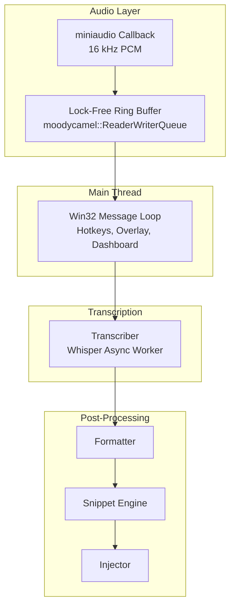
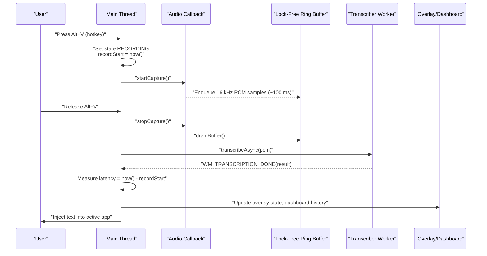
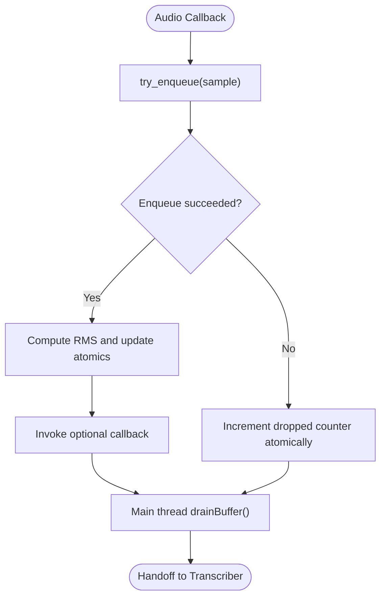
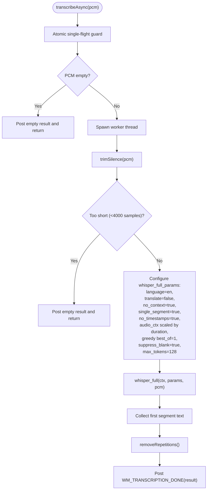
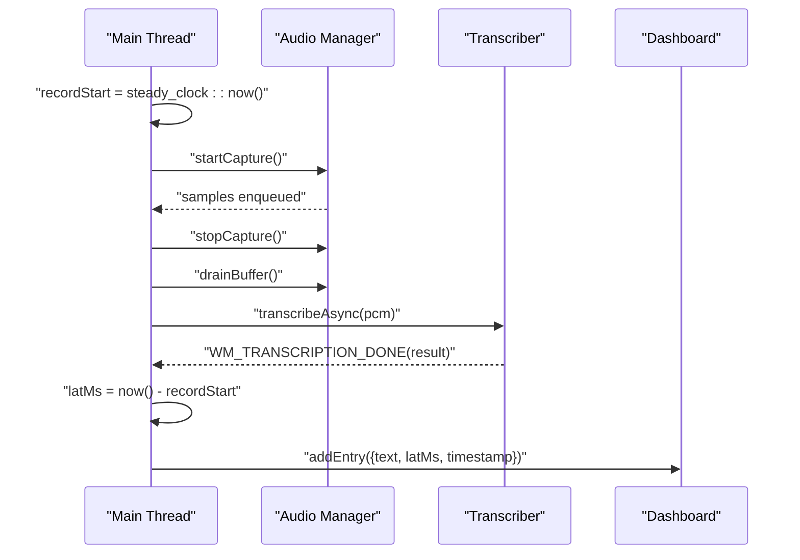
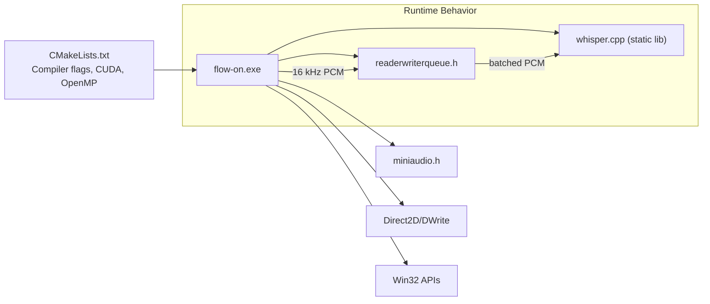

# Latency Optimization

<cite>
**Referenced Files in This Document**
- [README.md](file://README.md)
- [PERFORMANCE.md](file://PERFORMANCE.md)
- [CMakeLists.txt](file://CMakeLists.txt)
- [src/main.cpp](file://src/main.cpp)
- [src/audio_manager.h](file://src/audio_manager.h)
- [src/audio_manager.cpp](file://src/audio_manager.cpp)
- [src/transcriber.h](file://src/transcriber.h)
- [src/transcriber.cpp](file://src/transcriber.cpp)
- [external/readerwriterqueue.h](file://external/readerwriterqueue.h)
- [src/overlay.h](file://src/overlay.h)
- [src/dashboard.h](file://src/dashboard.h)
- [src/config_manager.h](file://src/config_manager.h)
- [src/formatter.h](file://src/formatter.h)
- [src/injector.h](file://src/injector.h)
</cite>

## Table of Contents
1. [Introduction](#introduction)
2. [Project Structure](#project-structure)
3. [Core Components](#core-components)
4. [Architecture Overview](#architecture-overview)
5. [Detailed Component Analysis](#detailed-component-analysis)
6. [Dependency Analysis](#dependency-analysis)
7. [Performance Considerations](#performance-considerations)
8. [Troubleshooting Guide](#troubleshooting-guide)
9. [Conclusion](#conclusion)
10. [Appendices](#appendices)

## Introduction
This document explains how Flow-On achieves low-latency real-time speech-to-text on Windows. It documents current latency characteristics, the specific optimizations applied, the lock-free audio pipeline, multi-threading strategy, and practical measurement techniques. It also provides guidelines for identifying bottlenecks, balancing latency and accuracy, and recommendations for different use cases.

## Project Structure
Flow-On is a Windows desktop application composed of:
- A Win32 message-loop main thread for UI, hotkeys, overlay, and transcription coordination
- A miniaudio-driven audio callback thread for 16 kHz PCM capture
- A lock-free ring buffer for zero-blocking audio transfer
- A Whisper transcription worker thread for offline STT
- Formatting, snippet expansion, and text injection stages

**Diagram sources**
- [src/main.cpp](file://src/main.cpp#L149-L357)
- [src/audio_manager.cpp](file://src/audio_manager.cpp#L30-L56)
- [src/transcriber.cpp](file://src/transcriber.cpp#L103-L225)
- [external/readerwriterqueue.h](file://external/readerwriterqueue.h#L22-L34)

**Section sources**
- [README.md](file://README.md#L69-L124)
- [src/main.cpp](file://src/main.cpp#L149-L357)
- [src/audio_manager.cpp](file://src/audio_manager.cpp#L30-L56)
- [src/transcriber.cpp](file://src/transcriber.cpp#L103-L225)
- [external/readerwriterqueue.h](file://external/readerwriterqueue.h#L22-L34)

## Core Components
- Audio capture and buffering: 16 kHz mono PCM capture with a lock-free ring buffer to eliminate blocking between audio callback and main thread.
- Transcriber: Asynchronous Whisper invocation with aggressive speed optimizations tuned for dictation workflows.
- Main thread orchestration: Hotkey state machine, latency measurement, UI feedback, and text injection.
- Overlay and dashboard: Visual feedback and latency history.

Key latency characteristics (from project documentation):
- Audio capture latency: ~100 ms (miniaudio callback period)
- Transcription processing time: ~12–18 s for 30 s of audio (tiny.en model, CPU AVX2)
- Total system latency: measured end-to-end in the main thread and recorded in the dashboard

Trade-offs and tunables:
- Model choice: tiny.en (fast) vs base.en (slower, higher accuracy)
- GPU acceleration: optional CUDA for 5–10× speedup
- CPU threading: all cores vs reserving 1–2 cores for UI smoothness
- Timestamp generation: disabled for dictation workflows
- Audio context: reduced from default 1500 to 512 frames for speed
- Single-segment mode: enabled for dictation

**Section sources**
- [README.md](file://README.md#L305-L325)
- [PERFORMANCE.md](file://PERFORMANCE.md#L1-L196)
- [src/main.cpp](file://src/main.cpp#L310-L340)
- [src/transcriber.cpp](file://src/transcriber.cpp#L138-L186)

## Architecture Overview
The system uses a lock-free audio pipeline and asynchronous transcription to minimize latency. The main thread measures total latency from hotkey press to text injection and records it in the dashboard.

**Diagram sources**
- [src/main.cpp](file://src/main.cpp#L185-L274)
- [src/audio_manager.cpp](file://src/audio_manager.cpp#L83-L111)
- [src/transcriber.cpp](file://src/transcriber.cpp#L103-L225)
- [src/overlay.h](file://src/overlay.h#L18-L28)
- [src/dashboard.h](file://src/dashboard.h#L23-L34)

## Detailed Component Analysis

### Lock-Free Audio Pipeline
- The audio callback runs at ~100 ms intervals and enqueues PCM samples into a lock-free ring buffer.
- The main thread drains the buffer on hotkey release and hands off to the transcription worker.
- The ring buffer is designed for single-producer/single-consumer and is wait-free on the common path.

**Diagram sources**
- [src/audio_manager.cpp](file://src/audio_manager.cpp#L39-L56)
- [src/audio_manager.cpp](file://src/audio_manager.cpp#L102-L111)
- [external/readerwriterqueue.h](file://external/readerwriterqueue.h#L22-L34)

**Section sources**
- [src/audio_manager.cpp](file://src/audio_manager.cpp#L39-L56)
- [src/audio_manager.cpp](file://src/audio_manager.cpp#L102-L111)
- [external/readerwriterqueue.h](file://external/readerwriterqueue.h#L22-L34)

### Transcriber: Asynchronous Whisper with Aggressive Speed Optimizations
- Initialization attempts GPU first, falls back to CPU silently.
- Asynchronous transcription with a single-flight guard to prevent overlapping work.
- Speed-focused parameters:
  - Model: tiny.en
  - No timestamps, single segment, minimal context
  - Greedy decoding with early repetition detection
  - CPU threads reserved for UI (hardware_concurrency - 1) by default
  - Additional trimming of silence to reduce compute

**Diagram sources**
- [src/transcriber.cpp](file://src/transcriber.cpp#L103-L225)
- [src/transcriber.cpp](file://src/transcriber.cpp#L17-L46)

**Section sources**
- [src/transcriber.cpp](file://src/transcriber.cpp#L79-L101)
- [src/transcriber.cpp](file://src/transcriber.cpp#L103-L225)
- [src/transcriber.h](file://src/transcriber.h#L10-L28)

### Main Thread: Latency Measurement and State Coordination
- Records the start time on hotkey press.
- On transcription completion, computes elapsed milliseconds and stores it in the dashboard history.
- Manages overlay state transitions and UI feedback.

**Diagram sources**
- [src/main.cpp](file://src/main.cpp#L193-L197)
- [src/main.cpp](file://src/main.cpp#L244-L274)
- [src/main.cpp](file://src/main.cpp#L310-L340)
- [src/dashboard.h](file://src/dashboard.h#L23-L34)

**Section sources**
- [src/main.cpp](file://src/main.cpp#L193-L197)
- [src/main.cpp](file://src/main.cpp#L244-L274)
- [src/main.cpp](file://src/main.cpp#L310-L340)
- [src/dashboard.h](file://src/dashboard.h#L23-L34)

### Overlay and UI Responsiveness
- Overlay renders at ~60 Hz using a Direct2D timer on the main thread.
- RMS updates are pushed atomically from the audio callback to avoid contention.
- UI remains responsive by keeping the audio callback minimal and delegating heavy work to worker threads.

**Section sources**
- [src/overlay.h](file://src/overlay.h#L18-L28)
- [src/audio_manager.cpp](file://src/audio_manager.cpp#L39-L56)
- [README.md](file://README.md#L377-L381)

## Dependency Analysis
- Build and runtime dependencies emphasize speed: AVX2, fast math, OpenMP, and optional CUDA.
- The transcriber depends on whisper.cpp; the audio layer depends on miniaudio and moodycamel’s queue.
- The main thread coordinates all subsystems via Windows messages.

**Diagram sources**
- [CMakeLists.txt](file://CMakeLists.txt#L10-L22)
- [CMakeLists.txt](file://CMakeLists.txt#L33-L51)
- [CMakeLists.txt](file://CMakeLists.txt#L84-L94)

**Section sources**
- [CMakeLists.txt](file://CMakeLists.txt#L10-L22)
- [CMakeLists.txt](file://CMakeLists.txt#L33-L51)
- [CMakeLists.txt](file://CMakeLists.txt#L84-L94)

## Performance Considerations
- Model selection: tiny.en prioritizes speed; base.en improves accuracy at ~2x slower speed.
- GPU acceleration: enabling CUDA yields 5–10× speedup on supported hardware.
- CPU threading: using all cores maximizes throughput but may impact UI responsiveness; reserving 1–2 cores can improve smoothness.
- Timestamps: disabling timestamps (~30–40% speed gain) is appropriate for dictation.
- Audio context: reduced context (512 frames) accelerates decoding with minor quality trade-offs.
- Single-segment mode: reduces overhead for short dictation clips.
- Silence trimming: reduces compute on unvoiced regions.

Practical measurement techniques:
- Use the built-in latency measurement in the main thread and inspect the dashboard history for recorded latencyMs.
- Benchmark scripts and guidance are provided in the performance guide.

Recommendations by use case:
- Ultra-speed dictation: keep tiny.en, no timestamps, single segment, reduced audio context, and reserve 1 core for UI.
- Balanced accuracy and speed: enable timestamps, moderate audio context, and consider reserving 1–2 cores.
- Highest accuracy: switch to base.en or larger models; expect longer transcription times.

**Section sources**
- [PERFORMANCE.md](file://PERFORMANCE.md#L1-L196)
- [README.md](file://README.md#L305-L325)
- [src/transcriber.cpp](file://src/transcriber.cpp#L138-L186)
- [src/main.cpp](file://src/main.cpp#L310-L340)

## Troubleshooting Guide
Common causes of increased latency and remedies:
- Low CPU utilization during transcription: verify CPU usage and consider increasing thread count or enabling GPU acceleration.
- Incorrect model size: ensure the tiny.en model is present and not accidentally swapped to a larger model.
- Background interference: close resource-heavy applications and temporarily disable antivirus real-time scanning.
- Missing AVX2 support: confirm CPU instruction set compatibility.
- GPU acceleration not engaged: follow the CUDA setup steps to enable cuBLAS.

Benchmarking:
- Use the provided PowerShell script to measure transcription time and compute real-time factor.

**Section sources**
- [PERFORMANCE.md](file://PERFORMANCE.md#L143-L182)
- [README.md](file://README.md#L326-L341)

## Conclusion
Flow-On achieves low-latency real-time speech-to-text by combining a lock-free audio pipeline, aggressive transcription optimizations, and careful multi-threading. The system prioritizes speed for dictation workflows while offering tunable trade-offs for accuracy and UI responsiveness. The documented techniques and measurements provide a practical foundation for further tuning and diagnostics.

## Appendices

### Latency Breakdown and Measurement
- Audio capture latency: ~100 ms (callback period)
- Transcription processing time: ~12–18 s for 30 s audio (tiny.en)
- Total system latency: measured in the main thread and recorded in the dashboard

Measurement technique:
- The main thread captures a monotonic timestamp on hotkey press and computes elapsed time upon receiving the transcription completion message, storing the result in the dashboard history.

**Section sources**
- [README.md](file://README.md#L305-L325)
- [src/main.cpp](file://src/main.cpp#L310-L340)
- [src/dashboard.h](file://src/dashboard.h#L23-L34)