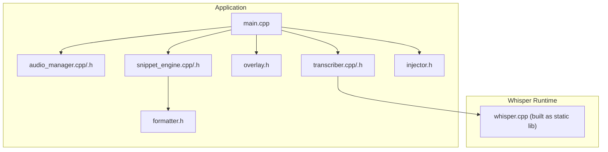
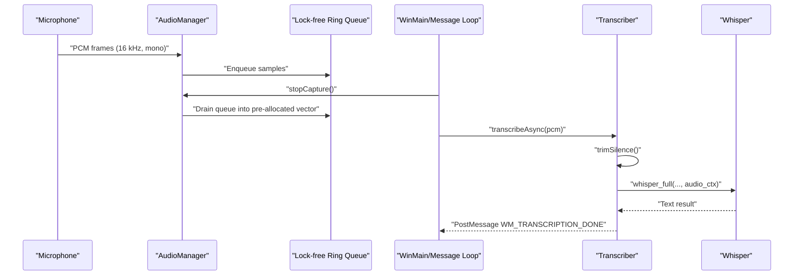
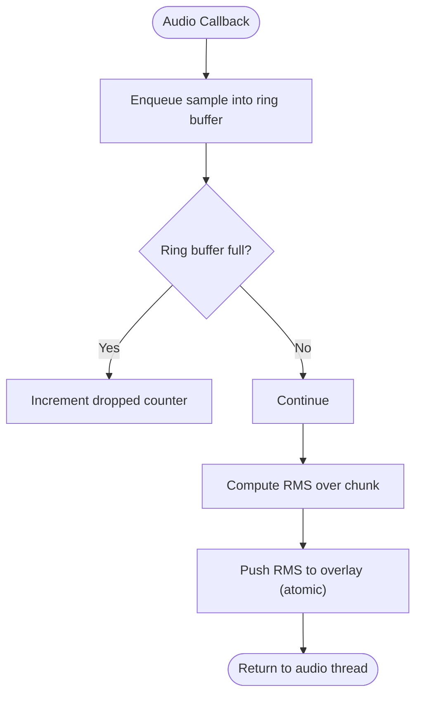
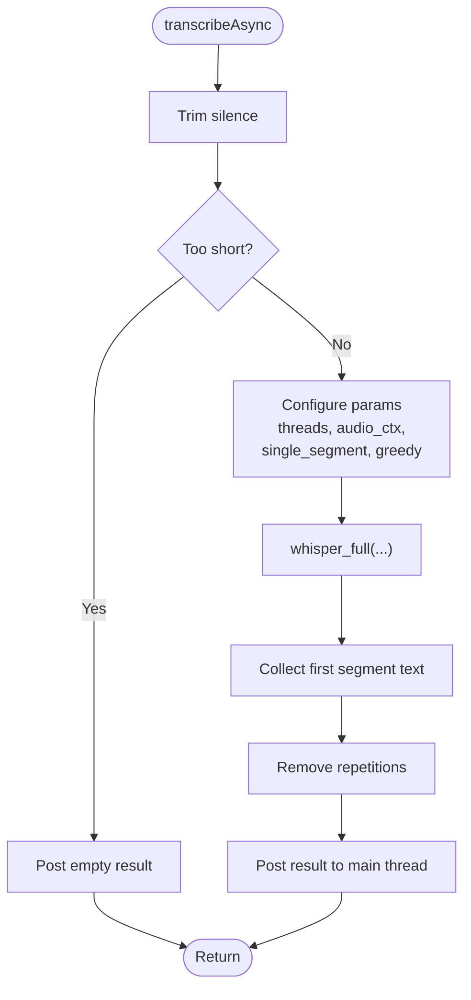
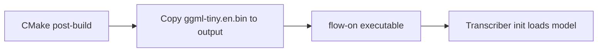
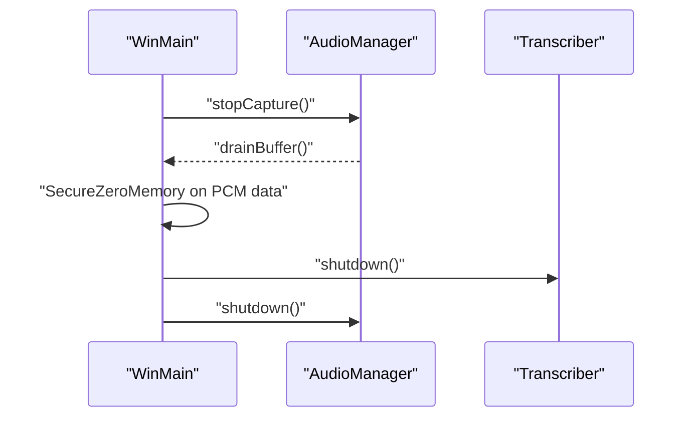
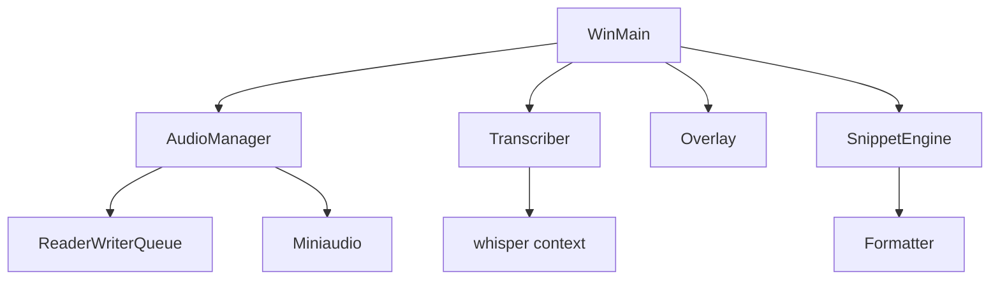

# Memory Management

<cite>
**Referenced Files in This Document**
- [main.cpp](file://src/main.cpp)
- [audio_manager.cpp](file://src/audio_manager.cpp)
- [audio_manager.h](file://src/audio_manager.h)
- [transcriber.cpp](file://src/transcriber.cpp)
- [transcriber.h](file://src/transcriber.h)
- [CMakeLists.txt](file://CMakeLists.txt)
- [download-ggml-model.cmd](file://external/whisper.cpp/models/download-ggml-model.cmd)
- [overlay.h](file://src/overlay.h)
- [snippet_engine.cpp](file://src/snippet_engine.cpp)
- [snippet_engine.h](file://src/snippet_engine.h)
- [injector.h](file://src/injector.h)
- [formatter.h](file://src/formatter.h)
</cite>

## Table of Contents
1. [Introduction](#introduction)
2. [Project Structure](#project-structure)
3. [Core Components](#core-components)
4. [Architecture Overview](#architecture-overview)
5. [Detailed Component Analysis](#detailed-component-analysis)
6. [Dependency Analysis](#dependency-analysis)
7. [Performance Considerations](#performance-considerations)
8. [Troubleshooting Guide](#troubleshooting-guide)
9. [Conclusion](#conclusion)
10. [Appendices](#appendices)

## Introduction
This document focuses on memory management optimization in Flow-On’s resource-constrained environment. It documents current memory footprint expectations, allocation patterns for audio buffers, model loading, and transcription processing, and explains the strategies used to minimize RAM usage. It also covers quantized model loading, circular buffering for audio, zero-copy transfer patterns, pre-allocation and pooling techniques, and the trade-offs between memory and performance. Monitoring, leak prevention, and deployment recommendations for limited-RAM systems are included.

## Project Structure
Flow-On is a Windows desktop application composed of several integrated subsystems:
- Audio capture and buffering pipeline
- Whisper-based transcription engine
- Formatting and snippet expansion
- Overlay rendering and injection into the active application

**Diagram sources**
- [main.cpp](file://src/main.cpp#L1-L521)
- [audio_manager.cpp](file://src/audio_manager.cpp#L1-L122)
- [audio_manager.h](file://src/audio_manager.h#L1-L42)
- [transcriber.cpp](file://src/transcriber.cpp#L1-L226)
- [transcriber.h](file://src/transcriber.h#L1-L29)
- [overlay.h](file://src/overlay.h#L1-L94)
- [snippet_engine.cpp](file://src/snippet_engine.cpp#L1-L82)
- [snippet_engine.h](file://src/snippet_engine.h#L1-L26)
- [injector.h](file://src/injector.h#L1-L9)
- [CMakeLists.txt](file://CMakeLists.txt#L30-L51)

**Section sources**
- [main.cpp](file://src/main.cpp#L1-L521)
- [CMakeLists.txt](file://CMakeLists.txt#L1-L133)

## Core Components
- Audio Manager: Captures 16 kHz mono PCM, enqueues samples into a lock-free ring buffer, and drains them into a pre-allocated vector for transcription.
- Transcriber: Initializes the Whisper model (with GPU preference and fallback), performs preprocessing (silence trimming), and runs transcription with tuned parameters to reduce memory traffic.
- Overlay: Renders UI feedback; not a primary memory consumer but interacts with audio RMS updates.
- Snippet Engine and Formatter: Apply post-processing to transcription results; minimal memory overhead.
- Injector: Pastes or sends keystrokes to the active application; not a memory-intensive component.

Key memory-related responsibilities:
- Pre-allocate and reuse buffers to avoid frequent allocations.
- Use lock-free queues for inter-thread audio data passing.
- Minimize copies by draining and moving vectors.
- Keep model in GPU memory when available; fall back to CPU gracefully.
- Limit audio context to reduce memory footprint during inference.

**Section sources**
- [audio_manager.cpp](file://src/audio_manager.cpp#L1-L122)
- [audio_manager.h](file://src/audio_manager.h#L1-L42)
- [transcriber.cpp](file://src/transcriber.cpp#L1-L226)
- [transcriber.h](file://src/transcriber.h#L1-L29)
- [overlay.h](file://src/overlay.h#L1-L94)
- [snippet_engine.cpp](file://src/snippet_engine.cpp#L1-L82)
- [snippet_engine.h](file://src/snippet_engine.h#L1-L26)
- [injector.h](file://src/injector.h#L1-L9)
- [formatter.h](file://src/formatter.h#L1-L14)

## Architecture Overview
The memory-critical path is the audio-to-transcription pipeline. The audio callback writes PCM samples into a lock-free ring buffer. On stop, the main thread drains the ring into a pre-allocated vector and passes ownership to the transcription worker thread. The Whisper context is initialized once and reused, with parameters tuned to reduce memory usage.

**Diagram sources**
- [audio_manager.cpp](file://src/audio_manager.cpp#L30-L56)
- [audio_manager.cpp](file://src/audio_manager.cpp#L102-L111)
- [transcriber.cpp](file://src/transcriber.cpp#L103-L186)
- [main.cpp](file://src/main.cpp#L244-L274)

## Detailed Component Analysis

### Audio Buffering and Memory Efficiency
- Lock-free ring buffer: A fixed-capacity queue holds up to 30 seconds of 16 kHz mono PCM (480,000 floats). This avoids dynamic reallocation during capture.
- Pre-allocated record buffer: The drain operation moves samples into a pre-reserved vector, enabling a single move operation to avoid copying large PCM arrays.
- Drop detection: Drops are tracked atomically; when the queue overflows, samples are dropped without blocking the audio thread.
- Drain semantics: The drain returns a moved vector, leaving the internal buffer ready for reuse.

**Diagram sources**
- [audio_manager.cpp](file://src/audio_manager.cpp#L30-L56)
- [audio_manager.h](file://src/audio_manager.h#L38-L41)

**Section sources**
- [audio_manager.cpp](file://src/audio_manager.cpp#L18-L22)
- [audio_manager.cpp](file://src/audio_manager.cpp#L58-L81)
- [audio_manager.cpp](file://src/audio_manager.cpp#L83-L94)
- [audio_manager.cpp](file://src/audio_manager.cpp#L102-L111)
- [audio_manager.h](file://src/audio_manager.h#L38-L41)

### Transcription Memory Optimization
- Model initialization: Attempts GPU initialization first; falls back to CPU if unavailable. This leverages VRAM when present, reducing host RAM pressure.
- Preprocessing: Silence trimming reduces effective audio length, lowering memory traffic and inference cost.
- Parameter tuning: Disables timestamps and segments, limits threads to leave one core for UI, and scales audio context dynamically with recording duration.
- Audio context scaling: Uses a maximum context of 512 frames for longer clips, balancing memory and accuracy.
- Single-segment decoding: Ensures minimal intermediate state growth.
- Greedy decoding with repetition detection: Reduces retries and memory churn.

**Diagram sources**
- [transcriber.cpp](file://src/transcriber.cpp#L103-L186)
- [transcriber.cpp](file://src/transcriber.cpp#L186-L225)

**Section sources**
- [transcriber.cpp](file://src/transcriber.cpp#L79-L93)
- [transcriber.cpp](file://src/transcriber.cpp#L103-L186)
- [transcriber.cpp](file://src/transcriber.cpp#L186-L225)
- [transcriber.h](file://src/transcriber.h#L10-L29)

### Model Loading and Quantization
- The application loads a quantized model file (ggml-tiny.en.bin) placed under the models directory. The build system copies the model into the output directory during post-build.
- Quantization reduces model size and can improve performance on CPU-only systems, aligning with memory and speed goals.

**Diagram sources**
- [CMakeLists.txt](file://CMakeLists.txt#L99-L106)
- [main.cpp](file://src/main.cpp#L133-L144)
- [transcriber.cpp](file://src/transcriber.cpp#L79-L93)

**Section sources**
- [CMakeLists.txt](file://CMakeLists.txt#L99-L106)
- [main.cpp](file://src/main.cpp#L133-L144)
- [download-ggml-model.cmd](file://external/whisper.cpp/models/download-ggml-model.cmd#L1-L115)

### Memory-Efficient Strategies
- Quantized model loading: The tiny quantized model is used to minimize memory footprint and accelerate CPU inference.
- Circular buffer and lock-free queue: Prevents blocking and avoids extra copies during capture.
- Pre-allocation and move semantics: The drain operation moves the PCM vector rather than copying it, avoiding temporary allocations.
- Pre-reserving buffers: The record buffer reserves capacity for a full 30-second recording, preventing reallocation spikes.
- GPU preference with CPU fallback: Uses VRAM when available to reduce host RAM usage.
- Reduced audio context: Caps audio context to 512 frames for longer clips, limiting memory during attention computations.

**Section sources**
- [audio_manager.cpp](file://src/audio_manager.cpp#L58-L81)
- [audio_manager.cpp](file://src/audio_manager.cpp#L102-L111)
- [transcriber.cpp](file://src/transcriber.cpp#L157-L163)
- [transcriber.cpp](file://src/transcriber.cpp#L82-L91)

### Trade-offs Between Memory and Performance
- Reduced audio context (up to 512 frames): Lowers peak memory during attention computation and improves throughput on constrained devices, with potential minor accuracy impact for very long utterances.
- Greedy decoding with repetition detection: Faster decoding with fewer fallbacks, trading some robustness for speed and memory efficiency.
- Single-segment inference: Limits intermediate state growth and reduces memory overhead.
- Thread allocation: Reserves one core for UI and OS, balancing responsiveness and transcription throughput.

**Section sources**
- [transcriber.cpp](file://src/transcriber.cpp#L157-L178)

### Monitoring and Leak Prevention
- Memory usage tracking: Use Windows Task Manager or Resource Monitor to observe Working Set and Private Bytes during recording and transcription.
- Leak prevention:
  - The audio drain zeroes the PCM buffer before freeing to avoid sensitive data lingering in memory.
  - Proper shutdown sequence releases audio, transcription context, overlay, and dashboard resources.
  - Heap-allocated result strings posted via Windows messages are deleted by the receiver to prevent leaks.

**Diagram sources**
- [main.cpp](file://src/main.cpp#L507-L517)
- [audio_manager.cpp](file://src/audio_manager.cpp#L102-L111)

**Section sources**
- [main.cpp](file://src/main.cpp#L507-L517)
- [transcriber.cpp](file://src/transcriber.cpp#L95-L101)

### Deployment Scenarios and Recommendations
- Systems with limited RAM:
  - Prefer GPU-enabled builds if supported; otherwise rely on CPU with quantized models.
  - Keep audio context capped at 512 frames for longer clips.
  - Disable non-essential UI features if memory is extremely tight.
- Headless or server-like environments:
  - Use CPU-only builds with quantized models.
  - Reduce thread count further if needed.
- High-throughput desktops:
  - Enable GPU acceleration and consider larger audio contexts for improved accuracy, understanding higher memory usage.

[No sources needed since this section provides general guidance]

## Dependency Analysis
The memory-critical dependencies are:
- Whisper runtime (static library) initialized by Transcriber.
- Miniaudio for audio capture, feeding a lock-free queue.
- Overlay renders UI feedback; interacts with audio RMS updates.
- Snippet engine and formatter operate on small strings; negligible memory impact.

**Diagram sources**
- [audio_manager.cpp](file://src/audio_manager.cpp#L1-L122)
- [transcriber.cpp](file://src/transcriber.cpp#L1-L226)
- [overlay.h](file://src/overlay.h#L1-L94)
- [main.cpp](file://src/main.cpp#L1-L521)

**Section sources**
- [CMakeLists.txt](file://CMakeLists.txt#L30-L51)
- [audio_manager.cpp](file://src/audio_manager.cpp#L1-L122)
- [transcriber.cpp](file://src/transcriber.cpp#L1-L226)
- [overlay.h](file://src/overlay.h#L1-L94)
- [main.cpp](file://src/main.cpp#L1-L521)

## Performance Considerations
- CPU-bound inference: Quantized models and greedy decoding reduce memory bandwidth and speed up inference on CPU-only systems.
- GPU acceleration: When available, VRAM hosting the model lowers host RAM usage and increases throughput.
- Audio context sizing: Dynamic context scaling balances memory and accuracy; 512 frames cap minimizes peak memory.
- Thread scheduling: Leaving one core for UI prevents UI stalls and maintains responsiveness under load.

[No sources needed since this section provides general guidance]

## Troubleshooting Guide
- Audio dropouts or gaps:
  - Check dropped sample counts and adjust capture period or host latency.
  - Verify the ring buffer capacity and enqueue rates.
- High memory usage:
  - Confirm audio context is not exceeding intended limits.
  - Ensure quantized model is being loaded and GPU fallback is not unexpectedly triggered.
- Transcription errors:
  - Verify model path and presence of ggml-tiny.en.bin in the output directory.
  - Check that the Whisper context initializes successfully and falls back to CPU if needed.

**Section sources**
- [audio_manager.cpp](file://src/audio_manager.cpp#L44-L46)
- [transcriber.cpp](file://src/transcriber.cpp#L79-L93)
- [main.cpp](file://src/main.cpp#L462-L475)

## Conclusion
Flow-On employs a suite of memory-conscious techniques: quantized model loading, lock-free audio buffering, pre-allocated and moved PCM transfers, and Whisper parameter tuning to cap memory usage. The design prioritizes responsiveness and stability on constrained systems while maintaining reasonable transcription quality. For deployments with limited RAM, leveraging GPU acceleration, keeping audio context capped, and using quantized models are the most impactful optimizations.

[No sources needed since this section summarizes without analyzing specific files]

## Appendices

### Appendix A: Memory Footprint Estimation
- Typical usage: ~400 MB
- Quantized model (ggml-tiny.en.bin): ~39 MB
- Audio buffer: 30 seconds at 16 kHz mono ≈ 480,000 floats × 4 bytes ≈ 1.9 MB
- Whisper context memory: scales with audio context; capped at 512 frames for longer clips
- Additional overhead: UI, overlays, and auxiliary components

[No sources needed since this section provides general guidance]