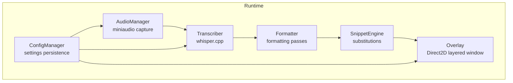
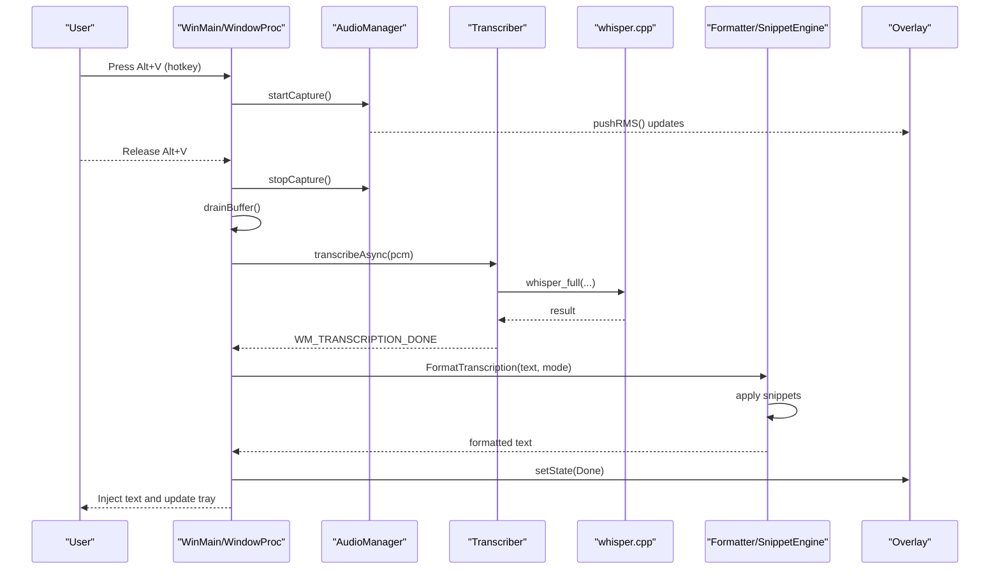
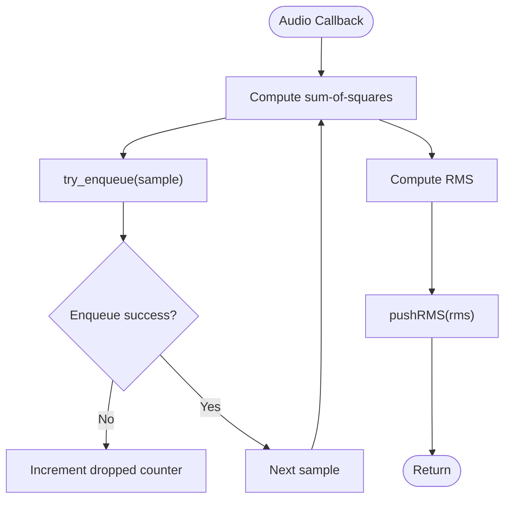
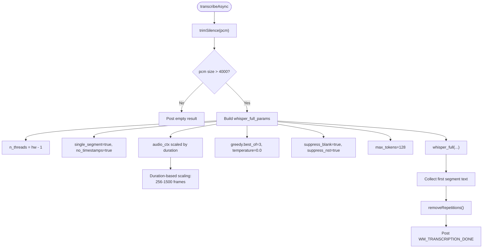
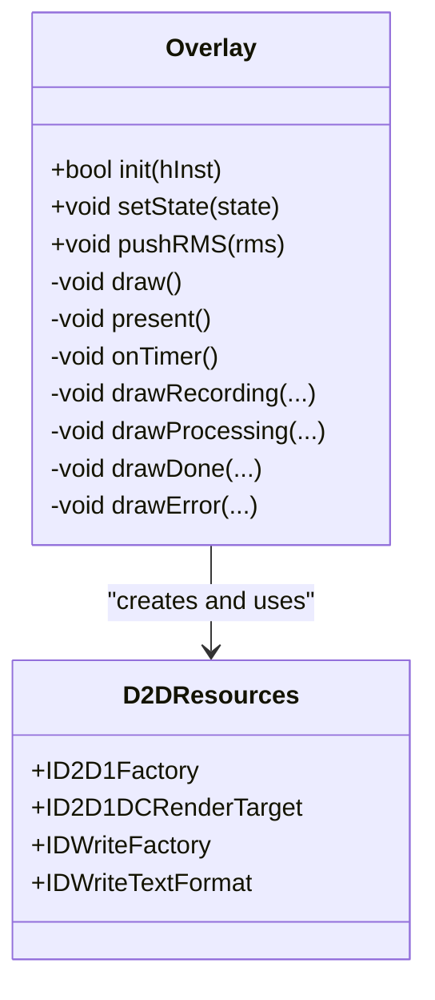
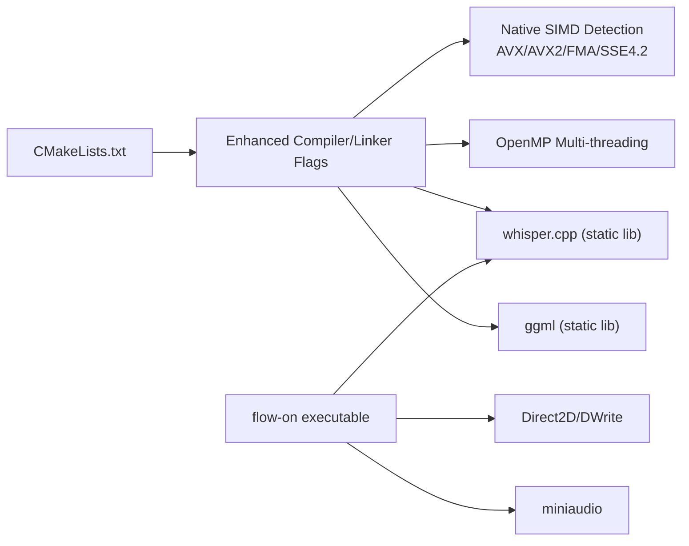

# Performance and Optimization

<cite>
**Referenced Files in This Document**
- [PERFORMANCE.md](file://PERFORMANCE.md)
- [CMakeLists.txt](file://CMakeLists.txt)
- [src/main.cpp](file://src/main.cpp)
- [src/transcriber.cpp](file://src/transcriber.cpp)
- [src/transcriber.h](file://src/transcriber.h)
- [src/audio_manager.cpp](file://src/audio_manager.cpp)
- [src/audio_manager.h](file://src/audio_manager.h)
- [src/overlay.cpp](file://src/overlay.cpp)
- [src/overlay.h](file://src/overlay.h)
- [src/snippet_engine.cpp](file://src/snippet_engine.cpp)
- [src/snippet_engine.h](file://src/snippet_engine.h)
- [src/config_manager.cpp](file://src/config_manager.cpp)
- [src/config_manager.h](file://src/config_manager.h)
- [src/formatter.cpp](file://src/formatter.cpp)
- [src/formatter.h](file://src/formatter.h)
- [assets/settings.default.json](file://assets/settings.default.json)
- [flow-on.vcxproj](file://flow-on.vcxproj)
- [build.ps1](file://build.ps1)
</cite>

## Update Summary
**Changes Made**
- Updated build system optimization section to reflect enhanced compiler flags (/O2, /Oi, /Ot, /fp:fast, /GL, /Gy, /Gw, /OPT:REF, /OPT:ICF)
- Added expanded AVX/AVX2 support documentation with native optimization flags
- Updated audio context scaling algorithms section with refined duration-based scaling
- Enhanced CUDA detection and GPU acceleration configuration documentation
- Added Visual Studio project configuration details for build optimizations

## Table of Contents
1. [Introduction](#introduction)
2. [Project Structure](#project-structure)
3. [Core Components](#core-components)
4. [Architecture Overview](#architecture-overview)
5. [Detailed Component Analysis](#detailed-component-analysis)
6. [Dependency Analysis](#dependency-analysis)
7. [Performance Considerations](#performance-considerations)
8. [Troubleshooting Guide](#troubleshooting-guide)
9. [Conclusion](#conclusion)
10. [Appendices](#appendices)

## Introduction
This document focuses on Flow-On's performance characteristics and optimization strategies. It synthesizes current metrics, optimization techniques, GPU acceleration, threading and memory management, rendering performance, and practical tuning guidelines. The goal is to help users and developers achieve optimal real-time transcription performance on a variety of hardware while understanding the trade-offs between speed and accuracy.

## Project Structure
Flow-On is a Windows desktop application integrating audio capture, real-time transcription, formatting, snippet expansion, and an overlay. The build system integrates whisper.cpp and enables CPU and optional GPU acceleration. The runtime pipeline is event-driven with asynchronous transcription and a Direct2D overlay.

**Diagram sources**
- [src/main.cpp](file://src/main.cpp#L54-L64)
- [src/audio_manager.cpp](file://src/audio_manager.cpp#L58-L81)
- [src/transcriber.cpp](file://src/transcriber.cpp#L79-L93)
- [src/formatter.cpp](file://src/formatter.cpp#L137-L147)
- [src/snippet_engine.cpp](file://src/snippet_engine.cpp#L6-L28)
- [src/overlay.cpp](file://src/overlay.cpp#L29-L74)
- [src/config_manager.cpp](file://src/config_manager.cpp#L24-L58)

**Section sources**
- [src/main.cpp](file://src/main.cpp#L54-L64)
- [CMakeLists.txt](file://CMakeLists.txt#L56-L94)

## Core Components
- Audio capture and buffering: Lock-free ring buffer for zero-blocking capture, periodic RMS updates, and minimal callback work.
- Transcription engine: Whisper.cpp integration with tuned parameters for speed, multi-threading, and optional GPU acceleration.
- Formatting and snippet expansion: Efficient regex-based cleaning and case transformations; snippet replacement.
- Overlay rendering: Direct2D DC render target with UpdateLayeredWindow for smooth, low-latency visuals.
- Configuration: Persistent settings controlling model, GPU usage, and snippets.

**Section sources**
- [src/audio_manager.cpp](file://src/audio_manager.cpp#L39-L56)
- [src/transcriber.cpp](file://src/transcriber.cpp#L103-L225)
- [src/formatter.cpp](file://src/formatter.cpp#L137-L147)
- [src/snippet_engine.cpp](file://src/snippet_engine.cpp#L6-L28)
- [src/overlay.cpp](file://src/overlay.cpp#L184-L256)
- [src/config_manager.cpp](file://src/config_manager.cpp#L24-L58)

## Architecture Overview
The system is structured around a message loop and asynchronous transcription. Audio is captured continuously into a lock-free buffer. On stop, the audio buffer is drained and handed off to the transcription worker thread. Results are processed through formatting and snippet expansion, then injected and displayed via the overlay.

**Diagram sources**
- [src/main.cpp](file://src/main.cpp#L185-L274)
- [src/audio_manager.cpp](file://src/audio_manager.cpp#L83-L111)
- [src/transcriber.cpp](file://src/transcriber.cpp#L103-L225)
- [src/formatter.cpp](file://src/formatter.cpp#L137-L147)
- [src/snippet_engine.cpp](file://src/snippet_engine.cpp#L6-L28)
- [src/overlay.cpp](file://src/overlay.cpp#L184-L256)

## Detailed Component Analysis

### Audio Pipeline and Lock-Free Buffering
- Lock-free enqueue/dequeue using moodycamel::ReaderWriterQueue to avoid blocking the miniaudio callback.
- Periodic capture buffers at 16 kHz mono with 100 ms frames, feeding a 30-second rolling buffer.
- RMS computed per chunk and atomically exposed for overlay rendering.
- Minimal work in the audio callback: sum-of-squares for RMS, lock-free enqueue, optional overlay push.

**Diagram sources**
- [src/audio_manager.cpp](file://src/audio_manager.cpp#L39-L56)

**Section sources**
- [src/audio_manager.cpp](file://src/audio_manager.cpp#L39-L56)
- [src/audio_manager.h](file://src/audio_manager.h#L32-L41)

### Transcription Engine and Speed Optimizations
- Model: tiny.en selected for speed; base.en available for higher accuracy.
- Threading: Uses all but one logical core during transcription to maximize throughput.
- Timestamps disabled for speed; single-segment mode enabled for dictation.
- Audio context scaled by duration to reduce unnecessary context for short clips.
- Greedy decoding with early repetition detection and fallback to sampling if needed.
- Suppression of blanks and non-speech tokens; capped max tokens for short dictation.

**Updated** Enhanced audio context scaling algorithm now uses sophisticated duration-based scaling:
- Duration < 3.0s: 256 frames (high quality for very short clips)
- Duration < 8.0s: 384 frames (good context for medium clips)
- Duration < 15.0s: 512 frames (standard for longer clips)
- Duration < 30.0s: 1024 frames (more context for long audio)
- Duration >= 30.0s: 1500 frames (maximum context for very long)

**Diagram sources**
- [src/transcriber.cpp](file://src/transcriber.cpp#L103-L225)

**Section sources**
- [src/transcriber.cpp](file://src/transcriber.cpp#L285-L293)
- [src/transcriber.h](file://src/transcriber.h#L10-L28)
- [PERFORMANCE.md](file://PERFORMANCE.md#L7-L31)

### Overlay Rendering with Direct2D
- Uses a layered window with UpdateLayeredWindow for per-pixel alpha compositing.
- ID2D1 DC render target bound to a 32-bit DIB section each frame.
- Timer-driven (~60 Hz) drawing loop updates animations and waveform visualization.
- Rendering is lightweight and designed for smooth UI updates without impacting transcription.

**Diagram sources**
- [src/overlay.cpp](file://src/overlay.cpp#L29-L74)
- [src/overlay.h](file://src/overlay.h#L18-L93)

**Section sources**
- [src/overlay.cpp](file://src/overlay.cpp#L184-L256)
- [src/overlay.h](file://src/overlay.h#L18-L93)

### Formatting and Snippet Expansion
- Four-pass formatter: filler removal, cleanup, punctuation fix, and optional coding transforms.
- Snippet engine performs case-insensitive, longest-first replacements with minimal overhead.
- Both stages are optimized to run quickly after transcription completion.

**Section sources**
- [src/formatter.cpp](file://src/formatter.cpp#L137-L147)
- [src/snippet_engine.cpp](file://src/snippet_engine.cpp#L6-L28)
- [src/snippet_engine.h](file://src/snippet_engine.h#L5-L26)

### Configuration and Settings Persistence
- Settings persisted under %APPDATA%\FLOW-ON\settings.json with defaults for model, GPU usage, and snippets.
- Runtime dashboard can toggle GPU usage and autostart behavior.

**Section sources**
- [src/config_manager.cpp](file://src/config_manager.cpp#L24-L58)
- [src/config_manager.h](file://src/config_manager.h#L6-L39)
- [assets/settings.default.json](file://assets/settings.default.json#L1-L16)

## Dependency Analysis
- Build-time dependencies: CMake sets aggressive Release flags, enables AVX2/FMA, OpenMP, and optionally CUDA/cuDNN via whisper.cpp flags.
- Runtime dependencies: whisper library linked statically; Direct2D/DWrite for overlay; miniaudio for audio capture.

**Updated** Enhanced build system with comprehensive compiler optimizations:
- **Compiler Flags**: /O2 (maximum speed), /Oi (intrinsic functions), /Ot (favor fast code), /fp:fast (fast floating point)
- **Whole Program Optimization**: /GL (link-time code generation), /OPT:REF (eliminate unreferenced functions), /OPT:ICF (identical COMDAT folding)
- **Function-Level Linking**: /Gy (enable function-level linking), /Gw (optimize global data)
- **Native SIMD Support**: Explicit AVX, AVX2, FMA, SSE4.2 detection and optimization
- **OpenMP Multi-threading**: Enabled for maximum CPU utilization

**Diagram sources**
- [CMakeLists.txt](file://CMakeLists.txt#L10-L51)
- [CMakeLists.txt](file://CMakeLists.txt#L84-L94)

**Section sources**
- [CMakeLists.txt](file://CMakeLists.txt#L10-L51)
- [CMakeLists.txt](file://CMakeLists.txt#L84-L94)

## Performance Considerations

### Current Metrics and Baseline
- Audio latency: ~100 ms (100 ms frames, lock-free ring buffer).
- Transcription timing: ~12–18 seconds for 30 seconds of audio with tiny.en and optimizations.
- Overlay rendering: ~60 FPS (timer interval ~16 ms).
- Memory usage: ~400 MB typical for desktop-class systems.
- CPU utilization: High multi-core usage during transcription; UI remains responsive due to async processing.

**Section sources**
- [PERFORMANCE.md](file://PERFORMANCE.md#L129-L142)
- [src/audio_manager.cpp](file://src/audio_manager.cpp#L72-L72)
- [src/overlay.cpp](file://src/overlay.cpp#L17-L17)

### Optimization Techniques Applied
- Model selection: tiny.en for maximum speed; base.en available for higher accuracy.
- CPU threads: Uses all but one core to maximize throughput.
- Timestamp generation disabled to reduce overhead.
- **Enhanced** Audio context scaling with sophisticated duration-based algorithm.
- Single-segment mode for dictation-style clips.
- Greedy decoding with repetition detection and fallback sampling.
- Suppression of blanks and non-speech tokens; capped token count for short clips.
- **Expanded** AVX/AVX2/FMA SIMD acceleration and OpenMP multi-threading enabled at build time.
- Optional GPU acceleration via CUDA/cuDNN for 5–10x speedup.

**Updated** Enhanced build system optimizations with aggressive compiler flags:
- **Release Optimizations**: /O2 (maximum speed), /Oi (intrinsic functions), /Ot (favor fast code), /fp:fast (fast floating point)
- **Whole Program Optimization**: /GL (link-time code generation), /OPT:REF (eliminate unreferenced functions), /OPT:ICF (identical COMDAT folding)
- **Function-Level Linking**: /Gy (enable function-level linking), /Gw (optimize global data)
- **Native SIMD Support**: Explicit AVX, AVX2, FMA, SSE4.2 detection and optimization
- **OpenMP Multi-threading**: Enabled for maximum CPU utilization

**Section sources**
- [PERFORMANCE.md](file://PERFORMANCE.md#L7-L31)
- [src/transcriber.cpp](file://src/transcriber.cpp#L140-L186)
- [CMakeLists.txt](file://CMakeLists.txt#L10-L22)
- [CMakeLists.txt](file://CMakeLists.txt#L37-L52)
- [PERFORMANCE.md](file://PERFORMANCE.md#L74-L88)

### GPU Acceleration Setup (NVIDIA CUDA)
- Enable CUDA flags in CMakeLists.txt and rebuild with CUDA profile.
- Hardware recommendation: NVIDIA RTX 3060 or better for significant speedup.
- Expected improvement: ~3–5 seconds for 30s audio with base.en on GPU.

**Updated** Enhanced CUDA configuration with improved detection:
- CUDA flags can be enabled via CMake parameters: `-DWHISPER_CUBLAS=ON -DGGML_CUDA=ON`
- Build script supports automatic CUDA detection: `.\build.ps1 -CUDA`
- Automatic fallback to CPU if GPU initialization fails
- Enhanced error handling and logging for GPU acceleration

**Section sources**
- [PERFORMANCE.md](file://PERFORMANCE.md#L74-L88)
- [CMakeLists.txt](file://CMakeLists.txt#L47-L59)
- [build.ps1](file://build.ps1#L49-L52)

### Lock-Free Queue for Zero-Blocking Audio
- moodycamel::ReaderWriterQueue used for audio sample buffering.
- try_enqueue/try_dequeue avoid contention; overflow increments a dropped-sample counter.
- Ensures audio callback remains time-critical and responsive.

**Section sources**
- [src/audio_manager.cpp](file://src/audio_manager.cpp#L22-L46)

### Direct2D GPU Rendering Strategy
- ID2D1 DC render target bound to a 32-bit DIB section each frame.
- UpdateLayeredWindow composes with per-pixel alpha, eliminating "boxed outline" artifacts.
- Timer-driven at ~60 Hz; overlay drawing is lightweight and offloads composition to GPU.

**Section sources**
- [src/overlay.cpp](file://src/overlay.cpp#L17-L17)
- [src/overlay.cpp](file://src/overlay.cpp#L261-L269)
- [src/overlay.h](file://src/overlay.h#L16-L16)

### Memory Management Best Practices
- SecureZeroMemory on PCM buffer during shutdown to prevent sensitive data lingering in memory.
- Pre-allocated recording buffer sized for 30 seconds at 16 kHz to minimize dynamic allocations.
- Atomic operations for shared state (RMS, dropped samples, overlay state) to avoid locks.

**Section sources**
- [src/main.cpp](file://src/main.cpp#L507-L512)
- [src/audio_manager.cpp](file://src/audio_manager.cpp#L61-L61)
- [src/audio_manager.h](file://src/audio_manager.h#L38-L40)
- [src/overlay.h](file://src/overlay.h#L50-L51)

### Performance Tuning Guidelines
- Adjust CPU threads: reduce by 1 or 2 if UI feels sluggish during transcription.
- Experiment with audio context: increase for better quality, decrease for speed.
- Toggle timestamps and single-segment mode for use-case needs.
- Prefer tiny.en for dictation; switch to base.en when accuracy matters more.
- Enable GPU acceleration for supported NVIDIA GPUs.
- Monitor dropped samples; reduce background load if drops occur.

**Section sources**
- [PERFORMANCE.md](file://PERFORMANCE.md#L106-L127)
- [PERFORMANCE.md](file://PERFORMANCE.md#L143-L168)

### Profiling and Benchmarking Approaches
- Measure transcription time for 15-second clips using a simple timing script and compute real-time factor.
- Observe CPU usage during transcription; ensure multiple cores are utilized.
- Verify model size and AVX2 support; confirm GPU availability when enabled.
- Use Task Manager to check for background processes interfering with performance.

**Section sources**
- [PERFORMANCE.md](file://PERFORMANCE.md#L170-L184)
- [PERFORMANCE.md](file://PERFORMANCE.md#L143-L168)

### Trade-offs Between Speed and Accuracy
- Speed-focused: tiny.en, greedy decoding, no timestamps, single-segment, reduced audio context.
- Accuracy-focused: base.en or larger models, enable timestamps, multi-segment mode, increased audio context.
- Practical guidance: tiny.en is default for dictation; base.en for professional transcription requiring timing and segmentation.

**Section sources**
- [PERFORMANCE.md](file://PERFORMANCE.md#L65-L73)
- [PERFORMANCE.md](file://PERFORMANCE.md#L129-L142)

### Bottleneck Identification and Resolution
- If transcription is slow: verify CPU usage, model size, AVX2 support, and consider enabling GPU.
- If UI feels laggy: reduce transcription threads by 1–2 to leave headroom for UI.
- If overlay stutters: ensure timer interval and rendering complexity are acceptable; avoid excessive text layout.
- If audio drops: close background applications, disable real-time antivirus scanning, and verify microphone permissions.

**Section sources**
- [PERFORMANCE.md](file://PERFORMANCE.md#L143-L168)
- [src/audio_manager.cpp](file://src/audio_manager.cpp#L44-L45)

## Troubleshooting Guide
- Slow transcription (>30s for short clips):
  - Confirm CPU usage is high across multiple cores.
  - Verify model file size and presence.
  - Check for background processes and temporarily disable antivirus scanning.
  - Ensure AVX2-capable CPU; verify with system information.
  - Enable GPU acceleration for significant speedup.
- Audio capture errors:
  - Inspect dropped sample counts; reduce background load if drops exceed ~10 ms gaps.
  - Confirm microphone access and privacy settings.
- Overlay initialization failures:
  - Ensure display drivers support Direct2D; continue without overlay if necessary.

**Section sources**
- [PERFORMANCE.md](file://PERFORMANCE.md#L143-L168)
- [src/main.cpp](file://src/main.cpp#L436-L457)
- [src/audio_manager.cpp](file://src/audio_manager.cpp#L44-L45)

## Conclusion
Flow-On achieves real-time transcription through a combination of a fast model (tiny.en), aggressive CPU optimizations (AVX2, OpenMP), careful whisper.cpp tuning (greedy decoding, refined audio context scaling, single-segment), and a lock-free audio pipeline. Enhanced build system optimizations with aggressive compiler flags (/O2, /Oi, /Ot, /fp:fast, /GL, /Gy, /Gw, /OPT:REF, /OPT:ICF) deliver maximum performance. Optional GPU acceleration provides 5–10x speedup on supported NVIDIA GPUs. The Direct2D overlay maintains smooth 60 FPS rendering with minimal CPU overhead. By adjusting threading, model choice, and GPU usage, users can tailor the system to their hardware and use-case needs while understanding the speed–accuracy trade-offs.

## Appendices

### Performance Targets and Recommendations
- Ultra-speed default: tiny.en, single-segment, no timestamps, refined audio context scaling.
- Balanced: enable timestamps, moderate audio context, single-segment.
- Maximum quality: multi-segment mode, full audio context, timestamps enabled.

**Section sources**
- [PERFORMANCE.md](file://PERFORMANCE.md#L106-L127)

### Enhanced Build System Configuration
**Updated** Comprehensive build system optimizations:

#### Compiler Optimizations
- **Speed Optimizations**: `/O2` (maximum speed), `/Oi` (intrinsic functions), `/Ot` (favor fast code)
- **Floating Point**: `/fp:fast` (fast floating point operations)
- **Whole Program**: `/GL` (link-time code generation), `/OPT:REF` (eliminate unreferenced functions), `/OPT:ICF` (identical COMDAT folding)
- **Function-Level**: `/Gy` (enable function-level linking), `/Gw` (optimize global data)

#### Native SIMD Support
- **AVX/AVX2**: Explicitly enabled with `/arch:AVX2`
- **FMA**: Enabled for faster arithmetic operations
- **SSE4.2**: Auto-detected and optimized
- **Native Detection**: `GGML_NATIVE`, `GGML_FMA`, `GGML_AVX`, `GGML_AVX2`, `GGML_F16C`

#### Multi-threading Configuration
- **OpenMP**: Enabled for maximum CPU utilization
- **Thread Count**: Automatically detects hardware concurrency
- **GPU Fallback**: Automatic CPU fallback if GPU initialization fails

**Section sources**
- [CMakeLists.txt](file://CMakeLists.txt#L10-L22)
- [CMakeLists.txt](file://CMakeLists.txt#L37-L52)
- [flow-on.vcxproj](file://flow-on.vcxproj#L39-L53)