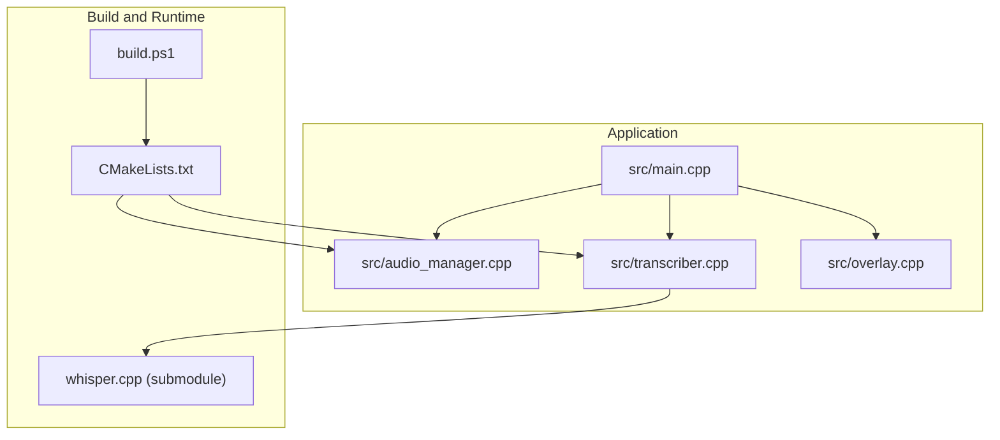
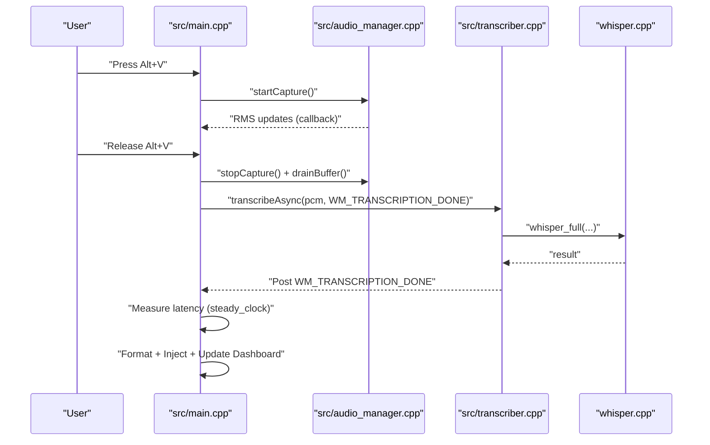
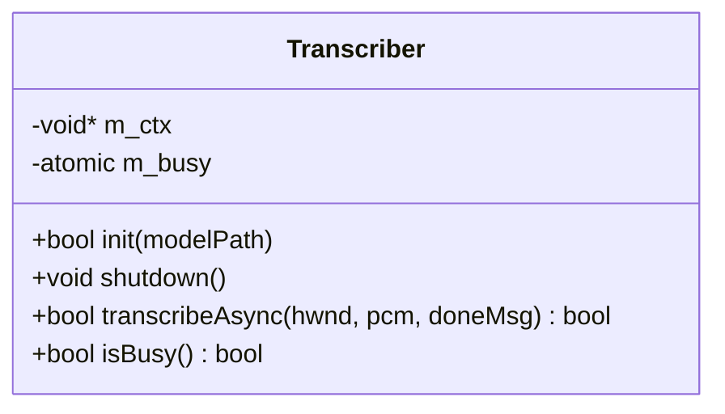
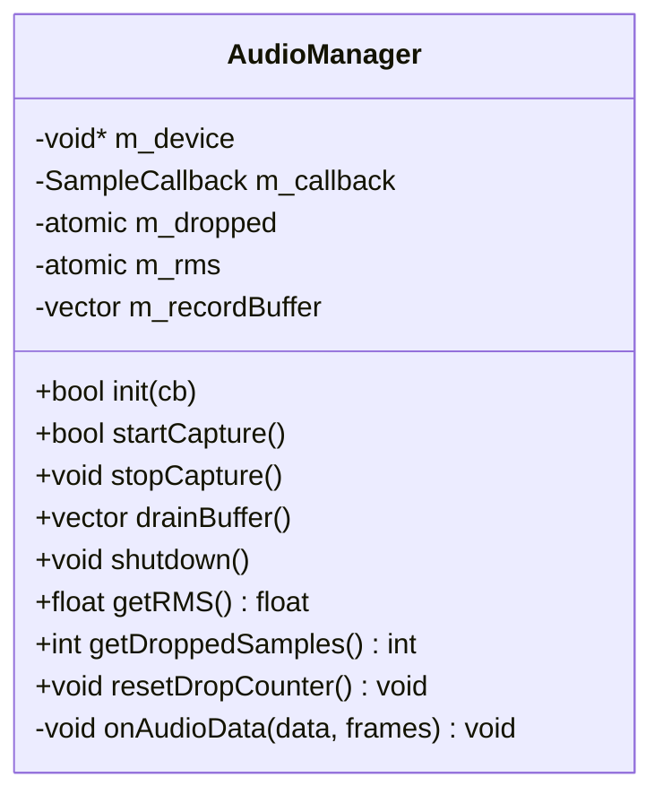
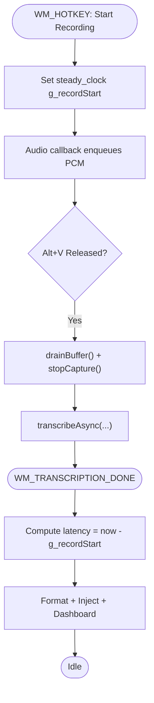
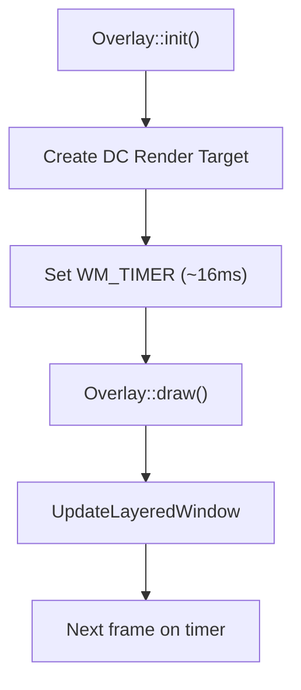
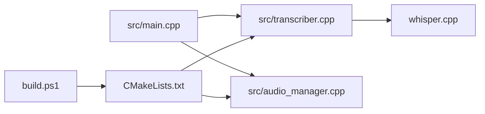
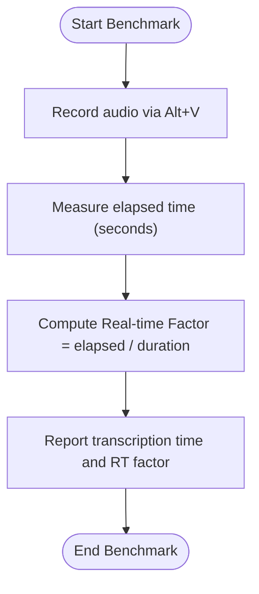

# Profiling and Benchmarking

<cite>
**Referenced Files in This Document**
- [PERFORMANCE.md](file://PERFORMANCE.md)
- [README.md](file://README.md)
- [build.ps1](file://build.ps1)
- [CMakeLists.txt](file://CMakeLists.txt)
- [src/main.cpp](file://src/main.cpp)
- [src/transcriber.cpp](file://src/transcriber.cpp)
- [src/transcriber.h](file://src/transcriber.h)
- [src/audio_manager.cpp](file://src/audio_manager.cpp)
- [src/audio_manager.h](file://src/audio_manager.h)
- [src/overlay.cpp](file://src/overlay.cpp)
</cite>

## Table of Contents
1. [Introduction](#introduction)
2. [Project Structure](#project-structure)
3. [Core Components](#core-components)
4. [Architecture Overview](#architecture-overview)
5. [Detailed Component Analysis](#detailed-component-analysis)
6. [Dependency Analysis](#dependency-analysis)
7. [Performance Considerations](#performance-considerations)
8. [Troubleshooting Guide](#troubleshooting-guide)
9. [Benchmarking Methodologies](#benchmarking-methodologies)
10. [Profiling Tools and Techniques](#profiling-tools-and-techniques)
11. [Performance Metrics and Validation](#performance-metrics-and-validation)
12. [Best Practices and Regression Testing](#best-practices-and-regression-testing)
13. [Interpreting Results and Decision Making](#interpreting-results-and-decision-making)
14. [Conclusion](#conclusion)

## Introduction
This document provides a comprehensive guide to performance profiling and benchmarking methodologies for Flow-On. It consolidates established benchmarking procedures, real-time factor calculations, performance validation techniques, and practical guidance for interpreting results. It also outlines the profiling tools and techniques available, the metrics to monitor, and best practices for regression testing and optimization trade-offs.

## Project Structure
Flow-On is a Windows-native voice-to-text application with a modular architecture:
- Entry point and state machine orchestrate recording, transcription, formatting, injection, and UI feedback.
- Audio capture uses a lock-free ring buffer for low-latency acquisition.
- Transcription leverages whisper.cpp with performance-oriented parameters and GPU acceleration support.
- Overlay rendering uses Direct2D for responsive UI feedback.
- Build system enables CPU optimizations and optional CUDA acceleration.

**Diagram sources**
- [src/main.cpp](file://src/main.cpp#L149-L357)
- [src/audio_manager.cpp](file://src/audio_manager.cpp#L39-L121)
- [src/transcriber.cpp](file://src/transcriber.cpp#L103-L225)
- [src/overlay.cpp](file://src/overlay.cpp#L29-L74)
- [CMakeLists.txt](file://CMakeLists.txt#L33-L51)
- [build.ps1](file://build.ps1#L44-L58)

**Section sources**
- [README.md](file://README.md#L201-L232)
- [CMakeLists.txt](file://CMakeLists.txt#L1-L133)
- [build.ps1](file://build.ps1#L1-L89)

## Core Components
- Transcriber: Asynchronous Whisper invocation with tuned parameters for speed, including threading, context sizing, and timestamp disabling.
- Audio Manager: Lock-free ring buffer for 16 kHz PCM capture with RMS computation and drop counting.
- Main Loop: State machine coordinating hotkey, recording, transcription, and injection, with latency measurement.
- Overlay: GPU-accelerated Direct2D UI feedback during recording and transcription.

Key performance-relevant behaviors:
- Transcriber sets thread count based on hardware concurrency and disables timestamps for speed.
- Audio Manager enqueues samples on a high-priority callback thread and exposes RMS and drop counters.
- Main loop measures transcription latency using steady-clock timestamps.

**Section sources**
- [src/transcriber.cpp](file://src/transcriber.cpp#L103-L225)
- [src/audio_manager.cpp](file://src/audio_manager.cpp#L39-L121)
- [src/main.cpp](file://src/main.cpp#L74-L342)
- [src/overlay.cpp](file://src/overlay.cpp#L29-L74)

## Architecture Overview
The end-to-end transcription pipeline integrates audio capture, asynchronous transcription, and UI feedback. The build system configures CPU optimizations and optional CUDA acceleration.

**Diagram sources**
- [src/main.cpp](file://src/main.cpp#L185-L342)
- [src/audio_manager.cpp](file://src/audio_manager.cpp#L83-L111)
- [src/transcriber.cpp](file://src/transcriber.cpp#L103-L225)

## Detailed Component Analysis

### Transcriber Component
The Transcriber class encapsulates Whisper initialization, GPU fallback, and asynchronous transcription with performance-oriented parameters.

**Diagram sources**
- [src/transcriber.h](file://src/transcriber.h#L10-L28)

Key performance tuning applied:
- Thread count derived from hardware concurrency with one core reserved for UI.
- Timestamps disabled to reduce overhead.
- Audio context scaled dynamically with audio length.
- Greedy decoding with repetition detection and suppression.

**Section sources**
- [src/transcriber.cpp](file://src/transcriber.cpp#L138-L186)
- [src/transcriber.h](file://src/transcriber.h#L10-L28)

### Audio Manager Component
The Audio Manager manages a lock-free ring buffer for 16 kHz PCM capture, RMS computation, and drop counting.

**Diagram sources**
- [src/audio_manager.h](file://src/audio_manager.h#L9-L41)

Operational characteristics:
- Periodic callback enqueues samples with minimal blocking.
- RMS computed per chunk and exposed atomically.
- Drop counter tracks buffer overruns.

**Section sources**
- [src/audio_manager.cpp](file://src/audio_manager.cpp#L39-L121)
- [src/audio_manager.h](file://src/audio_manager.h#L9-L41)

### Main Loop and Latency Measurement
The main loop coordinates state transitions and measures transcription latency using steady-clock timestamps.

**Diagram sources**
- [src/main.cpp](file://src/main.cpp#L185-L342)

**Section sources**
- [src/main.cpp](file://src/main.cpp#L193-L342)

### Overlay Rendering
The overlay uses Direct2D for smooth, GPU-accelerated UI feedback during recording and transcription.

**Diagram sources**
- [src/overlay.cpp](file://src/overlay.cpp#L29-L74)
- [src/overlay.cpp](file://src/overlay.cpp#L596-L620)

**Section sources**
- [src/overlay.cpp](file://src/overlay.cpp#L29-L74)
- [src/overlay.cpp](file://src/overlay.cpp#L596-L620)

## Dependency Analysis
- Transcriber depends on whisper.cpp, initialized with GPU preference and CPU fallback.
- Build configuration enables AVX2, fast math, OpenMP, and optional CUDA.
- Main loop depends on Transcriber and Audio Manager for timing and data.

**Diagram sources**
- [src/main.cpp](file://src/main.cpp#L19-L26)
- [src/transcriber.cpp](file://src/transcriber.cpp#L79-L93)
- [CMakeLists.txt](file://CMakeLists.txt#L33-L51)
- [build.ps1](file://build.ps1#L44-L58)

**Section sources**
- [CMakeLists.txt](file://CMakeLists.txt#L33-L51)
- [build.ps1](file://build.ps1#L44-L58)

## Performance Considerations
- CPU optimizations: AVX2, fast math, aggressive Release flags, and OpenMP for multi-core matrix ops.
- Whisper tuning: greedy decoding, reduced audio context, disabled timestamps, and single-segment mode.
- GPU acceleration: optional CUDA via build flags for significant speedup.
- Audio path: lock-free ring buffer with minimal callback work and RMS exposure.

[No sources needed since this section provides general guidance]

## Troubleshooting Guide
Systematic troubleshooting for slow transcription:
- Verify CPU usage during transcription; ensure threads are utilized.
- Confirm model size and presence.
- Close background processes and temporarily disable real-time antivirus.
- Check AVX2 support.
- Enable GPU acceleration if available.

**Section sources**
- [PERFORMANCE.md](file://PERFORMANCE.md#L143-L168)

## Benchmarking Methodologies
Established benchmarking procedure:
- Use the provided PowerShell script to measure transcription time for a fixed audio duration.
- Calculate real-time factor as measured duration divided by audio duration.
- Target real-time factor below 1.0 for responsiveness.

**Diagram sources**
- [PERFORMANCE.md](file://PERFORMANCE.md#L170-L182)

**Section sources**
- [PERFORMANCE.md](file://PERFORMANCE.md#L170-L182)

## Profiling Tools and Techniques
Available profiling avenues:
- Windows Performance Analyzer (WPA): Import ETW traces to analyze CPU, GPU, and system activity during transcription.
- CPU usage monitoring: Task Manager or PerfView to observe core utilization and identify saturation.
- Memory usage tracking: Task Manager or Visual Studio diagnostic tools to monitor RAM consumption during transcription.
- Whisper timings: whisper.cpp exposes timing APIs; enable profiling flags in the build configuration to collect detailed timings.

[No sources needed since this section provides general guidance]

## Performance Metrics and Validation
Primary metrics to monitor:
- Transcription time per audio length (e.g., 15s, 30s).
- Real-time factor (transcription time / audio duration).
- CPU utilization patterns (per-core load, saturation).
- GPU utilization (when CUDA is enabled).
- System resource contention (background processes, I/O, thermal throttling).
- Audio drop rate and RMS stability during capture.

Validation techniques:
- Baseline measurements on representative hardware.
- A/B comparisons between model sizes and optimization toggles.
- Cross-validation across multiple audio clips and speaking styles.

**Section sources**
- [PERFORMANCE.md](file://PERFORMANCE.md#L129-L142)
- [README.md](file://README.md#L305-L325)

## Best Practices and Regression Testing
- Establish baseline performance expectations for current defaults.
- Define A/B test scenarios: model variants, threading adjustments, and timestamp toggles.
- Automate benchmark runs with the PowerShell script and collect RT factors.
- Track regressions by comparing historical metrics and alerting on deviations.
- Validate on diverse hardware (CPU generations, GPU models) to generalize findings.

[No sources needed since this section provides general guidance]

## Interpreting Results and Decision Making
- Lower real-time factor indicates faster-than-real-time transcription; aim for sub-1.0 consistently.
- If CPU utilization is low, consider increasing thread count or reducing aggressive suppression.
- If GPU is underutilized, verify CUDA flags and driver installation.
- If audio drops occur, investigate background processes and adjust buffer sizes or capture rates.
- Use metric trends to decide whether to prioritize speed (lower context, greedy decoding) or quality (timestamps, larger context).

[No sources needed since this section provides general guidance]

## Conclusion
Flow-On’s architecture and build configuration are optimized for fast transcription with local-first privacy. The documented benchmarking procedure, combined with CPU/GPU profiling and targeted metrics, enables systematic performance validation and informed optimization trade-offs. Use the provided scripts and guidelines to establish baselines, detect regressions, and iteratively improve performance across varied hardware and workloads.