# Architecture Overview

<cite>
**Referenced Files in This Document**
- [main.cpp](file://src/main.cpp)
- [audio_manager.h](file://src/audio_manager.h)
- [audio_manager.cpp](file://src/audio_manager.cpp)
- [transcriber.h](file://src/transcriber.h)
- [transcriber.cpp](file://src/transcriber.cpp)
- [overlay.h](file://src/overlay.h)
- [overlay.cpp](file://src/overlay.cpp)
- [dashboard.h](file://src/dashboard.h)
- [dashboard.cpp](file://src/dashboard.cpp)
- [config_manager.h](file://src/config_manager.h)
- [config_manager.cpp](file://src/config_manager.cpp)
- [formatter.h](file://src/formatter.h)
- [injector.h](file://src/injector.h)
- [snippet_engine.h](file://src/snippet_engine.h)
- [settings.default.json](file://assets/settings.default.json)
</cite>

## Table of Contents
1. [Introduction](#introduction)
2. [Project Structure](#project-structure)
3. [Core Components](#core-components)
4. [Architecture Overview](#architecture-overview)
5. [Detailed Component Analysis](#detailed-component-analysis)
6. [Dependency Analysis](#dependency-analysis)
7. [Performance Considerations](#performance-considerations)
8. [Troubleshooting Guide](#troubleshooting-guide)
9. [Conclusion](#conclusion)
10. [Appendices](#appendices)

## Introduction
This document presents a comprehensive architecture overview of Flow-On, a Windows desktop application that captures microphone audio, transcribes speech to text using Whisper, applies formatting and snippet expansion, and injects the result into the active application. The system emphasizes a responsive UI, robust audio capture, efficient transcription, and a clean, observable pipeline with explicit state transitions and thread separation.

Key design goals:
- Real-time responsiveness with minimal latency
- Clear separation of concerns across threads and subsystems
- Event-driven communication with atomic guards to prevent races
- Modular initialization via factory-like patterns
- Persistent configuration and optional WinUI 3 dashboard

## Project Structure
The repository is organized around a small set of core modules under src/, with supporting assets and external dependencies. The main application entry point initializes subsystems, manages a finite state machine, and coordinates inter-thread messaging.

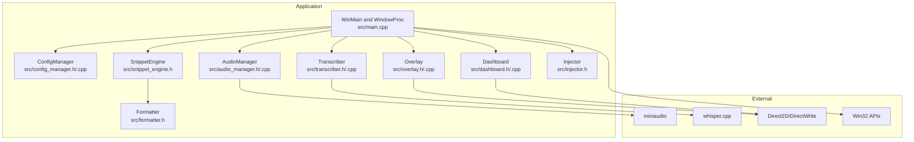

**Diagram sources**
- [main.cpp](file://src/main.cpp#L362-L520)
- [audio_manager.cpp](file://src/audio_manager.cpp#L1-L122)
- [transcriber.cpp](file://src/transcriber.cpp#L1-L226)
- [overlay.cpp](file://src/overlay.cpp#L1-L200)
- [dashboard.cpp](file://src/dashboard.cpp#L1-L200)
- [config_manager.cpp](file://src/config_manager.cpp#L1-L108)

**Section sources**
- [main.cpp](file://src/main.cpp#L362-L520)

## Core Components
- State Machine: Central finite-state machine with four states and atomic guards to prevent race conditions.
- Multi-threaded Architecture: Three distinct threads handle UI, audio capture, and transcription work.
- Inter-thread Communication: Lock-free queue for audio samples and Win32 message posting for cross-thread coordination.
- Observer Pattern: Event-driven callbacks and message handlers propagate state changes and UI updates.
- Factory Pattern: Modular initialization of subsystems with explicit init/shutdown lifecycles.
- Configuration Management: JSON settings persisted under %APPDATA% with automatic load/save.
- Overlay System: Direct2D layered window with timer-driven rendering and state visualization.
- Dashboard: Modern UI (Direct2D) and optional WinUI 3 integration for settings and history.

**Section sources**
- [main.cpp](file://src/main.cpp#L66-L128)
- [audio_manager.h](file://src/audio_manager.h#L9-L42)
- [transcriber.h](file://src/transcriber.h#L10-L29)
- [overlay.h](file://src/overlay.h#L11-L94)
- [dashboard.h](file://src/dashboard.h#L36-L69)
- [config_manager.h](file://src/config_manager.h#L21-L40)

## Architecture Overview
The system follows a strict threading model:
- Main thread: Windows message loop, UI, tray integration, hotkey handling, and state transitions.
- Audio callback thread: miniaudio PCM capture into a lock-free ring buffer; RMS computation; optional overlay updates.
- Worker thread: Asynchronous Whisper transcription invoked from the main thread after capture stops.

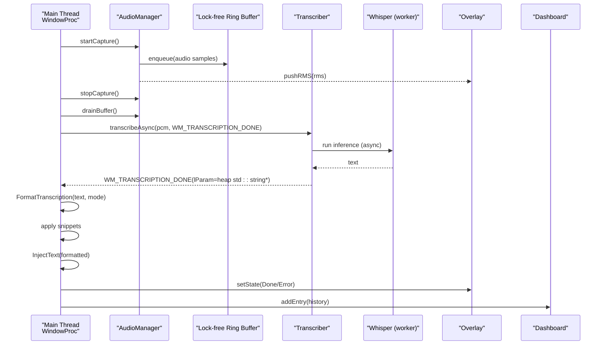

**Diagram sources**
- [main.cpp](file://src/main.cpp#L149-L357)
- [audio_manager.cpp](file://src/audio_manager.cpp#L39-L56)
- [transcriber.cpp](file://src/transcriber.cpp#L103-L200)
- [overlay.cpp](file://src/overlay.cpp#L137-L158)
- [dashboard.cpp](file://src/dashboard.cpp#L197-L200)

## Detailed Component Analysis

### Finite State Machine and Atomic Guards
The application enforces a strict four-state lifecycle: IDLE, RECORDING, TRANSCRIBING, INJECTING. Transitions are guarded by atomic compare-and-swap checks to prevent race conditions across threads.

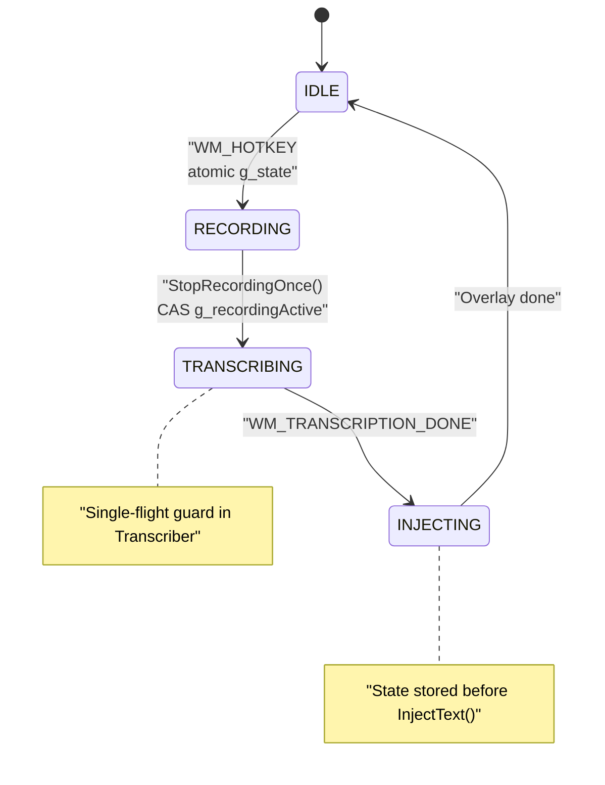

Atomic guards include:
- Recording gate: compare_exchange_strong to ensure only one path stops recording.
- Transcription gate: busy flag prevents overlapping async transcription.
- Duplicate message guard: timestamp-based deduplication for transcription completion.

**Diagram sources**
- [main.cpp](file://src/main.cpp#L66-L128)
- [transcriber.cpp](file://src/transcriber.cpp#L103-L117)

**Section sources**
- [main.cpp](file://src/main.cpp#L66-L128)
- [transcriber.cpp](file://src/transcriber.cpp#L103-L117)

### Multi-threaded Architecture
- Main thread: Handles Windows messages, tray icon, hotkey registration, timers, and UI actions.
- Audio callback thread: miniaudio invokes the audio callback; enqueues PCM samples and computes RMS.
- Worker thread: Whisper inference runs asynchronously; posts completion message to the main thread.

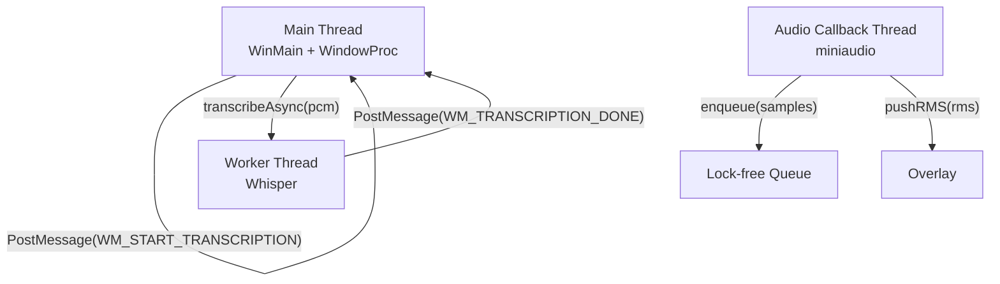

**Diagram sources**
- [main.cpp](file://src/main.cpp#L149-L357)
- [audio_manager.cpp](file://src/audio_manager.cpp#L30-L56)
- [transcriber.cpp](file://src/transcriber.cpp#L103-L119)
- [overlay.cpp](file://src/overlay.cpp#L160-L163)

**Section sources**
- [main.cpp](file://src/main.cpp#L149-L357)
- [audio_manager.cpp](file://src/audio_manager.cpp#L30-L56)
- [transcriber.cpp](file://src/transcriber.cpp#L103-L119)

### Component Interaction Patterns
- Observer pattern: Overlay subscribes to RMS updates; Dashboard subscribes to history entries; main window observes state changes.
- Factory pattern: Each subsystem exposes init()/shutdown() for modular initialization and teardown.
- Event-driven messaging: Win32 messages coordinate state transitions and cross-thread handoffs.

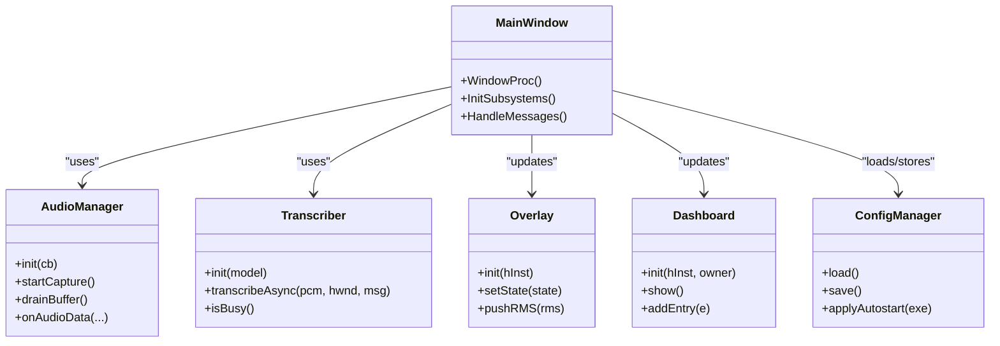

**Diagram sources**
- [main.cpp](file://src/main.cpp#L362-L520)
- [audio_manager.h](file://src/audio_manager.h#L9-L42)
- [transcriber.h](file://src/transcriber.h#L10-L29)
- [overlay.h](file://src/overlay.h#L18-L94)
- [dashboard.h](file://src/dashboard.h#L36-L69)
- [config_manager.h](file://src/config_manager.h#L21-L40)

**Section sources**
- [main.cpp](file://src/main.cpp#L362-L520)

### Data Flow: Audio Capture to Text Injection
End-to-end flow:
- Audio capture: miniaudio streams 16 kHz mono PCM; samples are enqueued into a lock-free ring buffer.
- Stop condition: Hotkey release detection via polling; atomic CAS ensures a single stop path.
- Preprocessing: Drop short/low-quality captures; trim silence to reduce compute.
- Inference: Whisper runs on a worker thread; parameters tuned for throughput.
- Post-processing: Remove hallucinated repetitions, format text, apply snippets.
- Injection: Inject into the active application; update overlay and dashboard.

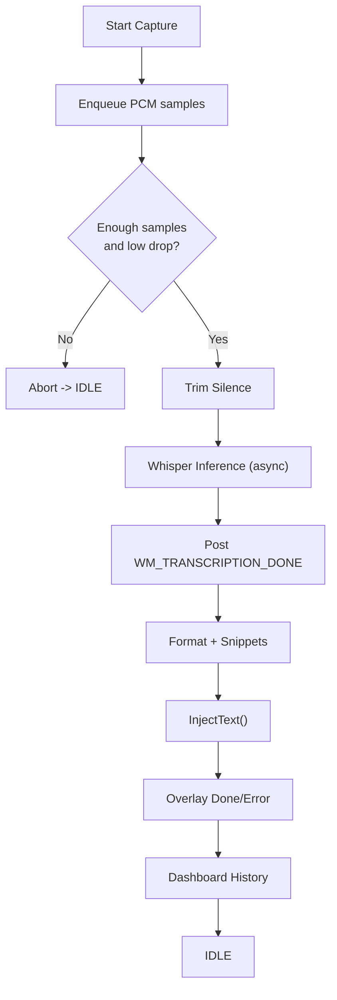

**Diagram sources**
- [main.cpp](file://src/main.cpp#L244-L342)
- [audio_manager.cpp](file://src/audio_manager.cpp#L102-L111)
- [transcriber.cpp](file://src/transcriber.cpp#L103-L200)
- [overlay.cpp](file://src/overlay.cpp#L137-L158)
- [dashboard.cpp](file://src/dashboard.cpp#L197-L200)

**Section sources**
- [main.cpp](file://src/main.cpp#L244-L342)
- [audio_manager.cpp](file://src/audio_manager.cpp#L102-L111)
- [transcriber.cpp](file://src/transcriber.cpp#L103-L200)

### System Tray Integration
- Tray icon lifecycle: Created on startup; re-added after Explorer crash via TaskbarCreated message.
- Hotkey registration: Attempts Alt+V; falls back to Alt+Shift+V if needed; stores fallback mode.
- Context menu: Right-click shows Dashboard and Exit; double-click opens Dashboard.

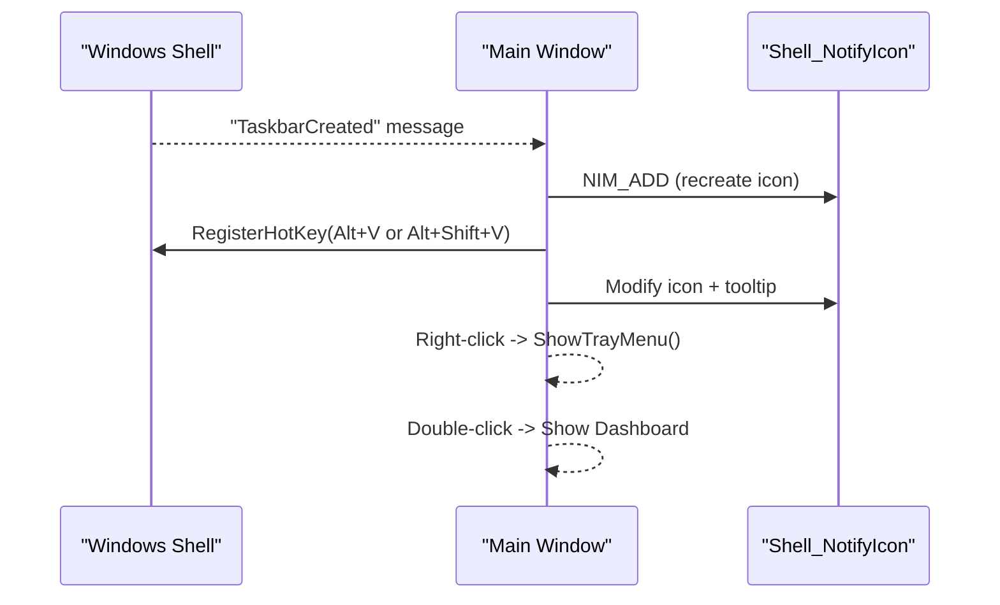

**Diagram sources**
- [main.cpp](file://src/main.cpp#L151-L180)
- [main.cpp](file://src/main.cpp#L185-L232)

**Section sources**
- [main.cpp](file://src/main.cpp#L151-L180)
- [main.cpp](file://src/main.cpp#L185-L232)

### Configuration Management
- Storage: JSON persisted under %APPDATA%\FLOW-ON\settings.json.
- Loading: On startup, loads settings and applies autostart if enabled.
- Saving: On settings changes from the dashboard, persists immediately.
- Defaults: Provided by assets/settings.default.json; runtime merges and validates.

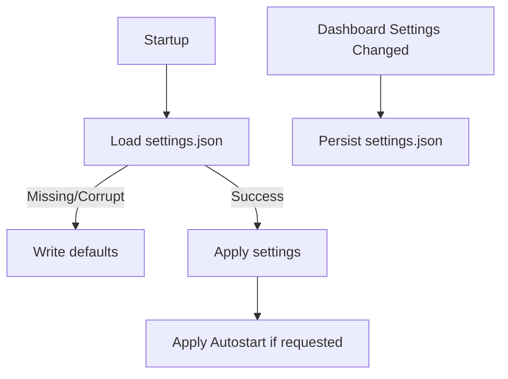

**Diagram sources**
- [main.cpp](file://src/main.cpp#L409-L415)
- [config_manager.cpp](file://src/config_manager.cpp#L24-L58)
- [config_manager.cpp](file://src/config_manager.cpp#L60-L80)
- [settings.default.json](file://assets/settings.default.json#L1-L16)

**Section sources**
- [main.cpp](file://src/main.cpp#L409-L415)
- [config_manager.cpp](file://src/config_manager.cpp#L24-L58)
- [config_manager.cpp](file://src/config_manager.cpp#L60-L80)
- [settings.default.json](file://assets/settings.default.json#L1-L16)

### Overlay System Architecture
- Rendering: Direct2D DC render target with a 32-bit DIB; UpdateLayeredWindow compositing for per-pixel alpha.
- Updates: Timer-driven (~60 Hz) animation state machine; RMS waveform visualization.
- States: Hidden, Recording, Processing, Done, Error; transitions animate pill appearance and state indicators.

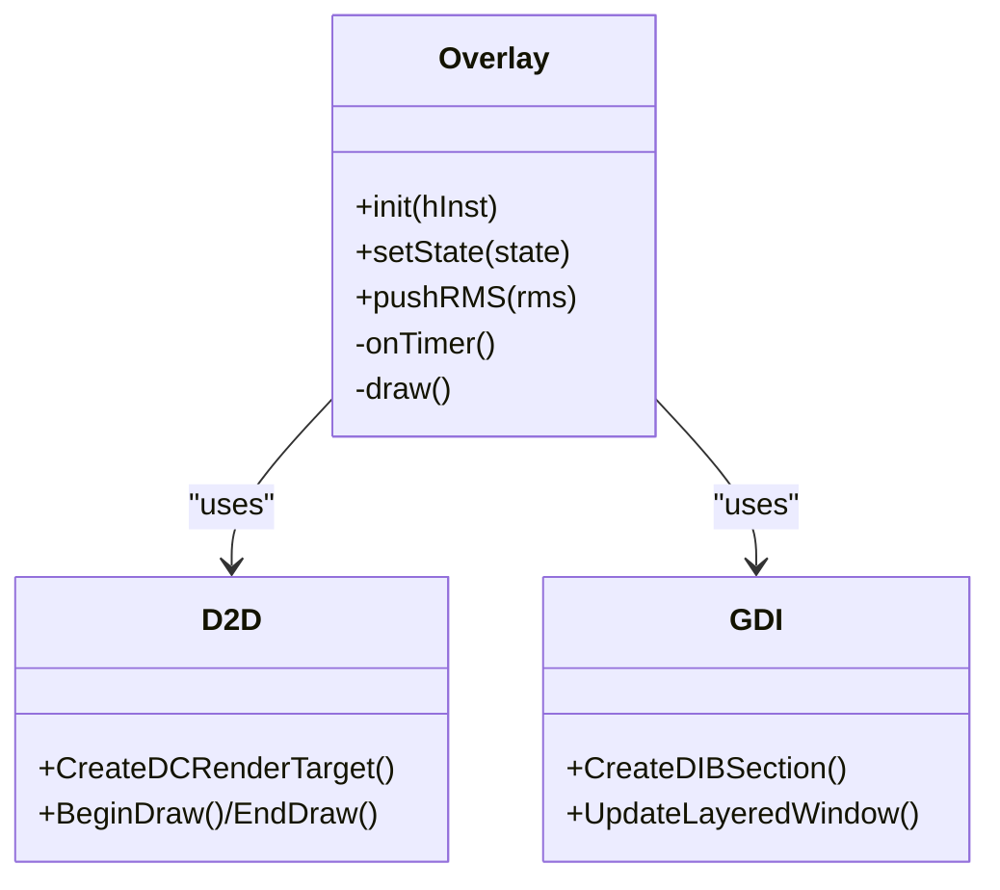

**Diagram sources**
- [overlay.h](file://src/overlay.h#L18-L94)
- [overlay.cpp](file://src/overlay.cpp#L29-L74)
- [overlay.cpp](file://src/overlay.cpp#L184-L200)

**Section sources**
- [overlay.h](file://src/overlay.h#L18-L94)
- [overlay.cpp](file://src/overlay.cpp#L29-L74)
- [overlay.cpp](file://src/overlay.cpp#L184-L200)

### Dashboard Architecture
- Modern UI: Direct2D-based window with glassmorphism and animated history list.
- Win32 fallback: Provides listbox UI when WinUI 3 is unavailable.
- Integration: Receives history entries via thread-safe methods; displays latency and mode metadata.

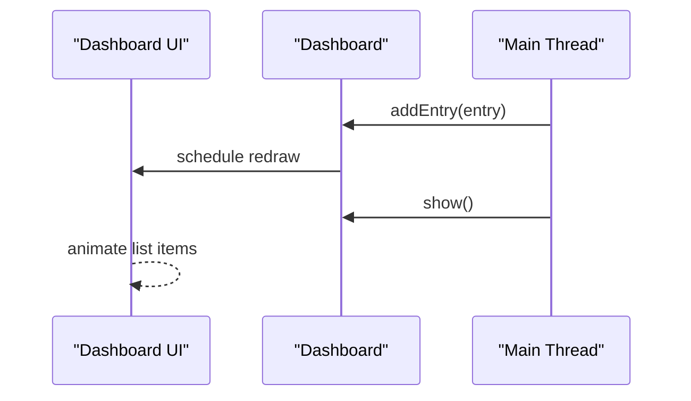

**Diagram sources**
- [dashboard.h](file://src/dashboard.h#L36-L69)
- [dashboard.cpp](file://src/dashboard.cpp#L90-L113)
- [dashboard.cpp](file://src/dashboard.cpp#L197-L200)

**Section sources**
- [dashboard.h](file://src/dashboard.h#L36-L69)
- [dashboard.cpp](file://src/dashboard.cpp#L90-L113)
- [dashboard.cpp](file://src/dashboard.cpp#L197-L200)

## Dependency Analysis
The following diagram shows core dependencies among major components and external libraries.

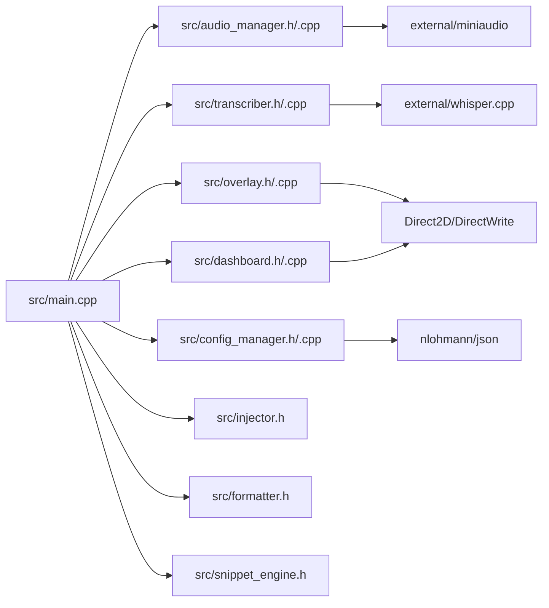

**Diagram sources**
- [main.cpp](file://src/main.cpp#L19-L26)
- [audio_manager.cpp](file://src/audio_manager.cpp#L7)
- [transcriber.cpp](file://src/transcriber.cpp#L3)
- [overlay.cpp](file://src/overlay.cpp#L10-L15)
- [dashboard.cpp](file://src/dashboard.cpp#L6-L16)
- [config_manager.cpp](file://src/config_manager.cpp#L5)

**Section sources**
- [main.cpp](file://src/main.cpp#L19-L26)
- [audio_manager.cpp](file://src/audio_manager.cpp#L7)
- [transcriber.cpp](file://src/transcriber.cpp#L3)
- [overlay.cpp](file://src/overlay.cpp#L10-L15)
- [dashboard.cpp](file://src/dashboard.cpp#L6-L16)
- [config_manager.cpp](file://src/config_manager.cpp#L5)

## Performance Considerations
- Lock-free audio queue: Minimizes contention between audio callback and main thread.
- Whisper tuning: Greedy decoding, reduced audio context, and thread count selection optimize throughput on typical hardware.
- Silent trimming: Reduces inference workload by removing unvoiced regions.
- Memory safety: PCM buffer zeroing before deallocation prevents sensitive data leakage.
- UI rendering: Timer-based updates at ~60 Hz balance responsiveness and CPU cost.

[No sources needed since this section provides general guidance]

## Troubleshooting Guide
- Microphone access denied: Initialization failure indicates missing permissions or device conflicts.
- Whisper model missing: Expected path is models/ggml-tiny.en.bin; download script provided in external resources.
- Overlay unsupported: Direct2D initialization failure suggests driver issues; continue without overlay.
- Hotkey conflicts: If Alt+V is taken, the app attempts Alt+Shift+V; otherwise, user is prompted to close conflicting applications.
- Duplicate transcription messages: Built-in deduplication ignores rapid repeats.

**Section sources**
- [main.cpp](file://src/main.cpp#L436-L444)
- [main.cpp](file://src/main.cpp#L462-L475)
- [main.cpp](file://src/main.cpp#L449-L457)
- [main.cpp](file://src/main.cpp#L162-L178)
- [main.cpp](file://src/main.cpp#L280-L292)

## Conclusion
Flow-On’s architecture cleanly separates real-time audio capture, asynchronous transcription, and UI responsibilities across threads. The finite state machine with atomic guards ensures deterministic transitions, while lock-free queues and Win32 messaging enable efficient inter-thread coordination. The modular subsystems, observer-style updates, and robust configuration management deliver a maintainable and extensible foundation for speech-to-text workflows on Windows.

[No sources needed since this section summarizes without analyzing specific files]

## Appendices

### Design Patterns and Benefits
- Finite State Machine: Guarantees well-defined transitions and simplifies error recovery.
- Atomic Guards: Prevent race conditions without heavy synchronization primitives.
- Observer Pattern: Enables decoupled UI updates and event propagation.
- Factory Pattern: Encapsulates initialization and teardown for each subsystem.
- Lock-free Programming: Reduces latency spikes in audio pipeline.
- Strategy Pattern (Formatter): Pluggable post-processing for different modes.

[No sources needed since this section provides general guidance]