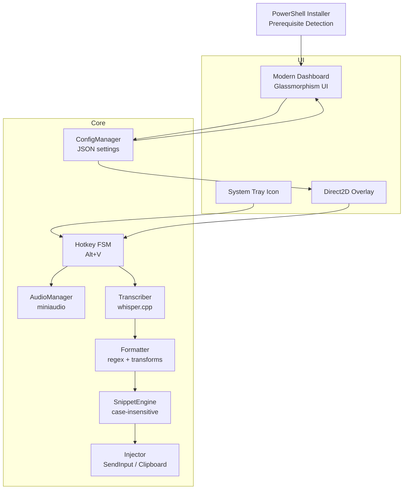
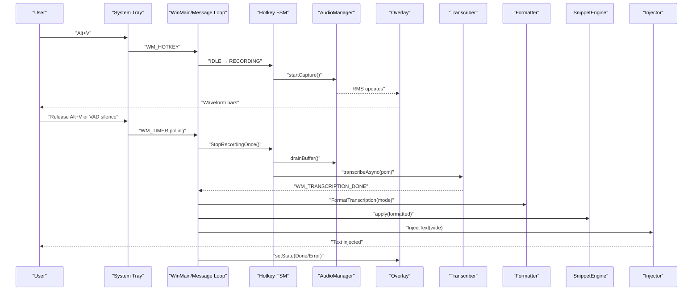
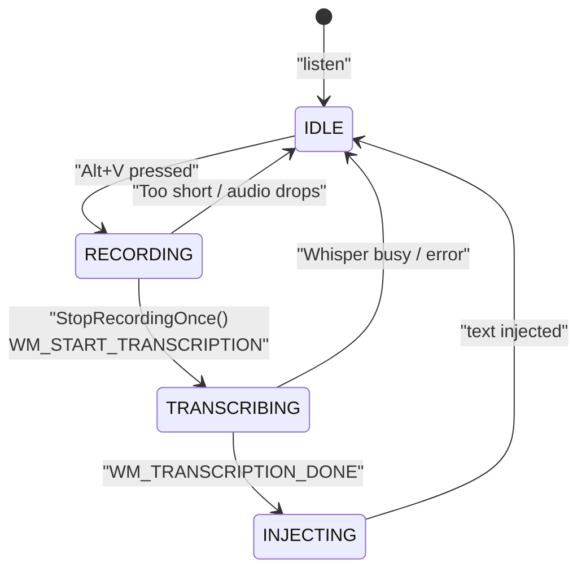
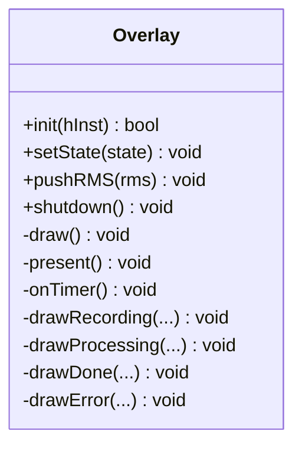
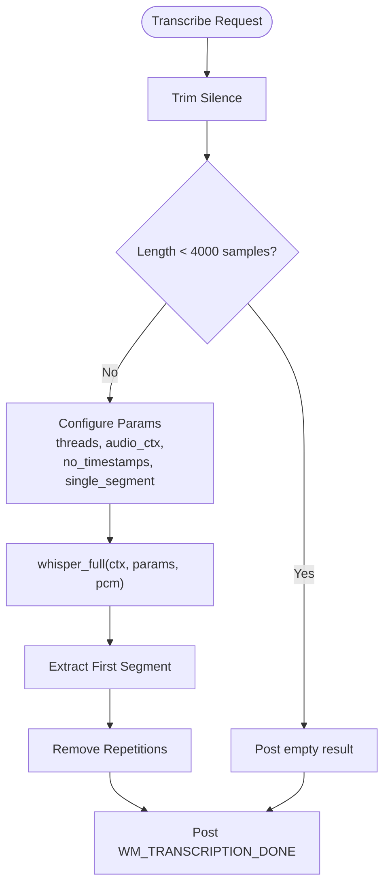
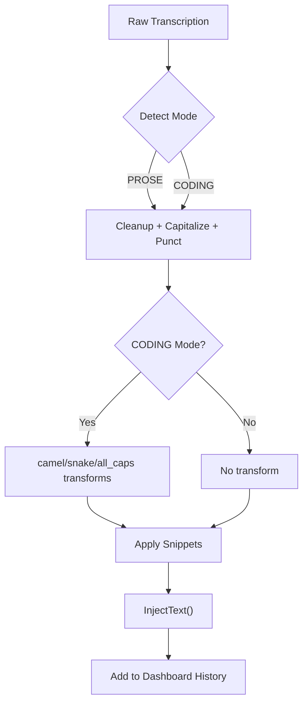
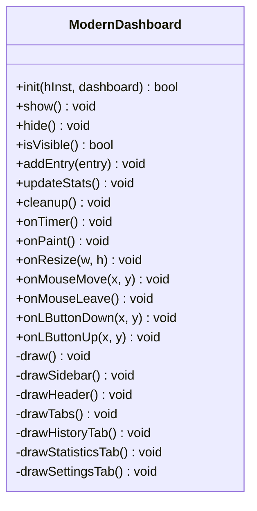
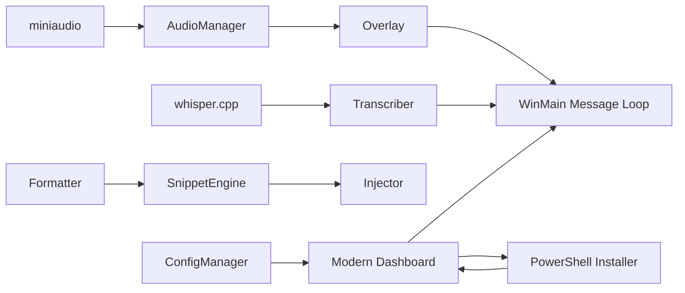

# Features Showcase

<cite>
**Referenced Files in This Document**
- [README.md](file://README.md)
- [PERFORMANCE.md](file://PERFORMANCE.md)
- [src/main.cpp](file://src/main.cpp)
- [src/audio_manager.cpp](file://src/audio_manager.cpp)
- [src/audio_manager.h](file://src/audio_manager.h)
- [src/transcriber.cpp](file://src/transcriber.cpp)
- [src/transcriber.h](file://src/transcriber.h)
- [src/formatter.cpp](file://src/formatter.cpp)
- [src/formatter.h](file://src/formatter.h)
- [src/injector.cpp](file://src/injector.cpp)
- [src/injector.h](file://src/injector.h)
- [src/overlay.cpp](file://src/overlay.cpp)
- [src/overlay.h](file://src/overlay.h)
- [src/snippet_engine.cpp](file://src/snippet_engine.cpp)
- [src/snippet_engine.h](file://src/snippet_engine.h)
- [src/dashboard.cpp](file://src/dashboard.cpp)
- [src/dashboard.h](file://src/dashboard.h)
- [src/config_manager.cpp](file://src/config_manager.cpp)
- [installer/flow-on.nsi](file://installer/flow-on.nsi)
- [assets/settings.default.json](file://assets/settings.default.json)
- [install.ps1](file://install.ps1)
</cite>

## Update Summary
**Changes Made**
- Added comprehensive documentation for the new PowerShell installer script (install.ps1) with system-wide and user-specific installation support
- Enhanced dashboard features documentation to include modern glassmorphism design, tabbed navigation, and interactive settings
- Updated installation methods section to cover both traditional NSIS installer and new PowerShell installer
- Added automated prerequisite detection and shortcut creation capabilities

## Table of Contents
1. [Introduction](#introduction)
2. [Project Structure](#project-structure)
3. [Core Components](#core-components)
4. [Architecture Overview](#architecture-overview)
5. [Detailed Component Analysis](#detailed-component-analysis)
6. [Installation Methods](#installation-methods)
7. [Dependency Analysis](#dependency-analysis)
8. [Performance Considerations](#performance-considerations)
9. [Troubleshooting Guide](#troubleshooting-guide)
10. [Conclusion](#conclusion)
11. [Appendices](#appendices)

## Introduction
This document presents a comprehensive features showcase for Flow-On, a professional Windows voice-to-text tool built for local-first, zero-cloud operation. It highlights the end-to-end user experience, from pressing Alt+V to seeing formatted text injected into the active application, with real-time visual feedback and intelligent post-processing.

Key features covered:
- Alt+V hotkey system with a finite-state machine
- Real-time GPU-accelerated Direct2D waveform overlay
- Whisper.cpp backend with offline AI transcription and GPU fallback
- Smart text injection with context-aware formatting
- Minimalist system tray interface
- Intelligent snippet engine for text substitution
- Modern dashboard with glassmorphism design and tabbed navigation
- Enhanced PowerShell installer with automated prerequisites and shortcuts

Each feature includes practical examples, technology underpinning, performance characteristics, and system requirements.

## Project Structure
Flow-On is organized around a small set of focused modules:
- Audio capture and buffering (miniaudio)
- Whisper transcription (whisper.cpp)
- Text formatting and coding transforms
- Overlay rendering (Direct2D)
- Text injection (SendInput or clipboard)
- Snippet engine and mode detection
- Configuration and persistence
- Modern dashboard with glassmorphism UI
- Multiple installation methods (NSIS and PowerShell)

**Diagram sources**
- [src/main.cpp](file://src/main.cpp#L149-L357)
- [src/audio_manager.cpp](file://src/audio_manager.cpp#L58-L122)
- [src/transcriber.cpp](file://src/transcriber.cpp#L103-L226)
- [src/formatter.cpp](file://src/formatter.cpp#L137-L148)
- [src/injector.cpp](file://src/injector.cpp#L49-L75)
- [src/snippet_engine.cpp](file://src/snippet_engine.cpp#L6-L28)
- [src/overlay.cpp](file://src/overlay.cpp#L29-L74)
- [src/dashboard.cpp](file://src/dashboard.cpp#L90-L113)
- [src/config_manager.cpp](file://src/config_manager.cpp#L24-L80)
- [install.ps1](file://install.ps1#L108-L147)

**Section sources**
- [README.md](file://README.md#L201-L232)

## Core Components
- Alt+V Hotkey FSM: A state machine transitions through IDLE → RECORDING → TRANSCRIBING → INJECTING, with robust guards against races and VAD fallback.
- Audio Capture: 16 kHz mono PCM capture with lock-free ring buffer and RMS metering for the overlay.
- Whisper.cpp Transcriber: Asynchronous transcription with GPU fallback, aggressive optimizations for speed.
- Formatter: Four-pass cleaning and punctuation normalization; optional coding transforms.
- Overlay: Direct2D layered window with GPU-accelerated drawing and smooth animations.
- Injector: Reliable text injection via SendInput or clipboard fallback for complex text.
- Snippet Engine: Case-insensitive, longest-match replacement engine.
- Modern Dashboard: Glassmorphism UI with tabbed navigation, interactive settings, and real-time statistics.
- Enhanced Installer: PowerShell script supporting system-wide/user-specific installations with automated prerequisites.

**Section sources**
- [README.md](file://README.md#L6-L14)
- [README.md](file://README.md#L69-L123)
- [src/main.cpp](file://src/main.cpp#L67-L128)
- [src/audio_manager.cpp](file://src/audio_manager.cpp#L58-L122)
- [src/transcriber.cpp](file://src/transcriber.cpp#L103-L226)
- [src/formatter.cpp](file://src/formatter.cpp#L137-L148)
- [src/overlay.cpp](file://src/overlay.cpp#L29-L74)
- [src/injector.cpp](file://src/injector.cpp#L49-L75)
- [src/snippet_engine.cpp](file://src/snippet_engine.cpp#L6-L28)
- [src/dashboard.cpp](file://src/dashboard.cpp#L90-L113)
- [src/dashboard.h](file://src/dashboard.h#L1-L89)
- [installer/flow-on.nsi](file://installer/flow-on.nsi#L66-L124)
- [install.ps1](file://install.ps1#L1-L303)

## Architecture Overview
The application follows a layered Win32 architecture with a message loop driving UI, hotkey handling, and asynchronous transcription. Audio is captured on a dedicated callback thread and fed into a lock-free queue. The main thread orchestrates the state machine, overlay updates, and text injection.

**Diagram sources**
- [src/main.cpp](file://src/main.cpp#L185-L342)
- [src/audio_manager.cpp](file://src/audio_manager.cpp#L83-L111)
- [src/overlay.cpp](file://src/overlay.cpp#L140-L158)
- [src/transcriber.cpp](file://src/transcriber.cpp#L103-L226)
- [src/formatter.cpp](file://src/formatter.cpp#L137-L148)
- [src/snippet_engine.cpp](file://src/snippet_engine.cpp#L6-L28)
- [src/injector.cpp](file://src/injector.cpp#L49-L75)

## Detailed Component Analysis

### Alt+V Hotkey System
- Behavior: Press to start recording; release to trigger transcription. A polling timer detects release even on hidden windows. VAD silence can also end recording.
- State Machine: IDLE → RECORDING → TRANSCRIBING → INJECTING → IDLE.
- Race Protection: Atomic CAS gate ensures only one path wins (hotkey release or VAD).
- Fallback Hotkey: If Alt+V is taken, tries Alt+Shift+V and updates tray tooltip.

**Diagram sources**
- [src/main.cpp](file://src/main.cpp#L67-L128)
- [src/main.cpp](file://src/main.cpp#L185-L342)

**Section sources**
- [README.md](file://README.md#L280-L289)
- [src/main.cpp](file://src/main.cpp#L162-L222)
- [src/main.cpp](file://src/main.cpp#L244-L274)
- [src/main.cpp](file://src/main.cpp#L280-L342)

### Real-time GPU-accelerated Waveform Overlay (Direct2D)
- Rendering: ID2D1 DC render target with premultiplied alpha; UpdateLayeredWindow compositing for per-pixel transparency.
- Animation: 60 fps timer; recording shows animated waveform bars and pulsing dot; processing shows spinning arc; done/error show animated check/X with glow.
- Auto-hide: After Done/Error, overlay remains visible for a short period then fades out.

**Diagram sources**
- [src/overlay.h](file://src/overlay.h#L18-L94)
- [src/overlay.cpp](file://src/overlay.cpp#L29-L74)

**Section sources**
- [README.md](file://README.md#L8-L8)
- [src/overlay.cpp](file://src/overlay.cpp#L184-L256)
- [src/overlay.cpp](file://src/overlay.cpp#L274-L372)
- [src/overlay.cpp](file://src/overlay.cpp#L377-L466)
- [src/overlay.cpp](file://src/overlay.cpp#L471-L537)
- [src/overlay.cpp](file://src/overlay.cpp#L542-L591)
- [src/overlay.cpp](file://src/overlay.cpp#L596-L620)

### Whisper.cpp Backend (Offline AI Transcription)
- Initialization: Attempts GPU; falls back to CPU silently. Loads model from bundled path.
- Optimization: Single-threaded inference path with aggressive speed-ups (no timestamps, single segment, reduced audio context, greedy decoding).
- Safety: Removes hallucinated repetitions and trims silence to reduce compute.

**Diagram sources**
- [src/transcriber.cpp](file://src/transcriber.cpp#L103-L226)
- [src/transcriber.cpp](file://src/transcriber.cpp#L17-L46)
- [src/transcriber.cpp](file://src/transcriber.cpp#L53-L77)

**Section sources**
- [README.md](file://README.md#L9-L9)
- [src/transcriber.cpp](file://src/transcriber.cpp#L79-L93)
- [src/transcriber.cpp](file://src/transcriber.cpp#L103-L226)
- [PERFORMANCE.md](file://PERFORMANCE.md#L7-L31)

### Smart Text Injection with Context-Aware Formatting
- Mode Detection: Automatically detects code editors/terminals; otherwise prose mode.
- Formatting Pipeline: Four passes (fillers → cleanup → punctuation → coding transforms).
- Injection: Uses SendInput for short, ASCII-like text; clipboard fallback for long text or surrogate-containing emoji.
- Dashboard History: Records formatted text, latency, and mode.

**Diagram sources**
- [src/main.cpp](file://src/main.cpp#L300-L341)
- [src/formatter.cpp](file://src/formatter.cpp#L137-L148)
- [src/snippet_engine.cpp](file://src/snippet_engine.cpp#L6-L28)
- [src/injector.cpp](file://src/injector.cpp#L49-L75)
- [src/dashboard.cpp](file://src/dashboard.cpp#L197-L206)

**Section sources**
- [README.md](file://README.md#L290-L297)
- [src/formatter.cpp](file://src/formatter.cpp#L137-L148)
- [src/injector.cpp](file://src/injector.cpp#L49-L75)
- [src/snippet_engine.cpp](file://src/snippet_engine.cpp#L6-L28)
- [src/dashboard.cpp](file://src/dashboard.cpp#L197-L206)

### Minimalist System Tray Interface
- Tray Icon: Changes state (idle/recording) and tooltip messages.
- Context Menu: Dashboard and Exit.
- Explorer Crash Recovery: Re-adds icon after TaskbarCreated message.

**Section sources**
- [src/main.cpp](file://src/main.cpp#L79-L110)
- [src/main.cpp](file://src/main.cpp#L151-L155)
- [src/main.cpp](file://src/main.cpp#L227-L232)

### Intelligent Snippet Engine
- Behavior: Case-insensitive, longest-first replacement across the entire text.
- Configuration: Loaded from settings; enforced max length per snippet.

**Section sources**
- [src/snippet_engine.cpp](file://src/snippet_engine.cpp#L6-L28)
- [src/snippet_engine.cpp](file://src/snippet_engine.cpp#L35-L81)
- [assets/settings.default.json](file://assets/settings.default.json#L7-L14)

### Modern Dashboard with Glassmorphism Design
- UI Framework: Modern glassmorphism design with dark theme and translucent effects.
- Tabbed Navigation: Three tabs - History, Statistics, and Settings with smooth animations.
- Interactive Elements: Hover effects, toggle switches, and clickable settings.
- Real-time Metrics: Animated statistics cards showing transcription counts and latency.
- Settings Panel: Configurable options for GPU acceleration, autostart, and overlay preferences.
- History Management: Scrollable list with fade-in animations and clear functionality.

**Diagram sources**
- [src/dashboard.cpp](file://src/dashboard.cpp#L69-L185)
- [src/dashboard.h](file://src/dashboard.h#L45-L89)

**Section sources**
- [src/dashboard.cpp](file://src/dashboard.cpp#L1-L89)
- [src/dashboard.cpp](file://src/dashboard.cpp#L899-L1509)
- [src/dashboard.h](file://src/dashboard.h#L1-L89)

### Enhanced PowerShell Installer Script
- Dual Installation Modes: System-wide (requires admin) and user-specific installations.
- Automated Prerequisites: Detects and installs Visual Studio 2022, CMake, and Git automatically.
- Build Options: Supports building from source or downloading pre-built releases.
- Shortcut Creation: Creates Start Menu and optional Desktop shortcuts.
- Registry Integration: Adds automatic startup capability through Windows Registry.
- Interactive Prompts: User-friendly prompts for desktop shortcuts and startup configuration.

**Section sources**
- [install.ps1](file://install.ps1#L1-L303)

## Installation Methods

### Traditional NSIS Installer
- Bundled Components: Windows App SDK runtime (optional), application binary, Whisper model (~75 MB), icons.
- Installation: Silent runtime installation, shortcuts, registry entries, estimated size ~96 MB.
- Uninstallation: Removes files, shortcuts, and registry keys.

**Section sources**
- [installer/flow-on.nsi](file://installer/flow-on.nsi#L66-L124)
- [installer/flow-on.nsi](file://installer/flow-on.nsi#L129-L156)

### PowerShell Installer Script
- One-Click Installation: irm https://raw.githubusercontent.com/MemestaVedas/flow-on/main/install.ps1 | iex
- System-wide Installation: Requires Administrator privileges for all-users installation.
- User-specific Installation: Default option for per-user installation without admin rights.
- Automated Prerequisites: Checks for Visual Studio 2022, CMake, and Git; provides installation guidance if missing.
- Build Flexibility: Can build from source or download pre-built binaries.
- Shortcut Management: Creates Start Menu shortcuts and optional Desktop shortcuts.
- Startup Configuration: Option to add FLOW-ON! to Windows startup.

**Section sources**
- [install.ps1](file://install.ps1#L1-L303)

## Dependency Analysis
- Audio: miniaudio captures 16 kHz PCM; lock-free queue decouples producer/consumer.
- Rendering: Direct2D with ID2D1 DC render target; UpdateLayeredWindow for compositing.
- Transcription: whisper.cpp with GPU fallback; single-flight guard prevents overlap.
- Concurrency: Atomic state machines, lock-free queue, worker thread for Whisper.
- IPC: Windows messages (WM_HOTKEY, WM_TRANSCRIPTION_DONE) coordinate state transitions.
- Dashboard: Modern glassmorphism UI with tabbed navigation and interactive settings.
- Installation: PowerShell script with automated prerequisite detection and shortcut creation.

**Diagram sources**
- [src/audio_manager.cpp](file://src/audio_manager.cpp#L58-L122)
- [src/overlay.cpp](file://src/overlay.cpp#L29-L74)
- [src/transcriber.cpp](file://src/transcriber.cpp#L79-L93)
- [src/main.cpp](file://src/main.cpp#L149-L357)
- [src/formatter.cpp](file://src/formatter.cpp#L137-L148)
- [src/snippet_engine.cpp](file://src/snippet_engine.cpp#L6-L28)
- [src/injector.cpp](file://src/injector.cpp#L49-L75)
- [src/config_manager.cpp](file://src/config_manager.cpp#L24-L80)
- [src/dashboard.cpp](file://src/dashboard.cpp#L90-L113)
- [install.ps1](file://install.ps1#L108-L147)

**Section sources**
- [README.md](file://README.md#L86-L96)

## Performance Considerations
- Audio Latency: ~100 ms (miniaudio callback).
- Transcription: ~12–18s for 30s audio (tiny.en model, CPU AVX2).
- Overlay: 60 FPS (Direct2D GPU-accelerated).
- Memory: ~400 MB (Whisper model in RAM).
- CPU: <5% idle, 80–100% during transcription (uses all cores).
- Optimizations: tiny.en model, single-flight, no timestamps, reduced audio context, single segment, greedy decoding.
- Dashboard: Smooth 60 FPS animations with modern glassmorphism effects.

**Section sources**
- [README.md](file://README.md#L305-L325)
- [PERFORMANCE.md](file://PERFORMANCE.md#L129-L142)
- [src/dashboard.cpp](file://src/dashboard.cpp#L26-L27)

## Troubleshooting Guide
- Hotkey not working: Verify VK code and that no other app claims Alt+V; fallback to Alt+Shift+V is supported.
- No audio device: Ensure microphone is connected and Windows sound settings allow access.
- Model not found: Expected path is models/ggml-tiny.en.bin; download or rebuild.
- Installer fails: Ensure NSIS 3.x is installed and makensis is in PATH.
- PowerShell installer issues: Run as Administrator for system-wide installation; check prerequisites manually if automatic detection fails.
- Dashboard not opening: Ensure Direct2D is supported by your graphics drivers.

**Section sources**
- [README.md](file://README.md#L326-L346)
- [install.ps1](file://install.ps1#L93-L147)

## Conclusion
Flow-On delivers a streamlined, high-performance voice-to-text pipeline on Windows with a focus on speed, reliability, and user experience. The combination of a responsive hotkey system, real-time GPU overlay, optimized offline transcription, intelligent post-processing, and modern glassmorphism dashboard makes it suitable for both rapid dictation and precise coding tasks. The enhanced PowerShell installer simplifies deployment across different environments while maintaining the application's zero-cloud, local-first philosophy.

## Appendices

### Feature Examples and Use Cases
- Coding transcription with camelCase transforms:
  - Say "user name"; in a code editor, becomes userName.
  - Say "api response"; becomes api_response.
  - Say "HTTP method"; becomes HTTP_METHOD.
- Normal text cleanup with punctuation restoration:
  - "um uh ah" stripped; sentence starts capitalized; trailing punctuation added.
- Snippet expansion for boilerplate:
  - "insert boilerplate" expands to a React component scaffold.
  - "insert todo" expands to a TODO prefix.
- Dashboard usage:
  - Navigate between History, Statistics, and Settings tabs.
  - View real-time usage statistics and transcription metrics.
  - Configure GPU acceleration, autostart, and overlay preferences.

**Section sources**
- [README.md](file://README.md#L290-L297)
- [assets/settings.default.json](file://assets/settings.default.json#L7-L14)
- [src/dashboard.cpp](file://src/dashboard.cpp#L899-L1509)

### Visual Feedback States
- Recording: Blue waveform bars with a pulsing red dot.
- Processing: Spinning arc with "transcribing…" label.
- Done: Green checkmark inside a scaling circle.
- Error: Red X inside a scaling circle.

**Section sources**
- [README.md](file://README.md#L284-L289)
- [src/overlay.cpp](file://src/overlay.cpp#L274-L372)
- [src/overlay.cpp](file://src/overlay.cpp#L377-L466)
- [src/overlay.cpp](file://src/overlay.cpp#L471-L537)
- [src/overlay.cpp](file://src/overlay.cpp#L542-L591)

### Technology Behind Each Feature
- Audio Capture: miniaudio for 16 kHz mono PCM capture and RMS computation.
- Direct2D Overlay: GPU-accelerated rendering with layered windows and smooth animations.
- Whisper.cpp: Offline transcription with AVX2 and optional CUDA acceleration.
- Windows API Integration: Win32 message loop, tray icon, hotkey registration, SendInput, clipboard.
- Concurrency: Lock-free queue (moodycamel), atomic state machines, worker threads.
- Dashboard UI: Modern glassmorphism design with tabbed navigation and interactive elements.
- PowerShell Installer: Automated prerequisite detection and shortcut management.

**Section sources**
- [README.md](file://README.md#L86-L96)
- [src/audio_manager.cpp](file://src/audio_manager.cpp#L58-L122)
- [src/overlay.cpp](file://src/overlay.cpp#L29-L74)
- [src/transcriber.cpp](file://src/transcriber.cpp#L79-L93)
- [src/injector.cpp](file://src/injector.cpp#L49-L75)
- [src/dashboard.cpp](file://src/dashboard.cpp#L1-L89)
- [install.ps1](file://install.ps1#L108-L147)