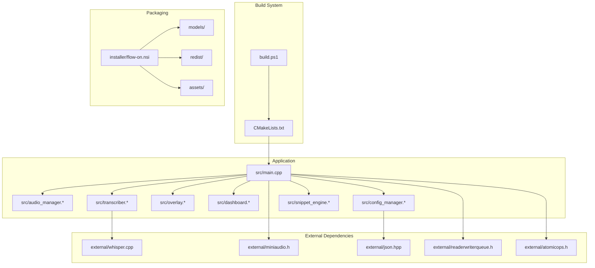
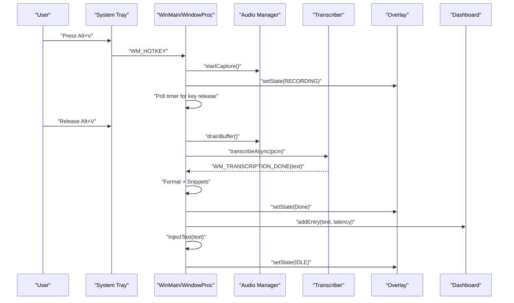
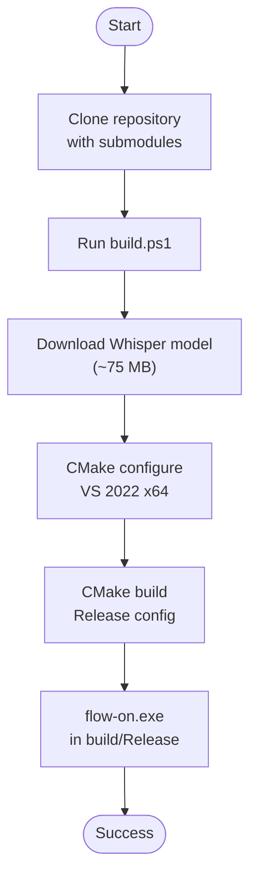
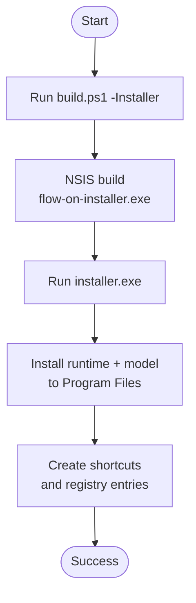
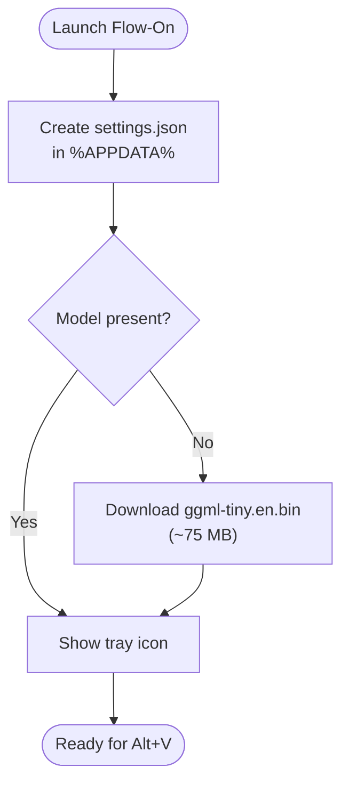
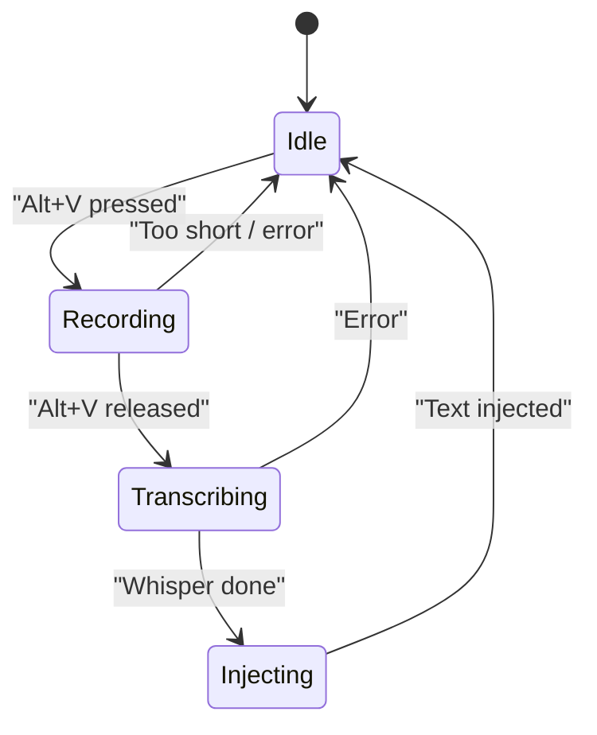
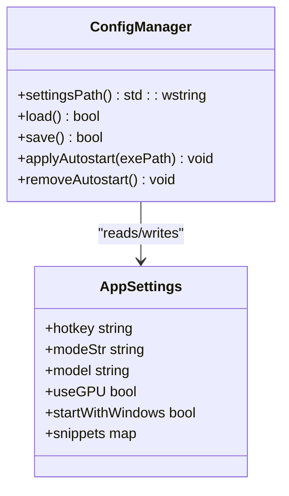

# Getting Started

<cite>
**Referenced Files in This Document**
- [README.md](file://README.md)
- [CMakeLists.txt](file://CMakeLists.txt)
- [build.ps1](file://build.ps1)
- [installer/flow-on.nsi](file://installer/flow-on.nsi)
- [src/main.cpp](file://src/main.cpp)
- [src/config_manager.cpp](file://src/config_manager.cpp)
- [src/transcriber.cpp](file://src/transcriber.cpp)
- [assets/settings.default.json](file://assets/settings.default.json)
- [PERFORMANCE.md](file://PERFORMANCE.md)
</cite>

## Table of Contents
1. [Introduction](#introduction)
2. [Project Structure](#project-structure)
3. [Core Components](#core-components)
4. [Architecture Overview](#architecture-overview)
5. [Installation Paths](#installation-paths)
6. [First Run and Initial Setup](#first-run-and-initial-setup)
7. [Basic Usage](#basic-usage)
8. [Performance Expectations](#performance-expectations)
9. [Troubleshooting Guide](#troubleshooting-guide)
10. [Advanced Configuration](#advanced-configuration)
11. [Conclusion](#conclusion)

## Introduction
This guide helps you get Flow-On running quickly from source or via the standalone installer. You will learn the prerequisites, build steps, first-run setup, and how to verify a successful installation. It also covers the Alt+V hotkey, system tray integration, and Whisper.cpp backend terminology used throughout the project.

## Project Structure
Flow-On is a Windows desktop application written in C++20 with a modular architecture:
- Build system: CMake with Visual Studio 2022 generator
- Audio capture: miniaudio.h
- Speech-to-text: whisper.cpp submodule
- UI: Win32 tray icon, optional WinUI 3 dashboard, Direct2D overlay
- Concurrency: lock-free queues and atomic state machines
- Packaging: NSIS installer bundles runtime and model

**Diagram sources**
- [CMakeLists.txt](file://CMakeLists.txt#L56-L94)
- [src/main.cpp](file://src/main.cpp#L19-L26)
- [installer/flow-on.nsi](file://installer/flow-on.nsi#L66-L124)

**Section sources**
- [README.md](file://README.md#L201-L232)
- [CMakeLists.txt](file://CMakeLists.txt#L1-L133)

## Core Components
- System tray integration: persistent icon, context menu, and Explorer crash recovery
- Alt+V hotkey finite-state machine: IDLE → RECORDING → TRANSCRIBING → INJECTING
- Whisper.cpp backend: asynchronous transcription with GPU fallback and performance optimizations
- Direct2D overlay: real-time waveform visualization
- Configuration manager: settings.json in %APPDATA%\FLOW-ON
- Snippet engine: case-insensitive text substitution

**Section sources**
- [README.md](file://README.md#L69-L123)
- [src/main.cpp](file://src/main.cpp#L67-L128)
- [src/transcriber.cpp](file://src/transcriber.cpp#L79-L93)
- [src/config_manager.cpp](file://src/config_manager.cpp#L15-L22)

## Architecture Overview
The application initializes a hidden message window, registers the Alt+V hotkey, sets up audio capture, loads the Whisper model, and starts the message loop. On hotkey press, it begins audio capture and transitions to recording. On release, it drains the audio buffer, runs Whisper asynchronously, formats the result, expands snippets, and injects text into the active window.

**Diagram sources**
- [src/main.cpp](file://src/main.cpp#L185-L342)
- [src/transcriber.cpp](file://src/transcriber.cpp#L103-L225)

## Installation Paths
Flow-On supports two installation paths: building from source with automatic model download or using the standalone installer.

### Path A: Build from Source (Recommended for developers)
- Prerequisites: Windows 10/11 x64, Visual Studio 2022 (v143 toolset), CMake 3.20+, PowerShell 5.0+
- Steps:
  1. Clone repository with submodules
  2. Run the automated build script to download the model, configure, and compile
  3. Launch the resulting executable from the build output directory

**Diagram sources**
- [README.md](file://README.md#L23-L37)
- [build.ps1](file://build.ps1#L21-L58)

**Section sources**
- [README.md](file://README.md#L17-L37)
- [build.ps1](file://build.ps1#L1-L89)

### Path B: Standalone Installer (Recommended for end users)
- Generate the installer with the build script and run it to install to Program Files
- The installer bundles the Windows App SDK runtime and the Whisper model (~75 MB)
- Creates Start Menu shortcuts and registers with Add/Remove Programs

**Diagram sources**
- [README.md](file://README.md#L254-L270)
- [build.ps1](file://build.ps1#L62-L85)
- [installer/flow-on.nsi](file://installer/flow-on.nsi#L66-L124)

**Section sources**
- [README.md](file://README.md#L254-L270)
- [installer/flow-on.nsi](file://installer/flow-on.nsi#L1-L157)

## First Run and Initial Setup
After installation, Flow-On performs the following first-run actions:
- Creates settings.json in %APPDATA%\FLOW-ON
- Downloads the Whisper model (~75 MB) if missing
- Displays the system tray icon
- Registers the Alt+V hotkey for recording

**Diagram sources**
- [src/config_manager.cpp](file://src/config_manager.cpp#L24-L58)
- [build.ps1](file://build.ps1#L21-L32)
- [src/main.cpp](file://src/main.cpp#L409-L431)

**Section sources**
- [README.md](file://README.md#L272-L277)
- [src/config_manager.cpp](file://src/config_manager.cpp#L15-L22)
- [build.ps1](file://build.ps1#L21-L32)

## Basic Usage
- Press Alt+V to start recording
- Release Alt+V to transcribe
- The overlay shows:
  - Blue waveform bars while recording
  - Spinner arc while transcribing
  - Green flash upon successful injection
  - Red flash on error
- Right-click the tray icon to open the dashboard (history, settings)

**Diagram sources**
- [README.md](file://README.md#L280-L289)
- [src/main.cpp](file://src/main.cpp#L185-L342)

**Section sources**
- [README.md](file://README.md#L278-L289)
- [src/main.cpp](file://src/main.cpp#L185-L222)

## Performance Expectations
On first run with the tiny.en model and current optimizations:
- Audio latency: ~100 ms (miniaudio callback)
- Transcription time: ~12-18s for 30s audio (CPU AVX2)
- Overlay rendering: 60 FPS (Direct2D GPU-accelerated)
- Memory: ~400 MB (Whisper model in RAM)
- CPU: <5% idle, 80-100% during transcription (all cores)

For faster transcription, consider enabling NVIDIA CUDA acceleration or switching to a larger model.

**Section sources**
- [README.md](file://README.md#L305-L325)
- [PERFORMANCE.md](file://PERFORMANCE.md#L129-L141)

## Troubleshooting Guide
- Hotkey not working:
  - Check settings.json for correct VK code (86 = V)
  - Verify no other app intercepts Alt+V
  - Restart the application
- No available audio device:
  - Ensure microphone is plugged in
  - Check Windows Sound settings
  - Restart the audio service
- Whisper model not found:
  - Model auto-downloads to models/ (~75 MB)
  - Check disk space
  - Manually download the model via the build script
- Installer fails:
  - Ensure NSIS 3.x is installed
  - Verify makensis.exe is in PATH

**Section sources**
- [README.md](file://README.md#L326-L346)
- [src/main.cpp](file://src/main.cpp#L436-L475)

## Advanced Configuration
- Settings location: %APPDATA%\FLOW-ON\settings.json
- Example keys include hotkey, mode, model, enable_gpu, snippets, and autostart
- The default settings template is provided in assets/settings.default.json
- For GPU acceleration (NVIDIA CUDA), enable the CMake flags and rebuild with the CUDA option

**Diagram sources**
- [src/config_manager.cpp](file://src/config_manager.cpp#L15-L80)
- [assets/settings.default.json](file://assets/settings.default.json#L1-L16)

**Section sources**
- [README.md](file://README.md#L161-L200)
- [assets/settings.default.json](file://assets/settings.default.json#L1-L16)
- [CMakeLists.txt](file://CMakeLists.txt#L48-L51)

## Conclusion
You now have the essential steps to install Flow-On from source or via the standalone installer, configure settings, and perform your first transcription using the Alt+V hotkey. For optimal performance, consider enabling GPU acceleration or adjusting model selection. Refer to the troubleshooting section if you encounter issues, and consult the performance guide for advanced tuning.