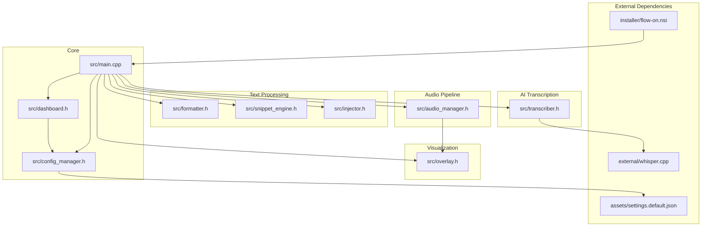
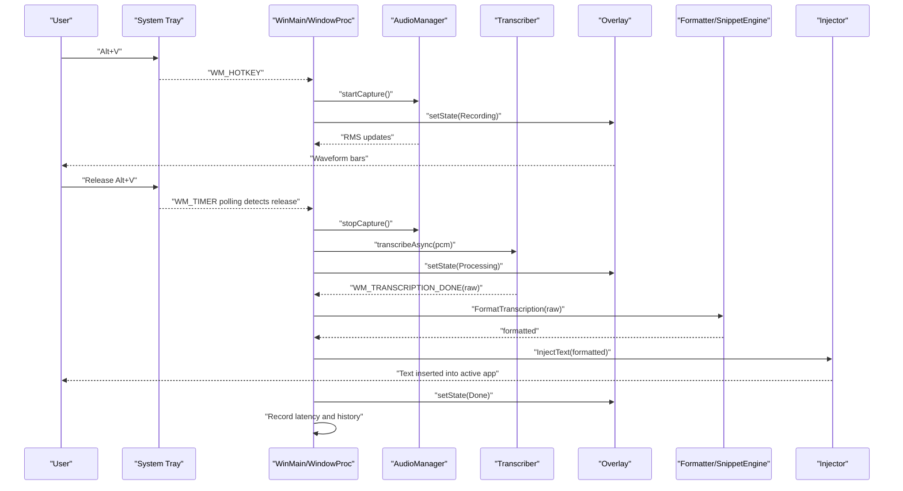
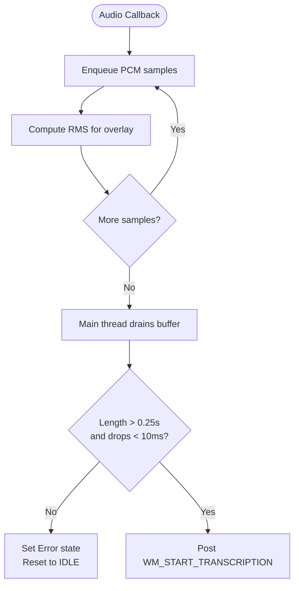
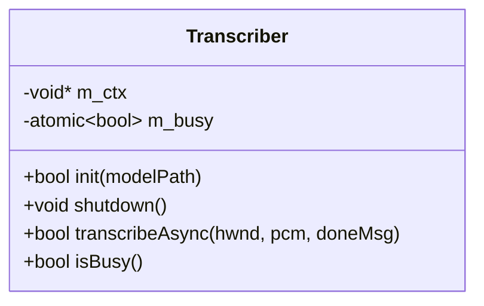
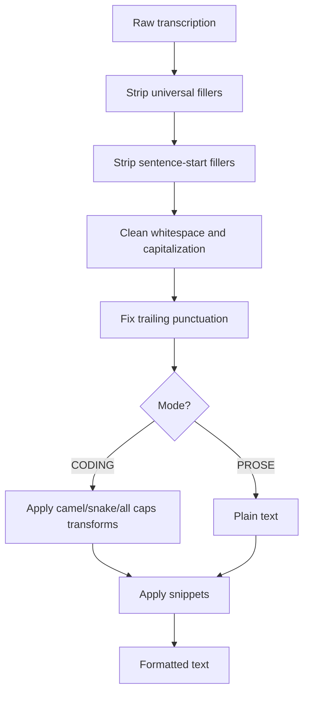
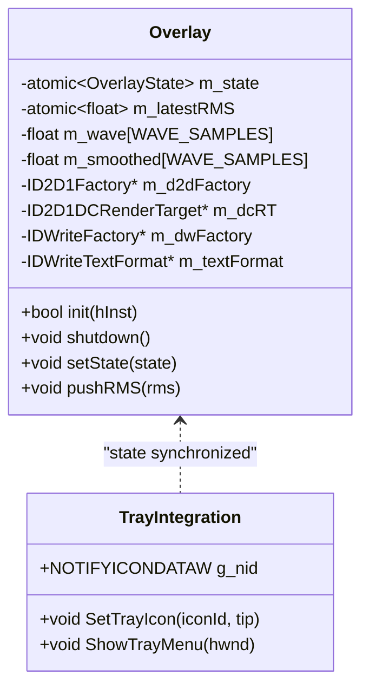
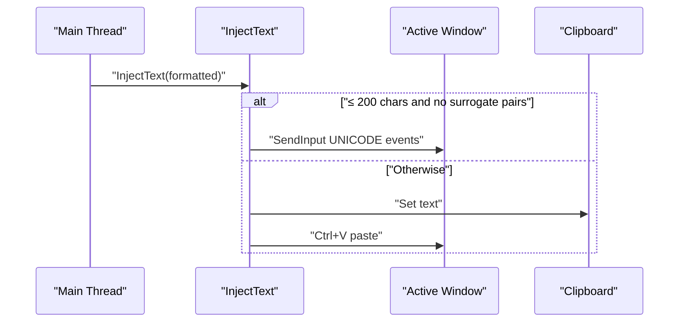
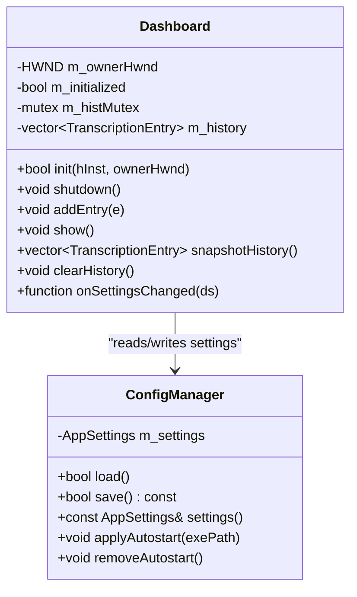
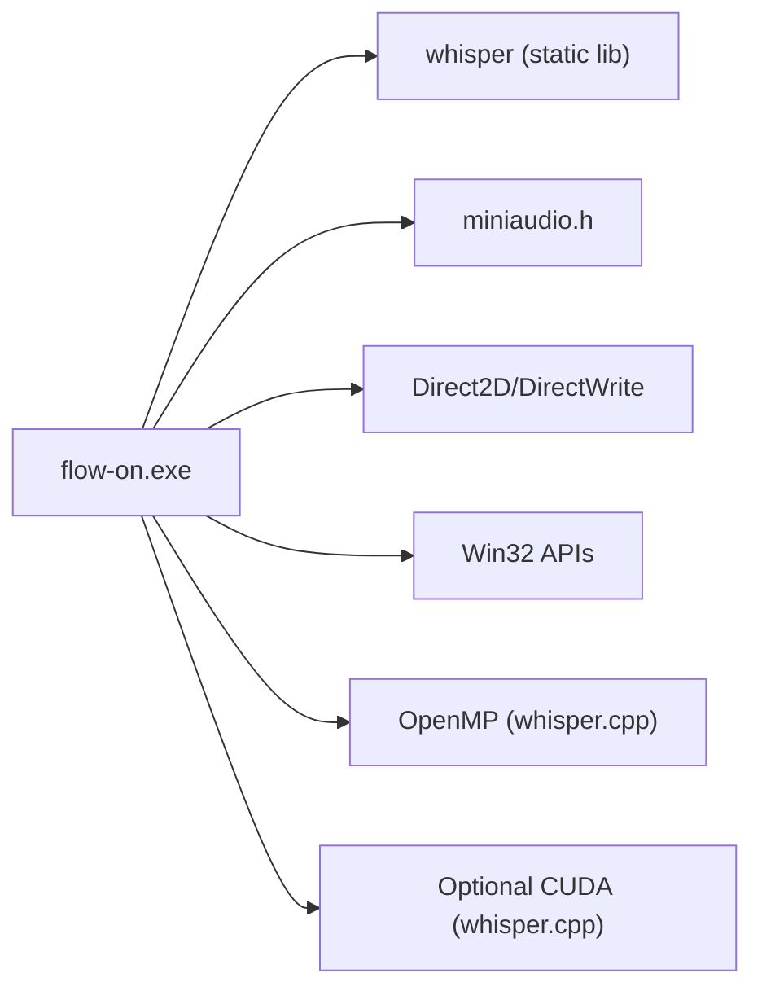

# Project Overview

<cite>
**Referenced Files in This Document**
- [README.md](file://README.md)
- [main.cpp](file://src/main.cpp)
- [audio_manager.h](file://src/audio_manager.h)
- [transcriber.h](file://src/transcriber.h)
- [overlay.h](file://src/overlay.h)
- [injector.h](file://src/injector.h)
- [dashboard.h](file://src/dashboard.h)
- [formatter.h](file://src/formatter.h)
- [snippet_engine.h](file://src/snippet_engine.h)
- [config_manager.h](file://src/config_manager.h)
- [CMakeLists.txt](file://CMakeLists.txt)
- [flow-on.nsi](file://installer/flow-on.nsi)
- [settings.default.json](file://assets/settings.default.json)
</cite>

## Table of Contents
1. [Introduction](#introduction)
2. [Project Structure](#project-structure)
3. [Core Components](#core-components)
4. [Architecture Overview](#architecture-overview)
5. [Detailed Component Analysis](#detailed-component-analysis)
6. [Dependency Analysis](#dependency-analysis)
7. [Performance Considerations](#performance-considerations)
8. [Troubleshooting Guide](#troubleshooting-guide)
9. [Conclusion](#conclusion)

## Introduction
FLOW-ON! is a professional Windows voice-to-text tool designed for productivity professionals who need reliable, secure, and fast speech-to-text capabilities. It is a local-first, zero-cloud, zero-telemetry solution that delivers real-time speech recognition with sub-3-second latency for typical 30-second recordings. The application provides a seamless workflow for quick dictation, code transcription, and snippet usage, integrating tightly with Windows through a system tray icon, hotkey-driven controls, and visual feedback.

Key value propositions:
- Local-first and privacy-focused: All processing happens on your machine with no cloud upload or telemetry.
- Real-time performance: Sub-3 second latency for typical recordings using optimized offline AI.
- Developer-centric features: Smart text injection, coding mode transforms, and snippet engine tailored for developers.
- Zero-setup deployment: Standalone installer bundles all dependencies for immediate use.

Target audience:
- Professionals who write frequently (writers, editors, researchers)
- Developers and engineers who need rapid code transcription and snippet insertion
- Content creators who require precise, fast, and distraction-free dictation

Primary use cases:
- Quick dictation for documents and emails
- Rapid code transcription with intelligent formatting and snippet expansion
- Boilerplate insertion and standardized note-taking

Differentiators from cloud-based alternatives:
- Complete privacy: No data leaves your machine
- Predictable performance: Consistent latency regardless of network conditions
- Low-latency operation: Optimized for sub-3 second turnaround
- Developer-first UX: Coding mode with camelCase/snake_case transformations and smart snippet expansion

## Project Structure
The project is organized around a modular C++20 architecture with clear separation of concerns:
- Core application lifecycle and UI integration in the main entry point
- Audio capture and buffering pipeline
- AI transcription using whisper.cpp backend
- Text formatting and snippet expansion
- Visual feedback via Direct2D overlay
- Text injection into the active application
- Configuration and persistence
- Installer packaging

**Diagram sources**
- [main.cpp](file://src/main.cpp#L362-L520)
- [audio_manager.h](file://src/audio_manager.h#L9-L42)
- [transcriber.h](file://src/transcriber.h#L10-L29)
- [overlay.h](file://src/overlay.h#L18-L94)
- [injector.h](file://src/injector.h#L4-L9)
- [dashboard.h](file://src/dashboard.h#L36-L69)
- [config_manager.h](file://src/config_manager.h#L21-L40)
- [CMakeLists.txt](file://CMakeLists.txt#L56-L94)
- [flow-on.nsi](file://installer/flow-on.nsi#L81-L124)
- [settings.default.json](file://assets/settings.default.json#L1-L16)

**Section sources**
- [README.md](file://README.md#L201-L232)
- [CMakeLists.txt](file://CMakeLists.txt#L56-L94)

## Core Components
This section introduces the primary building blocks that enable FLOW-ON!'s functionality.

- Audio Manager: Captures 16 kHz PCM audio, computes RMS for visualization, and buffers samples for transcription.
- Transcriber: Asynchronously runs whisper.cpp inference with GPU acceleration fallback and posts completion notifications.
- Overlay: Provides a Direct2D floating pill overlay with real-time waveform visualization and state indicators.
- Formatter: Applies four-pass cleaning and, in coding mode, transforms text into developer-friendly forms.
- Snippet Engine: Performs case-insensitive word-level substitutions for boilerplate and shortcuts.
- Injector: Sends text directly to the active application or falls back to clipboard paste for complex characters.
- Dashboard: Win32/WinUI 3 UI for history, settings, and model selection.
- Config Manager: Loads and persists settings to %APPDATA%\FLOW-ON\settings.json.

These components integrate through Windows messages and a shared state machine, enabling a responsive and efficient transcription workflow.

**Section sources**
- [audio_manager.h](file://src/audio_manager.h#L9-L42)
- [transcriber.h](file://src/transcriber.h#L10-L29)
- [overlay.h](file://src/overlay.h#L18-L94)
- [formatter.h](file://src/formatter.h#L4-L14)
- [snippet_engine.h](file://src/snippet_engine.h#L7-L26)
- [injector.h](file://src/injector.h#L4-L9)
- [dashboard.h](file://src/dashboard.h#L36-L69)
- [config_manager.h](file://src/config_manager.h#L21-L40)

## Architecture Overview
FLOW-ON! implements a layered architecture with a central state machine orchestrating audio capture, AI transcription, text formatting, and injection. The system tray integration provides persistent access, while the Direct2D overlay offers immediate visual feedback.

**Diagram sources**
- [main.cpp](file://src/main.cpp#L185-L342)
- [audio_manager.h](file://src/audio_manager.h#L13-L24)
- [transcriber.h](file://src/transcriber.h#L17-L21)
- [overlay.h](file://src/overlay.h#L23-L28)
- [formatter.h](file://src/formatter.h#L13-L14)
- [injector.h](file://src/injector.h#L8-L9)

## Detailed Component Analysis

### Audio Capture and Buffering
The audio pipeline captures 16 kHz PCM mono audio, computes RMS for visualization, and maintains a pre-allocated buffer for efficient draining. The audio callback thread enqueues samples into a lock-free queue, while the main thread drains and validates the buffer before transcription.

**Diagram sources**
- [audio_manager.h](file://src/audio_manager.h#L13-L33)
- [main.cpp](file://src/main.cpp#L244-L274)

**Section sources**
- [audio_manager.h](file://src/audio_manager.h#L9-L42)
- [main.cpp](file://src/main.cpp#L116-L128)

### AI Transcription with Whisper.cpp Backend
The transcription subsystem initializes the whisper.cpp model, manages GPU/CPU fallback, and coordinates asynchronous inference. It posts completion notifications back to the main thread for formatting and injection.

**Diagram sources**
- [transcriber.h](file://src/transcriber.h#L10-L29)

**Section sources**
- [transcriber.h](file://src/transcriber.h#L10-L29)
- [CMakeLists.txt](file://CMakeLists.txt#L33-L51)

### Text Formatting and Snippet Expansion
The formatter applies a four-pass cleaning process and, in coding mode, transforms text into developer-friendly forms. The snippet engine performs case-insensitive word-level substitutions, enabling rapid insertion of boilerplate and standardized phrases.

**Diagram sources**
- [formatter.h](file://src/formatter.h#L7-L13)
- [snippet_engine.h](file://src/snippet_engine.h#L7-L19)

**Section sources**
- [formatter.h](file://src/formatter.h#L4-L14)
- [snippet_engine.h](file://src/snippet_engine.h#L7-L26)

### Visual Feedback and System Tray Integration
The overlay renders a floating pill with animated waveform bars, processing spinner, and success/error indicators. The system tray icon provides quick access, context menus, and persistent presence across Explorer restarts.

**Diagram sources**
- [overlay.h](file://src/overlay.h#L18-L94)
- [main.cpp](file://src/main.cpp#L49-L110)

**Section sources**
- [overlay.h](file://src/overlay.h#L11-L94)
- [main.cpp](file://src/main.cpp#L49-L110)

### Text Injection and Clipboard Fallback
Text injection targets the currently focused application using SendInput for simple characters and falls back to clipboard paste for complex characters (surrogate pairs). This ensures robust insertion across diverse applications.

**Diagram sources**
- [injector.h](file://src/injector.h#L4-L9)

**Section sources**
- [injector.h](file://src/injector.h#L4-L9)

### Dashboard and Settings Management
The dashboard provides a Win32/WinUI 3 interface for viewing history, adjusting settings, and selecting models. Settings are persisted to %APPDATA%\FLOW-ON\settings.json with sensible defaults.

**Diagram sources**
- [dashboard.h](file://src/dashboard.h#L36-L69)
- [config_manager.h](file://src/config_manager.h#L21-L40)
- [settings.default.json](file://assets/settings.default.json#L1-L16)

**Section sources**
- [dashboard.h](file://src/dashboard.h#L23-L69)
- [config_manager.h](file://src/config_manager.h#L8-L39)
- [settings.default.json](file://assets/settings.default.json#L1-L16)

## Dependency Analysis
FLOW-ON! relies on a focused set of external libraries and Windows APIs to deliver its functionality. The build system integrates whisper.cpp as a static library and links against Direct2D for overlay rendering, Win32 for system tray and messaging, and audio capture via miniaudio.

**Diagram sources**
- [CMakeLists.txt](file://CMakeLists.txt#L84-L94)
- [CMakeLists.txt](file://CMakeLists.txt#L33-L51)

**Section sources**
- [CMakeLists.txt](file://CMakeLists.txt#L84-L94)
- [CMakeLists.txt](file://CMakeLists.txt#L33-L51)

## Performance Considerations
FLOW-ON! prioritizes speed and responsiveness through targeted optimizations:
- Lock-free audio queue to minimize latency between capture and transcription
- Direct2D GPU-accelerated overlay rendering at 60 FPS
- AVX2 and OpenMP optimizations in whisper.cpp for multi-core decoding
- Single-flight transcription guard to prevent redundant work
- Tiny English model for fast inference with acceptable accuracy

Typical performance characteristics:
- Audio capture latency: ~100 ms
- Transcription latency: ~12–18 seconds for 30 seconds of audio (tiny.en model, CPU AVX2)
- Overlay rendering: 60 FPS
- Memory footprint: ~400 MB (model in RAM)
- CPU utilization: <5% idle, 80–100% during transcription

Optimization levers:
- Enable NVIDIA CUDA for 5–10x speedup
- Adjust model choice and context parameters
- Disable timestamps and reduce audio context for speed

**Section sources**
- [README.md](file://README.md#L305-L325)
- [README.md](file://README.md#L370-L391)
- [CMakeLists.txt](file://CMakeLists.txt#L10-L21)

## Troubleshooting Guide
Common issues and resolutions:
- Hotkey conflicts: If Alt+V is taken, the application attempts Alt+Shift+V and updates the tray tooltip accordingly.
- Audio device errors: Ensure microphone permissions and availability; restart the audio service if needed.
- Whisper model not found: The model is bundled with the installer; verify disk space and reinstall if necessary.
- Installer failures: Confirm NSIS 3.x is installed and in PATH.

Operational tips:
- First-run setup creates settings.json in %APPDATA%\FLOW-ON
- Press Alt+V to start recording; release to transcribe
- Use the dashboard to review history and adjust settings

**Section sources**
- [README.md](file://README.md#L326-L346)
- [main.cpp](file://src/main.cpp#L162-L178)

## Conclusion
FLOW-ON! delivers a professional-grade, privacy-preserving voice-to-text solution for Windows. Its local-first architecture, optimized offline AI backend, and developer-centric features combine to provide a fast, reliable, and distraction-free transcription experience. The modular design and clear separation of concerns make it maintainable and extensible, while the installer ensures a smooth onboarding experience.