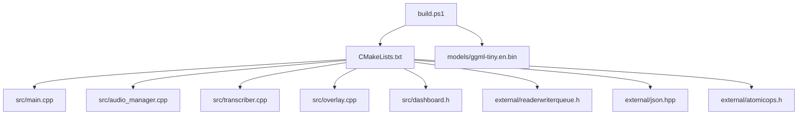
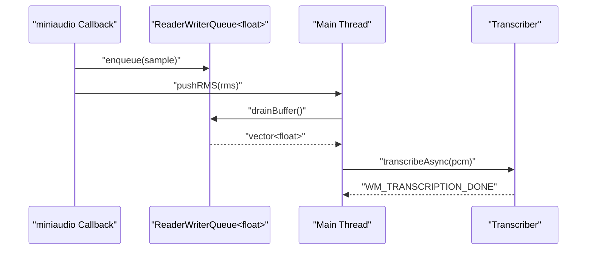
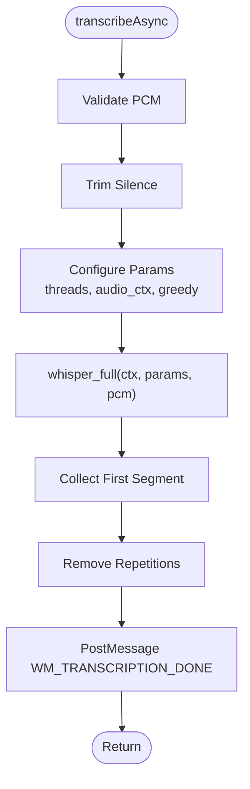
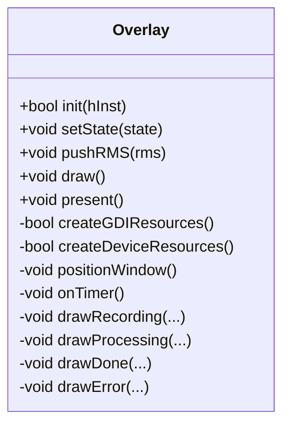
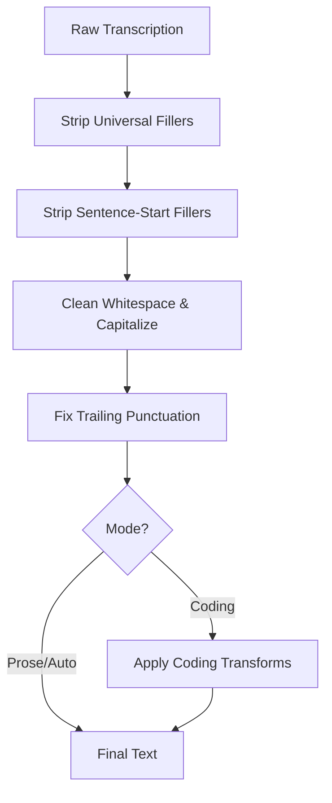
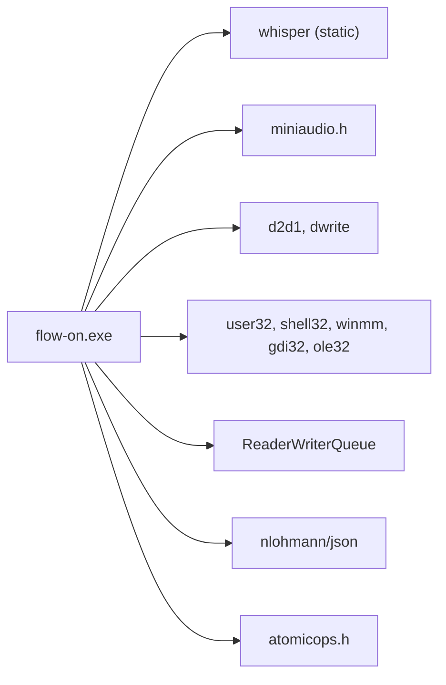

# Technology Stack

<cite>
**Referenced Files in This Document**
- [CMakeLists.txt](file://CMakeLists.txt)
- [README.md](file://README.md)
- [build.ps1](file://build.ps1)
- [src/main.cpp](file://src/main.cpp)
- [src/audio_manager.h](file://src/audio_manager.h)
- [src/audio_manager.cpp](file://src/audio_manager.cpp)
- [src/transcriber.h](file://src/transcriber.h)
- [src/transcriber.cpp](file://src/transcriber.cpp)
- [src/overlay.h](file://src/overlay.h)
- [src/overlay.cpp](file://src/overlay.cpp)
- [src/dashboard.h](file://src/dashboard.h)
- [src/formatter.h](file://src/formatter.h)
- [src/injector.h](file://src/injector.h)
- [src/snippet_engine.h](file://src/snippet_engine.h)
- [src/config_manager.h](file://src/config_manager.h)
- [external/readerwriterqueue.h](file://external/readerwriterqueue.h)
- [external/atomicops.h](file://external/atomicops.h)
- [external/json.hpp](file://external/json.hpp)
</cite>

## Table of Contents
1. [Introduction](#introduction)
2. [Project Structure](#project-structure)
3. [Core Components](#core-components)
4. [Architecture Overview](#architecture-overview)
5. [Detailed Component Analysis](#detailed-component-analysis)
6. [Dependency Analysis](#dependency-analysis)
7. [Performance Considerations](#performance-considerations)
8. [Troubleshooting Guide](#troubleshooting-guide)
9. [Conclusion](#conclusion)

## Introduction
This document describes the technology stack and architectural choices for Flow-On. The application is a Windows-native voice-to-text tool emphasizing local-first processing, real-time audio visualization, and efficient text injection. The stack centers on C++20 with modern concurrency primitives, a lock-free audio pipeline, Direct2D GPU-accelerated overlays, and Whisper.cpp for offline speech recognition with optional GPU acceleration. The build system leverages CMake with aggressive optimization flags and static linking, while Git submodules manage external dependencies.

## Project Structure
The repository follows a layered layout:
- Source modules under src/ implement the UI, audio, transcription, formatting, injection, and dashboard.
- External dependencies under external/ include single-file headers for audio, concurrency, JSON, and atomic utilities.
- Top-level CMake configuration orchestrates the build, dependency inclusion, and post-build steps.
- A PowerShell build script automates model download, CMake invocation, and optional installer generation.



**Diagram sources**
- [CMakeLists.txt](file://CMakeLists.txt#L56-L94)
- [build.ps1](file://build.ps1#L44-L58)

**Section sources**
- [CMakeLists.txt](file://CMakeLists.txt#L1-L133)
- [README.md](file://README.md#L201-L232)

## Core Components
- Language and Concurrency
  - C++20 with std::atomic for the finite-state machine and shared state, std::thread for asynchronous transcription, and moodycamel::ReaderWriterQueue for lock-free audio buffering.
- Audio Pipeline
  - miniaudio.h captures 16 kHz mono PCM; RMS computed per callback; lock-free enqueue; drain on demand for transcription.
- Speech Recognition
  - whisper.cpp integrated as a static library with AVX2 and optional CUDA; OpenMP enabled; flash attention enabled; tuned decoding parameters for throughput.
- Text Processing
  - Four-pass formatter using wregex and cwctype-like operations for Unicode-aware cleaning and transforms; snippet engine for case-insensitive substitutions.
- UI
  - Win32 message loop for system tray, hotkey, and timers; Direct2D overlay with UpdateLayeredWindow for GPU-accelerated composition; WinUI 3 dashboard (optional) via Windows App SDK.
- IPC and Threading
  - Windows messages (WM_HOTKEY, WM_TRANSCRIPTION_DONE) coordinate state transitions; atomic guards prevent races; single-flight transcription gating.

**Section sources**
- [README.md](file://README.md#L86-L96)
- [src/main.cpp](file://src/main.cpp#L67-L128)
- [src/audio_manager.h](file://src/audio_manager.h#L9-L41)
- [src/transcriber.h](file://src/transcriber.h#L10-L28)
- [src/overlay.h](file://src/overlay.h#L18-L93)
- [external/readerwriterqueue.h](file://external/readerwriterqueue.h#L22-L34)

## Architecture Overview
The system operates a main thread running a Win32 message loop, coordinating:
- System tray icon and hotkey registration
- Audio capture via miniaudio on a dedicated callback thread
- Direct2D overlay rendering on a timer-driven loop
- Asynchronous Whisper transcription on a worker thread
- Text formatting, snippet expansion, and injection back to the active application

```mermaid
graph TB
subgraph "Main Thread"
M1["Win32 Message Loop"]
M2["System Tray + Hotkey"]
M3["Overlay Timer"]
M4["Dashboard"]
end
subgraph "Audio"
A1["miniaudio Callback"]
A2["RMS + Lock-free Queue"]
A3["Drain Buffer"]
end
subgraph "Recognition"
R1["Whisper.cpp (Static Lib)"]
R2["OpenMP Threads"]
end
subgraph "Text"
T1["Formatter (wregex)"]
T2["Snippet Engine"]
T3["Injector (SendInput/Clipboard)"]
end
M1 --> M2
M1 --> M3
M1 --> M4
A1 --> A2 --> A3 --> R1
R1 --> T1 --> T2 --> T3
M1 <- --> R1
```

**Diagram sources**
- [src/main.cpp](file://src/main.cpp#L362-L520)
- [src/audio_manager.cpp](file://src/audio_manager.cpp#L30-L56)
- [src/transcriber.cpp](file://src/transcriber.cpp#L103-L225)
- [src/overlay.cpp](file://src/overlay.cpp#L29-L74)

## Detailed Component Analysis

### Audio Manager (miniaudio + Lock-Free Ring Buffer)
- Responsibilities
  - Initialize miniaudio capture at 16 kHz mono, 100 ms period
  - Compute RMS per callback and expose it to the overlay
  - Enqueue PCM samples into a lock-free queue; track drops
  - Drain the buffer on demand for transcription
- Concurrency
  - Audio callback thread enqueues; main thread drains; moodycamel::ReaderWriterQueue ensures lock-free transfer
- Performance
  - Pre-allocated ring buffer for 30 seconds of audio; move semantics avoid copies



**Diagram sources**
- [src/audio_manager.cpp](file://src/audio_manager.cpp#L30-L56)
- [src/audio_manager.h](file://src/audio_manager.h#L9-L41)
- [src/transcriber.cpp](file://src/transcriber.cpp#L103-L225)
- [external/readerwriterqueue.h](file://external/readerwriterqueue.h#L231-L280)

**Section sources**
- [src/audio_manager.h](file://src/audio_manager.h#L9-L41)
- [src/audio_manager.cpp](file://src/audio_manager.cpp#L39-L122)
- [external/readerwriterqueue.h](file://external/readerwriterqueue.h#L22-L34)

### Transcriber (Whisper.cpp Integration)
- Responsibilities
  - Initialize whisper context with GPU preference and flash attention
  - Perform silence trimming and parameter tuning for throughput
  - Run inference on a detached worker thread
  - Post results back to the main thread via a Windows message
- Optimizations
  - Single-threaded segment decoding, reduced audio context scaling, greedy decoding with fallback, suppressed timestamps and special tokens
  - Repetition removal heuristic for tiny model stability
- GPU Support
  - Optional cuBLAS via CMake flags; falls back to CPU if GPU init fails



**Diagram sources**
- [src/transcriber.cpp](file://src/transcriber.cpp#L103-L225)

**Section sources**
- [src/transcriber.h](file://src/transcriber.h#L10-L28)
- [src/transcriber.cpp](file://src/transcriber.cpp#L79-L225)
- [CMakeLists.txt](file://CMakeLists.txt#L33-L51)

### Overlay (Direct2D GPU-Accelerated)
- Responsibilities
  - Create layered, always-on-top window with a Direct2D DC render target
  - Render animated states: recording (waveform + pulsing dot), processing (spinner), done/error (animated circle/check/X)
  - Composite via UpdateLayeredWindow with per-pixel alpha for zero-outline transparency
- Rendering
  - Timer-driven redraw at ~60 FPS; smooth animations with easing and exponential smoothing
- Robustness
  - Handles auto-hide after transient states; recovers from device loss conditions



**Diagram sources**
- [src/overlay.h](file://src/overlay.h#L18-L93)
- [src/overlay.cpp](file://src/overlay.cpp#L29-L74)

**Section sources**
- [src/overlay.h](file://src/overlay.h#L18-L93)
- [src/overlay.cpp](file://src/overlay.cpp#L184-L659)

### Text Processing Pipeline (Formatter + Snippet Engine)
- Formatter
  - Four-pass pipeline: filler removal, sentence-start fillers, whitespace and capitalization cleanup, trailing punctuation fix, and optional coding transforms
  - Mode detection influences behavior (auto/prose/coding)
- Snippet Engine
  - Case-insensitive word-level replacement with longest-first matching
- Integration
  - Applied after transcription; result injected into the active window



**Diagram sources**
- [src/formatter.h](file://src/formatter.h#L7-L13)
- [src/snippet_engine.h](file://src/snippet_engine.h#L7-L19)

**Section sources**
- [src/formatter.h](file://src/formatter.h#L7-L13)
- [src/snippet_engine.h](file://src/snippet_engine.h#L7-L26)
- [src/injector.h](file://src/injector.h#L4-L9)

### Dashboard (Win32 Listbox + WinUI 3 Bridge)
- Responsibilities
  - History storage and UI updates; settings persistence; optional WinUI 3 window via Windows App SDK
- Threading
  - Thread-safe history access guarded by a mutex; UI updates dispatched from the main thread

**Section sources**
- [src/dashboard.h](file://src/dashboard.h#L36-L69)

### Configuration Management (nlohmann/json)
- Responsibilities
  - Load/save settings from/to %APPDATA%\FLOW-ON\settings.json
  - Provide defaults and autostart registry management

**Section sources**
- [src/config_manager.h](file://src/config_manager.h#L21-L40)
- [external/json.hpp](file://external/json.hpp#L1-L100)

## Dependency Analysis
- External Libraries
  - whisper.cpp: static library with AVX2, flash attention, optional cuBLAS
  - miniaudio.h: single-header audio capture
  - moodycamel ReaderWriterQueue: lock-free queue with atomic ops
  - nlohmann/json: JSON parsing and serialization
  - atomicops.h: portable atomic primitives for queue internals
- System Libraries
  - Windows: winmm, user32, shell32, gdi32, gdiplus, d2d1, dwrite, ole32, oleaut32, uuid
- Build Targets
  - flow-on executable with WIN32 subsystem; post-build copies model and whisper DLLs



**Diagram sources**
- [CMakeLists.txt](file://CMakeLists.txt#L84-L94)

**Section sources**
- [CMakeLists.txt](file://CMakeLists.txt#L33-L51)
- [CMakeLists.txt](file://CMakeLists.txt#L84-L94)

## Performance Considerations
- Compiler and Linker
  - Release flags: /arch:AVX2, /O2, /Oi, /Ot, /fp:fast, /GL with LTCG; Debug: /arch:AVX2, /fp:fast
  - Defines: WIN32_LEAN_AND_MEAN, NOMINMAX, UNICODE, _UNICODE
- Audio
  - Lock-free ring buffer eliminates contention; 100 ms periods balance latency and CPU cost
- Transcription
  - Single-segment, greedy decoding with reduced audio context; OpenMP uses all cores minus one; flash attention reduces memory traffic
- UI
  - Direct2D GPU rendering with UpdateLayeredWindow; ~60 FPS timer; per-pixel alpha avoids compositing artifacts
- Memory
  - Pre-allocated buffers; PCM moved instead of copied; secure zeroing on shutdown

**Section sources**
- [CMakeLists.txt](file://CMakeLists.txt#L10-L28)
- [README.md](file://README.md#L305-L325)
- [src/audio_manager.cpp](file://src/audio_manager.cpp#L18-L22)
- [src/transcriber.cpp](file://src/transcriber.cpp#L138-L179)
- [src/overlay.cpp](file://src/overlay.cpp#L17-L24)

## Troubleshooting Guide
- Hotkey not working
  - Verify VK code and conflict resolution; fallback to Alt+Shift+V if needed
- No audio device
  - Ensure microphone availability and Windows sound settings; restart audio service if necessary
- Whisper model not found
  - Confirm model download and presence in models/; check disk space
- Installer failures
  - Ensure NSIS is installed and makensis is in PATH; verify Windows App SDK runtime availability

**Section sources**
- [README.md](file://README.md#L326-L346)

## Conclusion
Flow-On’s technology stack balances performance, portability, and maintainability:
- C++20 and modern concurrency enable low-latency, race-free operation.
- miniaudio and a lock-free queue deliver robust audio capture and buffering.
- Whisper.cpp with AVX2 and optional CUDA provides efficient offline transcription.
- Direct2D overlay delivers responsive, GPU-accelerated UI feedback.
- CMake and Git submodules streamline build and dependency management.
These choices yield a ship-ready, zero-cloud, zero-telemetry Windows application optimized for real-world usage.