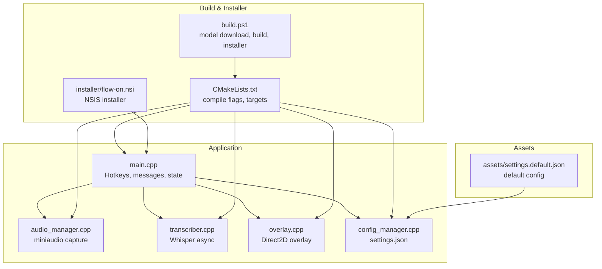
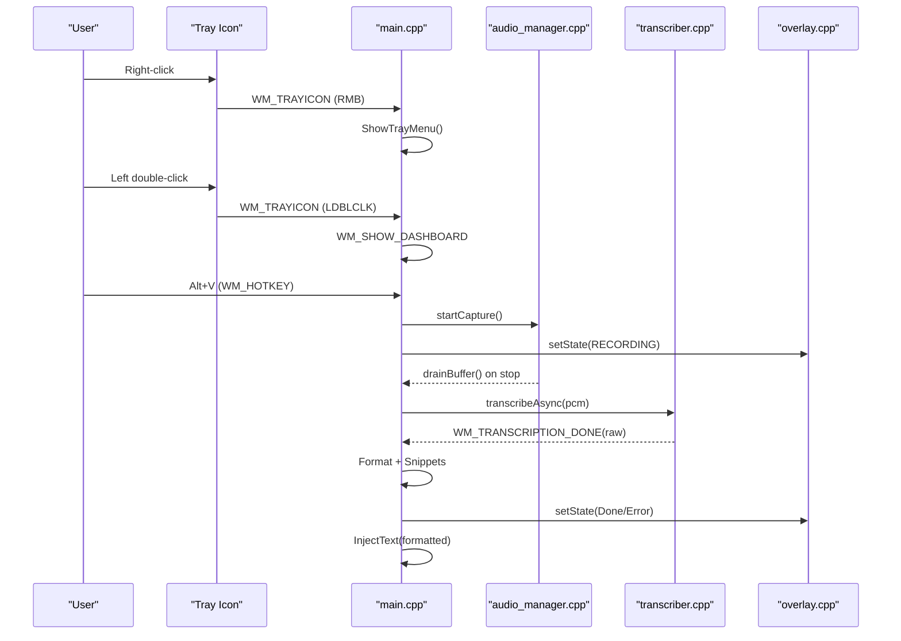
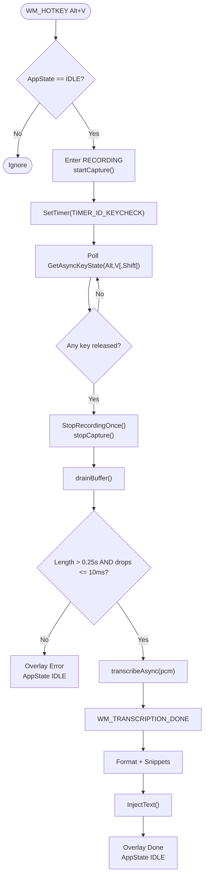
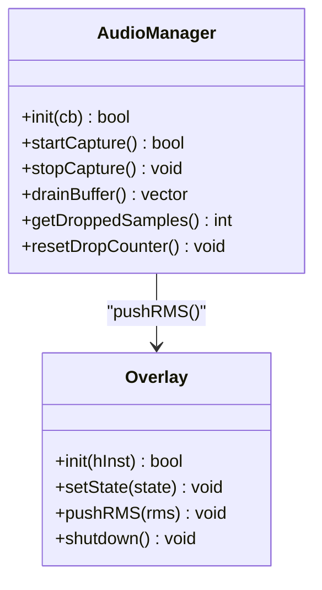
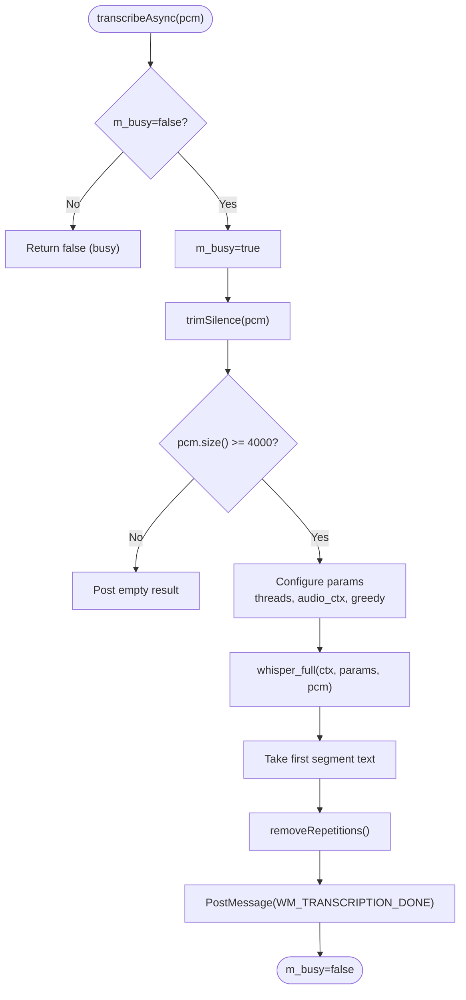
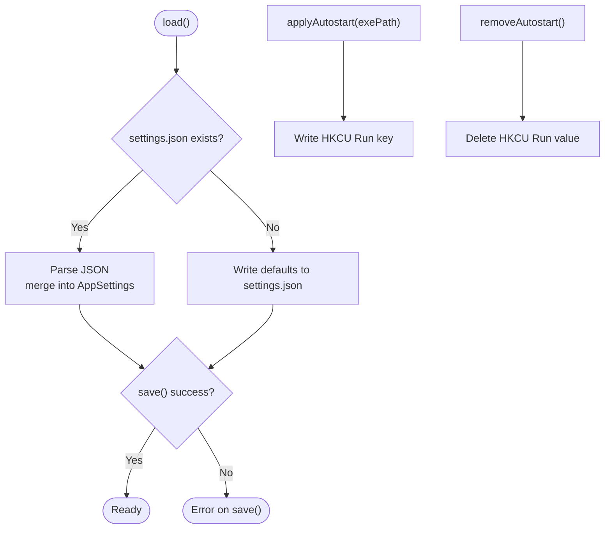
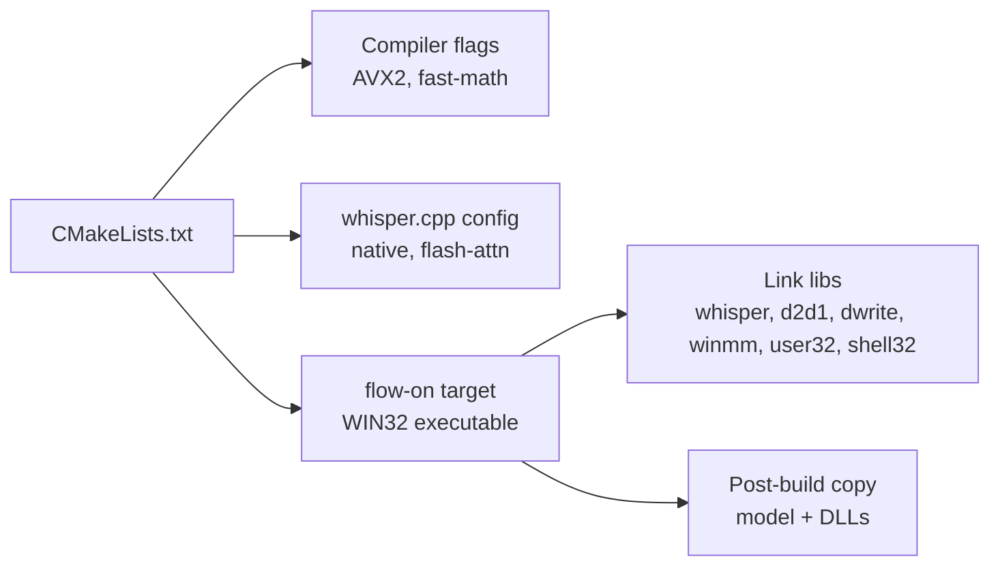

# Troubleshooting

<cite>
**Referenced Files in This Document**
- [README.md](file://README.md)
- [main.cpp](file://src/main.cpp)
- [audio_manager.cpp](file://src/audio_manager.cpp)
- [transcriber.cpp](file://src/transcriber.cpp)
- [overlay.cpp](file://src/overlay.cpp)
- [config_manager.cpp](file://src/config_manager.cpp)
- [build.ps1](file://build.ps1)
- [CMakeLists.txt](file://CMakeLists.txt)
- [flow-on.nsi](file://installer/flow-on.nsi)
- [settings.default.json](file://assets/settings.default.json)
</cite>

## Table of Contents
1. [Introduction](#introduction)
2. [Project Structure](#project-structure)
3. [Core Components](#core-components)
4. [Architecture Overview](#architecture-overview)
5. [Detailed Component Analysis](#detailed-component-analysis)
6. [Dependency Analysis](#dependency-analysis)
7. [Performance Considerations](#performance-considerations)
8. [Troubleshooting Guide](#troubleshooting-guide)
9. [Conclusion](#conclusion)
10. [Appendices](#appendices)

## Introduction
This document provides a comprehensive troubleshooting guide for Flow-On. It focuses on diagnosing and resolving common issues across hotkeys, audio, Whisper model management, installer/deployment, performance, system integration, diagnostics, logging, and recovery procedures. The goal is to help users quickly identify root causes and apply verified fixes using the repository’s own implementation details and documented behaviors.

## Project Structure
Flow-On is a Windows desktop application integrating audio capture, real-time waveform overlay, asynchronous Whisper transcription, text formatting, snippet expansion, and system integration (tray, hotkeys, autostart). The build system and installer are provided to streamline deployment.

**Diagram sources**
- [main.cpp](file://src/main.cpp#L149-L357)
- [audio_manager.cpp](file://src/audio_manager.cpp#L58-L122)
- [transcriber.cpp](file://src/transcriber.cpp#L79-L226)
- [overlay.cpp](file://src/overlay.cpp#L29-L74)
- [config_manager.cpp](file://src/config_manager.cpp#L24-L108)
- [CMakeLists.txt](file://CMakeLists.txt#L10-L94)
- [build.ps1](file://build.ps1#L21-L85)
- [flow-on.nsi](file://installer/flow-on.nsi#L66-L124)
- [settings.default.json](file://assets/settings.default.json#L1-L16)

**Section sources**
- [README.md](file://README.md#L201-L232)
- [CMakeLists.txt](file://CMakeLists.txt#L56-L94)
- [build.ps1](file://build.ps1#L1-L89)
- [flow-on.nsi](file://installer/flow-on.nsi#L1-L157)

## Core Components
- Hotkey and state machine: registers Alt+V (and Alt+Shift+V fallback), polls for release, transitions through IDLE → RECORDING → TRANSCRIBING → INJECTING.
- Audio capture: miniaudio PCM capture at 16 kHz, lock-free ring buffer, RMS metering, and drop detection.
- Whisper transcription: async, single-flight, GPU-enabled by default with CPU fallback, optimized decoding parameters.
- Overlay: Direct2D layered window with animated feedback for recording, processing, done, and error states.
- Configuration: settings.json in %APPDATA%\FLOW-ON with hotkey, audio, transcription, formatting, snippets, and UI options.
- Installer: NSIS script installs runtime, model, icons, shortcuts, and sets autostart and uninstall registry entries.

**Section sources**
- [main.cpp](file://src/main.cpp#L162-L203)
- [audio_manager.cpp](file://src/audio_manager.cpp#L39-L111)
- [transcriber.cpp](file://src/transcriber.cpp#L103-L226)
- [overlay.cpp](file://src/overlay.cpp#L140-L158)
- [config_manager.cpp](file://src/config_manager.cpp#L24-L108)
- [flow-on.nsi](file://installer/flow-on.nsi#L103-L124)

## Architecture Overview
The application initializes a hidden message window, tray icon, audio capture, Direct2D overlay, Whisper model, and dashboard. Hotkey registration occurs on window creation; audio capture begins on hotkey press; transcription is triggered asynchronously; formatted text is injected into the active window; overlay reflects state changes.

**Diagram sources**
- [main.cpp](file://src/main.cpp#L162-L274)
- [audio_manager.cpp](file://src/audio_manager.cpp#L83-L111)
- [transcriber.cpp](file://src/transcriber.cpp#L103-L226)
- [overlay.cpp](file://src/overlay.cpp#L140-L158)

## Detailed Component Analysis

### Hotkey and State Machine
- Registration: Alt+V is registered first; if taken, Alt+Shift+V is attempted. If both fail, a warning is shown and the app exits tray initialization.
- Release detection: A timer polls GetAsyncKeyState for Alt/V/Shift to reliably detect release even on a hidden window.
- State transitions: IDLE → RECORDING → TRANSCRIBING → INJECTING; errors revert to IDLE with a brief error overlay.
- Race prevention: StopRecordingOnce uses compare-and-swap to ensure only one path triggers transcription.

**Diagram sources**
- [main.cpp](file://src/main.cpp#L162-L274)
- [audio_manager.cpp](file://src/audio_manager.cpp#L83-L111)
- [transcriber.cpp](file://src/transcriber.cpp#L103-L226)

**Section sources**
- [main.cpp](file://src/main.cpp#L162-L222)
- [README.md](file://README.md#L326-L331)

### Audio Capture and Overlay
- Audio capture: 16 kHz mono, 100 ms period, lock-free enqueue, RMS computed, overlay receives RMS updates.
- Drop detection: dropped sample counter incremented when ring buffer overflows; used to gate transcription.
- Overlay: Direct2D layered window with GPU-accelerated drawing; animates recording waveform and states.

**Diagram sources**
- [audio_manager.cpp](file://src/audio_manager.cpp#L39-L111)
- [overlay.cpp](file://src/overlay.cpp#L140-L163)

**Section sources**
- [audio_manager.cpp](file://src/audio_manager.cpp#L39-L111)
- [overlay.cpp](file://src/overlay.cpp#L29-L74)

### Whisper Transcription
- Initialization: attempts GPU, falls back to CPU; loads model from executable-relative models directory.
- Async transcription: single-flight guard prevents concurrent runs; validates minimum length; trims silence; configures decoding parameters for throughput.
- Output: first segment text; removes hallucinated repetitions; posts result back to main thread.

**Diagram sources**
- [transcriber.cpp](file://src/transcriber.cpp#L103-L226)

**Section sources**
- [transcriber.cpp](file://src/transcriber.cpp#L79-L93)
- [README.md](file://README.md#L338-L341)

### Configuration and Autostart
- Settings location: %APPDATA%\FLOW-ON\settings.json; defaults written on first run.
- Autostart: writes HKCU\Software\Microsoft\Windows\CurrentVersion\Run; removal supported.
- UI toggles: dashboard can enable/disable GPU and autostart; persisted to settings.

**Diagram sources**
- [config_manager.cpp](file://src/config_manager.cpp#L24-L108)

**Section sources**
- [config_manager.cpp](file://src/config_manager.cpp#L24-L108)
- [flow-on.nsi](file://installer/flow-on.nsi#L103-L106)

## Dependency Analysis
- Build flags emphasize AVX2 and fast math; whisper.cpp configured with native optimizations and flash attention; optional CUDA support controlled via CMake flags.
- Link libraries include whisper, Direct2D/DWrite for overlay, and standard Windows subsystem libraries.
- Post-build copies model and whisper DLLs into output directory for standalone operation.

**Diagram sources**
- [CMakeLists.txt](file://CMakeLists.txt#L10-L94)
- [CMakeLists.txt](file://CMakeLists.txt#L99-L125)

**Section sources**
- [CMakeLists.txt](file://CMakeLists.txt#L10-L94)
- [CMakeLists.txt](file://CMakeLists.txt#L99-L125)

## Performance Considerations
- Audio latency: ~100 ms due to miniaudio callback timing.
- Transcription latency: ~12–18 s for 30 s audio using tiny.en model on CPU AVX2.
- Overlay rendering: 60 FPS via Direct2D timer-driven updates.
- Memory: ~400 MB with model in RAM.
- CPU utilization: <5% idle, 80–100% during transcription; all cores used.
- GPU acceleration: Optional CUDA for 5–10x speedup; enabled via CMake flags.

**Section sources**
- [README.md](file://README.md#L305-L325)
- [README.md](file://README.md#L321-L324)

## Troubleshooting Guide

### Hotkey Problems
Symptoms:
- Alt+V does nothing.
- Conflicts with other applications.

Checklist:
- Verify VK code and modifiers in settings.json. The default hotkey is Alt+V (VK code 86).
- Confirm no other application has registered Alt+V or Alt+Shift+V.
- Restart the application to re-register hotkeys.
- If Alt+V is taken, the app attempts Alt+Shift+V and updates the tray tooltip accordingly.

Resolution steps:
1. Open %APPDATA%\FLOW-ON\settings.json and confirm hotkey modifiers and vkCode.
2. Temporarily disable or close conflicting applications.
3. Restart Flow-On to re-register hotkeys.
4. If Alt+V is taken, use Alt+Shift+V (fallback) as indicated by the tray tooltip.

Diagnostic commands:
- Use a key state monitoring tool to verify whether Alt+V or Alt+Shift+V is captured elsewhere.
- Check tray tooltip for “Using Alt+Shift+V (Alt+V was taken)” to confirm fallback activation.

**Section sources**
- [README.md](file://README.md#L326-L331)
- [main.cpp](file://src/main.cpp#L162-L178)
- [config_manager.cpp](file://src/config_manager.cpp#L24-L58)

### Audio-Related Issues
Symptoms:
- “No available audio device.”
- Microphone not detected.
- Audio capture errors or stuttering.

Checklist:
- Ensure a microphone is physically plugged in and recognized by Windows.
- Check Windows Sound settings and privacy controls for microphone access.
- Restart the audio service if needed.
- Review overlay error state indicating “Audio capture error (drops)” and adjust buffer size.

Resolution steps:
1. Plug in a working microphone and verify in Windows Settings.
2. Allow the app access to the microphone in privacy settings.
3. Restart the audio service if necessary.
4. Reduce audio buffer size in settings to minimize drop risk.
5. If drops persist, reduce background CPU load or close resource-heavy apps.

Diagnostic commands:
- Use the Windows Sound settings to test the microphone.
- Monitor the overlay error state for “Too short, try again” or “Audio capture error.”

**Section sources**
- [README.md](file://README.md#L333-L336)
- [main.cpp](file://src/main.cpp#L436-L444)
- [audio_manager.cpp](file://src/audio_manager.cpp#L39-L111)

### Whisper Model Troubleshooting
Symptoms:
- “Model Not Found” dialog.
- Download failures or incomplete model.
- Disk space issues.

Checklist:
- Model path: <exe-dir>\models\ggml-tiny.en.bin.
- Ensure sufficient disk space (~75 MB).
- Use the build script to download the model if missing.

Resolution steps:
1. Verify the model file exists at the expected path.
2. If missing, run the build script to download the model.
3. Ensure free disk space for the model.
4. If corruption suspected, delete the model file and re-run the download step.

Diagnostic commands:
- Check the model path printed in the “Model Not Found” dialog.
- Use the build script to force-download the model.

**Section sources**
- [README.md](file://README.md#L338-L341)
- [main.cpp](file://src/main.cpp#L462-L475)
- [build.ps1](file://build.ps1#L21-L32)

### Installer and Deployment Issues
Symptoms:
- Installer fails to build.
- NSIS not found.
- Autostart or shortcuts not created.

Checklist:
- Ensure NSIS 3.x is installed and makensis is in PATH.
- Verify the Windows App SDK runtime is present or allow the installer to download it.
- Confirm autostart registry keys and uninstall entries are created.

Resolution steps:
1. Install NSIS and add makensis to PATH.
2. Run the build script with the -Installer flag to generate the installer.
3. If the runtime is missing, allow the installer to download it or pre-provision redist.
4. Verify HKCU\Software\Microsoft\Windows\CurrentVersion\Run contains the FLOW-ON entry for autostart.

Diagnostic commands:
- Confirm makensis availability in PATH.
- Check installer logs for runtime installation status.

**Section sources**
- [README.md](file://README.md#L343-L346)
- [build.ps1](file://build.ps1#L62-L85)
- [flow-on.nsi](file://installer/flow-on.nsi#L66-L124)

### Performance-Related Problems
Symptoms:
- Slow transcription.
- High CPU usage.
- Poor overlay responsiveness.

Checklist:
- Confirm GPU acceleration is enabled if supported.
- Reduce audio context and segment count for shorter clips.
- Ensure sufficient CPU cores are available.

Resolution steps:
1. Enable CUDA via CMake flags for GPU acceleration.
2. Keep timestamps disabled and single-segment mode for speed.
3. Reduce audio context for shorter clips.
4. Close background applications to free CPU resources.

Diagnostic commands:
- Monitor CPU usage during transcription.
- Adjust whisper parameters in the transcriber code if building locally.

**Section sources**
- [README.md](file://README.md#L321-L324)
- [transcriber.cpp](file://src/transcriber.cpp#L138-L182)

### System Integration Issues
Symptoms:
- Autostart not working.
- Registry problems after uninstall.
- Start menu shortcuts missing.

Checklist:
- Verify HKCU Run key for autostart.
- Confirm uninstaller removes registry keys and files.
- Check Start Menu and Desktop shortcuts.

Resolution steps:
1. Use the dashboard to toggle autostart; the app writes HKCU Run.
2. Uninstall via the Start Menu uninstall shortcut; the uninstaller removes registry keys and files.
3. Manually remove Start Menu entries if missing.

Diagnostic commands:
- Check HKCU\Software\Microsoft\Windows\CurrentVersion\Run for the FLOW-ON entry.
- Verify uninstall registry keys under HKLM\Software\Microsoft\Windows\CurrentVersion\Uninstall.

**Section sources**
- [config_manager.cpp](file://src/config_manager.cpp#L82-L107)
- [flow-on.nsi](file://installer/flow-on.nsi#L103-L124)
- [flow-on.nsi](file://installer/flow-on.nsi#L129-L156)

### Diagnostic Commands and Tools
- Build and installer:
  - Use the build script to download the model, configure, and build the project.
  - Generate the installer with the -Installer flag.
- Audio:
  - Test microphone in Windows Sound settings.
  - Monitor overlay error states for capture issues.
- Whisper:
  - Confirm model path and existence.
  - Re-download the model if needed.
- System:
  - Check autostart registry key.
  - Verify uninstaller cleanup.

**Section sources**
- [build.ps1](file://build.ps1#L21-L85)
- [main.cpp](file://src/main.cpp#L436-L475)
- [config_manager.cpp](file://src/config_manager.cpp#L82-L107)
- [flow-on.nsi](file://installer/flow-on.nsi#L129-L156)

### Logging and Debugging Techniques
- Debug output:
  - The main thread logs debug strings for duplicate messages and latency measurements.
  - Whisper logs debug strings for unexpected multiple segments and repetition collapsing.
- Overlay:
  - Overlay state changes are reflected visually; errors and done states are animated.
- Recommendations:
  - Use a debugger to inspect state transitions and message handling.
  - Enable verbose logging in your build environment if needed.

**Section sources**
- [main.cpp](file://src/main.cpp#L287-L340)
- [transcriber.cpp](file://src/transcriber.cpp#L200-L216)

### Recovery Procedures
- Corrupted configuration:
  - Delete settings.json to regenerate defaults on next run.
- Corrupted model:
  - Delete the model file and re-run the model download step.
- Uninstallation:
  - Use the uninstaller to remove files, shortcuts, and registry entries.
  - Manually remove remaining registry keys if necessary.

**Section sources**
- [config_manager.cpp](file://src/config_manager.cpp#L24-L58)
- [main.cpp](file://src/main.cpp#L462-L475)
- [flow-on.nsi](file://installer/flow-on.nsi#L129-L156)

### Platform-Specific Considerations
- Windows 10/11 x64 required.
- Direct2D overlay requires compatible display drivers.
- GPU acceleration depends on CUDA availability and proper CMake configuration.

**Section sources**
- [README.md](file://README.md#L17-L21)
- [overlay.cpp](file://src/overlay.cpp#L29-L74)
- [CMakeLists.txt](file://CMakeLists.txt#L48-L51)

## Conclusion
This guide consolidates Flow-On’s troubleshooting pathways using concrete implementation details. By verifying hotkey registration, audio capture, model presence, installer prerequisites, and system integration, most issues can be resolved quickly. Use the diagnostic commands and logging techniques to pinpoint root causes, and follow the recovery procedures for corrupted configurations or models.

## Appendices

### Quick Reference: Where to Look
- Hotkey: main.cpp hotkey registration and fallback; settings.json hotkey definition.
- Audio: audio_manager.cpp capture and drop detection; overlay error states.
- Whisper: transcriber.cpp initialization and async transcription; model path resolution.
- Config: config_manager.cpp settings load/save and autostart registry.
- Installer: flow-on.nsi runtime and registry entries; build.ps1 model download.

**Section sources**
- [main.cpp](file://src/main.cpp#L162-L178)
- [audio_manager.cpp](file://src/audio_manager.cpp#L39-L111)
- [transcriber.cpp](file://src/transcriber.cpp#L79-L93)
- [config_manager.cpp](file://src/config_manager.cpp#L24-L108)
- [flow-on.nsi](file://installer/flow-on.nsi#L66-L124)
- [build.ps1](file://build.ps1#L21-L32)